# 数据链路层

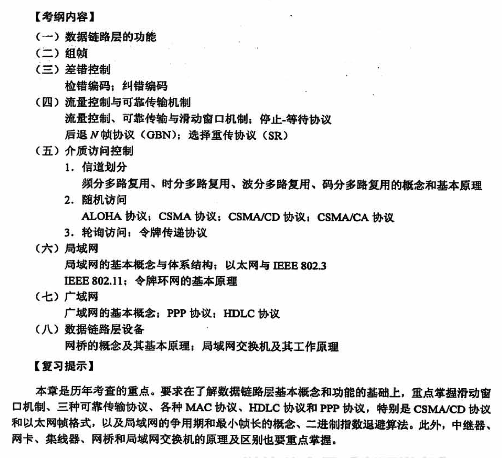

## 3.1 数据链路层的功能

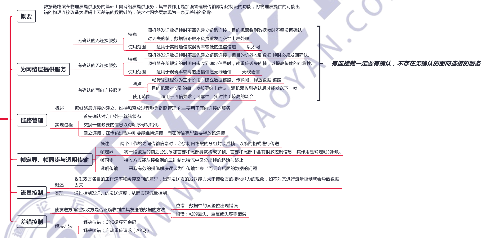

## 3.2 组帧

## 3.3 差错控制

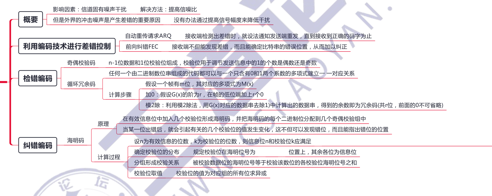

## 3.4 流量控制与可靠传输机制

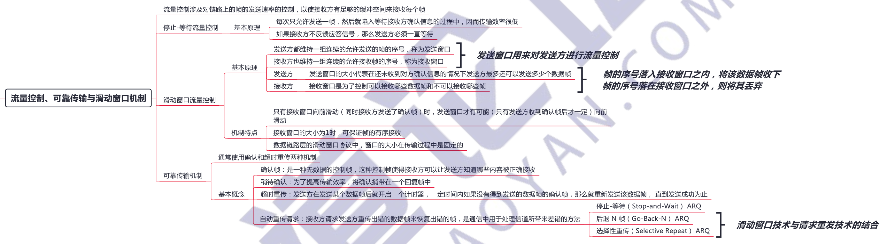

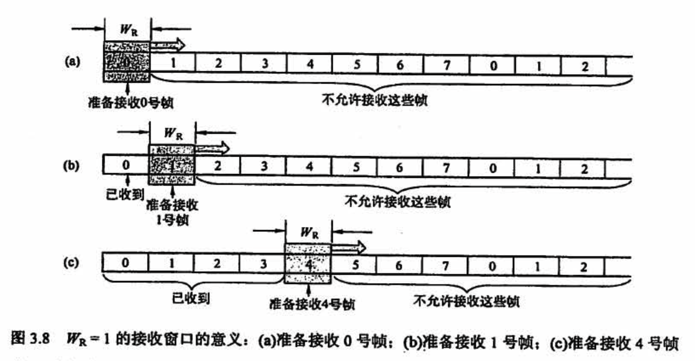

## 3.5 介质访问控制

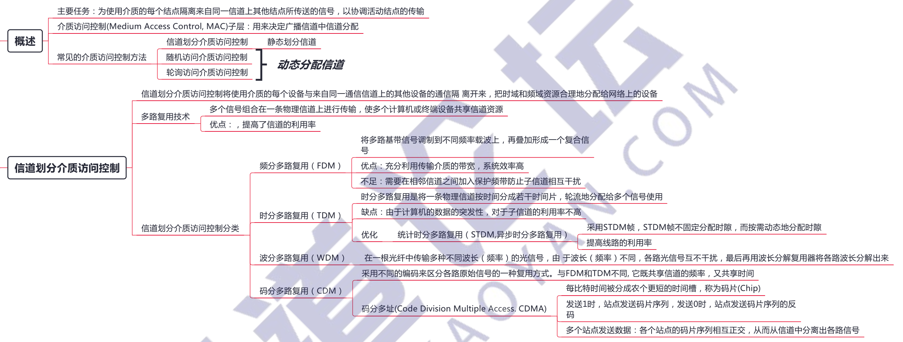

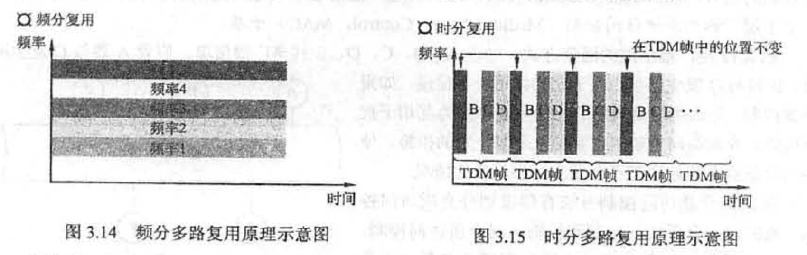

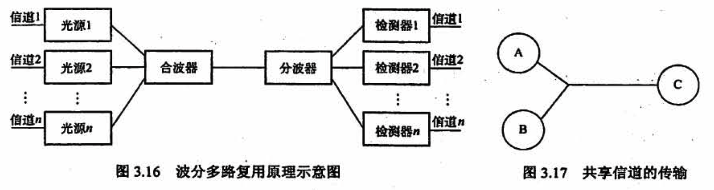

假设 A 站要向 C站运输黄豆，B 站要向 C 站运输绿豆，A 与C、B与C之间有一条公共的道路，可以类比为广播信道，如图 3.17所示。

- 在「频分复用」方式下，公共道路被划分为两个车道，分别提供给 A 到C 的车和B到C 的车行走，两类车可以同时行走，但只分到了公共车道的一半，因此频分复用（波分复用也一样）**共享时间而不共享空间**。
- 在「时分复用」方式下，先让 A到C的车走一趟，再让B到C的车走一趟，两类车交替地古用公共车道。公共车道没有划分，因此两车**共享了空间，但不共享时间**。
- 「码分复用」与另外两种信道划分方式大为不同，在码分复用情况下，黄豆与绿豆放在同一辆车上运送，到达C后，由C站负责把车上的黄豆和绿豆分开。因此：黄豆和绿豆的运送，在码分复用的情况下，**既共享了空间，也共享了时间**。

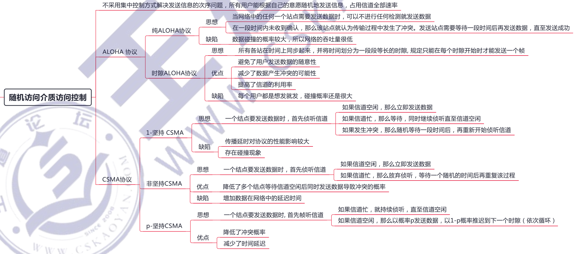

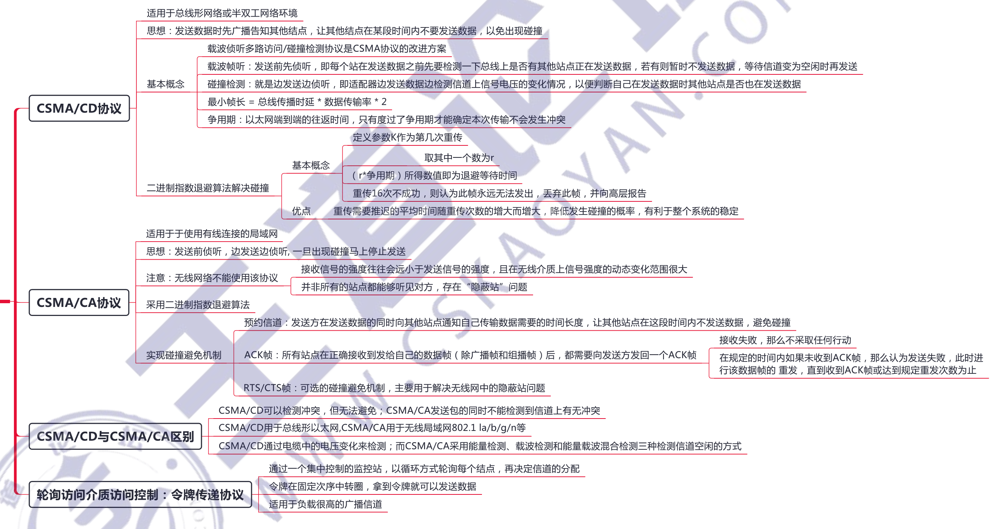

## 3.6 局域网

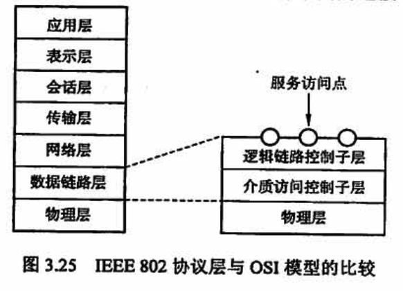

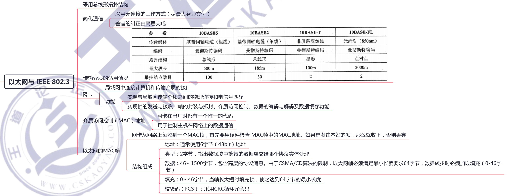

### 网卡

计算机与外界局域网的连接是通过主机箱内插入的一块网络接口板，又称网络适配器 (Adapter)或网络接口卡 (Network Interface Card, NIC) 实现的。网**卡上装有处理器和存储器，是工作在数据链路层的网络组件**。**网卡和局域网的通信是通过电缆**或双绞线以「串行」方式进行的，而**网卡和计算机的通信则是通过计算机主板上的 IO 总线**以「并行」方式进行的。因此，**网卡的重要功能就是进行数据的串并转换**。网卡不仅能实现**与局域网传输介质之间的物理连接和电信号匹配，还涉及帧的发送与接收、帧的封裝与拆封、介质访问控制、数据的编码与解码及数据缓存功能等**。

全世界的每块网卡在出厂时都有一个唯一的代码，称为**介质访问控制（MAC)地址**，这个地址用于控制主机在网络上的数据通信。数据链路层设备(网桥、交换机等）都使用各个网卡的 MAC地址。另外，网卡控制着主机对介质的访问，因此网卡也工作在物理层，因为它只关注比特，而不关注任何地址信息和高层协议信息。

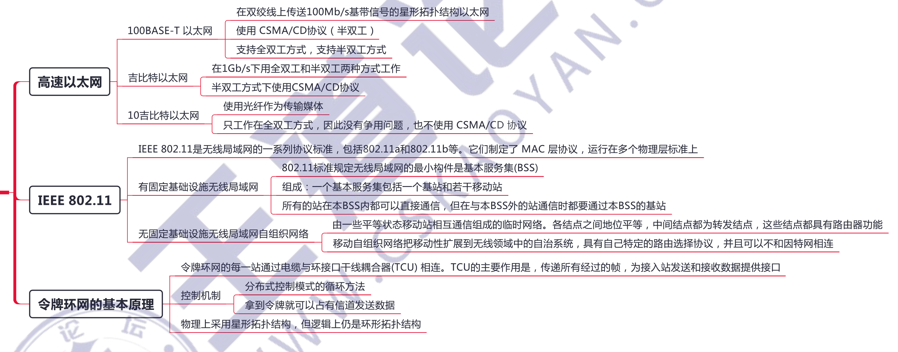

使用 802.11 系列协议的局域网又称 Wi-Fi

 AP 就是基本服务集中的基站 (base station )

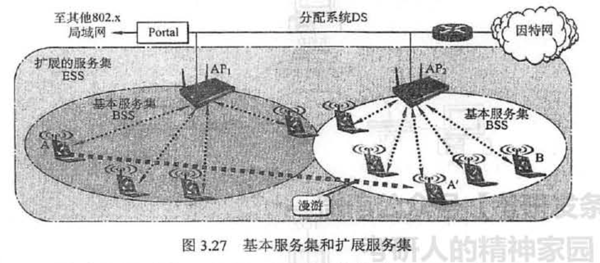

## 3.7 广域网

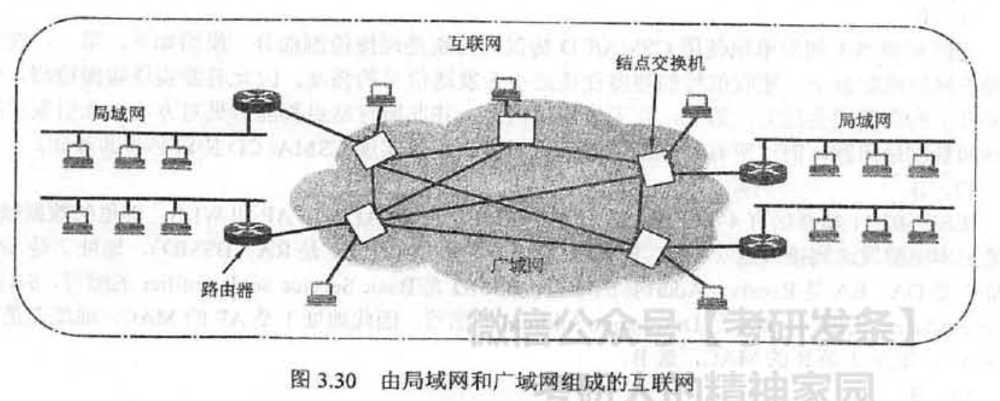

广域网由一些结点「交换机」及连接这些交换机的链路组成。注意不是路由器，结点交换机和路由器都用来转发分组，它们的工作原理也类似。**结点交换机在单个网络中转发分组，而路由器在多个网络构成的互联网中转发分组**。结点交换机的功能是将分组存储并转发。结点之间都是点到点连接，但为了提高网络的可靠性，通常一个结点交换机往往与多个结点交换机相连。

**广域网中的一个重要问题是路由选择和分组转发**。路由选择协议负责搜索分组从某个结点到目的结点的最佳传输路由，以便构造路由表，然后从路由表再构造出转发分组的转发表。分组是通过转发表进行转发的。

PPP 协议和HIDLC 协议是目前最常用的两种广域网数据链路层控制协议，

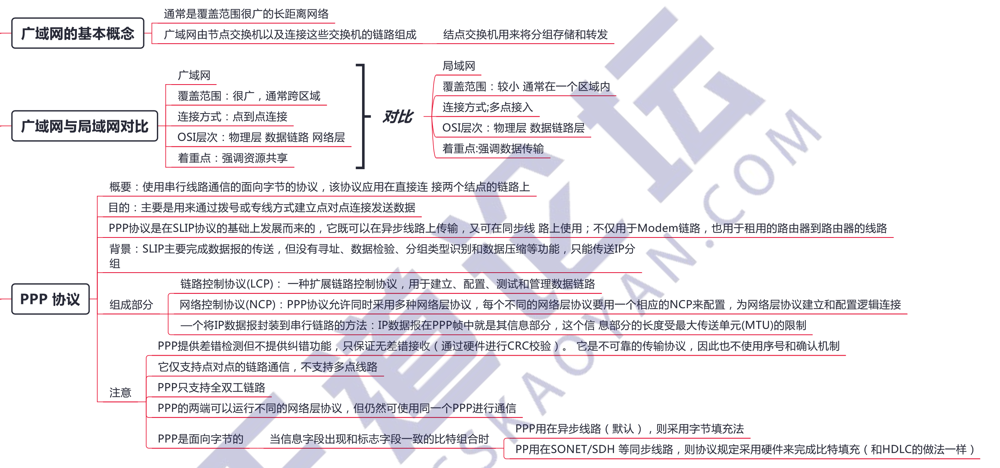

## 3.8 数据链路层设备

### 网桥

两个以太网通过网桥组成一个更大的以太网，原来的以太网称为一个网段

### 以太网交换机

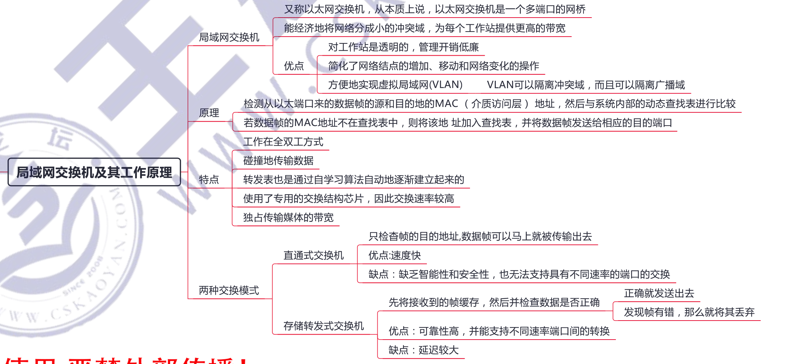

## 常见问题

### 1、"链路”和“数据链路” 有何区别？“电路接通” 与“数据链路接通” 有何区别？

**链路（Link），是指从一个结点到相邻结点的一段物理线路，其中间没有其他任何的交换结点**。在进行数据通信时，两台计算机之间的通信路径往往要经过许多段这样的链路。可见，链路只是一条路径的组成部分。

数据链路 (Data Link）则是另一个概念。因为在一条线路上传送数据时，除必须有一条物理线路外，还必须有一些通信协议来控制这些数据的传输。若把**实现这些协议的硬件和软件加到链路上，就构成了数据链路**。有时也把链路分为物理链路和逻辑链路。物理链路就是指上面所说的链路，逻辑链路就是上面的数据链路，即物理链路加上必要的通信协议。

“电路接通〞表示链路两端的**结点交换机己经开机**，物理连接已经能够传送比特流，但数据传输**并不可靠**，在物理连接基础上，再建立数据链路连接，才能说“数据链路接通”。此后，由于**数据链路连接具有检测、确认和重传功能**，才使得不太可靠的物理链路变成可靠的数据链路，进行可靠的数据传输。当数据链路断开连接时，物理电路连接不一定跟着断开连接。

### 2、在停止—等待协议中，确认帧为什么不需要序号（如用ACK0 和 ACK1） ？

在停止—等待协议中，发送方每发送一帧，都需要在收到接收方的确认帧后，才能进行下一帧的发送，而发送方收到的确认帧也一定是自己刚刚发出去的数据帧的确认帧，无须加序号标记。

### 3、数据链路层使用PPP 协议或CSMA/CD 协议时，既然不保证可靠传输，为什么要对所传输的帧进行差错检验？
当数据链路层使用 PPP 协议或 CSMA/CD 协议时，在数据链路层的接收端对所传输的帧进行差错检验是为了不将己发现有差错的帧（不管是什么原因造成的）接收下来。如果在接收端不进行差错检测，那么接收端上交给主机的帧就可能包括在传输中出了差错的帧，而这样的帧对接收端主机是没有用处的。换言之，接收端进行差错检测的目的是：“上交主机的帧都是没有传输差错的，有差错的都己经丢弃了”，或者更加严格地说：“我们以很接近于1的概率认为，**凡是上交主机的帧都是没有传输差错的**”

### 4、为什么PPP 协议不使用帧的编号和确认机制来实现可靠传榆？

PPP 不使用序号和确认机制是出于以下考虑：

若使用能够实现可靠传输的数据链路层协议（如 HDIC)，开销就会增大。**当数据链路层出现差错的概率不大时，使用比较简单的 PPP 较为合理**。

在因特网环境下，PPP 的信息字段放入的数据是 IP数据报。假定我们采用了能实现可靠传输但十分复杂的数据链路层协议，当数据帧在路由器中从数据链路层上升到网络层后，仍有可能因网络拥塞而被丢弃。因此，**数据链路层的可靠传输并不能保证网络层的传输也是可靠的**。

PPP 在帧格式中有帧校验序列 FCS 字段。对于每个收到的帧，**PPP 都要使用硬件进行 CRC检验。若发现有差错，则丢弃该帧**(一定不能把有差错的帧交给上一层)。端到端的差错控制最后由高层协议负责。因此，PPP可以保证无差错接收。

### 5、两台计算机通过计算机网络传输一个文件时，有两种可行的确认策略，试比较这两种方式的优缺点，以及它们各自适用的场合
第一种是由发送端将文件分割成分组，接收端**逐个确认分组**；但就整体而言，文件并没有得到确认。二种策略是接收端不确认单个分組，而是当文件全部收到后，**对整个文件予以接收确认**，试比较这两种方式的优缺点，以及它们各自适用的场合

在计算机网络中，数据的传输过程可能会引起数据的丢失、出错等，因此一个可靠的传输需要一定的差错控制机制，确认是实现差错控制的一个辅助手段。上面的两种确认策略都是可行的，但它们的性能取决于所应用的网络环境。

具体地说，当网络传输可靠性较低且分组容易丢失时，第一种策略即对每个分组逐一确认较好，此时仅需重传丢失或出错的分组。如果网络的传输可靠性较高，那么在不发生差错的情况下，仅对整个文件进行一次确认，从而减少了确认的次数，节省了网络带宽和网络资源；不过，即使有单个分組丢失或出错，也需要重传整个文件。

### 6、局域网、广域网和因特网之间的关系总结

为方便理解，可将广域网视为一个大的局域网，专业地讲，就是通过交换机连接多个局域网，組成更大的局域网，即广域网。因此，广域网仍然是一个网络。而因特网是多个网络之间的互联，即**因特网由大局域网（广域网〕和小局域网共同通过路由器相连**。因此局域网可以通过广域网与另一个相隔很远的局域网进行通信。

### 7、IEEE 802 局域网参考模型与 OSI 参考模型有何异同之处？

**局域网的体系结构只有 OSI 参考模型的下两层**（物理层和数据链路层)，而没有第三层以上的层次。即使是下两层，由于局域网是共享广播信道，而且产品的种类繁多，涉及多种媒体访问方法，所以两者存在明显的差别。

在局域网中，与 OSI 参考模型的「物理层」相同的是：该层**负责物理连接并在媒体上传输比特流**，主要任务是描述传输媒体接口的一些特性。在局域网中，「数据链路层」的主要作用与 OSI 参考模型的数据链路层相同：**都通过一些数据链路层协议，在不可靠的传输信道上实现可靠的数据传输**；负责帧的传送与控制，

但在局域网中，由于各站共享网络公共信道，因此数据链路层必须具有**媒体访问控制功能**（如何分配信道、如何避免或解决信道争用）。又由于局域网采用的拓扑结构与传输媒体多种多样，相应的媒体访问控制方法也有多种，因此在数据链路功能中应该将与传输媒体有关的部分和无关的都分分开。这样，IEEE 802 局域网参考模型中的数据链路层就**划分为两个子层：媒体访问控制（MAC）子层和逻辑链路控制 (LLC)子层**。

与OSI 参考模型不同的是：**在IEEE 802 局域网参考模型中没有网络层。局域网中，在任意两个结点之间只有唯一的一条链路**，不需要进行路由选择和流量控制，所以在局域网中不单独设置网络层。

由上面的分析可知，局域网的参考模型只相当于 OSI 参考模型的最低两层，且两者的物理层和数据链路层之间也有很大差别。在IEEE 802 系列标准中，各个子标准的物理层和媒体访问控制(MAC）子层是有区别的，而逻辑链路控制 (LLC）子层是相同的，也就是说，LLC 子层实际上是高层协议与任何一种MAC 子层之间的标准接口。

### 8、在IEEE 802.3 标准以太网中，为什么说如果有冲突，那么冲突一定发生在冲突窗口内？或者说一个帧如果在冲突窗口内没有发生冲突，那么该帧就不会再发生冲突？

结点发送数据时，先侦听信道是否有载波，如果有，表示信道忙，那么继续侦听，直至检测到空闲为止：一个数据帧在从结点 A 向最远的结点传输的过程中，如果有其他结点也正在发送数据，那么此时就会发生冲突，冲突后的信号需要经过冲突窗口时间后传回结点 A，结点 A会检测到冲突

所以说**如果有冲突，那么一定发生在冲突窗口内**，如果在冲突窗口内没有发生冲突，之后如果其他结点再要发送数据，那么就会侦听到信道忙，而不会发送数据，从而**不会再发生冲突**。

### 9、一个以太网的速率从 10Mb/s 升級到 100Mb/s，满足CSMA/CD 冲突条件。为使其正常工作，需做哪些调整？为什么？
由于 10BASE-T 要比 10BASE2 和 10BASES 的优越性更明显，因此所有快速以太网系统都使用集线器（Eub），而不使用同轴电缆。100BASE-T MAC 与10Mb/s 的经典以太网MAC 几乎一样，唯一不同的参数就是帧际间隙时间，10Mb/s 以太网是9.561s（最小值），快速以大网 (100Mb/s)是0.96us＜最小值）。另外，为了维持最小分组尺寸不变，需要减小最大冲突域直径。所有这些调整的主要原因是速度提高到了原来以太网的10倍。

### 10、HDLC协议是PPP 协议的基础，它使用位填充来实现透明传揄。但PPP 协议却使用字符填充而不使用位填充，为什么？
**PPP 被明确地设计成以软件形式实现**，而不像 HDLC 协议那样几乎总以硬件形式实现。**对于软件实现，完全用字节操作比用单个位操作简单得多**。此外，**PPP 被设计成与调制解调器一道使**用，而调制解调器是以一个字节而非一个比特为单元接收和发送数据的。

### 11、假定连接到透明网桥上的一台计算机把一个数据帧发给网络上的一个不存在的设备，网桥将如何处理这个帧？

网桥不知道网络上是否存在该设备，它只知道**在其转发表中没有这个设备的MAC 地址**。因此，当网桥收到这个目的地址未知的帧时，它将**扩散该帧，即把该帧发送到所连接的除输入网段外的所有其他网段**。

### 12、关于冲突域（碰撞域）和广播域

一块网卡发送信息时，只要有可能和另一块网卡冲突，那么这些**可能冲突的网卡就构成冲突域**。**一块网卡发出一个广播时，能收到这个广播的所有网卡的集合称为一个广播城**。一般来说，**一个网段（以太网）就是一个冲突域，一个局域网就是一个广播域**。

### 13、关于物理层、数据链路层、网络层设备对于隔离冲突域和广播域的总结

### 14、与传统共享式局域网相比，使用局城网交换机的交换式局域网为什么能改善网络的性能和服务质量？
**传统共享式局域网的核心设备是集线器，而交换式局域网的核心是以太网交换机**。在使用共享式集线器的传统局域网中，**在任何时刻只能有「一个」结点能够通过共享通信信道「发送」数据**；在使用交换机的交换式局域网中，交换机可以在它的多个端口之间建立多个并发连接，**从而实现结点「之间」数据的「并发」传输**，有效地改善网络性能和服务质量。

### 15、试分析中继器、集线器、网桥和交换机这四种网络互联设备的区别与联系

这四种设备都是用于互联、扩展局域网的连接设备，但它们工作的层次和实现的功能不同

**「中继器」工作在物理层**，用来连接两个速率相同且数据链路层协议也相同的网段，其功能是消除数字信号在基带传输中由于经过一长段电缆而造成的失真和变减，使信号的波形和强度达到所需的要求；其原理是信号再生。

**「集线器」（Hub）也工作在物理层**，相当于一个多接口的中继器，它可将多个结点连接成一个共享式的局域网，但任何时刻都只能有一个结点通过公共信道发送数据。

**「网桥」工作在数据链路层**，可以互联不同的物理层、不同的MAC 子层及不同速率的以太网。网桥具有过滤帧及存储转发帧的功能，可以隔离冲突域，但不能隔离广播域。

**「交换机」工作在数据链路层**，相当于一个多端口的网桥，是交换式局域网的核心设备。它允许端口之间建立多个并发连接，实现多个结点之间的并发传输。因此，交换机的每个端口结点所占用的带宽不会因为端口结点数目的增加而减少，且整个交换机的总带宽会随着端口结点的增加而增加。交换机一般工作在全双工方式，有的局域网交换机采用存储转发方式进行转发，也有的交换机采用直通交换方式（即在收到帧的同时立即按帧的目的 MAC 地址决定该帧的转发端口，而不必先缓存再处理）。另外，利用交换机可以实现虛拟局域网 (VLAN)， VLAN 不仅可以隔离冲突域，而且可以隔离广播域。

### 19、交换机和网桥的不同之处

尽管交换机也称多端口网桥，但两者仍有许多不同之处。主要包括以下3点：

- 网桥的端口一般连接局域网，而交换机的端口一般直接与局域网的主机相连。
- 交换机允许多对计算机同时通信，而网桥仅允许每个网段上的计算机同时通信
- 网桥采用存储转发进行转发，而以太网交换机还可以采用直通方式进行转发，且以太网交换机采用了专用的交换结构芯片，转发速度比网桥快