# 应用层

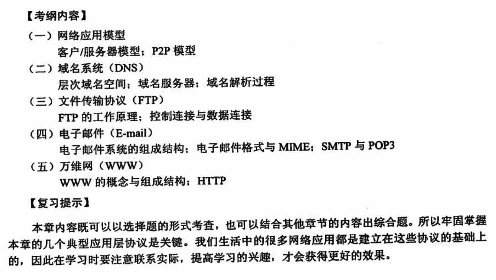

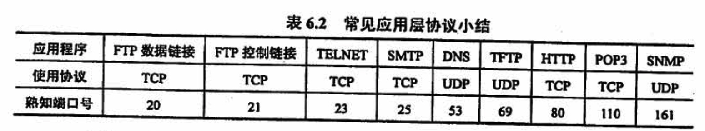

## 6.1 网络应用模型

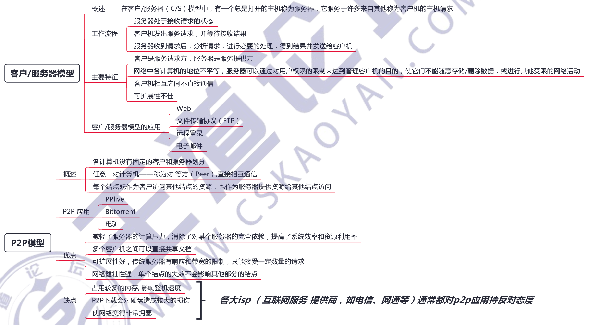

## 6.2 域名解析 DNS

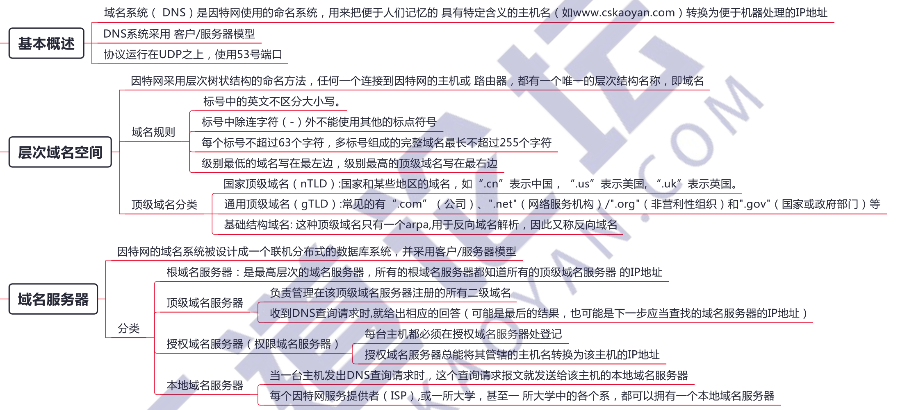

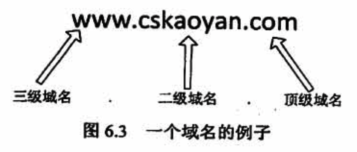

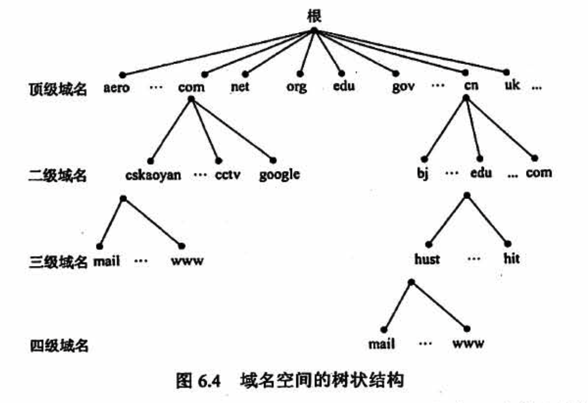

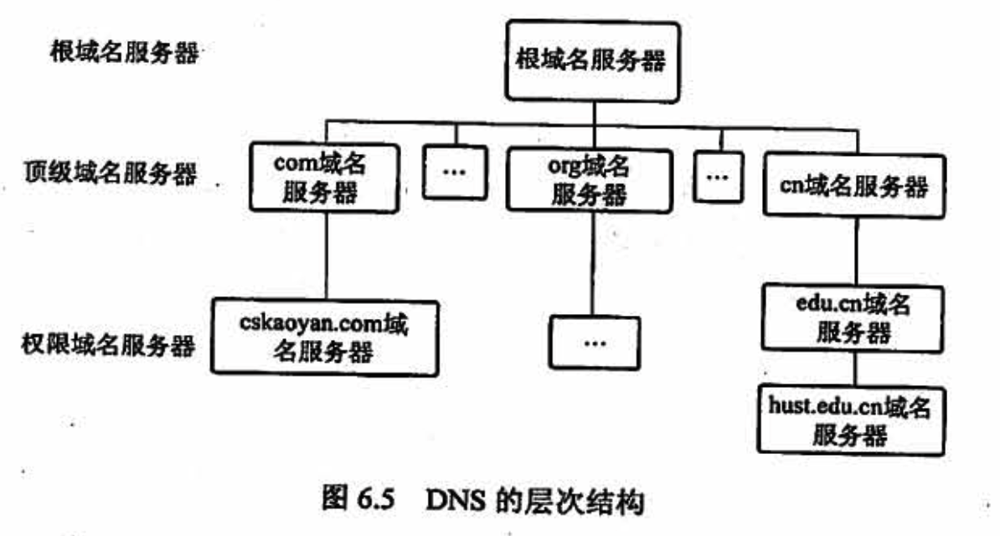

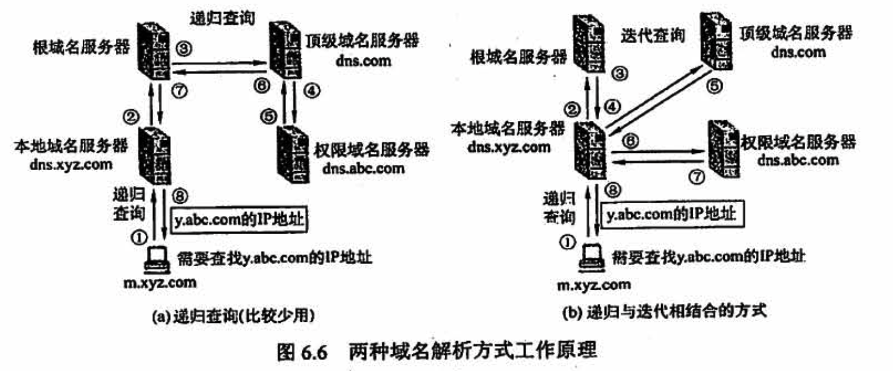

## 6.3 文件传输协议 FTP

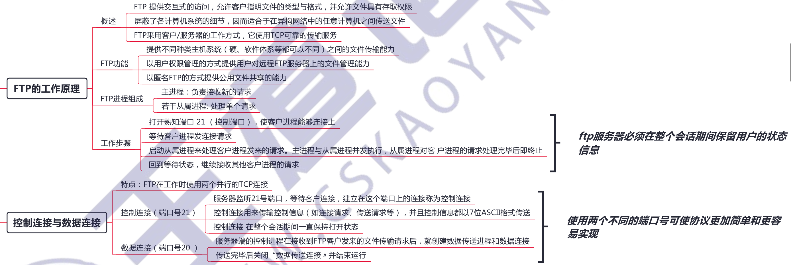

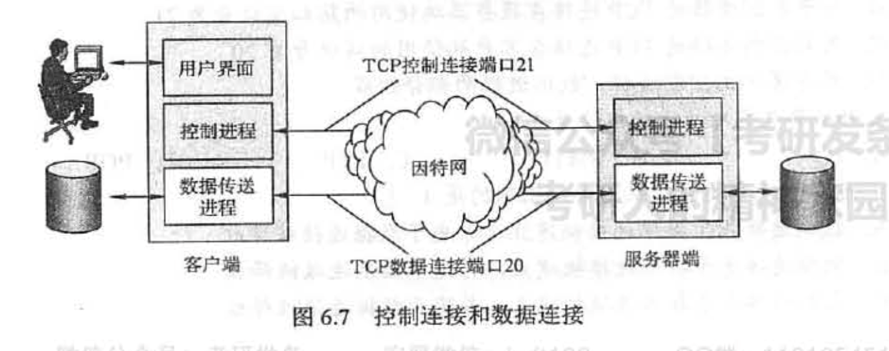

因为 FTP 使用了一个分离的控制连接，所以也称 FTP 的控制信息是带外 (Out-of-band）传送的。**使用FTP 时，若要修改服务器上的文件，则需要先将此文件传送到本地主机，然后再将修改后的文件副本传送到原服务器**，来回传送耗费很多时间。

「网络文件系统 NFS」 采用另一种思路，它允许**进程打开一个远程文件，并能在该文件的某个特定位置开始读写数据**。这样，NFS 可使用户复制一个大文件中的一个很小的片段，而不需要复制整个大文件。

## 6.4 电子邮件

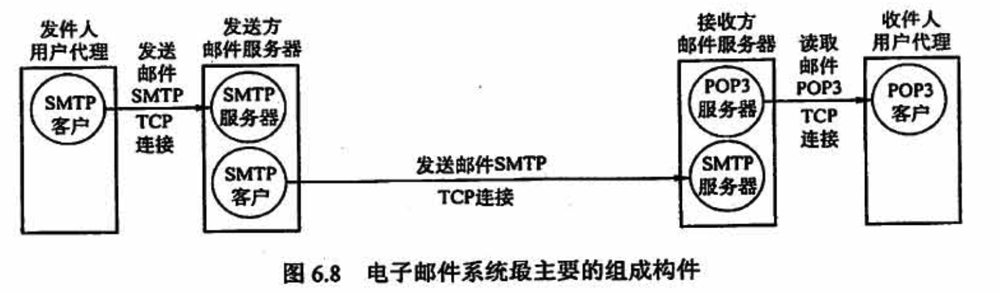

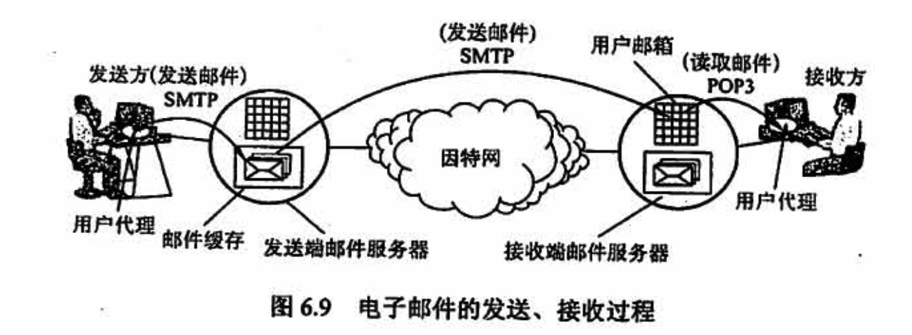

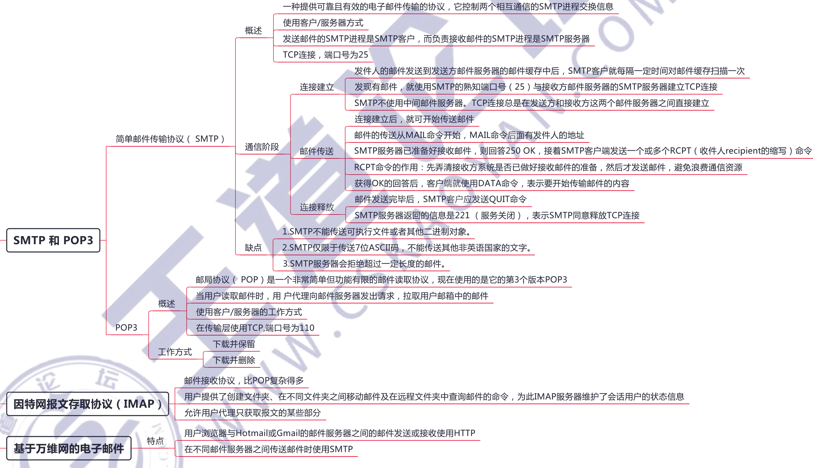

## 6.5 万维网 WWW

URL 是对可以从因特网上得到的资源的位置和访问方法的一种简洁表示。URL 相当于一个文件名在网络范围的扩展。URL 的一般形式是：`<协议＞://<主机＞:<端口>/<路径＞`

<协议> 指用什么协议来获取万维网文档，常见的协议有 http、ftp 等；<主机＞是存放资源的主机在因特网中的域名或IP地址；＜端口>和<路径>有时可省略。在URL 中不区分大小写

**Cookie**

在实际应用中，通常**使用 Cookie 加数据库的方式来跟踪用户的活动**（如记录用户最近浏览的商品等）。Cookie 的工作原理：

- 当用户浏览某个使用 Cookie 的网站时，该网站服务器就为用户产生一个唯一的识别码，如“123456”，接着在给用户的响应报文中添加一个 Set-cookie 的首部行“Setcookie: 123456”。
- 用户收到响应后，就在它管理的特定 Cookie 文件中添加这个服务器的主机名和 Cookie 识别码，当用户继续浏览这个网站时，会取出这个网站的识别码，并放入请求报文的Cookie 首部行 “ Cookie： 123456”
- 服务器根据请求报文中的 Cookie 识别码就能从数据库中查询到该用户的活动记录，进而执行一些个性化的工作，如根据用户的历史浏览记录向其推荐新产品等。

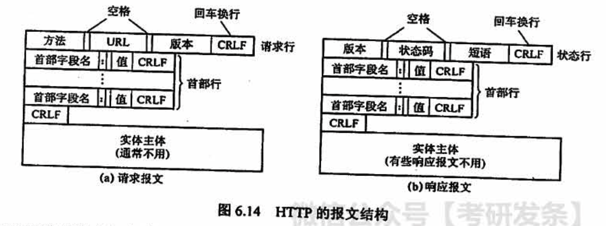

## 常见问题

### 1、如何理解客户进程端口号与服务器进程端口号？

通常我们所说的熟知端口号是指应用层协议在服务器端的默认端口号，而客户端进程的端口号是由客户端进程任意指定的（临时的）。

当客户进程向服务器进程发出建立连接请求时，要寻找连接服务器进程的熟知端口号，同时还要告诉服务器进程自己的临时端口号。接着，服务器进程就用自己的熟知端口号与客户进程所提供的端口号建立连接。

### 2、互联网、因特网和万维网的区别是什么？

「互联网 internet」泛指由多个计算机网络按照一定的通信协议相互连接而成的一个大型计算机网络。

「因特网 Internet」是指在 ARPA 网基础上发展而来的世界上最大的全球性互联网络。因特网和其他类似的由计算机相互连接而成的大型网络系统，都可算是“互联网”，**因特网只是互联网中最大的一个**。

「万维网 WWW」是无数个**网络站点和网页的集合**，它们一起构成了因特网最主要的部分（因特网也包括电子邮件、Usenet 和新闻组）。

### 3、域名的高速缓存是什么？

每个域名服务器都维护一个高速缓存，存放最近用过的名字以及从何处获得名字映射信息的记录，可大大减轻根域名服务器的负荷，使因特网上的DNS 查询请求和回答报文的数量大为减少。

为保持高速缓存中的内容正确，域名服务器应为每项内容设置计时器，并处理超过合理时间的项（如每个项目只存放两天）。当权限域名服务器回答一个查询请求时，在响应中都指明绑定有效存在的时间值。增加此时间值可减少网络开销，减少此时间值可以提高域名转换的准确性。