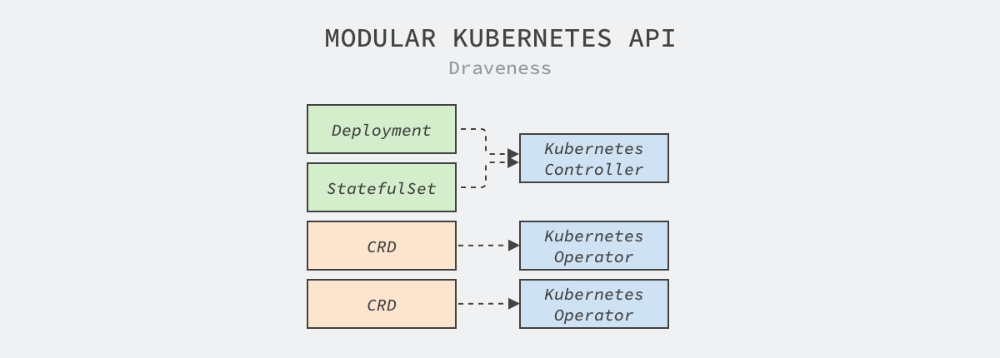
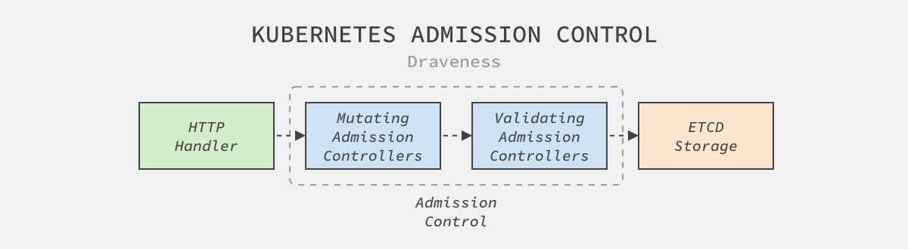
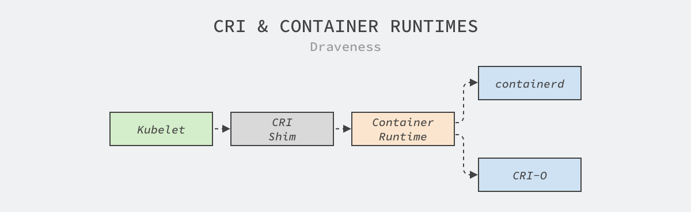
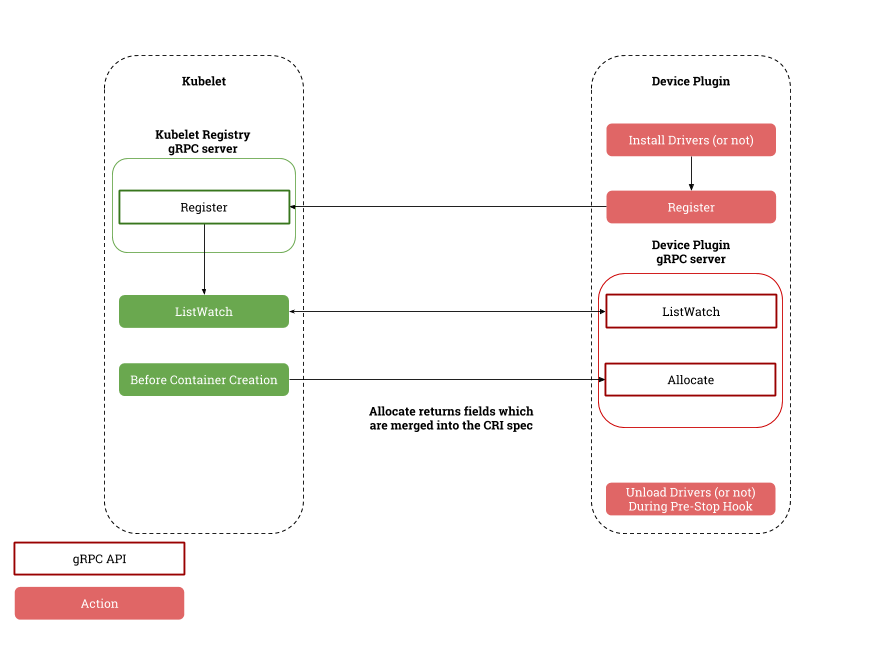
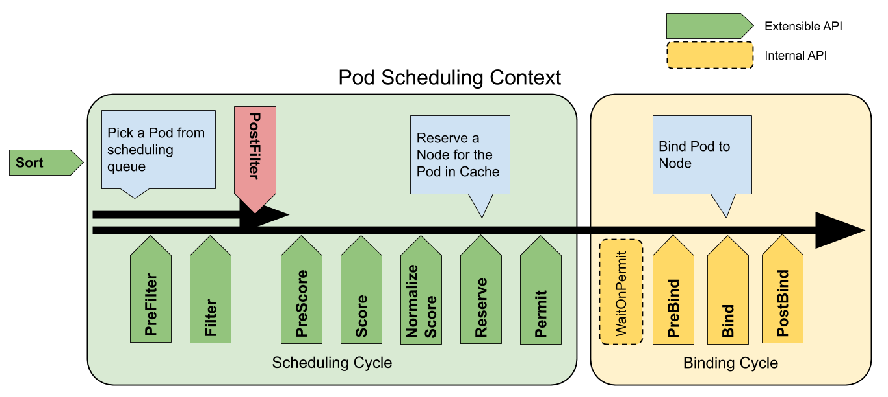

# 如何为 Kubernetes 定制特性

Kubernetes 是非常复杂的集群编排系统，然而哪怕包含丰富的功能和特性，因为容器的调度和管理本身就有较高的复杂性，所以它无法满足所有场景下的需求。虽然 Kubernetes 能够解决大多数场景中的常见问题，但是为了实现更加灵活的策略，我们需要使用 Kubernetes 提供的扩展能力实现特定目的。

每个项目在不同的周期会着眼于不同的特性，我们可以将项目的演进过程简单分成三个不同的阶段：

- **最小可用**：项目在早期更倾向于解决通用的、常见的问题，给出开箱即用的解决方案以吸引用户，这时代码库的规模还相对比较小，提供的功能较为有限，能够覆盖领域内 90% 的场景；
- **功能完善**：随着项目得到更多的使用者和支持者，社区会不断实现相对重要的功能，社区治理和自动化工具也逐渐变得完善，能够解决覆盖内 95% 的场景；
- **扩展能力**：因为项目的社区变得完善，代码库变得逐渐庞大，项目的每个变动都会影响下游的开发者，任何新功能的加入都需要社区成员的讨论和审批，这时社区会选择增强项目的扩展性，让使用者能够为自己的场景定制需求，能够解决覆盖内 99% 的场景；

**开源项目的演进**


从 90%、95% 到 99%，每个步骤都需要社区成员花费很多精力，但是哪怕提供了较好的扩展性也无法解决领域内的全部问题，在一些极端场景下仍然需要维护自己的分支或者另起炉灶满足业务上的需求。

然而无论是维护自己的分支，还是另起炉灶都会带来较高的开发和维护成本，这需要结合实际需求进行抉择。但是能够利用项目提供的配置能力和扩展能力就可以明显地降低定制化的开发成本，而我们今天要梳理的就是 Kubernetes 的可扩展性。

## 一、扩展接口

API 服务器是 Kubernetes 中的核心组件，它承担着集群中资源读写的重任，虽然社区提供的资源和接口可以满足大多数的日常需求，但是我们仍然会有一些场景需要扩展 API 服务器的能力，这一节简单介绍几个扩展该服务的方法。

### 1、自定义资源

自定义资源（Custom Resource Definition、CRD）应该是 Kubernetes 最常见的扩展方式[1](https://draveness.me/cloud-native-kubernetes-extension/#fn:1)，它是扩展 Kubernetes API 的方式之一。Kubernetes 的 API 就是我们向集群提交的 YAML，系统中的各个组件会根据提交的 YAML 启动应用、创建网络路由规则以及运行工作负载。

```yaml
apiVersion: v1
kind: Pod
metadata:
  name: static-web
  labels:
    role: myrole
spec:
  containers:
    - name: web
      image: nginx
      ports:
        - name: web
          containerPort: 80
          protocol: TCP
```

`Pod`、`Service` 以及 `Ingress` 都是 Kubernetes 对外暴露的接口，当我们在集群中提交上述 YAML 时，Kubernetes 中的控制器会根据配置创建满足条件的容器。

```yaml
apiVersion: apiextensions.k8s.io/v1
kind: CustomResourceDefinition
metadata:
  name: crontabs.stable.example.com
spec:
  group: stable.example.com
  versions:
    - name: v1
      served: true
      storage: true
      schema:
        openAPIV3Schema:
          type: object
          properties:
            spec:
              type: object
              properties:
                cronSpec:
                  type: string
                image:
                  type: string
                replicas:
                  type: integer
  scope: Namespaced
  names:
    plural: crontabs
    singular: crontab
    kind: CronTab
    shortNames:
    - ct
```

除了这些系统内置的 API 之外，想要实现定制的接口就需要使用 CRD，然而 CRD 仅仅是实现自定义资源的冰山一角，因为它只定义了资源中的字段，我们还需要遵循 Kubernetes 的控制器模式，实现消费 CRD 的 Operator，通过组合 Kubernetes 提供的资源实现更复杂、更高级的功能。

**Kubernetes API 模块化设计**



如上图所示，Kubernetes 中的控制器等组件会消费 `Deployment`、`StatefulSet` 等资源，而用户自定义的 CRD 会由自己实现的控制器消费，这种设计极大地降低了系统之间各个模块的耦合，让不同模块可以无缝协作。

当我们想要让 Kubernetes 集群提供更加复杂的功能时，选择 CRD 和控制器是首先需要考虑的方法，这种方式与现有的功能耦合性非常低，同时也具有较强的灵活性，但是在定义接口时应该遵循社区 API 的最佳实践设计出优雅的接口[2](https://draveness.me/cloud-native-kubernetes-extension/#fn:2)。

### 2、聚合层

Kubernetes API 聚合层是 v1.7 版本实现的功能，它的目的是将单体的 API 服务器拆分成多个聚合服务，每个开发者都能够实现聚合 API 服务暴露它们需要的接口，这个过程不需要重新编译 Kubernetes 的任何代码[3](https://draveness.me/cloud-native-kubernetes-extension/#fn:3)。

**Kubernetes API 聚合**:


当我们需要在集群中加入新的 API 聚合服务时，需要提交一个 `APIService` 资源，这个资源描述了接口所属的组、版本号以及处理该接口的服务，下面是 Kubernetes 社区中 metrics-server 服务对应的 `APIService`：

```yaml
apiVersion: apiregistration.k8s.io/v1
kind: APIService
metadata:
  name: v1beta1.metrics.k8s.io
spec:
  service:
    name: metrics-server
    namespace: kube-system
  group: metrics.k8s.io
  version: v1beta1
  insecureSkipTLSVerify: true
  groupPriorityMinimum: 100
  versionPriority: 100
```

如果我们将上述资源提交到 Kubernetes 集群中后，用户在访问 API 服务器的 `/apis/metrics.k8s.io/v1beta1` 路径时，会被转发到集群中的 `metrics-server.kube-system.svc` 服务上。

与应用范围很广的 CRD 相比，API 聚合机制在项目中比较少见，它的主要目的还是扩展 API 服务器，而大多数的集群都不会有类似的需求，在这里也就不过多介绍了。

### 3、准入控制

Kubernetes 的准入控制机制可以修改和验证即将被 API 服务器持久化的资源，API 服务器收到的全部写请求都会经过如下所示的阶段持久化到 etcd 中[4](https://draveness.me/cloud-native-kubernetes-extension/#fn:4)：

**Kubernetes 准入控制**



Kubernetes 的代码仓库中包含 20 多个准入控制插件[5](https://draveness.me/cloud-native-kubernetes-extension/#fn:5)，我们以 `TaintNodesByCondition` 插件[6](https://draveness.me/cloud-native-kubernetes-extension/#fn:6)为例简单介绍一下它们的实现原理：

```go
func (p *Plugin) Admit(ctx context.Context, a admission.Attributes, o admission.ObjectInterfaces) error {
	if a.GetResource().GroupResource() != nodeResource || a.GetSubresource() != "" {
		return nil
	}

	node, ok := a.GetObject().(*api.Node)
	if !ok {
		return admission.NewForbidden(a, fmt.Errorf("unexpected type %T", a.GetObject()))
	}

	addNotReadyTaint(node)
	return nil
}
```

所有的准入控制插件都可以实现上述的 `Admit` 方法修改即将提交到存储中的资源，也就是上面提到的 Mutating 修改阶段，这段代码会为所有传入节点加上 `NotReady` 污点保证节点在更新期间不会有任务调度到该节点上；除了 `Admit` 方法之外，插件还可以实现 `Validate` 方法验证传入资源的合法性。

在 Kubernetes 实现自定义的准入控制器相对比较复杂，我们需要构建一个实现准入控制接口的 API 服务并将该 API 服务通过 `MutatingWebhookConfiguration` 和 `ValidatingWebhookConfiguration`两种资源将服务的地址和接口注册到集群中，而 Kubernetes 的 API 服务器会在修改资源时调用 `WebhookConfiguration` 中定义的服务修改和验证资源。Kubernetes 社区中的比较热门的服务网格 Istio 就利用该特性实现了一些功能[7](https://draveness.me/cloud-native-kubernetes-extension/#fn:7)。

## 二、容器接口

Kubernetes 作为容器编排系统，它的主要逻辑还是调度和管理集群中运行的容器，虽然它不需要从零开始实现新的容器运行时，但是因为网络和存储等模块是容器运行的必需品，所以它要与这些模块打交道。Kubernetes 选择的方式是设计网络、存储和运行时接口隔离实现细节，自己把精力放在容器编排上，让第三方社区实现这些复杂而且极具专业性的模块。

### 1、网络插件

容器网络接口（Container Network Interface、CNI）包含一组用于开发插件去配置 Linux 容器中网卡的接口和框架。CNI 仅会关注容器的网络连通性并在容器删除时回收所有分配的网络资源[8](https://draveness.me/cloud-native-kubernetes-extension/#fn:8)。

CNI 插件虽然与 Kubernetes 有密切的关系，但是不同的容器管理系统都可以使用 CNI 插件来创建和管理网络，例如：mesos、Cloud Foundry 等。

所有的 CNI 插件都应该实现包含 `ADD`、`DEL` 和 `CHECK` 操作的二进制可执行文件，容器管理系统会执行二进制文件来创建网络[9](https://draveness.me/cloud-native-kubernetes-extension/#fn:9)。

在 Kubernetes 中，无论使用哪种网络插件都需要遵循它的网络模型，除了每个 Pod 都需要有独立的 IP 地址之外，Kubernetes 还对网络模型做出了以下的需求：

- 任意节点上的 Pod 在不使用 NAT 的情况下都访问到所有节点上的所有 Pod；
- 节点上的 Kubelet 和守护进程等服务可以访问节点上的其他 Pod；

```go
type CNI interface {
	AddNetworkList(ctx context.Context, net *NetworkConfigList, rt *RuntimeConf) (types.Result, error)
	CheckNetworkList(ctx context.Context, net *NetworkConfigList, rt *RuntimeConf) error
	DelNetworkList(ctx context.Context, net *NetworkConfigList, rt *RuntimeConf) error
	GetNetworkListCachedResult(net *NetworkConfigList, rt *RuntimeConf) (types.Result, error)
	GetNetworkListCachedConfig(net *NetworkConfigList, rt *RuntimeConf) ([]byte, *RuntimeConf, error)

	AddNetwork(ctx context.Context, net *NetworkConfig, rt *RuntimeConf) (types.Result, error)
	CheckNetwork(ctx context.Context, net *NetworkConfig, rt *RuntimeConf) error
	DelNetwork(ctx context.Context, net *NetworkConfig, rt *RuntimeConf) error
	GetNetworkCachedResult(net *NetworkConfig, rt *RuntimeConf) (types.Result, error)
	GetNetworkCachedConfig(net *NetworkConfig, rt *RuntimeConf) ([]byte, *RuntimeConf, error)

	ValidateNetworkList(ctx context.Context, net *NetworkConfigList) ([]string, error)
	ValidateNetwork(ctx context.Context, net *NetworkConfig) ([]string, error)
}
```

开发 CNI 插件对于多数工程师来说都非常遥远，在正常情况下，我们只需要在一些常见的开源框架中根据需求做出选择，例如：Flannel、Calico 和 Cilium 等，当集群的规模变得非常庞大时，也自然会有网络工程师与 Kubernetes 开发者配合开发相应的插件。

### 2、存储插件

容器存储接口（Container Storage Interface、CSI）是 Kubernetes 在 v1.9 引入的新特性，该特性在 v1.13 中达到稳定，目前常见的容器编排系统 Kubernetes、Cloud Foundry、Mesos 和 Nomad 都选择使用该接口扩展集群中容器的存储能力。

CSI 是在容器编排系统向容器化的工作负载暴露块存储和文件存储的标准，第三方的存储提供商可以通过实现 CSI 插件在 Kubernetes 集群中提供新的存储[10](https://draveness.me/cloud-native-kubernetes-extension/#fn:10)。

Kubernetes 的开发团队在 CSI 的文档中给出了开发和部署 CSI 插件的最佳实践[11](https://draveness.me/cloud-native-kubernetes-extension/#fn:11)，其中最主要的工作是创建实现 `Identity`、`Node` 和可选的 `Controller` 接口的容器化应用，并通过官方的 [`sanity`](https://github.com/kubernetes-csi/csi-test/tree/master/pkg/sanity) 包测试 CSI 插件的合法性，需要实现的接口都定义在 CSI 的规格文档中[12](https://draveness.me/cloud-native-kubernetes-extension/#fn:12)。

```protobuf
service Identity {
  rpc GetPluginInfo(GetPluginInfoRequest)
    returns (GetPluginInfoResponse) {}

  rpc GetPluginCapabilities(GetPluginCapabilitiesRequest)
    returns (GetPluginCapabilitiesResponse) {}

  rpc Probe (ProbeRequest)
    returns (ProbeResponse) {}
}

service Controller {
  ...
}

service Node {
  ...
}
```

CSI 的规格文档非常复杂，除了详细地定义了不同接口的请求和响应参数。它还定义不同接口在出现相应错误时应该返回的 gRPC 错误码，开发者想要实现一个完全遵循 CSI 接口的插件还是很麻烦的。

Kubernetes 在较早的版本中分别接入了不同的云厂商的接口，其中包括 Google PD、AWS、Azure 以及 OpenStack，但是随着 CSI 接口的成熟，社区未来会在上游移除云厂商特定的实现，减少上游的维护成本，也能加快各个厂商自身存储的迭代和支持[13](https://draveness.me/cloud-native-kubernetes-extension/#fn:13)。

### 3、运行时接口

容器运行时接口（Container Runtime Interface、CRI）是一系列用于管理容器运行时和镜像的 gRPC 接口，它是 Kubernetes 在 v1.5 中引入的新接口，Kubelet 可以通过它使用不同的容器运行时。



CRI 主要定义的是一组 gRPC 方法，我们能在规格文档中找到 `RuntimeService`和 `ImageService` 两个服务[14](https://draveness.me/cloud-native-kubernetes-extension/#fn:14)，它们的名字很好地解释了各自的作用：

```protobuf
service RuntimeService {
    rpc Version(VersionRequest) returns (VersionResponse) {}

    rpc RunPodSandbox(RunPodSandboxRequest) returns (RunPodSandboxResponse) {}
    rpc StopPodSandbox(StopPodSandboxRequest) returns (StopPodSandboxResponse) {}
    rpc RemovePodSandbox(RemovePodSandboxRequest) returns (RemovePodSandboxResponse) {}
    rpc PodSandboxStatus(PodSandboxStatusRequest) returns (PodSandboxStatusResponse) {}
    rpc ListPodSandbox(ListPodSandboxRequest) returns (ListPodSandboxResponse) {}

    rpc CreateContainer(CreateContainerRequest) returns (CreateContainerResponse) {}
    rpc StartContainer(StartContainerRequest) returns (StartContainerResponse) {}
    rpc StopContainer(StopContainerRequest) returns (StopContainerResponse) {}
    rpc RemoveContainer(RemoveContainerRequest) returns (RemoveContainerResponse) {}
    rpc ListContainers(ListContainersRequest) returns (ListContainersResponse) {}
    rpc ContainerStatus(ContainerStatusRequest) returns (ContainerStatusResponse) {}
    rpc UpdateContainerResources(UpdateContainerResourcesRequest) returns (UpdateContainerResourcesResponse) {}
    rpc ReopenContainerLog(ReopenContainerLogRequest) returns (ReopenContainerLogResponse) {}

    rpc ExecSync(ExecSyncRequest) returns (ExecSyncResponse) {}
    rpc Exec(ExecRequest) returns (ExecResponse) {}
    rpc Attach(AttachRequest) returns (AttachResponse) {}
    rpc PortForward(PortForwardRequest) returns (PortForwardResponse) {}

    ...
}

service ImageService {
    rpc ListImages(ListImagesRequest) returns (ListImagesResponse) {}
    rpc ImageStatus(ImageStatusRequest) returns (ImageStatusResponse) {}
    rpc PullImage(PullImageRequest) returns (PullImageResponse) {}
    rpc RemoveImage(RemoveImageRequest) returns (RemoveImageResponse) {}
    rpc ImageFsInfo(ImageFsInfoRequest) returns (ImageFsInfoResponse) {}
}
```

容器运行时的接口相对比较简单，上面的这些接口不仅暴露了 Pod 沙箱管理、容器管理以及命令执行和端口转发等功能，还包含用于管理镜像的多个接口，容器运行时只要实现上面的二三十个方法可以为 Kubelet 提供服务。

## 三、设备插件

CPU、内存、磁盘是主机上常见的资源，然而随着大数据、机器学习和硬件的发展，部分场景可能需要异构的计算资源，例如：GPU、FPGA 等设备。异构资源的出现不仅需要节点代理 Kubelet 的支持，还需要调度器的配合，为了良好的兼容后出现的不同计算设备，Kubernetes 社区在上游引入了设备插件（Device Plugin）用于支持多种类型资源的调度和分配[15](https://draveness.me/cloud-native-kubernetes-extension/#fn:15)。

**设备插件概述**



设备插件是独立在 Kubelet 之外单独运行的服务，它通过 Kubelet 暴露的 `Registration` 服务注册自己的相关信息并实现 `DevicePlugin` 服务用于订阅和分配自定义的设备[16](https://draveness.me/cloud-native-kubernetes-extension/#fn:16)。

```protobuf
service Registration {
	rpc Register(RegisterRequest) returns (Empty) {}
}

service DevicePlugin {
      rpc GetDevicePluginOptions(Empty) returns (DevicePluginOptions) {}
      rpc ListAndWatch(Empty) returns (stream ListAndWatchResponse) {}
      rpc Allocate(AllocateRequest) returns (AllocateResponse) {}
      rpc GetPreferredAllocation(PreferredAllocationRequest) returns (PreferredAllocationResponse) {}
      rpc PreStartContainer(PreStartContainerRequest) returns (PreStartContainerResponse) {}
}
```

当设备插件刚刚启动时，它会调用 Kubelet 的注册接口传入自己的版本号、Unix 套接字和资源名，例如：`nvidia.com/gpu`；Kubelet 会通过 Unix 套接字与设备插件通信，它会通过 `ListAndWatch` 接口持续获得设备中资源的最新状态，并在 Pod 申请资源时通过 `Allocate` 接口分配资源。设备插件的实现逻辑相对比较简单，感兴趣的读者可以研究 Nvidia GPU 插件的实现原理[17](https://draveness.me/cloud-native-kubernetes-extension/#fn:17)。

## 四、调度框架

调度器是 Kubernetes 中的核心组件之一，它的主要作用是在 Kubernetes 集群中的一组节点中为工作负载做出最优的调度决策，不同场景下的调度需求往往都是很复杂的，然而调度器在 Kubernetes 项目早期并不支持易用的扩展能力，仅支持调度器扩展（Extender）这种比较难用的方法。

Kubernetes 从 v1.15 引入的调度框架才是今天比较主流的调度器扩展技术，通过在 Kubernetes 调度器的内部抽象出关键的扩展点（Extension Point）并通过插件的方式在扩展点上改变调度器做出的调度决策[18](https://draveness.me/cloud-native-kubernetes-extension/#fn:18)。

**调度框架扩展点**



目前的调度框架总共支持 11 个不同的扩展点，每个扩展点都对应 Kubernetes 调度器中定义的接口，这里仅展示 `FilterPlugin` 和 `ScorePlugin` 两个常见接口中的方法[19](https://draveness.me/cloud-native-kubernetes-extension/#fn:19)：

```go
type FilterPlugin interface {
	Plugin
	Filter(ctx context.Context, state *CycleState, pod *v1.Pod, nodeInfo *NodeInfo) *Status
}

type ScoreExtensions interface {
	NormalizeScore(ctx context.Context, state *CycleState, p *v1.Pod, scores NodeScoreList) *Status
}

type ScorePlugin interface {
	Plugin
	Score(ctx context.Context, state *CycleState, p *v1.Pod, nodeName string) (int64, *Status)
	ScoreExtensions() ScoreExtensions
}
```

调度框架的出现让实现复杂的调度策略和调度算法变得更加容易，社区通过调度框架替代更早的谓词和优先级并实现了协作式调度、基于容量调度等功能更强大的插件[20](https://draveness.me/cloud-native-kubernetes-extension/#fn:20)。虽然今天的调度框架已经变得非常灵活，但是串行的调度器可能无法满足大集群的调度需求，而 Kubernetes 目前也很难实现多调度器，不知道未来是否会提供更灵活的接口。

## 总结

Kubernetes 从 2014 年发布至今已经过去将近 7 年了，从一个最小可用的编排系统到今天的庞然大物，社区的每个代码贡献者和成员都有~~责任~~。从这篇文章中，我们可以看到随着 Kubernetes 项目的演进方向，社区越来越关注系统的可扩展性，通过设计接口、移除第三方代码降低社区成员的负担，让 Kubernetes 能够更专注于容器的编排和调度。

## Reference

1. Custom Resources · Kubernetes https://kubernetes.io/docs/concepts/extend-kubernetes/api-extension/custom-resources/ [↩︎](https://draveness.me/cloud-native-kubernetes-extension/#fnref:1)
2. API Conventions · Kubernetes Community https://github.com/kubernetes/community/blob/master/contributors/devel/sig-architecture/api-conventions.md [↩︎](https://draveness.me/cloud-native-kubernetes-extension/#fnref:2)
3. Aggregated API Servers · Kubernetes Community https://github.com/kubernetes/community/blob/master/contributors/design-proposals/api-machinery/aggregated-api-servers.md [↩︎](https://draveness.me/cloud-native-kubernetes-extension/#fnref:3)
4. Using Admission Controllers https://kubernetes.io/docs/reference/access-authn-authz/admission-controllers/ [↩︎](https://draveness.me/cloud-native-kubernetes-extension/#fnref:4)
5. kubernetes/plugin/pkg/admission/ · Kubernetes https://github.com/kubernetes/kubernetes/tree/master/plugin/pkg/admission[↩︎](https://draveness.me/cloud-native-kubernetes-extension/#fnref:5)
6. kubernetes/plugin/pkg/admission/nodetaint/admission.go · Kubernetes https://github.com/kubernetes/kubernetes/blob/master/plugin/pkg/admission/nodetaint/admission.go[↩︎](https://draveness.me/cloud-native-kubernetes-extension/#fnref:6)
7. Dynamic Admission Webhooks Overview https://istio.io/latest/docs/ops/configuration/mesh/webhook/ [↩︎](https://draveness.me/cloud-native-kubernetes-extension/#fnref:7)
8. CNI - the Container Network Interface cni https://github.com/containernetworking/cni [↩︎](https://draveness.me/cloud-native-kubernetes-extension/#fnref:8)
9. Container Network Interface Specification https://github.com/containernetworking/cni/blob/master/SPEC.md[↩︎](https://draveness.me/cloud-native-kubernetes-extension/#fnref:9)
10. Kubernetes Container Storage Interface (CSI) Documentation https://kubernetes-csi.github.io/docs/#kubernetes-container-storage-interface-csi-documentation [↩︎](https://draveness.me/cloud-native-kubernetes-extension/#fnref:10)
11. Recommended Mechanism (for Developing and Deploying a CSI driver for Kubernetes) https://kubernetes-csi.github.io/docs/#recommended-mechanism-for-developing-and-deploying-a-csi-driver-for-kubernetes [↩︎](https://draveness.me/cloud-native-kubernetes-extension/#fnref:11)
12. RPC Interface · Container Storage Interface (CSI) https://github.com/container-storage-interface/spec/blob/master/spec.md#rpc-interface [↩︎](https://draveness.me/cloud-native-kubernetes-extension/#fnref:12)
13. In-tree Storage Plugin to CSI Migration Design Doc https://github.com/kubernetes/community/blob/master/contributors/design-proposals/storage/csi-migration.md [↩︎](https://draveness.me/cloud-native-kubernetes-extension/#fnref:13)
14. Container Runtime Interface (CRI) – a plugin interface which enables kubelet to use a wide variety of container runtimes. https://github.com/kubernetes/cri-api/blob/master/pkg/apis/runtime/v1/api.proto [↩︎](https://draveness.me/cloud-native-kubernetes-extension/#fnref:14)
15. Device Plugins https://kubernetes.io/docs/concepts/extend-kubernetes/compute-storage-net/device-plugins/ [↩︎](https://draveness.me/cloud-native-kubernetes-extension/#fnref:15)
16. API Specification · Device Manager Proposal https://github.com/kubernetes/community/blob/master/contributors/design-proposals/resource-management/device-plugin.md#api-specification [↩︎](https://draveness.me/cloud-native-kubernetes-extension/#fnref:16)
17. k8s-device-plugin https://github.com/NVIDIA/k8s-device-plugin [↩︎](https://draveness.me/cloud-native-kubernetes-extension/#fnref:17)
18. Scheduling Framework https://github.com/kubernetes/enhancements/tree/master/keps/sig-scheduling/624-scheduling-framework [↩︎](https://draveness.me/cloud-native-kubernetes-extension/#fnref:18)
19. kubernetes/pkg/scheduler/framework/interface.go https://github.com/kubernetes/kubernetes/blob/master/pkg/scheduler/framework/interface.go[↩︎](https://draveness.me/cloud-native-kubernetes-extension/#fnref:19)
20. Repository for out-of-tree scheduler plugins based on scheduler framework. https://github.com/kubernetes-sigs/scheduler-plugins
