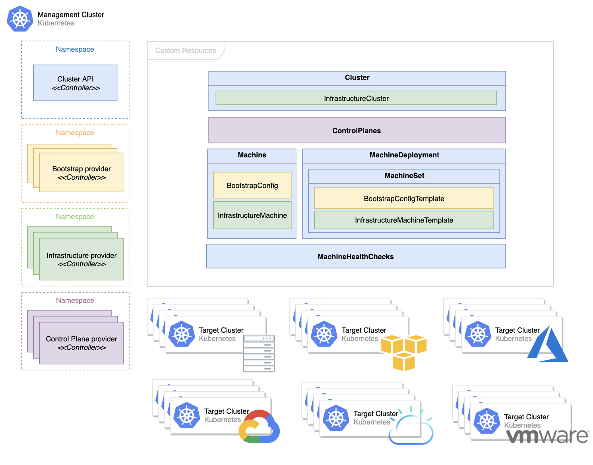
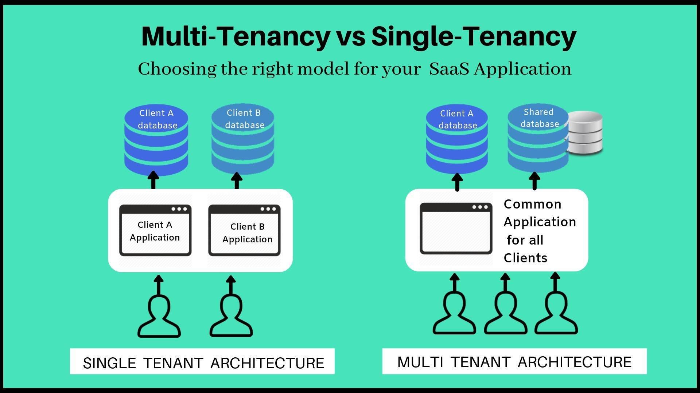

# Kubernetes 的问题和局限性

来源：[谈谈 Kubernetes 的问题和局限性](https://draveness.me/kuberentes-limitations/)

2014 年发布的 Kubernetes 在今天俨然已成为容器编排领域的事实标准，相信谈到 Kubernetes 的开发者都会一再复述上述现象。如下图所示，今天的大多数个人或者团队都会选择 Kubernetes 管理容器，而也有 75% 的人会在生产环境中使用 Kubernetes。

在这种全民学习和使用 Kubernetes 的大背景下，我们也应该非常清晰地知道 Kubernetes 有哪些局限性。虽然 Kubernetes 能够解决容器编排领域的大多数问题，但是仍然有一些场景是它很难处理、甚至无法处理的，只有对这些潜在的风险有清晰的认识，才能更好地驾驭这项技术，这篇文章将从集群管理和应用场景两个部分谈谈 Kubernetes 社区目前的发展和一些局限性。

## 一、集群管理

集群是一组能够在一起协同工作的计算机，我们可以将集群中的所有计算机看成一个整体，所有资源调度系统都是以集群为维度进行管理的，集群中的所有机器构成了资源池，这个巨大的资源池会为待运行的容器提供资源执行计算任务，这里简单谈一谈 Kubernetes 集群管理面对的几个复杂问题。

### 1、水平扩展性

集群大小是我们在评估资源管理系统时需要关注的重要指标之一，然而 Kubernetes 能够管理的集群规模远远小于业界的其他资源管理系统。集群大小为什么重要呢，我们先来看另一个同样重要的指标 — 资源利用率，很多工程师可能没有在公有云平台上申请过资源，这些资源都相当昂贵，在 AWS 上申请一个与主机差不多配置的虚拟机实例（8 CPU、16 GB）每个月大概需要 150 美金，约为 1000 人民币[2](https://draveness.me/kuberentes-limitations/#fn:2)。

大多数的集群都会使用 48 CPU 或者 64 CPU 的物理机或者虚拟机作为集群中的节点，如果我们的集群中需要包含 5,000 个节点，那么这些节点每个月大概要 8,000,000 美元，约为 50,000,000 人民币，在这样的集群中**提升 1% 的资源利用率就相当于每个月节省了 500,000 的成本**。

多数在线任务的资源利用率都很低，更大的集群意味着能够运行更多的工作负载，而多种高峰和低谷期不同的负载部署在一起可以实现超售，这样能够显著地提高集群的资源利用率，如果单个集群的节点数足够多，我们在部署不同类型的任务时会有更合理的组合，可以完美错开不同服务的高峰期。

Kubernetes 社区对外宣传的是单个集群最多支持 5,000 节点，Pod 总数不超过 150,000，容器总数不超过 300,000 以及单节点 Pod 数量不超过 100 个[3](https://draveness.me/kuberentes-limitations/#fn:3)，与几万节点的 Apache Mesos 集群、50,000 节点的微软 YARN 集群[4](https://draveness.me/kuberentes-limitations/#fn:4)相比，Kubernetes 的集群规模整整差了一个数量级。虽然阿里云的工程师也通过优化 Kubernetes 的各个组件实现了 5 位数的集群规模，但是与其他的资源管理方式相比却有比较大的差距[5](https://draveness.me/kuberentes-limitations/#fn:5)。

需要注意的是 Kubernetes 社区虽然对外宣称单集群可以支持 5,000 节点，同时社区也有各种各样的集成测试保证每个改动都不会影响它的伸缩性[6](https://draveness.me/kuberentes-limitations/#fn:6)，但是 Kubernetes 真的非常复杂，我们没有办法保证你使用的每个功能在扩容的过程中都不出问题。而在生产环境中，我们甚至可能在集群扩容到 1000 ~ 1500 节点时遇到瓶颈。

每个稍具规模的大公司都想要实现更大规模的 Kubernetes 集群，但是这不是一个改几行代码就能解决的简单问题，它可能需要我们限制 Kubernetes 中一些功能的使用，在扩容的过程中，etcd、API 服务器、调度器以及控制器都有可能出现问题。社区中已经有一些开发者注意到了其中的一些问题，例如在节点上增加缓存降低 API 服务器的负载[7](https://draveness.me/kuberentes-limitations/#fn:7)，但是要推动类似的改变还是很困难的，有志之士可以尝试在社区推动类似的项目。

### 2、多集群管理

单个集群的容量再大也无法解决企业面对的问题，哪怕有一天 Kubernetes 集群可以达到 50,000 节点的规模，我们仍然需要管理多个集群，多集群管理也是 Kubernetes 社区目前正在探索的方向，社区中的多集群兴趣小组（SIG Multi-Cluster）目前就在完成相关的工作[8](https://draveness.me/kuberentes-limitations/#fn:8)。在作者看来，Kubernetes 的多集群会带来资源不平衡、跨集群访问困难以及提高运维和管理成本三大问题，我们在这里谈一谈目前在开源社区和业界几种可供参考和选择的解决方案。

#### 1）kubefed

首先要介绍的是 [kubefed](https://github.com/kubernetes-sigs/kubefed)，该项目是 Kubernetes 社区给出的解决方案，它同时提供了跨集群的资源和网络管理的功能，社区的多集群兴趣小组（SIG Multi-Cluster）负责了该项目的开发工作：

**Kubernetes 联邦**


kubefed 通过一个中心化的联邦控制面板管理多集群中的元数据，上层的控制面板会为管理器群中的资源创建对应的联邦对象，例如：`FederatedDeployment`：

```yaml
kind: FederatedDeployment
...
spec:
  ...
  overrides:
  # Apply overrides to cluster1
    - clusterName: cluster1
      clusterOverrides:
        # Set the replicas field to 5
        - path: "/spec/replicas"
          value: 5
        # Set the image of the first container
        - path: "/spec/template/spec/containers/0/image"
          value: "nginx:1.17.0-alpine"
        # Ensure the annotation "foo: bar" exists
        - path: "/metadata/annotations"
          op: "add"
          value:
            foo: bar
        # Ensure an annotation with key "foo" does not exist
        - path: "/metadata/annotations/foo"
          op: "remove"
        # Adds an argument `-q` at index 0 of the args list
        # this will obviously shift the existing arguments, if any
        - path: "/spec/template/spec/containers/0/args/0"
          op: "add"
          value: "-q"
```

上层的控制面板会根据联邦对象 `FederatedDeployment` 的规格文件生成对应的 `Deployment` 并推送到下层的集群，下层集群可以正常根据 `Deployment` 中的定义创建特定数量的副本。

**从联邦对象到普通对象**


`FederatedDeployment` 只是一种最简单的分发策略，在生产环境中我们希望通过联邦的集群实现容灾等复杂功能，这时可以利用 `ReplicaSchedulingPreference` 在不同集群中实现更加智能的分发策略：

```yaml
apiVersion: scheduling.kubefed.io/v1alpha1
kind: ReplicaSchedulingPreference
metadata:
  name: test-deployment
  namespace: test-ns
spec:
  targetKind: FederatedDeployment
  totalReplicas: 9
  clusters:
    A:
      minReplicas: 4
      maxReplicas: 6
      weight: 1
    B:
      minReplicas: 4
      maxReplicas: 8
      weight: 2
```

上述调度的策略可以实现工作负载在不同集群之间的权重，在集群资源不足甚至出现问题时将实例迁移到其他集群，这样既能够提高服务部署的灵活性和可用性，基础架构工程师也可以更好地平衡多个集群的负载。

我们可以认为 kubefed 的主要作用是将多个松散的集群组成强耦合的联邦集群，并提供更加高级的网络和部署功能，这样我们可以更容易地解决集群之间资源不平衡和连通性的一些问题，然而该项目的关注点不包含集群生命周期的管理，

#### 2）集群接口

[Cluster API](https://cluster-api.sigs.k8s.io/) 也是 Kubernetes 社区中与多集群管理相关的项目，该项目由集群生命周期小组（SIG Cluster-Lifecycle）负责开发，其主要目标是通过声明式的 API 简化多集群的准备、更新和运维工作，你在该项目的 [设计提案](https://github.com/kubernetes-sigs/cluster-api/blob/master/docs/scope-and-objectives.md) 中能够找到它的职责范围[9](https://draveness.me/kuberentes-limitations/#fn:9)。

**Cluster API 概念**



在该项目中最重要的资源就是 `Machine`，它表示一个 Kubernetes 集群中的节点。当该资源被创建时，特定提供商的控制器会根据机器的定义初始化并将新的节点注册到集群中，在该资源被更新或者删除时，也会执行操作达到用户的状态。

这种策略与阿里的多集群管理的方式有一些相似，它们都使用声明式的 API 定义机器和集群的状态，然后使用 Kubernetes 原生的 Operator 模型在更高一层的集群中管理下层集群，这能够极大降低集群的运维成本并提高集群的运行效率[10](https://draveness.me/kuberentes-limitations/#fn:10)，不过类似的项目都没有考虑跨集群的资源管理和网络管理。

## 二、应用场景

我们在这一节将谈谈 Kubernetes 中一些有趣的应用场景，其中包括应用分发方式的现状、批处理调度任务以及硬多租户在集群中的支持，这些是社区中比较关注的问题，也是 Kubernetes 目前的盲点。

### 1、应用分发

Kubernetes 主项目提供了几种部署应用的最基本方式，分别是 `Deployment`、`StatefulSet` 和 `DaemonSet`，这些资源分别适用于无状态服务、有状态服务和节点上的守护进程，这些资源能够提供最基本的策略，但是它们无法处理更加复杂的应用。

随着 CRD 的引入，目前社区的应用管理小组（SIG Apps）基本不会向 Kubernetes 主仓库引入较大的改动，大多数的改动都是在现有资源上进行的修补，很多常见的场景，例如只运行一次的 DaemonSet[11](https://draveness.me/kuberentes-limitations/#fn:11) 以及金丝雀和蓝绿部署等功能，现在的资源也存在很多问题，例如 StatefulSet 在初始化容器中卡住无法回滚和更新[12](https://draveness.me/kuberentes-limitations/#fn:12)。

我们可以理解社区不想在 Kubernetes 中维护更多的基本资源，通过几个基本的资源可以覆盖 90% 的场景，剩下的各种复杂场景可以让其他社区通过 CRD 的方式实现。不过作者认为如果社区能够在上游实现更多高质量的组件，这对于整个生态都是很有价值并且很重要的工作，需要注意的是假如各位读者想要在 Kubernetes 项目中成为贡献者，SIG Apps 可能不是一个很好的选择。

### 2、批处理调度

机器学习、批处理任务和流式任务等工作负载的运行从 Kubernetes 诞生第一天起到今天都不是它的强项，大多数的公司都会使用 Kubernetes 运行在线服务处理用户请求，用 Yarn 管理的集群运行批处理的负载。

在线任务和离线任务往往是两种截然不同的作业，大多数的在线任务都是无状态的服务，它们可以在不同机器上进行迁移，彼此很难有极强的依赖关系；但是很多离线任务的拓扑结构都很复杂，有些任务需要多个作业一同执行，而有些任务需要按照依赖关系先后执行，这种复杂的调度场景在 Kubernetes 中比较难以处理。

在 Kubernetes 调度器引入调度框架之前，所有的 Pod 在调度器看来是没有任何关联的，不过有了调度框架，我们可以在调度系统中实现更加复杂的调度策略，例如保证一组 Pod 同时调度的 PodGroup[13](https://draveness.me/kuberentes-limitations/#fn:13)，这对于 Spark 和 TensorFlow 任务非常有用。

```yaml
# PodGroup CRD spec
apiVersion: scheduling.sigs.k8s.io/v1alpha1
kind: PodGroup
metadata:
  name: nginx
spec:
  scheduleTimeoutSeconds: 10
  minMember: 3
---
# Add a label `pod-group.scheduling.sigs.k8s.io` to mark the pod belongs to a group
labels:
  pod-group.scheduling.sigs.k8s.io: nginx
```

Volcano 也是在 Kubernetes 上构建的批处理任务管理系统[14](https://draveness.me/kuberentes-limitations/#fn:14)，它能够处理机器学习、深度学习以及其他大数据应用，可以支持包括 TensorFlow、Spark、PyTorch 和 MPI 在内的多个框架。

**Volcano**


### 3、硬多租户

多租户是指同一个软件实例可以为不同的用户组提供服务，Kubernetes 的多租户是指多个用户或者用户组使用同一个 Kubernetes 集群，今天的 Kubernetes 还很难做到硬多租户支持，也就是同一个集群的多个租户不会相互影响，也感知不到彼此的存在。

硬多租户在 Kubernetes 中是一个很重要、也很困难的课题，合租公寓就是一个典型的多租户场景，多个租客共享房屋内的基础设施，硬多租户要求多个访客之间不会相互影响，你可以想象这有多么困难，Kubernetes 社区甚至有一个工作小组专门讨论和研究相关的问题[15](https://draveness.me/kuberentes-limitations/#fn:15)，然而虽然感兴趣的工程师很多，但是成果却非常有限。

**多租户**



尽管 Kubernetes 使用命名空间来划分虚拟机群，然而这也很难实现真正的多租户。多租户的支持到底有哪些作用呢，这里简单列几个多租户带来的好处：

- Kubernetes 带来的额外部署成本对于小集群来说非常高昂，稳定的 Kubernetes 集群一般都需要至少三个运行 etcd 的主节点，如果大多数的集群都是小集群，这些额外的机器会带来很高的额外开销；
- Kubernetes 中运行的容器可能需要共享物理机和虚拟机，一些开发者可能在公司内部遇到过自己的服务被其他业务影响，因为主机上容器可能隔离了 CPU 和内存资源，但是没有隔离 I/O、网络 和 CPU 缓存等资源，这些资源的隔离是相对困难的；

如果 Kubernetes 能够实现硬多租户，这不仅对云服务商和小集群的使用者来说都是个福音，它还能够隔离不同容器之间的影响并防止潜在安全问题的发生，不过这在现阶段还是比较难实现的。


## Reference 

1. Kubernetes and Container Security and Adoption Trends https://www.stackrox.com/kubernetes-adoption-security-and-market-share-for-containers/ [↩︎](https://draveness.me/kuberentes-limitations/#fnref:1)
2. AWS Pricing Calculator https://calculator.aws/#/createCalculator/EC2 [↩︎](https://draveness.me/kuberentes-limitations/#fnref:2)
3. Considerations for large clusters https://kubernetes.io/docs/setup/best-practices/cluster-large/ [↩︎](https://draveness.me/kuberentes-limitations/#fnref:3)
4. How Microsoft drives exabyte analytics on the world’s largest YARN cluster https://azure.microsoft.com/en-us/blog/how-microsoft-drives-exabyte-analytics-on-the-world-s-largest-yarn-cluster/ [↩︎](https://draveness.me/kuberentes-limitations/#fnref:4)
5. 备战双 11！蚂蚁金服万级规模 K8s 集群管理系统如何设计？ https://www.sofastack.tech/blog/ant-financial-managing-large-scale-kubernetes-clusters/ [↩︎](https://draveness.me/kuberentes-limitations/#fnref:5)
6. sig-scalability-kubemark dashboard https://testgrid.k8s.io/sig-scalability-kubemark#kubemark-5000 [↩︎](https://draveness.me/kuberentes-limitations/#fnref:6)
7. Node-local API cache #84248 https://github.com/kubernetes/kubernetes/issues/84248 [↩︎](https://draveness.me/kuberentes-limitations/#fnref:7)
8. Multicluster Special Interest Group https://github.com/kubernetes/community/tree/master/sig-multicluster [↩︎](https://draveness.me/kuberentes-limitations/#fnref:8)
9. Cluster API Scope and Objectives https://github.com/kubernetes-sigs/cluster-api/blob/master/docs/scope-and-objectives.md [↩︎](https://draveness.me/kuberentes-limitations/#fnref:9)
10. Demystifying Kubernetes as a service – How Alibaba cloud manages 10,000s of Kubernetes clusters https://www.cncf.io/blog/2019/12/12/demystifying-kubernetes-as-a-service-how-does-alibaba-cloud-manage-10000s-of-kubernetes-clusters/ [↩︎](https://draveness.me/kuberentes-limitations/#fnref:10)
11. Run job on each node once to help with setup #64623 https://github.com/kubernetes/kubernetes/issues/64623 [↩︎](https://draveness.me/kuberentes-limitations/#fnref:11)
12. StatefulSet does not upgrade to a newer version of manifests #78007 https://github.com/kubernetes/kubernetes/issues/78007 [↩︎](https://draveness.me/kuberentes-limitations/#fnref:12)
13. Coscheduling based on PodGroup CRD https://github.com/kubernetes-sigs/scheduler-plugins/tree/master/kep/42-podgroup-coscheduling [↩︎](https://draveness.me/kuberentes-limitations/#fnref:13)
14. Volcano · A Kubernetes Native Batch System https://github.com/volcano-sh/volcano [↩︎](https://draveness.me/kuberentes-limitations/#fnref:14)
15. Kubernetes Working Group for Multi-Tenancy https://github.com/kubernetes-sigs/multi-tenancy [↩︎](https://draveness.me/kuberentes-limitations/#fnref:15)