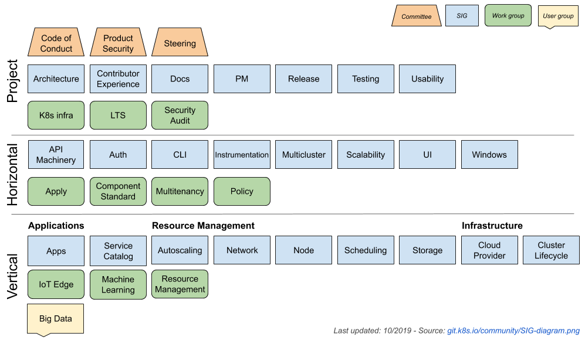
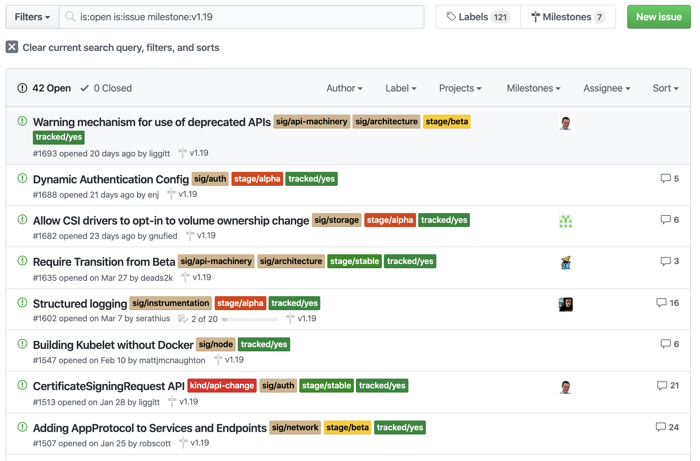
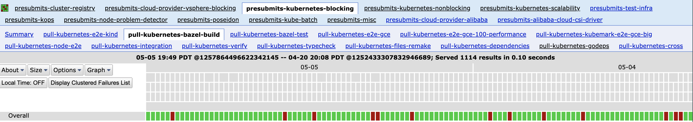
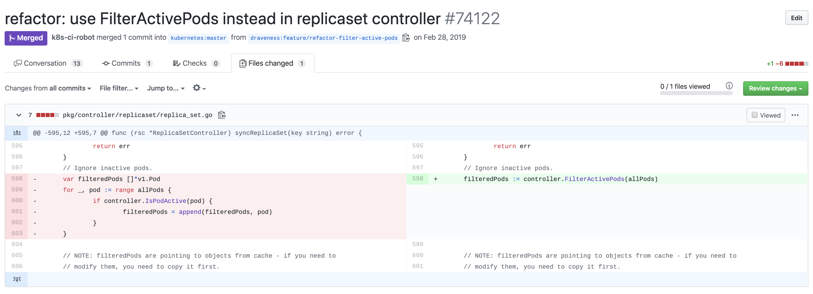
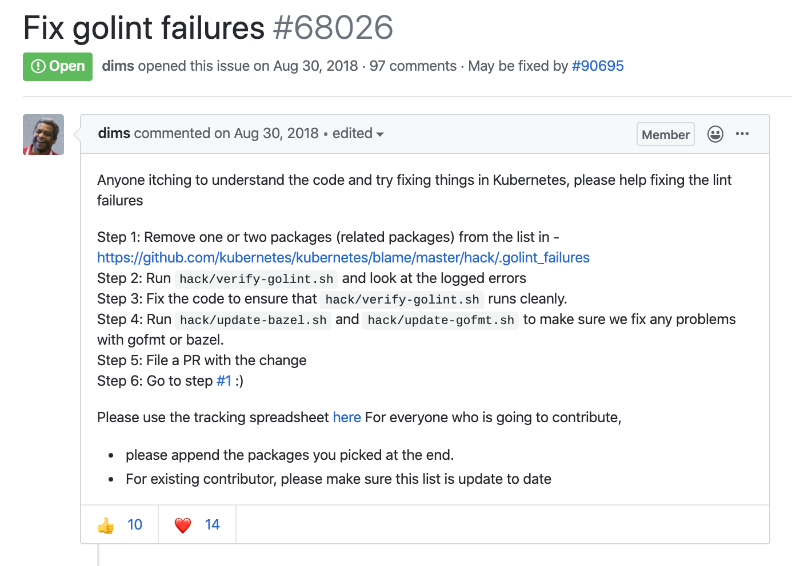
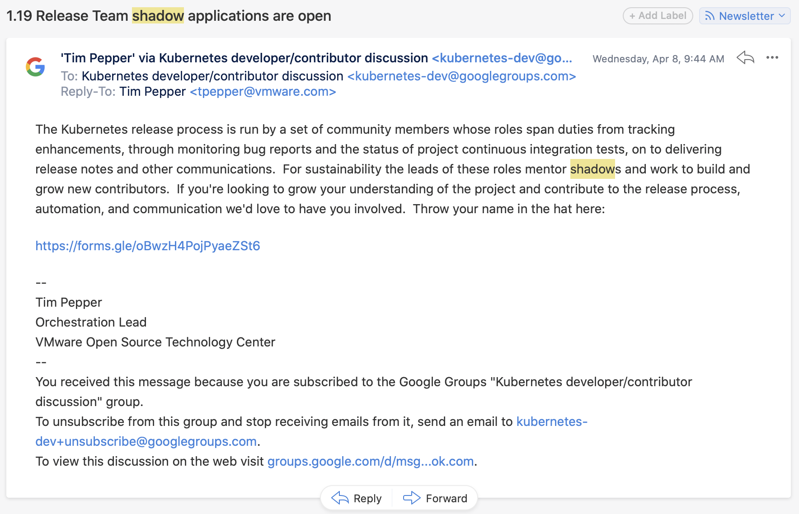

# kubernetes 贡献指南

来源 1：[Kubernetes 贡献指南](https://draveness.me/kubernetes-contributor/)

来源 2：[你该如何为 Kubernetes 定制特性](https://draveness.me/cloud-native-kubernetes-extension/)

开源软件（Open-source software）是源代码通过特定许可发布的软件，开源软件的所有者可以赋予使用者以任意目的学习、修改和再分发软件的权利。今天软件行业和互联网行业的高速发展就建立在自由使用和分发的软件上，作为工程师，我们可以任意访问 Linux、MySQL 和 Redis 以及各种编程语言和框架的源代码，学习它们的设计和实现，利用前人的工作迅速搭建自己的项目。

这篇文章将以 Kubernetes 为例，分享作者是如何为开源项目提交代码并参与社区讨论的。Kubernetes 目前已经是云时代的操作系统，作为容器编排领域的事实标准和云原生领域的关键项目，Kubernetes 的使用和实现原理可能是在云原生时代工程师的必备技能。

## 一、预备知识

在正式介绍我们如何为 Kubernetes 提交代码成为贡献者之前，我们需要先对 Kubernetes 社区中的一些概念有基本的了解，这样才能更快地在社区中找到相关的资料并快速融入社区，为社区做出贡献。

### 1、SIG

在 Kubernetes 社区中首先需要了解的概念是 SIG，SIG 的全称是 Special Interest Groups，即特别兴趣小组，它们是 Kubernetes 社区中关注特定模块的永久组织，Kubernetes 作为一个拥有几十万行源代码的项目，单一的小组是无法了解其实现的全貌的：

```bash
$ cloc pkg
    3751 text files.
    3646 unique files.
    1048 files ignored.

github.com/AlDanial/cloc v 1.78  T=3.39 s (797.7 files/s, 200852.1 lines/s)
--------------------------------------------------------------------------------
Language                      files          blank        comment           code
--------------------------------------------------------------------------------
Go                             2687          70693          88073         522069
Markdown                          5            139              0            431
JSON                              7              0              0            189
Protocol Buffers                  3             30             37             70
YAML                              2              0              0             48
Bourne Shell                      2             14             28             30
Bourne Again Shell                2              2              2              3
--------------------------------------------------------------------------------
SUM:                           2708          70878          88140         522840
--------------------------------------------------------------------------------
```

Kubernetes 目前包含 20 多个 SIG，它们分别负责了 Kubernetes 项目中的不同模块，这是我们参与 Kubernetes 社区时关注最多的小组；作为刚刚参与社区的开发者，我们可以从 sig/apps、sig/node 和 sig/scheduling 这几个 SIG 开始，它们的职责相对比较明确，从这几个 SIG 的工作入手可以较快的了解社区的工作流程。

兴趣小组：



除了 SIG 之外，Kubernetes 社区中还包含工作小组（Working Groups、WG）和用户小组（User Groups，UG），这些组织可以在我们熟悉 Kubernetes 的社区运作方式后自行了解[2](https://draveness.me/kubernetes-contributor/#fn:2)。

### 2、KEP

KEP 的全称是 Kubernetes Enhancement Proposal，因为 Kubernetes 目前已经是比较成熟的项目了，所有的变更都会影响下游的使用者，对于功能和 API 的修改都需要先在 [kubernetes/enhancements](https://github.com/kubernetes/enhancements) 仓库对应 SIG 的目录下提交提案才能实施，所有的提案都必须经过讨论、通过社区 SIG Leader 的批准。

**KEP 模板**：


很多不熟悉 Kubernetes 工作流程的开发者会在社区中直接提交一个包含 API 改动的提交，但是这类提交如果没有对应 KEP 是不会被社区合入的。正是因为有了这些机制，我们才可以找到对应功能背后的设计思路以及社区成员对功能的详细讨论，从这些讨论、交流以及最后产出的提案中，我们都能够找到非常多有价值的内容。

## 二、期望和收获

不同的社区其实有着截然不同的特质，从不同的社区中我们能够学习到不同的东西，社区的管理与运作方式也会影响着参与的每个贡献者。Kubernetes 社区是一个运作比较良好的成熟社区，与其它的开源社区相比，Kubernets 社区相对比较规范，对于新人也比较友好。作者将从以下项目设计、分布式协作和影响力几个方面谈一谈从 Kubernetes 开源社区中能得到什么。

### 1、项目设计

Kubernetes 社区中包含了非常多值得了解和学习的内容，我们能在 [kubernetes/enhancements](https://github.com/kubernetes/enhancements) 仓库中找到当前正处于开发阶段的所有功能和提案，如下图所示，我们能通过 Milestones 过滤 v1.19 会被实现的 KEP[3](https://draveness.me/kubernetes-contributor/#fn:3)：

**Kubernetes v1.19 提案**：



所有进入开发状态的功能都会对应一个非常详细的 KEP 提案，Kubernetes 的提案其实都是非常规范的，我们在日常的开发中也可以使用类似的格式写设计文档或者技术文档，我们在这里简单展示一下 sig/scheduling 调度框架提案的目录[4](https://draveness.me/kubernetes-contributor/#fn:4)：

```markdwon
Summary
Motivation
  Goals
  Non-Goals
Proposal
  ...
Use Cases
  Coscheduling
  Dynamic Resource Binding
  Custom Scheduler Plugins (out of tree)
Test Plans
Graduation Criteria
Implementation History
```

Kubernetes 早期的开发也没有今天这么规范，当时的 KEP 也没有像现在这么复杂，最近几年新实现的功能都有着比较详细的 KEP 可以供我们阅读，这些开发者撰写的文档经过了长时间的社区讨论和 Review 作为补充资料理解 Kubernetes 的设计与实现非常有帮助。

### 2、分布式协作

与公司内部项目的开发模式不同，几乎所有的开源社区都是一个分布式的、松散的组织，这种特殊的场景非常考验项目的管理方式，而这种分布式的运维方式很值得我们学习和思考。

Kubernetes 中所有的社区会议都会使用 Zoom 录制并上传到 Youtube，大多数的讨论和交流也都会在对应的 issue 和 PR 中，十几条或者几十条的讨论在 Kubernetes 的 issue 中非常常见，[Volumes are created in container with root ownership and strict permissions](https://github.com/kubernetes/kubernetes/issues/2630) 中就包含了 200 多条的讨论。

Kubernetes 社区除了提倡公开讨论之外，它还包含功能强大的测试系统，每个提交的 PR 都需要通过两个以上成员的 Review 以及几千个单元测试、集成测试、端到端测试以及扩展性测试，这些测试共同保证了项目的稳定：

**Kubernetes PR 检查**：


测试和测试框架都由专门的 SIG 负责，[kubernetes/test-infra](https://github.com/kubernetes/test-infra) 项目中包含了 Kubernetes 的测试基础设置，我们能够在如下所示的测试大盘中看到某个测试在过去一段时间的通过情况[5](https://draveness.me/kubernetes-contributor/#fn:5)，很多端到端测试都会启动 Kubernetes 集群并在真实的环境中测试代码的逻辑，它们可能一次会执行几十分钟并有一定的概率出现抖动（Flaky）。

**Kubernetes 测试大盘**：



由于社区中的测试太过复杂，很多时候由于错误的代码被合入主分支就会阻塞后续的代码的合入，这时可能需要对应的 SIG 来解决这些比较紧急的问题，这些复杂的合并流程是为了保证项目的代码质量，而我们在为社区做贡献时也能学到规范的提案流程、代码提交流程以及分布式协作的最佳实践。

### 3、影响力

提高个人和公司在开源社区的影响力也是参与社区的重要目的，这一点其实也是老生常谈了，我们在这里就简单介绍一下：

- 对于个人来说，参与开源项目可以快速理解项目的实现原理以及工作流程，如果想要在未来从事相关的工作，参与开源项目的经历一定是加分项；
- 对于公司来说，参与开源项目可以提高公司在开源社区的话语权，提高公司的技术影响力，足够的话语权也会让开源社区在关键需求上有较快的支持，减少与社区代码的分叉，降低维护成本并满足公司内部的需求；

## 三、操作指南

参与开源项目是需要额外付出时间和精力的，如果没有足够的时间和精力，想要参与开源项目并成为组织的成员也是很困难的，但是作为知名的开源项目，偶尔了解并学习一下相关的模块也是比较有趣的。参与开源项目不一定要从非常复杂的功能或者提交开始，作者在 Kubernetes 中提交的第一个 PR 也只是删除了一段重复的代码[6](https://draveness.me/kubernetes-contributor/#fn:6)：

**作者在 Kubernetes 中的第一个提交**



任何一个对代码库有利的 PR 都是值得提交的，将修复代码中的 typo 或者静态检查错误作为最开始的工作是没有任何问题的，这能够帮助我们快速热身，不过在熟悉 Kubernetes 的提交流程之后就没有必要做出类似的提交了，因为所有的提交都需要 Reviewer 和 Approver 的批准，我们应该尽可能地做出有意义的变动，减少他们的工作量。

我们在这里将为各位读者提供三种为 Kubernetes 项目做贡献的热身方式，分别是从阅读代码开始、从静态检查开始和从项目管理开始，这三种方式可以作为我们为开源项目做贡献的起点。

### 1、从阅读源码开始

Kubernetes 作为一个巨大的项目，社区很难保证所有代码都是高质量的并且没有错误的，我们可以从自己熟悉的模块入手了解该模块的实现原理，在阅读源代码的过程中，我们很容易就能发现源代码中的一些 typo 和缺陷，这时就可以提交 PR 修复这些问题，作者就是通过这种方式开始为 Kubernetes 贡献代码。

### 2、从静态检查开始

Kubernetes 项目中有一个修复静态检查错误的 issue — [Fix golint failures #68026](https://github.com/kubernetes/kubernetes/issues/68026)，因为 Kubernetes 项目使用 golint 作为静态检查工具，在引入 golint 之前，很多的 package 都没有严格遵循标准的静态检查，这个 issue 中有非常详细的操作流程，我们可以遵循指南修复 Kubernetes 中的静态检查错误：

**修复 golint 错误**



[`.golint_failures`](https://github.com/kubernetes/kubernetes/blame/master/hack/.golint_failures) 文件中忽略了几百个 Package 中的静态检查，你可以在其中选择合适的 Package 作为成为 Kubernetes 贡献者的第一步，很多刚刚加入社区的开发者都是从这里开始的。

### 3、从项目管理开始

除了从阅读源码和静态检查之外，部分读者也可以选择参与 Kubernetes 的项目管理开始参与社区的工作，在每个 Kubernetes 的发布周期之前，社区中的 sig/release 团队都会开始收集发布团队影子申请表：

**发布团队影子申请**



你可以在 [Kubernetes Release Team](https://github.com/kubernetes/sig-release/tree/master/release-team) 中找到发布团队中不同角色的职责、关注对应的日历并在收集申请表时提交自己的信息，需要注意的是，成为发布团队的影子成员需要较多的时间，对于亚洲时区的开发者可能不是特别友好，所以参与的成本会相对较高，不过从中也能学习到 Kubernetes 的发布管理流程，感兴趣的读者可以尝试一下。

## 总结

作者从 2019 年初开始参与 Kubernetes 社区的开发，到现在已经有一年多的时间了，过去一段时间一直在参与调度器的相关工作。作者不仅从 Kubernetes 社区中不仅学习到了 Go 语言的开发规范、分布式社区的治理方式，还从社区中的很多优秀工程师身上学到了软件设计的一些技巧，与优秀的开发者交流也能为我们增加很多见识和经验，这些都是在日常工作中很难得到的，而优秀的开源社区和项目中真的是遍地黄金，等着我们去挖掘和学习。

## Reference

1. Wikipedia: Open-source software https://en.wikipedia.org/wiki/Open-source_software [↩︎](https://draveness.me/kubernetes-contributor/#fnref:1)
2. Kubernetes Community Governance https://github.com/kubernetes/community#governance [↩︎](https://draveness.me/kubernetes-contributor/#fnref:2)
3. Issues · kubernetes / enhancements https://github.com/kubernetes/enhancements/issues?q=is%3Aopen+is%3Aissue+milestone%3Av1.19 [↩︎](https://draveness.me/kubernetes-contributor/#fnref:3)
4. Scheduling Framework https://github.com/kubernetes/enhancements/blob/master/keps/sig-scheduling/20180409-scheduling-framework.md [↩︎](https://draveness.me/kubernetes-contributor/#fnref:4)
5. presubmits-kubernetes-blocking#pull-kubernetes-bazel-build https://testgrid.k8s.io/presubmits-kubernetes-blocking#pull-kubernetes-bazel-build [↩︎](https://draveness.me/kubernetes-contributor/#fnref:5)
6. refactor: use FilterActivePods instead in replicaset controller https://github.com/kubernetes/kubernetes/pull/74122 [↩︎](https://draveness.me/kubernetes-contributor/#fnref:6)