# 详解 Kubernetes Volume 的实现原理

来源：[详解 Kubernetes Volume 的实现原理](https://draveness.me/kubernetes-volume/)

在 Kubernetes 集群中，虽然无状态的服务非常常见，但是在实际的生产中仍然会需要在集群中部署一些「有状态」的节点，比如一些存储中间件、消息队列等等。

然而 Kubernetes 中的每一个容器随时都可能因为某些原因而被删除和重启，容器中的文件也会随着它的删除而丢失，所以我们需要对集群中的某些文件和数据进行『持久化』；除此之外，由于同一个 Pod 中的多个 Container 可能也会有共享文件的需求，比如通过共享文件目录的方式为 nginx 生成需要代理的静态文件，所以我们需要一种方式来解决这两个问题。

作为 Kubernetes 集群中除了 Pod 和 Service 之外最常见的基本对象，Volume 不仅能够解决 Container 中文件的临时性问题，也能够让同一个 Pod 中的多个 Container 共享文件。

## 一、概述

Kubernetes 中的 Volume 种类非常多，它不仅要支持临时的、易失的磁盘文件，还需要解决持久存储的问题；第一个问题往往都比较容易解决，后者作为持久存储在很多时候都需要与云服务商提供的存储方案打交道，如果是 Kubernetes 中已经支持的存储类型倒是还好，遇到不支持的类型还是比较麻烦的。


除了卷和持久卷之外，Kubernetes 还有另外一种更加复杂的概念 - 动态存储供应，它能够允许存储卷按需进行创建，不再需要集群的管理员手动调用云服务商提供的接口或者界面创建新的存储卷。

集群中的每一个卷在被 Pod 使用时都会经历四个操作，也就是附着（Attach）、挂载（Mount）、卸载（Unmount）和分离（Detach）。

如果 Pod 中使用的是 EmptyDir、HostPath 这种类型的卷，那么这些卷并不会经历附着和分离的操作，它们只会被挂载和卸载到某一个的 Pod 中，不过如果使用的云服务商提供的存储服务，**这些持久卷只有附着到某一个节点之后**才可以被挂在到相应的目录下，不过在其他节点使用这些卷时，该存储资源也需要先与当前的节点分离。

### 1、卷

在这一节中提到的卷（Volume）其实是一个比较特定的概念，它并不是一个持久化存储，可能会随着 Pod 的删除而删除，常见的卷就包括 EmptyDir、HostPath、ConfigMap 和 Secret，这些卷与所属的 Pod 具有相同的生命周期，它们可以通过如下的方式挂载到 Pod 下面的某一个目录中：

```yaml
apiVersion: v1
kind: Pod
metadata:
  name: test-pod
spec:
  containers:
  - name: test-container
    image: k8s.gcr.io/busybox
    volumeMounts:
    - name: cache-volume
      mountPath: /cache
    - name: test-volume
      mountPath: /hostpath
    - name: config-volume
      mountPath: /data/configmap
    - name: special-volume
      mountPath: /data/secret
  volumes:
  - name: cache-volume
    emptyDir: {}
  - name: hostpath-volume
    hostPath:
      path: /data/hostpath
      type: Directory
  - name: config-volume
    configMap:
      name: special-config
  - name: secret-volume
    secret:
      secretName: secret-config
```

需要注意的是，当我们将 ConfigMap 或者 Secret 『包装』成卷并挂载到某个目录时，我们其实创建了一些新的 Volume，这些 Volume 并不是 Kubernetes 中的对象，它们只存在于当前 Pod 中，随着 Pod 的删除而删除，但是需要注意的是这些『临时卷』的删除并不会导致相关 `ConfigMap` 或者 `Secret` 对象的删除。

从上面我们其实可以看出 Volume 没有办法脱离 Pod 而生存，它与 Pod 拥有完全相同的生命周期，而且它们也不是 Kubernetes 对象，所以 Volume 的主要作用还是用于跨节点或者容器对数据进行同步和共享。

### 2、持久卷

临时的卷没有办法解决数据持久存储的问题，想要让数据能够持久化，首先就需要将 Pod 和卷的声明周期分离，这也就是引入持久卷 `PersistentVolume(PV)` 的原因。我们可以将 `PersistentVolume` 理解为集群中资源的一种，它与集群中的节点 Node 有些相似，PV 为 Kubernete 集群提供了一个如何提供并且使用存储的抽象，与它一起被引入的另一个对象就是 `PersistentVolumeClaim(PVC)`，这两个对象之间的关系与节点和 Pod 之间的关系差不多：


`PersistentVolume` 是集群中的一种被管理员分配的存储资源，而 `PersistentVolumeClaim` 表示用户对存储资源的申请，它与 Pod 非常相似，PVC 消耗了持久卷资源，而 Pod 消耗了节点上的 CPU 和内存等物理资源。

因为 PVC 允许用户消耗抽象的存储资源，所以用户需要不同类型、属性和性能的 PV 就是一个比较常见的需求了，在这时我们可以通过 `StorageClass` 来提供不同种类的 PV 资源，上层用户就可以直接使用系统管理员提供好的存储类型。

#### 1）访问模式

Kubernetes 中的 PV 提供三种不同的访问模式，分别是 `ReadWriteOnce`、`ReadOnlyMany` 和 `ReadWriteMany`，这三种模式的含义和用法我们可以通过它们的名字推测出来：

- `ReadWriteOnce` 表示当前卷可以被一个节点使用读写模式挂载；
- `ReadOnlyMany` 表示当前卷可以被多个节点使用只读模式挂载；
- `ReadWriteMany` 表示当前卷可以被多个节点使用读写模式挂载；

不同的卷插件对于访问模式其实有着不同的支持，AWS 上的 `AWSElasticBlockStore` 和 GCP 上的 `GCEPersistentDisk` 就只支持 `ReadWriteOnce` 方式的挂载，不能同时挂载到多个节点上，但是 `CephFS` 就同时支持这三种访问模式。

#### 2）回收策略

当某个服务使用完某一个卷之后，它们会从 apiserver 中删除 PVC 对象，这时 Kubernetes 就需要对卷进行回收（Reclaim），持久卷也同样包含三种不同的回收策略，这三种回收策略会指导 Kubernetes 选择不同的方式对使用过的卷进行处理。


第一种回收策略就是保留（Retain）PV 中的数据，如果希望 PV 能够被重新使用，系统管理员需要删除被使用的 `PersistentVolume` 对象并手动清除存储和相关存储上的数据。

另一种常见的回收策略就是删除（Delete），当 PVC 被使用者删除之后，如果当前卷支持删除的回收策略，那么 PV 和相关的存储会被自动删除，如果当前 PV 上的数据确实不再需要，那么将回收策略设置成 Delete 能够节省手动处理的时间并快速释放无用的资源。

#### 3）存储供应

Kubernetes 集群中包含了很多的 PV 资源，而 PV 资源有两种供应的方式，一种是静态的，另一种是动态的，静态存储供应要求集群的管理员预先创建一定数量的 PV，然后使用者通过 PVC 的方式对 PV 资源的使用进行声明和申请；但是当系统管理员创建的 PV 对象不能满足使用者的需求时，就会进入动态存储供应的逻辑，供应的方式是基于集群中的 `StorageClass` 对象，当然这种动态供应的方式也可以通过配置进行关闭。

## 二、管理

Volume 的创建和管理在 Kubernetes 中主要由卷管理器 `VolumeManager` 和 `AttachDetachController` 和 `PVController` 三个组件负责。其中卷管理器会负责卷的创建和管理的大部分工作，而 `AttachDetachController` 主要负责对集群中的卷进行 Attach 和 Detach，`PVController` 负责处理持久卷的变更，文章接下来的内容会详细介绍这几部分之间的关系、工作原理以及它们是如何协作的。

### 1、kubelet

作者在 [详解 Kubernetes Pod 的实现原理](https://draveness.me/kubernetes-pod) 一文中曾简单介绍过 kubelet 和 Pod 的关系，前者会负责后者的创建和管理，kubelet 中与 Pod 相关的信息都是从 apiserver 中获取的：

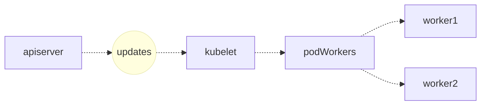

两者的通信会使用一个 `kubetypes.PodUpdate` 类型的 Channel，kubelet 从 apiserver 中获取 Pod 时也会通过字段过滤器 `fields.OneTermEqualSelector(api.PodHostField, string(nodeName))` 仅选择被调度到 kubelet 所在节点上的 Pod：

```go
func NewSourceApiserver(c clientset.Interface, nodeName types.NodeName, updates chan<- interface{}) {
	lw := cache.NewListWatchFromClient(c.CoreV1().RESTClient(), "pods", metav1.NamespaceAll, fields.OneTermEqualSelector(api.PodHostField, string(nodeName)))
	newSourceApiserverFromLW(lw, updates)
}
```

所有对 Pod 的变更最终都会通知给具体的 PodWorker，这些 Worker 协程会调用 kubelet `syncPod` 函数完成对 Pod 的同步：

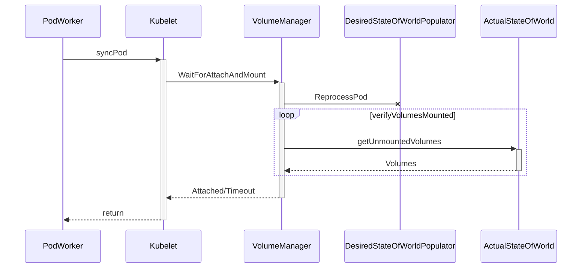

在一个 100 多行的 `syncPod` 方法中，kubelet 会调用 `WaitForAttachAndMount` 方法，等待某一个 Pod 中的全部卷已经被成功地挂载：

```go
func (kl *Kubelet) syncPod(o syncPodOptions) error {
	pod := o.pod
	
	// ...
	if !kl.podIsTerminated(pod) {
		kl.volumeManager.WaitForAttachAndMount(pod)
	}
	// ...

	return nil
}
```

这个方法会将当前的 Pod 加入需要重新处理卷挂载的队列并在循环中持续调用 `verifyVolumesMounted` 方法来比较期望挂载的卷和实际挂载卷的区别，这个循环会等待两者变得完全相同或者超时后才会返回，当前方法的返回一般也意味着 Pod 中的全部卷已经挂载成功了。

### 2、VolumeManager（卷管理器）

当前节点卷的管理就都是由 `VolumeManager` 来负责了，在 Kubernetes 集群中的每一个节点（Node）上的 kubelet 启动时都会运行一个 `VolumeManager`Goroutine，它会负责在当前节点上的 Pod 和 Volume 发生变动时对 Volume 进行挂载和卸载等操作。

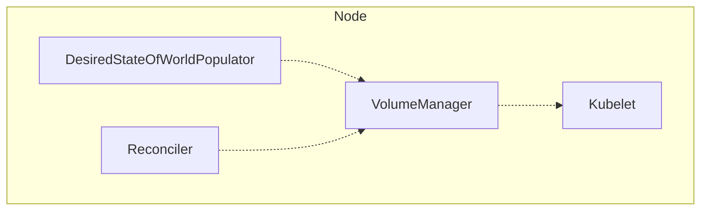

这个组件会在运行时启动两个 Goroutine 来管理节点中的卷，其中一个是 `DesiredStateOfWorldPopulator`，另一个是 `Reconciler`：

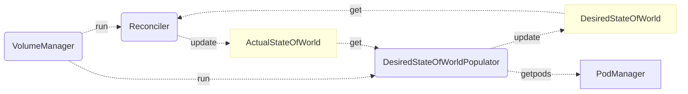

如上图所示，这里的 `DesiredStateOfWorldPopulator` 和 `Reconciler` 两个 Goroutine 会通过图中两个的 `XXXStateOfWorld` 状态进行通信，`DesiredStateOfWorldPopulator` 主要负责从 Kubernetes 节点中获取新的 Pod 对象并更新 `DesiredStateOfWorld` 结构；而后者会根据实际状态和当前状态的区别对当前节点的状态进行迁移，也就是通过 `DesiredStateOfWorld` 中状态的变更更新 `ActualStateOfWorld` 中的内容。

卷管理器中的两个 Goroutine，一个根据工程师的需求更新节点的期望状态 `DesiredStateOfWorld`，另一个 Goroutine 保证节点向期望状态『迁移』，也就是说 `DesiredStateOfWorldPopulator` 是卷管理器中的消费者，而 `Reconciler` 是生产者，接下来我们会分别介绍这两个 Goroutine 的工作和实现。

#### 1）DesiredStateOfWorldPopulator

作为卷管理器中的消费者，`DesiredStateOfWorldPopulator` 会根据工程师的请求不断修改当前节点的期望状态，我们可以通过以下的时序图来了解它到底做了哪些工作：

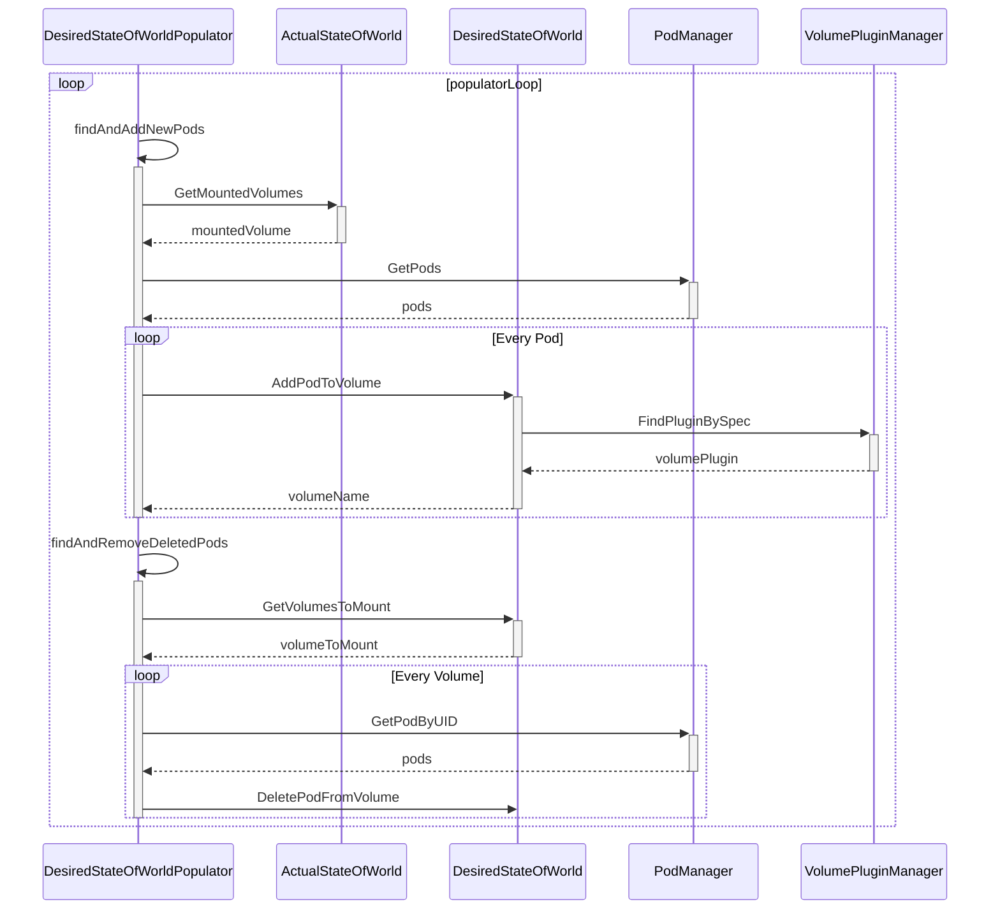

整个 `DesiredStateOfWorldPopulator` 运行在一个大的循环 `populatorLoop`中，当前循环会通过两个方法 `findAndAddNewPods` 和 `findAndRemoveDeletedPods` 分别获取节点中被添加的新 Pod 或者已经被删除的老 Pod，获取到 Pod 之后会根据当前的状态修改期望状态：

```go
func (dswp *desiredStateOfWorldPopulator) findAndAddNewPods() {
	mountedVolumesForPod := make(map[volumetypes.UniquePodName]map[string]cache.MountedVolume)

	processedVolumesForFSResize := sets.NewString()
	for _, pod := range dswp.podManager.GetPods() {
		if dswp.isPodTerminated(pod) {
			continue
		}
		dswp.processPodVolumes(pod, mountedVolumesForPod, processedVolumesForFSResize)
	}
}
```

就像时序图和代码中所描述的，`DesiredStateOfWorldPopulator` 会从 `PodManager` 中获取当前节点中的 Pod，随后调用 `processPodVolumes` 方法为将所有的 Pod 对象加入 `DesiredStateOfWorld` 结构中：

```go
func (dswp *desiredStateOfWorldPopulator) processPodVolumes(pod *v1.Pod, mountedVolumesForPod map[volumetypes.UniquePodName]map[string]cache.MountedVolume, processedVolumesForFSResize sets.String) {
	uniquePodName := util.GetUniquePodName(pod)
	if dswp.podPreviouslyProcessed(uniquePodName) {
		return
	}

	mountsMap, devicesMap := dswp.makeVolumeMap(pod.Spec.Containers)

	for _, podVolume := range pod.Spec.Volumes {
		pvc, volumeSpec, volumeGidValue, _ := dswp.createVolumeSpec(podVolume, pod.Name, pod.Namespace, mountsMap, devicesMap)
		dswp.desiredStateOfWorld.AddPodToVolume(uniquePodName, pod, volumeSpec, podVolume.Name, volumeGidValue)
	}

	dswp.markPodProcessed(uniquePodName)
	dswp.actualStateOfWorld.MarkRemountRequired(uniquePodName)
}
```

`findAndAddNewPods` 方法做的主要就是将节点中加入的新 Pod 添加到 `DesiredStateOfWorld` 中，而另一个方法 `findAndRemoveDeletedPods` 其实也做着类似的事情，它会将已经被删除的节点从 `DesiredStateOfWorld` 中剔除，总而言之 `DesiredStateOfWorldPopulator` 就是将当前节点的期望状态同步到 `DesiredStateOfWorld` 中，等待消费者的处理。

#### 2）Reconciler

`VolumeManager` 持有的另一个 Goroutine `Reconciler` 会负责对当前节点上的 Volume 进行管理，它在正常运行时会启动 `reconcile` 循环，在这个方法中会分三次对当前状态和期望状态不匹配的卷进行卸载、挂载等操作：

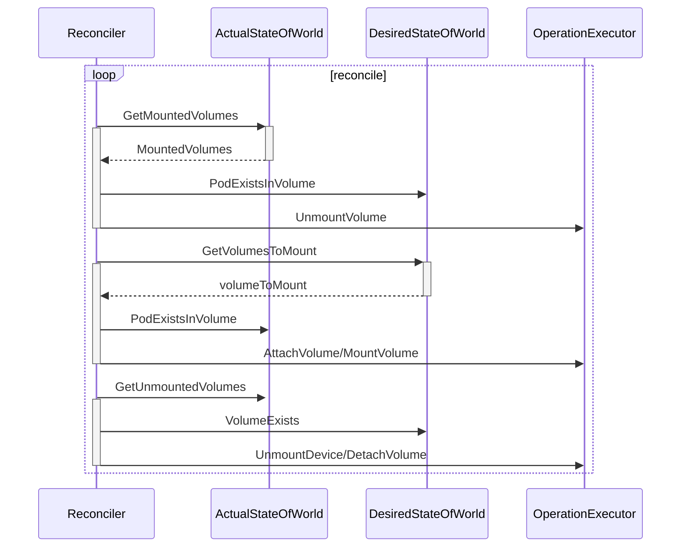

在当前的循环中首先会保证应该被卸载但是仍然在节点中存在的卷被卸载，然后将应该挂载的卷挂载到合适的位置，最后将设备与节点分离或者卸载，所有挂载和卸载的操作都是通过 `OperationExecutor` 完成的，这个结构体负责调用相应的插件执行操作，我们会在文章的后面展开进行介绍。

### 3、AttachDetachController（附着分离控制器）

除了 `VolumeManager` 之外，另一个负责管理 Kubernetes 卷的组件就是 `AttachDetachController` 了，引入这个组件的目的主要是：

1. 让卷的挂载和卸载能够与节点的可用性脱离；
   - 一旦节点或者 kubelet 宕机，附着（Attach）在当前节点上的卷应该能够被分离（Detach），分离之后的卷就能够再次附着到其他节点上；
2. 保证云服务商秘钥的安全；
   - 如果每一个 kubelet 都需要触发卷的附着和分离逻辑，那么每一个节点都应该有操作卷的权限，但是这些权限应该只由主节点掌握，这样能够降低秘钥泄露的风险；
3. 提高卷附着和分离部分代码的稳定性；

> 这些内容都是在 Kubernetes 官方项目的 GitHub issue [Detailed Design for Volume Attach/Detach Controller #20262](https://github.com/kubernetes/kubernetes/issues/20262) 中讨论的，想要了解 `AttachDetachController` 出现的原因可以阅读相关的内容。

每一个 `AttachDetachController` 其实也包含 `Reconciler` 和 `DesiredStateOfWorldPopulator` 两个组件，这两个组件虽然与 `VolumeManager` 中的两个组件重名，实现的功能也非常类似，与 `VolumeManager` 具有几乎相同的数据流向，但是这两个 Goroutine 是跑在 Kubernetes 主节点中的，所以实现上可能一些差异：

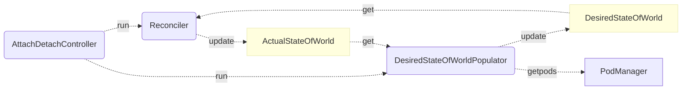

首先，无论是 `Reconciler` 还是 `DesiredStateOfWorldPopulator`，它们同步的就不再只是某个节点上 Pod 的信息了，它们需要对整个集群中的 Pod 对象负责，相关数据也不再是通过 apiserver 拉取了，而是使用 `podInformer` 在 Pod 对象发生变更时调用相应的方法。

#### 1）DesiredStateOfWorldPopulator

作为 `AttachDetachController` 启动的 Goroutine，`DesiredStateOfWorldPopulator` 的主要作用是从当前集群的状态中获取 Pod 对象并修改 `DesiredStateOfWorld` 结构，与 `VolumeManager` 中的同名 Goroutine 起到相同的作用，作为整个链路的生产者，它们只是在实现上由于处理 Pod 范围的不同有一些区别：

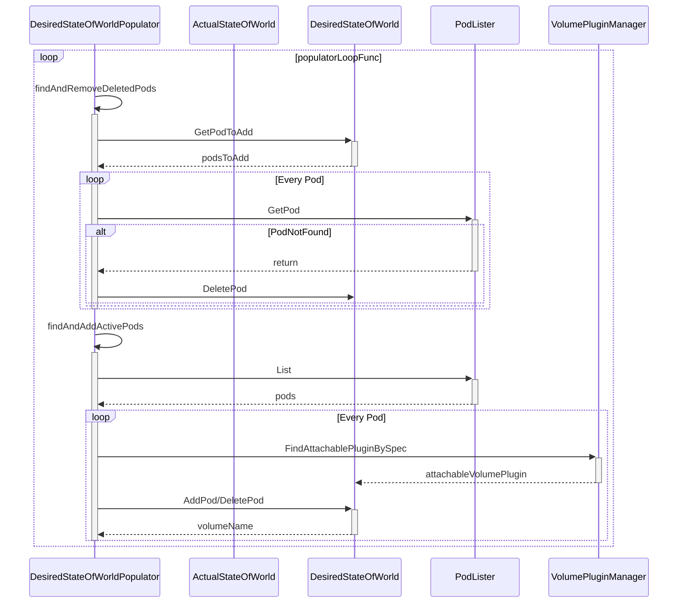

`AttachDetachController` 中的 `DesiredStateOfWorldPopulator` 协程就主要会先处理 Pod 的删除逻辑，添加 Pod 的逻辑都是根据 `listPodsRetryDuration` 的设置周期性被触发的，所以从这里我们就能看到 `AttachDetachController` 其实主要还是处理被删除 Pod 中 Volume 的分离工作，当节点或者 kubelet 宕机时能够将节点中的卷进行分离，保证 Pod 在其他节点重启时不会出现问题。

#### 2）Reconciler

另一个用于调节当前状态与期望状态的 Goroutine 在执行它内部的循环时，也会优先处理分离卷的逻辑，后处理附着卷的工作，整个时序图与 `VolumeManager` 中的 `Reconciler` 非常相似：

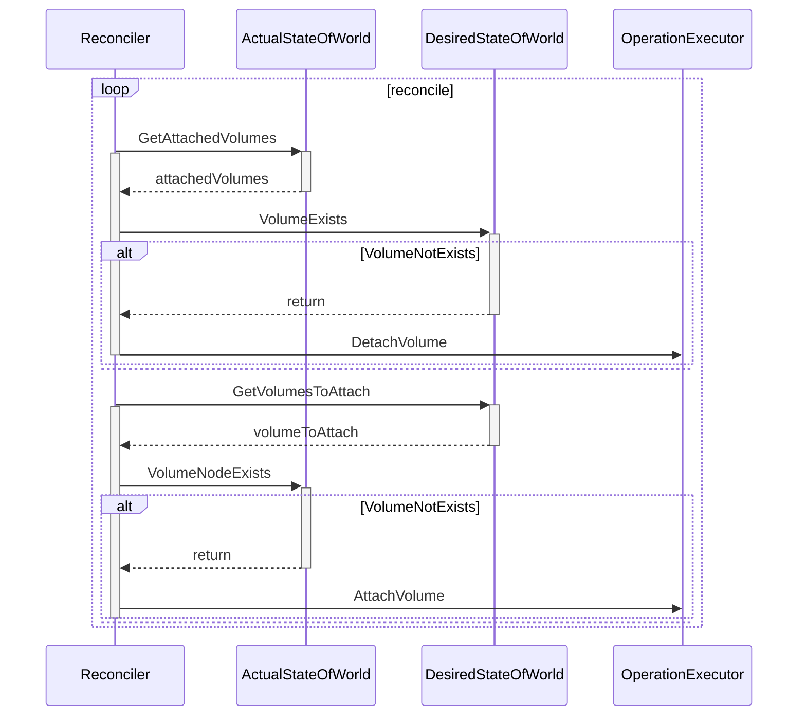

这里处理的工作其实相对更少一些，`Reconciler` 会将期望状态中的卷与实际状态进行比较，然后分离需要分离的卷、附着需要附着的卷，逻辑非常的清晰和简单。

### 4、PVController（持久卷控制器）

作为集群中与 PV 和 PVC 打交道的控制器，持久卷控制器同时运行着三个 Goroutine 用于处理相应的逻辑，其中 `Resync` 协程负责从 Kubernetes 集群中同步 PV 和 PVC 的信息，而另外两个工作协程主要负消费队列中的任务：

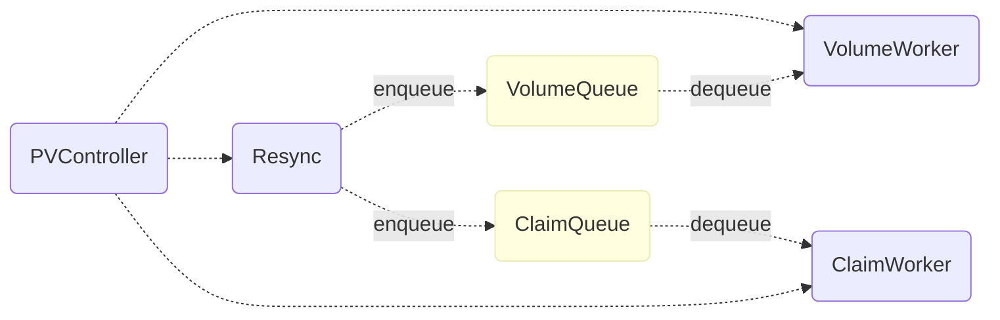

这两个工作协程主要负责对需要绑定或者解绑的 PV 和 PVC 进行处理，例如，当用户创建了新的 PVC 对象时，从集群中查找该 PVC 选择的 PV 并绑定到当前的 PVC 上。

#### 1）VolumeWorker

`VolumeWorker` 协程中执行的最重要的方法其实就是 `syncVolume`，在这个方法中会根据当前 PV 对象的规格对 PV 和 PVC 进行绑定或者解绑：

```go
func (ctrl *PersistentVolumeController) syncVolume(volume *v1.PersistentVolume) error {
	if volume.Spec.ClaimRef == nil {
		return nil
	} else {
		if volume.Spec.ClaimRef.UID == "" {
			return nil
		}
		var claim *v1.PersistentVolumeClaim
		claimName := claimrefToClaimKey(volume.Spec.ClaimRef)
		obj, _, _ := ctrl.claims.GetByKey(claimName)
		claim, _ = obj.(*v1.PersistentVolumeClaim)

		if claim != nil && claim.UID != volume.Spec.ClaimRef.UID {
			claim = nil
		}

		if claim == nil {
			ctrl.reclaimVolume(volume)
		} else if claim.Spec.VolumeName == "" {
			ctrl.claimQueue.Add(claimToClaimKey(claim))
		} else if claim.Spec.VolumeName == volume.Name {
		} else {
			if metav1.HasAnnotation(volume.ObjectMeta, annDynamicallyProvisioned) && volume.Spec.PersistentVolumeReclaimPolicy == v1.PersistentVolumeReclaimDelete {
				ctrl.reclaimVolume(volume)
			} else {
				ctrl.unbindVolume(volume)
			}
		}
	}
	return nil
}
```

如果当前 PV 没有绑定的 PVC 对象，那么这里的 `reclaimVolume` 可能会将当前的 PV 对象根据回收策略将其放回资源池等待重用、回收或者保留；而 `unbindVolume` 会删除 PV 与 PVC 之间的关系并更新 apiserver 中保存的 Kubernetes 对象数据。

#### 2）ClaimWorker

`ClaimWorker` 就是控制器用来决定如何处理一个 PVC 对象的方法了，它会在一个 PVC 对象被创建、更新或者同步时被触发，`syncClaim` 会根据当前对象中的注解决定调用 `syncUnboundClaim` 或者 `syncBoundClaim` 方法来处理相应的逻辑：

```go
func (ctrl *PersistentVolumeController) syncClaim(claim *v1.PersistentVolumeClaim) error {
	if !metav1.HasAnnotation(claim.ObjectMeta, annBindCompleted) {
		return ctrl.syncUnboundClaim(claim)
	} else {
		return ctrl.syncBoundClaim(claim)
	}
}
```

`syncUnboundClaim` 会处理绑定没有结束的 PVC 对象，如果当前 PVC 对象没有对应合适的 PV 存在，那么就会调用 `provisionClaim` 尝试从集群中获取新的 PV 供应，如果能够找到 PV 对象，就会通过 `bind` 方法将两者绑定：

```go
func (ctrl *PersistentVolumeController) syncUnboundClaim(claim *v1.PersistentVolumeClaim) error {
	if claim.Spec.VolumeName == "" {
		delayBinding, err := ctrl.shouldDelayBinding(claim)

		volume, err := ctrl.volumes.findBestMatchForClaim(claim, delayBinding)
		if volume == nil {
			switch {
			case delayBinding:
			case v1helper.GetPersistentVolumeClaimClass(claim) != "":
				ctrl.provisionClaim(claim)
			}
		} else {
			ctrl.bind(volume, claim)
		}
	} else {
		obj, found, _ := ctrl.volumes.store.GetByKey(claim.Spec.VolumeName)
		if found {
			volume, _ := obj.(*v1.PersistentVolume)
			if volume.Spec.ClaimRef == nil {
				ctrl.bind(volume, claim)
			} else if isVolumeBoundToClaim(volume, claim) {
				ctrl.bind(volume, claim)
			}
		}
	}
	return nil
}
```

绑定的过程其实就是将 PV 和 PVC 之间建立起新的关系，更新 Spec 中的数据让两者能够通过引用 Ref 找到另一个对象并将更新后的 Kubernetes 对象存储到 apiserver 中。

另一个用于绑定 PV 和 PVC 对象的方法就是 `syncBoundClaim` 了，相比于 `syncUnboundClaim` 方法，该方法的实现更为简单，直接从缓存中尝试获取对应的 PV 对象：

```go
func (ctrl *PersistentVolumeController) syncBoundClaim(claim *v1.PersistentVolumeClaim) error {
	if claim.Spec.VolumeName == "" {
		return nil
	}
	obj, found, _ := ctrl.volumes.store.GetByKey(claim.Spec.VolumeName)
	if found {
		volume, _ := obj.(*v1.PersistentVolume)
		if volume.Spec.ClaimRef == nil {
			ctrl.bind(volume, claim)
		} else if volume.Spec.ClaimRef.UID == claim.UID {
			ctrl.bind(volume, claim)
		}
	}
	return nil
}
```

如果找到了 PV 对象并且该对象没有绑定的 PVC 或者当前 PV 和 PVC 已经存在了引用就会调用 `bind` 方法对两者进行绑定。

#### 小结

无论是 `VolumeWorker` 还是 `ClaimWorker` 最终都可能会通过 apiserver 更新集群中 etcd 的数据，当然它们也会调用一些底层的插件获取新的存储供应、删除或者重用一些持久卷，我们会在下面介绍插件的工作原理。

## 三、插件

Kubernetes 中的所有对卷的操作最终基本都是通过 `OperationExecutor` 来完成的，这个组件包含了用于附着、挂载、卸载和分离几个常见的操作以及对设备进行操作的一些方法：

```go
type OperationExecutor interface {
	AttachVolume(volumeToAttach VolumeToAttach, actualStateOfWorld ActualStateOfWorldAttacherUpdater) error
	DetachVolume(volumeToDetach AttachedVolume, verifySafeToDetach bool, actualStateOfWorld ActualStateOfWorldAttacherUpdater) error
	MountVolume(waitForAttachTimeout time.Duration, volumeToMount VolumeToMount, actualStateOfWorld ActualStateOfWorldMounterUpdater, isRemount bool) error
	UnmountVolume(volumeToUnmount MountedVolume, actualStateOfWorld ActualStateOfWorldMounterUpdater, podsDir string) error
	// ...
}
```

实现 `OperationExecutor` 接口的私有结构体会通过 `OperatorGenerator` 来生成一个用于挂载和卸载卷的方法，并将这个方法包装在一个 `GeneratedOperations` 结构中，在这之后操作执行器会启动一个新的 Goroutine 用于执行生成好的方法：

```mermaid
graph LR
    OE(OperationExexutor)-. 1. 获取相关方法 .->OG(OperationGenerator)
    OG-. 2. 根据 Spec 获取插件 .->VM(VolumePluginManager)
    VM-. 3. 返回 VolumePlugin .->OG
    OG-. 4. 构建方法 .->OG
    OG-. 5. 生成一个 Operation 结构 .->OE
    OE-. 6. 运行 Operation .->NPO(NestedPendingOperations)
    NPO-. 7. 启动 Goroutine 运行生成的方法 .->Goroutine
```

`VolumePluginManager` 和 `VolumePlugin` 这两个组件在整个流程中帮我们屏蔽了底层不同类型卷的实现差异，我们能直接在上层调用完全相同的接口，剩下的逻辑都由底层的插件来负责。

Kubernetes 提供了插件的概念，通过 `Volume` 和 `Mounter` 两个接口支持卷类型的扩展，作为存储提供商或者不同类型的文件系统，我们都可以通过实现以上的两个接口成为 Kubernetes 存储系统中一个新的存储类型：

```go
type VolumePlugin interface {
	Init(host VolumeHost) error
	GetPluginName() string
	GetVolumeName(spec *Spec) (string, error)
	NewMounter(spec *Spec, podRef *v1.Pod, opts VolumeOptions) (Mounter, error)
	// ...
}

type Mounter interface {
	Volume
	CanMount() error
	SetUp(fsGroup *int64) error
	SetUpAt(dir string, fsGroup *int64) error
	GetAttributes() Attributes
}
```

在这一节中我们将介绍几种不同卷插件的实现，包括最常见的 EmptyDir、ConfigMap、Secret 和 Google 云上的 GCEPersistentDisk，这一节会简单介绍不同卷插件的实现方式，想要了解详细实现的读者可以阅读相关的源代码。

### 1）EmptyDir

EmptyDir 是 Kubernetes 中最简单的卷了，当我们为一个 Pod 设置一个 EmptyDir 类型的卷时，其实就是在当前 Pod 对应的目录创建了一个空的文件夹，这个文件夹会随着 Pod 的删除而删除。

```go
func (ed *emptyDir) SetUpAt(dir string, fsGroup *int64) error {
	ed.setupDir(dir)
	volume.SetVolumeOwnership(ed, fsGroup)
	volumeutil.SetReady(ed.getMetaDir())

	return nil
}

func (ed *emptyDir) setupDir(dir string) error {
	if err := os.MkdirAll(dir, perm); err != nil {
		return err
	}
	
	// ...

	return nil
}
```

`SetUpAt` 方法其实就实现了对这种类型卷的创建工作，每当 Pod 被分配到了某个节点上，对应的文件目录就会通过 `MkdirAll` 方法创建，如果使用者配置了 medium 字段，也会选择使用相应的文件系统挂载到当前目录上，例如：tmpfs、nodev 等。

```yaml
apiVersion: v1
kind: Pod
metadata:
  name: test-pd
spec:
  containers:
  - image: k8s.gcr.io/test-webserver
    name: test-container
    volumeMounts:
    - mountPath: /cache
      name: cache-volume
  volumes:
  - name: cache-volume
    emptyDir: {}
```

我们经常会使用 EmptyDir 类型的卷在多个容器之间共享文件、充当缓存或者保留一些临时的日志，总而言之，这是一种经常被使用的卷类型。

### 2）ConfigMap 和 Secret

另一种比较常见的卷就是 ConfigMap 了，首先，ConfigMap 本身就是 Kubernetes 中常见的对象了，其中的 `data` 就是一个存储了从文件名到文件内容的字段，这里的 ConfigMap 对象被挂载到文件目录时就会创建一个名为 `redis-config` 的文件，然后将文件内容写入该文件：

```yaml
apiVersion: v1
kind: ConfigMap
data:
  redis-config: |
    maxmemory 2mb
    maxmemory-policy allkeys-lru    
```

在对 ConfigMap 类型的卷进行挂载时，总共需要完成三部分工作，首先从 apiserver 中获取当前 ConfigMap 对象，然后根据当前的 ConfigMap 生成一个从文件名到文件内容的键值对，最后构造一个 Writer 并执行 `Write` 方法写入内容：

```go
func (b *configMapVolumeMounter) SetUpAt(dir string, fsGroup *int64) error {
	configMap, _ := b.getConfigMap(b.pod.Namespace, b.source.Name)

	totalBytes := totalBytes(configMap)
	payload, _ := MakePayload(b.source.Items, configMap, b.source.DefaultMode, false)

	writerContext := fmt.Sprintf("pod %v/%v volume %v", b.pod.Namespace, b.pod.Name, b.volName)
	writer, _ := volumeutil.NewAtomicWriter(dir, writerContext)
	writer.Write(payload)

	return nil
}
```

在涉及挂载的函数几个中，作者想要着重介绍的也就是在底层直接与文件系统打交道的 `writePayloadToDir` 方法：

```go
func (w *AtomicWriter) writePayloadToDir(payload map[string]FileProjection, dir string) error {
	for userVisiblePath, fileProjection := range payload {
		content := fileProjection.Data
		mode := os.FileMode(fileProjection.Mode)
		fullPath := path.Join(dir, userVisiblePath)
		baseDir, _ := filepath.Split(fullPath)

		os.MkdirAll(baseDir, os.ModePerm)
		ioutil.WriteFile(fullPath, content, mode)
		os.Chmod(fullPath, mode)
	}

	return nil
}
```

这个方法使用了 `os` 包提供的接口完成了拼接文件名、创建相应文件目录、写入文件并且修改文件模式的工作，将 ConfigMap `data` 中的数据映射到了一个文件夹中，达到了让 Pod 中的容器可以直接通过文件系统获取内容的目的。

对于另一个非常常见的卷类型 Secret，Kubernetes 其实也做了几乎完全相同的工作，也是先获取 Secret 对象，然后构建最终写入到文件的键值对，最后初始化一个 Writer 并调用它的 `Write` 方法，从这里我们也能看出在卷插件这一层对于 ConfigMap 和 Secret 的处理几乎完全相同，并没有出现需要对 Secret 对象中的内容进行解密的工作。

### 3）GCEPersistentDisk

最后一个要介绍的卷与上面的几种都非常的不同，它在底层使用的是云服务商提供的网络磁盘，想要在一个节点上使用云磁盘其实总共需要两个步骤，首先是要将云磁盘附着到当前的节点上，这部分的工作其实就是由 `gcePersistentDiskAttacher` 完成的，每当调用 `AttachDisk` 方法时，最终都会执行云服务商提供的接口，将磁盘附着到相应的节点实例上：

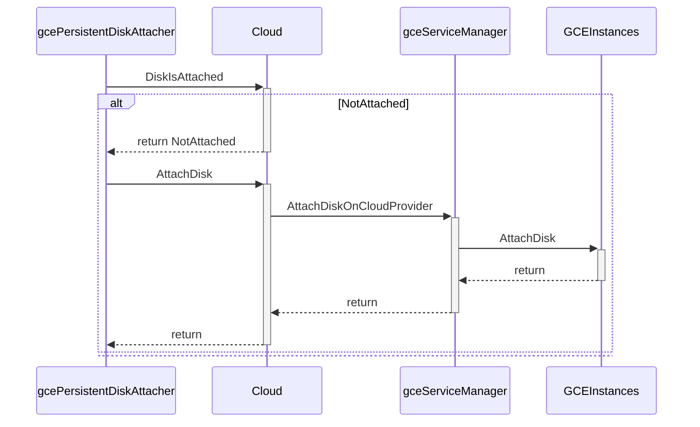

方法的最后会将该请求包装成一个 HTTP 的方法调用向 `https://www.googleapis.com/compute/v1/projects/{project}/zones/{zone}/instances/{resourceId}/attachDisk`链接发出一个 POST 请求，这个请求会将某个 GCE 上的磁盘附着到目标实例上，详细的内容可以阅读 [相关文档](https://cloud.google.com/compute/docs/reference/rest/v1/instances/attachDisk)。

一旦当前的磁盘被附着到了当前节点上，我们就能跟使用其他的插件一样，把磁盘挂载到某个目录上，完成从附着到挂载的全部操作。

## 总结

Volume 和存储系统是 Kubernetes 非常重要的一部分，它能够帮助我们在多个容器之间共享文件，同时也能够为集群提供持久存储的功能，假如 Kubernetes 没有用于持久存储的对象，我们也很难在集群中运行有状态的服务，例如：消息队列、分布式存储等。

对于刚刚使用 Kubernetes 的开发者来说，Volume、PV 和 PVC 确实是比较难以理解的概念，但是这却是深入使用 Kubernetes 必须要了解和掌握的，希望这篇文章能够帮助各位读者更好地理解存储系统底层的实现原理。

## Referenece

- [Volumes · Kubernetes](https://kubernetes.io/docs/concepts/storage/volumes/)
- [Detailed Design for Volume Attach/Detach Controller #20262](https://github.com/kubernetes/kubernetes/issues/20262)
- [Detailed Design for Volume Mount/Unmount Redesign #21931](https://github.com/kubernetes/kubernetes/issues/21931)
- [Kubernetes Volume System Redesign Proposal #18333](https://github.com/kubernetes/kubernetes/issues/18333)
- [Container Storage Interface (CSI)](https://github.com/container-storage-interface/spec/blob/master/spec.md)