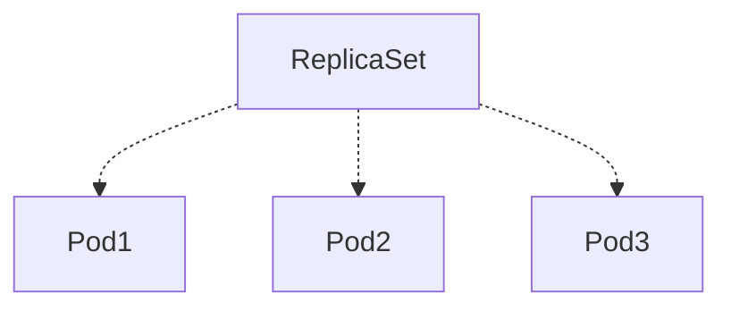
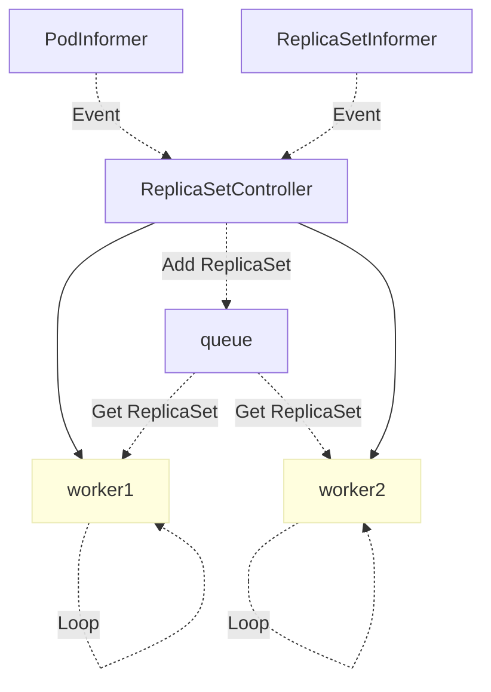

# 详解 Kubernetes ReplicaSet 的实现原理

来源：[详解 Kubernetes ReplicaSet 的实现原理](https://draveness.me/kubernetes-replicaset/)

Kubernetes 中的 ReplicaSet 主要的作用是维持一组 [Pod](https://draveness.me/kubernetes-pod) 副本的运行，它的主要作用就是保证一定数量的 Pod 能够在集群中正常运行，它会持续监听这些 Pod 的运行状态，在 Pod 发生故障重启数量减少时重新运行新的 Pod 副本。

这篇文章会介绍 ReplicaSet 的工作原理，其中包括在 Kubernetes 中是如何被创建的、如何创建并持有 Pod 并在出现问题时重启它们。

## 一、概述

在具体介绍 ReplicaSet 的实现原理之前，我们还是会先简单介绍它的使用，与其他的 Kubernetes 对象一样，我们会在 Kubernetes 集群中使用 YAML 文件创建新的 ReplicaSet 对象，一个常见的 ReplicaSet 的定义其实是这样的：

```yaml
apiVersion: apps/v1
kind: ReplicaSet
metadata:
  name: frontend
  labels:
    app: guestbook
    tier: frontend
spec:
  replicas: 3
  selector:
    matchLabels:
      tier: frontend
  template:
    metadata:
      labels:
        tier: frontend
    spec:
      containers:
      - name: php-redis
        image: gcr.io/google_samples/gb-frontend:v3
```

这里的 YAML 文件除了常见的 `apiVersion`、`kind` 和 `metadata` 属性之外，规格中总共包含三部分重要内容，也就是 Pod 副本数目 `replicas`、选择器 `selector` 和 Pod 模板 `template`，这三个部分共同定义了 ReplicaSet 的规格：

同一个 ReplicaSet 会使用选择器 `selector` 中的定义查找集群中自己持有的 `Pod`对象，它们会根据标签的匹配获取能够获得的 Pod，下面就是持有三个 Pod 对象的 Replica 拓扑图：



被 ReplicaSet 持有的 Pod 有一个 `metadata.ownerReferences` 指针指向当前的 ReplicaSet，表示当前 Pod 的所有者，这个引用主要会被集群中的 [垃圾收集器](https://draveness.me/kubernetes-garbage-collector)使用以清理失去所有者的 Pod 对象。

## 二、实现原理

所有 ReplicaSet 对象的增删改查都是由 `ReplicaSetController` 控制器完成的，该控制器会通过 `Informer` 监听 ReplicaSet 和 Pod 的变更事件并将其加入持有的待处理队列:



`ReplicaSetController` 中的 `queue` 其实就是一个存储待处理 ReplicaSet 的『对象池』，它运行的几个 Goroutine 会从队列中取出最新的数据进行处理，上图展示了事件从发生到被处理的流向，我们接下来将分别介绍 ReplicaSet 中常见的同步过程。

### 1、同步

`ReplicaSetController` 启动的多个 Goroutine 会从队列中取出待处理的任务，然后调用 `syncReplicaSet` 进行同步，这个方法会按照传入的 `key` 从 etcd 中取出 ReplicaSet 对象，然后取出全部 Active 的 Pod：

```go
func (rsc *ReplicaSetController) syncReplicaSet(key string) error {
	namespace, name, _ := cache.SplitMetaNamespaceKey(key)
	rs, _ := rsc.rsLister.ReplicaSets(namespace).Get(name)

	rsNeedsSync := rsc.expectations.SatisfiedExpectations(key)
	selector, _ := metav1.LabelSelectorAsSelector(rs.Spec.Selector)

	allPods, _ := rsc.podLister.Pods(rs.Namespace).List(labels.Everything())
	filteredPods := controller.FilterActivePods(allPods)

	filteredPods, _ = rsc.claimPods(rs, selector, filteredPods)

	var manageReplicasErr error
	if rsNeedsSync && rs.DeletionTimestamp == nil {
		manageReplicasErr = rsc.manageReplicas(filteredPods, rs)
	}
	newStatus := calculateStatus(rs, filteredPods, manageReplicasErr)
	updatedRS, _ := updateReplicaSetStatus(rsc.kubeClient.AppsV1().ReplicaSets(rs.Namespace), rs, newStatus)

	return manageReplicasErr
}
```

随后执行的 `ClaimPods` 方法会获取一系列 Pod 的所有权，如果当前的 Pod 与 ReplicaSet 的选择器匹配就会建立从属关系，否则就会释放持有的对象，或者直接忽视无关的 Pod，建立和释放关系的方法就是 `AdoptPod` 和 `ReleasePod`，`AdoptPod` 会设置目标对象的 `metadata.OwnerReferences` 字段：

```json
// AdoptPod
{
   "metadata": {
      "ownerReferences": [
         {
            "apiVersion": m.controllerKind.GroupVersion(),
            "kind": m.controllerKind.Kind,
            "name": m.Controller.GetName(),
            "uid": m.Controller.GetUID(),
            "controller": true,
            "blockOwnerDeletion": true
         }
      ],
      "uid": pod.UID
   }
}
```

而 `ReleasePod` 会使用如下的 JSON 数据删除目标 Pod 中的 `metadata.OwnerReferences` 属性：

```json
// ReleasePod
{
   "metadata": {
      "ownerReferences": [
         {
            "$patch":"delete",
            "uid": m.Controller.GetUID()
         }
      ],
      "uid": pod.UID
   }
}
```

无论是建立还是释放从属关系，都是根据 ReplicaSet 的选择器配置进行的，它们根据匹配的标签执行不同的操作。

在对已经存在 Pod 进行更新之后，`manageReplicas` 方法会检查并更新当前 ReplicaSet 持有的副本，如果已经存在的 Pod 数量小于 ReplicaSet 的期望数量，那么就会根据模板的配置创建一些新的 Pod 并与这些 Pod 建立从属关系，创建使用 `slowStartBatch` 方法分组批量创建 Pod 以减少失败的次数：

```go
func (rsc *ReplicaSetController) manageReplicas(filteredPods []*v1.Pod, rs *apps.ReplicaSet) error {
	diff := len(filteredPods) - int(*(rs.Spec.Replicas))
	rsKey, _ := controller.KeyFunc(rs)
	if diff < 0 {
		diff *= -1
		if diff > rsc.burstReplicas {
			diff = rsc.burstReplicas
		}
		successfulCreations, err := slowStartBatch(diff, controller.SlowStartInitialBatchSize, func() error {
			boolPtr := func(b bool) *bool { return &b }
			controllerRef := &metav1.OwnerReference{
				APIVersion:         rsc.GroupVersion().String(),
				Kind:               rsc.Kind,
				Name:               rs.Name,
				UID:                rs.UID,
				BlockOwnerDeletion: boolPtr(true),
				Controller:         boolPtr(true),
			}
			rsc.podControl.CreatePodsWithControllerRef(rs.Namespace, &rs.Spec.Template, rs, controllerRef)
			return nil
		})

		return err
```

删除 Pod 的方式就是并发进行的了，代码使用 `WaitGroup` 等待全部的删除任务运行结束才会返回：

```go
} else if diff > 0 {
		if diff > rsc.burstReplicas {
			diff = rsc.burstReplicas
		}

		podsToDelete := getPodsToDelete(filteredPods, diff)

		var wg sync.WaitGroup
		wg.Add(diff)
		for _, pod := range podsToDelete {
			go func(targetPod *v1.Pod) {
				defer wg.Done()
				rsc.podControl.DeletePod(rs.Namespace, targetPod.Name, rs)
			}(pod)
		}
		wg.Wait()
	}

	return nil
}
```

如果需要删除全部的 Pod 就不对传入的 `filteredPods` 进行排序，否则就会按照三个不同的维度对 Pod 进行排序：

1. NotReady < Ready
2. Unscheduled < Scheduled
3. Pending < Running

按照上述规则进行排序的 Pod 能够保证删除在早期阶段的 Pod 对象，简单总结一下，`manageReplicas` 方法会在与已经存在的 Pod 建立关系之后，对持有的数量和期望的数量进行比较之后，会根据 Pod 模板创建或者删除 Pod:

到这里整个处理 ReplicaSet 的主要工作就结束了，`syncReplicaSet` 中剩下的代码会更新 ReplicaSet 的状态并结束同步 ReplicaSet 的工作。

### 2、删除

如果我们在 Kubernetes 集群中删除一个 ReplicaSet 持有的 Pod，那么控制器会重新同步 ReplicaSet 的状态并启动一个新的 Pod，但是如果删除集群中的 ReplicaSet 所有相关的 Pod 也都会被删除：

```bash
$ kubectl delete rs example
replicaset.extensions "example" deleted

$ kubectl get pods --watch
example-z4fvc   0/1       Terminating   0         54s
example-zswpk   0/1       Terminating   0         54s
example-v8wwn   0/1       Terminating   0         54s
```

删除相关 Pod 的工作并不是 `ReplicaSetController` 负责的，而是由集群中的 [垃圾收集器](https://draveness.me/kubernetes-garbage-collector)，也就是 `GarbageCollector` 实现的。

Kubernetes 中的垃圾收集器会负责删除**以前有所有者但是现在没有**的对象，`metadata.ownerReference` 属性标识了一个对象的所有者，当垃圾收集器发现对象的所有者被删除时，就会自动删除这些无用的对象，这也是 ReplicaSet 持有的 Pod 被自动删除的原因，我们会在 [垃圾收集器](https://draveness.me/kubernetes-garbage-collector) 一节中具体介绍垃圾收集器的原理。

## 总结

Kubernetes 中的 ReplicaSet 并不是一个工程师经常需要直接接触的对象，常用的 Deployment 其实使用 ReplicaSet 实现了很多复杂的特性，例如滚动更新，虽然作为使用者我们并不会经常直接与 ReplicaSet 这一对象打交道，但是如果需要对 Kubernetes 进行一些定制化开发，可能会用 ReplicaSet 和其他对象实现一些更复杂的功能。

## Reference

- [Garbage Collection](https://kubernetes.io/docs/concepts/workloads/controllers/garbage-collection/)
- [ReplicaSet](https://kubernetes.io/docs/concepts/workloads/controllers/replicaset/)