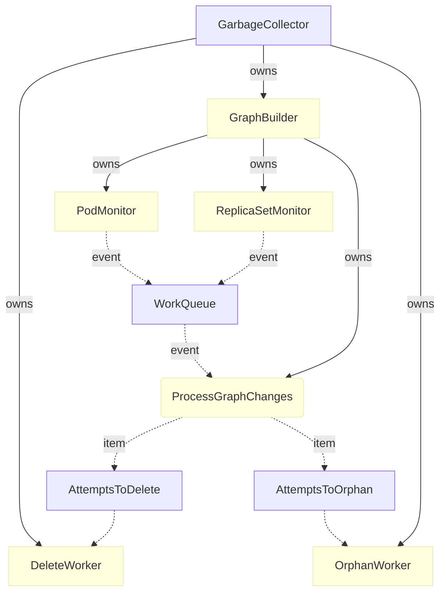

# 详解 Kubernetes 垃圾收集器的实现原理

来源：[详解 Kubernetes 垃圾收集器的实现原理](https://draveness.me/kubernetes-garbage-collector/)

垃圾收集器在 Kubernetes 中的作用就是删除之前有所有者但是现在所有者已经不存在的对象，例如删除 ReplicaSet 时会删除它依赖的 Pod，虽然它的名字是垃圾收集器，但是它在 Kubernetes 中还是以控制器的形式进行设计和实现的。

在 Kubernetes 引入垃圾收集器之前，所有的级联删除逻辑都是在客户端完成的，kubectl 会先删除 ReplicaSet 持有的 Pod 再删除 ReplicaSet，但是垃圾收集器的引入就让级联删除的实现移到了服务端，我们在这里就会介绍垃圾收集器的设计和实现原理。

## 一、概述

垃圾收集主要提供的功能就是级联删除，它向对象的 API 中加入了 `metadata.ownerReferences` 字段，这一字段会包含当前对象的所有依赖者，在默认情况下，如果当前对象的所有依赖者都被删除，那么当前对象就会被删除：

```go
type ObjectMeta struct {
	...
	OwnerReferences []OwnerReference
}

type OwnerReference struct {
	APIVersion string
	Kind string
	Name string
	UID types.UID
}
```

`OwnerReference` 包含了足够的信息来标识当前对象的依赖者，对象的依赖者必须与当前对象位于同一个命名空间 `namespace`，否则两者就无法建立起依赖关系。

通过引入 `metadata.ownerReferences` 能够建立起不同对象的关系，但是我们依然需要其他的组件来负责处理对象之间的联系并在所有依赖者不存在时将对象删除，这个处理不同对象联系的组件就是 `GarbageCollector`，也是 Kubernetes 控制器的一种。

## 二、实现原理

`GarbageCollector` 中包含一个 `GraphBuilder` 结构体，这个结构体会以 Goroutine 的形式运行并使用 Informer 监听集群中几乎全部资源的变动，一旦发现任何的变更事件 — 增删改，就会将事件交给主循环处理，主循环会根据事件的不同选择将待处理对象加入不同的队列，与此同时 `GarbageCollector` 持有的另外两组队列会负责删除或者孤立目标对象。



接下来我们会从几个关键点介绍垃圾收集器是如何删除 Kubernetes 集群中的对象以及它们的依赖的。

### 1、删除策略

多个资源的 Informer 共同构成了垃圾收集器中的 `Propagator`，它监听所有的资源更新事件并将它们投入到工作队列中，这些事件会更新内存中的 DAG，这个 DAG 表示了集群中不同对象之间的从属关系，垃圾收集器的多个 Worker 会从两个队列中获取待处理的对象并调用 `attemptToDeleteItem` 和 `attempteToOrphanItem` 方法，这里我们主要介绍 `attemptToDeleteItem` 的实现：

```go
func (gc *GarbageCollector) attemptToDeleteItem(item *node) error {
	latest, _ := gc.getObject(item.identity)
	ownerReferences := latest.GetOwnerReferences()

	solid, dangling, waitingForDependentsDeletion, _ := gc.classifyReferences(item, ownerReferences)
```

该方法会先获取待处理的对象以及所有者的引用列表，随后使用 `classifyReferences` 方法将引用进行分类并按照不同的条件分别进行处理：

```go
	switch {
	case len(solid) != 0:
		ownerUIDs := append(ownerRefsToUIDs(dangling), ownerRefsToUIDs(waitingForDependentsDeletion)...)
		patch := deleteOwnerRefStrategicMergePatch(item.identity.UID, ownerUIDs...)
		gc.patch(item, patch, func(n *node) ([]byte, error) {
			return gc.deleteOwnerRefJSONMergePatch(n, ownerUIDs...)
		})
		return err
```

如果当前对象的所有者还有存在于集群中的，那么当前的对象就不会被删除，上述代码会将已经被删除或等待删除的引用从对象中删掉。

当正在被删除的所有者不存在任何的依赖并且该对象的 `ownerReference.blockOwnerDeletion` 属性为 `true` 时会阻止依赖方的删除，所以当前的对象会等待属性 `ownerReference.blockOwnerDeletion=true` 的所有对象的删除后才会被删除。

```go
	// ...
	case len(waitingForDependentsDeletion) != 0 && item.dependentsLength() != 0:
		deps := item.getDependents()
		for _, dep := range deps {
			if dep.isDeletingDependents() {
				patch, _ := item.unblockOwnerReferencesStrategicMergePatch()
				gc.patch(item, patch, gc.unblockOwnerReferencesJSONMergePatch)				
				break
			}
		}
		policy := metav1.DeletePropagationForeground
		return gc.deleteObject(item.identity, &policy)
	// ...	
```

在默认情况下，也就是当前对象已经不包含任何依赖，那么如果当前对象可能会选择三种不同的策略处理依赖：

```go
    // ...
	default:
		var policy metav1.DeletionPropagation
		switch {
		case hasOrphanFinalizer(latest):
			policy = metav1.DeletePropagationOrphan
		case hasDeleteDependentsFinalizer(latest):
			policy = metav1.DeletePropagationForeground
		default:
			policy = metav1.DeletePropagationBackground
		}
		return gc.deleteObject(item.identity, &policy)
	}
}
```

1. 如果当前对象有 `FinalizerOrphanDependents` 终结器，`DeletePropagationOrphan` 策略会让对象所有的依赖变成孤立的；
2. 如果当前对象有 `FinalizerDeleteDependents` 终结器，`DeletePropagationBackground` 策略在前台等待所有依赖被删除后才会删除，整个删除过程都是同步的；
3. 默认情况下会使用 `DeletePropagationDefault` 策略在后台删除当前对象的全部依赖；

### 2、终结器

对象的终结器是在对象删除之前需要执行的逻辑，所有的对象在删除之前，它的终结器字段必须为空，终结器提供了一个通用的 API，它的功能不只是用于阻止级联删除，还能过通过它在对象删除之前加入钩子：

```go
type ObjectMeta struct {
	// ...
	Finalizers []string
}
```

终结器在对象被删之前运行，每当终结器成功运行之后，就会将它自己从 `Finalizers` 数组中删除，当最后一个终结器被删除之后，API Server 就会删除该对象。

在默认情况下，删除一个对象会删除它的全部依赖，但是我们在一些特定情况下我们只是想删除当前对象本身并不想造成复杂的级联删除，垃圾回收机制在这时引入了 `OrphanFinalizer`，它会在对象被删除之前向 `Finalizers` 数组添加或者删除 `OrphanFinalizer`。

该终结器会监听对象的更新事件并将它自己从它全部依赖对象的 `OwnerReferences` 数组中删除，与此同时会删除所有依赖对象中已经失效的 `OwnerReferences` 并将 `OrphanFinalizer` 从 `Finalizers` 数组中删除。

通过 `OrphanFinalizer` 我们能够在删除一个 Kubernetes 对象时保留它的全部依赖，为使用者提供一种更灵活的办法来保留和删除对象。

## 总结

Kubernetes 中垃圾收集器的实现还是比较容易理解的，它的主要作用就是监听集群中对象的变更事件并根据两个字段 `OwnerReferences` 和 `Finalizers` 确定对象的删除策略，其中包括同步和后台的选择、是否应该触发级联删除移除当前对象的全部依赖；在默认情况下，当我们删除 Kubernetes 集群中的 ReplicaSet、Deployment 对象时都会删除这些对象的全部依赖，不过我们也可以通过 `OrphanFinalizer` 终结器删除单独的对象。

## Reference

- [Garbage Collection](https://kubernetes.io/docs/concepts/workloads/controllers/garbage-collection/)
- [Garbage Collection · GitHub](https://github.com/kubernetes/community/blob/master/contributors/design-proposals/api-machinery/garbage-collection.md)
- [Synchronous Garbage Collection · GitHub](https://github.com/kubernetes/community/blob/master/contributors/design-proposals/api-machinery/synchronous-garbage-collection.md)