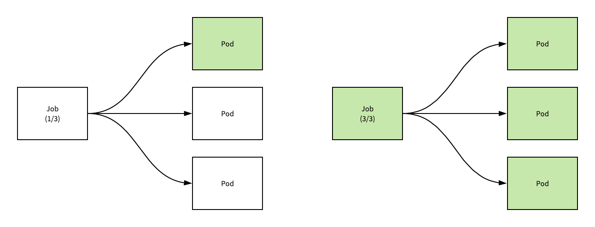
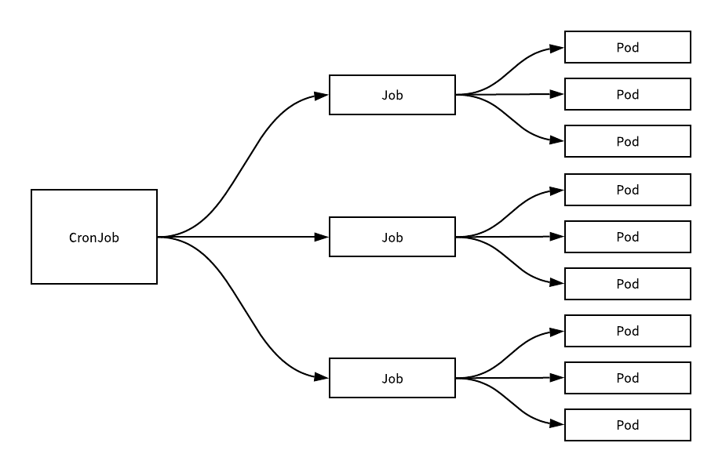
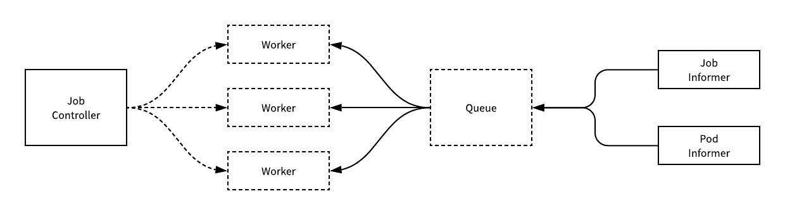
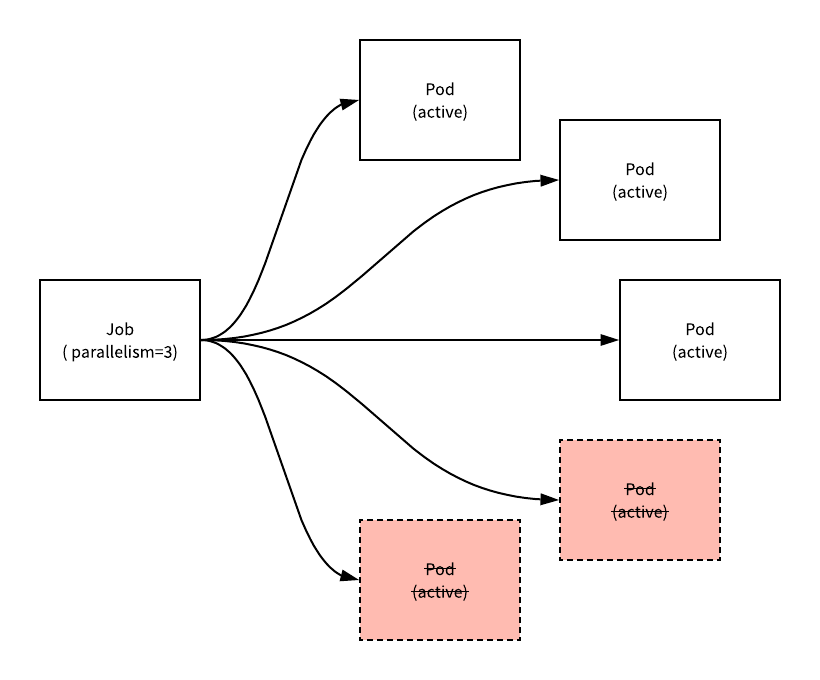
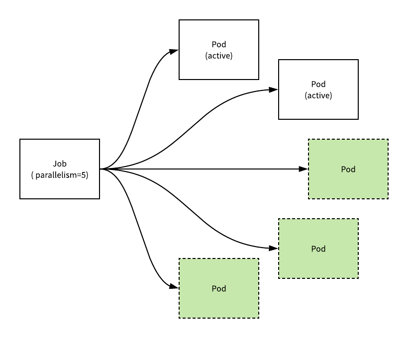
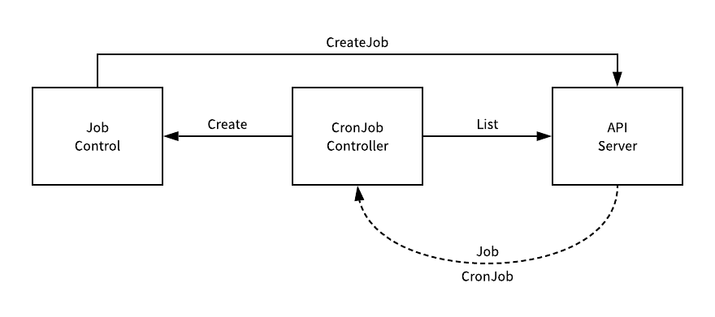

# 详解 Kubernetes Job 和 CronJob 的实现原理

来源：[详解 Kubernetes Job 和 CronJob 的实现原理](https://draveness.me/kubernetes-job-cronjob/)

之前介绍了 Kubernetes 中用于长期提供服务的 [ReplicaSet](https://draveness.me/kubernetes-replicaset)、[Deployment](https://draveness.me/kubernetes-deployment)、[StatefulSet](https://draveness.me/kubernetes-statefulset) 和 [DaemonSet](https://draveness.me/kubernetes-daemonset) 等资源，但是作为一个容器编排引擎，任务和定时任务的支持是一个必须要支持的功能。

Kubernetes 中使用 Job 和 CronJob 两个资源分别提供了一次性任务和定时任务的特性，这两种对象也使用控制器模型来实现资源的管理，我们在这篇文章种就会介绍它们的实现原理。

## 一、概述

Kubernetes 中的 Job 可以创建并且保证一定数量 Pod 的成功停止，当 Job 持有的一个 Pod 对象成功完成任务之后，Job 就会记录这一次 Pod 的成功运行；当一定数量的Pod 的任务执行结束之后，当前的 Job 就会将它自己的状态标记成结束。



上述图片中展示了一个 `spec.completions=3` 的任务的状态随着 Pod 的成功执行而更新和迁移状态的过程，从图中我们能比较清楚的看到 Job 和 Pod 之间的关系，假设我们有一个用于计算圆周率的如下任务：

```yaml
apiVersion: batch/v1
kind: Job
metadata:
  name: pi
spec:
  completions: 10
  parallelism: 5
  template:
    spec:
      containers:
      - name: pi
        image: perl
        command: ["perl",  "-Mbignum=bpi", "-wle", "print bpi(2000)"]
      restartPolicy: Never
  backoffLimit: 4
```

当我们在 Kubernetes 中创建上述任务时，使用 `kubectl` 能够观测到以下的信息：

```bash
$ k apply -f job.yaml
job.batch/pi created

$ kubectl get job --watch
NAME  COMPLETIONS   DURATION   AGE
pi    0/10          1s         1s
pi    1/10          36s        36s
pi    2/10          46s        46s
pi    3/10          54s        54s
pi    4/10          60s        60s
pi    5/10          65s        65s
pi    6/10          90s        90s
pi    7/10          99s        99s
pi    8/10          104s       104s
pi    9/10          107s       107s
pi    10/10         109s       109s
```

由于任务 `pi` 在配置时指定了 `spec.completions=10`，所以当前的任务需要等待 10 个 Pod 的成功执行，另一个比较重要的 `spec.parallelism=5` 表示最多有多少个并发执行的任务，如果 `spec.parallelism=1` 那么所有的任务都会依次顺序执行，只有前一个任务执行成功时，后一个任务才会开始工作。



每一个 Job 对象都会持有一个或者多个 Pod，而每一个 CronJob 就会持有多个 Job 对象，CronJob 能够按照时间对任务进行调度，它与 [crontab](https://en.wikipedia.org/wiki/Cron) 非常相似，我们可以使用 Cron 格式快速指定任务的调度时间：

```yaml
apiVersion: batch/v1beta1
kind: CronJob
metadata:
  name: pi
spec:
  schedule: "*/1 * * * *"
  jobTemplate:
    spec:
      completions: 2
      parallelism: 1
      template:
        spec:
          containers:
          - name: pi
            image: perl
            command: ["perl",  "-Mbignum=bpi", "-wle", "print bpi(2000)"]
          restartPolicy: OnFailure
```

上述的 CronJob 对象被创建之后，每分钟都会创建一个新的 Job 对象，所有的 CronJob 创建的任务都会带有调度时的时间戳，例如：pi-1551660600 和 pi-1551660660 两个任务：

```bash
$ k get cronjob --watch
NAME   SCHEDULE      SUSPEND   ACTIVE   LAST SCHEDULE   AGE
pi    */1 * * * *    False     0        <none>          3s
pi    */1 * * * *    False     1        1s              7s

$ k get job --watch
NAME            COMPLETIONS   DURATION   AGE
pi-1551660600   0/3   0s    0s
pi-1551660600   1/3   16s   16s
pi-1551660600   2/3   31s   31s
pi-1551660600   3/3   44s   44s
pi-1551660660   0/3         1s
pi-1551660660   0/3   1s    1s
pi-1551660660   1/3   14s   14s
pi-1551660660   2/3   28s   28s
pi-1551660660   3/3   42s   43s
```

CronJob 中保存的任务其实是有上限的，`spec.successfulJobsHistoryLimit` 和 `spec.failedJobsHistoryLimit`分别记录了能够保存的成功或者失败的任务上限，超过这个上限的任务都会被删除，默认情况下这两个属性分别为 `spec.successfulJobsHistoryLimit=3` 和 `spec.failedJobsHistoryLimit=1`。

## 二、任务

Job 遵循 Kubernetes 的控制器模式进行设计，在发生需要监听的事件时，Informer 就会调用控制器中的回调将需要处理的资源 Job 加入队列，而控制器持有的工作协程就会处理这些任务。



用于处理 Job 资源的 `JobController` 控制器会监听 Pod 和 Job 这两个资源的变更事件，而资源的同步还是需要运行 `syncJob` 方法。

### 1、同步

`syncJob` 是 `JobController` 中主要用于同步 Job 资源的方法，这个方法的主要作用就是对资源进行同步，它的大体架构就是先获取一些当前同步的基本信息，然后调用 `manageJob` 方法管理 Job 对应的 Pod 对象，最后计算出处于 `active`、`failed` 和 `succeed` 三种状态的 Pod 数量并更新 Job 的状态：

```go
func (jm *JobController) syncJob(key string) (bool, error) {
	ns, name, _ := cache.SplitMetaNamespaceKey(key)
	sharedJob, _ := jm.jobLister.Jobs(ns).Get(name)
	job := *sharedJob

	jobNeedsSync := jm.expectations.SatisfiedExpectations(key)

	pods, _ := jm.getPodsForJob(&job)

	activePods := controller.FilterActivePods(pods)
	active := int32(len(activePods))
	succeeded, failed := getStatus(pods)
	conditions := len(job.Status.Conditions)
```

这一部分代码会从 apiserver 中该名字对应的 Job 对象，然后获取 Job 对应的 Pod 数组并根据计算不同状态 Pod 的数量，为之后状态的更新和比对做准备。

```go
	var manageJobErr error
	if jobNeedsSync && job.DeletionTimestamp == nil {
		active, manageJobErr = jm.manageJob(activePods, succeeded, &job)
	}
```

准备工作完成之后，会调用 `manageJob` 方法，该方法主要负责管理 Job 持有的一系列 Pod 的运行，它最终会返回目前集群中当前 Job 对应的活跃任务的数量。

```go
	completions := succeeded
	complete := false
	if job.Spec.Completions == nil {
		if succeeded > 0 && active == 0 {
			complete = true
		}
	} else {
		if completions >= *job.Spec.Completions {
			complete = true
		}
	}
	if complete {
		job.Status.Conditions = append(job.Status.Conditions, newCondition(batch.JobComplete, "", ""))
		now := metav1.Now()
		job.Status.CompletionTime = &now
	}

	if job.Status.Active != active || job.Status.Succeeded != succeeded || job.Status.Failed != failed || len(job.Status.Conditions) != conditions {
		job.Status.Active = active
		job.Status.Succeeded = succeeded
		job.Status.Failed = failed

		jm.updateHandler(&job)
	}

	return forget, manageJobErr
}
```

最后的这段代码会将 Job 规格中设置的 `spec.completions` 和已经完成的任务数量进行比对，确认当前的 Job 是否已经结束运行，如果任务已经结束运行就会更新当前 Job 的完成时间，同时当 `JobController` 发现有一些状态没有正确同步时，也会调用 `updateHandler` 更新资源的状态。

### 2、并行执行

Pod 的创建和删除都是由 `manageJob` 这个方法负责的，这个方法根据 Job 的 `spec.parallelism` 配置对目前集群中的节点进行创建和删除。



如果当前正在执行的活跃节点数量超过了 `spec.parallelism`，那么就会按照创建的升删除多余的任务，删除任务时会使用 `DeletePod` 方法：

```go
func (jm *JobController) manageJob(activePods []*v1.Pod, succeeded int32, job *batch.Job) (int32, error) {
	active := int32(len(activePods))
	parallelism := *job.Spec.Parallelism

	if active > parallelism {
		diff := active - parallelism
		sort.Sort(controller.ActivePods(activePods))

		active -= diff
		wait := sync.WaitGroup{}
		wait.Add(int(diff))
		for i := int32(0); i < diff; i++ {
			go func(ix int32) {
				defer wait.Done()
				jm.podControl.DeletePod(job.Namespace, activePods[ix].Name, job)
			}(i)
		}
		wait.Wait()
```

当正在活跃的节点数量小于 `spec.parallelism` 时，我们就会根据当前未完成的任务数和并行度计算出最大可以处于活跃的 Pod 个数 `wantActive` 以及与当前的活跃 Pod 数相差的 `diff`：

```go
	} else if active < parallelism {
		wantActive := int32(0)
		if job.Spec.Completions == nil {
			if succeeded > 0 {
				wantActive = active
			} else {
				wantActive = parallelism
			}
		} else {
			wantActive = *job.Spec.Completions - succeeded
			if wantActive > parallelism {
				wantActive = parallelism
			}
		}
		diff := wantActive - active
		if diff < 0 {
			diff = 0
		}

		active += diff
```

在方法的最后就会以批量的方式并行创建 Pod，所有 Pod 的创建都是通过 `CreatePodsWithControllerRef` 方法在 Goroutine 中执行的。



这里会使用 `WaitGroup` 等待每个 Batch 中创建的结果返回才会执行下一个 Batch，Batch 的大小是从 1 开始指数增加的，以冷启动的方式避免首次创建的任务过多造成失败：

```go
		wait := sync.WaitGroup{}
		for batchSize := int32(integer.IntMin(int(diff), controller.SlowStartInitialBatchSize)); diff > 0; batchSize = integer.Int32Min(2*batchSize, diff) {
			wait.Add(int(batchSize))
			for i := int32(0); i < batchSize; i++ {
				go func() {
					defer wait.Done()
					jm.podControl.CreatePodsWithControllerRef(job.Namespace, &job.Spec.Template, job, metav1.NewControllerRef(job, controllerKind))
				}()
			}
			wait.Wait()
			diff -= batchSize
		}
	}

	return active, nil
}
```

通过对 `manageJob` 的分析，我们其实能够看出这个方法就是根据规格中的配置对 Pod 进行管理，它在较多并行时删除 Pod，较少并行时创建 Pod，也算是一个简单的资源利用和调度机制，代码非常直白并且容易理解，不需要花太大的篇幅。

## 三、定时任务

用于管理 CronJob 资源的 `CronJobController` 虽然也使用了控制器模式，但是它的实现与其他的控制器不太一样，他没有从 Informer 中接受其他消息变动的通知，而是直接访问 apiserver 中的数据：



从 apiserver 中获取了 Job 和 CronJob 的信息之后就会调用 `JobControl` 向 apiserver 发起请求创建新的 Job 资源，这一个过程都是由 `CronJobController`的 `syncAll` 方法驱动的，我们接下来就来介绍这一方法的实现。

### 1、同步

`syncAll` 方法会从 apiserver 中取出所有的 Job 和 CronJob 对象，然后通过 `groupJobsByParent` 将任务按照 `spec.ownerReferences` 进行分类并遍历去同步所有的 CronJob：

```go
func (jm *CronJobController) syncAll() {
	jl, _ := jm.kubeClient.BatchV1().Jobs(metav1.NamespaceAll).List(metav1.ListOptions{})
	js := jl.Items

	sjl, _ := jm.kubeClient.BatchV1beta1().CronJobs(metav1.NamespaceAll).List(metav1.ListOptions{})
	sjs := sjl.Items

	jobsBySj := groupJobsByParent(js)

	for _, sj := range sjs {
		syncOne(&sj, jobsBySj[sj.UID], time.Now(), jm.jobControl, jm.sjControl, jm.recorder)
		cleanupFinishedJobs(&sj, jobsBySj[sj.UID], jm.jobControl, jm.sjControl, jm.recorder)
	}
}
```

`syncOne` 就是用于同步单个 CronJob 对象的方法，这个方法会首先遍历全部的 Job 对象，只保留正在运行的活跃对象并更新 CronJob 的状态：

```go
func syncOne(sj *batchv1beta1.CronJob, js []batchv1.Job, now time.Time, jc jobControlInterface, sjc sjControlInterface, recorder record.EventRecorder) {
	childrenJobs := make(map[types.UID]bool)
	for _, j := range js {
		childrenJobs[j.ObjectMeta.UID] = true
		found := inActiveList(*sj, j.ObjectMeta.UID)
		if found && IsJobFinished(&j) {
			deleteFromActiveList(sj, j.ObjectMeta.UID)
		}
	}

	for _, j := range sj.Status.Active {
		if found := childrenJobs[j.UID]; !found {
			deleteFromActiveList(sj, j.UID)
		}
	}

	updatedSJ, _ := sjc.UpdateStatus(sj)
	*sj = *updatedSJ
```

随后的 `getRecentUnmetScheduleTimes` 方法会根据 CronJob 的调度配置 `spec.schedule` 和上一次执行任务的时间计算出我们缺失的任务次数。

```go
	times, _ := getRecentUnmetScheduleTimes(*sj, now)
	if len(times) == 0 {
		return
	}

	scheduledTime := times[len(times)-1]
	if sj.Spec.ConcurrencyPolicy == batchv1beta1.ForbidConcurrent && len(sj.Status.Active) > 0 {
		return
	}
	if sj.Spec.ConcurrencyPolicy == batchv1beta1.ReplaceConcurrent {
		for _, j := range sj.Status.Active {
			job, _ := jc.GetJob(j.Namespace, j.Name)
			if !deleteJob(sj, job, jc, recorder) {
				return
			}
		}
	}
```

如果现在需要调度新的任务，但是当前已经存在活跃的任务，就会根据并发策略的配置执行不同的操作：

1. 使用 `ForbidConcurrent` 策略跳过这一次任务的调度直接返回；
2. 使用 `ReplaceConcurrent` 策略获取并删除全部活跃的任务，通过创建新的 Pod 替换这些正在执行的活跃 Pod；

```go
	jobReq, _ := getJobFromTemplate(sj, scheduledTime)
	jobResp, _ := jc.CreateJob(sj.Namespace, jobReq)

	ref,_ := getRef(jobResp)
	sj.Status.Active = append(sj.Status.Active, *ref)
	sj.Status.LastScheduleTime = &metav1.Time{Time: scheduledTime}
	sjc.UpdateStatus(sj)

	return
}
```

在方法的最后，它会从 CronJob 的 `spec.jobTemplate` 中拿到创建 Job 使用的模板并调用 `JobControl` 的 `CreateJob` 向 apiserver 发起创建任务的 HTTP 请求，接下来的操作就都是由 `JobController` 负责了。

## 总结

Job 作为 Kubernetes 中用于处理任务的资源，与其他的资源没有太多的区别，它也使用 Kubernetes 中常见的控制器模式，监听 Informer 中的事件并运行 `syncHandler` 同步任务

而 CronJob 由于其功能的特殊性，每隔 10s 会从 apiserver 中取出资源并进行检查是否应该触发调度创建新的资源，需要注意的是 CronJob 并不能保证在准确的目标时间执行，执行会有一定程度的滞后。

两个控制器的实现都比较清晰，只是边界条件比较多，分析其实现原理时一定要多注意。

## Referenece

- [Jobs - Run to Completion · Kubernetes](https://kubernetes.io/docs/concepts/workloads/controllers/jobs-run-to-completion/)
- [CronJob · Kubernetes](https://kubernetes.io/docs/concepts/workloads/controllers/cron-jobs/)
- [Parallel Processing using Expansions](https://kubernetes.io/docs/tasks/job/parallel-processing-expansion/)
- [Coarse Parallel Processing Using a Work Queue](Coarse Parallel Processing Using a Work Queue)
- [Fine Parallel Processing Using a Work Queue](https://kubernetes.io/docs/tasks/job/fine-parallel-processing-work-queue/)
- [Running Automated Tasks with a CronJob](https://kubernetes.io/docs/tasks/job/automated-tasks-with-cron-jobs/)