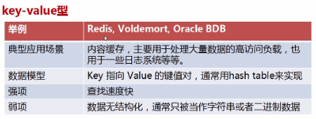
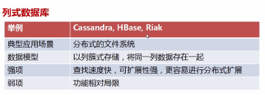
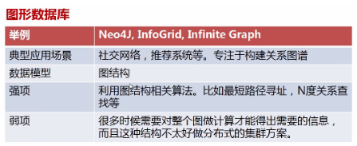

# NoSQL 概述

来源：[百度百科 NoSQL](https://baike.baidu.com/item/NoSQL/8828247?fr=aladdin)

NoSQL，泛指非关系型的数据库。随着互联网[web2.0](https://baike.baidu.com/item/web2.0/97695)网站的兴起，传统的关系数据库在处理web2.0网站，特别是超大规模和高并发的[SNS](https://baike.baidu.com/item/SNS/10242)类型的web2.0纯[动态网](https://baike.baidu.com/item/动态网)站已经显得力不从心，出现了很多难以克服的问题，而非关系型的数据库则由于其本身的特点得到了非常迅速的发展。NoSQL数据库的产生就是为了解决大规模数据集合多重数据种类带来的挑战，特别是大数据应用难题。

## 一、基本含义

NoSQL最常见的解释是“non-relational”， “Not Only SQL”也被很多人接受。NoSQL仅仅是一个[概念](https://baike.baidu.com/item/概念/829047)，泛指非关系型的数据库，区别于[关系数据库](https://baike.baidu.com/item/关系数据库/1237340)，它们不保证关系数据的ACID特性。NoSQL是一项全新的数据库革命性运动，其拥护者们提倡运用非关系型的[数据存储](https://baike.baidu.com/item/数据存储/9827490)，相对于铺天盖地的[关系型数据库](https://baike.baidu.com/item/关系型数据库/8999831)运用，这一概念无疑是一种全新的思维的注入。

NoSQL有如下优点：易[扩展](https://baike.baidu.com/item/扩展/2732987)，NoSQL数据库种类繁多，但是一个共同的特点都是去掉关系数据库的关系型特性。数据之间无关系，这样就非常容易扩展。无形之间也在架构的层面上带来了可扩展的能力。大数据量，高性能，NoSQL数据库都具有非常高的读写性能，尤其在大数据量下，同样表现优秀。这得益于它的无关系性，数据库的结构简单。 [1] 

## 二、分类

### 键值(Key-Value)存储数据库

这一类数据库主要会使用到一个[哈希表](https://baike.baidu.com/item/哈希表)，这个表中有一个特定的键和一个指针指向特定的数据。Key/value模型对于IT系统来说的优势在于简单、易部署。但是如果[数据库管理员](https://baike.baidu.com/item/数据库管理员/1216449)([DBA](https://baike.baidu.com/item/DBA/3349))只对部分值进行查询或更新的时候，Key/value就显得效率低下了。举例如：Tokyo Cabinet/Tyrant， Redis， Voldemort， Oracle BDB。

### 列存储数据库

这部分数据库通常是用来应对分布式存储的海量数据。键仍然存在，但是它们的特点是指向了多个列。这些列是由列家族来安排的。如：Cassandra， HBase， Riak.

### 文档型数据库

文档型数据库的灵感是来自于Lotus Notes办公软件的，而且它同第一种键值存储相类似。该类型的数据模型是版本化的文档，半结构化的文档以特定的格式存储，比如JSON。文档型数据库可以看作是键值数据库的升级版，允许之间嵌套键值，在处理网页等复杂数据时，文档型数据库比传统键值数据库的查询效率更高。如：CouchDB， MongoDb. 国内也有文档型数据库SequoiaDB，已经开源。

### 图形(Graph)数据库

图形结构的数据库同其他行列以及刚性结构的SQL数据库不同，它是使用灵活的图形模型，并且能够扩展到多个服务器上。NoSQL数据库没有标准的查询语言(SQL)，因此进行数据库查询需要制定数据模型。许多NoSQL数据库都有REST式的数据接口或者查询API。如：Neo4J， InfoGrid， Infinite Graph。

### 不同分类特点对比

| **分类**              | **Examples举例**                                      | 典型应用场景                                                 | 数据模型                                        | 优点                                                         | 缺点                                                         |
| --------------------- | ----------------------------------------------------- | ------------------------------------------------------------ | ----------------------------------------------- | ------------------------------------------------------------ | ------------------------------------------------------------ |
| **键值（key-value）** | Tokyo Cabinet/Tyrant， Redis， Voldemort， Oracle BDB | 内容缓存，主要用于处理大量数据的高访问负载，也用于一些日志系统等等。 | Key 指向 Value 的键值对，通常用hash table来实现 | 查找速度快                                                   | 数据无结构化，通常只被当作字符串或者二进制数据               |
| **列存储数据库**      | Cassandra， HBase， Riak                              | 分布式的文件系统                                             | 以列簇式存储，将同一列数据存在一起              | 查找速度快，可扩展性强，更容易进行分布式扩展                 | 功能相对局限                                                 |
| **文档型数据库**      | CouchDB， MongoDb                                     | Web应用（与Key-Value类似，Value是结构化的，不同的是数据库能够了解Value的内容） | Key-Value对应的键值对，Value为结构化数据        | 数据结构要求不严格，表结构可变，不需要像关系型数据库一样需要预先定义表结构 | 查询性能不高，而且缺乏统一的查询语法。                       |
| **图形(Graph)数据库** | Neo4J， InfoGrid， Infinite Graph                     | 社交网络，推荐系统等。专注于构建关系图谱                     | 图结构                                          | 利用图结构相关算法。比如最短路径寻址，N度关系查找等          | 很多时候需要对整个图做计算才能得出需要的信息，而且这种结构不太好做分布式的集群方案。 |

## 三、特点

对于NoSQL并没有一个明确的范围和定义，但是他们都普遍存在下面一些共同特征：

**易扩展**

NoSQL数据库种类繁多，但是一个共同的特点都是去掉关系数据库的关系型特性。数据之间无关系，这样就非常容易扩展。无形之间，在架构的层面上带来了可扩展的能力。 [2] 

**大数据量，高性能**

NoSQL数据库都具有非常高的读写性能，尤其在大数据量下，同样表现优秀。这得益于它的无关系性，数据库的结构简单。一般MySQL使用Query Cache。NoSQL的Cache是记录级的，是一种细粒度的Cache，所以NoSQL在这个层面上来说性能就要高很多。 [2] 

**灵活的数据模型**

NoSQL无须事先为要存储的数据建立字段，随时可以存储自定义的数据格式。而在关系数据库里，增删字段是一件非常麻烦的事情。如果是非常大数据量的表，增加字段简直就是——个噩梦。这点在大数据量的Web 2.0时代尤其明显。 [2] 

**高可用**

NoSQL在不太影响性能的情况，就可以方便地实现高可用的架构。比如Cassandra、HBase模型，通过复制模型也能实现高可用。 [2] 

## 四、体系框架

NoSQL框架体系NosoL整体框架分为四层，由下至上分为数据持久层(data persistence)、整体分布层(data distribution model)、数据逻辑模型层(data logical model)、和接口层(interface)，层次之间相辅相成，协调工作。 [3] 

[数据持久层](https://baike.baidu.com/item/数据持久层/5987581)定义了数据的存储形式，主要包括基于内存、基于硬盘、内存和硬盘接口、订制可拔插四种形式。基于内存形式的数据[存取速度](https://baike.baidu.com/item/存取速度/12720755)最快，但可能会造成数据丢失。基于硬盘的数据存储可能保存很久，但存取速度较基于内存形式的慢。内存和硬盘相结合的形式，结合了前两种形式的优点，既保证了速度，又保证了数据不丢失。订制可拔插则保证了数据存取具有较高的灵活性。 [3] 

数据分布层定义了数据是如何分布的，相对于关系型数据库，NoSQL可选的机制比较多，主要有三种形式：一是CAP支持，可用于水平扩展。二是多数据中心支持，可以保证在横跨多数据中心是也能够平稳运行。三是动态部署支持，可以在运行着的集群中动态地添加或删除节点。 [3] 

数据逻辑层表述了数据的逻辑表现形式，与关系型数据库相比，NoSQL在逻辑表现形式上相当灵活，主要有四种形式：一是键值模型，这种模型在表现形式上比较单一，但却有很强的扩展性。二是列式模型，这种模型相比于键值模型能够支持较为复杂的数据，但扩展性相对较差。三是文档模型，这种模型对于复杂数据的支持和扩展性都有很大优势。四是图模型，这种模型的使用场景不多，通常是基于图数据结构的数据定制的。 [3] 

接口层为上层应用提供了方便的数据调用接口，提供的选择远多于关系型数据库。接口层提供了五种选择：Rest，Thrift，Map/Reduce，Get/Put，特定语言API，使得应用程序和数据库的交互更加方便。 [3] 

NoSQL分层架构并不代表每个产品在每一层只有一种选择。相反，这种分层设计提供了很大的灵活性和兼容性，每种数据库在不同层面可以支持多种特性。 [3] 

## 五、适用场景

NoSQL数据库在以下的这几种情况下比较适用：

1、数据模型比较简单；

2、需要灵活性更强的IT系统；

3、对数据库性能要求较高；

4、不需要高度的[数据一致性](https://baike.baidu.com/item/数据一致性/9895547)；

5、对于给定key，比较容易映射复杂值的环境。

