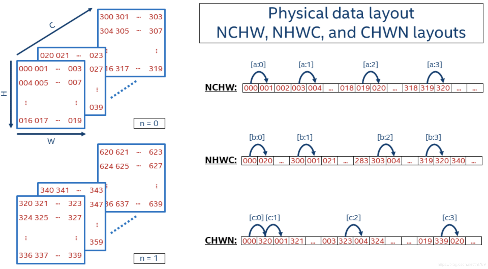

# NCHW与NHWC数据格式

参考：https://blog.csdn.net/thl789/article/details/109037433

## 一、基本概念

深度学习框架中，数据一般是4D，用NCHW或NHWC表达，其中：

- N - Batch
- C - Channel
- H - Height
- W - Width

## 二、逻辑表达

假定N = 2，C = 16，H = 5，W = 4，那么这个4D数据，看起来是这样的：

人类比较直接的理解方式是3D，上图中从三个方向上理解，C方向/H方向/W方向。然后是N方向上，就是4D。

上图中红色标准的数值是这个数据里每个元素的数值。

 

三、物理存储

无论逻辑表达上是几维的数据，在计算机中存储时都是按照1D来存储的。NCHW和NHWC格式数据的存储形式如下图所示：

### 3.1 NCHW

NCHW是先取W方向数据；然后H方向；再C方向；最后N方向。

所以，序列化出1D数据：

000 (W方向) 001 002 003，(H方向) 004 005 ... 019，(C方向) 020 ... 318 319，(N方向) 320 321 ...

### 3.2 NHWC

NHWC是先取C方向数据；然后W方向；再H方向；最后N方向。

所以，序列化出1D数据：

000 (C方向) 020 ... 300，(W方向) 001 021 ... 303，(H方向) 004 ... 319，(N方向) 320 340 ...

 

## 四、RGB图像数据举例

表达RGB彩色图像时，一个像素的RGB值用3个数值表示，对应Channel为3。易于理解这里假定N=1，那么NCHW和NHWC数据格式可以很直接的这样表达：

NCHW是

- 先在一个Channel面上把W方向|H方向上元素存储起来 // R
- 然后再在另一个Channel切面上把W方向|H方向上元素存储起来 // G
- 最后一个Channel切面上把W方向|H方向上元素存储起来 // B

这样看起来，就是先把R通道的每个像素都存储；然后存储G通道；再然后B通道。

NHWC是

- 先把3个Channel上元素存储起来 // 也就是一个像素的RGB
- 然后再在W方向|H方向上元素存储起来
- 这样看起来，就是顺序地取像素的RGB数值存储起来

 

## 五、不同框架支持

目前的主流ML框架对NCHW和NHWC数据格式做了支持，有些框架可以支持两种且用户未做设置时有一个缺省值：

TensorFlow：缺省NHWC，GPU也支持NCHW
Caffe：NCHW
PyTorch：NCHW

【后注】：*[Intel Math Kernel Library for Deep Neural Networks （Intel MKL-DNN）中有关于NCHW和NHWC](https://oneapi-src.github.io/oneDNN/understanding_memory_formats.html)*中有关于NCHW和NHWC很好的描述，目前网络上绝大多数介绍的图都来自那里。本文也是直接借助其中的图来描述的。
