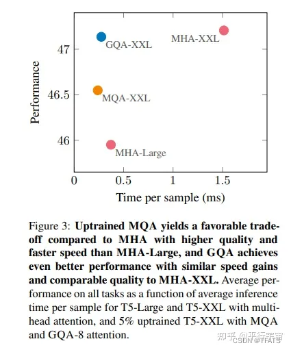

# 各类 attention

https://blog.csdn.net/TFATS/article/details/133042246

https://www.kaggle.com/code/awsaf49/attentions-sha-mha-mqa-gqa-speed-benchmark

flash-attention：https://github.com/Dao-AILab/flash-attention

## MHA： Multi Head Attention

Google 的团队在 2017 年提出的一种经典模型：[Attention Is All You Need](https://arxiv.org/pdf/1706.03762.pdf) ，首次提出并使用了 Self-Attention 机制，也就是 Multi Head Attention。

关于 Multi Head Attention 内容可参考笔者之前文章：[Transformer模型总体架构和理论](https://blog.csdn.net/TFATS/article/details/117991769)，此处不再赘述。

## MQA：Multi Query Attention

1、论文

MQA（Multi Query Attention）最早是出现在2019年谷歌的一篇论文[《Fast Transformer Decoding: One Write-Head is All You Need》](https://arxiv.org/abs/1911.02150)，之所以没有关注到，是因为之前很少做文本生成，解码序列长度也没有现阶段大模型的要求那么高。

2、原理

MQA的思想其实比较简单，论文中给出的描述如下：

Multi-query attention is identical except that the different heads share a single set of keys and values.

理解翻译内容：MQA 与 MHA 不同的是，MQA 让所有的头之间共享同一份 Key 和 Value 矩阵，每个头正常的只单独保留了一份 Query 参数，从而大大减少 Key 和 Value 矩阵的参数量。

3、MHA 和 MQA 对比


推理速度上生成一个 token 时 MHA 和 MQA 的 encoder 分别耗时1.7us和1.5us，而 decoder 分别46us和3.8us，说明 decoder 上 MQA 比 MHA 快很多。另外在效果上 MQA 的 PPL (越小越好)有所上升，BLEU(越大越好)有所下降，换句话说就是效果有所下降。

4、改进

如上对比，在 Multi-Query Attention 方法中只会保留一个单独的key-value头，这样虽然可以提升推理的速度，但是会带来精度上的损失。[《Multi-Head Attention:Collaborate Instead of Concatenate 》](https://arxiv.org/pdf/2006.16362.pdf)这篇论文的第一个思路是基于多个 MQA 的 checkpoint 进行 finetuning，来得到了一个质量更高的 MQA 模型。这个过程也被称为 Uptraining。

具体分为两步：

- 对多个 MQA 的 checkpoint 文件进行融合，融合的方法是: 通过对 key 和 value 的 head 头进行 mean pooling 操作，如下图。
- 对融合后的模型使用少量数据进行 finetune 训练，重训后的模型大小跟之前一样，但是效果会更好


## GQA：Grouped Query Attention

如下图所示，在 MHA（Multi Head Attention）中，每个头有自己单独的 key-value 对；在 MQA（Multi Query Attention）中只会有一组 key-value 对；在 GQA（Grouped Query Attention）中，会对 attention 进行分组操作，**query 被分为 N 组，每个组共享一个 Key 和 Value 矩阵。GQA-N 是指具有 N 组的 Grouped Query Attention。GQA-1具有单个组，因此具有单个Key 和 Value，等效于MQA。而GQA-H具有与头数相等的组，等效于MHA**。

在基于 Multi-head 多头结构变为 Grouped-query 分组结构的时候，也是采用跟上图一样的方法，对每一组的 key-value 对进行 mean pool 的操作进行参数融合。融合后的模型能力更综合，精度比 Multi-query 好，同时速度比 Multi-head 快。


MHA、MQA、GQA 对比



GQA 综合 MHA 和 MQA ，既不损失太多性能，又能利用 MQA 的推理加速。不是所有 Q 头共享一组 KV，而是分组一定头数 Q 共享一组 KV，比如上图中就是两组 Q 共享一组 KV。

## 实验代码

Config

```python
batch_size = 64
seq_length = 128
word_size = 512
```

### Attentions

Multi Head Attention (MHA), Multi Query Attention (MQA), Grouped Query Attention (GQA)


### PyTorch

```python
import torch
from torch import nn, Tensor
import torch.nn.functional as F
import time
import math

class Attention(nn.Module):
    def __init__(self, word_size:int=512, embed_dim:int=64, flash:bool=False) -> None:
        super().__init__()
        self.embed_dim = embed_dim
        self.flash = flash
#         self.dim_K = torch.tensor(embed_dim)
        self.query = nn.Linear(in_features=word_size, out_features=embed_dim, bias=True)
        self.key  = nn.Linear(in_features=word_size, out_features=embed_dim, bias=True)
        self.value = nn.Linear(in_features=word_size, out_features=embed_dim, bias=True)
      
		def self_attention(self, Q:Tensor, K:Tensor, V:Tensor) -> Tensor:
#         K_T = torch.transpose(K, 0, 1)
#         score = torch.matmul(Q, K_T)  / torch.sqrt(self.dim_K)
#         score = torch.softmax(score, dim=-1)
#         Z = torch.matmul(score, V)
        if self.flash:
            Z = F.scaled_dot_product_attention(Q, K, V)
        else:
            d_k = Q.size(-1)
            score = Q @ K.transpose(-2, -1) / math.sqrt(d_k)
            score = torch.softmax(score, dim=-1)
            Z = score @ V
        return Z
      

    def forward(self, x:Tensor) -> Tensor:
        Q = self.query(x)
        K = self.key(x)
        V = self.value(x)
        Z = self.self_attention(Q, K, V)
        return Z


class MultiheadAttention(nn.Module):
    r"""
    https://arxiv.org/abs/1706.03762
    """
    def __init__(self, word_size: int = 512, embed_dim: int = 64, n_head:int=8) -> None:
        super().__init__()
        self.n_head = n_head
        self.embed_dim = embed_dim
#         self.dim_K = torch.tensor(embed_dim)
        self.proj = nn.Linear(in_features=embed_dim * n_head, out_features=embed_dim)
#         nn.init.xavier_uniform_(self.proj)
        self.multihead = nn.ModuleList([
            Attention(word_size, embed_dim) for _ in range(n_head)
        ])

    def forward(self, x: Tensor) -> Tensor:
        Z_s = torch.cat([head(x) for head in self.multihead], dim=-1)
        Z = self.proj(Z_s)
        return Z

      
class  MultiQueryAttention(Attention):
    r"""
    https://arxiv.org/pdf/1911.02150.pdf
    """
    def __init__(self, word_size: int = 512, embed_dim: int = 64, n_query:int=8) -> None:
        super().__init__(word_size, embed_dim)
        self.n_query = n_query
        self.proj = nn.Linear(in_features=embed_dim * n_query, out_features=embed_dim)
#         nn.init.xavier_normal_(self.proj)
        delattr(self, 'query')
        self.queries = nn.ModuleList([
            nn.Linear(in_features=word_size, out_features=embed_dim, bias=True)
            for _ in range(n_query)
        ])
#         self.key = nn.Linear(in_features=word_size, out_features=embed_dim, bias=True)
#         self.value = nn.Linear(in_features=word_size, out_features=embed_dim, bias=True)

    def forward(self, x: Tensor) -> Tensor:
        K = self.key(x)
        V = self.value(x)
        Z_s = torch.cat([
            self.self_attention(query(x), K, V) for query in self.queries
        ], dim=-1)
        Z = self.proj(Z_s)
        return Z


class  GroupedQueryAttention(Attention):
    r"""
    https://arxiv.org/pdf/2305.13245.pdf
    """
    def __init__(self, word_size: int = 512, embed_dim: int = 64,
                 n_grouped: int = 4, n_query_each_group:int=2) -> None:
        super().__init__(word_size, embed_dim)
        delattr(self, 'query')
        delattr(self, 'key')
        delattr(self, 'value')

        self.grouped = nn.ModuleList([
            MultiQueryAttention(word_size, embed_dim, n_query=n_query_each_group)
            for _ in range(n_grouped)
        ])
        self.proj = nn.Linear(in_features=embed_dim * n_grouped, out_features=embed_dim)

    def forward(self, x: Tensor) -> Tensor:
        Z_s = torch.cat([head(x) for head in self.grouped], dim=-1)
        Z = self.proj(Z_s)
        return Z
```

### Benchmark

```
===================================
           PyTorch - GPU
===================================
Attention                 : 0.000 sec
Multi Head Attention      : 0.002 sec
Multi Query Attention     : 0.001 sec ( 31.17% faster than MHA )
Grouped Query Attention   : 0.002 sec ( 2.87% faster than MHA )
```

```python
# Move attention modules and input data to CUDA (GPU)
device = torch.device("cuda" if torch.cuda.is_available() else "cpu")

input_data = torch.rand(batch_size, seq_length, word_size).to(device)

attention = Attention(word_size=word_size).to(device)
multihead_attention = MultiheadAttention(word_size=word_size).to(device)
multiquery_attention = MultiQueryAttention(word_size=word_size).to(device)
grouped_query_attention = GroupedQueryAttention(word_size=word_size).to(device)

# Warm-up
_ = attention(input_data)
_ = multihead_attention(input_data)
_ = multiquery_attention(input_data)
_ = grouped_query_attention(input_data)

# Run the benchmarks
num_iterations = 10
start_time = time.time()
for _ in range(num_iterations):
    _ = attention(input_data)
end_time = time.time()
a_time = (end_time - start_time) / num_iterations

start_time = time.time()
for _ in range(num_iterations):
    _ = multihead_attention(input_data)
end_time = time.time()
mha_time = (end_time - start_time) / num_iterations

start_time = time.time()
for _ in range(num_iterations):
    _ = multiquery_attention(input_data)
end_time = time.time()
mqa_time = (end_time - start_time) / num_iterations

start_time = time.time()
for _ in range(num_iterations):
    _ = grouped_query_attention(input_data)
end_time = time.time()
gqa_time = (end_time - start_time) / num_iterations
    

print("="*35)
print(" "*10, "PyTorch -", "GPU" if torch.cuda.is_available() else "CPU")
print("="*35)
print(f"{'Attention':<25} : {a_time:.3f} sec")
print(f"{'Multi Head Attention':<25} : {mha_time:.3f} sec")
print(f"{'Multi Query Attention':<25} : {mqa_time:.3f} sec ({(mha_time - mqa_time)/mha_time*100: 0.2f}% faster than MHA )")
print(f"{'Grouped Query Attention':<25} : {gqa_time:.3f} sec ({(mha_time - gqa_time)/mha_time*100: 0.2f}% faster than MHA )")
```

