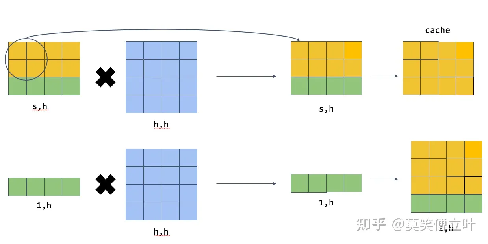
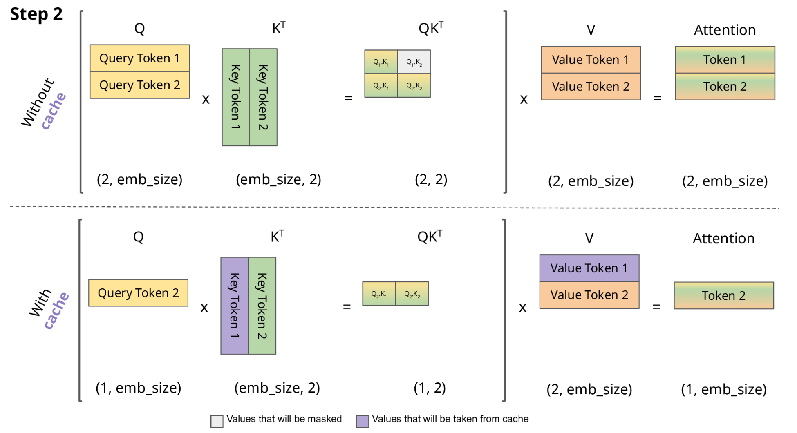
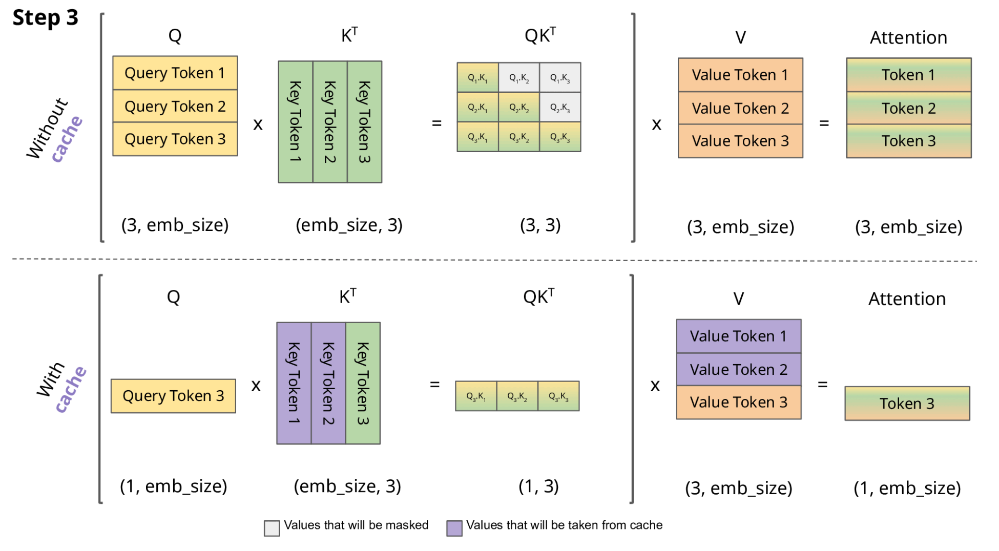
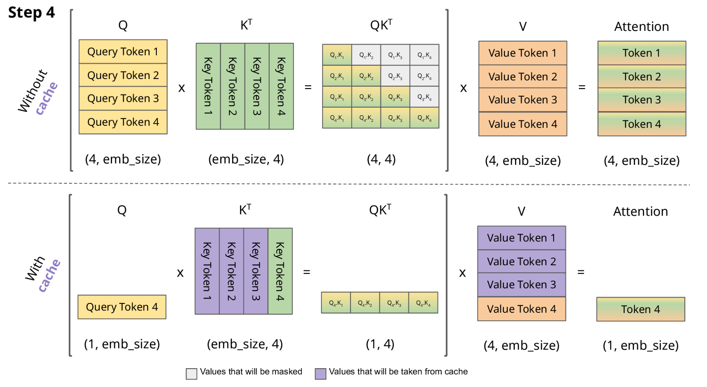

# KV cache

KV Cache：https://www.zhihu.com/question/596900067/answer/3040011798

## 矩阵乘法的性质

矩阵可以分块，那么将矩阵A拆分为[:s], [s]两部分，分别和矩阵B相乘，那么最终结果可以直接拼接，该结果与不分拆结果一致。

在self-attention和mlp中，都是类似的矩阵乘法操作，因此将[:s]部分缓存，来避免[:]整体输入导致的重复计算。



## 0. 引言

做大模型性能优化的一定对KV Cache不陌生，那么我们对这个技术了解到什么程度呢？请尝试回答如下问题：

1. KV Cache节省了[Self-Attention层](https://www.zhihu.com/search?q=Self-Attention层&search_source=Entity&hybrid_search_source=Entity&hybrid_search_extra={"sourceType"%3A"answer"%2C"sourceId"%3A3040011798})中哪部分的计算？
2. KV Cache对MLP层的计算量有影响吗？
3. KV Cache对block间的数据传输量有影响吗？

本文打算剖析该技术并给出上面问题的答案。

## 1. KV Cache是啥？

大模型推理性能优化的一个常用技术是KV Cache，该技术可以在不影响任何计算精度的前提下，通过空间换时间思想，提高推理性能。网上有一些关于该技术的分析博客，但读过后仍然会很迷糊，甚至可能会被带偏，认为这个Cache过程和数据库读取或CPU Cache加速类似的荒谬结论。刚开始我也有类似误解，直到逐行查阅并运行源码，才清楚了解到其Cache了啥，以及如何节省计算的。

原理是什么？

最本质的原理是避免重复计算，将需要重复计算的结果进行缓存，需要缓存的值为历史token对应的KV值，所以叫KV Cache。

为什么只需要KV？

预测新的token只与输入的最后一个token相关，输入的最后一个token因为只需要计算注意力值，而注意力的值需要将输入token的V值进行加权即得到结果，进行加权就需要将当前的Q与与所有的K进行计算得到权重，所以只需要缓存历史token的KV值。

为什么会存在重复计算？

首先，生成式模型每生成一个新token都需要调用整个模型进行一次推理，历史token计算得到的中间激活值在Decoder架构的模型中每次推理时都是一样的，所以可以进行缓存。
这是因为Decoder架构中，当前token只用之前的token计算得到注意力值，通过Causal Mask实现，换句话说，在推理的时候前面已经生成的字符不需要与后面的字符产生attention，从而使得前面已经计算的K和V可以缓存起来。

实现步骤









## 2. 背景

生成式generative模型的推理过程很有特点，我们给一个输入文本，模型会输出一个回答（长度为N），其实该过程中执行了N次推理过程。即GPT类模型一次推理只输出一个token，输出token会与输入tokens 拼接在一起，然后作为下一次推理的输入，这样不断反复直到遇到终止符。

如上描述是我们通常认知的GPT推理过程。代码描述如下：

```python3
import torch
from transformers import GPT2LMHeadModel, GPT2Tokenizer


model = GPT2LMHeadModel.from_pretrained("/WORK/Test/gpt", torchscript=True).eval()

# tokenizer
tokenizer = GPT2Tokenizer.from_pretrained("/WORK/Test/gpt")
in_text = "Lionel Messi is a"
in_tokens = torch.tensor(tokenizer.encode(in_text))

# inference
token_eos = torch.tensor([198]) # line break symbol
out_token = None
i = 0
with torch.no_grad():
    while out_token != token_eos:
        logits, _ = model(in_tokens)
        out_token = torch.argmax(logits[-1, :], dim=0, keepdim=True)
        in_tokens = torch.cat((in_tokens, out_token), 0)
        text = tokenizer.decode(in_tokens)
        print(f'step {i} input: {text}', flush=True)
        i += 1

out_text = tokenizer.decode(in_tokens)
print(f' Input: {in_text}')
print(f'Output: {out_text}')
```

输出：

```text
step 0 input: Lionel Messi is a player
step 1 input: Lionel Messi is a player who
step 2 input: Lionel Messi is a player who has
step 3 input: Lionel Messi is a player who has been
step 4 input: Lionel Messi is a player who has been a
step 5 input: Lionel Messi is a player who has been a key
step 6 input: Lionel Messi is a player who has been a key part
step 7 input: Lionel Messi is a player who has been a key part of
step 8 input: Lionel Messi is a player who has been a key part of the
step 9 input: Lionel Messi is a player who has been a key part of the team
step 10 input: Lionel Messi is a player who has been a key part of the team's
step 11 input: Lionel Messi is a player who has been a key part of the team's success
step 12 input: Lionel Messi is a player who has been a key part of the team's success.
step 13 input: Lionel Messi is a player who has been a key part of the team's success.

 Input: Lionel Messi is a
Output: Lionel Messi is a player who has been a key part of the team's success.
```

可以看出如上计算的问题吗？每次推理过程的输入tokens都变长了，导致推理FLOPs随之增大。有方法实现推理过程的FLOPs基本恒定不变或变小吗？（*埋个伏笔，注意是基本恒定*）。

## 3. 原理

在上面的推理过程中，每 step 内，输入一个 token序列，经过Embedding层将输入token序列变为一个三维张量[b, s, h]，经过一通计算，最后经logits层将计算结果映射至词表空间，输出张量维度为[b, s, vocab_size]。

当前轮输出token与输入tokens拼接，并作为下一轮的输入tokens，反复多次。可以看出第i+1i+1i+1 轮输入数据只比第iii轮输入数据新增了一个token，其他全部相同！因此第i+1i+1i+1轮推理时必然包含了第 iii 轮的部分计算。KV Cache的出发点就在这里，缓存当前轮可重复利用的计算结果，下一轮计算时直接读取缓存结果，就是这么简单，不存在什么Cache miss问题。

## 4. 实现细节

目前各大模型推理都实现了KV Cache，下面就看如何使用了。我们可以在上面代码基础上修改，主要改动：

- 在推理时新增了 past_key_values 参数，该参数就会以追加方式保存每一轮的K V值。kvcache变量内容为((k,v), (k,v), ..., (k,v))，即有 n_layers 个 k,v 组成的一个元组，其中 k 和 v 的维度均为 [b, n_head, s, head_dims]。这里可以顺带计算出每轮推理对应的 cache 数据量为 `2∗b∗s∗h∗n_layers` ，这里 s 值等于当前轮次值。以GPT3-175B为例，假设以 float16 来保存 KV cache，senquence长度为100，batchsize=1，则 KV cache占用显存为 2×100×12288×96×2 Byte= 472MB。
- 推理输出的token直接作为下一轮的输入，不再拼接，因为上文信息已经在 kvcache 中。

代码示例：

```text
import torch
from transformers import GPT2LMHeadModel, GPT2Tokenizer


model = GPT2LMHeadModel.from_pretrained("/WORK/Test/gpt", torchscript=True).eval()

# tokenizer
tokenizer = GPT2Tokenizer.from_pretrained("/WORK/Test/gpt")
in_text = "Lionel Messi is a"
in_tokens = torch.tensor(tokenizer.encode(in_text))

# inference
token_eos = torch.tensor([198]) # line break symbol
out_token = None
kvcache = None
out_text = in_text
i = 0
with torch.no_grad():
    while out_token != token_eos:
        logits, kvcache = model(in_tokens, past_key_values=kvcache) # 增加了一个 past_key_values 的参数
        out_token = torch.argmax(logits[-1, :], dim=0, keepdim=True)
        in_tokens = out_token # 输出 token 直接作为下一轮的输入，不再拼接
        text = tokenizer.decode(in_tokens)
        print(f'step {i} input: {text}', flush=True)
        i += 1
        out_text += text

print(f' Input: {in_text}')
print(f'Output: {out_text}')
```

通过上面代码只能看到调用层面的变化，实现细节还需看各框架的底层实现，例如Hugging Face的transformers库代码实现就比较清爽，在[modeling_gpt2.py](https://link.zhihu.com/?target=https%3A//github.com/huggingface/transformers/blob/main/src/transformers/models/gpt2/modeling_gpt2.py%23L319)中Attention部分相关代码如下：

```python3
        query = self._split_heads(query, self.num_heads, self.head_dim)
        key = self._split_heads(key, self.num_heads, self.head_dim)
        value = self._split_heads(value, self.num_heads, self.head_dim)

        if layer_past is not None: # 当输出第一个token后，layer_past就是非None了
            past_key, past_value = layer_past # 取出之前计算好的 key, value
            key = torch.cat((past_key, key), dim=-2) # past_key 与当前 token 对应的 key 拼接
            value = torch.cat((past_value, value), dim=-2) # past_value 与当前 token 对应的 value 拼接

        if use_cache is True:
            present = (key, value)
        else:
            present = None
```

在 block 层面也有相关代码，大家有空细品吧。还是那句话，说一千道一万不如阅读并运行源码一次。

其实，KV Cache 配置开启后，推理过程可以分为2个阶段：

1. 预填充阶段：发生在计算第一个输出token过程中，这时Cache是空的，计算时需要为每个 transformer layer 计算并保存key cache和value cache，在输出token时Cache完成填充；FLOPs同KV Cache关闭一致，存在大量gemm操作，推理速度慢。
2. 使用KV Cache阶段：发生在计算第二个输出token至最后一个token过程中，这时Cache是有值的，每轮推理只需读取Cache，同时将当前轮计算出的新的Key、Value追加写入至Cache；FLOPs降低，gemm变为gemv操作，推理速度相对第一阶段变快，这时属于Memory-bound类型计算。

这里用图可能更有助理解，下图是一个Decoder Block，含有Self-Attention和MLP，标红部分为KV Cache影响到的内容，即KV Cache开启后，标红的序列长度 s 变为 1，当batch_size=1时，Self-Attention中的2个dense全都变为gemv操作，MLP中的dense也全都变为gemv操作。看懂这个图就可以答对上面的3个问题啦。


如下链接也有这方面的定量分析，写的很棒，推荐大家看看。

[回旋托马斯x：分析transformer模型的参数量、计算量、中间激活、KV cache](https://zhuanlan.zhihu.com/p/624740065)

## 5. 总结

KV Cache是Transformer推理性能优化的一项重要工程化技术，各大推理框架都已实现并将其进行了封装（例如 transformers库 generate 函数已经将其封装，用户不需要手动传入past_key_values）并默认开启（config.json文件中use_cache=True）。本文尝试打开封装分析该技术内部实现，希望对大家有所帮助，文中如有纰漏，欢迎指正。


