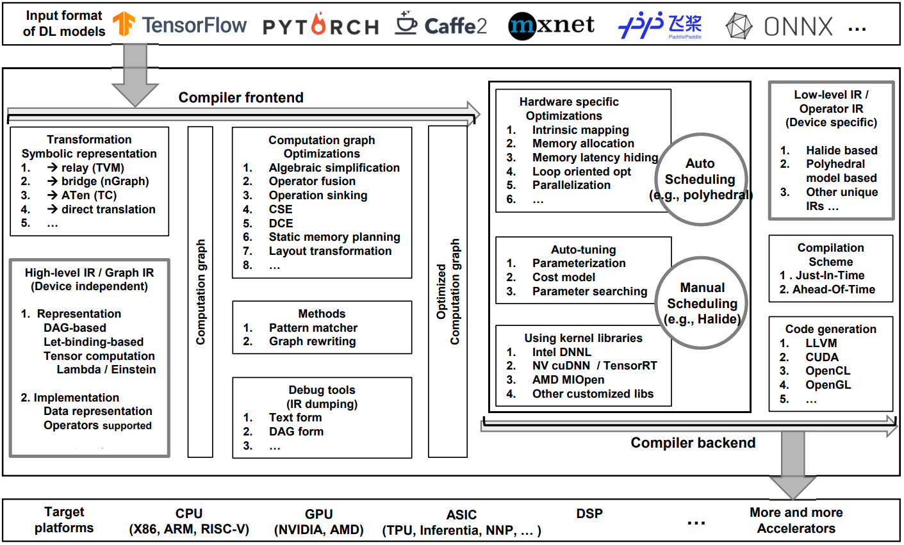
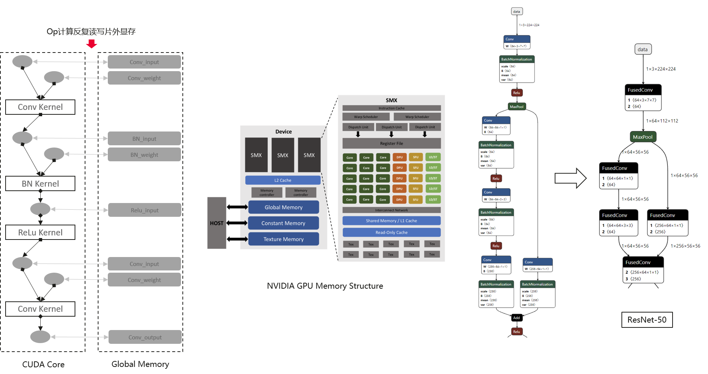
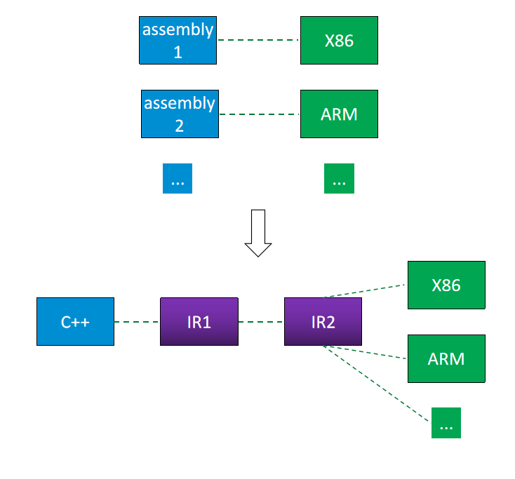

# 深度学习模型编译技术

来源 1：https://bbs.huaweicloud.com/blogs/351263

来源 2：https://www.modb.pro/db/326251

## 前言

深度学习模型的开发周期，包括训练阶段和部署阶段。

训练阶段，用户需要收集训练数据，定义自己的模型结构，在CPU或者GPU硬件上进行训练，这个过程反复优化，直到训练出满意精度的模型。

有了模型之后，我们需要将模型服务部署运行，我们期望服务延迟越低越好，吞吐越高越好。这里会从**编译优化**的角度来分析一下如何进行深度学习模型推理优化。

## 1. 推理优化现状

### 1.1 原生框架部署 - TF/PT

模型使用原生框架进行推理非常便捷，一般不需要进行太多环境适配和开发工作就能将模型部署起来，对于开发者非常友好。但是训练框架（目前主流的TensorFlow/PyTorch/MindSpore等）为了训练开发的便利，存在大量琐碎的算子，使得在batch比较小的时候，推理的性能不是那么高效。

为了提高模型推理的性能，业界近几年开始不断研究模型编译优化技术，旨在不同硬件不同场景中自动的优化推理性能。目前大体可以分成两个大的方向：推理引擎和推理编译器。两者有很多相通的地方，也有各自独特的优势。

### 1.2 推理引擎 - Library

在人工智能发展的浪潮中，许多公司推出了各家代表的推理优化解决方案，例如NVIDIA基于自家显卡的TensorRT，Intel基于自家处理器的OpenVINO，Huawei基于昇腾芯片的MindSporeLite等等。

这些推理引擎往往以library的方式供用户使用，将模型的IR转化为引擎内部的IR表示，然后映射绑定到对应硬件的算子实现，最后使用引擎的runtime来启动推理计算。

基于自家的处理器和高度定制的算子实现，推理引擎能够达到非常极致的优化性能。但是推理引擎的架构决定了不能很好的覆盖所有原生框架的算子（模型转化+算子实现覆盖度），在一部分模型推理优化中需要一定的算子开发量，往往也需要有经验的优化工程师的参与才能达到比较好的性能。

为了解决推理引擎算子覆盖度和不同硬件适配的问题，大家逐渐开始了对算子自动代码生成的研究，即推理编译器范畴。

### 1.3 推理编译器 - Compiler

推理编译器主要是为了解决几个问题：

- **算子代码自动生成**
- **IR与不同硬件的适配**

一些常用的ElementWise/Reduction等算子，往往可以通过模板或者一些IR的定义来生成不同硬件的代码，省去了手写算子的人力投入。为了适配不同的硬件，往往编译器也会将IR表示进行分层，大体分为High Level IR和Low Level IR，

- 其中High Level IR表示与硬件解耦，尽可能的表达图和算子的特性，编译器可以基于这一层的IR进行与硬件无关的图优化；
- Low Level IR则设计和硬件相关，用于针对不同硬件进行图优化和代码生成。

推理引擎和推理编译器**没有**优劣之分，两者有各自的优势和适合的场景。两者很多技术是共同的，例如图融合优化；两者也在不断的相互借鉴和融合，例如TensorRT内部的Meylin编译器也能够进行算子代码自动生成。后文中**编译优化**囊括了推理引擎和推理编译器两种优化。

## 2. 编译优化

编译优化技术一般可以分为前端优化和后端优化，分别对应High Level IR和Low Level IR，因此前端优化大都与硬件解耦，而后端优化与具体的硬件紧密相关。接下来，会分别介绍一下编译优化前端和后端有哪些优化方式。

### 2.1 编译前端

#### 2.1.1 Algebraic Simplification

模型其实是算子的DAG图，算子与算子之间往往可以通过算数等价的方式来进行计算量简化，达到优化推理性能的目的。常见的算术简化包括如下几种：

- algebraic identification
  - 这里使用layer norm中均值和方差计算进行举例。通过最后一行简化的表示，可以给予硬件同时计算x和x^2均值的可能，提高硬件的利用率。而原始的表示决定了要先计算x的均值后，再计算方差。由于两者是算术等价的，因此选择最佳的算子图表示。

- strength reduction
  - 在元素计算中，往往可以通过更高效的算子代替比较慢的算子计算，提高算子计算效率。如移位运算代替乘法或者除法操作。

- computation order
  - 算子的运算顺序可能能够省去不必要的转化操作，如图中的矩阵乘法等价变换。

- constant folding
  - 当算子输入都为常量tensor的时候，可以离线计算出算子的输出，消减掉该算子，提高运行时推理效率。

#### 2.1.2 Dataflow-level optimizations

除了算子和算术等价的优化外，还可以基于图的结构进行推理优化。例如通过前后算子的内存复用来节省内存占用；通过转化Tensor的组织结构（NCHW）来获得更高效的算子实现；取消推理时无效的算子；更改算子前后位置创造融合机会等。

#### 2.1.3 Operation Fusion

算子融合是非常常用的图优化技术。算子融合可以减少不必要的线性计算（例如BN可以提前把scale/var信息更新到conv的weight/bias中），同时可以减少片外带宽存储空间的反复读写，尽可能的将计算在片上计算完成，也减少了kernel的启动开销。

### 2.2 编译后端

#### 2.2.1 Hardware Specific Opt

针对特定的硬件，往往可以做计算和访存的定制优化，例如：

原语或指令的映射：将算子拆分到硬件的原语级别，将拆分后的计算映射到对应的原语，硬件的定制的原语具有非常高的计算效率。

访存优化：通过多级存储空间，将DRAM的数据读取到片上寄存器或者共享内存进行计算操作，并通过并发将Load/Store指令与计算指令进行隐藏，提高吞吐。

循环展开：通过将循环展开，可以给予编译器更多指令流水线优化的可能，提高计算效率。

向量化优化：很多硬件都有SIMD或者SIMT结构，可以将并行展开，使用向量化指令提高并发效率。

#### 2.2.2 Lowering

在后端最重要的是lowering设计，即将高层次的表示映射到低层次硬件相关的表示。

如果硬件厂商提供了一些底层高性能算子库实现，那么可以直接将算子表示映射到library上面，毕竟手动实现一个高效的gemm/conv还是很有难度的。另外一些ElementWise/Reduction/Transpose等操作，可以通过模板自动生成对应的代码，不用反复实现。

最终编译器会有Just-In-Time (JIT) 和Ahead-Of-Time (AOT) 两种方式来输出编译优化后的结构。JIT是在运行时进行优化，AOT是提前做好优化（生成so或者binary）。

## 3. 模型编译框架 TVM 概述

> 在任意深度学习的应用场景落地一个模型/算法时，需要经历两个基本步骤：1. 根据数据生产一个模型的训练步骤；2. 将生产出的模型部署到目标设备上执行服务的推理步骤。训练步骤目前基本由Tensorflow、PyTorch、Keras、MXNet等主流框架主导，同样的，推理步骤目前也处在“百家争鸣”的状态。

### 3.1 TVM是什么？

TVM是一款开源的、端到端的深度学习模型编译框架，用于优化深度学习模型在CPU、GPU、ARM等任意目标环境下的推理运行速度，常见的应用场景包括：

- 需要兼容所有主流模型作为输入，并针对任意类型的目标硬件生成优化部署模型的场景
- 对部署模型的推理延迟、吞吐量等性能指标有严格要求的场景
- 需要自定义模型算子、自研目标硬件、自定义模型优化流程的场景

TVM框架如上图：**主流的深度学习框架（Tensorflow, Pytorch,MXNet等）导出的模型作为TVM框架的输入，经过该框架内一系列的图优化操作以及算子级的自动优化操作后最终转化为针对目标运行时（CPU/GPU/ARM等）的部署模型，优化后的模型理论上可以最大化地利用目标硬件的资源以最小化模型的推理延迟**。

### 3.2 为什么用TVM优化模型推理？

模型推理场景下用于模型优化、部署的软件框架仍处于“百家争鸣”的状态，其原因在于推理任务的复杂性：训练后的模型需要部署于多样的设备上（Intel CPU/ NVGPU/ ARM CPU/FPGA/ AI芯片等），要在这些种类、型号不同的设备上都能保证模型推理的高效是一项极有挑战的工作。

一般来说，主流的硬件厂商会针对自家硬件推出对应的推理加速框架以最大化利用硬件性能，如Intel的OpenVINO、ARM的ARM NN、Nvidia的TensorRT等，但这些框架在实际应用场景中会遇到不少问题：

- 厂商推理框架对主流训练框架产生的模型的算子种类支持不全，导致部分模型无法部署
- 模型部署侧的开发人员需要针对不同的硬件编写不同的框架代码，花精力关注不同框架对算子的支持差异和性能差异等

因此，一套可以让我们在任意硬件上高效运行任意模型的统一框架就显得尤其有价值，而TVM正是这样一套框架。

### 3.3 TVM如何优化模型推理？

实 际 上，“运 行 模 型/代码 到 任 意 种 类 的 硬件”并不是一个概念上全新的课题。在计算机编程语言发展的早期阶段（第二代编程语言），人们也曾遇到过类似的困境，即一种硬件平台必须配套一种汇编语言且不同汇编语言无法跨平台运行的情况。随着该领域的发展，人们给出了解决之道——引入高级语言和编译器，如下图：

- 程序员负责用高级语言描述上层业务逻辑，不必关注具体硬件特性
- 编译器将高级语言逐层转化为更底层的符号，也称中间表示（IR），其中最底层的IR可以对接不同的硬件，进而转化为针对不同目标的机器码

TVM框架正是借鉴了这种思想，我们可以把TVM理解成一种广义的“编译器”

TensorFlow、PyTorch等训练框架导出的模型可以认为是“高级语言”

而TVM内部的图级别表达式树、算子级的调度Stages则可以认为是“高级语言”的“中间表示”

### 3.4 TVM框架构成

以“模型部署”为边界，TVM可以分为TVM编译器和TVM运行时两个组件：

编译器负责模型的编译和优化，是TVM的主体功能：

- 编译优化过程支持Python和C++接口
- 系统环境支持Linux、Windows以及MacOS平台（部分功能如AutoTVM在非Linux平台可能受限）

运行时负责在目标设备上执行编译器生成的模型推理代码：

- 部署过程支持JS, Java, Python, C++语言
- 部署平台除了支持Linux、Windows以及MacOS系统，还支持Android, IOS, 树莓派等端侧系统

### 3.5 TVM编译过程

TVM编译器是TVM的主体功能组件，负责优化、编译深度学习模型为可在目标设备运行推理任务的代码，整体编译过程如下图所示：

上图中，蓝色方框代表TVM编译过程中涉及到的数据结构，黄色方框代表处理这些数据结构的算法，粉色的AutoTVM则是辅助Schedule功能选择参数的一种特殊算法。

整个TVM编译栈的数据结构包括：

- **Model from Frameworks:** 从PyTorch、MXNet等框架导出的模型
- **IR Module(Relay):** TVM的图级别IR，数据结构为Relay Expression构成的Relay AST，查看源码可以发现，relay.Function实际上是relay.Expr的一种子类，其功能是为Relay Pass（遍历Relay AST的手段）提供一个入口点，故而官网中也把Relay IR称为"End to end function"
- **IR Module(TIR):** TVM的Tensor级别IR，仍然以AST的形式组织Expr，但包含了各算子（对应网络层）的具体调度细节（循环嵌套、并行、指令集等），这一层IR由一系列的tir.PrimFunc组成，此处的PrimFunc不再是访问整个AST的“入口点”，而是对应神经网络的一个层或融合层（如Conv+BN+Activation）的具体计算调度过程
- **Runtime Module:** TVM编译栈的最底层IR，直接对接Runtime在目标设备上运行

TVM编译栈涉及的数据处理算法包括：

- **Frontend:** 负责将外部框架生成的神经网络模型转化为TVM的图级别模型Relay IR
- **Relay Passes:** 负责在图级别优化IR的计算过程，常见的图优化Pass包括常量折叠、死代码消除、推理简化、内存布局转化、Op融合等
- **Scheduling:** 负责转化Relay Passes优化后的Relay IR为TensorIR，大致的流程是对于每个层/融合层对应的算子，执行graph_runtime_codegen.cc的Codegen，根据TVM框架中注册的算子compute和schedule函数，将每个算子转化为具体的计算调度过程（*Relay IR* --> **FTVMCompute** --> *Tensors* --> **FTVMSchedule** --> *Schedule Stages*）
- **TIR Passes:** 负责Tensor级别的IR优化，常见的如access index simplification，也有负责IR lower的function entry decoratation等
- **Target Translation(CodeGen):** 设备相关的低级别Codegen，将TIR转化为TVM Runtime所需的Module

### 3.6 TVM特色

**特色1：算子的计算和调度过程定义的分离**

TVM的一个特色是借鉴Halide语言的计算和调度分离定义的设计方法，将深度学习模型的算子计算方法定义和具体计算调度方式做了解耦：

- 计算（Compute）定义了每个Relay Op的具体计算过程
- 调度（Schedule）则细化了计算过程每个具体步骤的实际计算细节

以卷积算子为例，计算（Compute）定义的是算子应如何根据卷积核、卷积步长等参数操作输入Tensor，并输出卷积后的Tensor的过程；调度（Schedule）则定义了更具体的计算细节，例如卷积的6层计算循环的顺序、每层循环是否需要并行计算、并行数设定为多少等。

之所以做这样的分离式设计，是因为一般情况下，特定算子的计算方式是不变的，而算子的调度却有几乎无限种配置方法，显然对于不同的Target如CPU、GPU，其最优调度配置必然大相径庭；即使对于同一种Target如LLVM，不同型号的CPU也会导致最优配置相差甚远。TVM的计算-调度分离的设计方式，给二次开发人员提供了足够便利的API，方便其自定义性能更佳的调度配置。

**特色2：AutoTVM**

默认情况下，TVM为定义的所有算子针对常见的Target（x86/ARM/CUDA等）各提供了一套默认的调度配置。但一方面指定Target的默认配置不可能在所有型号的硬件下最大程度地利用运行环境的计算资源；另一方面调度的可选配置空间巨大，人工手动调整调度效率低且无法保证调度性能。为了解决该问题，TVM开发了AutoTVM模块通过搜索的方式获得具体硬件下的最优调度配置，总体步骤如：

- 针对每个Relay子函数，定义一系列调度原语（Schedule primitives），通过调度原语的组合实现计算结果等价的Relay子函数
- 在海量的配置组合中为每个Relay子函数搜索最优的调度配置

对于卷积这样的计算密集算子，调度配置的搜索空间通常有几十亿种选择，比较棘手的问题就是如何高效的在搜索空间中获得最优/局部最优解。常见的做法有两种：

- 遍历所有可能的参数编译模型并评估
- 评估部分参数模型，训练一个性能评估函数，用于指导搜索过程寻找更好的调度配置

由于搜索空间过于巨大，第一种方法需要花费的时间难以估量；AutoTVM采用的是第二种，用一个XGBoost模型（其他回归预测模型也可）作为评估调度配置性能的模型（CostModel），用以指导模拟退火算法（默认）寻找最优调度配置。

搜索过程完毕后AutoTVM会将过程中记录的最优配置保存下来，编译模型时可用于代替默认的Target调度配置。

## 4. 优化无止境

高性能并行计算领域有一个经典的定律叫阿姆达尔定律，**阿姆达尔定律**这一朴素的定律可以帮助我们评估出优化的上限；并指导我们要针对瓶颈进行优化。针对瓶颈进行优化才能事半功倍。优化的流程包括了应用瓶颈分析，针对瓶颈进行并行化加速，优化实现，部署。这个循环可以往复，当一个瓶颈得到优化后，又会有新的瓶颈，直到优化满足我们的需求才结束。深度学习推理优化也如此，一个应用可能瓶颈在逻辑的处理，也可能在模型的计算，在优化前需要对整体进行分析后再开始针对的优化。

推理优化技术也在朝着自动化、低精度、多硬件方向发展中，推动了人工智能深度学习技术在我们的日常生活中的普及，希望人工智能越来越智能和低成本，早日实现科幻电影中的未来世界。

