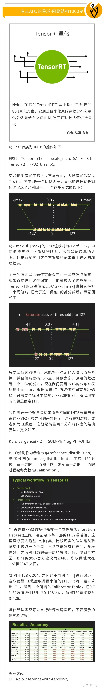
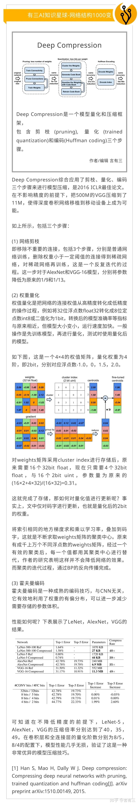
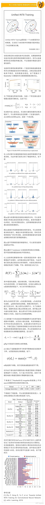

# 简述

https://zhuanlan.zhihu.com/p/140893305

## **1 二值(1bit)量化**

二值量化是最高效率的量化方式，也可以称之为1bit量化，即将32位浮点数量化为1bit整型，非常适合FPGA等平台进行并行运算。二值量化模型以Binary Connect和Binarized Neural Networks为代表。

## **2 8bit量化**

8bit量化是当前工业界最常见的量化方法，也是当前精度保持最高的量化类型。Tensorflow，TensorRT等框架都提供了支持，并且各自代表着非对称量化和对称量化的方案，以Nvidia的8bit对称量化方案为例：

## **3 任意bit量化**

除了2bit和8bit两类最常见的量化方法，3bit，4bit，6bit等也经常被研究，以韩松等人提出的Deep Compression为例，它还融合了模型剪枝技术。

## **4 混合精度量化**

所谓混合精度量化，它可以指不同的网络层有不同的量化位阶，或者权重，激活以及输出采用不同的量化方案，当下还可以利用AutoML技术来实现，以HAQ框架为例。

## **5 量化训练框架**

目前前向传播中权重和激活的量化比较成熟，但是训练中大部分的计算在反向传播步骤，如果能够将量化技术应用在反向传播中，则可以加速卷积的反向梯度传播过程，不过这需要对梯度也进行量化操作，而梯度的分布比较复杂，容易带来误差造成训练过程的不稳定。

## **6 其他**

总的来说，模型量化有非常多的研究方向，包括：

(1) 非均匀量化方案的设计。

(2) 基于重建与损失敏感的量化方法。

(3) 量化正则化方法。

(4) 网络结构的设计。

(5) 训练中量化框架的设计。

(6) 量化的具体硬件实现。