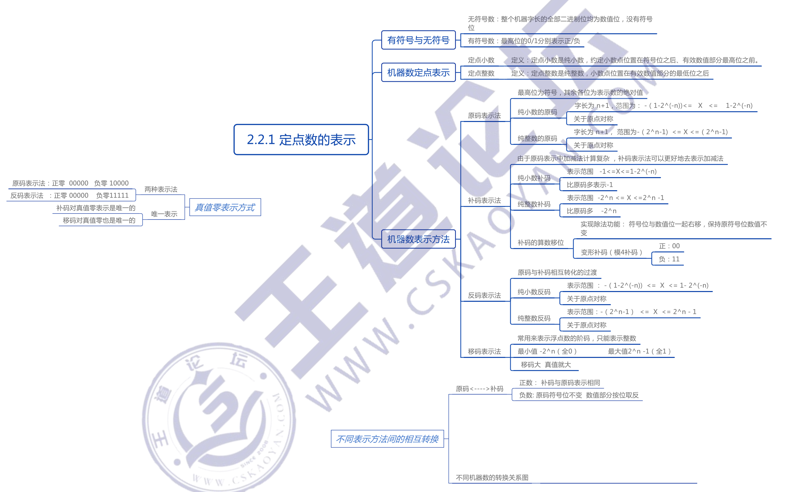
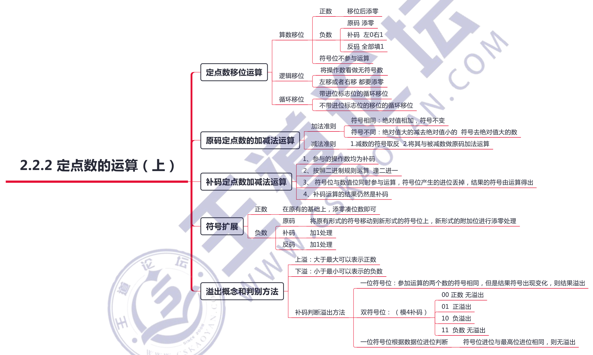

# 数据的表示和运算

## 2.1 数制与编码

## 2.2 定点数的表示和运算

## 2.3 浮点数的表示和运算

## 2.4 算术逻辑单元

## 常见问题

### 1）在计算机中，为什么要来用二进制来表示数据？

从可行性来说，采用二进制，只有0和1两个状态，能够表示 0、1两种状态的电子器件很多，如开关的接通和断开、晶体管的导通和截止、磁元件的正负剩磁、电位电平的高与低等，都可表示0、1两个数码。使用二进制，电子器件具有实现的可行性。

从运算的简易性来说，二进制数的运算法则少，运算简单，使计算机运算器的硬件结构大大简化（十进制的乘法九九口诀表有55条公式，而二进制乘法只有4 条规则）。

从逻辑上水说，由于二进制0和1正好和逻辑代数的假(false）和真(tue）相对应，有逻辑代数的理论基础，用二进制表示二值逻辑很自然。

### 2）如何表示一个数值数据？计算机中的数值数据都是二进制数吗？

在计算机内部，数值数据的表示方法有以下两大类。

- 直接用二进制数表示。分为无符号数和有符号数，有符号数又分为定点数表示和浮点数表示。无符号数用来表示无符号整数（如地址等信息）：定点数用来表示整数：浮点数用来表示实数。
- 二进制编码的十进制数，一般都采用 8421 码（也称 NBCD.码）来表示，用来表示整数。

所以，计算机中的数值数据虽然都用二进制来编码表示，但不全是二进制数，也有用十进制数表示的．后面一章有关指令类型的内容中，就有对应的二进制加法指令和十进制加法指令。

### 3）计算机在字长足够的情況下能够精确地表示每个数吗？若不能，请举例。

计算机采用二进制来表示数据，在字长足够时，可以表示任何一个整数。而二进制表示小数时只能够用 1/(2^n)的和的任意组合表示，即使字长很长，也不可能精确表示出所有小数，只能无限逼近。例如 0.1 就无法用二进制精确地表示。

### 4）字长相同的情况下，浮点数和定点数的表示范图与精度有什么区别？

字长相同时，浮点数取字长的一部分作为阶码，所以**浮点数的表示范國比定点数要大**，而取一部分作为阶码也就代表着尾数部位的有效位数减少，而定点数宇长的全部位都用来表示数值本身，**定点数的精度要比同字长的浮点数更大**。

### 5）对于位数相同的定点数和浮点数，可表示的浮点数个数比定点数个数多吗？

不是，可表示的数据个数取决于编码所采用的位数。编码位数一定，编码出来的数据个数就是一定的。n 位编码只能表示 2” 个数，所以对于相同位数的定点数和浮点数来说，可表示的数据个数应该一样多（有时可能由于一个值有两个或多个编码对应，编码个数会有少量差异）。

### 6）用移码表示浮点数的阶码有什么好处？

- 浮点数进行加减运算时，时常要比较阶码的大小，相对于原码和补码，移码比较大小更方便。
- 检验移码的特殊值（0 和max）时比较容易。阶码以移码编码时的特殊值如下。0：表示指数为负无穷大，相当于分数分母无穷大，整个数无穷接近 0，在尾数也为 。时可用来表示 0：尾数不为零表示末正规化的数。max：表示指数正无穷大，若尾数为 0，则表示浮点数超出表示范围（正负无穷大）：尾数不为0，则表示浮点数运算错误。

### 7）在高级语言编程中所定义的 unsigned'shortintlong/float/douible型数据是怎么表示的？什么称为无符号整数的“溢出"？
**unsigned 型数据就是无符号整数**，不考忠符号位。直接用全部二逃制位对数值进行编码得到的就是无符号数，一般都用**补码表示**。

**int 型数据就是定点整数，一般用补码表示**。int 型数据的位数与运行平台和编译器有关，般是 32位或 16位。例如，真值是-12 的 int 型整数，在机器内存储的机器数（假定用32位寄存器奇存）是 1111 1111 1111 1111 1111 1111 1111 0100。

**long 型数据和 short 型数据也都是定点整数**，只是位数不同，分别是长整型和短整型数，通常用**补码表示**。

**float 型数据是用来表示实数的浮点数**。现代计算机用 IEEE 7S4 标准表示浮点数，其中 32位单精度浮点数就是float 型，64位双精度浮点数就是 double 型。

