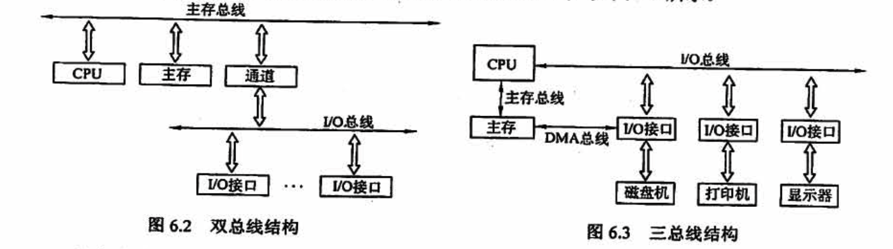
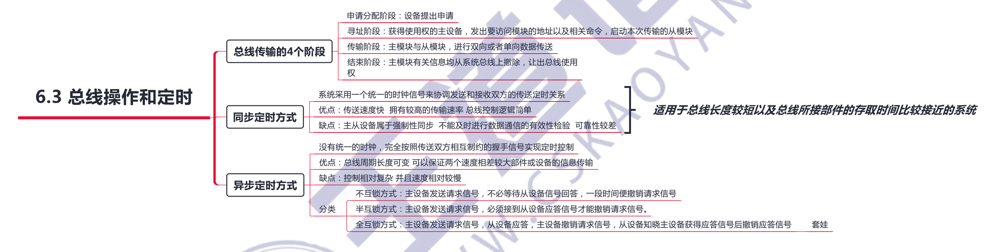

# 总线

## 6.1 总线概述

## 6.2 总线仲裁

目的：为解决多个主设备同时竞争总线控制权的问题，应当采用总线仲裁部件，以某种方式选择一个主设备优先获得总线控制权。只有获得了总线控制权的设备，才能开始传送数据。

- 集中仲裁方式，总线控制逻辑基本上集中于一个设备（如 CPU)中。将所有的总线请求集中起来，利用一个特定的裁决算法进行裁决，称为集中仲裁方式。
- 分布仲裁方式，不需要中央仲裁器，每个潜在的主模块都有自己的仲裁号和仲裁器。当它们有总线请求时，就会把它们各自唯一的仲裁号发送到共享的仲裁总线上，每个仲裁器将从仲裁总线上得到的仲裁号与自己的仲裁号进行比较。若仲裁总线上的仲裁号优先级高，则它的总线请求不子响应，并撤销它的仲裁号。最后，获胜者的仲裁号保留在仲裁总线上。

## 6.3 总线传输和定时

「总线定时」是指总线在双方交换数据的过程中需要时间上配合关系的控制，这种控制称为总线定时，**其实质是一种协议或规则**，主要有同步和异步两种基本定时方式。

## 6.4 总线标准

总线标准是国际上公布或推荐的互连各个模块的标准，是把各种不同的模块组成计算机系统时必须遵守的规范。

按总线标准设计的接口可视为通用接口，在接口的两端，任何一方只需根据总线标准的要求完成自身方面的功能要求，市无须了解对方接口的要求

