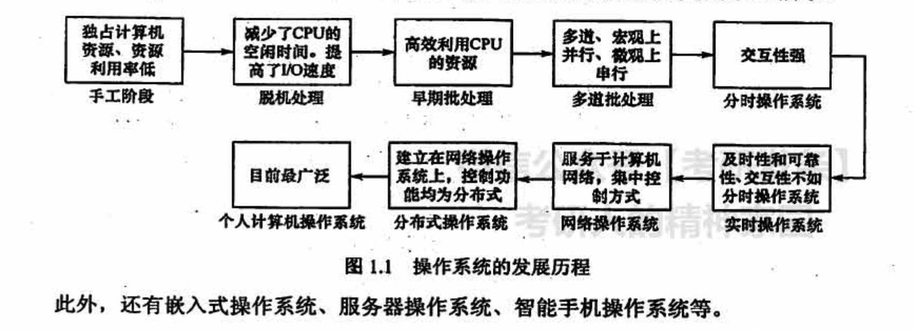
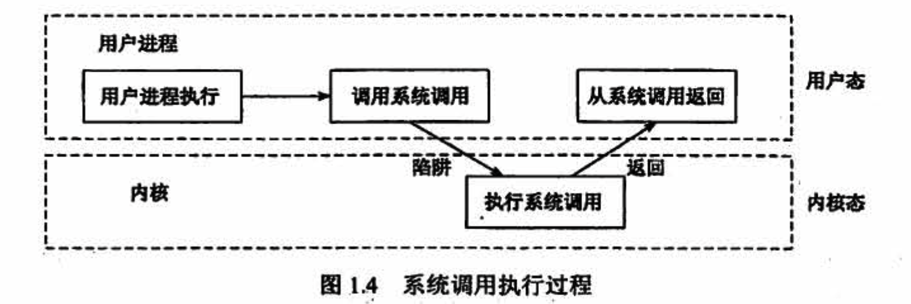
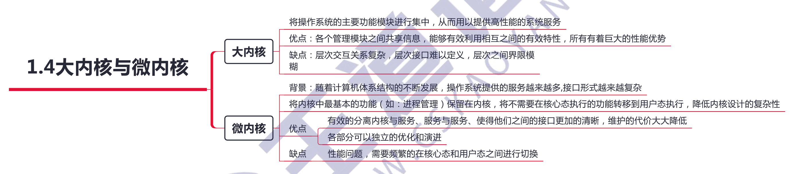

# 计算机系统概述

## 1.1 操作系统的基本概念

## 1.2 操作系统的发展和分类

## 1.3 操作系统的运行环境

### 系统调用

系统调用，是指用户在程序中调用操作系统所提供的一些子功能，系统调用可视为特殊的公共子程序。

系统中的各种共享资源都由操作系统统一掌管，因此在用户程序中，凡是**与资源有关的操作**（如存储分配、进行VO 传输及管理文件等），**都必须通过系统调用方式向操作系统提出服务请求，并由操作系统代为完成**。通常，一个操作系统提供的系统调用命令有几十条乃至上百条之多。这些系统调用按功能大致可分为如下几类。

- 设备管理。完成设备的请求或释放，以及设备启动等功能
- 文件管理。完成文件的读、写、创建及删除等功能
- 进程控制。完成进程的创建、撤销、阻塞及唤醒等功能。
- 进程通信。完成进程之间的消息传递或信号传递等功能。
- 内存管理。完成内存的分配、回收以及获取作业占用内存区大小及始址等功能

**系统调用的处理需要由操作系统「内核」程序负责完成，要运行在核心态**。用户程序可以执行陷入指令（又称访管指令或 trap 指令）来发起系统调用，请求操作系统提供服务。可以这么理解，用户程序执行 “陷入指令”，相当于把 CPU 的使用权主动交给操作系统内核程序(CPU 状态会从用户态进入核心态），之后操作系统内核程序再对系统调用请求做出相应处理。处理完成后，操作系统内核程序又会把 CPU 的使用权还给用户程序（即 CPU 状态会从核心态回到用户态）。这么设计的目的是：用户程序不能直接执行对系统影响非常大的操作，必须通过系统调用的方式请求操作系统代为执行，以便**保证系统的稳定性和安全性**，防止用户程序随意更改或访问重要的系统资源，影响其他进程的运行。

### 由用户态转向核心态的例子

- 用户程序要求操作系统的服务，即系统调用
- 发生一次中断
- 用户程序中产生了一个错误状态
- 用户程序中企图执行一条特权指令
- 从核心态转向用户态由一条指令实现，这条指令也是特权命令，一般是中断返回指令

注意：由用户态进入核心态，不仅状态需要切换，而且所用的堆栈也可能需要由用户堆栈切换为系統堆栈，但这个系统堆栈也是属于该进程的。

## 1.4 大内核与微内核

## 常见问题

### 1）并行性与并发性的区则和联系

并行性和并发性是既相似又有区别的两个概念。并行性是指两个或多个事件在同一时刻发生，并发性是指两个或多个事件在同一时间间隔内发生。

在多道程序环境下，并发性是指在一段时间内，宏观上有多个程序同时运行，但在单处理器系统中每个时刻却仅能有一道程序执行，因此微观上这些程序只能分时地交替执行。若在计算机系统中有多个处理器，则这些可以并发执行的程序便被分配到多个处理器上，实现并行执行，即利用每个处理器来处理一个可并发执行的程序。

### 2）特权指令与非特权指今

**特权指令**，是指有特殊权限的指令，由于这类指令的权限最大，使用不当将导致整个系统崩溃，如清内存、置时钟、分配系统资源、修改虚存的段表或页表、修改用户的访问权限等。若所有程序都能使用这些指令，则系统一天死机 n 次就不足为奇。为保证系统安全，这类指令只能用于操作系统或其他系统软件，不直接提供给用户使用。因此，特权指令必须在核心态执行。**实际上，CPU 在核心态下可以执行指令系统的全集**。

为了防止用户程序中使用特权指令，用户态下只能使用非特权指令，核心态下可以使用全部指令。在用户态下使用特权指令时，将产生中断以阻止用户使用特权指令。所以把用户程序放在用户态下运行，而操作系统中必领使用特权指令的那部分程序在核心态下运行，保证了计算机系统的安全可靠。从用户态转换为核心态的唯一途径是中断或异常。

### 3）访管指令与访管中断

访管指令是 一条可以在用户态下执行的指令。**在用户程序中，因要求操作系统提供服务而有意识地使用访管指令，从而产生一个中断事件（自愿中断），将操作系统转换为核心态，称为访管中断**。访管中断由访管指令产生，程序员使用访管指令向操作系统请求服务。

为什么要在程序中引入访管指令呢？这是因为用户程序只能在用户态下运行。若用户程序想要完成在用户态下无法完成的工作，该怎么办？解决这个问题要靠访管指令。访管指令本身不是特权指令，其基本功能是让程序拥有“白愿进管” 的手段，从而引起访管中断。

处于用户态的用户程序使用访管指令时，系统根据访管指令的操作数执行访管中断处理程序，访管中断处理程序将按系统调用的操作数和参数转到相应的例行子程序。完成服务功能后，退出中断，返回到用户程序断点继续执行。