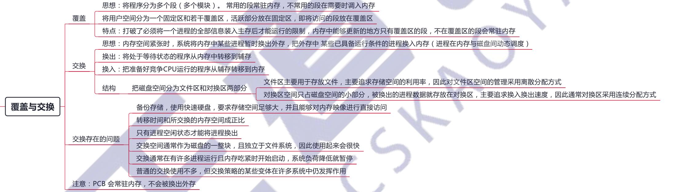
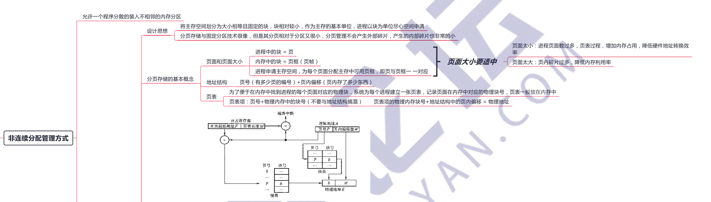
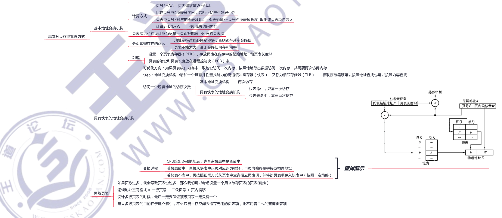
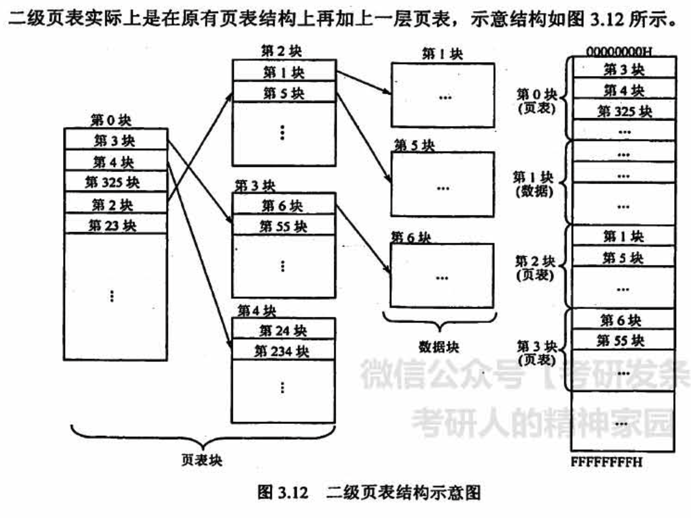

# 内存管理

## 3.1 内存管理概念

### 1）基本原理

### 2）覆盖与交换

### 3）连续分配管理

### 4）非连续分配管理

### 5）分段存储管理方式

## 3.2 虚拟内存管理

### 地址翻译

书 190 页

## 常见问题

### 1）为什么要进行内存管理？

在单道批处理系统阶段，一个系统在一个时间段内只执行一个程序，内存的分配极其简单，即仅分配给当前运行的进程。**引入多道程序的「并发」执行后，进程之间共享的不仅仅是处理机，还有主存储器。然而，共享主存会形成一些特殊的挑战。若不对内存进行管理，则容易导致内存数据的混乱，以至于限制进程的「并发」执行**。因此，为了更好地支持多道程序并发执行，必须进行内存管理。

### 2）页式管理中每个页表项大小的下限如何决定？

页表项的作用是找到该页在内存中的位置。以 32位逻辑地址空间、字节编址单位、一页 4KB为例，地址空间内共含有 2^32B/4KB二 1M 页，需要 log21M =20 位才能保证表示范围能容纳所有页面，又因为以字节作为编址单位，即页表项的大小 ≥ 20/8=3B。所以在这个条件下，为了保证页表项能够指向所有页面，页表项的大小应该大于 3B：当然，也可选择更大的页表项大小，让一个页面能够正好容下整数个页表项，以方便存储（例如取成 4B，一页正好可以装下 1K个页表项），或增加一些其他信息。

### 3）多级页表解决了什么问题？又会带来什么问题？

多级页表解决了当逻辑地址空间过大时，页表的长度会大大增加的问题。而采用多级页表时，一次访盘需要多次访问内存甚至磁盘，会大大增加一次访存的时间。

### 4）为什么要引入虛拟内存？

上一节提到过，多道程序并发执行不仅使进程之间共享了处理器，而且同时共享了主存。然而，随着对处理器需求的增长，进程的执行速度会以某种合理平滑的方式慢下来。但是，若同时运行的进程太多，则需要很多的内存，当一个**程序没有内存空间可用**时，那么它甚至无法运行。所以，**在物理上扩展内存相对有限的条件下，应尝试以一些其他可行的方式在逻辑上扩充内存**。

### 5）虛拟内存（虚存）空间的大小由什么因素决定？

- **虚存的实际容量 <= 内存容量和外存容量之和**，这是硬件的硬性条件规定的，若虛存的实际容量超过了这个容量，则没有相应的空间来供虚存使用。
- **虚存的最大容量 <= 计算机的地址位数能容纳的最大容量**。假设地址是 32 位的，按字节编址，一个地址代表 1B 存储空间，则虚存的最大容量 ≤ 4GB (2^32B）。这是因为若虚存的最大容量超过 4GB，则32 位的地址将无法访问全部虚存，也就是说 4GB 以后的空间被浪费了，相当于没有一样，没有任何意义。

### 6）虛拟内存是怎么解决问题的？会带来什么问题？

虚拟内存使用外存上的空间来扩充内存空间，通过一定的换入/换出，使得整个系统在逻辑上**能够使用一个远远超出其物理内存大小**的内存容盘。

因为虚拟内存技术调换页面时需要访问外存，会导致**平均访存时间增加**，若使用了不合适的替换算法，则会大大降低系统性能．

### 7）分页和分段管理方式

