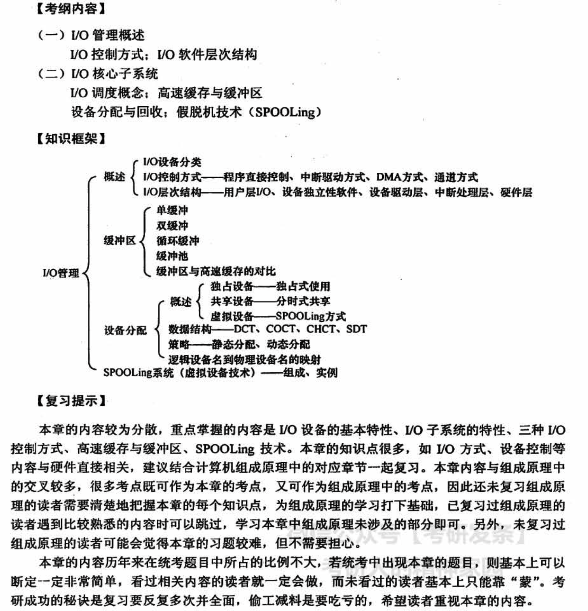
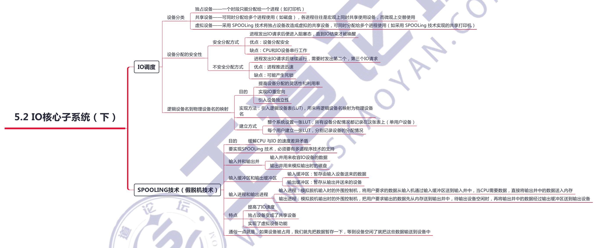

# 输入输出管理

## 5.1 概述

### DMA 方式的工作过程

CPU 接收到 IO 设备的DMA 请求时，它给 IO 控制器发出一条命令，启动 DMA 控制器，然后继续其他工作。之后 CPU 就把控制操作委托给DMA 控制器，由该控制器负责处理。DMA 控制器直接与存储器交互，传送整个数据块，**每次传送一个字**，这个过程不需要 CPU 参与。传送完成后，DMA 控制器发送一个中断信号给处理器。因此只有在传送开始和结束时才需要 CPU 的参与

### IO 通道的工作过程

**IO 通道是指专门负责输入/输出的处理机**。IO 通道方式是 DMA 方式的发展，它可以进一步减少 CPU 的干预，即把对一个数据块的读（或写）为单位的干预，**减少为对一组数据块的读**（或写），及有关控制和管理为单位的干预。同时，又可以实现 CPU、通道和IO 设备三者的并行操作，从而更有效地提高整个系统的资源利用率。

例如，当 CPU 要完成一组相关的读（或写）操作及有关控制时，只需向 IO 通道发送一条IO指令，以给出其所要执行的通道程序的首地址和要访问的 IO 设备，通道接到该指令后，执行通道程序便可完成 CPU 指定的IO 任务，数据传送结束时向 CPU 发中断请求。

### 用户对设备的一次命令来总结各层次的功能

例如，当用户要读取某设备的内容时，通过操作系统提供的read 命令接口，这就经过了用户层。

操作系统提供给用户使用的接口，一般是统一的通用接口，也就是几乎每个设备都可以响应的统一命令，如read 命令，用户发出的read 命令，首先经过设备独立层进行解析，然后交往下层。

接下来，不同类型的设备对read 命令的行为会有所不同，如磁盘接收read 命令后的行为与打印机接收 read 命令后的行为是不同的。因此，需要针对不同的设备，把read 命令解析成不同的指令，这就经过了设备驱动层。

命令解析完毕后，需要中断正在运行的进程，转而执行 read 命令，这就需要中断处理程序。

最后，命令真正抵达硬件设备，硬件设备的控制器按照上层传达的命令操控硬件设备，完成相应的功能。

## 5.2 IO核心子系统

## Cache 和 Buffer（重点）

来源：https://www.zhihu.com/question/26190832

### 磁盘高速缓存 (Disk Cache)

**Cache**（缓存）是系统两端处理**速度不匹配**时的一种**折衷策略**。因为CPU和memory之间的速度差异越来越大，所以人们充分利用数据的局部性（locality）特征，通过使用存储系统分级（memory hierarchy）的策略来减小这种差异带来的影响

因此，操作系统中使用磁盘高速**缓存技术来提高磁盘的 IO 速度**，对高速缓存复制的访问要比原始数据访问更为高效。例如，正在运行的进程的指令既存储在磁盘上，又存储在物理内存上，也被复制到 CPU 的二级和一级高速缓存中。（这里的 Cache 和计算机组成里面讲的缓存不是完全等同）

目的：

- 加快磁盘的访问速度。

实现：

不过，**磁盘高速缓存技术「不同于」通常意义下的介于 CPU 与内存之间的小容量高速存储器，而是指利用内存中的存储空问来暂存从磁盘中读出的一系列盘块中的信息。因此，磁盘高速缓存逻辑上属于磁盘，物理上则是驻留在「内存」中的盘块**。

高速缓存在内存中分为两种形式：一种是在内存中开辟一个单独的存储空间作为磁盘高速缓存，大小固定；另一种是把未利用的内存空间作为一个缓冲池，供请求分页系统和磁盘 IO 时共享。

### 缓冲区（Buffer）

**Buffer**（缓冲区）是系统两端处理**速度平衡**（从长时间尺度上看）时使用的。它的引入是为了减小短期内突发I/O的影响，起到**流量整形**的作用。把突发的大数量较小规模的 I/O 整理成平稳的小数量较大规模的 I/O，以**减少响应次数**。比如生产者——消费者问题，他们产生和消耗资源的速度大体接近，加一个buffer可以抵消掉资源刚产生/消耗时的突然变化。

目的：

- 缓和 CPU 与 IO 设备间速度不匹配的矛盾
- 减少对 CPU 的中断频率，放宽对 CPU 中断响应时间的限制
- 解决基本数据单元大小（即数据粒度） 不匹配的问题
- 提高 CPU 和 IO 设备之间的并行性

实现方式：

- 采用硬件缓冲器，但由于成本太高，除一些关键部位外，一般不采用硬件缓冲器
-  采用缓冲区（位于内存区域)

### 相同点

无论缓存还是缓冲，其实本质上解决的都是**读写速度不匹配**的问题，从这个角度，他们非常相似。

### 不同点

个人认为他们最直观的区别在于**cache是随机访问，buffer往往是顺序访问**。虽然这样说并没有直击本质，不过我们可以待分析完毕之后再来讨论真正的本质。

为了说明这个问题，让我将他们分开来说：read cache（读缓存），read buffer（读缓冲），write cache（写缓存），write buffer（写缓冲）。

无论缓存还是缓冲，其实本质上解决的都是读写速度不匹配的问题，从这个角度，他们非常相似。

#### 读缓存、读缓冲

首先讨论读缓存跟读缓冲。读缓存跟读缓冲的最大区别在于，**读缓存的目标数据是始终有效的**，如果不从缓存中读取，也可以直接读取实际数据，只不过实际数据读取会慢一些，当这个数据在缓存中，读取速度将会变快。当一个缓存中的数据被多次读取，实际上就减少了该数据从慢速设备中读取的量，这就存在某种算法去选择「什么数据需要保存在cache中」，因为尽可能多的让cache命中能提高性能。先进入cache的数据不一定先被读取，甚至说进入cache的数据有可能永远不被读取就被清除了，因此**read cache呈现出非常明显的随机访问特性**。

而**读缓冲buffer的数据则不是始终有效，而是实时生成的数据流**，每当buffer满或者主动flush buffer的时候触发一次读取，对于小数据，这样可以减少读取次数，对于大数据，这可以控制单次读取的数据量。换句话说，无论数据量大还是小，单次读取数据量都按照buffer尺寸进行归一化了。通常来说，先喂给buffer的数据一定会先被读取，所有buffer的数据几乎一定会被读取，这是很明显的**顺序访问特性**。

从上面的情况看到，读缓存以及读缓冲很明确的反应出了我所说的表面特性。而其本质特性在于cache的目标是减少读取总量每次cache命中都减小了读取总量。而buffer并不能减少读取总量，只能规整化每次读取数据的尺寸大小。

#### 写缓存、写缓冲

我们先说write buffer，write buffer是read buffer的对应，对于小数据的写入，它需要填满write buffer再进行一次写入，对于大数据，大数据会被分割到buffer尺寸的大小分批写入。因此，**write buffer 的用处在于使得每次写入的数据量相对固定**。如果一次写入4k对某个设备来说效率最高，那么把buffer定为4k，小数据积攒到4k写一次，大数据分割到每个碎片4k多次写入，这样就是write buffer的用处。

最后我们来说write cache。**所谓write cache，就是要设法减少写入次数**。也就是说，如果某些数据需要产生多次写入，那么使用cache就可以只将最终数据写入，导致最终写入数据减少。

**在实际应用中，我们有时会使用到write buffer跟write cache的合体形态**。buffer本身需要规整尺寸，与此同时，buffer还允许多次随机写入，使得多次写入的数据只用写入最后一次，这属于cache的特性。BT软件使用的写缓存往往具有类似特性，因而这种形态它同时既是buffer又是cache。**正因为在写入场合buffer跟cache没有那么明显的分界，所以才会有产生buffer跟cache究竟有啥区别的疑问**。

#### 结论

在read（读取）的场合，cache通常被用于减少重复读取数据时的开销，而buffer则用于规整化每次读取数据的尺寸，在读取场合两者用途差别很大。

在write（写入）的场合，两者功能依然没变，但由于cache跟buffer的功能在写入场合可以融合使用，所以两者可以被混淆，写入缓冲跟写入缓存往往会同时担当规整化写入尺寸以及减少写入次数的功能，所以两者有时会被混淆，但这只是个名称问题，没有原则性关系。

## 常见问题

### 1）IO 管理需完成哪些功能？

- 状态跟踪。要能实时掌握外部设备的状态
- 设备存取。要实现对设备的存取操作
- 设备分配。在多用户环境下，负责设备的分配与回收
- 设备控制。包括设备的驱动、完成和故障的中断处理

### 2）当处理机和外部设备速度差距较大时，并且此时不想让其中一方等待，有什么办法可以解决问题？
可以采用缓冲技术来缓解处理机与外部设备速度上的矛盾，即在某块地方（一般为主存)设立一片缓冲区，外部设备与处理机的输入/输出都经过缓冲区，这样外都设备和处理机就都不用互相等待。

### 3）什么是设备的独立性？引入设备的独立性有什么好处？

**设备独立性是指用户在编程序时使用的设备与实际设备无关**。一个程序应独立于分配给它的某类设备的具体设备，即在用户程序中只指明IO 使用的设备类型即可。

- 方便用户编程
- 使程序运行不受具体机器环境的限制
- 便于程序移植

### 4）如何进行设备分配

**分配设备**

首先根据 IO 请求中的物理设备名查找系统设备表（SDT），从中找出该设备的DCT，再根据 DCT 中的设备状态字段，可知该设备是否正忙。若忙，便将请求 IO 进程的 PCB 挂到设备队列上：若空闲，则按照一定的算法计算设备分配的安全性，若安全则将设备分配给请求进程，否则仍将其 PCB 挂到设备队列上。

**分配控制器**

系统把设备分配给请求 IO 的进程后，再到其 DCT 中找出与该设备连接的控制器的 COCT，从 COCT 中的状态字段中可知该控制器是否忙碌。若忙，则将请求 IO进程的 PCB 挂到该控制器的等待队列上；若空闲，则将控制器分配给进程。

**分配通道**

在该COCT 中又可找到与该控制器连接的通道的 CHCT，再根据 CHCT 内的状态信息，可知该通道是否忙碌。若忙，则将请求 IO 的进程挂到该通道的等待队列上；若空闲，则将该通道分配给进程。只有在上述三者都分配成功时，这次设备的分配才算成功。然后，便可启动该 IO 设备进行数据传送。

为使独占设备的分配具有更强的灵活性，提高分配的成功率，还可从以下两方面对基本的设备分配程序加以改进：

**增加设备的独立性**

进程使用逻辑设备名请求 IO。这样，系统首先从 SDT 中找出第个该类设备的DCT。若该设备忙，则又查找第二个该类设备的DCT。仅当所有该类设备都忙时，才把进程挂到该类设备的等待队列上；只要有一个该类设备可用，系统便进一步计算分配该设备的安全性。

**考虑多通路情况**

为防止 IO 系统的“瓶颈” 现象，通常采用多通路的 IO 系统结构。此时对控制器和通道的分配同样要经过几次反复，即若设备（控制器〕所连接的第一个控制器（通道）忙时，则应查看其所连接的第二个控制器（通道)，仅当所有控制器（通道）都忙时，此次的控制器（通道）分配才算失败，才把进程挂到控制器（通道〉的等待队列上。而只要有一个控制器（通道）可用，系统便可将它分配给进程

**设备分配过程中，先后分别访问的数据结构为 SDT-DCT-COCT-CHCT。要成功分配一个设备，必须要：① 设备可用：② 控制器可用：③ 通道可用**

