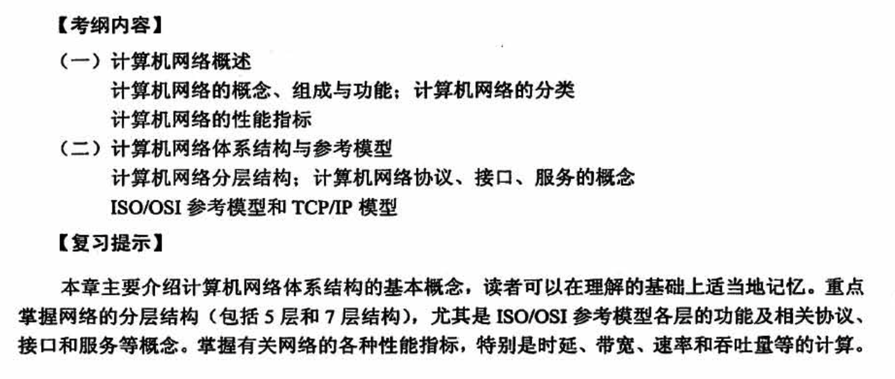
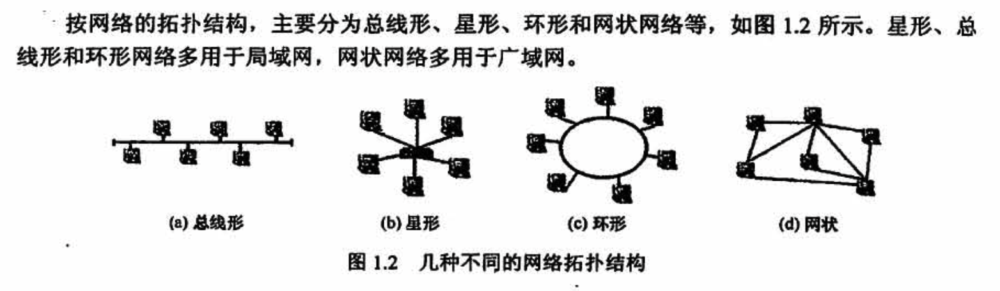
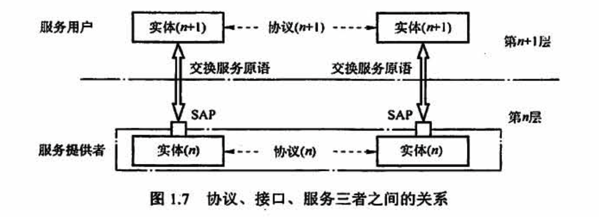
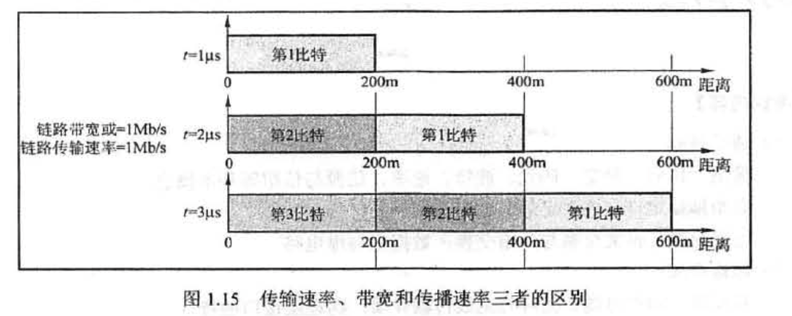

# 计算机网络体系结构

## 1.1 计算机网络概述

### 概念、组成、功能

### 分类

按交换技术分类：

**1）电路交换网络**

**在源结点和目的结点之间建立一条专用的通路用于传送数据**，包括建立连接、传输数据和断开连接三个阶段。最典型的电路交换网是传统电话网络。

该类网络的主要特点是整个报文的比特流连续地从源点直达终点，好像是在一条管道中传送。优点是数据直接传送、时延小。缺点是线路利用率低、不能充分利用线路容量、不便于进行差错控制。

**2）报文交换网络**

**用户数据加上源地址、目的地址、校验码等辅助信息，然后封装成报文。整个报文传送到相邻结点，全部存储后，再转发给下一个结点，重复这一过程直到到达目的结点**。每个报文可以单独选择到达目的结点的路径。

报文交换网络也称存储-转发网络，主要特点是整个报文先传送到相邻结点，全部存储后查找转发表，转发到下一个结点。优点是可以较为充分地利用线路容量，可以实现不同链路之间不同数据传输速率的转换，可以实现格式转换，可以实现一对多、多对一的访问，可以实现差错控制。缺点是增大了资源开销 （如辅助信息导致处理时间和存储资源的开销），增加了缓冲时延，需要额外的控制机制来保证多个报文的顺序不乱序，缓冲区难以管理（因为报文的大小不确定，接收方在接收到报文之前不能预知报文的大小)。

**3）分组交换网络**

也称包交换网络。其原理是，**将数据分成较短的固定长度的数据块，在每个数据块中加上目的地址、源地址等辅助信息组成分组（包），以存储-转发方式传输**。其主要特点是单个分组（它只是整个报文的一部分）传送到相邻结点，存储后查找转发表，转发到下一个结点。除具备报文交换网络的优点外，分组交换网络还具有自身的优点：缓冲易于管理；包的平均时延更小，网络占用的平均缓冲区更少；更易于标准化；更适合应用。现在的主流网络基本上都可视为分组交换网络。

### 性能指标

信道利用率：某一信道有百分之多少的时间是有数据通过的，即信道利用率 = 有数据通过时间/(有+无)数据通过时间

## 1.2 计算机网络体系结构与参考模型

### 1、OSI 模型

国际标准化组织 (ISO）提出的网络体系结构模型，称为开放系统互连参考模型 (OSI/ RM),通常简称为 OSI 参考模型。OSI 参考模型有7层，白下而上依次为物理层、数据链路层、网络层、传输层、会话层、表示层、应用层。**低三层统称为通信子网，它是为了联网而附加的通信设备，完成数据的传输功能；高三层统称为资源子网，它相当于计算机系统，完成数据的处理等功能。传输层承上启下**。OSI 参考模型的层次结构如图 1.8 所示

#### 1）物理层(Physical Layer)

物理层的传输单位是「比特」，任务是透明的传输比特流，功能是**在物理媒体上为数据端设备透明地传输原始比特流**。

物理层主要定义数据终端设备(DTE）和数据通信设备(DCE）的**物理与逻辑连接方法**，所以物理层协议也称物理层接口标准。由于在通信技术的早期阶段，通信规则称为规程 (Procedure )。因此物理层协议也称物理层规程。

物理层接口标准很多，如 ELA-232C、 EIA/TA RS-449、CCITT 的x.21 等

物理层主要研究以下内容：

- 通信链路与通信结点的连接需要一些**电路接口**，物理层规定了这些接口的一些参数，如机械形状和尺寸、交换电路的数量和排列等，例如，笔记本电脑上的网线接口，就是物理层规定的内容之一
- 物理层也规定了通信链路上**传输的信号的意义和电气特征**。例如物理层规定信号 A 代表数字 0，那么当结点要传输数字 0时，就会发出信号 A，当结点接收到信号 A 时，就知道自己接收到的实际上是数字 0

注意，传输信息所利用的一些物理媒体，如双绞线、光缆、无线信道等，并不在物理层协议之内而在物理层协议下面。因此，有人把物理媒体当作第0层。

#### 2）数据链路层 (Data Link Layer)

数据链路层的传输单位是「帧」，任务是**将网络层传来的 IP 数据报组装成帧**。数据链路层的功能可以概括为成帧、差错控制、流量控制和传输管理等。

由于外界噪声的干扰，原始的物理连接在传输比特流时可能发生错误。如图1.8 所示，左边结点想向右边结点传输数字 0，于是发出了信号 A；但传输过程中受到千扰，信号 A 变成了信号B，而信号 B 又刚好代表 1，右边结点接收到信号 B 时，就会误以为左边结点传送了数字1，从而发生差错。两个结点之间如果规定了**数据链路层协议，那么可以检测出这些差错，然后把收到的错误信息丢弃，这就是差错控制功能**。

在两个相邻结点之间传送数据时，由于两个结点性能的不同，可能结点A发送数据的速率会比结点B 接收数据的速率快，如果不加控制，那么结点B就会丢奔很多来不及接收的正确数据，造成传输线路效率的下降。**流量控制可以协调两个结点的速率，使结点 A 发送数据的速率刚好是结点 B 可以接收的速率**。

广播式网络在数据链路层还要处理新的问题，即如何控制对共享信道的访问。数据链路层的一个特殊的子层-介质访问子层，就是专门处理这个问题的。

典型的数据链路层协议有 SDLC、 HDLC、 PPP、 STP 和帧中继等。

#### 3）网络层 (Network Layer)

网络层的传输单位是「数据报」，它关心的是**通信子网的运行控制**，主要任务是把网络层的协议**数据单元（分组）从源端传到目的端**，为分组交换网上的不同主机提供通信服务。关键问题是对分组进行路由选择，并**实现流量控制、拥塞控制、差错控制和网际互联等功能**

结点A 向结点B 传输一个分组时，既可经过边a、c、d，也可经过边b、h，有很多条可以选择的路由，而网络层的作用就是根据网络的情况，利用相应的路由算法计算出一条合适的路径，使这个分组可以顺利到达结点B。

「流量控制」与数据链路层的流量控制含义一样，都是协调A的发送速率和B 的接收速率。

「差错控制」是通信两结点之间约定的特定检错规则，如奇偶校验码，接收方根据这个规则检查接收到的分组是否出现差错，如果出现了差错，那么能纠错就纠错，不能纠错就丢弃，确保向上层提交的数据都是无误的。

如果图 1.10 中的结点都处于来不及接收分组而要丢弃大量分组的情况，那么网络就处于拥塞状态，拥塞状态使得网络中的两个结点无法正常通信。网络层要采取一定的措施来缓解这种拥塞，这就是「拥塞控制」

**因特网是一个很大的互联网，它由大量异构网络通过路由器(Router）相互连接起来**。因特网的主要网络层协议是无连接的网际协议(Internet Protocol，IP）和许多路由选择协议，因此因特网的网络层也称网际层或IP层。

网络层的协议有IP、IPX、ICMP、IGMP、ARP、RARP 和 OSPF 等

#### 4）传输层 (Transport Layer)

传输层也称运输层，传输单位是「报文段 TCP」或「用户数据报UDP」，**传输层负责主机中两个进程之间的通信**，功能是为端到端连接提供可靠的传输服务，为「端到端」连接提供流量控制、差错控制、服务质量、数据传输管理等服务。

数据链路层提供的是「点到点」的通信，传输层提供的是「端到端」的通信，两者不同。通俗地说，**点到点可以理解为主机到主机之间的通信**，一个点是指一个硬件地址或IP地址，网络中参与通信的主机是通过硬件地址或IP地址标识的；**端到端的通信是指运行在不同主机内的两个进程之间的通信**，一个进程由一个端口来标识，所以称为端到端通信

使用传输层的服务，高层用户可以直接进行端到端的数据传输，从而忽略通信子网的存在。通过传输层的屏蔽，高层用户看不到子网的交替和变化。由于一台主机可同时运行多个进程，因此**传输层具有复用和分用的功能**。复用是指多个应用层进程可同时使用下面传输层的服务，分用是指传输层把收到的信息分别交付给上面应用层中相应的进程。

传输层的协议有 TCP、UDP。

#### 5）会话层 (Session Layer)

会话层允许不同主机上的各个进程之间进行会话。**会话层利用传输层提供的端到端的服务**，向表示层提供它的增值服务。**这种服务主要为表示层实体或用户进程建立连接并在连接上有序地传输数据，这就是会话**，也称建立同步 (SYN)。

**会话层负责管理主机间的会话进程，包括建立、管理及终止进程间的会话**。会话层可以使用校验点使通信会话在通信失效时从校验点继续恢复通信，实现数据同步。

#### 6）表示层 (Presentation Layer )

**表示层主要处理在两个通信系统中交换信息的表示方式**。不同机器采用的编码和表示方法不同，使用的数据结构也不同。为了使不同表示方法的数据和信息之间能互相交换，**表示层采用抽象的标准方法定义数据结构，并采用标准的编码形式**。数据压缩、加密和解密也是表示层可提供的数据表示变换功能。

#### 7）应用层 (Application Layer)

应用层是 OSI 参考模型的最高层，**是用户与网络的界面**。应用层为特定类型的网络应用提供访问OSI 参考模型环境的手段。因为用户的实际应用多种多样，这就要求**应用层采用不同的应用协议来解决不同类型的应用要求**，因此应用层是最复杂的一层，使用的协议也最多。典型的协议有用于文件传送的 FTP、用于电子邮件的 SMTP、用于万维网的HTTP 等。

### 2、TCP/IP 模型

ARPA 在研究 ARPAnet 时提出了 TCP/IP 模型，模型从低到高依次为网络接口层（对应 OSI参考模型中的物理层和数据链路层)、网际层、传输层和应用层(对应 OS1 参考模型中的会话层、表示层和应用层)。**TCP/IP 由于得到广泛应用而成为事实上的国际标准**。TCP/IP 模型的层次结构及名层的主要协议如图1.11 所示。

#### 1）网络接口层

网络接口层的功能类似于 OSI 参考模型的物理层和数据链路层。它表示与物理网络的接口，但实际上TCP/IP 本身并未真正描述这一部分，只是**指出主机必须使用某种协议与网络连接**，以便在其上传递 IP 分组。

具体的物理网络既可以是各种类型的局域网，如以太网、令牌环网、令牌总线网等，也可以是诸如电话网、SDH、x25、帧中继和 ATM 等公共数据网络。**网络接口层的作用是从主机或结点接收 IP 分组，并把它们发送到指定的物理网络上**。

#### 2）网际层

网际层（主机-主机）是TCP/IP 体系结构的关键部分。它和OSI 参考模型的网络层在功能上非常相似。**网际层将分组发往任何网络，并为之独立地选择合适的路由，但它不保证各个分组有序地到达**，各个分组的有序交付由高层负责。网际层定义了标准的分组格式和协议，即IP。当前采用的IP协议是第4版，即IPv4，它的下一版本是IPv6.

#### 3）传输层

传输层 （应用-应用或进程-进程）的功能同样和 OSI 参考模型中的传输层类似，即使得发送端和目的端主机上的对等实体进行会话。传输层主要使用以下两种协议：

- 传输控制协议 (Transmission Control Protocol, TCP)。它是面向连接的，数据传输的单位是报文段，能够提供可靠的交付。
- 用户数据报协议(User Datagram Protocol; UDP)。它是无连接的，数据传输的单位是用户数据报，不保证提供可靠的交付，只能提供 “尽最大努力交付”。

#### 4）应用层

应用层（用户-用户），包含所有的高层协议，如虚拟终端协议（Telnet）、文件传输协议 (FTP)、域名解析服务 （DNS）、电子邮件协议(SMTP） 和超文本传输协议 (HTTP)。

由图 1.10可以看出，IP 协议是因特网中的核心协议；TCP/IP 可以为各式各样的应用提供服务(所调的everything over IP），同时TCP/IP 也允许IP协议在由各种网络构成的互联网上运行(所谓的 IP over everything ）。正因为如此，因特网才会发展到今天的规模。

### 3、TCP/IP 与 OSI 参考模型对比

#### 相同点

- 二者都采取分层的体系结构，将庞大且复杂的问题划分为若干较容易处理的、范围较小的问题，而且分层的功能也大体相似。
- 二者都是基于独立的协议栈的概念
- 二者都可以解决异构网络的互联，实现世界上不同厂家生产的计算机之间的通信

#### 不同点

第一，OSI 参考模型的最大贡献就是精确地定义了三个主要概念：服务、协议和接口，这与现代的面向对象程序设计思想非常吻合。而TCP/IP 模型在这三个概念上却没有明确区分，不符合软件工程的思想。

第二，OSI 参考模型产生在协议发明之前，没有偏向于任何特定的协议，通用性良好。但设计者在协议方面没有太多经验，不知道把哪些功能放到哪一层更好。TCP/IP 模型正好相反，首先出现的是协议，模型实际上是对已有协议的描述，因此不会出现协议不能匹配模型的情况，但该模型不适合于任何其他非 TCP/IP 的协议栈。

第三，TCP/IP 模型在设计之初就考虑到了多种异构网的互联问题，并将网际协议（IP）作为一个单独的重要层次。OSI 参考模型最初只考虑到用一种标准的公用数据网将各种不同的系统互联。OSI 参考模型认识到 IP 的重要性后，只好在网络层中划分出一个子层来完成类似于 TCP/IP模型中的 IP 的功能。

第四，OSI 参考模型在网络层支持无连接和面向连接的通信，但在传输层仅有面向连接的通信。而TCP/IP 模型认为可靠性是端到端的问题，因此它在网际层仅有一种无连接的通信模式，但传输层支持无连接和面向连接两种模式。这个不同点常常作为考查点。

无论是 OSI 参考模型还是TCP/IP 模型，都不是完美的，对二者的讨论和批评都很多。OSI参考模型的设计者从工作的开始，就试图建立一个全世界的计算机网络都要遵循的统一标准。从技术角度来看，他们希望追求一种完美的理想状态，这也导致基于 OSI 参考模型的软件效率极低。OSI 参考模型缺乏市场与商业动力，结构复杂，实现周期长，运行效率低，这是它未能达到预期目标的重要原因。

### 4、五层协议体系

学习计算机网络时，我们往往采取折中的办法，即综合 OSI 参考模型和 TCP/IP 模型的优点，采用一种如图 1.13 所示的只有5层协议的体系结构，即我们所熟知的物理层、数据链路层、网络层、传输层和应用层。本书也采用这种体系结构进行讨论。

最后简单介绍使用通信协议栈进行通信的结点的数据传输过程。每个协议栈的最顶端都是一个面向用户的接口，下面各层是为通信服务的协议。用户传输一个数据报时，通常给出用户能够理解的自然语言，然后通过应用层，将自然语言会转化为用于通信的通信数据。通信数据到达传输层，作为传输层的数据部分（传输层 SDU)，加上传输层的控制信息（传输层 PCI)，组成传输层的PDU，然后交到网络层，传输层的 PDU 下放到网络层后，就成为网络层的 SDU，然后加上网络层的 PCI，又组成了网络层的 PDU，下放到数据链路层，就这样层层下放，层层包裹，最后形成的数据报通过通信线路传输，到达接收方结点协议栈，接收方再逆向地逐层把“包裹”拆开，然后把收到的数据提交给用户，如图 1.14 所示。

### 5、报文、报文段、分组、包、数据报、帧、数据流的概念区别

参考：https://blog.csdn.net/a3192048/article/details/84671340

应用层——消息

传输层——报文段(segment)/数据报(datagram) ，注：TCP叫**TCP报文段**，UDP叫**UDP数据报**，也有人叫UDP段

网络层——分组、数据包（packet）

链路层——帧（frame）

物理层——比特（bit）

其实，segment，datagram，packet，frame是存在于同条记录中的，是基于所在协议层不同而取了不同的名字。我们可以用一个形象的例子对数据包的概念加以说明：我们在邮局邮寄产品时，虽然产品本身带有自己的包装盒，但是在邮寄的时候只用产品原包装盒来包装显然是不行的。必须把内装产品的包装盒放到一个邮局指定的专用纸箱里，这样才能够邮寄。这里，**产品包装盒相当于数据包，里面放着的产品相当于可用的数据，而专用纸箱就相当于帧，且一个帧中通常只有一个数据包**。

#### 1）报文（message）

我们将位于「应用层」的信息分组称为报文。**报文是网络中交换与传输的数据单元，也是网络传输的单元**。报文包含了将要发送的完整的数据信息，其**长短不需一致**。**报文在传输过程中会不断地封装成分组、包、帧来传输**，封装的方式就是添加一些控制信息组成的首部，那些就是报文头。

#### 2）报文段（segment）

通常是指起始点和目的地都是「传输层」的信息单元。

#### 3）分组/包（packet）

分组是在网络中传输的二进制格式的单元，为了提供通信性能和可靠性，**每个用户发送的数据会被分成多个更小的部分**。在每个部分的前面加上一些必要的控制信息组成的首部，有时也会加上尾部，就构成了一个分组。它的起始和目的地是「网络层」

#### 4）数据报（datagram）

面向无连接的数据传输，其工作过程类似于报文交换。**采用数据报方式传输时，被传输的分组称为数据报**。通常是指起始点和目的地都使用无连接网络服务的「网络层」的信息单元。(指IP数据报)

#### 5）帧（frame）

帧是「数据链路层」的传输单元。它将上层传入的数据添加一个头部和尾部，组成了帧。它的起始点和目的点都是数据链路层。

#### 6）数据单元（data unit）SDU、PDU

指许多信息单元。常用的数据单元有服务数据单元（SDU）、协议数据单元（PDU）

- 服务数据单元 SDU，在**同一机器上的两层之间**传送信息，是完成用户所要求的的功能而传送的数据
- 协议控制信息 PCI ：控制协议操作的信息
- 协议数据单元 PDU，**对等层次之间传送的数据单元**称为该层的PDU，发送机器上每层的信息发送到接收机器上的相应层

在各层间传输数据时（从上到下），把从第n+1层收到的 PDU 作为第n层的SDU，加上第n层的 PCI就变成了第n层的PDU，交给第n-1层后作为SDU 发送，接收方接收时做相反的处理，因此可知三者的关系为 **n-SDU + n-PCI = n-PDU = (n-1)-SDU**

#### 7）TCP数据流（TCP stream）

Wireshark中是这么定义的：相同四元组(源地址，源端口，目的地址，目的端口)的包就为一条TCP流，即一条流有很多个包

## 常见问题

### 1、计算机网络与分布式计算机系统的主要区别是什么？

分布式系统最主要的特点是，整个系统中的各个计算机对用户都是透明的。用户通过输入命令就可以运行程序，但用户并不知道哪台计算机在为它运行程序。操作系统为用户选择一台最合适的计算机来运行其程序，并将运行的结果传送到合适的地方。

计算机网络则与之不同，用户必须先登录欲运行程序的计算机，然后按照计算机的地址，将程序通过计算机网络传送到该计算机中运行，最后根据用户的命令将结果传送到指定的计算机中。二者的区别主要是软件的不同。

### 2、为什么一个网络协议必须考虑到各种不利的情况？

因为网络协议如果不全面考虑不利的情况，那么当情况发生变化时，协议就会保持理想状况，一直等下去！

就如同两位朋友在电话中约好下午了点在公园见面，并且约定不见不散。这一协议很不科学，因为任何一方如果有耽搁而来不了，且无法通知对方，那么另一方就要一直等下去！所以判断一个计算机网络是否正确，不能只看在正常情况下是否正确，还必须非常仔细地检查协议能否应付各种异常情况。

### 3、因特网使用的IP协议是无连接的，因此其传输是不可靠的。这样容易使人们感到因特网很不可靠．那么为什么当初不把因特网的传输设计为可靠的呢？
传统电信网的主要用途是电话通信，并且普通电话机不是智能的，因此电信公司必须花费巨大的代价把电信网设计得非常好，以保证用户的通信质量。

数据的传送显然必须非常可靠。当初在设计 ARPAnet 时，很重要的讨论内容之一是：“谁应当负责数据传输的可靠性？”

一种意见是主张应当像电信网那样，由通信网络负责数据传输的可靠性（因为电信网的发展历史及其技术水平己经证明，人们可以将网络设计得相当可靠）；另一种意见则坚决主张由用户的主机负责数据传输的可靠性，理由是这样可使计算机网络便宜、灵活。

计算机网络的先驱认为，计算机网络和电信网的一个重大区别是终端设备的性能差别很大。于是，他们采用了“端到端的可靠传输” 策略，即**在传输层使用面向连接的 TCP 协议**，这样既能使网络部分价格便宜且灵活可靠，又能保证端到端的可靠传输。

### 4、有人说，宽带信道相当于高速公路车道数目增多了，可以同时并行地跑更多数量的汽车，虽然汽车的时速并没有提高（相当于比特在信道上的传播速度未提高），但整个高速公路的运输能力却增多了，相当于能够传送更多数量的比特。这种比喻合适吗？

可以这样比喻。但一定**不能误认为提高信道的速率是设法使比特并行地传输**

如果一定要用汽车在高速公路上行驶和比特在通信线路上传输相比较，那么可以这样来想像

**低速信道相当于汽车进入高速公路的时间间隔较长**。例如，每隔1分钟有一辆汽车进入高速公路：“信道速率提高” 相当于**进入高速公路的汽车的时间间隔缩短了**，例如，现在每隔 6秒就有一辆汽车进入高速公路。虽然汽车在高速公路上行驶的速率无变化，但在同样的时间内，进入高速公路的汽车总数却增多了 （每隔「分钟进入高速公路的汽车现在增加到 10 辆），因而吞吐量也就增大了。

也就是说，当带宽或发送速率提高后，比特在链路上**向前传播的速率并未提高，只是每秒注入链路的比特数增加了**。“速率提高〞 就体现在单位时间内发送到链路上的比特数增多了，而不是比特在链路上跑得更快了。

### 5、端到端通信和点到点通信有什么区别？

从本质上说，由物理层、数据链路层和网络层组成的通信子网为网络环境中的主机提供点到点的服务，而传输层为网络中的主机提供端到端的通信。

直接相连的结点之间的通信称为**点到点通信，它只提供一台机器到另一台机器之间的通信**，不涉及程序或进程的概念。同时，点到点通信并**不能保证数据传输的可靠性**，也不能说明源主机与目的主机之间是哪两个进程在通信，这些工作都是由传输层来完成的。

端到端通信建立在点到点通信的基础上，它是由一段段的点到点通信信道构成的，是比点到点通信更高一级的通信方式，以完成应用程序**（进程）之间的通信。“端”是指用户程序的端口**，端口号标识了应用层中不同的进程。**保障数据的可靠性**

### 6、如何理解传输速率、带宽和传播速率？

「传输速率」指主机在数字信道上**发送数据的速率**，也称数据传输速率、数据率或比特率，单位是比特/秒（b/s）。更常用的速率单位是千比特/秒（kb/s）、兆比特/秒（Mb/s）、吉比特/秒（Gb/s）、太比特/秒 (Tb/s)。

「带宽 Bandwidth」在计算机网络中指数字信道所能传送的 **最高数据传输速率**，常用来表示网络的通信线路传送数据的能力，其单位与传输速率的单位相同。

「传播速率」是指**电磁波在信道中传播的速率**，单位是米/秒（m/s），更常用的单位是千米/秒(km/s）。电磁波在光纤中的传播速率约为 2x 10^8 m/s。

例如，假定一条链路的传播速率为2x10^8 m/s，这相当于电磁波在该媒体上 I μs 可向前传播 200m。若链路带宽为 1Mb/s，则主机在 1μs 内可向链路发送 1bit 数据。

在图中，当t=0时，开始向链路发送数据；当1=1μs时，信号传播到200m 处，注入链路1比特；当t=2μs 时，信号传播到 400m 处，注入链路共2比特；当t=3μs 时，信号传播到600m 处，注入链路共3比特。

从图 1.15可以看出，在一段时间内，链路中有多少比特取决于带宽（或传输速率），而1比特“跑”了多远取决于传播速率。实际的传输速率不一定等于带宽

### 7、如何理解传输时延、发送时延和传播时延？

传输时延又称发送时延，是主机或路由器发送数据帧所需的时间，即从数据帧的第1比特算起，到该数据帧的最后1比特发送完毕所需要的时间。计算公式是 

`发送时延 = 数据帧长度 / 信道宽度`

传播时延是电磁波在信道中传播一定的距离所花费的时间。计算公式是 

`传播时延 = 信道长度 / 电磁波在信道上的传播速率`

