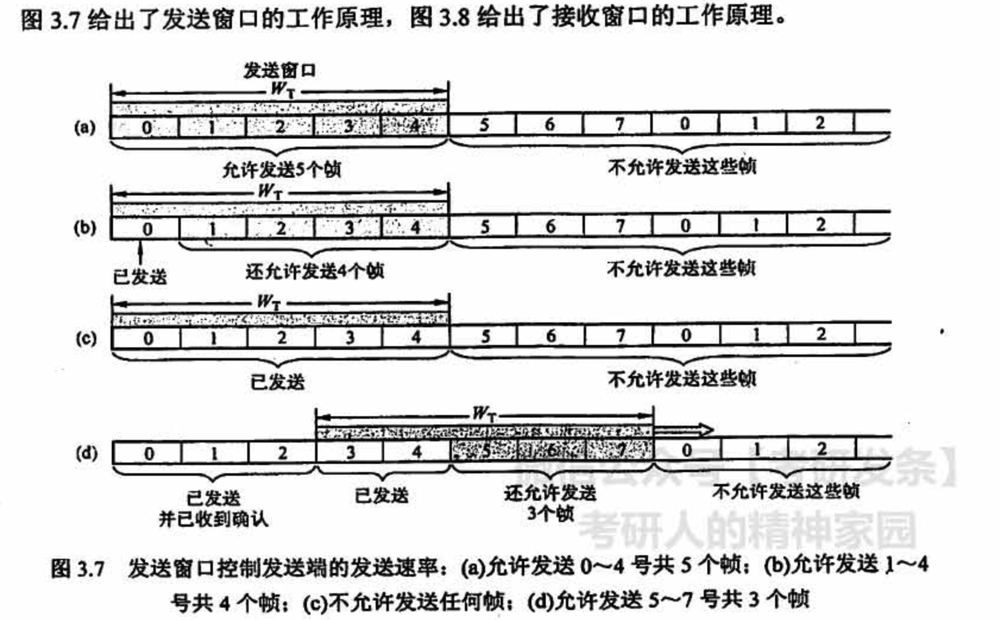
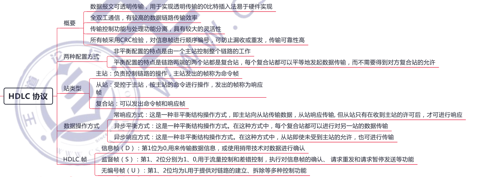
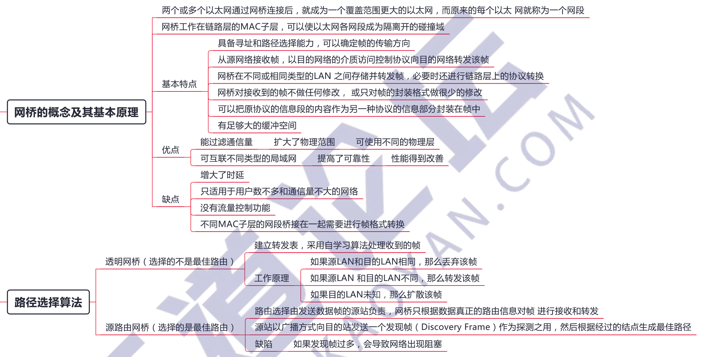

# 数据链路层

## 3.1 数据链路层的功能

## 3.2 组帧

## 3.3 差错控制

## 3.4 流量控制与可靠传输机制

## 3.5 介质访问控制

假设 A 站要向 C站运输黄豆，B 站要向 C 站运输绿豆，A 与C、B与C之间有一条公共的道路，可以类比为广播信道，如图 3.17所示。

- 在「频分复用」方式下，公共道路被划分为两个车道，分别提供给 A 到C 的车和B到C 的车行走，两类车可以同时行走，但只分到了公共车道的一半，因此频分复用（波分复用也一样）**共享时间而不共享空间**。
- 在「时分复用」方式下，先让 A到C的车走一趟，再让B到C的车走一趟，两类车交替地古用公共车道。公共车道没有划分，因此两车**共享了空间，但不共享时间**。
- 「码分复用」与另外两种信道划分方式大为不同，在码分复用情况下，黄豆与绿豆放在同一辆车上运送，到达C后，由C站负责把车上的黄豆和绿豆分开。因此：黄豆和绿豆的运送，在码分复用的情况下，**既共享了空间，也共享了时间**。

## 3.6 局域网

### 网卡

计算机与外界局域网的连接是通过主机箱内插入的一块网络接口板，又称网络适配器 (Adapter)或网络接口卡 (Network Interface Card, NIC) 实现的。网**卡上装有处理器和存储器，是工作在数据链路层的网络组件**。**网卡和局域网的通信是通过电缆**或双绞线以「串行」方式进行的，而**网卡和计算机的通信则是通过计算机主板上的 IO 总线**以「并行」方式进行的。因此，**网卡的重要功能就是进行数据的串并转换**。网卡不仅能实现**与局域网传输介质之间的物理连接和电信号匹配，还涉及帧的发送与接收、帧的封裝与拆封、介质访问控制、数据的编码与解码及数据缓存功能等**。

全世界的每块网卡在出厂时都有一个唯一的代码，称为**介质访问控制（MAC)地址**，这个地址用于控制主机在网络上的数据通信。数据链路层设备(网桥、交换机等）都使用各个网卡的 MAC地址。另外，网卡控制着主机对介质的访问，因此网卡也工作在物理层，因为它只关注比特，而不关注任何地址信息和高层协议信息。

使用 802.11 系列协议的局域网又称 Wi-Fi

 AP 就是基本服务集中的基站 (base station )

## 3.7 广域网

广域网由一些结点「交换机」及连接这些交换机的链路组成。注意不是路由器，结点交换机和路由器都用来转发分组，它们的工作原理也类似。**结点交换机在单个网络中转发分组，而路由器在多个网络构成的互联网中转发分组**。结点交换机的功能是将分组存储并转发。结点之间都是点到点连接，但为了提高网络的可靠性，通常一个结点交换机往往与多个结点交换机相连。

**广域网中的一个重要问题是路由选择和分组转发**。路由选择协议负责搜索分组从某个结点到目的结点的最佳传输路由，以便构造路由表，然后从路由表再构造出转发分组的转发表。分组是通过转发表进行转发的。

PPP 协议和HIDLC 协议是目前最常用的两种广域网数据链路层控制协议，

## 3.8 数据链路层设备

### 网桥

两个以太网通过网桥组成一个更大的以太网，原来的以太网称为一个网段

### 以太网交换机

