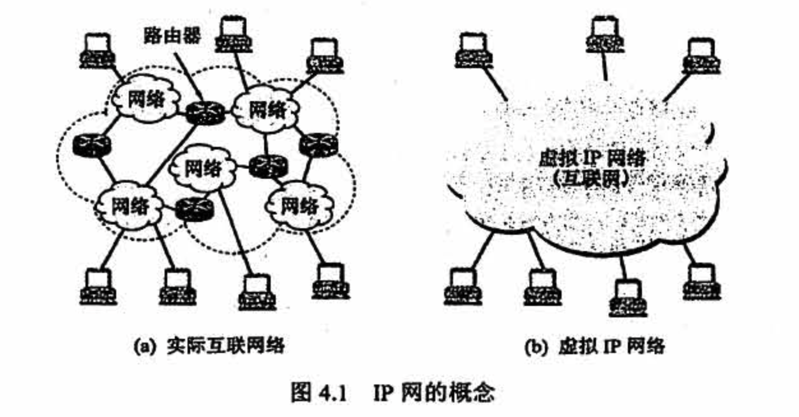
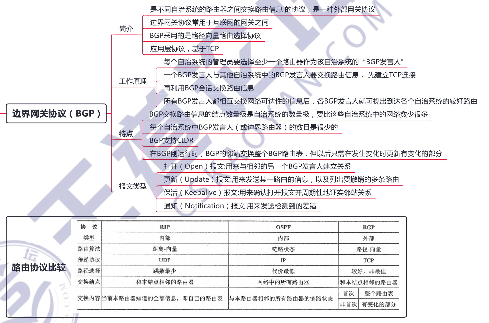
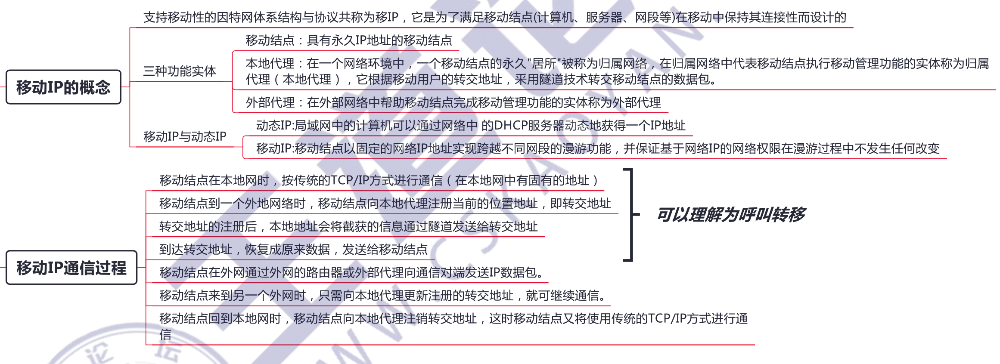

# 网络层

## 4.1 网络层功能

互联网在网络层的设计思想是，向上只提供简单灵活的、无连接的、尽最大努力交付的数据报服务。

## 4.2 路由算法

距离-向量路由算法与链路状态路由算法的比较：

- 在「距离-向量路由算法」中，每个结点仅与它的**直接邻居交谈**，它为它的邻居提供从自己到网络中**所有其他结点的最低费用估计**。

- 在「链路状态路由算法」中，每个结点通过广播的方式**与所有其他结点交谈**，但它仅告诉它们**与它直接相连的链路**的费用。

相较之下，距离-向量路由算法有可能遇到路由环路等问题。

## 4.3 IPv4

## 4.4 IPv6

## 4.5 路由协议

## 4.6 IP组播

## 4.7 移动IP

## 4.8 网络层设备

