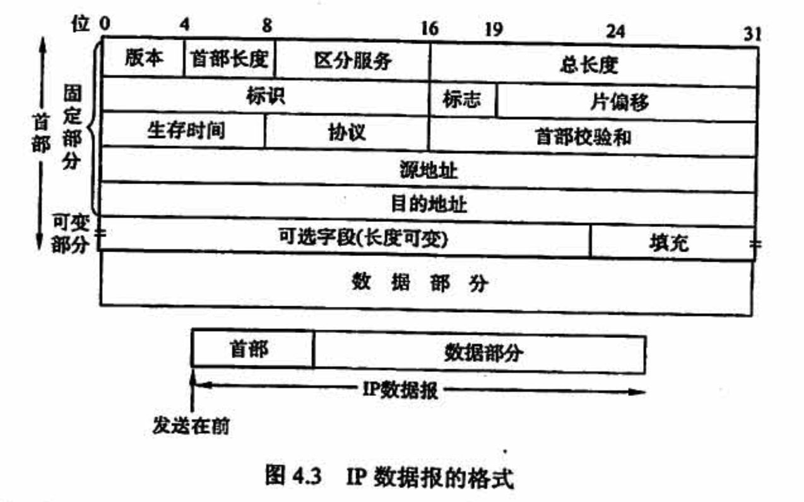
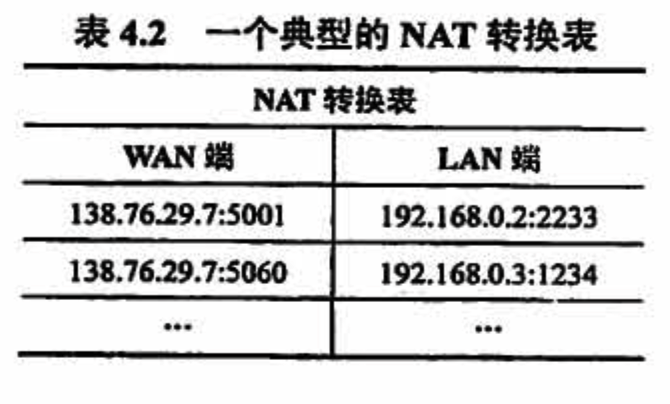

# 网络层

## 4.1 网络层功能

互联网在网络层的设计思想是，向上只提供简单灵活的、无连接的、尽最大努力交付的数据报服务。

## 4.2 路由算法

距离-向量路由算法与链路状态路由算法的比较：

- 在「距离-向量路由算法」中，每个结点仅与它的**直接邻居交谈**，它为它的邻居提供从自己到网络中**所有其他结点的最低费用估计**。

- 在「链路状态路由算法」中，每个结点通过广播的方式**与所有其他结点交谈**，但它仅告诉它们**与它直接相连的链路**的费用。

相较之下，距离-向量路由算法有可能遇到路由环路等问题。

## 4.3 IPv4

### IPv4分组

### IPv4地址与NAT

**IP地址有以下重要特点**：

- 每个IP地址都由网络号和主机号两部分组成，因此IP地址是一种分等级的地址结构。分等级的好处是：①IP地址管理机构在分配 IP 地址时只分配网络号（第一级），而主机号(第二级）则由得到该网络的单位自行分配，方便了 IP地址的管理；②路由器仅根据目的主机所连接的网络号来转发分组(而不考虑目标主机号），从而减小了路由表所占的存储空间。
- IP地址是标志一台主机(或路由器）和一条链路的接口。当一台主机同时连接到两个网络时，该主机就必须同时具有两个相应的 IP地址，每个IP地址的网络号必须与所在网络的网络号相同，且这两个 IP地址的网络号是不同的。因此IP网络上的一个路由器必然至少应具有两个IP地址 (路由器每个端口必须至少分配一个IP地址）
- 用转发器或桥接器（网桥等）连接的若干 LAN 仍然是同一个网络（同一个广播域），因此该LAN 中所有主机的IP地址的网络号必须相同，但主机号必须不同
- 在IP地址中，所有分配到网络号的网络 （无论是LAN 还是 WAN）都是平等的。
- 在同一个局城网上的主机或路由器的 IP地址中的网络号必领是一样的。路由器总是具有两个或两个以上的 IP地址，路由器的每个端口都有一个不同网络号的IP地址。

**私有IP地址**：

为了网络安全，划出了部分 IP地址为私有IP地址。私有IP地址只用于 LAN，不用于 WAN 连接（因此私有 IP地址不能直接用于 Internet， 必须通过网关利用 NAT 把私有IP地址转换为 Internet 中合法的全球 IP 地址后才能用于 Internet），并且允许私有IP地址被 LAN 重复使用。这有效地解决了IP地址不足的问题。私有IP地址网段如下

- A类：1个A类网段，即 10.0.0.0~-10.255.255.255
- B类：16个B类网段，即 172.16.0.0~172.31.255.255
- C类：256个C类网段，即：192.168.0.0~-192.168.255.255

在因特网中的所有路由器，对目的地址是私有地址的数据报一律不进行转发。这种采用私有IP 地址的互联网络称为专用互联网或本地互联网。私有IP地址也称可重用地址。

### 子网划分与子网掩码、CIDR

## 4.4 IPv6

## 4.5 路由协议

## 4.6 IP组播

## 4.7 移动IP

## 4.8 网络层设备

### 路由器

## 常见问题

### 1、“尽最大努力交付” 有哪些含义

1. 不保证源主机发送的IP数据报一定无差错地交付到目的主机。
2. 不保证源主机发送的 IP 数据报都在某一规定的时间内交付到目的主机。
3. 不保证源主机发送的 IP数据报一定按发送时的顺序交付到目的主机。
4. 不保证源主机发送的 IP 数据报不会重复交付给目的主机。
5. 不故意丢弃IP数据报。丢弃 卫数据报的情况是：路由器检测出首部校验和有错误；或由于网络中通信量过大，路由器或目的主机中的缓存已无空闲空间。

但要注意，IP数据报的首部中有一个 “首部校验和”。当它检验出 IP数据报的首部出现了差错时，就丢弃该数据报。因此，凡交付给目的主机的 IP数据报都是 IP 首部没有差错的或没有检测出差错的。也就是说，**在传输过程中，出现差销的 IP数据报都被丢弃了**。

现在因特网上绝大多数的通信量都屈于 “尽最大努力交付”。如果数据必须可靠地交付给目的地，那么使用 IP的高层软件必须负责解决这一问题。

### 2、“IP网关”和“路由器” 是否为同义语？“互连网”和“互联网” 有没有区别？

当初发明TCP/IP 的研究人员使用 IP Gateway 作为网际互联的设备，可以认为 “IP网关” 和“IP路由器” 是同义词。

“互连网”和“互联网”都是推荐名，都可以使用，不过建议优先使用“互联网”。

### 3、在一个互联网中，能否用一个很大的交换机(switch）来代替互联网中很多的路由器？

不行。交换机和路由器的功能是不相同的。

「交换机」可**在单个网络中与若干计算机相连**，并且可以将一台计算机发送过来的「帧」转发给另台计算机。从这一点上看，交换机具有集线器的转发帧的功能，但交换机比集线器的功能强很多。在同一时间，集线器只允许一台计算机发送数据。

「路由器」连接**两个或多个同构的或异构的网络**，在网络之间转发「分组」（即IP数据报)。

因此，如果许多相同类型的网络互联时，那么用一个很大的交换机（如果能够找其他计算机进行通信，交换机允许找得到）代替原来的一些路由器是可行的。但若这些互联的网络是异构的网络，那么就必须使用路由器来进行互联。

### 4、网络前缀是指网络号字段（net-id）中前面的几个类别位还是指整个的网络号字段？

是指整个的网络号字段，包括最前面的几个类别位在内。网络前缀常常简称为前缀。例如个B类地址 10100000 00000000 00000000 00010000，其类别位就是最前面的两位：10，而网络前缀就是前 16位：10100000 00000000。#

###  5、IP有分片的功能，但广域网中的分组则不必分片，这是为什么？

IP数据报可能要经过许多个网络，而源结点事先并不知道数据报后面要经过的这些网络所能通过的分组的最大长度是多少。等到IP数据报转发到某个网络时，中间结点可能才发现数据报太长了，因此在这时就必须进行分片。

但**广域网能够通过的分组的最大长度是该广域网中所有结点都事先知道的**，源结点不可能发送网络不支持的过长分组。因此广域网没有必要将己经发送出的分组再进行分片。

### 6、数据链路层广播和IP广播有何区别？

数据链路层广播是用数据链路层协议（第二层，在一个以太网上实现的对该**局域网上的所有主机**进行广播 MAC 帧，

而IP广播则是用 IP通过因特网实现的**对一个网络（即目的网络）上的所有主机**进行广播 IP数据报。

### 7、主机在接收一个广播帧或组播帧时，其CPU 所要做的事情有何区别？

在接收「广播帧」时，主机通过其适配器[即网络接口卡(NIC)〕接收每个广播帧，然后將其传递给操作系统。**CPU 执行协议软件，并界定是否接收和处理该帧**。

在接收「组播帧」时，CPU 要对适配器进行配置，而适配器根据特定的组播地址表来接收帧。凡与此组播地址表不匹配的帧都将被NIC 丢弃。因此在组播的情况下，**是适配器 NIC 而不是 CPU 决定是否接收一个帧**。

### 8、假定在一个局域网中计算机A发送ARP 请求分組，希望找出计算机B的硬件地址。这时局域网上的所有计算机都能收到这个广播发送的 ARP 请求分组。试问这时由哪个计算机使用 ARP 响应分组将计算机B 的硬件地址告诉计算机 A?
这要区分两种情况。

第一，如果计算机 B 和计算机 A 都连接在同一个局域网上，那么就是计算机B 发送 ARP 响应分组。

第二，如果计算机B 和计算机 A 不连接在同一个局域网上，那么就必须由一个连接计算机 A 所在局域网的路由器来转发 ARP 请求分组。这时，该路由器向计算机A发送 ARP 回答分组，给出自己的硬件地址。

### 9、路由器实现了物理层、数据链路层、网络层，这句话的含义是什么？

第1章中提到了网络中的**两个通信结点利用协议栈进行通信的过程。发送方一层一层地把数据 “包装”，接收方一层一层地把 “包装”拆开，最后上交给用户**。

「路由器」实现了物理层，数据链路层和网络层的含义是指路由器有能力对这三层协议的控制信息进行识别、分析以及转换，直观的理解是**路由器有能力对数据 “包装” 这三层协议或者 “拆开” 这三层协议**。

自然，路由器就有能力互联这三层协议不同的两个网络。