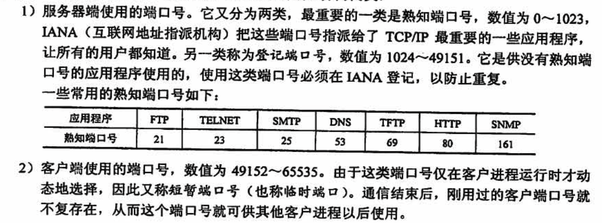
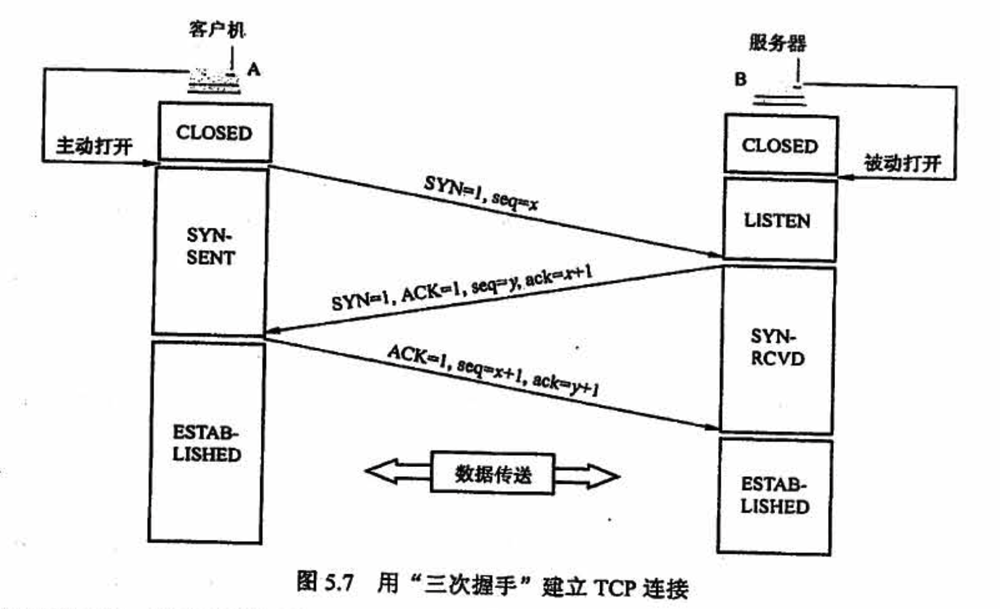

# 传输层

## 5.1 传输层提供的服务

## 5.2 UDP 协议

UDP 常用于一次性传输较少数据的网络应用，如 DNS、SNMP 等，因为对于这些应用，若采用TCP，则将为连接创建、维护和拆除带来不小的开销。UDP 也常用于多媒体应用（如IP电话、实时视频会议、流媒体等），显然，可靠数据传输对这些应用来说并不是最重要的，但 TCP的拥塞控制会导致数据出现较大的延迟这是它们不可容忍的。

UDP 不保证可靠交付，但这并不意味着应用对数据的要求是不可靠的，所有维护可靠性的工作可由用户在应用层来完成。应用开发者可根据应用的需求来灵活设计自己的可靠性机制。

UDP 是面向报文的。发送方 UDP 对应用层交下来的报文，在添加首部后就向下交付给 IP层，一次发送一个报文，既不合并，也不拆分，而是保留这些报文的边界；接收方 UDP 对IP层交上来 UDP 数据报，在去除首部后就原封不动地交付给上层应用进程，一次交付一个完整的报文。因此**报文不可分割，是UDP 数据报处理的最小单位**。因此，应用程序必须选择合适大小的报文，若报文太长，UDP 把它交给 IP 层后，可能会导致分片；若报文太短，UDP 把它交给 IP 层后，会使IP数据报的首部的相对长度太大，两者都会降低 IP层的效率。

## 5.3 TCP 协议

### TCP 连接的建立（三次挥手）

连接建立前，服务器进程处于 LISTEN（收听）状态，等待客户的连接请求。

- 第一步：「客户机」的 TCP 首先向服务器的TCP 发送连接请求报文段。这个特殊报文段的首部中的同步位 SYN 置1，同时选择一个初始序号 seq=x。TCP 规定，SYN 报文段不能携带数据，但要消耗掉一个序号。这时，TCP 客户进程进入 SYN-SENT(同步己发送）状态。

- 第二步：「服务器」的 TCP 收到连接请求报文段后，如同意建立连接，则向客户机发回确认，并为该TCP 连接分配缓存和变量。在确认报文段中，把 SYN位和 ACK 位都置 1，确认号是ack =x+1，同时也为自己选择一个初始序seq=y。注意，确认报文段不能携带数据，但也要消耗掉一个序号。这时，TCP 服务器进程进入 SYN-RCVD（同步收到）状态。

- 第三步：当「客户机」收到确认报文段后，还要向服务器给出确认，并为该TCP 连接分配缓存和变量。确认报文段的 ACK 位置1，确认号ack=y十1，序号seq=x+1。该报文段可以携带数据，若不携带数据则不消耗序号。这时，TCP 容户进程进入 ESTABLISHED（己建立连接）状态。

成功进行以上三步后，就建立了 TCP 连接，接下来就可以传送应用层数据。**TCP 提供的是全双工通信**，因此通信双方的应用进程在任何时候都能发送数据。

另外，值得注意的是，**服务器端的资源是在完成第二次握手时分配的**，而**客户端的资源是在完成第三次握手时分配的**，这就使得服务器易于受到 SYN洪泛攻击。

### TCP 连接的释放（四次握手）

参与 TCP 连接的两个进程中的任何一个都能终止该连接。TCP 连接释放的过程通常称为四次握手，如图 5.8 所示

- 第一步：「客户机」打算关闭连接时，向其ICP 发送连接释放报文段，并停止发送数据，主动关闭TCP 连接，该报文段的终止位 FN置 1，序号 seq=u，它等于前面己传送过的数据的最后一个字节的序号加 1，FIN 报文段即使不携带数据，也消耗掉一个序号。这时，TCP 客户进程进入FIN-WAIT-1（终止等待 1）状态。TCP 是全双工的，即可以想象为一条TCP 连接上有两条数据通路，发送 FIN 的一端不能再发送数据，即关闭了其中一条数据通路，但对方还可以发送数据。（这里的关闭感觉像是逻辑上的关闭）
- 第二步：「服务器」收到连接释放报文段后即发出确认，确认号ack=u+1，序号seq =v，等于它前面己传送过的数据的最后一个字节的序号加1。然后服务器进入 CLOSE-WAIT（关闭等待）状态。此时，从客户机到服务器这个方向的连接就释放了，TCP 连接处于半关闭状态。但服务器若发送数据，客户机仍要接收，即从服务器到客户机这个方向的连接并未关闭。
- 第三步：若「服务器」己没有要向客户机发送的数据，就通知TCP 释放连接，此时其发出 FIN=1的连接释放报文段。设该报文段的序号为 w(在半关闭状态服务器可能又发送了一些数据），还须重复上次已发送的确认号ack=u+1。这时服务器进入 LAST ACK（最后确认）状态。
- 第四步：「客户机」收到连接释放报文段后，必须发出确认。把确认报文段中的确认位 ACK 置1，确认号ack=w+1，序号seq=u+1。此时TCP 连接还未释放，必须经过时间等待计时器设置的时间 2MSL（最长报文段寿命）后，客户机才进入 CLOSED（连接关闭）状态。

### 可靠传输、流量控制、拥塞控制

TCP 的任务是在IP 层不可靠的、尽力而为服务的基础上建立一种可靠数据传输服务。**TCP提供的可靠数据传输服务保证接收方进程从缓存区读出的字节流与发送方发出的字节流完全一样**。TCP 使用了校验、序号、确认和重传等机制来达到这一目的。其中，TCP 的校验机制与 UDP校验一样，这里不再赘述。

**在「流量控制」中，发送方发送数据的量由「接收方」决定，而在「拥塞控制」中，则由「发送方」自己通过检测网络状况来决定**。实际上，慢开始、拥塞避免、快重传和快恢复几种算法是同时应用在拥塞控制机制中。四种算法使用的总结：在TCP 连接建立和网络出现超时时，采用慢开始和拥塞避免鐘法，当发送方接收到冗余 ACK 时，采用快重传和快恢复算法。

在本节的最后，再次提醒读者：接收方的缓存空间总是有限的。因此，**发送方发送窗口的实际大小由流量控制和拥塞控制共同决定**。当题目中同时出现接收窗口（rwnd）和拥塞窗口 (cwnd)时，发送方实际的发送窗口大小是由rwnd 和cwnd 中较小的那一个确定的。

## 常见问题

### 1、MSS 设置得太大或太小会有什么影响？

规定**最大报文段 MSS** 的大小并不是考虑到接收方的缓存可能放不下TCP 报文段。实际上，MSS 与接收窗口没有关系。TCP 的报文段的数据部分，至少要加上 40B 的首部(TCP 首部至少20B 和IP 首部至少 20B），才能组装成个 1 数据报。**若选择较小的 MSS 值，网络的利用率就很低**。设想在极端情况下，当TCP 报文段中只含有1B 的数据时，在IP层传输的数据报的开销至少有40B。这样，网络的利用率就不会超过 1/41。到了数据链路层还要加上一些开销，网络的利用率进一步降低。但反过来，**若TCP 报文段很长，那么在 IP 层传输时有可能要分解成多个短数据报片**，在终端还要把收到的各数据报片装配成原来的TCP 报文段。传输有差错时，还要进行重传。这些都会使开销增大。

因此，**MSS 应尽量大一些，只要在 IP 层传输时不要再分片就行**。由于IP数据报所经历的路径是动态变化的，在一条路径上确定的不需要分片的 MSS，如果改走另一条路径，就可能需要进行分片。因此，最佳的MSS 是很难确定的。MSS 的默认值为536B，因此在因特网上的所有主机都能接收的报文段长度是 536+20xTCP 固定首部长度 = 556B。

### 2、为何不来用“三次握手”释放连接，且发送最后一次握手报文后要等待2MSL 的时问呢？

原因有两个：

- 保证 A 发送的最后一个确认报文段能够到达B。如果 A 不等待 2MSL，若A 返回的最后确认报文段丢失，则B不能进入正常关闭状态，而A 此时已经关闭，也不可能再重传。
- 防止出现“己失效的连接请求报文段”。A 在发送最后一个确认报文段后，再经过 2MSL可保证本连接持续的时间内所产生的所有报文段从网络中消失。造成错误的情形与下文(疑难点6）不采用“两次握手” 建立连接所达的情形相同。

注意：服务器结束 TCP 连接的时间要比客户机早一些，因为客户机最后要等待 2MSL 后才可进入 CLOSED 状态

### 3、如何判定此确认报文段是对原来的报文段的确认，还是对重传的报文段的确认？

由于对于一个重传报文的确认来说，很难分辨它是原报文的确认还是重传报文的确认，使用修正的 Kam 算法作为规则：在计算平均往返时间 RTT 时，只要报文段重传了，就不采用其往返时间样本，且报文段每重传一次，就把 RTO 增大一些。

### 4、TCP 使用的是GBN 还是选择重传进行差错恢复？

这是一个有必要弄清的问题。前面讲过，TCP 使用累计确认，这看起来像是 GBN 的风格。但是，**正确收到但失序的报文并不会丢弃，而是缓存起来，并且发送冗余 ACK 指明期望收到的下一个报文段**，这是TCP 方式和 GBN 的显著区别。例如，A 发送了N个报文段，其中第k(k＜N)个报文段丢失，其余N一1个报文段正确地按序到达接收方 B。使用 GBN 时，A 需要重传分组k，及所有后继分组后k+1,k+2,...,N。相反，**TCP 却至多重传一个报文段**，即报文段k。另外。TCP 中提供一个SACK (Selective ACK）选项，即选择确认选项。使用选择确认选项时，TCP 看起来就和 SR 非常相似。因此，**TCP 的差错恢复机制可视为 GBN 和SR 协议的混合体**。

### 5、为什么超时时间发生时 cwnd 被置为1，而收到3个冗余 ACK 时 cwnd 减半？

大家可以从如下角度考虑。超时事件发生和收到 3 个元余 ACK，哪个意味着网络拥塞程度更严重？

通过分析不难发现，在收到了3个冗余 ACK 的情况下，网络里然拥塞，但至少还有 ACK报文段能被正确交付。而当超时发生时，说明网络可能己经拥塞得连 ACK 报文段都传输不了，发送方只能等待超时后重传数据。因此，**超时时间发生时，网络拥塞更严重**，那么发送方就应该最大限度地抑制数据发送量，所以cwnd 置为1：收到了个冗余 ACK 时，网络拥塞不是很严重，发送方稍微抑制一下发送的数据量即可，所以cwnd 减半。

### 6、为什么不来用“两次握手”建立连接呢？

这主要是为了**防止两次握手情况下「己失效」的连接请求报文段突然又传送到「服务器」而产生错误**。

考虑下面这种情况。客户 A 向服务器B发出TCP 连接请求，第一个连接请求报文在网络的某个结点长时间滞留，A 超时后认为报文丢失，于是再重传一次连接请求，B收到后建立连接。数据传输完毕后双方断开连接。而此时，前一个滞留在网络中的连接请求到达服务器B，而B认为A又发来连接请求，

此时若使用 “三手”，则B向A返回确认报文段，由于是一个失效的请求，因此A 不予理睬，建立连接失败。若采用的是“两次握手”，则这种情况下 B认为传输连接己经建立，并一直等待 A 传输数据，而 A 此时并无连接请求，因此不予理睬，这样就造成了 B的资源白白浪费。

### 7、是否 TCP 和 UDP 都需要计算往返时间 RTT?

往返时间 RTT 仅对传输层TCP 协议才很重要,因为 **TCP 要根据 RTT 的值来设置超时计时器的超时时间**。

UDP 没有确认和重传机制，因此 RTT 对 UDP 没有什么意义。

因此，不能笼统地说“往返时间 RTT 对传输层来说很重要”，因为只有TCP 才需要计算 RTT,而UDP 不需要计算 RTT。

### 8、为什么TCP 在建立连接时不能每次都选择相同的、固定的初始序号？

- 假定主机 A 和B频繁地建立连接，传送一些TCP 报文段后，再释放连接，然后又不断地建立新的连接、传送报文段和释放连接。
- 假定每次建立连接时，主机 A 都选择相同的、固定的初始序号，如选择 1。
- 假定主机 A 发出的某些TCP 报文段在网络中会沸留较长时间，以致主机 A 超时重传这些TCP 报文段。
- 假定有一些在网络中带留时间较长的TCP 报文段最后终于到达主机 B，但这时传送该报文段的那个连接早已释放，而在到达主机 B 时的TCP 连接是一条新的TCP 连接。

这样，**工作在新的 TCP 连接的主机 B 就有可能会接收在旧的连接传送的、已无意义的、过时的TCP 报文段**（因为这个TCP 报文段的序号有可能正好处在当前新连接所用的序号范围之中），结果产生错误。

因此，必须使得迟到的TCP 报文段的序号不处在新连接所用的序号范围之中。

这样，TCP 在建立新的连接时所选择的初始序号一定要和前面的一些连接所用过的序号不同。因此，不同的TCP 连接不能使用相同的初始序号

### 9、假定在一个互联网中，所有链路的传输都不出现差错，所有结点也都不会发生故障。试问在这种情况下，TCP 的“可靠交付”的功能是否就是多余的？
不是多余的。TCP 的“可靠交付” 功能在互联网中起着至关重要的作用。至少在以下的情况下，TCP 的“可靠交付” 功能是必不可少的。

- 每个IP数据报独立地选择路由，因此在到达目的主机时有可能出现失序
- 由于路由选择的计算出现错误，导致IP数据报在互联网中转圈。最后数据报首部中的生存时间 （TTL）的数值下降到零。这个数据报在中途就被丢失
- 某个路由器突然出现很大的通信量，以致路由器来不及处理到达的数据报。因此有的数据报被丢弃。

以上列举的问题表明：必须依靠TCP 的“可靠交付” 功能才能保证在目的主机的目的进程中接收到正确的报文。