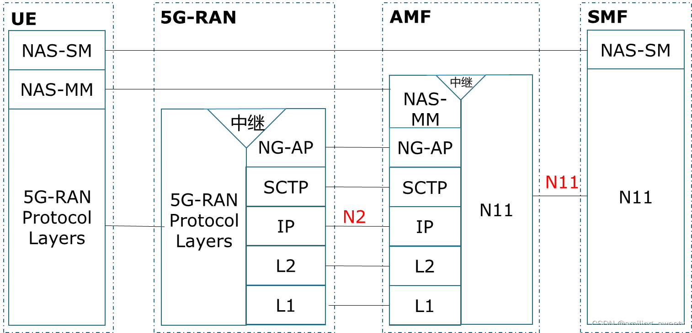

# 5G 网络架构

来源 1：[5G网络架构、网络接口及协议栈](https://blog.csdn.net/smiling_sweety/article/details/123624758)

来源 2：[5G架构基础知识](https://blog.csdn.net/achong_2050/article/details/119062149)

## 一、三大应用场景

1. eMBB， Enhanced Mobile Broadband 增强移动带宽，在现有移动宽带业务场景的基础上，提升用户体验。
2. URLLC, Ultra Reliable Low Latency Communication 高可靠、低时延、极高可用性。工业应用控制、远程手术。
3. mMTC，massive Machine-Type Communication 海量机器类通信。大规模物联网，主要是人与物之间的信息交互。

## 二、整体网络架构

5G网络架构宏观上分为「接入网」和「核心网」两部分

- 5G接入层成为NG-RAN（NR），由5G基站（gNB）组成；
- 5G核心网由控制面（AMF）、用户面（UPF）分离组成。

## 三、网络接口及无线协议栈

### 1、5G网络接口及协议

5G网络接口分为 Xn 和 NG 两种接口

接口 Xn：

- gNB与gNB间的接口，支持数据和信令传输
- Xn-C：Xn接口管理、UE移动性管理（跨栈切换、上下文转移和RAN寻呼）、双连接（DC）
- Xn-U：提供用户面PDUs非保证传递，主要功能包括数据转发和流控制

接口 NG：

- gNB与核心网的接口
- NG-C(NG2)：NG接口管理、UE上下文管理、UE移动性管理、NAS消息传输、PDU会话管理、配置转换、告警信息传输、寻呼
- NG-U(NG3)：提供NG-RAN和UPF间的用户面会话（user plane PUDs）非保证传递

接口 F1：

- gNB-CU和gNB-DU之间的接口
- F1-C：F1接口管理、gNB-DU管理、系统消息管理、负载管理、寻呼、F1 UE上下文管理……
- F1-U：用户数据转发、流控制功能

协议：

- 控制面：Xn-C、NG-C、F1-C接口信令连接基于**SCTP协议（可靠性高）**；
- 数据面：Xn-U、NG-U、F1-U用户面传输基于**GTP-U协议**；

gNB和UE之间使用NR控制面和用户面协议

5G网络接口协议栈：

### 2、5G无线端到端协议栈

#### 1）5G无线协议栈

SDAP：QoS flow与无线承载的映射。

3GPP于 2017年9月份发布了NR 和NG-RAN总体规范38.300 V1，该规范对5G NR网络和协议体系结构进行了详细描述。无线侧用户面和控制面协议栈架构如下图所示：

当仔细观察这两个协议栈时，可看出LTE和5G-NR协议栈许多相似之处，这是因为LTE协议栈是开发5G-NR的基线；5G-NR用户面包含了与LTE相同的Phy, MAC, RLC和PDCP，并引入了一个名为SDAP （Service Data Adaptation Protocol)的新层。在另一方面5G-NR的控制面与LTE的控制面相同，其中：与MME相同的单元是AMF 。

**层一**:

平台业务、基站

**5G（NR）层二功能**：

mac「数据面」，算法、性能相关

- 业务数据适应协议(SDAP)；
- 分组数据汇聚协议(PDCP)；
- 无线链路控制(RLC)；
- 媒介访问控制(MAC)；
- 物理层提供给MAC子层传输通道;
- MAC子层提供给 RLC子层逻辑通道;
- RLC子层提供给 PDCP子层 rlc 通道;
- PDCP 子层提供给SDAP子层射频承载器;
- SDAP 子层提供给5GC QOS流;
- 压缩--头部压缩和节点；
- 控制通道(BCCH，PCCH没有清晰地描述)。

**5G（NR）层三 (RRC)功能** ：

mac「控制面」

- AS和NAS相关系统信息的广播;
- 5GC或NG-RAN发起的Paging；
- UE和NG-RAN之间RRC连接建立、维护和释放，包括添加、修改和释放，载波聚合、添加、修改和释放NR或E-UTRA与NR之间的双连接。
- 安全功能包括密钥管理;
- 无线信令承载(SRBS)和数据承载(DRB)建立、配置、维护和释放管理;
- 移动功能包括切换和上（下）文传输; 小区选择和重选及小区选择和重选的控制; 频间切换。
- 服务质量（QoS）管理功能;
- UE测量报告、及测量控制和报告;
- 无线链路故障、恢复的监测;
- UE与网络之间NAS消息传送。

#### 2）5G端到端控制面协议栈

#### 3）5G端到端用户面协议栈

**因此，5G中重要的端口包括：NG2、NG3、NG6、NG9、NG11**。

## 四、5G核心网新架构 

5GC基于服务化架构（网络功能服务解耦）和SDN/NFV框架（网络云化），结合网络切片（端到端逻辑专用网络）、边缘计算、5G非公共网络（NPN）、5G局域网等行业专网使能技术，实现网络架构开放性、网元虚拟化、资源灵活调度及定制化场景应用。

5G核心网必须满足低时延业务处理的时效性需求。5G核心网控制面的逻辑功能被进一步细分，AMF和SMF分离为两个逻辑节点，网络用户面进一步下沉，如图7所示。

与4G网络架构相比，5G网络用户面的接口和服务不变，控制面借鉴IT思想，采用服务化网络架构，网络功能拆解为模块化网络服务，接口采用服务化网络接口，实现网络功能的灵活定制。

5G核心网控制面逻辑功能：

**5G核心网「网元」、功能**、与4G网元的对应关系

AMF（Access and Mobility Management Function）类似MME

- NG1、NG2接口终止；
- 移动性管理、SM消息的路由；
- 接入鉴权、安全锚点功能（SEA）；
- 安全上下文管理功能（SCM）；

SMF（Session Management Function）类似PGW-C

- 会话管理（建立、修改、释放等）、UP选择和控制；
- IP地址分配；
- 配置UPF的QoS策略

UPF（User Plane Function），类似PGW-U

- 用户平面的业务处理功能
- intra-RAT移动的锚点（锚定功能）；
- 数据报文路由、包转发、检测及QoS映射和执行；
- 上行链路的标识识别并路由到数据网络（流量统计及上报）；
- 下行包缓存和下行链路数据到达的通知出发

UDM（Unified Data Management）类似HSS

- 产生AKA过程需要的数据；
- 签约数据管理、用户鉴权处理、短消息管理；
- 支持ARPF

AUSF（Authentication Server Function）类似HSS中的Auc功能

- 为鉴权服务器，生成鉴权向量，实现对用户的鉴权和认证

PCF（Policy Control Function）类似PCRF

- 应用和业务数据流检测；
- UE策略配置（网络发现和选择策略、SSC模式选择策略、网络切片选择策略）；
- 数据流分流管理（不同DN）；
- QoS控制、额度管理、基于流的计费；
- 背景数据传送策略协商；
- 对通过NEF和PFDF从第三方AS配置进行的PDF进行管理；
- 具备UDR前端功能以提供用户签约信息；
- 提供网络选择和移动性管理相关的策略

NEF（Network Exposure Function）类似SCEF

- 网络能力的收集、分析和重组

NRF（NF Repository Function）全新网元，类似增强DNS

- 业务发现，从NF实例接收你发发现请求，并向NF实例提供发现的NF实例信息

5G核心网发展的趋势是核心网下移及云化，其最终架构演进分为两个阶段：

1、核心网设备虚拟化和架构云化，主要特点是VNFs分层架构、静态网络切片以及软硬件解耦等；

2、原生云架构和核心网网元云化，包括EPC云化、IMS云化等，主要面向业务的动态端到端切片，控制面和用户面分离以及功能模块原子化。 

## 五、5G接入网新架构

### 1、4G到5G基站的演进

### 2、5G基站gNB的功能

关键功能：

- IP头压缩、数据加密和完整性保护；
- 到UPF的用户面数据路由；
- 到AMF的控制面路由；
- 支持网络切片，支持双连接；
- QoS flow管理和到DRB的映射；（类似细流水管，由图4无线协议栈中SDAP处理）
- 支持UE RRC_INACTIVE态；
- NAS消息转发；

其他功能：

- 无线资源管理：无线承载控制，无线准入控制，动态资源分配，连接移动性控制；
- AMF选择；
- 连接建立和释放；
- 寻呼消息和系统广播消息的调度和传输；
- 测量和测量上报配置；

### 3、CU-DU的部署形态

根据3GPP，5G的BBU功能被重构为中央单元CU和分布单元DU两个功能实体，控制面集中为多业务提供灵活的扩展能力，为mMTC提供高效的处理能力；DU更靠近用户，满足uRLLC业务需求。CU与DU按处理内容的实时性进行区分：

- CU：主要包括非实时的无线高层协议栈功能，同时支持部分核心网下沉和边缘应用业务的部署。
- DU：主要处理物理层功能和实时性需求的层2（参考图4中的层级划分）功能，考虑节省RRU与DU之间的传输资源，部分物理层功能也可上移到RRU实现。 

CU与DU之间的部署形态多样化，

- 方案1主要用于URLCC场景，有理想前传，可有效控制时延。
- 方案2可用于eMBB场景，有理想前传条件，可同时兼容FWA和mMTC场景。
- 方案3与方案2相似，但方案3无理想前传，需要将DU和AAU放在一个站点。
- 方案4可用于小站，热点覆盖场景。

## 六、5G组网架构

5G提出了非独立组网（NSA）和独立组网（SA）两种组网方案，具体见[工业5G概述、应用与测试床建设](https://blog.csdn.net/smiling_sweety/article/details/120707366)。NSA作为过渡方案，以提升热点区域带宽为主要目标，依托4G基站和4G核心网工作。

NSA和SA的优劣比较：

| 对比维度             | NSA                                                          | SA                                                         |
| -------------------- | ------------------------------------------------------------ | ---------------------------------------------------------- |
| 业务能力             | 仅支持大带宽业务                                             | 较优，支持大带宽和低时延业务，便于拓展垂直行业             |
| 4G/5G组网灵活度      | 较差：option 3x同厂商，option 3a可能不同厂商                 | 较优，可以不同厂商                                         |
| 终端吞吐量           | 下行峰值速率优（4G/5G双连接，NSA比SA优7%），上行边缘速率优   | 上行峰值速率优（终端5G双发，SA比NSA优87%），上行边缘速率低 |
| 覆盖性能             | 同4G                                                         | 初期5G连续覆盖挑战大                                       |
| 业务连续性           | 较优，不涉及4G/5G系统间的切换                                | 略差，初期未连续覆盖时，4G/5G系统间切换多                  |
| 对4G现网改造，无线网 | 改造较大：4G软件升级支持Xn接口，硬件基本无需更换，但需与5G基站连接 | 改造较小，4G升级支持与5G互操作，配置5G邻区                 |

