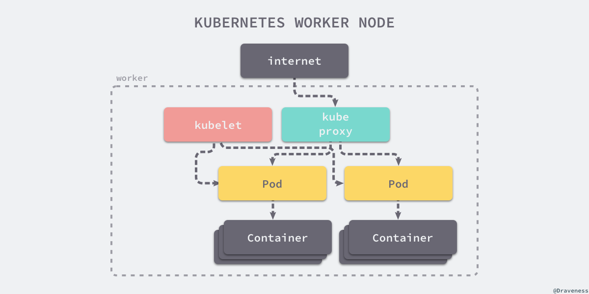
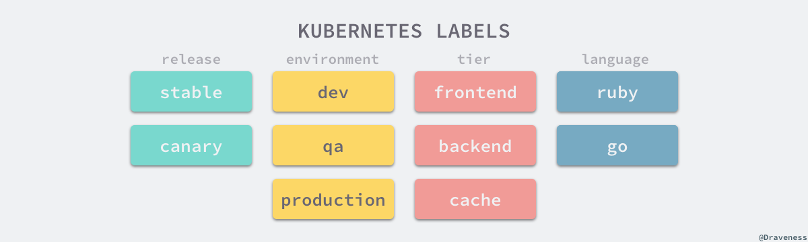
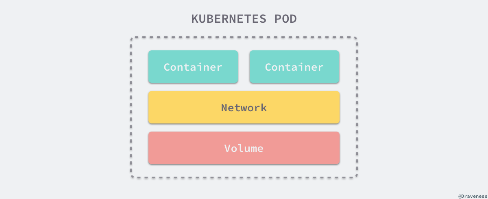

# k8s 原理

来源 1：[谈 Kubernetes 的架构设计与实现原理](https://draveness.me/understanding-kubernetes/)

来源 2：[从 Kubernetes 中的对象谈起](https://draveness.me/kubernetes-object-intro/)

## 一、介绍

作为一个目前在生产环境已经广泛使用的开源项目 Kubernetes 被定义成一个用于自动化部署、扩容和管理容器应用的开源系统；它将一个分布式软件的一组容器打包成一个个更容易管理和发现的逻辑单元。

Kubernetes 是希腊语『舵手』的意思，它最开始由 Google 的几位软件工程师创立，深受公司内部 [Borg](https://ai.google/research/pubs/pub43438) 和 Omega 项目的影响，很多设计都是从 Borg 中借鉴的，同时也对 Borg 的缺陷进行了改进，Kubernetes 目前是 Cloud Native Computing Foundation (CNCF) 的项目并且是很多公司管理分布式系统的解决方案。

在 Kubernetes 统治了容器编排这一领域之前，其实也有很多容器编排方案，例如 [compose](https://github.com/docker/compose) 和 [Swarm](https://github.com/docker/swarm)，但是在运维大规模、复杂的集群时，这些方案基本已经都被 Kubernetes 替代了。

Kubernetes 将已经打包好的应用镜像进行编排，所以如果没有容器技术的发展和微服务架构中复杂的应用关系，其实也很难找到合适的应用场景去使用，所以在这里我们会简单介绍 Kubernetes 的两大『依赖』——容器技术和微服务架构。

### 1、容器技术

Docker 已经是容器技术的事实标准了，作者在前面的文章中 [Docker 核心技术与实现原理](https://draveness.me/docker) 曾经介绍过 Docker 的实现主要依赖于 Linux 的 namespace、cgroups 和 UnionFS。

它让开发者将自己的应用以及依赖打包到一个可移植的容器中，让应用程序的运行可以实现环境无关。

我们能够通过 Docker 实现进程、网络以及挂载点和文件系统隔离的环境，并且能够对宿主机的资源进行分配，这能够让我们在同一个机器上运行多个不同的 Docker 容器，任意一个 Docker 的进程都不需要关心宿主机的依赖，都各自在镜像构建时完成依赖的安装和编译等工作，这也是为什么 Docker 是 Kubernetes 项目的一个重要依赖。

### 2、微服务架构

如果今天的软件并不是特别复杂并且需要承载的峰值流量不是特别多，那么后端项目的部署其实也只需要在虚拟机上安装一些简单的依赖，将需要部署的项目编译后运行就可以了。

但是随着软件变得越来越复杂，一个完整的后端服务不再是单体服务，而是由多个职责和功能不同的服务组成，服务之间复杂的拓扑关系以及单机已经无法满足的性能需求使得软件的部署和运维工作变得非常复杂，这也就使得部署和运维大型集群变成了非常迫切的需求。

### 小结

Kubernetes 的出现不仅主宰了容器编排的市场，更改变了过去的运维方式，不仅将开发与运维之间边界变得更加模糊，而且让 DevOps 这一角色变得更加清晰，每一个软件工程师都可以通过 Kubernetes 来定义服务之间的拓扑关系、线上的节点个数、资源使用量并且能够快速实现水平扩容、蓝绿部署等在过去复杂的运维操作。

## 二、设计


这里将按照顺序分别介绍**声明式、显式接口、无侵入性和可移植性**这几个设计的选择能够为我们带来什么。

### 1、声明式

声明式（Declarative）的编程方式一直都会被工程师们拿来与命令式（Imperative）进行对比，这两者是完全不同的编程方法。我们最常接触的其实是命令式编程，它要求我们描述为了达到某一个效果或者目标所需要完成的指令，常见的编程语言 Go、Ruby、C++ 其实都为开发者了命令式的编程方法，

在 Kubernetes 中，我们可以直接使用 YAML 文件定义服务的拓扑结构和状态：

```yaml
apiVersion: v1
kind: Pod
metadata:
  name: rss-site
  labels:
    app: web
spec:
  containers:
    - name: front-end
      image: nginx
      ports:
        - containerPort: 80
    - name: rss-reader
      image: nickchase/rss-php-nginx:v1
      ports:
        - containerPort: 88
```

这种声明式的方式能够大量地减少使用者的工作量，极大地增加开发的效率，这是因为声明式能够简化需要的代码，减少开发人员的工作，如果我们使用命令式的方式进行开发，虽然在配置上比较灵活，但是带来了更多的工作。

```sql
SELECT * FROM posts WHERE user_id = 1 AND title LIKE 'hello%';
```

SQL 其实就是一种常见的声明式『编程语言』，它能够让开发者自己去指定想要的数据是什么，Kubernetes 中的 YAML 文件也有着相同的原理，我们可以告诉 Kubernetes 想要的最终状态是什么，而它会帮助我们从现有的状态进行迁移。


如果 Kubernetes 采用命令式编程的方式提供接口，那么工程师可能就需要通过代码告诉 Kubernetes 要达到某个状态需要通过哪些操作，相比于更关注状态和结果声明式的编程方式，命令式的编程方式更强调过程。

总而言之，Kubernetes 中声明式的 API 其实指定的是集群期望的运行状态，所以在出现任何不一致问题时，它本身都可以通过指定的 YAML 文件对线上集群进行状态的迁移，就像一个水平触发的系统，哪怕系统错过了相应的事件，最终也会根据当前的状态自动做出做合适的操作。

### 2、显式接口

第二个 Kubernetes 的设计规范其实就是 —— 不存在内部的私有接口，所有的接口都是显示定义的，组件之间通信使用的接口对于使用者来说都是显式的，我们都可以直接调用。

当 Kubernetes 的接口不能满足工程师的复杂需求时，我们需要利用已有的接口实现更复杂的特性，在这时 Kubernetes 的这一设计就不会成为自定义需求的障碍。

### 3、无侵入性

为了尽可能满足用户（工程师）的需求，减少工程师的工作量与任务并增强灵活性，Kubernetes 为工程师提供了无侵入式的接入方式，每一个应用或者服务一旦被打包成了镜像就可以直接在 Kubernetes 中无缝使用，不需要修改应用程序中的任何代码。


Docker 和 Kubernetes 就像包裹在应用程序上的两层，它们两个为应用程序提供了容器化以及编排的能力，在应用程序内部却不需要任何的修改就能够在 Docker 和 Kubernetes 集群中运行，这是 Kubernetes 在设计时选择无侵入带来最大的好处，同时无侵入的接入方式也是目前几乎所有应用程序或者服务都必须考虑的一点。

### 4、可移植性

在微服务架构中，我们往往都会让所有处理业务的服务变成无状态的服务，以前在内存中存储的数据、Session 等缓存，现在都会放到 Redis、ETCD 等数据库中存储，微服务架构要求我们对业务进行拆分并划清服务之间的边界，所以有状态的服务往往会对架构的水平迁移带来障碍。

然而有状态的服务其实是无可避免的，我们将每一个基础服务或者业务服务都变成了一个个只负责计算的进程，但是仍然需要有其他的进程负责存储易失的缓存和持久的数据，Kubernetes 对这种有状态的服务也提供了比较好的支持。

Kubernetes 引入了 `PersistentVolume` 和 `PersistentVolumeClaim` 的概念用来屏蔽底层存储的差异性，目前的 Kubernetes 支持下列类型的 `PersistentVolume`：


这些不同的 `PersistentVolume` 会被开发者声明的 `PersistentVolumeClaim`分配到不同的服务中，对于上层来讲所有的服务都不需要接触 `PersistentVolume`，只需要直接使用 `PersistentVolumeClaim` 得到的卷就可以了。

## 三、架构

Kubernetes 遵循非常传统的客户端服务端架构，客户端通过 RESTful 接口或者直接使用 kubectl 与 Kubernetes 集群进行通信，这两者在实际上并没有太多的区别，后者也只是对 Kubernetes 提供的 RESTful API 进行封装并提供出来。


每一个 Kubernetes 集群都由一组 Master 节点和一系列的 Worker 节点组成，其中 Master 节点主要负责存储集群的状态并为 Kubernetes 对象分配和调度资源。

### 1、Master

作为管理集群状态的 Master 节点，它主要负责接收客户端的请求，安排容器的执行并且运行控制循环，将集群的状态向目标状态进行迁移，Master 节点内部由三个组件构成：API Server、Controller、Scheduler


其中 API Server 负责处理来自用户的请求，其主要作用就是对外提供 RESTful 的接口，包括用于查看集群状态的读请求以及改变集群状态的写请求，也是唯一一个与 etcd 集群通信的组件。

而 Controller 管理器运行了一系列的控制器进程，这些进程会按照用户的期望状态在后台不断地调节整个集群中的对象，当服务的状态发生了改变，控制器就会发现这个改变并且开始向目标状态迁移。

最后的 Scheduler 调度器其实为 Kubernetes 中运行的 Pod 选择部署的 Worker 节点，它会根据用户的需要选择最能满足请求的节点来运行 Pod，它会在每次需要调度 Pod 时执行。

### 2、Worker

Worker 节点实现就相对比较简单了，它主要由 kubelet 和 kube-proxy 两部分组成：



kubelet 是一个节点上的主要服务，它周期性地从 API Server 接受新的或者修改的 Pod 规范并且保证节点上的 Pod 和其中容器的正常运行，还会保证节点会向目标状态迁移，该节点仍然会向 Master 节点发送宿主机的健康状况。

另一个运行在各个节点上的代理服务 kube-proxy 负责宿主机的子网管理，同时也能将服务暴露给外部，其原理就是在多个隔离的网络中把请求转发给正确的 Pod 或者容器。

## 四、重要概念

到现在，我们已经对 Kubernetes 有了一些简单的认识和了解，也大概清楚了 Kubernetes 的架构，在这一小节中我们将介绍 Kubernetes 中的一些重要概念和实现原理。

在 Kubernetes 中，**规格（Spec）和状态（Status）是用于描述 Kubernetes 对象的两个最重要的嵌套对象**。

### 1、对象

Kubernetes 对象是系统中的持久实体，它使用这些对象来表示集群中的状态，这些对象能够描述：


这些对象描述了哪些应用应该运行在集群中，它们请求的资源下限和上限以及重启、升级和容错的策略。每一个创建的对象其实都是我们对集群状态的改变，这些对象描述的其实就是集群的期望状态，Kubernetes 会根据我们指定的期望状态不断检查对当前的集群状态进行迁移。

```go
type Deployment struct {
	metav1.TypeMeta `json:",inline"`
	metav1.ObjectMeta `json:"metadata,omitempty" protobuf:"bytes,1,opt,name=metadata"`

	Spec DeploymentSpec `json:"spec,omitempty" protobuf:"bytes,2,opt,name=spec"`
	Status DeploymentStatus `json:"status,omitempty" protobuf:"bytes,3,opt,name=status"`
}
```

每一个对象都包含两个嵌套对象来描述规格（Spec）和状态（Status），对象的规格其实就是我们期望的目标状态，而状态描述了对象的当前状态，这部分一般由 Kubernetes 系统本身提供和管理，是我们观察集群本身的一个接口。

---

在真正展开介绍对象的规格和状态之前，我们首先需要介绍 Kubernetes 中所有对象都有的三个字段 `apiVersion`、`kind` 和 `metadata`，我们从一个常见的对象描述文件来展开介绍：

```yaml
apiVersion: v1
kind: Pod
metadata:
  name: nginx
  labels:
    name: nginx
spec:
  # ...
```

### 2、API 组和类型

`apiVersion` 和 `kind` 共同决定了当前的 YAML 配置文件应该由谁来进行处理，前者表示描述文件使用的 API 组，后者表示一个 API 组中的一个资源类型，这里的 `v1` 和 `Pod` 表示的就是核心 API 中组 `api/v1` 中的 `Pod` 类型对象。

除了一些 Kubernetes 的核心 API 组和资源之外，还有一些 Kubernetes 官方提供的扩展 API 组 `apis/batch/v1`、`apis/extensions/v1beta1` 等等，除此之外，我们也可以通过 `CustomResourceDefinition` 或者实现 apiserver 来定义新的对象类型。

### 3、元数据

`apiVersion` 和 `kind` 描述了当前对象的一些最根本信息，而 `metadata` 能够为我们提供一些用于唯一识别对象的数据，包括在虚拟集群 `namespace` 中唯一的 `name`字段，用于组织和分类的 `labels` 以及用于扩展功能的注解 `annotations`。

```go
type ObjectMeta struct {
	Name string
	Namespace string
	Labels map[string]string
	Annotations map[string]string
	// ...
}
```

上述的结构体嵌入在 Kubernetes 的每一个对象中，为所有的对象提供类似命名、命名空间、标签和注解等最基本的支持，让开发者能够更好地管理 Kubernetes 集群。

#### 1）标签和选择器

每一个 Kubernetes 对象都可以被打上多个标签，这些标签可以作为过滤项帮助我们选择和管理集群内部的 Kubernetes 对象，下面的命令可以获取到生产环境中的所有前端项目：

```bash
kubectl get pods -l environment=production,tier=frontend
```

除了使用 kubectl 直接与 Kubernetes 集群通信获取其中的对象信息之外，我们也可以在 YAML 文件中使用选择器来达到相同的效果：

```yaml
selector:
  matchLabels:
    environment: production
    tier: frontend
```

标签的主要作用就是对 Kubernetes 对象进行分类，这里我们可以简单给一些常见的分类方法：



这些标签能够帮助我们在复杂的集群中快速选择一系列的 Kubernetes 对象，用好标签能够为管理集群带来非常大的帮助。

#### 2）命名空间

Kubernetes 支持通过命名空间在一个物理集群中划分出多个虚拟集群，这些虚拟集群就是单独的命名空间。不同的命名空间可以对资源进行隔离，它们没有办法直接使用 `name` 访问其他命名空间的服务，而是需要使用 FQDN(fully qualified domain name)。

也就是说当我们创建一个 Service 时，它实际上在集群中加入了类似 `<service>.<namespace>.svc.cluster.local` 的 DNS 记录，在同一个命名空间中，我们可以直接使用 `service` 来访问目标的服务，但是在访问其他命名空间中的服务时却没有办法这么做。

### 4、对象接口

Kubernetes 中的对象其实并不是 `struct`，而是一个 `interface`，其中定义了一系列的 Getter/Setter 接口：

```go
type Object interface {
	GetNamespace() string
	SetNamespace(namespace string)
	GetName() string
	SetName(name string)
	GetGenerateName() string
	SetGenerateName(name string)
	GetUID() types.UID
	SetUID(uid types.UID)
	// ...
}
```

这些 Getter/Setter 接口获取的字段基本都是 `ObjectMeta` 结构体中定义的一些字段，这也是为什么 Kubernetes 对象都需要嵌入一个 `ObjectMeta` 结构体。

### 5、Spec

对象的规格（Spec）描述了某一个实体的期望状态，每一个对象的 Spec 基本都是由开发或者维护当前对象的工程师指定的，以下面的 busybox 举例：

```yaml
apiVersion: v1
kind: Pod
metadata:
  name: busybox
  labels:
    app: busybox
spec:
  containers:
  - image: busybox
    command:
      - sleep
      - "3600"
    imagePullPolicy: IfNotPresent
    name: busybox
  restartPolicy: Always
```

作为一个 Pod 对象，它其实就是一个在 Kubernetes 中运行的最小、最简单的单元，所以它的 Spec 声明的就是其中包含的容器以及容器的镜像、启动命令等信息。

但是另一种对象 Service 就有着完全不同的 Spec 参数，作为一个一组 Pod 访问方式的抽象，它需要指定流量转发的 Pod 以及目前的端口号：

```yaml
kind: Service
apiVersion: v1
metadata:
  name: nginx
spec:
  selector:
    app: nginx
  ports:
  - protocol: TCP
    port: 80
    targetPort: 80
```

我们可以看出，不同的 Kubernetes 对象基本上有着完全不同的 Spec，接下来我们按照 Kubernetes 项目中的源代码分别介绍如何描述几种不同的 Kubernetes 对象。

#### Pod

Pod 是 Kubernetes 中最基本的概念，它也是 Kubernetes 对象模型中我们可以创建或者部署的最小并且最简单的单元。



它将应用的容器、存储资源以及独立的网络 IP 地址等资源打包到了一起，表示一个最小的部署单元，但是每一个 Pod 中的运行的容器可能不止一个，这是因为 Pod 最开始设计时就能够在多个进程之间进行协调，构建一个高内聚的服务单元，这些容器能够共享存储和网络，非常方便地进行通信。

作为一个 Kubernetes 对象，结构体 `Pod` 中嵌入了 `metav1.TypeMeta` 和 `metav1.ObjectMeta` 两个结构，这两个结构体中包含了 `Object` 接口中需要的函数：

```go
type Pod struct {
	metav1.TypeMeta `json:",inline"`
	metav1.ObjectMeta `json:"metadata,omitempty" protobuf:"bytes,1,opt,name=metadata"`
	Spec PodSpec `json:"spec,omitempty" protobuf:"bytes,2,opt,name=spec"`
	Status PodStatus `json:"status,omitempty" protobuf:"bytes,3,opt,name=status"`
}

type PodSpec struct {
	InitContainers []Container `json:"initContainers,omitempty" patchStrategy:"merge" patchMergeKey:"name" protobuf:"bytes,20,rep,name=initContainers"`
	Containers []Container `json:"containers" patchStrategy:"merge" patchMergeKey:"name" protobuf:"bytes,2,rep,name=containers"`
	RestartPolicy RestartPolicy `json:"restartPolicy,omitempty" protobuf:"bytes,3,opt,name=restartPolicy,casttype=RestartPolicy"`
	// ...
}
```

`Pod` 结构体中的 `PodSpec` 就是我们在 YAML 文件中定义的嵌套对象了，由于该结构体非常复杂（加上注释有 180 行），在这一节中我们只会简单介绍其中的几个字段。

`InitContainers` 是当前 Pod 启动时需要首先执行的一系列容器，这些容器没有生命周期，也没有探针，它们的主要作用就是在容器启动时进行一些资源和依赖的初始化配置；接下来的 `Containers` 数组就是 Pod 正常运行时包含的一系列容器了，这些容器会共享网络和进程，运行在同一个『虚拟机』上，所以也可以相互通信。

最后的 `RestartPolicy` 其实就整个 Pod 的重启策略，我们可以选择不重启 `Never`、在出现错误时重启 `OnFailure` 或者总是重启 `Always`。

#### Service

Kubernetes 中另一个常见对象 Service 的规格就有很大的不同了，虽然他们两者有着完全相同的嵌入结构 `metav1.TypeMeta` 和 `metav1.ObjectMeta` 以及字段 `Spec` 和 `Status`，但是它们的规格和状态却完全不同：

```go
type Service struct {
	metav1.TypeMeta `json:",inline"`
	metav1.ObjectMeta `json:"metadata,omitempty" protobuf:"bytes,1,opt,name=metadata"`
	Spec ServiceSpec `json:"spec,omitempty" protobuf:"bytes,2,opt,name=spec"`
	Status ServiceStatus `json:"status,omitempty" protobuf:"bytes,3,opt,name=status"`
}

type ServiceSpec struct {
	Ports []ServicePort `json:"ports,omitempty" patchStrategy:"merge" patchMergeKey:"port" protobuf:"bytes,1,rep,name=ports"`
	Selector map[string]string `json:"selector,omitempty" protobuf:"bytes,2,rep,name=selector"`
	// ...
}
```

Service 都会通过选择器 `Selector` 将流量导入对应的 Pod 的指定 `Ports` 端口，这两个字段也是使用 Service 时最常用的两个字段，前者能够根据 Pod 的标签选择 Service 背后的一组 Pod，而 `Ports` 会将端口的流量转发到目标 Pod 的指定端口上。

#### 小结

Kubernetes 中对象的 Spec 其实描述了对象的期望状态，也就是工程师直接指定运行在 Kubernetes 集群中对象的表现和行为，同时 Kubernetes 会通过控制器不断帮助对象向期望状态迁移。

### 6、Status

对于很多使用 Kubernetes 的工程师来说，它们都会对对象的 Spec 比较了解，但是很多人都不太会了解对象的状态（Status）；对象的 Spec 是工程师向 Kubernetes 描述期望的集群状态，而 Status 其实就是 Kubernetes 集群对外暴露集群内对象运行状态的一个接口：

```yaml
apiVersion: v1
kind: Pod
metadata:
  // ...
spec:
  // ...
status:
  conditions:
  - lastProbeTime: null
    lastTransitionTime: 2018-12-09T02:40:37Z
    status: "True"
    type: Initialized
  - lastProbeTime: null
    lastTransitionTime: 2018-12-09T02:40:38Z
    status: "True"
    type: Ready
  - lastProbeTime: null
    lastTransitionTime: 2018-12-09T02:40:33Z
    status: "True"
    type: PodScheduled
  containerStatuses:
  - containerID: docker://99f668a89db97342d7bd603471dfad5be262d7708b48cb6c5c8e374e9a13cf4f
    image: busybox:latest
    imageID: docker-pullable://busybox@sha256:915f390a8912e16d4beb8689720a17348f3f6d1a7b659697df850ab625ea29d5
    lastState: {}
    name: busybox
    ready: true
    restartCount: 0
    state:
      running:
        startedAt: 2018-12-09T02:40:37Z
  hostIP: 10.128.0.18
  phase: Running
  podIP: 10.4.0.28
  qosClass: Burstable
  startTime: 2018-12-09T02:40:33Z
```

当我们将对象运行到 Kubernetes 集群中时，Kubernetes 会将 Pod 的运行信息展示到 Status 上，接下来我们分别介绍 Pod 和 Service 的 Status 都包含哪些数据。

#### Pod

每一个 Pod 的 Status 其实包含了阶段、当前服务状态、宿主机和 Pod IP 地址以及其中内部所有容器的状态信息：

```go
type PodStatus struct {
	Phase PodPhase `json:"phase,omitempty" protobuf:"bytes,1,opt,name=phase,casttype=PodPhase"`
	Conditions []PodCondition `json:"conditions,omitempty" patchStrategy:"merge" patchMergeKey:"type" protobuf:"bytes,2,rep,name=conditions"`
	Message string `json:"message,omitempty" protobuf:"bytes,3,opt,name=message"`
	Reason string `json:"reason,omitempty" protobuf:"bytes,4,opt,name=reason"`
	HostIP string `json:"hostIP,omitempty" protobuf:"bytes,5,opt,name=hostIP"`
	PodIP string `json:"podIP,omitempty" protobuf:"bytes,6,opt,name=podIP"`
	StartTime *metav1.Time `json:"startTime,omitempty" protobuf:"bytes,7,opt,name=startTime"`
	InitContainerStatuses []ContainerStatus `json:"initContainerStatuses,omitempty" protobuf:"bytes,10,rep,name=initContainerStatuses"`
	ContainerStatuses []ContainerStatus `json:"containerStatuses,omitempty" protobuf:"bytes,8,rep,name=containerStatuses"`
	// ...
}
```

上述的信息中，`PodCondition` 数组包含了一系列关于当前 Pod 状态的详情，其中包含了 Pod 处于当前状态的类型和原因以及 Kubernetes 获取该信息的时间；而另一个比较重要的 `ContainerStatus` 结构体中包含了容器的镜像、重启次数等信息。

#### Service

Service 的状态其实就更加的简单了，只有在当前的 Service 类型是 LoadBalancer 的时候 `Status` 字段才不会为空：

```go
type ServiceStatus struct {
	LoadBalancer LoadBalancerStatus `json:"loadBalancer,omitempty" protobuf:"bytes,1,opt,name=loadBalancer"`
}

type LoadBalancerStatus struct {
	Ingress []LoadBalancerIngress `json:"ingress,omitempty" protobuf:"bytes,1,rep,name=ingress"`
}

type LoadBalancerIngress struct {
	IP string `json:"ip,omitempty" protobuf:"bytes,1,opt,name=ip"`
	Hostname string `json:"hostname,omitempty" protobuf:"bytes,2,opt,name=hostname"`
}
```

其中可能会包含为当前负载均衡分配的 IP 地址或者 Hostname，并不会包含更加复杂的数据了。

#### 小结

Kubernetes 对象的 Status 不仅能够用来观察目前集群中对象的运行状态，还能帮助我们对集群中出现的问题进行排查以及修复，并能提供一些信息辅助优化集群中资源的利用率，我们在使用 Kubernetes 对象时也应该多多关注集群内的对象 Status 字段。

### 7、控制器

最后要介绍的就是 Kubernetes 中的控制器，它们其实是用于创建和管理 Pod 的实例，能够在集群的层级提供复制、发布以及健康检查的功能，这些控制器其实都运行在 Kubernetes 集群的主节点上。

在 Kubernetes 的 [kubernetes/pkg/controller/](https://github.com/kubernetes/kubernetes/tree/master/pkg/controller) 目录中包含了官方提供的一些常见控制器，我们可以通过下面这个函数看到所有需要运行的控制器：

```go
func NewControllerInitializers(loopMode ControllerLoopMode) map[string]InitFunc {
	controllers := map[string]InitFunc{}
	controllers["endpoint"] = startEndpointController
	controllers["replicationcontroller"] = startReplicationController
	controllers["podgc"] = startPodGCController
	controllers["resourcequota"] = startResourceQuotaController
	controllers["namespace"] = startNamespaceController
	controllers["serviceaccount"] = startServiceAccountController
	controllers["garbagecollector"] = startGarbageCollectorController
	controllers["daemonset"] = startDaemonSetController
	controllers["job"] = startJobController
	controllers["deployment"] = startDeploymentController
	controllers["replicaset"] = startReplicaSetController
	controllers["horizontalpodautoscaling"] = startHPAController
	controllers["disruption"] = startDisruptionController
	controllers["statefulset"] = startStatefulSetController
	controllers["cronjob"] = startCronJobController
	// ...

	return controllers
}
```

这些控制器会随着控制器管理器的启动而运行，它们会监听集群状态的变更来调整集群中的 Kubernetes 对象的状态，在后面的文章中我们会展开介绍一些常见控制器的实现原理。

## Reference

- [Large-scale cluster management at Google with Borg](https://ai.google/research/pubs/pub43438)
- [Production-Grade Container Orchestration](https://kubernetes.io/)
- [Borg, Omega, and Kubernetespo](https://ai.google/research/pubs/pub44843)
- [Kubernetes Design and Development Explained](https://thenewstack.io/kubernetes-design-and-development-explained/)
- [2018 is the year of Kubernetes – with some help from Docker](https://www.dynatrace.com/news/blog/2018-year-of-kubernetes-with-help-from-docker/?utm_source=tuicool&utm_medium=referral)
- [Introduction to Kubernetes Architecture](https://x-team.com/blog/introduction-kubernetes-architecture/)
- [Setting up highly available Kubernetes clusters](https://elastisys.com/wp-content/uploads/2018/01/kubernetes-ha-setup.pdf?x83281)
- [Understanding Kubernetes Objects](https://kubernetes.io/docs/concepts/overview/working-with-objects/kubernetes-objects/)


- [Understanding Kubernetes Objects](https://kubernetes.io/docs/concepts/overview/working-with-objects/kubernetes-objects/)
- [Kubernetes Object Management](https://kubernetes.io/docs/concepts/overview/object-management-kubectl/overview/)
- [API Conventions · Kubernetes](https://github.com/kubernetes/community/blob/master/contributors/devel/api-conventions.md#objects)