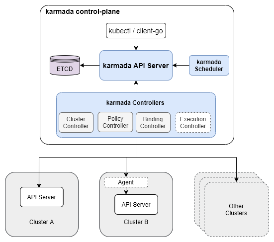
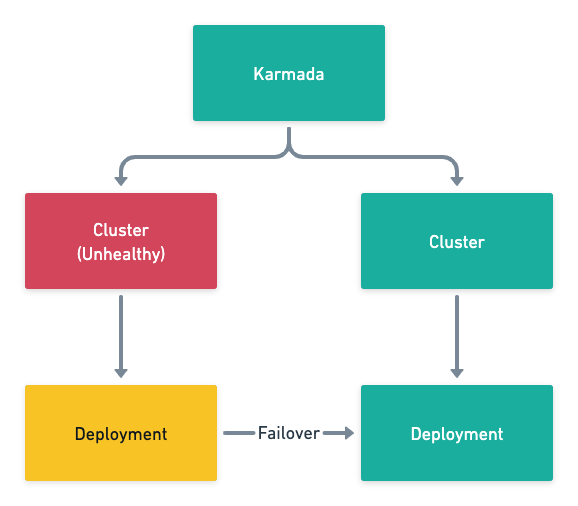

# Kubernetes 集群联邦和资源分发

来源：[Kubernetes、集群联邦和资源分发](https://draveness.me/kuberentes-federation/)

ubernetes 从比较早的版本就声称单机群可以支持 5,000 节点，而且也没有计划在短期内提高单个 Kubernetes 集群支撑的节点数，如果需要在 Kubernetes 中支持 5,000 以上的节点，更推荐使用集群联邦（Federation）的方式。

> People frequently ask how far we are going to go in improving Kubernetes scalability. Currently we do not have plans to increase scalability beyond 5000-node clusters (within our SLOs) in the next few releases. If you need clusters larger than 5000 nodes, we recommend to use federation to aggregate multiple Kubernetes clusters.[1](https://draveness.me/kuberentes-federation/#fn:1)

对云服务稍微熟悉一点的读者朋友应该都知道可用区（Available Zone、AZ）的概念，我们在使用 AWS、谷歌云等服务提供的实例时，需要选择实例所在的区域以及可用区。区域（Region）是地理上的概念，以 AWS 为例，它在北京和宁夏都有数据中心，每个数据中心都有 3 个可用区。

作为云服务厂商提供的 AZ，每个 AZ 可能会包含几万、甚至十几万节点，想使用单个集群管理这种规模的节点数量是非常困难的，所以管理多个集群成为了该规模下必须面对的问题。

集群联邦听起来是一种非常高端的技术，但是实际上我们可以将它理解成更灵活、易用的多集群。当我们仅仅提到多个集群时，这些集群更像是一些独立的孤岛，彼此之间没有太多的联系，但是联邦集群将这些独立的集群『打包』成了一个整体，上层的用户不需要关心集群这一层级。

**多集群和集群联邦**


联邦集群引入的新的控制面板需要两个比较重要的功能：跨集群的服务发现和跨集群的调度。其中，跨集群服务发现打通了多个集群的网络，让请求可以跨越不同集群的边界；而跨集群调度可以保证服务的稳定性以及可用性。

在这篇文章中，我们将以 [kubefed](https://github.com/kubernetes-sigs/kubefed) 和 [karmada](https://github.com/karmada-io/karmada) 两个集群联邦项目为例介绍集群联邦可能遇到的问题，多个项目的对比也能让我们清晰地意识到不同设计选择带来的影响。

## 一、[kubefed](https://github.com/kubernetes-sigs/kubefed)

[kubefed](https://github.com/kubernetes-sigs/kubefed) 是个非常老牌的 Kubernetes 集群联邦项目，这个项目目前就挂在官方的仓库下，由官方的多集群兴趣小组开发，到今天已经将近四年了。从这个项目的年头来看，Kubernetes 集群联邦已经是一个非常老的话题了，但是到今天也没有比较完美的解决方案。

**kubefed 架构**


所有集群联邦的方案都需要我们把资源从管理集群同步资源到联邦集群，传播（Propagation）是该项目引入的一个术语，它会将宿主集群中的资源分配到所有的联邦集群中。这个机制会需要引入以下三个概念：Templates、Placement 和 Overrides：


其中 Template 中定义了该资源的一些基本信息，以 Deployment 为例，可能包含部署的容器镜像、环境变量以及实例数等信息；Placement 决定该资源需要部署在哪些集群中，如上图所示，该资源会部署在 Cluster1、Cluster2 两个集群中；最后的 Override 是会覆写原有 Template 中的资源，以满足当前集群的一些特定需求，例如实例数、拉镜像使用的秘钥等与集群有关的属性。

在具体的实现上，kubefed 选择为集群中的所有资源生成对应的联邦资源，例如 Deployment 和对应的 FederatedDeployment。联邦资源中的 `spec` 字段存储了 Deployment 资源的模板，而 `overrides` 中定义了资源同步到不同集群时需要做的变更。

```yaml
kind: FederatedDeployment
...
spec:
  ...
  overrides:
  # Apply overrides to cluster1
    - clusterName: cluster1
      clusterOverrides:
        # Set the replicas field to 5
        - path: "/spec/replicas"
          value: 5
        # Set the image of the first container
        - path: "/spec/template/spec/containers/0/image"
          value: "nginx:1.17.0-alpine"
        # Ensure the annotation "foo: bar" exists
        - path: "/metadata/annotations"
          op: "add"
          value:
            foo: bar
        # Ensure an annotation with key "foo" does not exist
        - path: "/metadata/annotations/foo"
          op: "remove"
        # Adds an argument `-q` at index 0 of the args list
        # this will obviously shift the existing arguments, if any
        - path: "/spec/template/spec/containers/0/args/0"
          op: "add"
          value: "-q"
```

联邦集群的控制平面会根据上述 FederatedDeployment 为不同的集群分别生成对应的 Deployment 并推送到下层管理的联邦集群中，这也是集群联邦 kubefed 解决的主要问题。

从理论上讲，所有的集群联邦组件只要实现了**定义模板**和**覆写字段**的能力就满足了全部需求，然而在实际应用上，不同的方案也会提供一些类似语法糖的特性帮助我们更好的在不同集群之间实现更复杂的资源分发能力。kubefed 提供了 ReplicaSchedulingPreference[2](https://draveness.me/kuberentes-federation/#fn:2) 在不同集群中实现更加智能的分发策略：

```yaml
apiVersion: scheduling.kubefed.io/v1alpha1
kind: ReplicaSchedulingPreference
metadata:
  name: test-deployment
  namespace: test-ns
spec:
  targetKind: FederatedDeployment
  totalReplicas: 9
  clusters:
    A:
      minReplicas: 4
      maxReplicas: 6
      weight: 1
    B:
      minReplicas: 4
      maxReplicas: 8
      weight: 2
```

上述调度的策略可以实现工作负载在不同集群之间的权重，在集群资源不足甚至出现问题时将实例迁移到其他集群，这样既能够提高服务部署的灵活性和可用性，基础架构工程师也可以更好地平衡多个集群的负载。

kubefed 在较早的版本中还是包含跨集群的服务发现功能的，但是在最新的分支中已经将与服务发现的相关功能都移除了，这可能也是因为跨集群的服务发现功能非常复杂，社区中目前已经有很多第三方的工具可以提供基于 DNS 的联邦 Ingress 资源，不需要 kubefed 的支持[3](https://draveness.me/kuberentes-federation/#fn:3)。

## 二、[karmada](https://github.com/karmada-io/karmada)

Kubefed 虽然是 Kubernetes 社区早期的集群联邦项目，虽然已经经历了比较长的时间，但是一直都处于实验阶段，到今天项目基本也陷入停止维护的状态。Karmada 是对 Kubefed 项目的延续，它继承了来自 kubefed 中的一些概念，目前也处于积极开发和维护中，这也是目前社区中比较活跃和成熟的集群联邦项目。

> Notice: this project is developed in continuation of Kubernetes Federation v1 and v2. Some basic concepts are inherited from these two versions.[4](https://draveness.me/kuberentes-federation/#fn:4)

**Karmada 架构**



Karmada 这种多级的集群管理都是天然的树形结构，如上图所示，根节点上的 Karmada 控制面板主要包含三个主要组件，API Server、Controller Manager 和 Scheduler，相信了解 Kubernetes 控制面板的读者应该都可以想象到这三个不同组件的作用。

需要注意的是 Karmada 的 Controller Manager 中不包含 Kubernetes Controller Manager 中控制器，如果我们在 Karmada 集群中创建了 Deployment 资源，Karmada 的控制面也不会根据 Deployment 创建 Pod，它只负责 Karmada 原生 CRD 的同步和管理工作，包括 Cluster、PropagationPolicy、ResourceBinding 和 Work 资源。

**Karmada 概念**


正如我们在上面提到的，Karmada 中的概念也几乎全盘继承自 Kubefed，我们可以根据上图总结出 Karmada 将资源模板转换成成员集群的资源需要经过以下几个步骤：

1. Deployment、Service、ConfigMap 等资源模板经过 PropagationPolicy 生成一组 ResourceBinding，每个 ResourceBinding 都对应特定的成员集群；
2. ResourceBinding 根据 OverridePolicy 改变一些资源以适应的不同成员集群，例如：集群名等参数，这些资源定义会存储在 Work 对象中；
3. Work 对象中存储的资源定义会被提交到成员集群中，成员集群中的 Controller Manager 等控制面板组件会负责这些资源的处理，例如：根据 Deployment 创建 Pod 等。

```yaml
# propagationpolicy.yaml
apiVersion: policy.karmada.io/v1alpha1
kind: PropagationPolicy
metadata:
  name: example-policy
spec:
  resourceSelectors:
    - apiVersion: apps/v1
      kind: Deployment
      name: nginx
  placement:
    clusterAffinity:
      clusterNames:
        - member1

# overridepolicy.yaml
apiVersion: policy.karmada.io/v1alpha1
kind: OverridePolicy
metadata:
  name: example-override
  namespace: default
spec:
  resourceSelectors:
    - apiVersion: apps/v1
      kind: Deployment
      name: nginx
  overrideRules:
    - targetCluster:
        clusterNames:
          - member1
      overriders:
        plaintext:
          - path: "/metadata/annotations"
            operator: add
            value:
              foo: bar
```

Karmada 与 Kubefed 的概念是非常相似的，它们都需要在 API 中解决两个问题：**资源模板应该部署到哪个集群中、资源模板在该集群中需要实现做哪些特定变更**。上述两个问题是『模板实例化』的过程中一定会面对的，而 Kubefed 和 Karmada 两个组件也选择了不同的接口：

**Kubefed 和 Karmada API 对比**


- Kubefed 为所有的 Kubernetes 原生资源创建了对应的联邦资源，例如 Deployment 和 FederatedDeployment，Placement 和 Override 的定义都包含在新的 FederatedDeployment 中；
- Karmada 保留了 Kubernetes 的全部原生资源，同时引入新的 PropagationPolicy 和 OverridePolicy；

上述两种方案各有优缺点，创建对应资源可以将全部的定义整合在一起，但是如果在集群中引入了新的自定义资源（Custom Resource）需要引入额外的工作；创建独立的 PropagationPolicy 和 OverridePolicy 可以简化引入新资源需要的步骤，但是可能需要额外的看板才能看到资源模板最终生成的资源。

在该场景下，作者更倾向于 Karmada 的做法，因为随着 Kubernetes 中资源种类的增加，使用 PropagationPolicy 和 OverridePolicy 能够降低集群的维护成本，我们不需要为每一个新的资源创建联邦类型的映射，而引入额外的看板展示最终生成的资源也不是不能接受的成本。

> 需要注意的是，我们在 Karmada 控制面只会分发 Deployment 等『高级』资源，管理集群中的 Controller Manager 不会根据 Deployment 创建 Pod，这样才能减轻控制面的压力，实现多集群联邦的管理。

除了资源的分发之外，Karmada 还在 PropagationPolicy 加入 replicaScheduling 字段管理工作负载实例的分发，能够提供故障转移和按照权重分发的功能：

```yaml
# duplicated.yaml
replicaScheduling:
  replicaSchedulingType: Duplicated

# divided.yaml
replicaScheduling:
  replicaDivisionPreference: Weighted
  replicaSchedulingType: Divided
  weightPreference:
    staticWeightList:
      - targetCluster:
          clusterNames:
            - member1
        weight: 1
      - targetCluster:
          clusterNames:
            - member2
        weight: 2
```

**Karmada 故障转移**



Karmada 的调度器需要解决工作负载**调度到哪里**和**调度多少**的问题，与更细粒度的 Kubernetes 的调度器相比，这是一种粒度较粗的调度，因为上下文的不足，它不需要也没有办法保证调度的全局最优解，而提供跨集群的部署和故障转移就已经可以满足常见的需求了。

## 总结

**集群的联邦主要解决的还是两个问题，单集群的扩展性、跨可用区（地域、云）的集群管理**。在一个单个集群可以做到 100k 节点的系统中，我们几乎听不到联邦这一概念，如果 Kubernetes 集群的控制面足够强大、能够承担足够多的压力，那么多集群和集群联邦的概念在社区中也不会特别热门。随着 Kubernetes 项目逐渐走入成熟，Pipeline、联邦和集群管理这些细分领域也都会逐渐完善，相信我们会逐渐在社区中看到成熟的联邦集群解决方案。

## Reference

- 谈谈 Kubernetes 的问题和局限性 https://draveness.me/kuberentes-limitations/
- KEP-1645: Multi-Cluster Services API https://github.com/kubernetes/enhancements/tree/master/keps/sig-multicluster/1645-multi-cluster-services-api

------

1. Scalability updates in Kubernetes 1.6: 5,000 node and 150,000 pod clusters https://kubernetes.io/blog/2017/03/scalability-updates-in-kubernetes-1-6/ [↩︎](https://draveness.me/kuberentes-federation/#fnref:1)
2. https://github.com/kubernetes-sigs/kubefed/blob/master/docs/userguide.md#replicaschedulingpreference[↩︎](https://draveness.me/kuberentes-federation/#fnref:2)
3. kubefed: remove FederatedIngress feature #1284 https://github.com/kubernetes-sigs/kubefed/issues/1284 [↩︎](https://draveness.me/kuberentes-federation/#fnref:3)
4. https://github.com/karmada-io/karmada#why-karmada [↩︎](https://draveness.me/kuberentes-federation/#fnref:4)