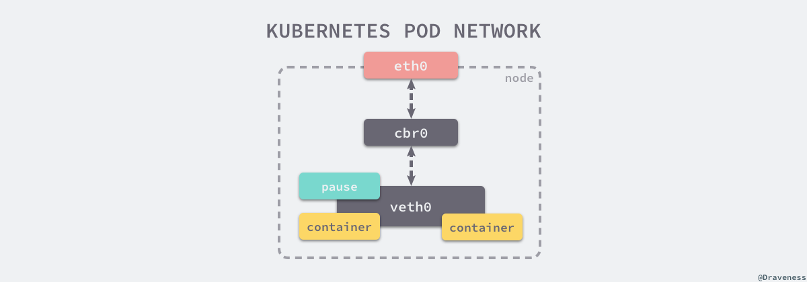

# 详解 Kubernetes Pod 的实现原理

来源：[详解 Kubernetes Pod 的实现原理](https://draveness.me/kubernetes-pod/)

Pod、Service、Volume 和 Namespace 是 Kubernetes 集群中四大基本对象，它们能够表示系统中部署的应用、工作负载、网络和磁盘资源，共同定义了集群的状态。Kubernetes 中很多其他的资源其实只对这些基本的对象进行了组合。


Pod 是 Kubernetes 集群中能够被创建和管理的最小部署单元，想要彻底和完整的了解 Kubernetes 的实现原理，我们必须要清楚 Pod 的实现原理以及最佳实践。

在这里，我们将分两个部分对 Pod 进行解析，第一部分主要会从概念入手介绍 Pod 中必须了解的特性，而第二部分会介绍 Pod 从创建到删除的整个生命周期内的重要事件在源码层面是如何实现的。

## 一、概述

作为 Kubernetes 集群中的基本单元，Pod 就是最小并且最简单的 Kubernetes 对象，这个简单的对象其实就能够独立启动一个后端进程并在集群的内部为调用方提供服务。在上一篇文章 [从 Kubernetes 中的对象谈起](https://draveness.me/kubernetes-object-intro) 中，我们曾经介绍过简单的 Kubernetes Pod 是如何使用 YAML 进行描述的：

```yaml
apiVersion: v1
kind: Pod
metadata:
  name: busybox
  labels:
    app: busybox
spec:
  containers:
  - image: busybox
    command:
      - sleep
      - "3600"
    imagePullPolicy: IfNotPresent
    name: busybox
  restartPolicy: Always
```

这个 YAML 文件描述了一个 Pod 启动时运行的容器和命令以及它的重启策略，在当前 Pod 出现错误或者执行结束后是否应该被 Kubernetes 的控制器拉起来，除了这些比较显眼的配置之外，元数据 `metadata` 的配置也非常重要，`name` 是当前对象在 Kubernetes 集群中的唯一标识符，而标签 `labels` 可以帮助我们快速选择对象。

在同一个 Pod 中，有几个概念特别值得关注，首先就是容器，在 Pod 中其实可以同时运行一个或者多个容器，这些容器能够共享网络、存储以及 CPU、内存等资源。在这一小节中我们将关注 Pod 中的容器、卷和网络三大概念

### 1、容器

每一个 Kubernetes 的 Pod 其实都具有两种不同的容器，两种不同容器的职责其实十分清晰，一种是 `InitContainer`，这种容器会在 Pod 启动时运行，主要用于初始化一些配置，另一种是 Pod 在 Running 状态时内部存活的 `Container`，它们的主要作用是对外提供服务或者作为工作节点处理异步任务等等。


通过对不同容器类型的命名我们也可以看出，`InitContainer` 会比 `Container`优先启动，在 `kubeGenericRuntimeManager.SyncPod` 方法中会先后启动两种容器。

```go
func (m *kubeGenericRuntimeManager) SyncPod(pod *v1.Pod, _ v1.PodStatus, podStatus *kubecontainer.PodStatus, pullSecrets []v1.Secret, backOff *flowcontrol.Backoff) (result kubecontainer.PodSyncResult) {
	// Step 1: Compute sandbox and container changes.
	// Step 2: Kill the pod if the sandbox has changed.
	// Step 3: kill any running containers in this pod which are not to keep.
	// Step 4: Create a sandbox for the pod if necessary.
	// ...

	// Step 5: start the init container.
	if container := podContainerChanges.NextInitContainerToStart; container != nil {
		msg, _ := m.startContainer(podSandboxID, podSandboxConfig, container, pod, podStatus, pullSecrets, podIP, kubecontainer.ContainerTypeInit)
	}

	// Step 6: start containers in podContainerChanges.ContainersToStart.
	for _, idx := range podContainerChanges.ContainersToStart {
		container := &pod.Spec.Containers[idx]
		
		msg, _ := m.startContainer(podSandboxID, podSandboxConfig, container, pod, podStatus, pullSecrets, podIP, kubecontainer.ContainerTypeRegular)
	}

	return
}
```

通过分析私有方法 `startContainer` 的实现我们得出：容器的类型最终只会影响在 Debug 时创建的标签，所以对于 Kubernetes 来说两种容器的启动和执行也就只有顺序先后的不同。

### 2、卷

每一个 Pod 中的容器是可以通过 [卷（Volume）](https://draveness.me/kubernetes-volume) 的方式共享文件目录的，这些 Volume 能够存储持久化的数据；在当前 Pod 出现故障或者滚动更新时，对应 Volume 中的数据并不会被清除，而是会在 Pod 重启后重新挂载到期望的文件目录中：


kubelet.go 文件中的私有方法 `syncPod` 会调用 `WaitForAttachAndMount` 方法为等待当前 Pod 启动需要的挂载文件：

```go
func (vm *volumeManager) WaitForAttachAndMount(pod *v1.Pod) error {
	expectedVolumes := getExpectedVolumes(pod)
	uniquePodName := util.GetUniquePodName(pod)

	vm.desiredStateOfWorldPopulator.ReprocessPod(uniquePodName)

	wait.PollImmediate(
		podAttachAndMountRetryInterval,
		podAttachAndMountTimeout,
		vm.verifyVolumesMountedFunc(uniquePodName, expectedVolumes))

	return nil
}
```

我们会在 [后面的章节](https://draveness.me/kubernetes-volume) 详细地介绍 Kubernetes 中卷的创建、挂载是如何进行的，在这里我们需要知道的是卷的挂载是 Pod 启动之前必须要完成的工作：

```go
func (kl *Kubelet) syncPod(o syncPodOptions) error {
	// ...

	if !kl.podIsTerminated(pod) {
		kl.volumeManager.WaitForAttachAndMount(pod)
	}

	pullSecrets := kl.getPullSecretsForPod(pod)

	result := kl.containerRuntime.SyncPod(pod, apiPodStatus, podStatus, pullSecrets, kl.backOff)
	kl.reasonCache.Update(pod.UID, result)

	return nil
}
```

在当前 Pod 的卷创建完成之后，就会调用上一节中提到的 `SyncPod` 公有方法继续进行同步 Pod 信息和创建、启动容器的工作。

### 3、网络

同一个 Pod 中的多个容器会被共同分配到同一个 Host 上并且共享网络栈，也就是说这些 Pod 能够通过 localhost 互相访问到彼此的端口和服务，如果使用了相同的端口也会发生冲突，同一个 Pod 上的所有容器会连接到同一个网络设备上，这个网络设备就是由 Pod Sandbox 中的沙箱容器在 `RunPodSandbox` 方法中启动时创建的：

```go
func (ds *dockerService) RunPodSandbox(ctx context.Context, r *runtimeapi.RunPodSandboxRequest) (*runtimeapi.RunPodSandboxResponse, error) {
	config := r.GetConfig()

	// Step 1: Pull the image for the sandbox.
	image := defaultSandboxImage

	// Step 2: Create the sandbox container.
	createConfig, _ := ds.makeSandboxDockerConfig(config, image)
	createResp, _ := ds.client.CreateContainer(*createConfig)

	resp := &runtimeapi.RunPodSandboxResponse{PodSandboxId: createResp.ID}

	ds.setNetworkReady(createResp.ID, false)

	// Step 3: Create Sandbox Checkpoint.
	ds.checkpointManager.CreateCheckpoint(createResp.ID, constructPodSandboxCheckpoint(config))

	// Step 4: Start the sandbox container.
	ds.client.StartContainer(createResp.ID)

	// Step 5: Setup networking for the sandbox.
	cID := kubecontainer.BuildContainerID(runtimeName, createResp.ID)
	networkOptions := make(map[string]string)
	ds.network.SetUpPod(config.GetMetadata().Namespace, config.GetMetadata().Name, cID, config.Annotations, networkOptions)

	return resp, nil
}
```

沙箱容器其实就是 `pause` 容器，上述方法引用的 `defaultSandboxImage` 其实就是官方提供的 `k8s.gcr.io/pause:3.1` 镜像，这里会创建沙箱镜像和检查点并启动容器。



每一个节点上都会由 Kubernetes 的网络插件 Kubenet 创建一个基本的 `cbr0` 网桥并为每一个 Pod 创建 `veth` 虚拟网络设备，同一个 Pod 中的所有容器就会通过这个网络设备共享网络，也就是能够通过 localhost 互相访问彼此暴露的端口和服务。

## 二、生命周期

想要深入理解 Pod 的实现原理，最好最快的办法就是从 Pod 的生命周期入手，通过理解 Pod 创建、重启和删除的原理我们最终就能够系统地掌握 Pod 的生命周期与核心原理。


当 Pod 被创建之后，就会进入健康检查状态，当 Kubernetes 确定当前 Pod 已经能够接受外部的请求时，才会将流量打到新的 Pod 上并继续对外提供服务，在这期间如果发生了错误就可能会触发重启机制，在 Pod 被删除之前都会触发一个 `PreStop` 的钩子，其中的方法完成之后 Pod 才会被删除，接下来我们就会按照这里的顺序依次介绍 Pod 『从生到死』的过程。

### 1、创建

Pod 的创建都是通过 `SyncPod` 来实现的，创建的过程大体上可以分为六个步骤：

1. 计算 Pod 中沙盒和容器的变更；
2. 强制停止 Pod 对应的沙盒；
3. 强制停止所有不应该运行的容器；
4. 为 Pod 创建新的沙盒；
5. 创建 Pod 规格中指定的初始化容器；
6. 依次创建 Pod 规格中指定的常规容器；

我们可以看到 Pod 的创建过程其实是比较简单的，首先计算 Pod 规格和沙箱的变更，然后停止可能影响这一次创建或者更新的容器，最后依次创建沙盒、初始化容器和常规容器。

```go
func (m *kubeGenericRuntimeManager) SyncPod(pod *v1.Pod, _ v1.PodStatus, podStatus *kubecontainer.PodStatus, pullSecrets []v1.Secret, backOff *flowcontrol.Backoff) (result kubecontainer.PodSyncResult) {
	podContainerChanges := m.computePodActions(pod, podStatus)
	if podContainerChanges.CreateSandbox {
		ref, _ := ref.GetReference(legacyscheme.Scheme, pod)
	}

	if podContainerChanges.KillPod {
		if podContainerChanges.CreateSandbox {
			m.purgeInitContainers(pod, podStatus)
		}
	} else {
		for containerID, containerInfo := range podContainerChanges.ContainersToKill {
			m.killContainer(pod, containerID, containerInfo.name, containerInfo.message, nil)			}
		}
	}

	podSandboxID := podContainerChanges.SandboxID
	if podContainerChanges.CreateSandbox {
		podSandboxID, _, _ = m.createPodSandbox(pod, podContainerChanges.Attempt)
	}
	podSandboxConfig, _ := m.generatePodSandboxConfig(pod, podContainerChanges.Attempt)

	if container := podContainerChanges.NextInitContainerToStart; container != nil {
		msg, _ := m.startContainer(podSandboxID, podSandboxConfig, container, pod, podStatus, pullSecrets, podIP, kubecontainer.ContainerTypeInit)
	}

	for _, idx := range podContainerChanges.ContainersToStart {
		container := &pod.Spec.Containers[idx]
		msg, _ := m.startContainer(podSandboxID, podSandboxConfig, container, pod, podStatus, pullSecrets, podIP, kubecontainer.ContainerTypeRegular)
	}

	return
}
```

简化后的 `SyncPod` 方法的脉络非常清晰，可以很好地理解整个创建 Pod 的工作流程；而初始化容器和常规容器被调用 `startContainer` 来启动：

```go
func (m *kubeGenericRuntimeManager) startContainer(podSandboxID string, podSandboxConfig *runtimeapi.PodSandboxConfig, container *v1.Container, pod *v1.Pod, podStatus *kubecontainer.PodStatus, pullSecrets []v1.Secret, podIP string, containerType kubecontainer.ContainerType) (string, error) {
	imageRef, _, _ := m.imagePuller.EnsureImageExists(pod, container, pullSecrets)
	
	// ...
	containerID, _ := m.runtimeService.CreateContainer(podSandboxID, containerConfig, podSandboxConfig)

	m.internalLifecycle.PreStartContainer(pod, container, containerID)

	m.runtimeService.StartContainer(containerID)

	if container.Lifecycle != nil && container.Lifecycle.PostStart != nil {
		kubeContainerID := kubecontainer.ContainerID{
			Type: m.runtimeName,
			ID:   containerID,
		}
		msg, _ := m.runner.Run(kubeContainerID, pod, container, container.Lifecycle.PostStart)
	}

	return "", nil
}
```

在启动每一个容器的过程中也都按照相同的步骤进行操作：

1. 通过镜像拉取器获得当前容器中使用镜像的引用；
2. 调用远程的 `runtimeService` 创建容器；
3. 调用内部的生命周期方法 `PreStartContainer` 为当前的容器设置分配的 CPU 等资源；
4. 调用远程的 `runtimeService` 开始运行镜像；
5. 如果当前的容器包含 `PostStart` 钩子就会执行该回调；

每次 `SyncPod` 被调用时不一定是创建新的 Pod 对象，它还会承担更新、删除和同步 Pod 规格的职能，根据输入的新规格执行相应的操作。

### 2、健康检查

如果我们遵循 Pod 的最佳实践，其实应该尽可能地为每一个 Pod 添加 `livenessProbe` 和 `readinessProbe` 的健康检查，这两者能够为 Kubernetes 提供额外的存活信息，如果我们配置了合适的健康检查方法和规则，那么就不会出现服务未启动就被打入流量或者长时间未响应依然没有重启等问题。

在 Pod 被创建或者被移除时，会被加入到当前节点上的 `ProbeManager` 中，`ProbeManager` 会负责这些 Pod 的健康检查：

```go
func (kl *Kubelet) HandlePodAdditions(pods []*v1.Pod) {
	start := kl.clock.Now()
	for _, pod := range pods {
		kl.podManager.AddPod(pod)
		kl.dispatchWork(pod, kubetypes.SyncPodCreate, mirrorPod, start)
		kl.probeManager.AddPod(pod)
	}
}

func (kl *Kubelet) HandlePodRemoves(pods []*v1.Pod) {
	start := kl.clock.Now()
	for _, pod := range pods {
		kl.podManager.DeletePod(pod)
		kl.deletePod(pod)
		kl.probeManager.RemovePod(pod)
	}
}
```

简化后的 `HandlePodAdditions` 和 `HandlePodRemoves` 方法非常直白，我们可以直接来看 `ProbeManager` 如何处理不同节点的健康检查。


每一个新的 Pod 都会被调用 `ProbeManager` 的`AddPod` 函数，这个方法会初始化一个新的 Goroutine 并在其中运行对当前 Pod 进行健康检查：

```go
func (m *manager) AddPod(pod *v1.Pod) {
	key := probeKey{podUID: pod.UID}
	for _, c := range pod.Spec.Containers {
		key.containerName = c.Name

		if c.ReadinessProbe != nil {
			key.probeType = readiness
			w := newWorker(m, readiness, pod, c)
			m.workers[key] = w
			go w.run()
		}

		if c.LivenessProbe != nil {
			key.probeType = liveness
			w := newWorker(m, liveness, pod, c)
			m.workers[key] = w
			go w.run()
		}
	}
}
```

在执行健康检查的过程中，Worker 只是负责根据当前 Pod 的状态定期触发一次 `Probe`，它会根据 Pod 的配置分别选择调用 `Exec`、`HTTPGet` 或 `TCPSocket` 三种不同的 `Probe` 方式：

```go
func (pb *prober) runProbe(probeType probeType, p *v1.Probe, pod *v1.Pod, status v1.PodStatus, container v1.Container, containerID kubecontainer.ContainerID) (probe.Result, string, error) {
	timeout := time.Duration(p.TimeoutSeconds) * time.Second
	if p.Exec != nil {
		command := kubecontainer.ExpandContainerCommandOnlyStatic(p.Exec.Command, container.Env)
		return pb.exec.Probe(pb.newExecInContainer(container, containerID, command, timeout))
	}
	if p.HTTPGet != nil {
		scheme := strings.ToLower(string(p.HTTPGet.Scheme))
		host := p.HTTPGet.Host
		port, _ := extractPort(p.HTTPGet.Port, container)
		path := p.HTTPGet.Path
		url := formatURL(scheme, host, port, path)
		headers := buildHeader(p.HTTPGet.HTTPHeaders)
		if probeType == liveness {
			return pb.livenessHttp.Probe(url, headers, timeout)
		} else { // readiness
			return pb.readinessHttp.Probe(url, headers, timeout)
		}
	}
	if p.TCPSocket != nil {
		port, _ := extractPort(p.TCPSocket.Port, container)
		host := p.TCPSocket.Host
		return pb.tcp.Probe(host, port, timeout)
	}
	return probe.Unknown, "", fmt.Errorf("Missing probe handler for %s:%s", format.Pod(pod), container.Name)
}
```

Kubernetes 在 Pod 启动后的 `InitialDelaySeconds` 时间内会等待 Pod 的启动和初始化，在这之后会开始健康检查，默认的健康检查重试次数是三次，如果健康检查正常运行返回了一个确定的结果，那么 Worker 就是记录这次的结果，在连续失败 `FailureThreshold` 次或者成功 `SuccessThreshold` 次，那么就会改变当前 Pod 的状态，这也是为了避免由于服务不稳定带来的抖动。

### 3、删除

当 Kubelet 在 `HandlePodRemoves` 方法中接收到来自客户端的删除请求时，就会通过一个名为 `deletePod` 的私有方法中的 Channel 将这一事件传递给 PodKiller 进行处理：

```go
func (kl *Kubelet) deletePod(pod *v1.Pod) error {
	kl.podWorkers.ForgetWorker(pod.UID)

	runningPods, _ := kl.runtimeCache.GetPods()
	runningPod := kubecontainer.Pods(runningPods).FindPod("", pod.UID)
	podPair := kubecontainer.PodPair{APIPod: pod, RunningPod: &runningPod}

	kl.podKillingCh <- &podPair
	return nil
}
```

Kubelet 除了将事件通知给 PodKiller 之外，还需要将当前 Pod 对应的 Worker 从持有的 `podWorkers` 中删除；PodKiller 其实就是 Kubelet 持有的一个 Goroutine，它会在后台持续运行并监听来自 `podKillingCh` 的事件：


经过一系列的方法调用之后，最终调用容器运行时的 `killContainersWithSyncResult` 方法，这个方法会同步地杀掉当前 Pod 中全部的容器：

```go
func (m *kubeGenericRuntimeManager) killContainersWithSyncResult(pod *v1.Pod, runningPod kubecontainer.Pod, gracePeriodOverride *int64) (syncResults []*kubecontainer.SyncResult) {
	containerResults := make(chan *kubecontainer.SyncResult, len(runningPod.Containers))

	for _, container := range runningPod.Containers {
		go func(container *kubecontainer.Container) {
			killContainerResult := kubecontainer.NewSyncResult(kubecontainer.KillContainer, container.Name)
			m.killContainer(pod, container.ID, container.Name, "Need to kill Pod", gracePeriodOverride)
			containerResults <- killContainerResult
		}(container)
	}
	close(containerResults)

	for containerResult := range containerResults {
		syncResults = append(syncResults, containerResult)
	}
	return
}
```

对于每一个容器来说，它们在被停止之前都会先调用 `PreStop` 的钩子方法，让容器中的应用程序能够有时间完成一些未处理的操作，随后调用远程的服务停止运行的容器：

```go
func (m *kubeGenericRuntimeManager) killContainer(pod *v1.Pod, containerID kubecontainer.ContainerID, containerName string, reason string, gracePeriodOverride *int64) error {
	containerSpec := kubecontainer.GetContainerSpec(pod, containerName);

	gracePeriod := int64(minimumGracePeriodInSeconds)
	switch {
	case pod.DeletionGracePeriodSeconds != nil:
		gracePeriod = *pod.DeletionGracePeriodSeconds
	case pod.Spec.TerminationGracePeriodSeconds != nil:
		gracePeriod = *pod.Spec.TerminationGracePeriodSeconds
	}
	
	m.executePreStopHook(pod, containerID, containerSpec, gracePeriod)
	m.internalLifecycle.PreStopContainer(containerID.ID)
	m.runtimeService.StopContainer(containerID.ID, gracePeriod)
	m.containerRefManager.ClearRef(containerID)

	return err
}
```

从这个简化版本的 `killContainer` 方法中，我们可以大致看出停止运行容器的大致逻辑，先从 Pod 的规格中计算出当前停止所需要的时间，然后运行钩子方法和内部的生命周期方法，最后将容器停止并清除引用。

## References

- [Overview of a Pod](https://coreos.com/kubernetes/docs/latest/pods.html)
- [Pods · Kubernetes](https://kubernetes.io/docs/concepts/workloads/pods/pod/)
- [Understanding kubernetes networking: pods](https://medium.com/google-cloud/understanding-kubernetes-networking-pods-7117dd28727)
- [Understanding kubernetes networking: services](https://medium.com/google-cloud/understanding-kubernetes-networking-services-f0cb48e4cc82)
- [Understanding kubernetes networking: ingress](https://medium.com/google-cloud/understanding-kubernetes-networking-ingress-1bc341c84078)
- [A Guide to the Kubernetes Networking Model](https://sookocheff.com/post/kubernetes/understanding-kubernetes-networking-model/)
- [An Introduction to Networking Terminology, Interfaces, and Protocols](https://www.digitalocean.com/community/tutorials/an-introduction-to-networking-terminology-interfaces-and-protocols)
- [Understanding IP Addresses, Subnets, and CIDR Notation for Networking](https://www.digitalocean.com/community/tutorials/understanding-ip-addresses-subnets-and-cidr-notation-for-networking)
- [An illustrated guide to Kubernetes Networking Part 1](https://itnext.io/an-illustrated-guide-to-kubernetes-networking-part-1-d1ede3322727)
- [Cluster Networking](https://kubernetes.io/docs/concepts/cluster-administration/networking/)
- [Creating a Custom Cluster from Scratch](https://kubernetes.io/docs/setup/scratch/)