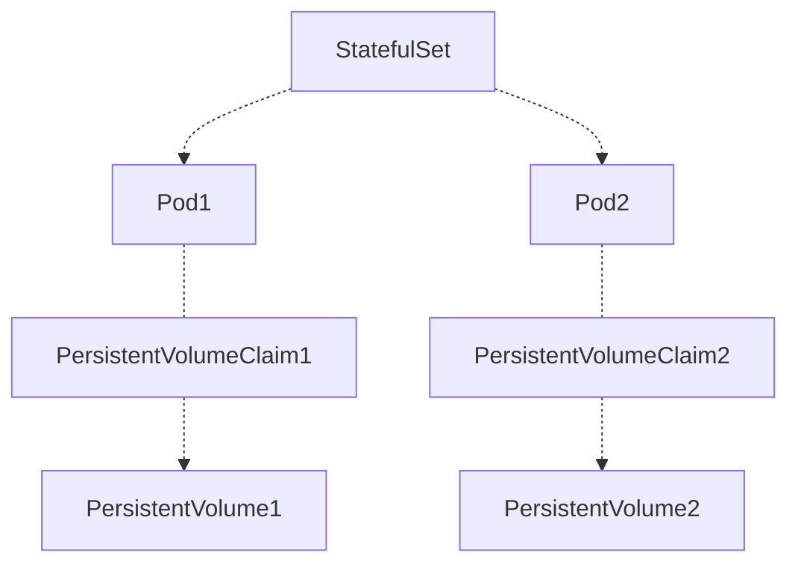
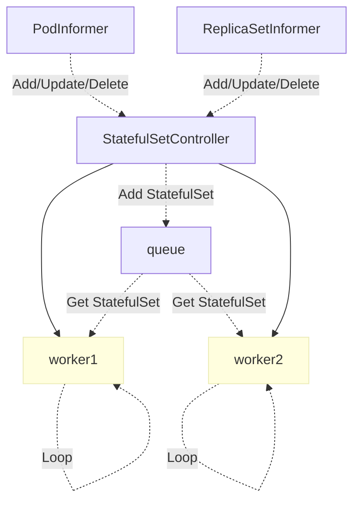

# 详解 Kubernetes StatefulSet 实现原理

来源：[详解 Kubernetes StatefulSet 实现原理](https://draveness.me/kubernetes-statefulset/)

在 Kubernetes 的世界中，[ReplicaSet](https://draveness.me/kubernetes-replicaset) 和 [Deployment](https://draveness.me/kubernetes-deployment) 主要用于处理无状态的服务，无状态服务的需求往往非常简单并且轻量，每一个无状态节点存储的数据在重启之后就会被删除，虽然这种服务虽然常见，但是我们仍然需要有状态的服务来实现一些特殊的需求，StatefulSet 就是 Kubernetes 为了运行有状态服务引入的资源，例如 Zookeeper、Kafka 等。

这篇文章会介绍 Kubernetes 如何在集群中运行有状态服务，同时会分析这些有状态服务 StatefulSet 的同步过程以及实现原理。

## 一、概述

StatefulSet 是用于管理有状态应用的工作负载对象，与 [ReplicaSet](https://draveness.me/kubernetes-replicaset) 和 [Deployment](https://draveness.me/kubernetes-deployment) 这两个对象不同，StatefulSet 不仅能管理 Pod 的对象，还它能够保证这些 Pod 的顺序性和唯一性。

与 Deployment 一样，StatefulSet 也使用规格中声明的 `template` 模板来创建 Pod 资源，但是这些 Pod 相互之间是不能替换的；除此之外 StatefulSet 会为每个 Pod 设置一个单独的持久标识符，这些用于标识序列的标识符在发生调度时也不会丢失。

```yaml
apiVersion: apps/v1
kind: StatefulSet
metadata:
  name: web
spec:
  serviceName: "nginx"
  replicas: 2
  selector:
    matchLabels:
      app: nginx
  template:
    metadata:
      labels:
        app: nginx
    spec:
      containers:
      - name: nginx
        image: k8s.gcr.io/nginx-slim:0.8
        volumeMounts:
        - name: www
          mountPath: /usr/share/nginx/html
  volumeClaimTemplates:
  - metadata:
      name: www
    spec:
      accessModes: [ "ReadWriteOnce" ]
      resources:
        requests:
          storage: 1Gi
```

如果我们在 Kubernetes 集群中创建如上所示的 StatefulSet 对象，会得到以下结果，Kubernetes 不仅会创建 StatefulSet 对象，还会自动创建两个 Pod 副本：

```shell
$ kubectl get statefulsets.apps
kNAME   READY   AGE
web    2/2     2m27s

$ kubectl get pods
NAME    READY   STATUS    RESTARTS   AGE
web-0   1/1     Running   0          2m31s
web-1   1/1     Running   0          105s

$ kubectl get persistentvolumes
NAME                                       CAPACITY   ACCESS MODES   RECLAIM POLICY   STATUS   CLAIM               STORAGECLASS       REASON   AGE
pvc-19ef374f-39d1-11e9-b870-9efb418608da   1Gi        RWO            Delete           Bound    default/www-web-1   do-block-storage            21m
pvc-fe53d5f7-39d0-11e9-b870-9efb418608da   1Gi        RWO            Delete           Bound    default/www-web-0   do-block-storage            21m

$ kubectl get persistentvolumeclaims
NAME        STATUS   VOLUME                                     CAPACITY   ACCESS MODES   STORAGECLASS       AGE
www-web-0   Bound    pvc-fe53d5f7-39d0-11e9-b870-9efb418608da   1Gi        RWO            do-block-storage   21m
www-web-1   Bound    pvc-19ef374f-39d1-11e9-b870-9efb418608da   1Gi        RWO      
```

除此之外，上述 YAML 文件中的 `volumeClaimTemplates` 配置还会创建持久卷`PersistentVolume` 和用于绑定持久卷和 Pod 的 `PersistentVolumeClaim` 资源；两个 Pod 对象名中包含了它们的序列号，该序列号会在 StatefulSet 存在的时间内保持不变，哪怕 Pod 被重启或者重新调度，也不会出现任何的改变。



StatefulSet 的拓扑结构和其他用于部署的资源其实比较类似，比较大的区别在于 StatefulSet 引入了 PV 和 PVC 对象来持久存储服务产生的状态，这样所有的服务虽然可以被杀掉或者重启，但是其中的数据由于 PV 的原因不会丢失。

## 二、实现原理

与 [ReplicaSet](https://draveness.me/kubernetes-replicaset) 和 [Deployment](https://draveness.me/kubernetes-deployment) 资源一样，StatefulSet 也使用控制器的方式实现，它主要由 `StatefulSetController`、`StatefulSetControl` 和 `StatefulPodControl` 三个组件协作来完成 StatefulSet 的管理，`StatefulSetController` 会同时从 `PodInformer` 和 `ReplicaSetInformer`中接受增删改事件并将事件推送到队列中：



控制器 `StatefulSetController` 会在 `Run` 方法中启动多个 Goroutine 协程，这些协程会从队列中获取待处理的 StatefulSet 资源进行同步，接下来我们会先介绍 Kubernetes 同步 StatefulSet 的过程。

### 1、同步

`StatefulSetController` 使用 `sync` 方法同步 StatefulSet 资源，这是同步该资源的唯一入口，下面是这个方法的具体实现：

```go
func (ssc *StatefulSetController) sync(key string) error {
	namespace, name, _ := cache.SplitMetaNamespaceKey(key)
	set, _ := ssc.setLister.StatefulSets(namespace).Get(name)

	ssc.adoptOrphanRevisions(set)

	selector, _ := metav1.LabelSelectorAsSelector(set.Spec.Selector)
	pods, _ := ssc.getPodsForStatefulSet(set, selector)

	return ssc.syncStatefulSet(set, pods)
}

func (ssc *StatefulSetController) syncStatefulSet(set *apps.StatefulSet, pods []*v1.Pod) error {
	ssc.control.UpdateStatefulSet(set.DeepCopy(), pods); err != nil
	return nil
}
```

1. 先重新获取 StatefulSet 对象；
2. 收养集群中与 StatefulSet 有关的孤立控制器版本；
3. 获取当前 StatefulSet 对应的全部 Pod 副本；
4. 调用 `syncStatefulSet` 方法同步资源；

`syncStatefulSet` 方法只是将方法的调用转发到了一个 `StatefulSetControlInterface` 的实现 `defaultStatefulSetControl`上，`StatefulSetControlInterface` 定义了用与控制 StatefulSet 和 Pod 副本的接口，这里调用的 `UpdateStatefulSet` 函数执行了一个 StatefulSet 的核心逻辑，它会负责获取 StatefulSet 版本、更新 StatefulSet 以及它的状态和历史：

```go
func (ssc *defaultStatefulSetControl) UpdateStatefulSet(set *apps.StatefulSet, pods []*v1.Pod) error {
	revisions, err := ssc.ListRevisions(set)
	history.SortControllerRevisions(revisions)

	currentRevision, updateRevision, collisionCount, err := ssc.getStatefulSetRevisions(set, revisions)

	status, err := ssc.updateStatefulSet(set, currentRevision, updateRevision, collisionCount, pods)

	ssc.updateStatefulSetStatus(set, status)

	return ssc.truncateHistory(set, pods, revisions, currentRevision, updateRevision)
}
```

它会使用默认的单调递增策略，按照升序依次创建副本并按照降序删除副本，当出现 Pod 处于不健康的状态时，那么新的 Pod 就不会被创建，`StatefulSetController` 会等待 Pod 恢复后继续执行下面的逻辑。

上述代码会在获取 StatefulSet 的历史版本之后调用 `updateStatefulSet` 方法开始更新 StatefulSet，这个将近 300 行的代码会按照执行以下的执行：

1. 将当前 StatefulSet 持有的 Pod 副本按照序列号进行分组，超出数量的副本将被分入 `condemned` 中等待后续的删除操作，这次同步中需要保留的副本将进入 `replicas` 分组；
2. 对当前的 StatefulSet 进行扩容，让集群达到目标的副本数；
3. 获取副本数组中第一个不健康的 Pod；
4. 根据副本的序列号检查各个副本的状态；
   - 如果发现了失败的副本就会进行重启；
   - 如果当前副本没有正常运行就会退出循环，直到当前副本达到正常运行的状态；
5. 按照降序依次删除 `condemned` 数组中的副本；
6. 按照降序依次更新 `replicas` 数组中的副本；

```go
func (ssc *defaultStatefulSetControl) updateStatefulSet(set *apps.StatefulSet, currentRevision *apps.ControllerRevision, updateRevision *apps.ControllerRevision, collisionCount int32, pods []*v1.Pod) (*apps.StatefulSetStatus, error) {
	currentSet, _ := ApplyRevision(set, currentRevision)
	updateSet, _ := ApplyRevision(set, updateRevision)

	status := apps.StatefulSetStatus{}
	// ...

	replicaCount := int(*set.Spec.Replicas)
	replicas := make([]*v1.Pod, replicaCount)
	condemned := make([]*v1.Pod, 0, len(pods))
	unhealthy := 0
	var firstUnhealthyPod *v1.Pod

	for i := range pods {
		if ord := getOrdinal(pods[i]); 0 <= ord && ord < replicaCount {
			replicas[ord] = pods[i]
		} else if ord >= replicaCount {
			condemned = append(condemned, pods[i])
		}
	}

	sort.Sort(ascendingOrdinal(condemned))

	for ord := 0; ord < replicaCount; ord++ {
		if replicas[ord] == nil {
			replicas[ord] = newVersionedStatefulSetPod(currentSet, updateSet, currentRevision.Name, updateRevision.Name, ord)
		}
	}
```

这里通过 StatefulSet 应该持有的副本数对当前的副本进行分组，一部分是需要保证存活的 `replicas`，另一部分是需要被终止的副本 `condemned`，如果分组后的 `replicas` 数量不足，就会通过 `newVersionedStatefulSetPod` 函数创建新的 Pod，不过这里的 Pod 也只是待创建的模板。


拿到线上应该存在的 `replicas` 数组时，我们就可以进行通过 `CreateStatefulPod` 进行扩容了，每个 Pod 的更新和创建都会等待前面所有 Pod 正常运行，它会调用 `isFailed`、`isCreated`、`isTerminating` 等方法保证每一个 Pod 都正常运行时才会继续处理下一个 Pod，如果使用滚动更新策略，那么会在完成扩容之后才会对当前的 Pod 进行更新：

```go
	for i := range replicas {
		if isFailed(replicas[i]) {
			ssc.podControl.DeleteStatefulPod(set, replicas[i])
			replicas[i] = newVersionedStatefulSetPod(i)
		}
		if !isCreated(replicas[i]) {
			ssc.podControl.CreateStatefulPod(set, replicas[i])
			return &status, nil
		}
		if isTerminating(replicas[i]) || !isRunningAndReady(replicas[i]) {
			return &status, nil
		}
		if identityMatches(set, replicas[i]) && storageMatches(set, replicas[i]) {
			continue
		}
		replica := replicas[i].DeepCopy()
		ssc.podControl.UpdateStatefulPod(updateSet, replica)
	}
```

当 `StatefulSetController` 处理完副本的创建和更新任务之后，就开始删除需要抛弃的节点了，节点的删除也需要确定按照降序依次进行：

```go
	for target := len(condemned) - 1; target >= 0; target-- {
		if isTerminating(condemned[target]) {
			return &status, nil
		}
		if !isRunningAndReady(condemned[target]) && condemned[target] != firstUnhealthyPod {
			return &status, nil
		}

		ssc.podControl.DeleteStatefulPod(set, condemned[target])
		return &status, nil
	}

	updateMin := 0
	if set.Spec.UpdateStrategy.RollingUpdate != nil {
		updateMin = int(*set.Spec.UpdateStrategy.RollingUpdate.Partition)
	}
	for target := len(replicas) - 1; target >= updateMin; target-- {
		if getPodRevision(replicas[target]) != updateRevision.Name && !isTerminating(replicas[target]) {
			ssc.podControl.DeleteStatefulPod(set, replicas[target])
			return &status, err
		}

		if !isHealthy(replicas[target]) {
			return &status, nil
		}
	}
	return &status, nil
}
```

我们首先会删除待抛弃列表中的副本，其次根据滚动更新 `RollingUpdate` 的配置从高到低依次删除所有 Pod 版本已经过时的节点，所有删除节点的方式都会通过 `DeleteStatefulPod` 方法进行，该方法会通过客户端的接口直接根据 Pod 名称删除对应的资源。

### 2、序列号

Pod 的序列号（Ordinal）是其唯一性和顺序性的保证，在创建和删除 StatefulSet 的副本时，我们都需要按照 Pod 的序列号对它们按照顺序操作，副本的创建会按照序列号升序处理，副本的更新和删除会按照序列号降序处理。


创建 StatefulSet 中的副本时，就会在 `newStatefulSetPod` 函数中传入当前 Pod 的 `ordinal` 信息，该方法会调用 `GetPodFromTemplate` 获取 `StatefulSet` 中的 Pod 模板并且初始化 Pod 的 `metadata` 和引用等配置：

```go
func newStatefulSetPod(set *apps.StatefulSet, ordinal int) *v1.Pod {
	pod, _ := controller.GetPodFromTemplate(&set.Spec.Template, set, metav1.NewControllerRef(set, controllerKind))
	pod.Name = getPodName(set, ordinal)
	initIdentity(set, pod)
	updateStorage(set, pod)
	return pod
}

func getPodName(set *apps.StatefulSet, ordinal int) string {
	return fmt.Sprintf("%s-%d", set.Name, ordinal)
}
```

`getPodName` 函数的实现非常简单，它将 StatefulSet 的名字和传入的序列号通过破折号连接起来组成我们经常见到的 `web-0`、`web-1` 等形式的副本名；`initIdentity` 会更新 Pod 的主机名、资源名、命名空间标签，而 `updateStorage` 会为待创建的副本设置卷：

```go
func updateStorage(set *apps.StatefulSet, pod *v1.Pod) {
	currentVolumes := pod.Spec.Volumes
	claims := getPersistentVolumeClaims(set, pod)
	newVolumes := make([]v1.Volume, 0, len(claims))
	for name, claim := range claims {
		newVolumes = append(newVolumes, v1.Volume{
			Name: name,
			VolumeSource: v1.VolumeSource{
				PersistentVolumeClaim: &v1.PersistentVolumeClaimVolumeSource{
					ClaimName: claim.Name,
					ReadOnly: false,
				},
			},
		})
	}
	for i := range currentVolumes {
		if _, ok := claims[currentVolumes[i].Name]; !ok {
			newVolumes = append(newVolumes, currentVolumes[i])
		}
	}
	pod.Spec.Volumes = newVolumes
}
```

设置卷的配置主要来自于 StatefulSet 规格中的 `volumeClaimTemplates` 模板，所有卷相关的配置信息都会通过该方法传递过来。

Pod 通过当前名字存储自己对应的序列号，在 `StatefulSetController` 同步时就会从 Pod 的名字中取出序列号并进行排序，随后的各种循环就可以选择使用正序或者倒序的方式依次处理各个节点了。

### 3、删除

当我们删除一个 Kubernetes 中的 StatefulSet 资源时，它对应的全部 Pod 副本都会被 [垃圾收集器](https://draveness.me/kubernetes-garbage-collector) 自动删除，该收集器在检查到当前 Pod 的 `metadata.ownerReferences` 已经不再存在时就会删除 Pod 资源，读者可以阅读 [垃圾收集器](https://draveness.me/kubernetes-garbage-collector) 了解具体的执行过程和实现原理。

```shell
$ kubectl delete statefulsets.apps web
statefulset.apps "web" deleted

$ kubectl get pods --watch
NAME    READY   STATUS    RESTARTS   AGE
web-2   1/1   Terminating   0     14h
web-1   1/1   Terminating   0     14h
web-0   1/1   Terminating   0     14h
```

我们会发现除了 StatefulSet 和 Pod 之外的任何其他资源都没有被删除，之前创建的 `PersistentVolume` 和 `PersistentVolumeClaim` 对象都没有发生任何的变化，这也是 StatefulSet 的行为，它会在服务被删除之后仍然保留其中的状态，也就是数据，这些数据就都存储在 `PersistentVolume` 中。

如果我们重新创建相同的 StatefulSet，它还会使用之前的 PV 和 PVC 对象，不过也可以选择手动删除所有的 PV 和 PVC 来生成新的存储，这两个对象都属于 Kubernetes 的存储系统，感兴趣的读者可以通过 [存储系统](https://draveness.me/kubernetes-volume) 了解 Kubernetes 中 Volume 的设计和实现。

## 总结

StatefulSet 是 Kubernetes 为了处理有状态服务引入的概念，在有状态服务中，它为无序和短暂的 Pod 引入了顺序性和唯一性，使得 Pod 的创建和删除更容易被掌控和预测，同时加入 PV 和 PVC 对象来存储这些 Pod 的状态，我们可以使用 StatefulSet 实现一些偏存储的有状态系统，例如 Zookeeper、Kafka、MongoDB 等，这些系统大多数都需要持久化的存储数据，防止在服务宕机时发生数据丢失。

## Reference

- [Kubernetes Deployments vs StatefulSets](https://stackoverflow.com/questions/41583672/kubernetes-deployments-vs-statefulsets)
- [StatefulSet: Run and Scale Stateful Applications Easily in Kubernetes](https://kubernetes.io/blog/2016/12/statefulset-run-scale-stateful-applications-in-kubernetes/)
- [Running ZooKeeper, A Distributed System Coordinator](https://kubernetes.io/docs/tutorials/stateful-application/zookeeper/)
- [StatefulSets · Kubernetes](https://kubernetes.io/docs/concepts/workloads/controllers/statefulset/)
- [StatefulSet · Kubernetes Engine](https://cloud.google.com/kubernetes-engine/docs/concepts/statefulset#partitioning_rolling_updates)

