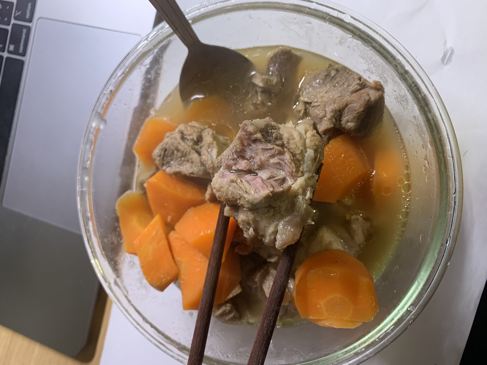

# 排骨汤

- 耗时：60 分钟
- 评价：骨边肉真的很香
- 评分：🌟🌟🌟
- 难度：🌟🌟🌟

## 材料

| 材料   | 数量  |
| ------ | ----- |
| 排骨   | 400 g |
| 胡萝卜 | 一根  |
| 小葱   | 一根  |
| 姜     | 一块  |
| 蒜     | 两瓣  |

| 调味   | 数量 |
| ------ | ---- |
| 生抽   | 三勺 |
| 蚝油   | 一勺 |
| 五香粉 | 一撮 |
| 盐     | 一撮 |
| 鸡精   | 一撮 |

## 做法

1. 排骨冷水下锅焯水，放点生姜、料酒
2. 油锅炒葱、姜、蒜
3. 油锅炒排骨，放入生抽、蚝油、五香粉、盐、鸡精调味
4. 加「热水」，「全程小火」炖 1 个小时
5. 最后 20 分钟放入胡萝卜

## 出品

