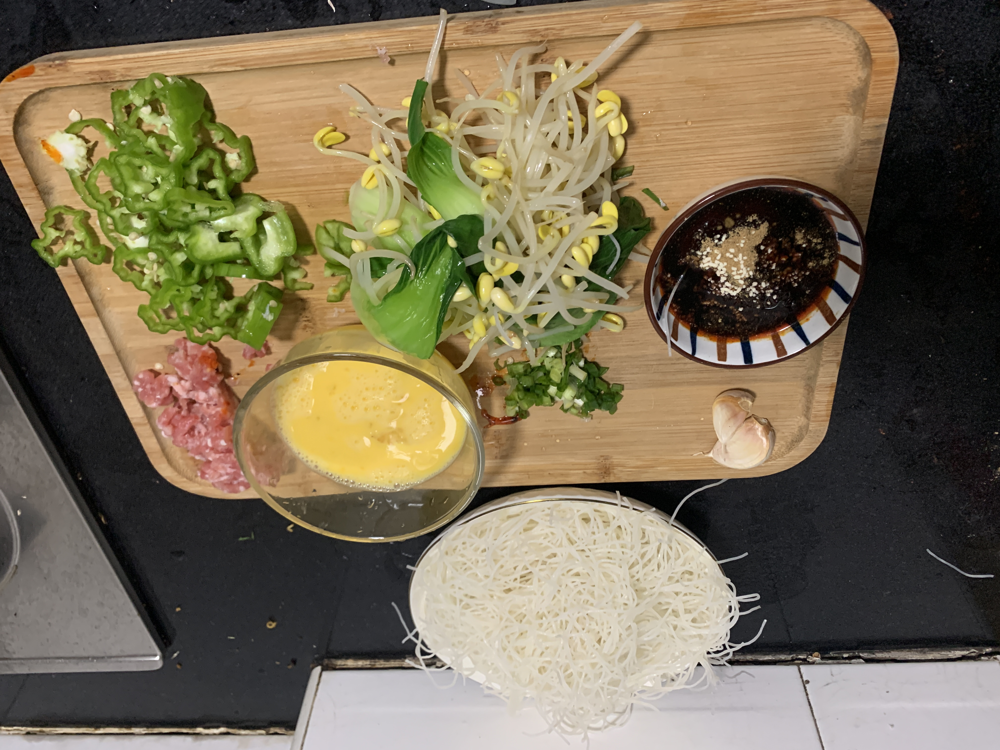
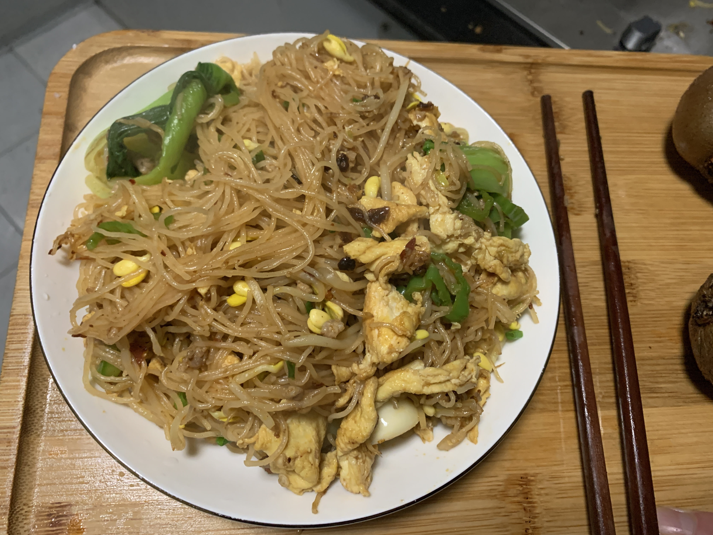

# 炒米粉

- 耗时：50 分钟（米粉浸泡 30 分钟，制作 20 分钟）
- 评价：很难做好，一旦做好很好吃
- 评分：🌟🌟🌟🌟🌟
- 难度：🌟🌟🌟🌟🌟

## 材料

| 材料     | 数量   |
| -------- | ------ |
| 米粉     | 一把   |
| 鸡蛋     | 两个   |
| 肉末     | 一块   |
| 豆芽     | 一把   |
| 脆口青菜 | 一小把 |
| 辣椒     | 一根   |
| 葱       | 一根   |
| 蒜       | 一瓣   |

| 调味   | 数量 |
| ------ | ---- |
| 老干妈 | 两勺 |
| 酱油   | 三勺 |
| 蚝油   | 一勺 |
| 五香粉 | 一撮 |
| 盐     | 一撮 |
| 鸡精   | 一撮 |

## 做法

准备：

1. 米粉提前「凉水浸泡」半个小时，
1. 若是黄豆芽，一定要把黄豆去掉
2. 豆芽和青菜焯水，大火煮开，略软即可
3. 葱、蒜切碎
4. 鸡蛋打散
5. 所有调料拌匀，再加少许水

开做：

1. 鸡蛋炒熟盛出
2. 肉和蒜末炒熟，炒香
3. 豆芽、青菜、鸡蛋入锅，倒入 1/3 调料大火翻炒
4. 米粉入锅，调料全部放入，再加少许油
5. 大火翻炒，完成

## 出品

