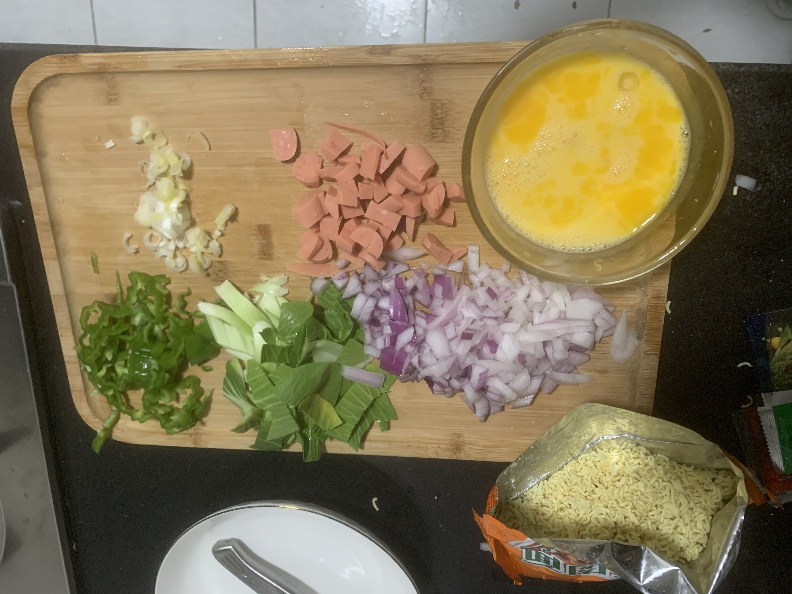

# 印度炒方便面

- 耗时：30 分钟
- 评价：软烂
- 评分：🌟🌟🌟
- 难度：🌟🌟

## 材料

| 材料     | 数量   |
| -------- | ------ |
| 方便面   | 一包   |
| 鸡蛋     | 两个   |
| 洋葱     | 1/4 个 |
| 火腿     | 一根   |
| 脆口青菜 | 一根   |
| 辣椒     | 一根   |
| 葱       | 一根   |
| 蒜       | 一瓣   |

| 调味   | 数量 |
| ------ | ---- |
| 五香粉 | 三撮 |
| 酱油   | 三勺 |
| 蚝油   | 一勺 |
| 盐     | 一撮 |

## 做法

准备：

1. 方便面一定要压碎
2. 打鸡蛋
3. 配菜切碎

开做：

1. 所有配菜炒香
2. 加水调味，不要放自带料包
2. 倒入鸡蛋，搅拌
2. 倒入碎方便面

## 出品

