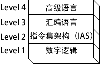
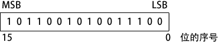
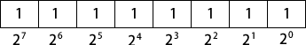
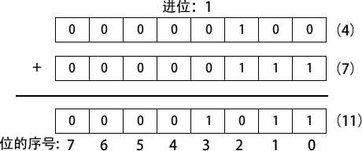
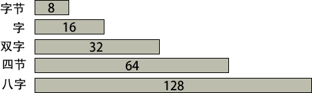
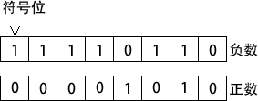

# 汇编语言基本概念

汇编语言是一种最低级、最古老、不具有移植性的编程语言，它能够直接访问计算机硬件，所以执行效率极高，占用资源极少，一般用于嵌入式设备、驱动程序、实时应用、核心算法等。

汇编语言的缺点是开发周期特别长，实现一个简单的功能都非常麻烦，已经很少用来编写应用程序了。

## 1、应用

| 应用类型                                             | 高级语言                                                     | 汇编语言                                                     |
| ---------------------------------------------------- | ------------------------------------------------------------ | ------------------------------------------------------------ |
| 商业或科学应用程序，为单一的中型或大型平台编写       | 规范结构使其易于组织和维护大量代码                           | 最小规范结构，因此必须由具有不同程度经验的程序员来维护结构。这导致对已有代码的维护困难 |
| 硬件设备驱动程序                                     | 语言不一定提供对硬件的直接访问。 即使提供了，可能也需要难以控制的编码技术，这导致维护困难 | 对硬件的访问直接且简单。当程序较短且文档良好时易于维护       |
| 为多个平台（不同的操作系统）编写的商业或科学应用程序 | 通常可移植。在每个目标操作系统上， 源程序只做少量修改就能重新编译 | 需要为每个平台单独重新编写代码， 每个汇编器都使用不同的语法。维护困难 |
| 需要直接访问硬件的嵌入式系统和电脑游戏               | 可能生成很大的可执行文件，以至于超出设备的内存容量           | 理想，因为可执行代码小，运行速度快                           |

## 2、虚拟机

虚拟机概念（virtual machine machine）是一种说明计算机硬件和软件关系的有效方法。

在安德鲁 · 塔嫩鲍姆（Andrew Tanenbaum）的书《结构化计算机组织》（Structured Computer Organization）中可以找到对这个模型广为人知的解释。要说明这个概念，先从计算机的最基本功能开始，即执行程序。

计算机通常可以执行用其原生机器语言编写的程序。这种语言中的每一条指令都简单到可以用相对少量的电子电路来执行。为了简便，称这种语言为 L0。

由于 L0 极其详细，并且只由数字组成，因此，程序员用其编写程序就非常困难。如果能够构造一种较易使用的新语言 L1，那么就可以用 L1 编写程序。有两种实现方法：

- 解释（Interpretation）：运行 L1 程序时，它的每一条指令都由一个用 L0 语言编写的程序进行译码和执行。L1 程序可以立即开始运行，但是在执行之前，必须对每条指令进行译码。
- 翻译（Translation）：由一个专门设计的 L0 程序将整个 L1 程序转换为 L0 程序。然后，得到的 L0 程序就可以直接在计算机硬件上执行。

与只使用语言描述相比，把每一层都想象成有一台假设的计算机或者虚拟机会更容易一些。通俗地说，虚拟机可以定义为一个软件程序，用来模拟一些其他的物理或虚拟计算机的功能。

虚拟机，将其称为 VM1，可以执行 L1 语言编写的指令。虚拟机 VM0 可以执行 L0 语言编写的指令：

每一个虚拟机既可以用硬件构成也可以用软件构成。程序员可以为虚拟机 VM1 编写程序，如果能把 VM1 当作真实计算机予以实现，那么，程序就能直接在这个硬件上执行。否则，用 VM1 写出的程序就被翻译 / 解释为 VM0 程序，并在机器 VM0 上执行。

机器 VM1 与 VM0 之间的差异不能太大，否则，翻译或解释花费的时间就会非常多。如果 VM1 语言对程序员来说还不够友好到足以用于应用程序的开发呢？

可以为此设计另一个更加易于理解的虚拟机 VM2。这个过程能够不断重复，直到虚拟机 VMn 足够支持功能强大、使用方便的语言。

[Java](http://c.biancheng.net/java/) 编程语言就是以虚拟机概念为基础的。Java 编译器把用 Java 语言编写的程序翻译为 Java 字节码（Java byte code）。

后者是一种低级语言，能够在运行时由 Java 虚拟机（JVM）程序快速执行。JVM 已经在许多不同的计算机系统上实现了，这使得 Java 程序相对而言独立于系统。

与实际机器和语言相对，用 Level 2 表示 VM2，Level 1 表示 VM1，如下图所示。计算机数字逻辑硬件表示为 Level 1 机器。其上是 Level 2，称为指令集架构（ISA, Instruction Set Architecture） 。通常，这是用户可以编程的第一个层次，尽管这种程序包含的是被称为机器语言的二进制数值。

- 指令集架构（Level 2）计算机芯片制造商在处理器内部设计一个指令集来实现基本操作，如传送、加法或乘法。这个指令集也被称为机器语言。每一个机器语言指令或者直接在机器硬件上执行，或者由嵌入到微处理器芯片的程序来执行，该程序被称为微程序。

- 汇编语言（Level 3）在 ISA 层，编程语言提供了一个翻译层，来实践大规模软件开发。汇编语言出现在 Level 3，使用短助记符，如 ADD、SUB 和 MOV，易于转换到 ISA 层。汇编语言程序在执行之前要全部翻译（汇编）为机器语言。

- 高级语言（Level 4）Level 4 是高级编程语言，如 C、C++ 和 Java。这些语言程序所包含的语句功能强大，并翻译为多条汇编语言指令。比如，查看 C++ 编译器生成的列表文件输出，就可以看到这样的翻译。汇编语言代码由编译器自动汇编为机器语言。

## 3、汇编语言的数据表示

[汇编语言](http://c.biancheng.net/asm/)程序员处理的是物理级数据，因此他们必须善于检查内存和寄存器。通常，二进制数被用于描述计算机内存的内容；有时也使用十进制和十六进制数。所以必须熟练掌握数字格式，以便快速地进行数字的格式转换。

每一种数制格式或系统，都有一个基数（base），也就是可以分配给单一数字的最大符号数。下表给岀了数制系统内可能的数字，这些系统是硬件和软件手册中最常使用的。

| 系统     | 基数 | 可能的数字       |
| -------- | ---- | ---------------- |
| 二进制   | 2    | 01               |
| 八进制   | 8    | 01234567         |
| 十进制   | 10   | 0123456789       |
| 十六进制 | 16   | 0123456789ABCDEF |

在表的最后一行，十六进制使用的是数字 0 到 9，然后字母 A 到 F 表示十进制数 10 到 15。在展示计算机内存的内容和机器级指令时，使用十六进制是相当常见的。

## 4、二进制（bit）整数

计算机以电子电荷集合的形式在内存中保存指令和数据。用数字来表示这些内容就需要系统能够适应开 / 关（on/off）或真 / 假（true/false）的概念。

二进制数（binary number）用 2 个数字作基础，其中每一个二进制数字（称为位，bit）不是 0 就是 1。

位自右向左，从 0 开始顺序增量编号。左边的位称为最高有效位（Most Significant Bit, MSB）右边的位称为最低有效位（LSB, least significant bit）。一个 16 位的二进制数，其 MSB 和 LSB 如下图所示：

二进制整数可以是有符号的，也可以是无符号的。有符号整数又分为正数和负数，无符号整数默认为正数，零也被看作是正数。

在书写较大的二进制数时，有些人喜欢每 4 位或 8 位插入一个点号，以增加数字的易读性。比如，1101.1110.0011.1000.0000 和 11001010.10101100

**无符号二进制整数**

从 LSB 开始，无符号二进制整数中的每一个位代表的是 2 的加 1 次幂。下图展示的是对一个 8 位的二进制数来说，2 的幂是如何从右到左增加的：

| 2ⁿ   | 十进制值 | 2ⁿ   | 十进制值 |
| ---- | -------- | ---- | -------- |
| 20   | 1        | 28   | 256      |
| 21   | 2        | 29   | 512      |
| 22   | 4        | 210  | 1024     |
| 23   | 8        | 211  | 2048     |
| 24   | 16       | 212  | 4096     |
| 25   | 32       | 213  | 8192     |
| 26   | 64       | 214  | 16384    |
| 27   | 128      | 215  | 32768    |

[二进制与十进制转换](http://c.biancheng.net/view/3299.html)

## 5、二进制加法运算

两个二进制整数相加时，是位对位处理的，从最低的一对位（右边）开始，依序将每一对位进行加法运算。两个二进制数字相加，有四种结果，如下所示：

0 + 0 = 0

0 + 1 = 1

1 + 0 = 1

1 + 1 = 10

 与 1 相加的结果是二进制的 10（等于十进制的 2）。多出来的数字向更高位产生一个进位。如下图所示，两个二进制数 0000 0100 和 0000 0111 相加：

从两个数的最低位（位 0）开始，计算 0+1，得到底行对应位上的 1。然后计算次低位（位 1）。在位 2 上，计算 1+1，结果是 0，并产生一个进位 1。然后计算位 3，0+0，还要加上位 2 的进位，结果是 1。

其余的位都是 0。上图右边是等价的十进制数值加法（4 + 7 = 11），可以用于验证左边的二进制加法。

有些情况下，最高有效位会产生进位。这时，预留存储区的大小就显得很重要。比如，如果计算 1111 1111 加 0000 0001，就会在最高有效位之外产生一个 1，而和数的低 8 位则为全 0。

如果和数的存储大小最少有 9 位，那么就可以将和数表示为 1 0000 0000。但是，如果和数只能保存 8 位，那么它就等于 0000 0000，也就是计算结果的低 8 位。

## 6、字节（byte）简介

**在 x86 计算机中，所有数据存储的基本单位都是字节（byte），一个字节有 8 位**。其他的存储单位还有字（word）（2 个字节），双字（doubleword）（4 个字节）和四字（quadword）（8 个字节）。

下表列出了所有无符号整数可能的取值范围。

| 类型       | 取值范围   | 按位计的存储大小 | 类型       | 取值范围    | 按位计的存储大小 |
| ---------- | ---------- | ---------------- | ---------- | ----------- | ---------------- |
| 无符号字节 | 0 到 28-1  | 8                | 无符号四字 | 0 到 264-1  | 64               |
| 无符号字   | 0 到 216-1 | 16               | 无符号八字 | 0 到 2128-1 | 128              |
| 无符号双字 | 0 到 232-1 | 32               |            |             |                  |

## 7、十六进制整数

大的二进制数读起来很麻烦，因此十六进制数字就提供了一种简便的方式来表示二进制数据。十六进制整数中的 1 个数字就表示了 4 位二进制位，两个十六进制数字就能表示一个字节。

一个十六进制数字表示的范围是十进制数 0 到 15，所以，用字母 A 到 F 来代表十进制数 10 到 15。

下表列出了每个 4 位二进制序列如何转换为十进制和十六进制数值。

| 二进制 | 十进制 | 十六进制 | 二进制 | 十进制 | 十六进制 |
| ------ | ------ | -------- | ------ | ------ | -------- |
| 0000   | 0      | 0        | 1000   | 8      | 8        |
| 0001   | 1      | 1        | 1001   | 9      | 9        |
| 0010   | 2      | 2        | 1010   | 10     | A        |
| 0011   | 3      | 3        | 1011   | 11     | B        |
| 0100   | 4      | 4        | 1100   | 12     | C        |
| 0101   | 5      | 5        | 1101   | 13     | D        |
| 0110   | 6      | 6        | 1110   | 14     | E        |
| 0111   | 7      | 7        | 1111   | 15     | F        |

下面的例子说明了二进制数 0001 0110 1010 0111 1001 0100 是如何与十六进制数 16A794 等价的。

| 1    | 6    | A    | 7    | 9    | 4    |
| ---- | ---- | ---- | ---- | ---- | ---- |
| 0001 | 0110 | 1010 | 0111 | 1001 | 0100 |

[十六进制与十进制转换](http://c.biancheng.net/view/3303.html)

## 8、补码及进制转换

有符号二进制整数有正数和负数。在 x86 处理器中，MSB 表示的是符号位：0 表示正数，1 表示负数。下图展示了 8 位的正数和负数：

**补码表示**

负整数用补码（two`s-complement）表示时，使用的数学原理是：一个整数的补码是其加法逆元。（如果将一个数与其加法逆元相加，结果为 0。）

补码表示法对处理器设计者来说很有用，因为有了它就不需要用两套独立的电路来处理加法和减法。例如，如果表达式为 A-B，则处理器就可以很方便地将其转换为加法表达式：A+(-B)。

将一个二进制整数按位取反（求补）再加 1，就形成了它的补码。以 8 位二进制数 0000 0001 为例，求其补码为 1111 1111，过程如下所示：

| 初始值                         | 00000001           |
| ------------------------------ | ------------------ |
| 第一步：按位取反               | 11111110           |
| 第二步：将上一步得到的结果加 1 | 11111110 +00000001 |
| 和值：补码表示                 | 11111111           |

1111 1111 是 -1 的补码。补码操作是可逆的，因此，11111111 的补码就是 0000 0001。

**十六进制数的补码**

将一个十六进制整数按位取反并加 1，就生成了它的补码。一个简单的十六进制数字取反方法就是用 15 减去该数字。下面是一些十六进制数求补码的例子：

6A3D --> 95C2 + 1 --> 95C3
95C3 --> 6A3C + 1 --> 6A3D

#### 有符号二进制数到十进制的转换

用下面的算法计算一个有符号二进制整数的十进制数值：

- 如果最高位是 1，则该数是补码。再次对其求补，得到其正数值。然后把这个数值看作是一个无符号二进制整数，并求它的十进制数值。
- 如果最高位是 0，就将其视为无符号二进制整数，并转换为十进制数。

例如，有符号二进制数 1111 0000 的最高有效位是 1，这意味着它是一个负数，首先要求它的补码，然后再将结果转换为十进制。过程如下所示：

| 初始值                         | 11110000            |
| ------------------------------ | ------------------- |
| 第一步：按位取反               | 00001111            |
| 第二步：将上一步得到的结果加 1 | 00001111 +        1 |
| 第三步：生成补码               | 00010000            |
| 第四步：转换为十进制           | 16                  |

由于初始值（1111 0000）是负数，因此其十进制数值为 -16。

#### 有符号十进制数到二进制的转换

有符号十进制整数转换为二进制的步骤如下：

- 把十进制整数的绝对值转换为二进制数。
- 如果初始十进制数是负数，则在第 1 步的基础上，求该二进制数的补码。

比如，十进制数 -43 转换为二进制的过程为：

\1) 无符号数 43 的二进制表示为 0010 1011。

\2) 由于初始数值是负数，因此，求出 0010 1011 的补码 1101 0101 这就是十进制数 -43 的二进制表示。

#### 有符号十进制数到十六进制的转换

有符号十进制整数转换为十六进制的步骤如下：

- 把十进制整数的绝对值转换为十六进制数。
- 如果初始十进制数是负数，则在第 1 步的基础上，求该十六进制数的补码。

#### 有符号十六进制数到十进制的转换

有符号十六进制整数转换为十进制的步骤如下：

- 如果十六进制整数是负数，求其补码，否则保持该数不变。
- 把第 1 步得到的整数转换为十进制。如果初始值是负数，则在该十进制整数的前面加负号。

通过检查十六进制数的最高有效（最高）位，就可以知道该数是正数还是负数。如果最高位 ≥ 8，该数是负数；如果最高位 ≤ 7，该数是正数。比如，十六进制数 8A20 是负数，而 7FD9 是正数。

#### 最大值和最小值

n 位有符号整数只用 n-1 来表示该数的范围。下表列出了有符号单字节、字、双字、四字和八字的最大值与最小值。

| 类型       | 范围             | 存储位数 | 类型       | 范围               | 存储位数 |
| ---------- | ---------------- | -------- | ---------- | ------------------ | -------- |
| 有符号字节 | -2^7 到 +2^7-1   | 8        | 有符号四字 | -2^63 到 +2^63-1   | 64       |
| 有符号字   | -2^15 到 +2^15-1 | 16       | 有符号八字 | -2^127 到 +2^127-1 | 128      |
| 有符号双字 | -2^31 到 +2^31-1 | 32       |            |                    |          |

