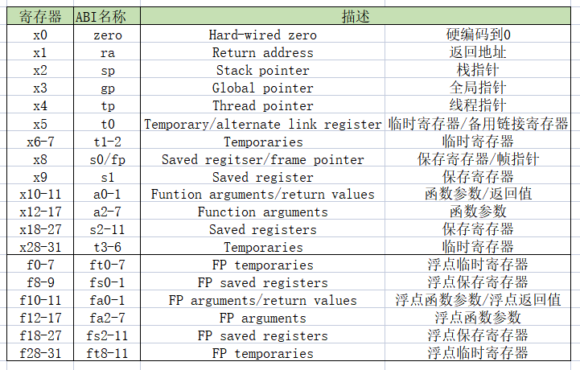
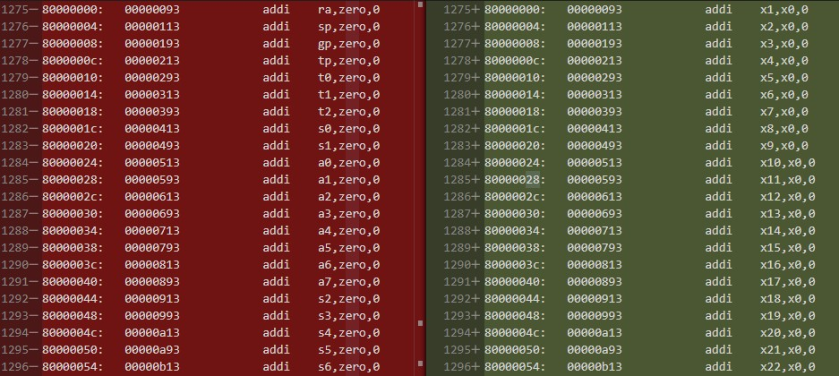

# 汇编语言格式及ABI

## 一、语言格式

以asm_run_seg.S为例：

```assembly
.equ BYTE_DELAY, 0x00100000
.equ GPIO_ADDR,  0xf0000000

.globl _start

_start:
    LI   t2,  BYTE_DELAY;   # set counter
    ADDI t3,  x0, 0;        # t3 = 0
    LI   t0,  GPIO_ADDR;    # set gpio base_address
    # ......

LOOP:       
    ADDI t3,  t3, 1;        # t3 = t3 + 1
    BNE  t3,  t2, LOOP;     # if(x6 != x7) goto loop
    ADDI t3,  x0, 0;        # t3 = 0
```

### 指示符

汇编的指示符(directive)的格式：

```assembly
.关键词
```

`.globl` (注意不是.global)用来**声明全局标签，可从其它的文件访问**，比如上面代码中.globl定义了_start，那么如果工程中其他的文件需要跳转到_start地址，可以直接使用

`.equ` **定义符号常量**，符号常量定义后可以在程序中使用，比如BYTE_DELAY 被定义为0x00100000，之后需要用0x00100000都可以用BYTE_DELAY 代替，**赋予常量意义**，容易理解，且便于批量修改。格式为.equ GPIO_ADDR, 0xf0000000

### 标签

比如`_start` 是地址，标注某段程序的位置，为程序中跳转及分支语句提供的跳转入口。

```assembly
标签:
```

标号一般用**大写字母表示，或下划线跟小写字母或单词**。在使用标号时后面跟冒号”：”，比如 `LOOP:` ，`_start:` 

### 汇编指令格式

一般汇编指令格式：

```assembly
指令 寄存器, 寄存器, 寄存器(或立即数);
指令 寄存器, 寄存器(或立即数);
```

比如 `ADDI t3，x0，0；`

部分汇编指令只接一个寄存器和立即数，格式为指令 + 空格 + 寄存器 + “，”+ 立即数，比如 `LI a3，0x08；`

汇编指令以分号 `;` 结束，常量定义以回车换行结束，没有分号”；”。比如

```assembly
.equ GPIO_ADDR, 0xf0000000
ADDI t3，x0，0;
```

### 注释

`#` 后跟的内容是注释语句，对该指令或该段程序的说明或解释，编译器在编译时忽略该部分内容。比如

```assembly
# set gpio base_address
```

## 二、ABI

ABI(Application Binary Interface)，**应用程序到二进制的接口**，一般是用来在应用程序与操作系统，应用程序与调用库(lib)，及应用程序部件之间的底层接口，如图1所示。这里的应用主要是：

- 汇编语言中可能会**利用ABI中定义作为寄存器的别名**，比如x1寄存器常用返回地址，所以其ABI名为ra(return address)，在汇编语言中可直接使用ra表示x1寄存器
- C语言编译器一般遵循ABI原则使用寄存器，比如如果JAL指令省略rd，编译器会默认使用的是ABI中的ra，即x1。
- C语言编译后，经过反汇编程序中会使用ABI名称，因为ABI中名称便于理解，反汇编程序主要用来理解生成的机器码，所以多采用ABI(也可选为显示寄存器的数字名称)，示例见图2。

ABI中寄存器的名称



图2 ABI别名寄存器(左，红)和数字寄存器(右，绿)

