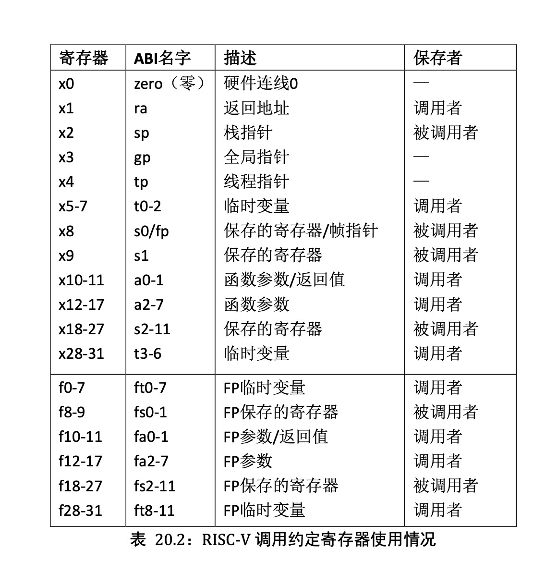
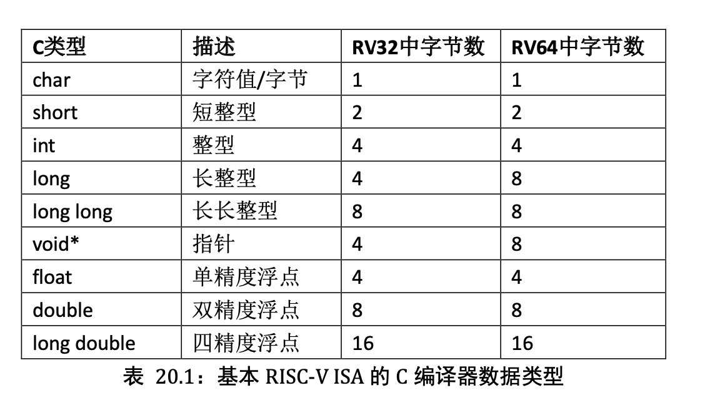
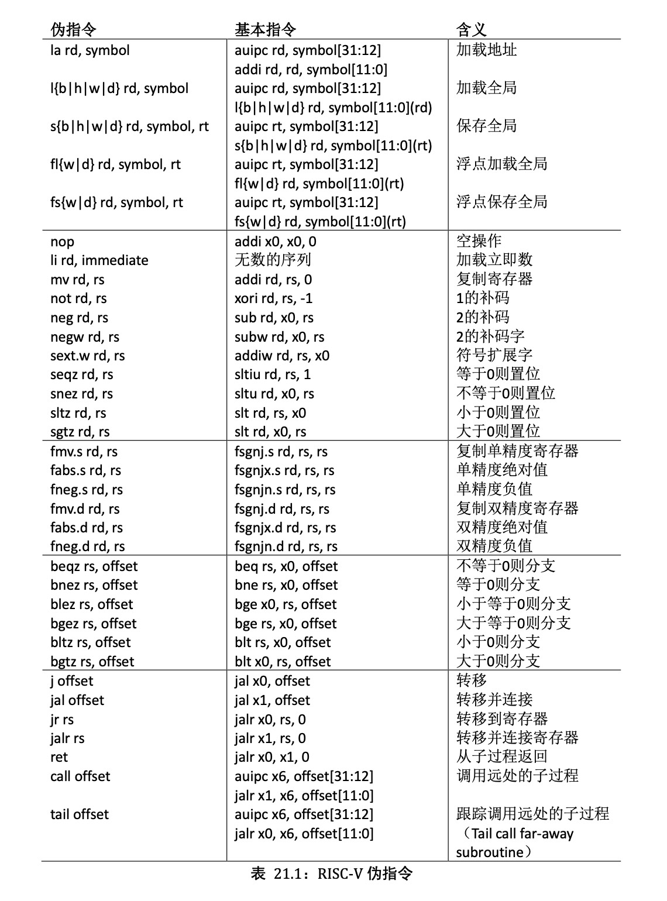

# 汇编语言格式及ABI

来源：https://zhuanlan.zhihu.com/p/496767749

## 一、语言格式

以asm_run_seg.S为例：

```assembly
.equ BYTE_DELAY, 0x00100000
.equ GPIO_ADDR,  0xf0000000

.globl _start

_start:
    LI   t2,  BYTE_DELAY;   # set counter
    ADDI t3,  x0, 0;        # t3 = 0
    LI   t0,  GPIO_ADDR;    # set gpio base_address
    # ......

LOOP:       
    ADDI t3,  t3, 1;        # t3 = t3 + 1
    BNE  t3,  t2, LOOP;     # if(x6 != x7) goto loop
    ADDI t3,  x0, 0;        # t3 = 0
```

### 指示符

汇编的指示符(directive)的格式：

```assembly
.关键词
```

`.globl` (注意不是.global)用来**声明全局标签，可从其它的文件访问**，比如上面代码中.globl定义了_start，那么如果工程中其他的文件需要跳转到_start地址，可以直接使用

`.equ` **定义符号常量**，符号常量定义后可以在程序中使用，比如BYTE_DELAY 被定义为0x00100000，之后需要用0x00100000都可以用BYTE_DELAY 代替，**赋予常量意义**，容易理解，且便于批量修改。格式为.equ GPIO_ADDR, 0xf0000000

### 标签

比如`_start` 是地址，标注某段程序的位置，为程序中跳转及分支语句提供的跳转入口。

```assembly
标签:
```

标号一般用**大写字母表示，或下划线跟小写字母或单词**。在使用标号时后面跟冒号”：”，比如 `LOOP:` ，`_start:` 

### 汇编指令格式

一般汇编指令格式：

```assembly
指令 寄存器, 寄存器, 寄存器(或立即数);
指令 寄存器, 寄存器(或立即数);
```

比如 `ADDI t3，x0，0；`

部分汇编指令只接一个寄存器和立即数，格式为指令 + 空格 + 寄存器 + “，”+ 立即数，比如 `LI a3，0x08；`

汇编指令以分号 `;` 结束，常量定义以回车换行结束，没有分号”；”。比如

```assembly
.equ GPIO_ADDR, 0xf0000000
ADDI t3，x0，0;
```

### 注释

`#` 后跟的内容是注释语句，对该指令或该段程序的说明或解释，编译器在编译时忽略该部分内容。比如

```assembly
# set gpio base_address
```

## 二、ABI

ABI(Application Binary Interface)，**应用程序到二进制的接口**，一般是用来在应用程序与操作系统，应用程序与调用库(lib)，及应用程序部件之间的底层接口，如图1所示。这里的应用主要是：

- 汇编语言中可能会**利用ABI中定义作为寄存器的别名**，比如x1寄存器常用返回地址，所以其ABI名为ra(return address)，在汇编语言中可直接使用ra表示x1寄存器
- C语言编译器一般遵循ABI原则使用寄存器，比如如果JAL指令省略rd，编译器会默认使用的是ABI中的ra，即x1。
- C语言编译后，经过反汇编程序中会使用ABI名称，因为ABI中名称便于理解，反汇编程序主要用来理解生成的机器码，所以多采用ABI(也可选为显示寄存器的数字名称)，示例见图2。

ABI中寄存器的名称


图2 ABI别名寄存器(左，红)和数字寄存器(右，绿)


### 1、寄存器



### 2、C数据类型和对齐



### 2、运算指令

RISC-V中的运算指令包括算术运算，逻辑运算，移位运算。运算只在寄存器之间运行，即想要对内存中的数据进行运算，需要先将其取至寄存器。

这里介绍立即数的概念。汇编中立即数即为常数，一般在运算时会对其作**符号扩展**，关于符号扩展和零扩展会在介绍RISC-V的机器码表示时介绍。

值得注意的是，RISC-V中有一个寄存器x0被硬编码为0，其值无法修改，作为常数存在。

#### 1）算术运算

- add rd,rs1,rs2
  ：将寄存器rs1与rs2的值相加并写入寄存器rd。
- sub rd,rs1,rs2
  ：将寄存器rs1与rs2的值相减并写入寄存器rd。
- addi rd,rs1,imm
  ：将寄存器rs1的值与立即数imm相加并存入寄存器rd。
- mul rd,rs1,rs2
  ：将寄存器rs1与rs2的值相乘并写入寄存器rd。
- div rd,rs1,rs2
  ：将寄存器rs1除以寄存器rs2的值，向零舍入并写入寄存器rd。
- rem rd,rs1,rs2
  ：将寄存器rs1模寄存器rs2的值并写入寄存器rd。

以上运算发生溢出时会自动截断高位。乘法可以用 `mulh`，`mulhu` 获得两个32位数乘积的高32位，细节不赘述。

#### 2）逻辑运算

- and rd,rs1,rs2
  ：将寄存器rs1与rs2的值按位与并写入寄存器rd。
- andi rd,rs1,imm
  ：将寄存器rs1的值与立即数imm的值按位与并写入寄存器rd。
- or rd,rs1,rs2
  ：将寄存器rs1与rs2的值按位或并写入寄存器rd。
- ori rd,rs1,imm
  ：将寄存器rs1的值与立即数imm的值按位或并写入寄存器rd。
- xor rd,rs1,rs2
  ：将寄存器rs1与rs2的值按位异或并写入寄存器rd。
- xori rd,rs1,imm
  ：将寄存器rs1的值与立即数imm的值按位异或并写入寄存器rd。

#### 3）移位运算

- sll rd,rs1,rs2
  ：将寄存器rs1的值左移寄存器rs2的值这么多位，并写入寄存器rd。
- slli rd,rs1,imm
  ：将寄存器rs1的值左移立即数imm的值这么多位，并写入寄存器rd。
- srl rd,rs1,rs2
  ：将寄存器rs1的值逻辑右移寄存器rs2的值这么多位，并写入寄存器rd。
- srli rd,rs1,imm
  ：将寄存器rs1的值逻辑右移立即数imm的值这么多位，并写入寄存器rd。
- sra rd,rs1,rs2
  ：将寄存器rs1的值算数右移寄存器rs2的值这么多位，并写入寄存器rd。
- srai rd,rs1,imm
  ：将寄存器rs1的值算数右移立即数imm的值这么多位，并写入寄存器rd。

左移会在右边补0，逻辑右移会在最高位添0，算数右移在最高位添加符号位。

区分算数右移和逻辑右移，是从计算的角度考虑的：左移一位等于乘2，右移一位等于除2是算数的规律；无论正数负数，在右边补0都等于乘2；而负数进行逻辑右移的结果不等于除以2，需要用算数右移；而若只有算术右移，则无符号数的运算又会受影响。

### 3、数据传输指令

前面讲到，想要对主存中的数据进行运算，需要先将其取至寄存器，数据传输指令实现了这个目的。

现代计算机以**字节**（byte，1byte=8bits)为基本单位，而内存本身可被视作由byte组成的一维数组，地址从0开始。**字**（word)则是存取数据的另一个单位，在RISC-V中1word=4Bytes=32bits，在其他体系结构中可能会发生变化。

- lb rd,offset(rs1)
  ：从地址为寄存器rs1的值加offset的主存中读一个字节，符号扩展后存入rd
- lh rd,offset(rs1)
  ：从地址为寄存器rs1的值加offset的主存中读半个字，符号扩展后存入rd
- lw rd,offset(rs1)
  ：从地址为寄存器rs1的值加offset的主存中读一个字，符号扩展后存入rd
- lbu rd,offset(rs1)
  ：从地址为寄存器rs1的值加offset的主存中读一个无符号的字节，零扩展后存入rd
- lhu rd,offset(rs1)
  ：从地址为寄存器rs1的值加offset的主存中读半个无符号的字，零扩展后存入rd
- lwu rd,offset(rs1)
  ：从地址为寄存器rs1的值加offset的主存中读一个无符号的字，零扩展后存入rd
- sb rs1,offset(rs2)
  ：把寄存器rs1的值存入地址为寄存器rs2的值加offset的主存中，保留最右端的8位
- sh rs1,offset(rs2)
  ：把寄存器rs1的值存入地址为寄存器rs2的值加offset的主存中，保留最右端的16位
- sw rs1,offset(rs2)
  ：把寄存器rs1的值存入地址为寄存器rs2的值加offset的主存中，保留最右端的32位
- SD、SW、SH、SB分别 把寄存器rs2的低64位、32位、16位、8位写入存储器。

l是load的首字母，即加载数据；s是store的缩写，即存储数据。b，h，w分别是byte，half word，word的首字母，除此之外还有存取双字的d，即double word。

举例：

```c
long long A[100];
A[10] = A[3] + a;
```

假设数组A首地址在寄存器x3，a在x2：

```assembly
ld x10,24(x3)       # long long占64bits=8bytes，A[3]的地址为A[0]+3*8
add x10,x2,x10
sd x10,80(x3)
```

### 4、比较指令

有符号数：

- slt rd,rs1,rs2
  ：若rs1的值小于rs1的值，rd置为1，否则置为0
- slti rd,rs1,imm
  ：若rs1的值小于立即数imm，rd置为1，否则置为0

无符号数：

- sltu rd,rs1,rs2
  ：若rs1的值小于rs1的值，rd置为1，否则置为0
- sltiu rd,rs1,imm
  ：若rs1的值小于立即数imm，rd置为1，否则置为0

### 5、条件分支指令

这部分用来实现控制流，即if语句，循环等。汇编中没有C等高级语言中的

```text
{}
```

语句块，而是用

```text
Lable:
```

的形式，下面会举例说明。

- beq rs1,rs2,lable
  ：若rs1的值等于rs2的值，程序跳转到lable处继续执行
- bne rs1,rs2,lable
  ：若rs1的值不等于rs2的值，程序跳转到lable处继续执行
- blt rs1,rs2,lable
  ：若rs1的值小于rs2的值，程序跳转到lable处继续执行
- bge rs1,rs2,lable
  ：若rs1的值大于等于rs2的值，程序跳转到lable处继续执行

`blt` 和 `bge` 也有无符号版本 `bltu` `bgeu`

举例：

```text
int i = 0;
do{
    i++;
}while(i<10)

add x2,x0,10        # x2 = 10
add x3,x0,0         # i = 0存储在x3
Loop:
    add x3,x3,1     # i++
    blt x3,x2,Loop  # i<10则继续循环
```

### 6、无条件跳转指令

- j label
  ：程序直接跳转到lable处继续执行
- jal rd,label
  ：用于调用函数，把下一条指令的地址保存在rd中（通常用x1），然后跳转到label处继续执行
- jalr rd,offset(rs)
  ：可用于函数返回，把下一条指令的地址存到rd中，然后跳转到rs+offset地址处的指令继续执行。若rd=x0就是单纯的跳转（x0不能被修改）

这里详细解释一下 `jal `和 `jalr`

在调用函数时，我们希望函数返回后，继续执行下一条指令，所以要把这下一条指令的地址存起来，再跳转到函数的代码块。函数执行完之后，根据先前存起来的指令地址，再跳回到调用处继续执行。

### 7、伪指令

