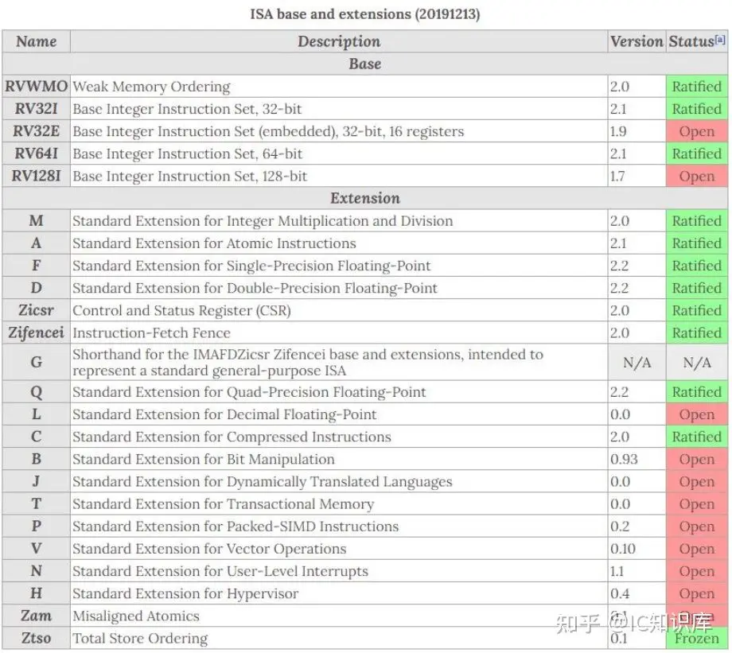
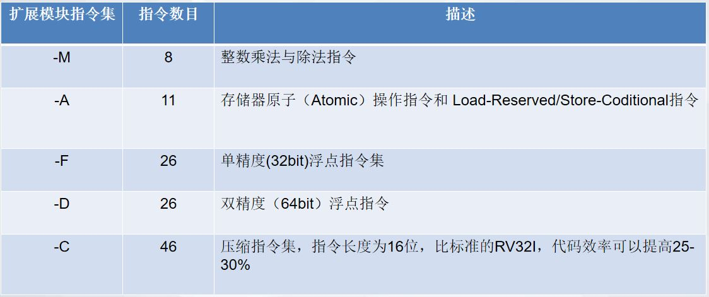

# RISC-V 简介

来源 1：https://www.icfedu.cn/

来源 2：https://ica123.com

## 一、RISC-V的由来

### 1、指令集架构

**指令集架构(Instruction Set Architecture, ISA)，是一种「抽象模型」，包括指令集，寄存器，内存处理，寻址模式，中断和异常处理，以及外部的I/0接口**。指令集包括一系列的操作码(opcode)，或机器码(machine code)，以及特定处理器执行的基本命令。ISA以不依赖于其实现特性方式，指定了在其实现上运行机器码的行为。**中央处理器(central processing unit, CPU)可以看作是ISA的实现**。

ISA可以有很多种不同的方式分类，最为广泛的分类是根据其架构的复杂性，可分为复杂指令集电脑(complex instruction set computer ,CISC)和精简指令集电脑(reduced instruction set computer ,RISC)。众所周知的CISC微处理器/控制器包括Motorola(摩托罗拉)6800，Intel(英特尔) 8080和X86系列。基于RISC设计的架构有ARM，RISC-V，MIPS等。CISC的特点是重视硬件，包括一些多时钟周期的复杂指令，容易产生语义鸿沟，代码量小。RISC的特点是偏向重视软件，结构简单，只包括单时钟周期的精简指令，代码量大。总的来说，CISC是将指令数量降低，牺牲了每个指令消耗的时钟周期，而RISC以多个指令数的代价，极大减少了每个指令的周期。RISC的策略带来了一些非常重要的优势，即相较于CISC，单时钟周期的指令需要更少的晶体管硬件空间，从而为通用寄存器留出更多空间。

然而**ISA的推广程度不仅取决于架构的优异，也依赖于商业化的程度**。RISC虽然具有很多的优势，但由于缺乏软件支持，RISC芯片发展是滞后于CISC的。没有商业利益，很多开发商公司也无法大批量生产RISC芯片，从而降低其价格，使其更有竞争力。

### 2、RISC-V 指令集的由来

RISC-V架构由美国加州大学伯克利分校的Krste Asanovic 教授，Andrew Waterman和Yunsup Lee 等人于2010发明的开源指令集，并得到图灵奖获得者David Patterson教授的帮助和支持。美国加州大学伯克利分校被称为“电子工程师的摇篮”，在很多电子工程方面的研究世界领先。当时Krste Asanovic 教授在教授一门CPU架构课时，在选择X86和ARM之间摇摆，希望通过更好的选择，来达到更好的教学效果。然而，在经过深入的研究市面上已有的CPU后，他决定自己去带领研发一款新的架构。与其他ISA相比，RISC-V不需要任何人或公司因为设计，生产和销售RISC-V架构的芯片而支付专利费。目前已经发展到第五代，因此又称为RISC-V(V–five)，由于同期矢量指令的版本草案的发布，也可以将V解释成Vector。

2017年5月，RISC-V发布了版本2.22的用户空间的指令集(user space ISA)，而特权指令集(privileged ISA)也处在草案版本1.10。2019年12月13日更新了非特权指令集2.2版本（即早期的用户空间指令集），特权指令集1.11版本，调试指令集0.13.2版本。这三个版本是目前的最新版。 

### 3、推出RISC-V的源动力

上文提到了基于CISC的X86系列和RISC的ARM系列在商业上已经非常的成熟和广泛，市场上的CPU基本由ARM公司和Intel公司垄断。ARM在1985年就已经被研发出来，而Intel X86更是在1978年就已经面世了。这样看来，RISC-V是基本上没有机会可以去发展的，然而最终RISC-V还是被推广开来，原因主要有以下几点：

1. **X86 和ARM 架构为了向后兼容，架构变得极为复杂和冗繁**。经过几十年的发展，原先的架构为了适应不断出现的新需要，进行多次修改扩充最初的架构，这为学习，使用，或是维护都增加了巨大的成本。
2. **研发生产X86/ARM的芯片需要高昂的专利和授权费**，这对初创公司非常不友好。X86系列中Intel的CPU架构完全不开放，ARM的IP Core动辄几百到几千万的前期授权费(Upfront Licence Fee)，之后每卖出一颗芯片又收取1-2%的版税(Royalty Fee)。
3. **X86和ARM为非开源系统**，RTL的代码无法获得或不能修改。比如高校中的X86汇编语言授课，通常只能进行软件的教学，无法实际练习修改其硬件来加深理解，其意义不大；目前ARM有两种授权方式，一种是架构授权，另一种是“ARM处理器IP”授权(约数百万美元)。

### 4、RISC-V的特点

RISC-V主要有两个特点：

1. 先前提到过的，**RISC-V ISA完全开源**，它可以自由地用于任何目的，允许任何人设计、制造和销售相关的芯片和软件。这个特点是RISC-V ISA出现在很多美国大学授课教材中的首要原因。
2. **它没有向后兼容的包袱**，并克服了现有CPU ISA架构的许多缺点，真正具备后发优势。

在诸多的RISC ISA的CPU中，RISC-V之所以能脱颖而出，也是由于大多数的RISC CPU的设计者更注重IP CORE 和硬件系统的设计，而不注重生态环境的打造。RISC-V不仅提供先进高效指令系统，还专门成立了基金会来发展和维护软件生态，RISC－V基金会的成员有Google，IBM，华为，Microchip等公司，目前其总部已经从美国搬到瑞士。由于中兴，华为被美制裁，中国开始大力度推动鼓励科技产业的“自主替代”，而这些替代方案会基本开源项目，RISC-V会是其中看好的方向之一。

## 二、RISC-V指令集的特点及分类

**RISC-V指令集除了有标准的32位，还有64和128位架构**。64位架构的通用寄存器是64位的，而128位架构的通用寄存器是128位的，相对应的程序计数器(program counter,PC)也分别为64位和128位。RISC-V指令集功能强大的64位和128架构面向主流的PC(私人电脑)，laptop(笔记本)和server(服务器)，但是还没有进行成熟的商业发展，比如嵌入式系统。多核系统和高效先进流水线系统的发展使得以RISC-V为架构的系统变成X86和ARM系统有力的竞争对手。

### 1、特点

计算机体系结构的传统方法是**增量指令集**，新的处理器不仅仅要实现新的指令集扩展，还必须实现过去所有的指令集，目的是为了保证向后的兼容性，这里以X86和ARM为例：

- X86自1978年被发明出来，平均每个月，它增加了大约三条指令 [1]。这意味着X86的每个更新实现都必须包括之前的扩展，不管是实用的指令集，还是已经没有意义的错误设计。这样做的坏处是，用户需要支付的费用随着指令集的增加而不断增加。
- ARM架构分为A(application)，R(real-time)，M(embedded)三个系列，各个系列已经优化过设计，不具备模块组合功能。而X86不具备模块化的特点。

RISC-V指令集采用**模块化**的架构设计，可以做到成本，功耗，性能等方面的平衡。RISC-V的核心是：

- RV32I的基础指令集，它是固定的，永远都不会改变。这为使用者和开发者提供了稳定的目标。

- RISC-V指令集的可模块化，和模块的可组合使得其可以适应不同的设计要求。比如，如果要用作数据信号处理器(digital signal processor, DSP)，就需要加上乘除法模块进行数据处理，而可能不需要原子指令集。也就是说，其他的模块都是可选的，不会成为不使用的累赘，从而造成糟糕的用户体验。

- RISC-V的模块发展，只会是出于科技的原因，由基金会决定，即使添加了新的模块，是否选择使用的权力，还是在用户手中。

### 2、分类

RISC-V分为I，M，E，C，F，D，A，Q，L，B等子集，如图1(这里是最新版本的指令子集)所示

- **基本配置子集**：基本配置子集是由RV32I ，RV32E ，RV64I ，RV128I四种类型组成。
- **扩展子集**：扩展子集是在基本配置子集的基础上加以扩展形成的功能强大RISC-V CPU 体系。子集由M，C，F，D，A，Q，L，B等组合而成。
- 扩展子集惯例是直接加在基本子集名称之后作为指示，

## 三、RISC-V处理器前景及中国CPU发展现状

### 1、前景

RISC-V的发展背景决定了它在高校教育中的地位。在RISC-V基金会网站上可以查到，许多知名的高校与之有合作课程，比如MIT，York University，清华大学，University of Rochester，University of Cambridge等。这是由于RISC-V的发展始于伯克利大学教授Krste Asanovic的研究，并且RISC-V完全开源，适合教学，也利于学生的练习掌握。印度也将RISC-V指令集列为国家指令集。美国国防部高级研究计划局(DARPA)是早期资助扶持RISC-V基金会发展的赞助之一。在中国，上海成为国内第一个将RISC-V列入政府扶持对象的城市(2018年)。2020年1月，中国开放指令生态(RISC-V)联盟于湖北武汉召开会议，并建立了武汉RISC-V产学研基地，湖北RISC-V产学研基地。

很多科技公司也非常看好RISC-V。Google，Oracle，Microsoft，华为，IBM等公司都加入了RISC-V基金会。SiFive公司由RISC-V三个原始开发人员创立，是全世界第一家生产实现RISC-V架构芯片的公司。2018年，SiFive公司一款限量计算机板开卖后迅速售罄，单块板由众筹网站提供价格为999美元，因此销售总额达143，700美元。随后一个月，Western Digital宣布与SiFive达成合作协议，并成为了其投资者。SiFive公司目前每年出货给Western digital约10亿个内核。三星，NVIDIA，AMD公司也陆续开发其自由的RISC-V处理器用于产品。中国阿里巴巴旗下的平头哥半导体公司，小米生态链下的华米科技等公司也纷纷在2018年后发布RISC-V相关产品。

RISC-V基金会目前已移到瑞士，成立了非营利机构，以免遭到美国的贸易规则的限制。由于基金会的支持，维护和发展，RISC-V的生态得到良好的发展，配套的发展也日趋成熟。SiFive公司开发的64位多核架构已经在性能及功耗面积等各个方面的指标对标或超越ARM cortex-A系列的CPU架构。然而ARM在手机行业发展多年，已经形成了完善的商业生态，RISC-V在短时间内难以超越并取代。在其他领域上，RISC-V已经慢慢在蚕食市场。

### 2、中国CPU发展现状

中国的CPU主要分以下几个系列：

1. MIPS系列最早由美国开发，中国得到授权
   1. 龙芯：MIPS授权 ，龙芯3B是国产8核处理器，主频1G支持向量运算，目前在国产CPU方面具有领先地位。
   2. 君正：MIPS授权，嵌入式CPU，在智能穿戴，与物联网方面表现不俗。但由于受制于较高的授权费，在中小批量方面没有价格优势。
2. X86系列的授权费高昂，以下是获得X86授权的公司
   1. 兆芯，2019年推出了KX-6000(开先)系列处理器，工艺为16nm，最多可达8核，最大速度为3 GHz。性能上可与2016年的第7代Intel i5核心处理器(即Core i5-7400)相媲美。2021年的计划是将工艺达到7nm，并支持DDR5和PCIe4.0。
   2. 天津海光，与AMD公司合资成立了两家新的公司。AMD公司授权IP，负责芯片生产；天津海光负责芯片设计和销售。实际上，天津海光只被授权了阉割版的Zen架构。Zen架构的CPU是Ryzen(锐龙)。目前AMD公司的Ryzen 5 5600X是2020年顶尖的CPU之一，其拥有6核/12线程，基本频率达到4.1 GHz，且支持PCIe 4.0。
3. Power系列(IBM PowerPC)，现已开源，但没有现成的IP核可以使用
   1. 苏州国芯，基于PowerPC指令集的C9000，是乱序4发射，9级流水线的超标量处理器。
4. Alpha系列(多个CPU一起协同合作，云计算)
   1. 申威：神威太湖之光的超算计算机是基于申威的26010处理器，该众核处理器峰值性能为12.54亿亿次/秒。
5. ARM系列，对外开发架构授权和IP核授权
   1. 国防科大-飞腾：性能及算力超越。内核基于ARMv8指令集，自研内核。
   2. 华为海思：芯片系列众多：Hi35XX，ATLASXX
   3. 展讯：移动ARM CPU
   4. 华芯通：ARMv8-A

可以看到，中国自主研发的CPU早就实现了，但真正的问题是指令集架构的缺失。目前主流的ARM/X86都是掌握在欧美商业公司的手上，中国在指令集架构层面上受制于人。RISC-V就是一个机会，中国能真正实现普世通用且国产自主的处理器内核。RISC-V目前在深嵌入和低功耗IoT领域已经具备了ARM的实力。

## 四、RISC-V指令集编码结构

### 1、指令集编码

指令长度按照指令编码可分为16位，32位，48位，64位，128位等，如图1所示。

1. 16位指令长度：指令为16位，最低两位是aa，其中aa可以为00，01，10(aa不能为11)；如果aa=11, 则一定为32位及以上的指令长度。
2. 32位指令长度：指令为32位，最低五位是32位指令长度的标示bbbaa, 其中aa必须为11，bbb为000-110， bbb不能为111。
3. 48位指令长度：指令为48位，最低6位为01_1111，实际上没有厂家和个人会支持48位CPU的开发。
4. 64位指令长度：指令为64位，最低7位是011_1111。
5. 80-192位指令长度：最低7位为111_1111,第12-14为nnn 而且nnn不能为111。
   1. 128位指令长度：128位的指令，低7位为111_1111，12-14位nnn为011.
6. 大于192位指令长度：最低7位为 111_1111,第12-14位 nnn为111 。

### 2、编码结构的特点和优点

编码结构主要优点有以下三点：

1. 可快速识别该指令是16位，32位，48位，64位还是128位，给指令译码器带来快速简洁的识别
2. 方便设计者混合使用不同位数的指令架构，便于代码优化。
3. 压缩指令集模块(C)共46条16位长度的指令，但所有46条指令都不是独立的，只是32位指令中特殊条件下的压缩，因此每条16位指令都能找到32位指令的原型，因此在指令译码之前可以由硬件或软件翻译成32位指令。指令译码和执行依然可以按照32位指令的方式运行。因此如果在译码前翻译成32位指令，压缩格式在后续执行过程是不可见的。

### 3、指令集模块

标准配置模块

1. RV32I，RV32E：其中E只是I中的一个分集，RV32I定义了32个通用寄存器组，RV32E使用了其中的16个(后续会专门介绍寄存器组)。
2. RV64I
3. RV128I

扩展指令集，如图2所示

1. M：整数乘法和除法指令
2. A：存储器原子(Atomic)操作指令和 Load-Reserved/Store-Coditional指令
3. F：单精度(32-bit)浮点指令集
4. D：双精度(64-bit)浮点指令集
5. C：压缩指令集，指令长度为16位

