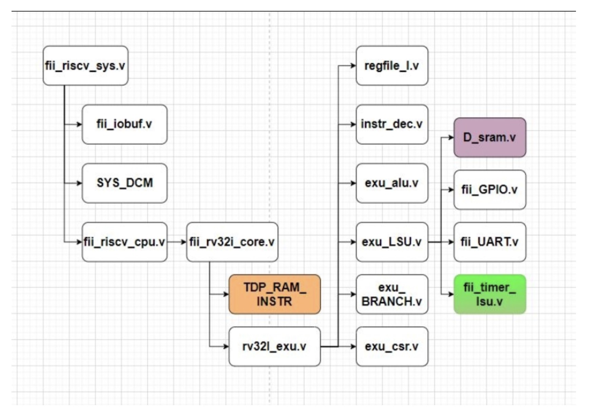
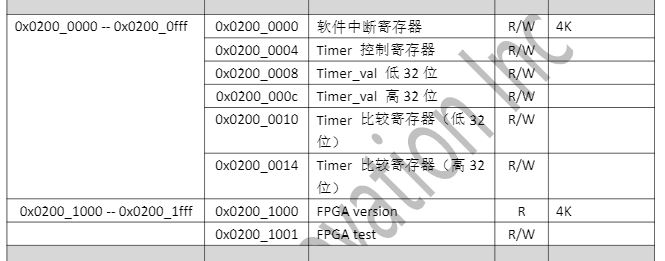
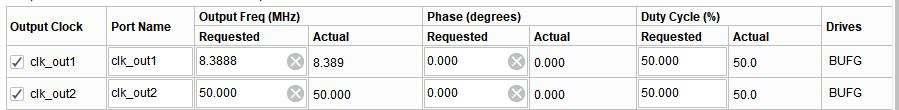

# RISC-V 定时器及中断

来源：https://www.icfedu.cn/?s=RISC-V+%E5%AE%9A%E6%97%B6%E5%99%A8%E5%8F%8A%E4%B8%AD%E6%96%AD

## 一、读写定时器中断寄存器

### 1、读定时器中断寄存器

之前在[RISC-V LSU，SRAM，GPIO模块（1）exu_lsu](https://www.icfedu.cn/archives/7742)模块中介绍过exu_lsu模块可以让RISC-V CPU访问外设模块，本文将介绍之前没有提到的exu_lsu模块下的子模块fii_timer_lsu。



首先，参考[FII RISC-V Address Map](https://www.icfedu.cn/archives/7952)上对定时器中断(timer interrupt)有关的寄存器定义，如图1所示。可以看到有定时器控制寄存器，定时器值的低32位和高32位寄存器，及定时器比较值的低32位和高32位寄存器。其相关读(load)的代码在exu_lsu模块中，见下面代码：

图1 定时器中断寄存器



```verilog
parameter [ 31: 0 ] TMR_BASEADDR = 32'h0200_0000//计时器中断寄存器基地址参数
wire t_sft_cs   = ( i_D_PC[ 31: 16 ] == TMR_BASEADDR[ 31: 16 ] ) ? 1'b1 : 1'b0;//定时器有关的寄存器片选
wire sft_cs     = t_sft_cs & ( ( ~i_D_PC[ 12 ] ) & ( i_D_PC[ 5: 2 ] == 0 ) );
wire tm_ctrl_cs = t_sft_cs & ( ( ~i_D_PC[ 12 ] ) & ( i_D_PC[ 5: 2 ] == 1 ) );//定时器控制寄存器片选
wire t_cs0 = t_sft_cs & ( ( ~i_D_PC[ 12 ] ) & ( i_D_PC[ 5: 2 ] == 2 ) );//定时器值的低32位寄存器片选
wire t_cs1 = t_sft_cs & ( ( ~i_D_PC[ 12 ] ) & ( i_D_PC[ 5: 2 ] == 3 ) );//定时器值的高32位寄存器片选
wire tcmp_cs0 = t_sft_cs & ( ( ~i_D_PC[ 12 ] ) & ( i_D_PC[ 5: 2 ] == 4 ) );//定时器比较值的低32位寄存器片选
wire tcmp_cs1 = t_sft_cs & ( ( ~i_D_PC[ 12 ] ) & ( i_D_PC[ 5: 2 ] == 5 ) );//定时器比较值的高32位寄存器片选

wire [ 31: 0 ] ls_rb_d_t_sft = sft_cs     ? o_sft_int_v ://根据片选信号，确定要读的寄存器
                             ( tm_ctrl_cs ? o_tm_ctrl :
                                  ( t_cs0 ? i_timer_l :
                                  ( t_cs1 ? i_timer_h :
                               ( tcmp_cs0 ? o_tcmp_l :
                               ( tcmp_cs1 ? o_tcmp_h : o_CPU_dout ) ) ) ) );


wire [ 31: 0 ] ls_rb_d = mem_cs ? mem_dout : ( GPIO_cs ? rb_GPIO_d : ( UART_cs ? o_UART_dout : ls_rb_d_t_sft ) );//根据片选信号，确定要读的寄存器


always@( * )//省略了该代码块的部分代码
begin
if ( i_LOAD )
begin //&mem_init_rdy
    case ( i_load_instr ) // i_load_instr ={rv32i_lbu, rv32i_lb, rv32i_lhu, rv32i_lh, rv32i_lw};
    5'b00001:
    begin //rv32i_lw
        o_wb_data <= ls_rb_d;
    end
    5'b00010:
    begin //rv32i_lh
        o_wb_data <= { { 16{ ls_rb_d[ 15 ] } }, ls_rb_d[ 15: 0 ] };
    end
    5'b00100:
    begin //rv32i_lhu
        o_wb_data <= { { 16{ 1'b0 } }, ls_rb_d[ 15: 0 ] };
    end
    5'b01000:
    begin //rv32i_lb
        o_wb_data <= { { 24{ ls_rb_d[ 7 ] } }, ls_rb_d[ 7: 0 ] };
    end
    5'b10000:
    begin //rv32i_lbu
        o_wb_data <= { { 24{ 1'b0 } }, ls_rb_d[ 7: 0 ] };
    end
default: ;

endcase
end
```

### 2、写定时器中断寄存器

定时器中断寄存器的写(store)是在fii_timer_lsu模块中完成的。通过从外层模块exu_lsu中引进的写使能信号，以及各个片选信号等，选择相应要写的寄存器。代码如下：

```verilog
wire [31: 0] cpu_data_in = i_rs2_val << {i_D_PC[1:0],3'b000};//exu_lsu模块中的cpu_data_in最后传递给了i_sft_timer_din

always@( posedge clk or negedge rst_n )
if ( !rst_n )//复位
begin
    o_tm_ctrl <= 0;//初始值
    o_sft_int_v <= 0;
    o_timer_l <= 0;
    o_timer_h <= 0;
    o_tcmp_l <= 0;
    o_tcmp_h <= 16'h8000;
    o_timer_valid <= 0;
end
else
begin
    o_timer_valid <= 0;

    if ( i_tmr_sft_we )//写使能信号
    begin
        if ( i_tcs0 )//定时器值的低32位寄存器片选
        begin
            o_timer_l <= i_sft_timer_din;//写进定时器值的低32位寄存器
            o_timer_valid[ 0 ] <= 1'b1;
        end

        if ( i_tcs1 )//定时器值的高32位寄存器片选
        begin
            o_timer_h <= i_sft_timer_din;//写进定时器值的高32位寄存器
            o_timer_valid[ 1 ] <= 1'b1;
        end

        if ( i_tcmp_cs0 )//定时器比较值的低32位寄存器片选
            o_tcmp_l <= i_sft_timer_din;//写进定时器比较值的低32位寄存器

        if ( i_tcmp_cs1 )//定时器比较值的高32位寄存器片选
            o_tcmp_h <= i_sft_timer_din;//写进定时器比较值的高32位寄存器

        if ( i_tm_ctrl_cs )//定时器控制寄存器片选
            o_tm_ctrl <= i_sft_timer_din;//写进定时器控制寄存器
    end
end

```

## 二、定时器中断产生

### 1、fii_irq_clint

在写进定时器中断相关寄存器后，由模块exu_lsu向上一级级输出，最后在fii_riscv_cpu内传递给fii_irq_clint模块。irq表示interrupt request，意为中断请求。clint为core level interrupt，意为核心级中断。这里，该模块只产生两个中断请求，软件中断和定时器中断。因为软件中断比较简单，只需要写入软件中断寄存器就能发送软件中断请求，这里不做多的讨论。

fii_irq_clint接收到和定时器中断有关的信号后，直接传递给了下一级模块，fii_clint_top。fii_irq_clint代码如下：

```verilog
module fii_irq_clint
(
    input sys_clk,//系统时钟

    input [ 31: 0 ] i_sft_int_v,//软件中断寄存器

    input [ 31: 0 ] i_timer_l,//定时器低32位寄存器
    input [ 31: 0 ] i_timer_h,//定时器高32位寄存器

    output [ 31: 0 ] o_timer_l,//输出现在的定时器低32位寄存器
    output [ 31: 0 ] o_timer_h,//输出现在的定时器高32位寄存器

    input [ 31: 0 ] i_tcmp_l,//比较定时器低32位寄存器
    input [ 31: 0 ] i_tcmp_h,//比较定时器高32位寄存器

    input [ 1: 0 ] i_timer_valid,//两个bit分别控制定时器的低/高32位寄存器
    input [ 31: 0 ] i_tm_ctrl,//定时器控制寄存器

    output clint_tmr_irq,//输出定时器中断请求
    output clint_sft_irq,//输出软件中断请求

    input l_clk,//低频时钟
    input rst_n//复位信号
);

fii_clint_top u_fii_clint_top (
    .sys_clk       ( sys_clk ),

    .i_sft_int_v   ( i_sft_int_v ),
    .i_timer_l     ( i_timer_l ),
    .i_timer_h     ( i_timer_h ),

    .o_timer_l     ( o_timer_l ),
    .o_timer_h     ( o_timer_h ),

    .i_tcmp_l      ( i_tcmp_l ),
    .i_tcmp_h      ( i_tcmp_h ),

    .i_timer_valid ( i_timer_valid ),
    .i_tm_ctrl     ( i_tm_ctrl ),

    .l_clk         ( l_clk ),
    .o_mtip        ( clint_tmr_irq ),
    .o_msip        ( clint_sft_irq ),

    .rst_n         ( rst_n )
);


endmodule
```

### 2、fii_clint_top

在这个模块内，除了继续将有关定时器中断信号传给下一层模块fii_clint外，这里还做了一个l_clk的分频。从时钟的IP核可知，有两个主要使用的时钟频率，分别是50 MHz和8.3888 MHz，如图1所示。这里主要将50MHz的时钟作为系统时钟，也就是很多模块中出现的sys_clk。而8.3888 MHz的时钟则是上层模块fii_irq_clint引进来的l_clk。fii_clint_top代码如下：

图1 CPU时钟IP核



```verilog
module fii_clint_top (
    input sys_clk,//系统时钟

    input l_clk,//低频时钟

    input [31:0] i_sft_int_v,
    input [31:0] i_timer_l,//定时器低32位寄存器
    input [31:0] i_timer_h,//定时器高32位寄存器

    output [31:0] o_timer_l,//输出现在的定时器低32位寄存器
    output [31:0] o_timer_h,//输出现在的定时器高32位寄存器

    input [31:0] i_tcmp_l,//比较定时器低32位寄存器
    input [31:0] i_tcmp_h,//比较定时器高32位寄存器

    input [1:0] i_timer_valid,//两个bit分别控制定时器的低/高32位寄存器
    input [31:0] i_tm_ctrl,//定时器控制寄存器

    output o_mtip,//输出定时器中断请求
    output o_msip,//输出软件中断请求

    input rst_n//复位信号
);


reg [7:0] rtc_r = 0;
always @ (posedge l_clk)//在低频时钟下继续分频
rtc_r <= rtc_r + 1;

reg rtc_sys = 0;
always @ (posedge sys_clk )//在高速系统时钟下抓取宽信号(128倍宽的rtc_r信号)
rtc_sys <= rtc_r[7];


reg [1:0] rtc_toggle = 0;
always @ (posedge sys_clk or negedge rst_n)//在系统时钟下
if(!rst_n) rtc_toggle <= 0;
else if(i_tm_ctrl[31])//如果控制寄存器有效
begin
    rtc_toggle <= {rtc_toggle[0], rtc_sys};//抓取rtc_sys的移位信号
end

wire rtcTick = (rtc_toggle == 2'b01) ? 1'b1 : 1'b0;//如果rtc_sys有上升沿，rtcTick即拉高(256倍分频达到32.768 kHz)


fii_clint u_fii_clint (
    .sys_clk       ( sys_clk ),

    .i_sft_int_v   ( i_sft_int_v ),
    .i_timer_l     ( i_timer_l ),
    .i_timer_h     ( i_timer_h ),

    .o_timer_l     ( o_timer_l ),
    .o_timer_h     ( o_timer_h ),

    .i_tcmp_l      ( i_tcmp_l ),
    .i_tcmp_h      ( i_tcmp_h ),

    .i_timer_valid ( i_timer_valid ),
    .i_tm_ctrl     ( i_tm_ctrl ),

    .o_mtip        ( o_mtip ),
    .o_msip        ( o_msip ),
    .i_rtcTick     ( rtcTick ),

    .rst_n         ( rst_n )
);

endmodule
```

### 3、fii_clint

真正产生中断请求的信号是发生在fii_clint模块下，代码如下：

```verilog
module fii_clint
(
    input sys_clk,//系统时钟

    input [ 31: 0 ] i_sft_int_v,
    input [ 31: 0 ] i_timer_l,//定时器低32位寄存器
    input [ 31: 0 ] i_timer_h,//定时器高32位寄存器

    output [ 31: 0 ] o_timer_l,//输出现在的定时器低32位寄存器
    output [ 31: 0 ] o_timer_h, //输出现在的定时器高32位寄存器

    input [ 31: 0 ] i_tcmp_l,//比较定时器低32位寄存器
    input [ 31: 0 ] i_tcmp_h,//比较定时器高32位寄存器

    input [ 1: 0 ] i_timer_valid,//两个bit分别控制定时器的低/高32位寄存器
    input [ 31:0 ] i_tm_ctrl,//定时器控制寄存器

    output o_mtip,//输出定时器中断请求
    output o_msip,//输出软件中断请求

    input i_rtcTick,//32.768 kHz时钟

    input rst_n//复位信号
);

reg [ 31: 0 ] time_l;
reg [ 31: 0 ] time_h;
wire [ 63: 0 ] timer;
wire [ 31: 0 ] timecmp_l;
wire [ 31: 0 ] timecmp_h;
wire ipi_0; //soft interrupt

//生成定时器中断请求的条件：定时器寄存器的值是否超过比较定时器寄存器的值
assign o_mtip = ( { time_h, time_l } >= { timecmp_h, timecmp_l } ) ? 1'b1 : 1'b0;
assign o_msip = ipi_0;
assign timer  = { time_h, time_l } + 64'h1;//定时器寄存器 + 1 计数


always @( posedge sys_clk or negedge rst_n )
if ( !rst_n )
begin
    time_l <= 32'h0;
end
else
begin
    if ( i_timer_valid[ 0 ] )//低位bit控制定时器的低32位寄存器
        time_l <= i_timer_l;
    else if ( i_rtcTick & i_tm_ctrl[0]) // 在32.768 kHz的时钟和控制寄存器有效时
        time_l <= timer[ 31: 0 ];//锁存，使上面的定时器计数有效
end


always @( posedge sys_clk or negedge rst_n )
if ( !rst_n )
begin
    time_h <= 32'h0;
end
else
begin
    if ( i_timer_valid[ 1 ] )//高位bit控制定时器的高32位寄存器
        time_h <= i_timer_h;
    else if ( i_rtcTick & i_tm_ctrl[0])// 在32.768 kHz的时钟和控制寄存器有效时
        time_h <= timer[ 63: 32 ];//锁存，使上面的定时器计数有效
end


//写进比较定时器寄存器的值

assign timecmp_l = i_tcmp_l;
assign timecmp_h = i_tcmp_h;

assign ipi_0     = i_sft_int_v[ 0 ];//输出

assign o_timer_l = time_l;//输出
assign o_timer_h = time_h;//输出

endmodule
```

