# RISC-V 通用寄存器和指令

来源 1：https://www.icfedu.cn/

来源 2：https://ica123.com

## 一、通用寄存器和汇编指令分类

### 1、RISC-V通用寄存器和程序计数器

**CPU中包含32个通用寄存器，有时候也会被称为通用寄存器文件，如图1所示。通用寄存器的命名方式为X0-X31**。其中第一个寄存器X0的值，被硬连线到0，因此值永远是0。其他寄存器X1-X31都是可读可写的。0-31也叫做索引号，索引号也可以理解为寄存器的地址，当指令需要调用通用寄存器时可以通过索引号查找。之后将会在介绍FPGA程序时讲解如何设计读写寄存器文件。对于32位系统，所有通用寄存器的宽度都是32bit，寄存器总个数也是32个。

**PC(program counter)是程序计数器，也是一个寄存器**。在CPU中PC寄存器并不和上述32个通用寄存器在一起，寄存器文件中不包含PC。PC的宽度和通用寄存器的宽度一样。XLEN的值一般跟RISC-V CPU架构有关系。 如果是32位架构的CPU，那么XLEN的值就是32。图1中XLEN-1 = 32-1 =31，即在一个通用寄存器中的最高位为31。在64位CPU中通用寄存器的宽度是64，同时PC宽度也是64位，最高位为64-1 =63。

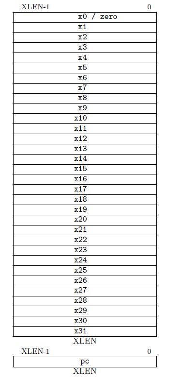

### 2、RISC-V汇编指令类型

RV32I 可被分为六种基本指令格式：

1. 用于寄存器-寄存器操作的**R**类型指令
2. 用于立即数和访存load操作的**I** 型指令
3. 用于访存store操作的**S**型指令
4. 用于条件跳转操作的**B**类型指令
5. 用于长立即数的**U**型指令
6. 用于无条件跳转的**J**型指令

图2列出来6种基本指令的机器码格式。

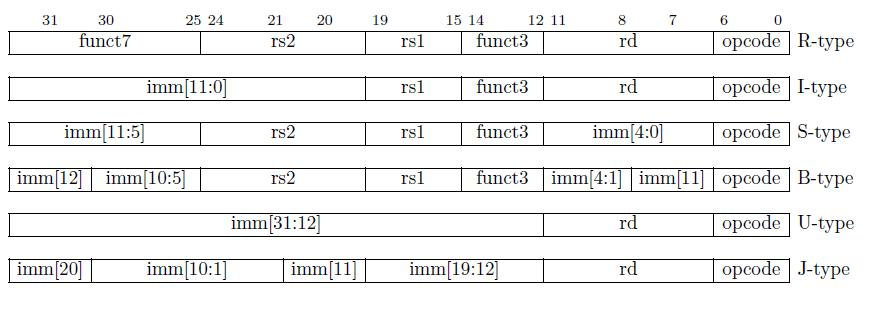

#### R-Type

**R-type是无立即数(immediate number，imm，无须从寄存器中取值，就能立即得到的数)的操作**。R-type汇编指令机器码的二进制格式如图2所示。一条二进制指令长度是32-bit。bit 0-6(7个bit)是opcode (operation code) 操作码，用来标识出指令的类型，图3是部分R-type 汇编指令的opcode，可以看到R-type指令所有的opcode都是相同的，为011_0011。但是在bit 12-14的funct3和bit 25-31的funct7是不一样的，并以此来区分不同的R-type汇编指令。也就是说，opcode决定指令的大致分类，funct3和funct7决定指令更细致的分类。R-type指令的Bit 7-11是rd(destination register，目的寄存器)的索引号。rd寄存器是用来存储结果的寄存器。rs1(source register 1)和rs2(source register 2)叫做源寄存器，多数情况下指令需要读取这两个源寄存器寄存器的值，用于之后的运算。rs1的索引号在bit 15-19，rs2的索引号在bit 20-24。下面对如何使用寄存器索引号进行举例说明。

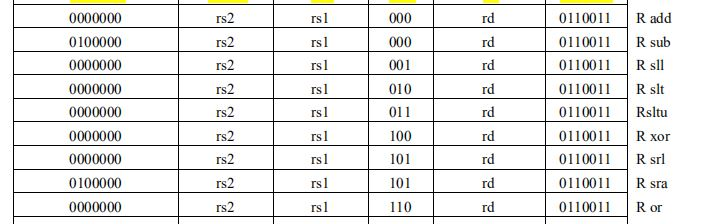

当在指令中rd的位置索引号的值为5’b00011，也就是十进制的3时。CPU收到这条指令后会检测到bit 7-11的值是3，就会在32个通用寄存器中找到X3寄存器作为rd寄存器，最后把结果写到x3寄存器里。如果此时在rs1 和rs2的索引号位置(二进制汇编指令)中bit 15-19 和bit 20-24的值是2和4，CPU会检测到在指令中rs1，rs2对应的通用寄存器是x2和x4后，就会从寄存器x2和x4中读取值并进行运算。

**注意：**

**RISC-V汇编指令的格式是非常明晰的。在实际编码过程中，编码位置的安排都是有意义的。例如3个寄存器索引号在不同指令格式中的编码位置是永远不变的，Rd在bit 7-11，rs1在bit 15-19，rs2在bit 20-24。即使有些指令中可能没有用到部分寄存器，比如第二个指令类型I-type中没有rs2，但是rs1和rd的索引号也在对应的位置上。又例如在S-type里funct3在bit 12-14，与在R-type中的位置一致。Opcode是所有指令格式都有的，而且位置不变，永远都是bit 0-6。**

#### I-Type

从R-type汇编指令的机器码格式基础上看，唯一差别是，I-type的bit 20-31(高12位)是一个立即数。其它部分与R-type很相似。当然，I-type的opcode一定与其它种类汇编指令的opcode值不同，因为对应的具体运算不同。

#### S-Type

S-type指令的特点是没有rd寄存器，在该类指令中立即数(imm)被分成了两个部分，imm[11:5]在bit 25-31，imm[4:0]在bit 7-11。imm[4:0]这5位占用了rd的位置，说明该指令格式不需要回写。imm[11:5]占用了funct7的位置。

#### U-Type

U-type指令中提供了一个20位的立即数(imm[31:12]，将20位立即数左移12位)。最后的运算结果与20位立即数相关，并把结果回写到rd寄存器。Opcode决定其运算种类。 U-type中没有funct3，rs1，rs2和funct7，这种类型的指令结构非常简单。

#### B-Type

B-type指令主要作为跳转指令使用，并且是带条件跳转(conditional jump)，也就是通过判断条件是否成立来决定是否跳转，可以类比为verilog语言里的if语句。在图2中可以看到B-type的机器码结构，指令中不包含rd寄存器和funct7，但是包含rs1，rs2，funct3和立即数。立即数被分为两个区域，imm[12|10:5]和imm[4:1|11]。B-type指令立即数的编码是打乱顺序的，原因这里将不详细介绍，主要是为了增大与其他格式的共用部分。但是编码被打乱了，那么在CPU执行时要进行调整相应的译码顺序，且译码后CPU需要把打乱的立即数按照顺序还原。

#### J-Type

该指令格式非常类似于U-type，也是只有Rd寄存器和立即数以及opcode。同时J-type的立即数也是打乱的。那就意味着在译码时CPU要先把立即数按顺序拼起来以还原本来的立即数。

---

**注意：**

**B-type指令的立即数字段是在S-type的基础上旋转了一位，同样的，J-type的立即数字段是在U-type基础上旋转了12位。因此RISC-V实际上只有四种基本格式，但可以保守的认为有六种格式 [2]。因为B-type和J-type的立即数都没有bit 0位，所以它们的立即数都是2的整数倍。**

**机器码全为0或者全为1的情况被认为是非法的RV32I指令，但是它们会被经常用来帮助调试或捕捉常见的错误 [2]。**

---

什么是立即数

立即数通常是指在[立即寻址方式](https://baike.baidu.com/item/立即寻址方式/6686429)指令中给出的数。可以是8位、16位或32位，该数值紧跟在[操作码](https://baike.baidu.com/item/操作码/3220418)之后。如果立即数为16位或32位，那么，它将按“高高低低”的原则进行存储。

```assembly
MOV AH, 80H　
ADD AX, 1234H　
MOV ECX, 123456H
MOV B1, 12H　
MOV W1, 3456H　
ADD D1, 32123456H
```

其中：B1、W1和D1分别是字节、字和双字单元，为第一操作数（目的操作数）

以上指令中的第二操作数（源操作数）（80H、1234H）都是立即数

在汇编语言中，规定：立即数不能作为指令中的第一操作数（目的操作数）。该规定与高级语言中“**赋值语句赋值语句的左边不能是常量**”的规定相一致。

立即数寻址方式通常用于对通用寄存器或内存单元赋初值。

## 二、I-Type整数寄存器-立即数指令

本文将先从I-type的整数寄存器指令开始，详细介绍每一种汇编指令包括的具体指令。


**除了CSR指令之外，所有出现的立即数都是有符号位扩展的，并且通常是在指令中最左边的可用位上 [1]**。如图1所示，

所有出现立即数的指令种类(I-type，S-type，B-type，U-type和J-type)，立即数的符号扩展都取决于指令的bit 31(也是立即数的最高位，比如J-type的imm[20])。

所以I-type中提到的立即数都是有符号位扩展的。

这里举例解释一下带符号位扩展，比如有一个12位立即数，

如果最高位是0，则表示立即数是正数，

如果最高位为1，表示立即数是负数。正数带符号扩展时高20位全部填充上0，负数带符号扩展时高20位全部填充上1，之后再进行相加或比较。而无符号扩展时，高20位都是填充0。

绝大多数整数计算指令对保存在整数寄存器中的XLEN位进行操作(RV32I里对应的整数寄存器为32位)。**整数计算指令**要么使用I-type指令为寄存器-立即数操作，要么使用R-type指令为寄存器-寄存器操作。

I-type对应的opcode被命名为OP-IMM，

I-type对应的immediate，固定为12位，被命名为I-immediate，如图2所示。

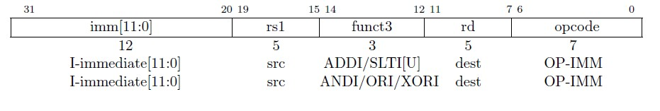

I-type总共有15条指令，这里先介绍前6条指令，包括以下：

1. ADDI
2. SLTI
3. SLTIU
4. ANDI
5. ORI
6. XORI

### ADDI & MV & NOP

ADDI指令格式为

```assembly
ADDI rd，rs1，immediate
# x[rd] = x[rs1] + sext(imm)
```

举例说明：

```assembly
ADDI x13，x12，5
```

将x12寄存器里的值加上**有符号扩展**的立即数5，并将结果放置进x13寄存器里。

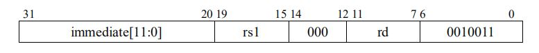

可以看到，其机器码如图3所示，ADDI的

OP-IMM为001_0011

funct3为000

immediate为12’b0000_0000_0101

rs1为 5’b0_1100

rd为 5’b0_1101

所以**ADDI x13，x12，5**对应的机器码为0000_0000_0101_01100_000_01101_0010011，对应的16进制为32’h0056_0693

经过译码后，只要机器码opcode和funct3对应的位置为001_0011和000，那么这条指令一定为addi。ADDI中“ADD”表示加法，“I”表示立即数，“ADDI”全称意为立即数加法。该指令是把rs1寄存器中的值和**有符号位扩展**的立即数相加，之后把相加得到的结果存到rd里去(溢出的部分忽略。溢出处理可以由软件实现，[这里](https://www.icfedu.cn/archives/9518)介绍如何处理)。

这里要引入一个概念，“伪指令(pseudo-instruction)”，伪指令是指在汇编指令集里不存在的指令。这些指令对于汇编用户来说表达方便，而且经常使用。

---


- 例如汇编程序中经常会出现寄存器之间的搬移，就有了伪指令MV(move)，指令书写格式：

```assembly
MV rd，rs1
```

这个指令是把rs1里的值搬移到rd中去(x86中就有move指令，mcs-51里也有这条指令)。

其实际代表的含义是`ADDI rd，rs1`，0  也就是说把rs1寄存器中的值，跟后面的立即数值0加起来，最后存到rd寄存器中。因为rs1加零后rs1的值不变，所以MV指令实际上就是把rs1的值移动到rd里。用户在写汇编程序的时候可以写这样一条伪指令MV，在程序编译时编译软件会把这条指令翻译成`ADDI rd，rs1，0`，随后把ADDI这条指令送到CPU运行。

- 还有一条使用频率高的伪指令，NOP(no operation，无操作)，指令书写格式：NOP

```assembly
NOP
```

其实际代表的含义是 `ADDI x0，x0，0`  之前有提到过，x0的值无法改写，只能读取，且永远为0，那么 `ADDI x0，x0，0`做了一次无结果的加法，将x0 + 0的结果放入x0，其唯一作用是将PC值推进。

### SLTI

SLTI指令格式为

```assembly
SLTI rd，rs1，immediate

# x[rd] = x[rs1] <𝑠 sext(immediate)
```

其机器码如图4所示，SLTI的OP-IMM为001_0011，funct3为010。SLTI中S代表set置位

作用是**有符号比较**rs1和**经过符号扩展的立即数**后置位rd。把rd寄存器中的值，置成0或1。这里需要注意的是指令中判断条件成立则置位为1，条件不成立置位为0。这条指令的置位条件是LT：less than，小于。I代表立即数。所以判断条件是rs1的值是是否小于立即数。SLTI全称为set if less than immediate。

指令示例：

```assembly
SLTI x13，x12，5
```

比较x12寄存器和立即数5(**有符号扩展**后为5)，如果x12寄存器里的数小于5(**有符号数比较**)，将x13置成1。

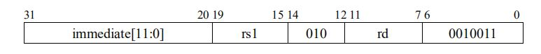

### SLTIU & SEQZ

SLTIU指令格式为

```assembly
SLTIU rd，rs1，immediate

# x[rd]= x[rs1] <𝑢 sext(immediate)
```

其机器码如图5所示，SLTIU的OP-IMM为001_0011，funct3为011。

SLTIU与SLTI的唯一区别是“U”代表unsigned number(无符号数)，不同之处在于将立即数**有符号扩展**，当作**无符号数**比较后置位。如果对8位二进制数进行比较。-1：8’b1111_1111 , -2：8’b1111_1110。当作为有符号数比较时-2 < -1，如果作为无符号数比较依然成立，但是如果用-2和+1：8’b0000_0001进行无符号数比较。此时1111_1110 > 0000_0001。(254 > 1)。

指令示例：

```assembly
SLTIU x13，x12，-1
```

比较x12寄存器和立即数-1(**有符号扩展**后0xffffffff)，如果x12寄存器里的数小于0xffffffff(**无符号数比较**)，将x13置成1。

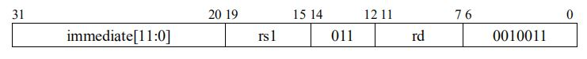

- 伪指令SEQZ(set if equal to zero，如果等于0，就进行置位)：`SEQZ rd，rs1` (等价于`SLTIU rd，rs1，1`)，该伪指令是SLTIU中的一个特殊情况，会被经常使用。因为无符号数中rs1比“1”小的情况只有一种，那就是rs1 = 0， 所以如果SLTIU rd，rs1，1成立，也可以看作是SEQZ rd，rs1 中 rs1 = 0成立。

```assembly
SEQZ rd，rs1
```

### ANDI

ANDI指令格式为

```assembly
ANDI rd，rs1，immediate
# x[rd] = x[rs1] & sext(immediate)
```

其机器码如图6所示，ANDI的OP-IMM为001_0011，funct3为111。用法是将立即数进行**符号位扩展**成32位跟rs1进行按位相与(&)，结果写到rd中。

指令示例：

```assembly
ANDI x13，x12，5
```

将x12寄存器中的数与有符号位扩展后的立即数5按位与，并将结果写入x13寄存器。

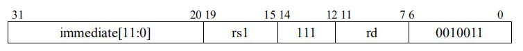

### ORI

ORI指令格式为

```assembly
ORI rd，rs1，immediate
# x[rd] = x[rs1] | sext(immediate)
```

其机器码如图7所示，ORI的OP-IMM为001_0011，funct3为110。用法是将立即数按**有符号数扩展**成32位跟rs1进行按位或(or)，结果写到rd中。

指令示例：

```assembly
ORI x13，x12，5
```

将x12寄存器中的数与**有符号位扩展**后的立即数5按位或，并将结果写入x13寄存器。

### XORI & NOT

XORI指令格式为

```assembly
XORI rd，rs1，immediate
# x[rd] = x[rs1] ^ sext(immediate)
```

其机器码如图8所示，XORI的OP-IMM为001_0011，funct3为100。用法是将立即数按**有符号数扩展**成32位跟rs1进行按位异或(xor)，结果写到rd中。

指令示例：

```assembly
XORI x13，x12，5
```

将x12寄存器中的数与**有符号位扩展**后的立即数5按位异或，并将结果写入x13寄存器。

- 伪指令NOT：`NOT rd，rs1` (等同于`XORI rd，rs1，12’hfff)`。NOT是取反指令，作用是把rs1中的值取反放到rd中去。因为1和任何数异或都是取反，比如 1 xor 0 = 1， 1 xor 1 = 0，所以12‘hfff符号扩展之后与rs1异或的值就是相当于取反。

```assembly
NOT rd，rs1
```

---

**注意:**

**RISC-V指令具有灵活性。以上指令中机器码格式都没有强制规定rs1，rd是某一固定的寄存器，用户在写汇编程序时可以根据需要，在32个通用寄存器中挑选相应的寄存器来作为rs1和rd，rs1和rd甚至可以为同一寄存器。**

## 三、I-Type 移位指令

本文将继续介绍I-type中其余的整数寄存器-立即数指令(这里是属于I-type的移位指令)

图1所示为移动次数为立即数的移位指令，后面会介绍其他的移位指令。从机器编码格式上可以看出这三个指令与上文提到的6个I-type指令有些不同，本文的I-immediate被分为两个部分：

- imm[11:5]中的imm[10]（机器码的bit 30）用来**区分移位类型**，其中SLLI和SRLI指令机器码的bit 30为0，而SRAI指令机器码的bit 30为1 [1]。

- imm[4:0]或shamt[4:0]（shift amount）意为**移动量**，可以看到SLLI，SRLI和SRAI的shamt的范围都是[4:0]，这是因为在RV32I中，最大的移位量是31位，也就是2^5 – 1。

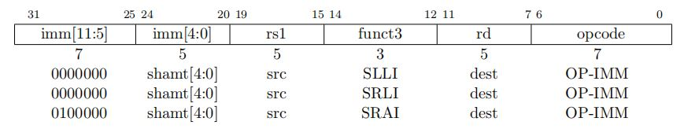

### SLLI

SLLI(shift left logical immediate)，**立即数逻辑左移**指令格式为 

```assembly
SLLI rd，rs1，shamt
# x[rd] = x[rs1] ≪ shamt
```

其机器码如图2所示，SLLI的OP-IMM为001_0011，funct3为001，IMM[10]为0。移动多少位由imm[4:0]来决定。该指令将rs1中的值左移shamt[4:0]，rs1的低位补零，结果写入rd中。

示例：

```assembly
SLLI x13，x12，3
```

将x12寄存器中的值左移3位，并将结果写入x13寄存器中。

OP-IMM为001_0011

funct3为001

shamt为5’b0_0011

bit 25-31 为7’b000_0000

rs1为 5’b0_1100

rd为 5’b0_1101

所以**SLLI x13，x12，3**对应的机器码为0000000_00011_01100_001_01101_0010011，对应的16进制为32’h0036_1693

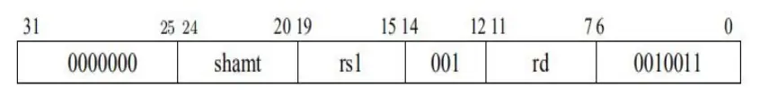

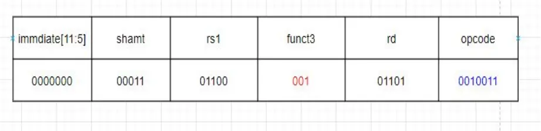

### SRLI

SRLI(shift right logical immediate)，**立即数逻辑右移**指令格式为 

```assembly
SRLI rd，rs1，shamt
# x[rd] = x[rs1] ≫𝑢 shamt
```

其机器码如图3所示，SRLI的OP-IMM为001_0011，funct3为101，IMM[10]为0。该指令将rs1中的值右移shamt[4:0]位，rs1的高位补零，结果写入rd中。

示例：

```assembly
SRLI x13，x12，5
```

x12寄存器中的值右移5位，并将结果写入x13中


### SRAI

SRAI(shift right arithmetic immediate)，**立即数算术右移**指令格式为 

```assembly
SRAI rd，rs1，shamt
# x[rd] = x[rs1] ≫𝑠 shamt
```

其机器码如图4所示，SRAI的OP-IMM为001_0011，funct3为101，IMM[10]为1。该指令将rs1中的值右移shamt[4:0]位，rs1的高位由原rs1[31]填充(符号位填充)，结果写入rd中。

示例：

```assembly
SRAI x13，x12，3
```

将x12寄存器中的值算术右移3位，并将结果写入x13中

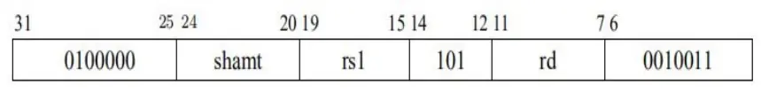

**注意：**

**SRLI，SRAI的OP-IMM和funct3编码皆相同，由imm[10]的值区别指令 [1]。**

### 区分算术右移和逻辑右移

`>>>` 逻辑右移

`>>` 算术右移

**逻辑右移就是不考虑符号位**，右移一位，左边补零即可

**算术右移需要考虑符号位**，右移一位，若符号位为1，就在左边补1；否则，就补0，所以算术右移也可以进行有符号位的除法，右移n位就等于除2的n次方

例如，8位二进制数11001101分别右移一位

- 逻辑右移就是[0]1100110
- 算术右移就是[1]1100110

注意区分算术右移和逻辑右移，例如1100_1100(这里以8-bit数进行说明，RV32I中寄存器中实际存储的数为32-bit)，

1100_1100算术右移三位，结果为**111**1_1001

0011_0011算术右移三位，结果为**000**0_0110

1100_1100逻辑右移三位，结果是**000**1_1001

0011_0011逻辑右移三位，结果为**000**0_0110

## 四、U-Type整数寄存器-立即数指令

**这里介绍的两条U-type指令中的AUIPC不再是操作通用寄存器(x0-x31)，而是对程序计数器(program counter，PC)进行操作**。

图5是LUI和AUIPC的机器码格式，将其与I-type的机器码进行比较，可以看到该类型没有rs1和funct3，取而代之的是一个20位的立即数(I-type中12位立即数的位置包含在内)。

注意U-type中的指令opcode是不相同的。与I-type相同的，U-type对应的immediate，固定为20位，被命名为U-immediate[31:12]，如图5所示。

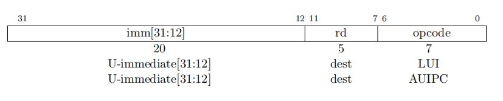

### LUI

LUI(load upper immediate)，高位立即数加载指令格式为 

```assembly
LUI rd，immediate
# x[rd] = sext(immediate[31:12] << 12)
```

其机器码如图6所示，LUI的opcode为011_0111。该指令是**把U-immediate写入rd的高20位，rd的低12位补零**。

指令示例，

```assembly
LUI x8，0xf0000
```

将0xf000_0000加载进x8寄存器中

opcode为011_0111

rd为5’b01000

immediate[31:12]为1111_0000_0000_0000_0000

其对应的32位机器码为1111_0000_0000_0000_0000_01000_0110111，用16进制化简后得到32’hF000_0437

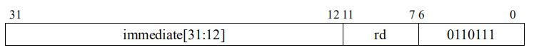

### AUIPC

AUIPC(add upper immediate to PC)，**PC加立即数**指令格式为 

```assembly
AUIPC rd，immediate
# x[rd] = pc + sext(immediate[31:12] << 12)
```

其机器码如图7所示，AUIPC的opcode为001_0111。该指令是**将20位的立即数符号扩展后，左移12位，和当前的PC相加，结果写入rd寄存器**。

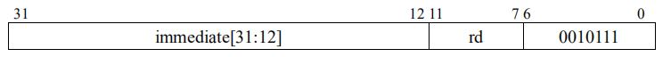

指令示例：

```assembly
AUIPC x12，0xf00
```

将0xf0_0000加上当前的PC，加载进x12寄存器中。

---

**注意：**

**大多立即数很小或需要所有XLEN位。 RISC-V选择了非对称立即拆分(常规指令中为12位，再加上20位特殊的上载立即指令，比如LUI)，以增加可用于常规指令的操作码空间 [1]。**

**AUIPC和JALR(后续文章会进行介绍)中的12位立即数的组合可以将控制权转移到任何32位PC相对地址，而AUIPC加上常规加载或存储指令中的12位立即数偏移量可以访问任何32位PC相对的数据地址。**

**当前的PC可以通过将AUIPC的U-immediate设置为0来获得。**

## 五、R-Type整数寄存器-寄存器指令

RV32I定义了几种算术R-type运算。 **所有操作都将rs1和rs2寄存器作为源操作数读取，并将结果写入寄存器rd**，注意R-type指令没有立即数，只有寄存器rs1，rs2和rd。

funct7和funct3字段选择操作类型，如图1所示。

R-type一共有10条指令，opcode名称为OP，值为011_0011(所有的R-type指令的opcode都相同)。

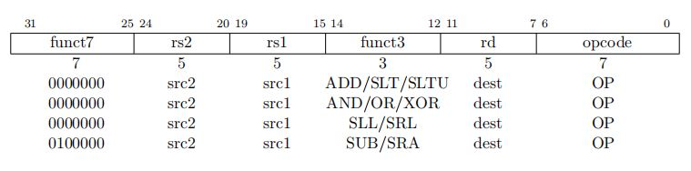

### ADD

ADD指令与ADDI指令的操作原理类似，唯一区别是原本是12位立即数的位置，拆分为了7位的funct7和5位的rs2。

ADD指令格式为

```assembly
ADD rd，rs1，rs2
# x[rd] = x[rs1] + x[rs2]
```


如图2所示，ADD指令的funct7为000_0000，funct3为000。该指令是将rs1 + rs2的结果写入rd中。注意：不是由机器码位置的bit 15-19和bit 20-24相加，而是索引号对应的寄存器的值相加。

与ADDI类似，溢出的部分忽略(溢出处理可以由软件实现，[这里](https://www.icfedu.cn/archives/9518)介绍如何处理)，只将低XLEN位写入rd。

加法溢出的举例为，两个8位二进制有符号数相加，0100_0000（64） + 0111_0000（112） = 1011_0000(-80)，结果明显是错误的。

指令示例：

```assembly
ADD x14，x12，x13
```

将x12和x13寄存器中的数相加，并将结果放入x14寄存器中。

OP-IMM为011_0011

funct3为000

funct7为7’b000_0000

rs2为5’b0_1101

rs1为 5’b0_1100

rd为 5’b0_1110

所以**ADD x14，x12，x13** 对应的机器码为0000000_01101_01100_000_01110_0110011，对应的16进制为32’h00d6_0733

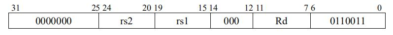


### SLT

同样，SLT与SLTI类似，SLT指令格式为

```assembly
SLT rd，rs1，rs2
# x[rd] = x[rs1] <𝑠 x[rs2]
```

如图3所示，SLT指令的funct7为000_0000，funct3为010。rs1和rs2当作**有符号数**进行比较, 如果rs1 < rs2, rd置1，否则置0。

指令示例：

**SLT x14，x12，x13**

将x12和x13寄存器中的数当作**有符号数**进行比较，如果x12寄存器中的数小于x13寄存器中的数，将x14寄存器中的数置为1，否则置为0。

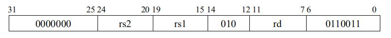

### SLTU

SLTU的指令格式为

```assembly
SLTU rd，rs1，rs2
# x[rd] = x[rs1] <𝑢 x[rs2]
```

如图4所示，SLTU指令的funct7为000_0000，funct3为011。**无符号比较**rs1和rs2，如果rs1 < rs2，rd置1，否则置0。

注意，在SLTU rd，x0，rs2中如果rs2不等于0，则rd被置为1，否则，将rd置为0。对应的伪指令为**SNEZ rd，rs2**

指令示例：

```assembly
SLTU x14，x12，x13
```

将x12和x13寄存器中的数当作**无符号数**进行比较，如果x12寄存器中的数小于x13寄存器中的数，将x14寄存器置为1，否则置为0。

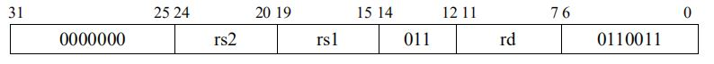

### AND

AND的指令格式为

```assembly
AND rd，rs1，rs2
# x[rd] = x[rs1] & x[rs2]
```

如图5所示，AND指令指令的funct7为000_0000，funct3为111。该指令将rs1 & rs2的结果写入rd中，“&”**表示rs1与rs2逐位相与**。

指令示例：

```assembly
AND x14，x12，x13
```

将x12和x13寄存器中的数按位与的结果写入x14寄存器。

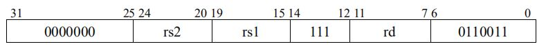

### OR

OR的指令格式为

```assembly
OR rd，rs1，rs2
# x[rd] = x[rs1] | x[rs2]
```

如图6所示，OR指令的funct7为000_0000，funct3为110。该指令将rs1 | rs2的结果写入rd中，“|”表示rs1与rs2逐位相或。

指令示例：

```assembly
OR x14，x12，x13
```

将x12和x13寄存器中的数按位或的结果写入x14寄存器。

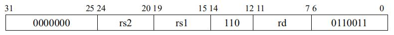

### XOR

XOR的指令格式为

```assembly
XOR rd，rs1，rs2
# x[rd] = x[rs1] ^ x[rs2]
```

如图7所示，XOR指令的funct7为000_0000，funct3为100。该指令**将rs1 按位异或 rs2**的结果写入rd中。

指令示例：

```assembly
XOR x14，x12，x13
```

将x12和x13寄存器中的数按位异或的结果写入x14寄存器。

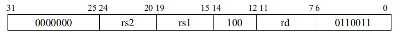

### SLL

SLL(shift left logical，**逻辑左移**)的指令格式为

```assembly
SLL rd，rs1，rs2
# x[rd] = x[rs1] ≪ x[rs2]
```

如图8所示，SLL指令的funct7为000_0000，funct3为001。该指令将rs1 左移rs2(该寄存器中的值)位，空出的位置填0，结果写入rd寄存器。rs2寄存器中低5位为有效移动位数(最多可移动2^5 – 1 = 31位)，其高位被忽略。

指令示例：

```assembly
SLL x14，x12，x13
```

将x12左移，左移的位数由x13寄存器中存储数的低5位(高位被忽略)决定，空出的位置填入0，并将结果写入x14寄存器。

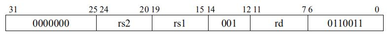

### SRL

SRL(shift right logical，**逻辑右移**)的指令格式为

```assembly
SRL rd，rs1，rs2
# x[rd] = x[rs1] ≫𝑢 x[rs2]
```

如图9所示，SRL指令的funct7为000_0000，funct3为101。该指令将rs1 右移rs2(该寄存器中的值)位，空出的位置填0，结果写入rd寄存器。rs2寄存器中低5位为有效移动位数(最多可移动2^5 – 1 = 31位)，其高位被忽略。

指令示例：

```assembly
SRL x14，x12，x13
```

将x12右移，右移的位数由x13寄存器中存储数的低5位(高位被忽略)决定，空出的位置填入0，并将结果写入x14寄存器。

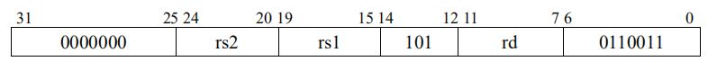

### SRA

SRA(shift right arithmetic，**算术右移**)的指令格式为

```assembly
SRA rd，rs1，rs2
# x[rd] = x[rs1] ≫𝑠 x[rs2]
```

如图10所示，SRA指令的funct7为010_0000，funct3为101。该指令将rs1 右移rs2(该寄存器中的值)位，空出的位置由rs1寄存器值中的**最高位(rs1[31])**填充，结果写入rd寄存器。rs2寄存器中低5位为有效移动位数(最多可移动2^5 – 1 = 31位)，其高位被忽略。

指令示例：

```assembly
SRA x14，x12，x13
```

将x12右移，右移的位数由x13寄存器中存储数的低5位(高位被忽略)决定，空出的位置填入**rs1寄存器中存储数的最高位(符号位)**，并将结果写入x14寄存器。

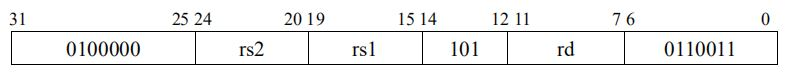

**注意：以上三条移动指令中，rs1寄存器的值只是被复制了，原值保持不变**

### SUB

SUB的指令格式为

```assembly
SUB rd，rs1，rs2
# x[rd] = x[rs1] − x[rs2]
```

如图11所示，SUB指令的funct7为010_0000，funct3为000。该指令将rs1寄存器中的值减去rs2寄存器中的值，并忽略算数溢出。

指令示例：

```assembly
SUB x14，x12，x13
```

将x12寄存器中存储的数减去x13寄存器中存储的数，并将结果写入x14寄存器(忽略算数溢出)。

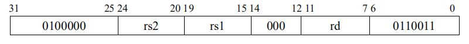

## 六、条件和无条件跳转指令

RV321中控制转移指令主要有两类：无条件跳转和有条件跳转。

### 1、无条件跳转

无条件跳转指令均使用PC相对寻址。无条件跳转主要包括两条指令：JAL 和 JALR

#### JAL

JAL指令是用J-type格式(JAL是RV321中唯—J-type的指令）。

JAL的指令格式为

```assembly
JAL rd, offset
# x[rd] = pc+4; pc += sext(offset)
```

其机器码格式如图1所示。其opcode为110_1111。**该指令把下一条指令的地址(PC ＋ 4)存入rd寄存器中，然后把PC设置为当前值加上符号位扩展的偏移量**

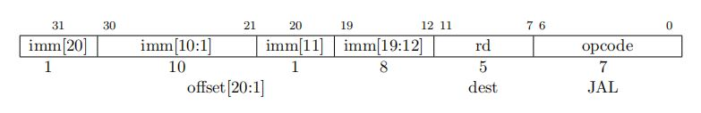

注意偏移量是带符号扩展的。可以看到偏移量是2字节对齐的(offset [20:1J)，虽然RV321中所有的指令地址都是4字节对齐的，但是JAL还可能被用于 兼容C扩展指令集(详情见RISC-V 简介 （4) RISC-V指令集编码结构中对其的描述），所以就默认offset bit 0为0（即2字节对齐）。

因此，JAL跳转的地址有+/-1MB的范围。（2^21= 2MB = +/-1MB)。

**标准的软件调用约定(calling convention)用x1寄存器作为返回地址寄存器(rd)**，也可以用x5作为备用的链接寄存器(link register)。因为JAL指令中的offset是相对于PC的偏移量，在编写时需要精确的地址差值，且任意添加/删除一条汇编指令JAL中的偏移量可能就需要再次修改，这给JAL指令的使用带来了很大的负担，所以。一般在用JAL指令时，多用JALrd.label而不是JAL rd, offset.

JAL rd, label中的label是标签，用来标注某段程序的位置，为程序中跳转及分支语句提供的跳转入口。编译器会自动计算出标签和当前指令的offset。

示例：

```assembly
JAL x1, main
```

伪指令：`JAL main`，对应的真实指令：`JAL x1， main`
伪指令：`J main`，对应的真实指令：`JAL x0, main`

跳转到main函数，并将下一条指令存在x1寄存器中

**注意**：

x5寄存器被选为备用的链接寄存器有两个原因：

- 在标准调用约定中被用作临时变量
- 它和常规链接器x1只有1bit的区别 0_0001->0_0101

当JAL指令省略rd时，默认rd即为x1

伪指令J中rd为x0


#### JALR

间接跳转指令JALR用I-type编码类型。指令格式为

```assembly
JALR rd, offset(rs1)
```

`t=pc+4; pc=(x[rs1]+sext(offset)) & ~1; x[rd]=t`相当于：

`t=pc+4; pc=(x[rs1]+sext(offset)) & Oxffff_fffe; x[rd]=t` //RV321

其机器码如图2所示，其opcode为110_0111，funct3为000。

该指令将PC设置为rs1寄存器中的值加上符号位扩展的偏移量，把计算出地址的最低有效位设为0，并将原PC ＋ 4的值写入rd 寄存器。如果不需要目的寄存器，可以将rd设置为x0。

JALR的offset也是带符号位扩展的，JALR偏移的地址范国在rs1寄存器中存储地址的+/- 2KB(2^ 12=4096=4KB=+/-2KB)。定义JALR指令是为了使两个指令序列可以在32位绝对地址范国内的任意位置跳转(因为JAL指令的跳转范围不够大）。

示例：

```assembly
JALR x13, 0(x1)
```

跳到x1寄存器里存储的地址，并将下一条指令存在x13寄存器中。

其他伪指令示例：

`JR x1` => `JALR x0, x1, 0`

`RET` => `JALR x0, x1, 0`

`JALR x13` => `JALR x1, x13, 0`

一般来说，LUI和JALR配合使用可以跳转32位绝对地址范围，AUIPC和JALR配合可以跳转32位相对于PC的地址范围

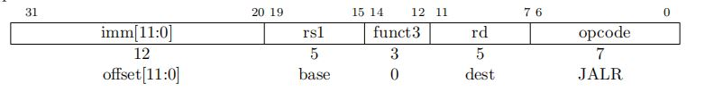

### 2、有条件分支跳转

所有的分支指令都是B-type编码格式，其机器码如图3所示。12位的立即数以2字节的倍数编码带符号的偏移量(offset[12:1]).

虽然RV321中所有的指令地址都是4字节对齐的，但是JAL还可能被用于兼容C扩展指令集，所以就默认offset bit 0为0（即2字节对齐)。

目标地址由分支指令的地址加上符号位扩展的偏移量组成，范围是2^13= 8192=8KB=+/-4KB。与JAL类似，Branch指令常见用法也可以用标签代替偏移量，比如`BEQ rs1, rs2, label`

branch指令机器编码格式

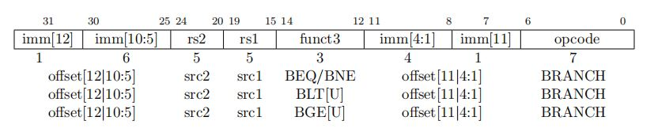

#### BEQ

BEQ(branch if equal，相等时分支)，其指令格式为

```assembly
BEQ rs1, rs2, offset
# if (rs1 ==rs2) pc += sext(offset)
```

如图4所示，其opcode为110_0011，funct3为000。**该指令是判断rs1寄存器和rs2寄存器里的值是否相等，如果相等，将PC**
**的值设为当前值加上符号位扩展的偏移量offset**。

示例：

```assembly
BEQ x12, x13, LOOP
```

比较x12和x13寄存器中的值是否相等，如果相等，跳到LOOP(标签）。

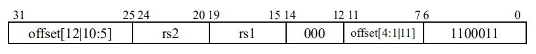

#### BNE

BNE(branch if not equal，不相等时分支），其指令格式为

```assembly
BNE rs1, rS2, offset
# if (rs1 + rs2) pc += sext(offset)
```

如图5所示，其opcode为110_0011，funct3为001。**该指令是判断rs1寄存器和rs2寄存器里的值是否不相等，如果不相等，将**
**PC的值设为当前值加上符号位扩展的偏移量offset**。

示例：

```assembly
BNE x12, ×13, LOOP
```

比较x12和x13寄存器中的值是否相等，如果不相等，跳到LOOP(标签）。

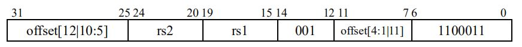

#### BLT

BLT(branch if less than，小于时分支），其指令格式为

```assembly
BLT rs1, rs2 offset
# if (rs1 <s rs2) pc += sext(offset)
```

如图6所示，其opcode为110_0011，funct3为100。**该指令是判断rs1寄存器的值是否小于r$2寄存器里的值**(都视为有符号数），如果是，将PC的值设为当前值加上符号位扩展的偏移量offset。

```assembly
BLT x12, x13, LOOP
```

有符号比较x12和x13寄存器中的值．如果x12寄存器中的值小干x13. 跳到LOOP(标签)

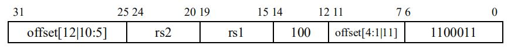

#### BLTU

BLTU(branch if less than， unsigned， 无符号小于时分支)，其指令格式为

```assembly
BLTU rs1， rs2, offset
# if (rs1 <u rs2) pc += sext(offset)
```

如图7所示，其opcode 为110_0011，funct3为110。**该指令是判断rs1寄存器的值是否小于rs2寄存器里的值**(都视为无符号数），如果是，将PC的值设为当前值加上符号位扩展的偏移量offset.

示例：

```assembly
BLTU x12, x13, LOOP
```

无符号比较x12和x13寄存器中的值，如果x12寄存器中的值小于x13，跳到LOOP(标签）。

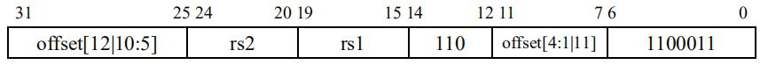

#### BGE

BGE(branch if greater than or equal， 大于等于时分支)，其指令格式为

```assembly
BGE r$1, rs2, offset
# if (rs1 ≥s rs2) pc += sext(offset)
```

如图8所示，其opcode 为110_0011，funct3为101。该指令是**判断rs1寄存器的值是否大于等于rs2寄存器里的值**(都视为有符号
数），如果是，将PC的值设为当前值加上符号位扩展的偏移量offset。

示例：

```assembly
BGE x12, x13, LOOP
```

有符号比较x12和x13寄存器中的值，如果x12寄存器中的值大于等于x13，跳到LOOP(标签）。

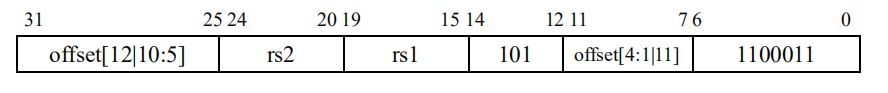

#### BGEU

BGEU(branch if greater than or equal, unsigned，大于等于时分支），其指令格式为

```assembly
BGEU rs1, rs2, offset
# if (rs1 ≥u rs2) pc += sext(offset)
```

如图9所示，其opcode为110_0011，funct3为111。该指令是判断rs1寄存器的值是否大于等于rs2寄存器里的值(都视为无符号数），如果是，将PC的值设为当前值加上符号位扩展的偏移量offset。

```assembly
BGEU x12, x13, LOOP
```

无符号比较x12和x13寄存器中的值，如果x12寄存器中的值大于等于x13，跳到LOOP(标签）。

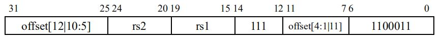

## 七、加载-存储指令

**RV32I是一个加载-存储(load-store)架构。也是只有load和store指令才能访问存储器和外设**(CPU 内的寄存器只能由算术指令操作) [1]。load和store指令将寄存器和存储器/外设的值相互交换。

load指令被编码成I-type，其opcode为0000_011，store指令被编码成S-type，opcode为0100_011，如图1所示。

**有效地址**是由rs1寄存器中的值加上**符号位扩展**的12位立即数(store指令中的立即数被拆分成了两个部分)得到的。

一般来说，**load指令将存储器/外设中有效地址的值复制一份到rd寄存器，store指令将rs2寄存器中的值复制到存储器/外设中的有效地址** [1]。

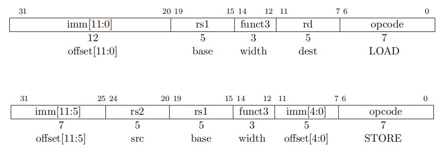

### 1、LOAD指令

#### LW

LW(load word)指令格式为

```assembly
LW rd，offset(rs1)
# x[rd] = sext ( M [x[rs1] + sext(offset) ] [31:0] )
```

其机器码如图2所示，其funct3为010。该指令是**从有效地址中读取四个字节(一个字，word)，并写入rd寄存器**。

指令示例：

```assembly
LW x13，4(x12)
```

在x12寄存器中的数加上4的偏移量对应地址中，读出四个字节，存到x13寄存器中。

opcode为000_0011

funct3为010

immediate为12’b0000_0000_0100

rs1为 5’b0_1100

rd为 5’b0_1101

所以LW x13，4(x12)对应的机器码为0000_0000_0100_01100_010_01101_0000011，对应的16进制为32’h0046_2683

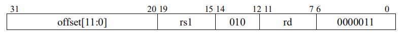

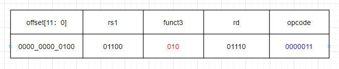

#### LH

LH(load halfword)指令格式为

```assembly
LH rd，offset(rs1)
# x[rd] = sext( M [x[rs1] + sext(offset)] [15:0])
```

其机器码如图3所示，其funct3为001。该指令是**从有效地址中读取两个字节**(半个字，halfword)，经**符号位扩展**后写入rd寄存器。

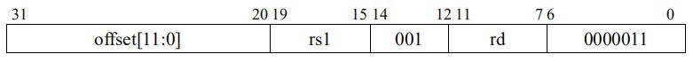

指令示例：

```assembly
LH x13，0(x12)
```

在x12寄存器中的对应地址中，读出两个字节，**经符号位扩展后**，存到x13寄存器中，如下图所示。

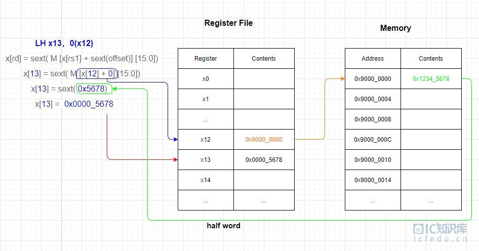

#### LHU

LHU(load halfword，unsigned)指令格式为

```assembly
LHU rd，offset(rs1)
# x[rd] = M[x[rs1] + sext(offset)][15:0]
```

其机器码如图4所示，其funct3为101。该指令是从有效地址中读取两个字节(半个字，halfword)，经**零扩展**后写入rd寄存器。

指令示例：

```assembly
LHU x13，0(x12)
```

在x12寄存器中的对应地址中，读出两个字节，**经零扩展后**，存到x13寄存器中。


#### LB

LB(load byte)指令格式为

```assembly
LB rd，offset(rs1)
# x[rd] = sext( M [x[rs1] + sext(offset)] [7:0])
```

其机器码如图5所示，其funct3为000。该指令是**从有效地址中读取一个字节(byte)**，经**符号位扩展**后写入rd寄存器。

指令示例：

```assembly
LB x13，0(x12)
```

在x12寄存器中的对应地址中，读出一个字节，**经符号位扩展后**，存到x13寄存器中。

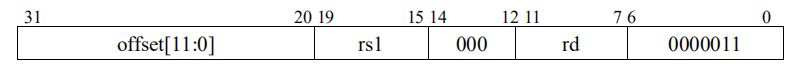

#### LBU

LBU(load byte，unsigned)指令格式为

```assembly
LBU rd，offset(rs1)
# x[rd] = M[x[rs1] + sext(offset)][7:0]
```

其机器码如图6所示，其funct3为100。该指令是**从有效地址中读取一个字节(byte)**，经**零扩展**后写入rd寄存器。

指令示例：

```assembly
LBU x13，0(x12)
```

在x12寄存器中的对应地址中，读出一个字节，**经零扩展后**，存到x13寄存器中。

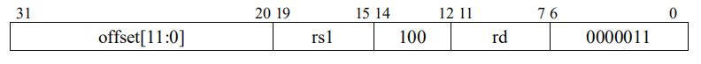

### 2、STORE指令

#### SW

SW(store word)指令格式为

```assembly
SW rs2，offset(rs1)
# M[x[rs1] + sext(offset)]= x[rs2][31: 0]
```

其机器码如图7所示，其funct3为010。该指令是**将rs2寄存器中四个字节(一个字，word)存入有效地址**。

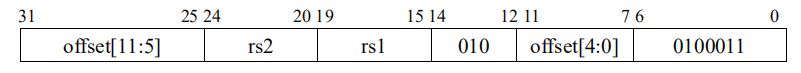

指令示例：

```assembly
SW x13，8(x12)
```

在x12寄存器中的数加上8的偏移量对应地址中，将x13寄存器中四个字节存进去，如下图所示。

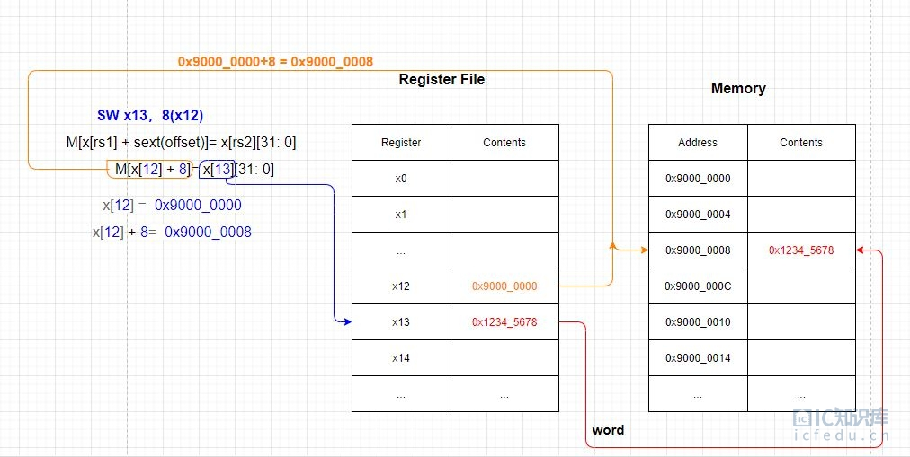

#### SH

SH(store halfword)指令格式为

```assembly
SH rs2，offset(rs1)
# M[x[rs1] + sext(offset)] = x[rs2][15: 0]
```

其机器码如图8所示，其funct3为001。该指令是**将rs2寄存器低位两个字节(半个字，halfword)存入有效地址**。

指令示例：

```assembly
SH x13，0(x12)
```

在x12寄存器中的对应地址中，将x13寄存器中低位两个字节存进去。

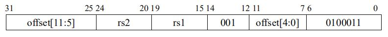

#### SB

SB(store byte)指令格式为

```assembly
SB rs2，offset(rs1)
# M[x[rs1] + sext(offset)]= x[rs2][7: 0]
```

其机器码如图9所示，其funct3为000。该指令是**将rs2寄存器低位字节(byte)存入有效地址**。

指令示例：

```assembly
SB x13，0(x12)
```

在x12寄存器中的对应地址中，将x13寄存器中低位一个字节存进去。

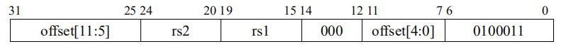

## 八、指令地址对齐和加减法溢出处理

### 1、指令地址对齐

对于load/store指令，数据在内存中的地址应该对齐。

- 如果访存32位数据，内存地址应当与32位的数据对齐，也就是说，D_PC的最低两位应当为0(如果内存存数据以32 bit为单位，表示数据是4个字节对齐的)；
- 如果访存16位数据，内存地址应当与16位的数据对齐，D_PC的最低位应当为0(表示数据是2个字节对齐的)；
- 如果访存8位数据，因为内存的单位是一个字节，即不需要对齐。其具体在CPU设计中如何在硬件中实现见[RISC-V LSU，SRAM，GPIO模块（2）D_sram](https://www.icfedu.cn/archives/7617)模块中对地址移位的处理。

注意：**RISC-V只支持小端格式(little-endian)**。小端格式和大端格式的对比如图1所示。如果使用不同的端序存储同样的32位数0x0A0B0C0D，情况如图所示。

- 小端的最高位字节是0x0A，最低位字节是0x0D；
- 大端的最高位字节是0x0D，最低位字节是0x0A。

如果在用不同端序的系统中数据交流，需要确保传输的数据是以32位数为单位。如果以一个字节为单位，在不同的端序系统中交换数据，可能会出现问题，比如说这里小端的0x0A对应的地址(a + 3)，在大端的系统中，该地址存储的数据是0x0D。

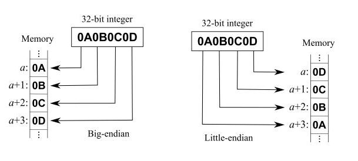

**RISC-V选择以小端格式为端序是因为其目前在商业上占主导地位**。所有的X86-32系统和 Apple iOS，谷歌Android操作系统和微软Windows for ARM都是采用小端格式地址排序(低字节优先序) [2]。

### 2、加减法溢出处理

之前提到过的ADD，ADDI和SUB等指令在计算时可能会出现溢出的情况，一般来说，硬件设计会忽略算数溢出，所以RISC-V依赖于软件的检查。下面举例说明加法如何处理(减法与之类似)：

- 无符号数相加溢出（假设 x6，x7 是无符号数）
  - `ADD x5，x6，x7`
  - `BLTU x5，x6，overflow` (跳转到 结果不正确的处理分支）
  - 解释说明：x5为x6和x7的**和**，如果**和**比其中的**加数**还要小，这说明加法已经溢出，即可以转到处理溢出的分支，overflow
- 有符号数相加，已知imm为正数
  - `ADDI x5，x6，+imm`(正数)
  - `BLT x5，x6，overflow` (跳转到 结果不正确的处理分支）
  - 解释说明：无论x6是正数还是负数，它加上一个正数，得到的结果应该比它本身要大。如果对x5，x6进行有符号比较，x5小于x6，说明加法已经溢出，即可以转到处理溢出的分支，overflow
- 除去上面两种特殊情况，对于一般情况的加法，处理情况如下
  - `(x7 < 0) && (x6 + x7 >= x6) || (x7 >= 0) && (x6 + x7 < x6)`
  - `ADD x5，x6，x7`
  - `SLTI x28，x7，0`
  - `SLT x29，x5，x6`
  - `BNE x28，x29，overflow` (跳转到 结果不正确的处理分支）
  - 解释说明：
    - 如果x7小于0，那么x28为1，那么x6和x7的和应该是小于x6，对x5和x6进行比较，如果x5小于x6，x29为1，如果x5不小于x6，即说明溢出，此时x29为0。x28不等于x29，即可以转到不正确的处理分支
    - 如果x7大于等于0，那么x28为0，同时x6和x7的和应该不小于x6，同样对x5和x6比较，如果x29为1，说明x5小于x6，即说明溢出，x28不等于x29，也会转到不正确的处理分支
  - 或者可以理解为：若 `(x7 < 0) && (x6 + x7 >= x6) || (x7 >= 0) && (x6 + x7 < x6)` 则为不正确的处理分支

 