# RISC-V 扩展寄存器和指令

来源 1：https://www.icfedu.cn/

来源 2：https://ica123.com

## 一、CSR简介

除去之前介绍的32个通用寄存器之外，还有一类扩展寄存器，称为CSR(control and status register，控制和状态寄存器)。顾名思义，这**类寄存器与控制CPU和表明CPU状态相关**。

特权指令除了包括CSR指令外，还有其他的特权指令，这里将介绍6条操作CSR寄存器的CSR指令。

CSR寄存器中有些指定字段行为的定义和缩写，有以下几种[1]：

- WIRI：Reserved Writes Ignored，Read Ignore Values(保留写入忽略，读取忽略值)，

如果对WIRI的区域写操作，写入的值将会被忽略。同样对该区域读出的值也应该被忽略。

- WPRI：Reserved Writes Preserve Values, Reads Ignore Values(保留写入保留值，读取忽略值)

如果对WPRI的区域写操作，预留的值的值将会被保留。同样对该区域读出的值也应该被忽略。

- WLRL：Write/Read Only Legal Values(读写仅合法值)
- WARL：Write Any Values, Reads Legal Values(任意写，读合法值)

这里只做介绍，也不多做讨论。

所有的CSR指令都是每次只能对一个CSR寄存器操作，其机器码如图1所示。

可以看到CSR指令类似于I-type指令。虽然也有12位的立即数域，但是实际上**机器码的bit 20-31是用来 索引相应CSR寄存器的地址**。所以理论上，一共可以实现2^12 = 4096位CSR寄存器。

**按照惯例，CSR地址的高位(CSR[11:8]/机器码的bit 31-28)用于根据权限级别对CSR的读写可访问性进行编码。**

**前两位(CSR[11:10]/机器码的bit 31-30)指示该CSR寄存器是可读可写(00，01或10)还是只读(11)。**

**接下来两位(CSR[9:8]/机器码的bit 29-28)编码表明可以访问该CSR寄存器的最低特权级别 [1]。 00 => user CSR; 01 => supervisor CSR; 10 => hypervisor CSR; 11 => machine CSR**

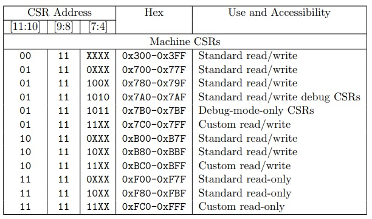

CSR的opcode 是111_0011，被称为SYSTEM。根据不同的funct3，可以确定不同的CSR指令。

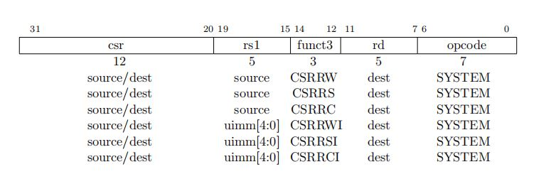

这6条CSR指令又可以分为两类:

- 一类是寄存器操作：CSRRW，CSRRS，CSRRC
- 一类是立即数操作：CSRRWI，CSRRSI，CSRRCI。对于立即数操作的3个指令，5位的立即数被放在了rs1的位置，被称为uimm[4:0]，因为这些立即数是无符号(**u**nsigned **imm**ediate)的。

这6条CSR指令的rd与一般指令的目的寄存器没有差别，位于机器码的bit 7-11，共5位的索引。

常用的CSR寄存器可以分为4组，分别为:

- 用户模式(user mode)
- 监控模式(supervisor mode)
- 超级监控模式(hypervisor mode)
- 机器模式(machine mode)。

机器模式是基础的，所有的RISC-V CPU必须实现的模式。其他三种是可选的。这里将只会介绍机器模式下的CSR寄存器。

## 二、CSR指令

### CSRRW

CSRRW(control and status register read and write，**读后立即写控制状态寄存器**)指令格式为

```assembly
CSRRW rd，csr，rs1
# t = CSRs[csr]; CSRs[csr] = x[rs1]; x[rd] = t
```

其机器码如图2所示，CSRRW的funct3是001。该指令是**把CSR寄存器中的值读出并赋值到rd寄存器中，再把rs1寄存器中的值写入CSR寄存器**。

举例说明：

```assembly
CSRRW x13，mie，x12
```

将mie寄存器里的值读出并赋值给x13寄存器，再把x12寄存器中的值写进mie寄存器

可以看到，其机器码如图2所示，CSRRW的

opcode为111_0011

funct3为001

mie寄存器索引地址为12’b0011_0000_0100

rs1的索引值为 5’b0_1100  //x12

rd的索引值为 5’b0_1101  //x13

所以**CSRRW x13，mie，x12**对应的机器码为0011_0000_0100_01100_001_01101_1110011，对应的16进制为32’h3046_16f3

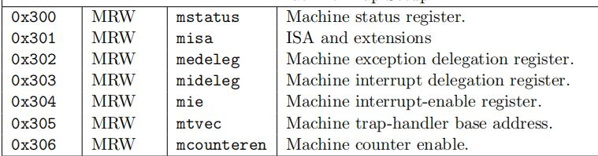

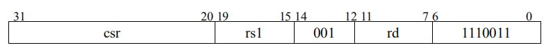

### CSRRS

CSRRS(control and status register read and set，**读后置位控制状态寄存器**)指令格式为

```assembly
CSRRS rd，csr，rs1
# t = CSRs[csr]; CSRs[csr] = t | x[rs1]; x[rd] = t
```

其机器码如图3所示，CSRRS的funct3是010。该指令是**把CSR寄存器中的值读出并赋值到rd寄存器中，且将CSR寄存器中的值和寄存器rs1中的值按位或(bitwise OR)的结果写入CSR寄存器**。

指令示例：

```assembly
CSRRS x13，mie，x12
```

将mie寄存器里面的值读出并赋值给x13寄存器，并将mie寄存器里的值和x12寄存器里的值按位或的结果写入mie寄存器中。


### CSRRC

CSRRC(control and status register read and clear，**读后清除控制状态寄存器**)指令格式为

```assembly
CSRRC rd，csr，rs1
# t = CSRs[csr]; CSRs[csr] = t &~x[rs1]; x[rd] = t
```

其机器码如图4所示，CSRRC的funct3是011。该指令是**把CSR寄存器中的值读出并赋值到rd寄存器中**，且将CSR寄存器中的值和**寄存器rs1中的值取反后**按位与(bitwise AND)的结果写入CSR寄存器。

指令示例：

```assembly
CSRRC x13，mie，x12
```

将mie寄存器里面的值读出并赋值给x13寄存器，并将mie寄存器里的值和x12寄存器里的值取反后按位与的结果写入mie寄存器中。

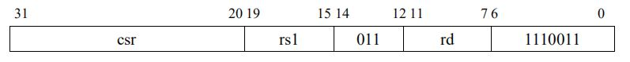

### CSRRWI

CSRRWI(control and status register read and write immediate，**立即数读后写控制状态寄存器**)指令格式为

```assembly
CSRRWI rd，csr，zimm[4:0]
# x[rd] = CSRs[csr]; CSRs[csr] = zimm
```

这里的zimm[4:0]表示高位由0(zero)扩展的立即数。其机器码如图5所示，CSRRWI的funct3是101。该指令是**把CSR寄存器中的值读出并赋值到rd寄存器中，再把五位的零扩展的立即数zimm写入CSR寄存器**。

指令示例：

```assembly
CSRRWI x13，mie，5
```

将mie寄存器里的值读出并赋值给x13寄存器，再把5’b0_0101高位扩展0成32’h0000_0005写进mie寄存器

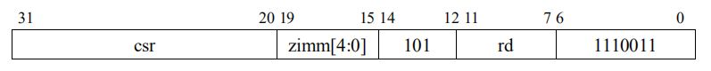

### CSRRSI

CSRRSI(control and status register read and set immediate，**立即数读后设置控制状态寄存器**)指令格式为

```assembly
CSRRSI rd，csr，zimm[4:0]
# t = CSRs[csr]; CSRs[csr] = t | zimm; x[rd] = t
```

其机器码如图6所示，CSRRSI的funct3是110。该指令是**把CSR寄存器中的值读出并赋值到rd寄存器中，且将CSR寄存器中的值和五位的零扩展的立即数zimm按位或(bitwise OR)的结果写入CSR寄存器**(CSR寄存器的第五位及更高位不变)。

指令示例：

```assembly
CSRRSI x13，mie，5
```

将mie寄存器里的值读出并赋值给x13寄存器，再把5’b0_0101高位扩展0成32’h0000_0005和mie寄存器里的值按位或写进mie寄存器

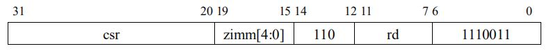

### CSRRCI

CSRRCI(control and status register read and clear immediate，**立即数读后清除控制状态寄存器**)指令格式为

```assembly
CSRRCI rd，csr，zimm[4:0]
# t = CSRs[csr]; CSRs[csr] = t &~zimm; x[rd] = t
```

其机器码如图7所示，CSRRCI的funct3是111。**该指令是把CSR寄存器中的值读出并赋值到rd寄存器中，且将CSR寄存器中的值和五位的零扩展的立即数zimm取反后按位与(bitwise AND)的结果写入CSR寄存器**(CSR寄存器的第五位及更高位不变)。

指令示例：

```assembly
CSRRCI x13，mie，5
```

将mie寄存器里的值读出并赋值给x13寄存器，再把5’b0_0101高位扩展0成32’h0000_0005，取反后为32’hFFFF_FFFA和mie寄存器里的值按位与写进mie寄存器

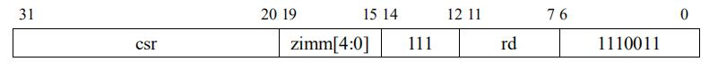

## 三、CSR寄存器

本文将介绍一些机器模式下常见的CSR寄存器。下表是一些CSR寄存器和对应的12位地址。

### mstatus 寄存器

mstatus寄存器有32和64(128)两个版本。这里主要介绍32位的版本。mstatus寄存器中有特定的意义的bit位都有专门的命名。

这里主要介绍**UIE**，**SIE**，**MIE**位。**这三位都用于全局中断使能。当对应的位为1时，全局中断被打开**。

- 其中**UIE**(user mode interrupt enable)为用户模式全局中断使能；
- **SIE**(supervisor mode interrupt enable)为监控模式下全局中断使能；
- **MIE**(machine mode interrupt enable)为机器模式下全局中断使能。

当有中断发生时时，**UPIE/SPIE/MPIE**会存储**UIE/SIE/MIE**进入中断/异常前的值，**UIE/SIE/MIE**的值清零(关闭所有中断)。之所以做一个两级的中断使能栈 [1]，是为支持中断嵌套做准备。**UPP**/**SPP/MPP**用于储存进入中断前特权模式(privilege mode)的值，并最高只能保存到当前特权级别（比如**SPP**只能保存监控模式和用户模式，无法保存机器模式）。**UPP**在mstatus寄存器中没有相应的位，但可以知道用户模式以下的特权模式只有用户模式（用户模式级别最低），所以**UPP**是默认为0。比如**MPP**只支持机器模式，**MPP** = 2’b11。

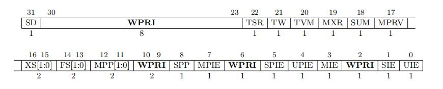

### misa 寄存器

图2所示为misa寄存器的格式。这里最高两位**MXL [1:0]**(machine XLEN，如果是32位架构，即XLEN为32)域是用来指示CPU架构的，**MXL [1:0]**等于如下值时：

1. 01 — CPU为32位架构
2. 10 — CPU为64位架构
3. 11 — CPU为128位架构


misa bit 0-25是**Extension [25:0]**，从位数0-25分别对应英文中26个字母，同时也反映RISC-V中不同架构的支持，如图3所示。比如bit 3的D如果为1，表示该硬件架构支持双精度浮点扩展(double-precision floating-point extension)。

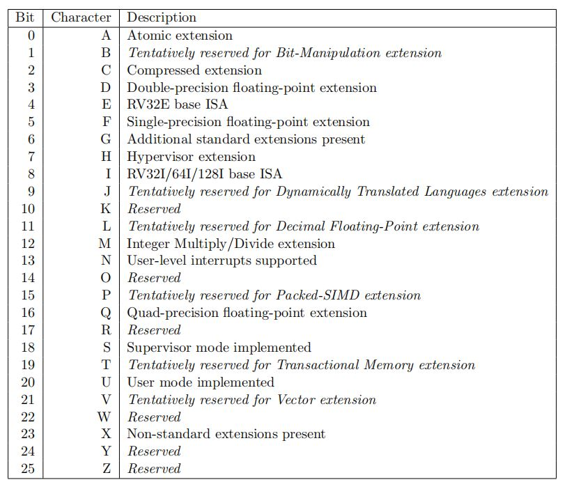

### mie 寄存器

mie(machine interrupt enable)寄存器主要用于**控制局部中断屏蔽，是可读可写的**。主要用的位有：

1. **MSIE**(**SSIE**，**USIE**)：控制软件中断，0 — 屏蔽中断，1 — 开放中断(machine software interrupt enable)
2. **MTIE**(**STIE**，**UTIE**)：控制计时器中断，0 — 屏蔽中断，1 — 开放中断(machine timer interrupt enable)
3. **MEIE**(**SEIE**，**UEIE**)：控制外部中断，0 — 屏蔽中断，1 — 开放中断(machine external interrupt enable)

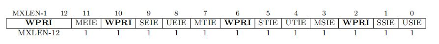

### mip 寄存器

mip(machine interrupt pending)寄存器是**中断悬挂寄存器，只可读**。重要的位有：

1. **MSIP**(**SSIP**，**USIP**)：如果该位被置1，表示软件中断处在中断悬挂状态(machine software interrupt pending)
2. **MTIP**(**STIP**，**UTIP**)：如果该位被置1，表示计时器中断处在中断悬挂状态(machine timer interrupt pending)
3. **MEIP**(**SEIP**，**UEIP**)：如果该位被置1，表示外部中断处在中断悬挂状态(machine external interrupt pending)

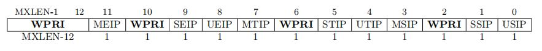

### mtvec 寄存器

mtvec(machine trap-vector base-address register)寄存器用于存储中断或异常入口地址。当系统产生异常或中断，程序将会跳到中断或异常服务子程序。其格式如图6所示。**BASE**域存储入口基地址(一定是4字节对齐，也就是说最后两位默认为0，组合上**BASE**的30位，即可表示32位的地址)。**MODE**域的值表示入口基地址的形式：

1. **MODE** = 2’b00：所有中断或异常的入口地址都由BASE决定
2. **MODE** = 2’b01：异步中断的地址PC = **BASE** + 4 X cause(参见mcause寄存器的描述)

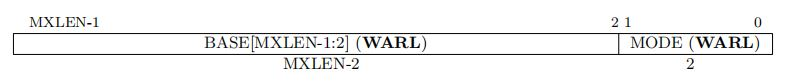

### mcause 寄存器

图7为mcause寄存器的构成，图8为详细的中断/异常代码的解释。mcause寄存器**记录最近一次进入异常或中断事件的原因**，以异常代码(**exception code**)的方式服务于中断或者异常子程序。**Interrupt**表示该事件为异常(1’b0)或是中断(1’b1)。异常代码记录了事件的原因。

举例说明:

- 如果**interrupt**为1，**exception code**为7表示由机器模式计时器产生的中断
- 当mtvec寄存器的**MODE**为2‘b01时，PC = BASE + 4 * 7。

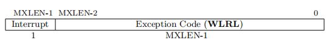

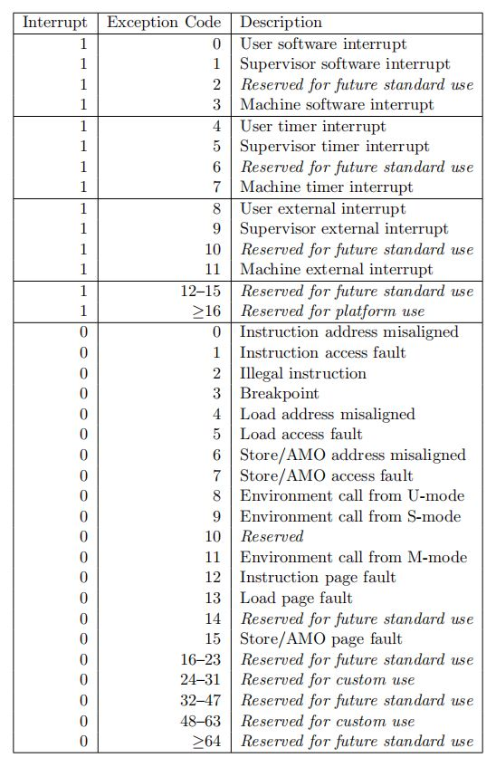

### mvendorid

mvendorid(machine vendor ID)寄存器里存储了32位的只可读JEDEC制造商编号。如果暂时没有商业实现，可以用0来返回读出值。

JEDEC vendor ID 的编码格式通常是由连续字节码和ID字节码组成，如0x7f，0x7f，0x7f，0x7f，0x7f，0x7f，0x7f，0x7f，0x7f，0x7f，0x7f，0x7f，0x8a，由12个连续字节码0x7f与一个ID码0x8a组成，每个字节的最高位为奇校验。将ID中的最高位(奇校验位)去掉，留7位与连续字节的个数0x0C(12)拼起来组成verdor ID, 因此vendor ID为0x60a.

### marchid

marchid(machine architecture ID)寄存器里面存放着CPU架构ID，只可读，如果读出值为0，表示该寄存器没有实现。mvendorid和marchid的组合会定义一个有唯一标识实现的微体系架构。

### mimpid

mimpid(machine implementation ID)寄存器也是只可读，存储有唯一标识的处理器实现版本。

### mhartid

hart表示hardware thread，硬件线程。mhartid(machine hart ID)寄存器为0，表示该架构为单核，如果hartid为1，则该架构为双核系统。

### mepc

mepc全称为machine exception program counter，存储在中断或异常发生时的**准备执行指令**的PC值，将在异常子程序结束时（mret）作为返回地址。该寄存器是可读可写的，进入异常时自动更新。


### mscratch

mscratch寄存器是随机读写的寄存器，可以为异常或者中断子程序提供临时变量空间。

### mcycle

mcycleh(machine cycle counter lower/higher 32 bits)

mcycle和mcycleh寄存器合起来是一个64位的时钟周期计数器，mcycle是低32位，mcycleh是高32位。mcycle和mcycleh寄存器一起反映处理器执行过了多少个时钟周期。这两个寄存器都是可读可写的，按照时钟周期自动计数。 

### minstret

minstreth(machine instructions-retired counter lower/higher 32 bits)

minstret和minstreth寄存器合起来是一个64位的指令执行计数器，minstret是低32位，minstreth是高32位。minstret和minstreth寄存器一起反映处理器执行过了多少个指令。这两个寄存器都是可读可写的，按照指令执行触发自动计数。 

### mtval

mtval(machine trap value register)寄存器在之前被称为mbadaddr，为可读可写寄存器。当进入异常时，mtval 被写入异常的相关信息以帮助软件处理异常。

硬件平台将指定哪些异常必须以信息方式设置 mtval，哪些可以无条件地将其设置为零。mtval 的内容有以下几种写入方式:

1)写入错误的（虚拟）地址：

- 当breakpoint被触发
- 指令获取、加载或存储地址未对齐
- 访问页面错误异常发生时

2)写入第一个故障指令

- 在非法指令发生时:

3)设置为零

- 对于其他异常，但未来的标准可能会重新定义其他陷阱的 mtval 设置