# 流水线 & 硬件模块 & 译码模块

[来源](https://www.icfedu.cn/?s=RISC-V32%E4%B8%AA%E5%AF%84%E5%AD%98%E5%99%A8%E5%92%8C%E8%AF%91%E7%A0%81%E6%A8%A1%E5%9D%97)

## 一、CPU经典五级流水线

经典五级流水线， RISC-V 五级流水线

**在cpu 设计中，经常会使用「流水线设计」， 相对早期的状态机逻辑来说，流水线设计会有效的提高cpu 的效率**。

使用流水线设计，会在现有的生产工艺下，相同系统主频下提高**cpu的效率，通常我们会使用MIPS 和MIPS/Mhz 等标准来衡量**。

 其中MIPS 是指 million instruction per second,表示**每秒多少百万条指令**， 例如 5MIPS 是指每秒500万条指令。 这是一个绝对值，取决于流水线设计的有效性， 分支预测， cpu 主频高低等等。

**MIPS/Mhz 表示 CPU 在每 1MHz 的系统时钟下，运行速度下可以执行多少个MIPS**。如 10MIPS/MHz，表示如果 CPU 运行在 1MHz 的频率下，每秒可执行1000万条指令，如果 CPU 运行在 5MHz 的频率下，每秒可执行五千万条指令。这个参数剔除了系统时钟的参数， 这样就和生产工艺无关， 用来评估cpu 的设计性能， 而不是生产工艺性能。

**流水线的级数越多， 每一级流水线的逻辑就越少，那么生产的时候，时钟的主频就会越高**。 缺点是：流水线级数越多，需要的cpu设计资源越多，cpu 设计也会更加复杂，处理流水冲突的成本越高，同时，相对功耗也会增加。因此，cpu 设计多少级流水线，是由产品的定义（定位）来决定的。

对于一些低功耗，手持，或者移动设备， cpu 设计希望的是待机时间长，产品功耗低， 对于性能不是优先考虑的。这样就可以减少流水线级数，甚至可以使用状态机

### 1、状态机逻辑

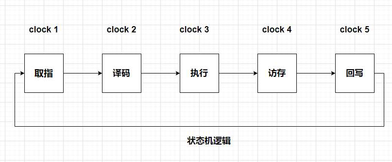

举例：

**ADDI x13，x12，5**对应的机器码为0000_0000_0101_01100_000_01101_0010011，对应的16进制为32’h0056_0693

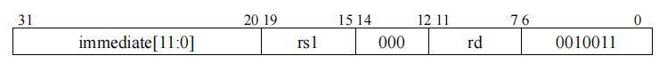

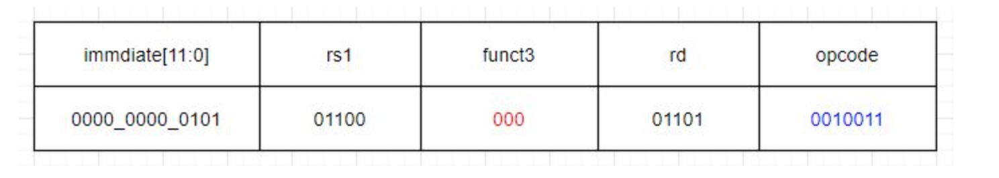

### 2、流水线逻辑

**在经典的流水线设计中，5级流水线是非常有代表性的。 它主要有：**

1）取指IF,     (instruction fetch)

2）译码ID，   (instruction decoder)

3）执行EX，   (execution )

4）访存MEM，(access memory)

5）写回WB    (write back)

5个部分（5级）组成。

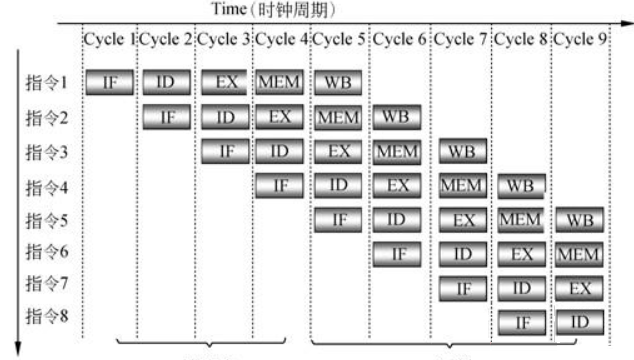

cycle 1 : 第1条指令的**取指**。

cycle 2: 第1条指令的**译码**， 第2条指令**取指**。

cycle 3 : 第1条指令的**执行**， 第2条指令**译码**， 第3条指令**取指**。

cycle 4 : 第1条指令的**访存**， 第2条指令**执行**， 第3条指令**译码**， 第4条指令**取指**。

cycle 5 : 第1条指令的**写回**， 第2条指令**访存**， 第3条指令**执行**， 第4条指令**译码**，第5条指令**取指**。

cycle 6 : 第6条指令的**取指**， 第2条指令**回写**， 第3条指令**访存**， 第4条指令**执行**，第5条指令**译码**。

cycle 7 : 第6条指令的**译码**， 第7条指令**取指**， 第3条指令**写回**， 第4条指令**译码**，第5条指令**执行**。

cycle 8 : 第6条指令的**执行**， 第7条指令**译码**， 第8条指令**取指**， 第4条指令**执行**，第5条指令**访存**。

cycle 9 : 第6条指令的**访存**， 第7条指令**执行**， 第8条指令**译码**， 第9条指令**访存**，第5条指令**写回**。

可以看到， 第一个时钟周期内， 只有1条指令操作被执行； 第二个时钟周期内，有2条指令操作被执行；第三个时钟周期内，有3条指令操作被执行；

第四个时钟周期内，有4条指令操作被执行； 从第五时钟开始， 每个时钟周期，都有5条指令操作被执行。 **这相当于之后的每个时钟周期内，都有一个完整的指令被执行完毕（取指，译码，执行，访存，回写）。这是cpu的效率达到最高值（理想状态）**。 由于cpu 在执行指令时，会遇到跳转， 分支跳转，长周期指令（乘法，除法），长周期访存（flash， ddr等等） 流水线会发生暂停，甚至退出重来等等情况。为了减少暂停，退出情况发生， 各种不同的cpu 都有相应的手段来尽量避免，(哪一个cpu 预测的比较好， cpu 的效率自然就高，但同时也付出资源和功耗为代价）。

#### RISC-V 5级流水线设计

risc-v 也有经典的5级流水线设计，但也有2级，3级，7级，甚至更多级的流水线设计，这取决于公司对产品的定义，riscv 本身并没有规定一定要使用多少级流水线。

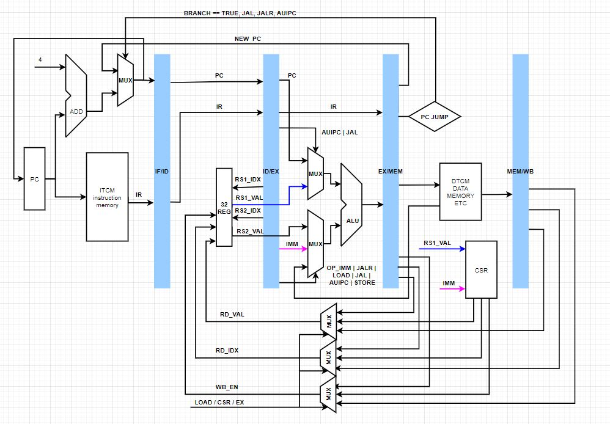

#### 第一级 取指

**取指主要是控制pc** （program counter）一般情况下，每个时钟周期pc = pc + 4; 同时将指令送给译码模块； 但是如果有BRANCH,JAL,JALR,AUIPC ，将修改pc 为这些指令计算出来的值，并且以计算后的pc 为地址， 读取相应地址的指令， 送给译码模块。

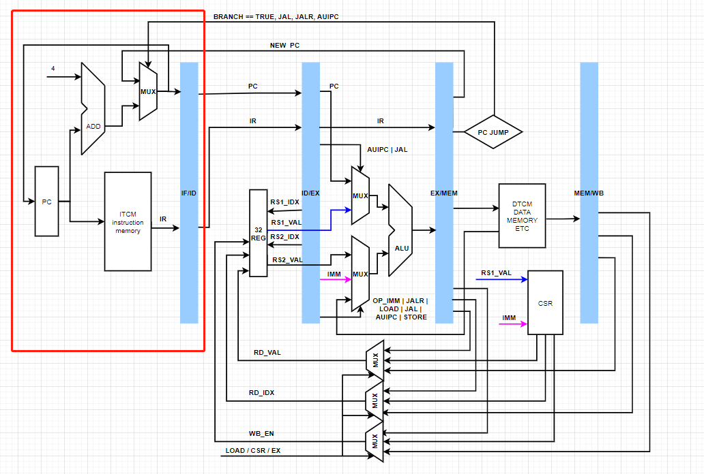

#### 第二级 译码

**译码模块负责从指令中分离出来**：

1）具体是什么指令（ADDI, AND, JAL, LUI 等等）,

2）需要 哪些寄存器配合 下一级的执行操作 （rs1, rs2, rd)

3）load/save 等需要存储器的地址（得到地址中的数据）

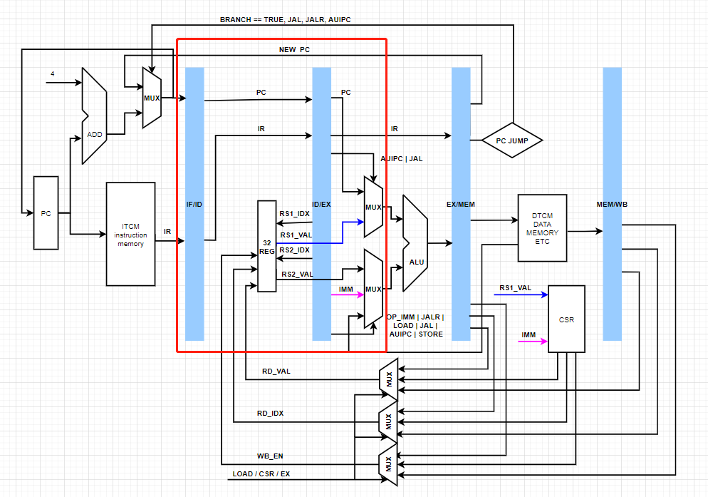

#### 第三级 执行

**根据译码的结果，进行相应的计算**：包括add， xor, or,and, pc 跳转， 分支跳转等等。在变级的流水线（不是固定5级流水线设计中）也可以根据指令直接回写。

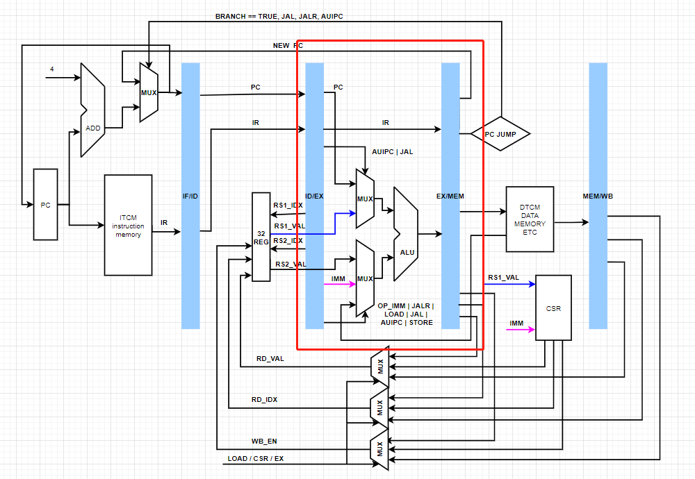

#### 第四级 访存

load, store 等操作 **访问存储器**，或者是csr 寄存器的访问。

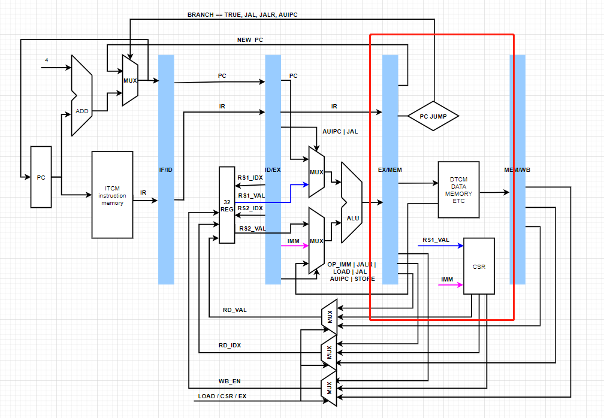

#### 第五级 回写

**将最终的结果回写到32个通用的寄存器中**，完成指令周期的操作。

 流水线可以设计为2级，3级，5级 ，更多级流水线。 但也可以被设计为变级流水线， 根据不同是指令，迅速完成整个指令的操作，从而加快cpu执行速度，

例如 add x2, x3, x4 没有访存，执行后，就可以直接回写了。

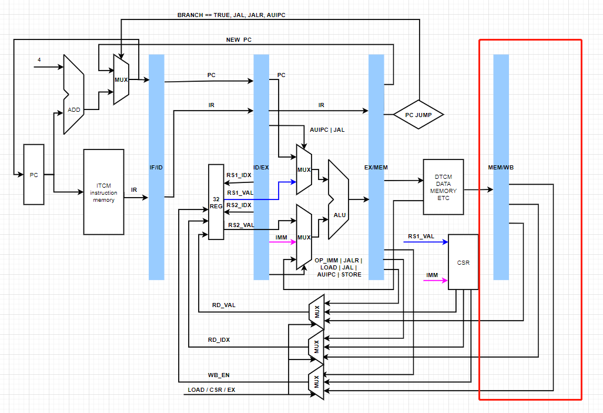

## 二、CPU硬件模块

RISC-V FPGA 设计中， RISC-V 的核心框架模块组成。

### RISC-V cpu 架构

**RISC-V 中cpu 核心设计框架组成结构:**

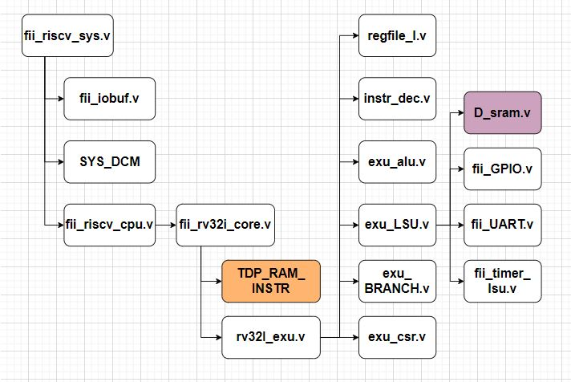

其中：

**fii_cpu_sys.v** : 工程顶层模块

**fii_iobuf.v** ： GPIO 端口 逻辑 模块

**SYS_DCM**: PLL 时钟模块 IP

**fii_riscv_cpu.v**: RISC -V cpu 模块顶层

**fii_rv32i_core.v** ： 状态机逻辑模块（RISC -V）运行模块

**TDP_RAM_INSTR**：程序存储单元(ITCM)

**rv32I_exu.v**: RISC -V cpu 内核模块

**regfile_l.v**: 32个通用寄存器模块

**instr_dec.v**: 指令译码模块

**exu_alu.v**: 执行模块

**exu_LSU.v**: Load/Store 模块

**fii_UART.v**：UART 模块 

**fii_timer_lsu.v**: Timer 模块

**fii_GPIO.v**: GPIO 模块

**D_sram.v**: SRAM DTCM 模块

**exu_BRANCH.v**：分支处理模块

**exu_csr.v**: CSR 寄存器模块

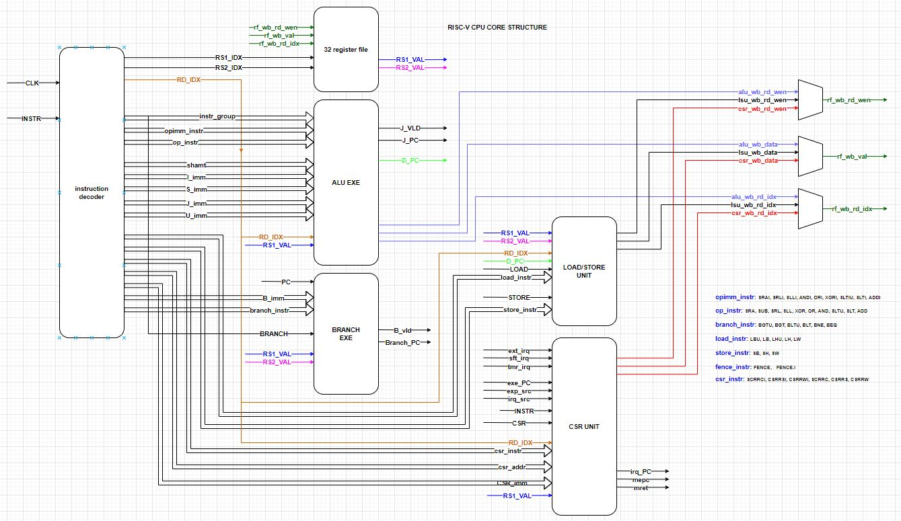

在vivado 工程文件中：

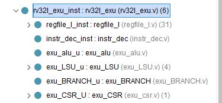

RISC-V 的核心模块组成：

regile_l_inst    ：32个通用寄存器

instr_dec_inst  ：指令译码模块

exu_alu_u   ： 执行模块

exu_LSU_u  ：load/store 外设访存模块

exu_BRANCH_u：条件分支模块

exu_CSR_U：CSR 寄存器模块

### CPU 架构分类

#### 冯诺依曼架构

冯诺依曼架构：也称做普林斯顿架构(Princeton Architecture)。 其结构特点时数据存储器和程序存储器按照**统一的地址编址**，如32位的地址总线，可寻址4G 的地址空间。程序存储器，数据存储器以及外设等**每部分占有4G空间的一个部分，彼此之间互不重叠**。 

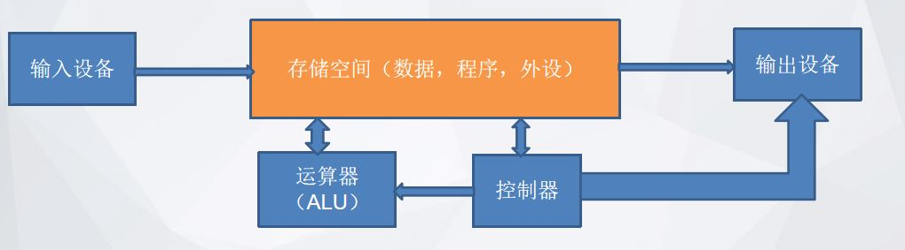

#### 哈弗架构

哈弗架构(Harvard architecture)：哈弗结构不同于冯.诺依曼结构将访问空间线性划分，而是将数据存储器与程序存储器划分为两个独立的寻址空间，自己维护自己的地址空间，最典型的结构莫过于Intel最早推出的8051，16位的地址总线可访问64k空间，但是数据和程序在控制器的协助下，实现数据访问与程序访问的分离，因此访问空间扩大了一倍

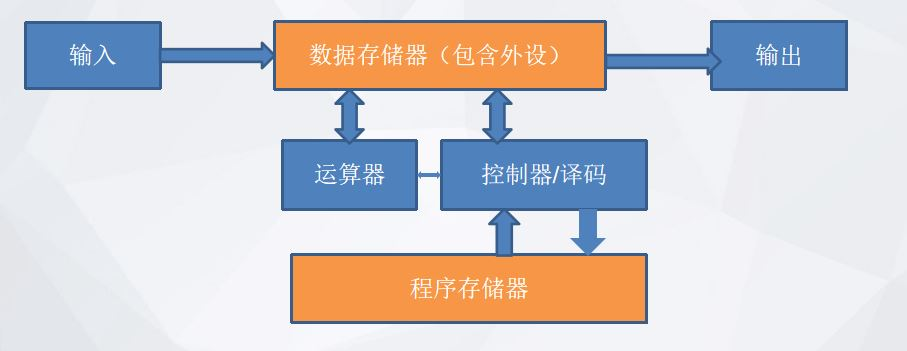

---

**冯.诺依曼结构与哈弗结构的优缺点：**

冯.诺依曼结构：

- 优点：整个访问空间是线性的，整个空间采用统一编码，使用同一个程序计数器PC，因此**对控制器的要求比较低，硬件资源（RTL）开销小于哈弗结构**。

- 缺点：**无法扩展空间范围**，同时由于使用统一的空间编码，在遇到资源冲突时必须**等待冲突**解决才能继续程序的运行，因此**效率较低**。

哈弗结构：

- 优点：由于数据空间与程序空间分离，一次整个访问空间几乎扩大一倍，**不存在程序空间的访问与数据空间访问的冲突**

- 缺点：**控制器复杂**，需要两套PC计数器，硬件开销大

现在的cpu 设计中， 已经不是像早期的cpu 设计那样泾渭分明了， 可能一个cpu 即支持 普林斯顿架构，同时支持哈弗架构。 根据程序，数据的不同， cpu 可以从不同的区域将数据读出，或者写入。

#### FII-RISC-V 架构

目前的fii-riscv v2.01 版本CPU，支持普林斯顿架构， 同时也支持哈弗架构。当然，哈弗架构在执行效率上还是比较高的，绝大部分应用使用的时哈弗架构。但为展示普林斯顿架构的结构，同时在之后的版本会支持JTAG 模块， JTAG 模块使用的也是普林斯顿架构，这种方式。

## 三、寄存器文件

在RISC-V RV32I CPU 核中，需要32个通用的寄存器。这些寄存器是解析riscv 汇编指令的关键部分。


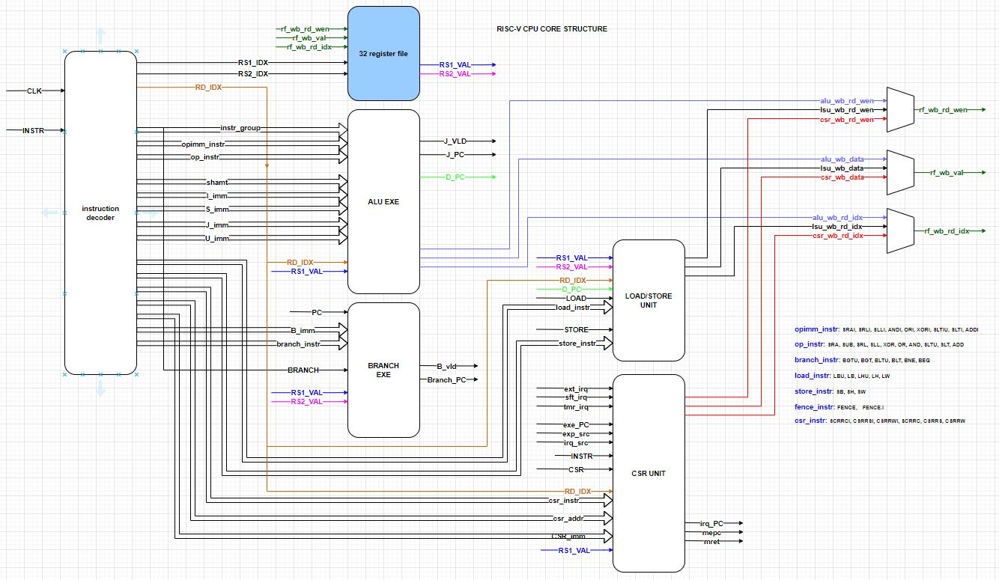

**每一个RV32I 的risc-v 的cpu 中，都有32个通用的寄存器**。 其中X0寄存器 在读取时，永远为‘0’。 写x0 寄存器 时，cpu 硬件可以进行忽略（不做任何处理）。对于RV32E cpu 来说， 可以省略掉x16-x31 这16个通用寄存器，只是保留x0-x15 这16个寄存器，这样的设计可以减少cpu 的尺寸，但并不是非常通用。因为即使是rv32I 的cpu 尺寸也不是很大。

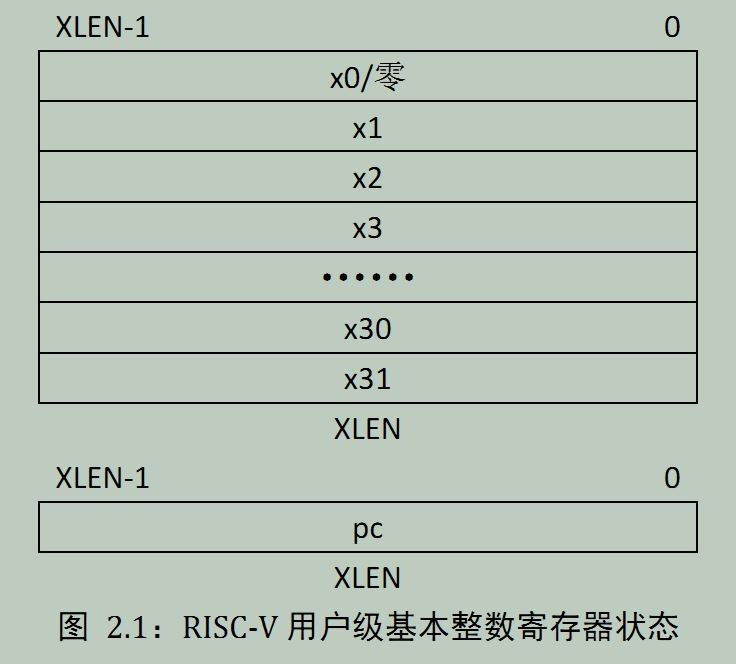

XLEN 是根据riscv 的 设计可以有所不同，对于RV64 来说， XLEN = 64; 对于RV32 来说，XLEN = 32。 我们当前设计的riscv cpu 为RV32I， 所以XLEN = 32。

```verilog
module regfile_I(
input sys_clk,              // 系统时钟

input i_EXE_vld,            // 执行enable 信号

input [ 4: 0 ] i_rs1_idx,   // 汇编指令中的rs1
input [ 4: 0 ] i_rs2_idx,   // 汇编指令中的rs2

output [ 31: 0 ] o_rs1_val, // 汇编指令中的rs1,所对应的32个通用寄存器当中选中的寄存器的值
output [ 31: 0 ] o_rs2_val, // 汇编指令中的rs2,所对应的32个通用寄存器当中选中的寄存器的值

output o_wb_rdy,            // 回写准备好，一直 等于 1
input i_wb_wen,             // 写通用寄存器 信号
input [ 4: 0 ] i_wb_rd_idx, // 汇编指令中的rd,
input [ 31: 0 ] i_wb_val    // 汇编指令中的rd,所对应的32个通用寄存器当中选中的寄存器的值
);

wire [ 31: 0 ] rf_r [ 31: 1 ];
wire [ 31: 1 ] rf_wen;


genvar i;
generate
for ( i = 1; i < 32; i = i + 1 )
begin : REG
    assign rf_wen[ i ] = i_EXE_vld & i_wb_wen & ( i_wb_rd_idx == i ) ;
    fii_dffl #( 32 ) rf_dffl ( rf_wen[ i ], i_wb_val, rf_r[ i ], sys_clk );
end
endgenerate


`ifdef sim
    assign o_rs1_val = ( i_rs1_idx == 0 ) ? 32'b0 :
        ( rf_r[ i_rs1_idx ] == 32'hxxxxxxxx ) ? 32'b0 : rf_r[ i_rs1_idx ];
    assign o_rs2_val = ( i_rs2_idx == 0 ) ? 32'b0 :
        ( rf_r[ i_rs2_idx ] == 32'hxxxxxxxx ) ? 32'b0 : rf_r[ i_rs2_idx ];
`else
    assign o_rs1_val = ( i_rs1_idx == 0 ) ? 32'b0 : rf_r[ i_rs1_idx ];
    assign o_rs2_val = ( i_rs2_idx == 0 ) ? 32'b0 : rf_r[ i_rs2_idx ];
`endif

assign o_wb_rdy = 1'b1;


endmodule
```

input [ 4: 0 ] i_rs1_idx, // 汇编指令中的rs1

input [ 4: 0 ] i_rs2_idx, // 汇编指令中的rs2

output [ 31: 0 ] o_rs1_val, // 汇编指令中的rs1,所对应的32个通用寄存器当中选中的寄存器的值

output [ 31: 0 ] o_rs2_val, // 汇编指令中的rs2,所对应的32个通用寄存器当中选中的寄存器的值

output o_wb_rdy, // 回写准备好，一直 等于 1

input i_wb_wen, // 写通用寄存器 信号

input [ 4: 0 ] i_wb_rd_idx,// 汇编指令中的rd,

input [ 31: 0 ] i_wb_val // 汇编指令中的rd,所对应的32个通用寄存器当中选中的寄存器的值

在代码段中：**写操作**

```verilog
genvar i;
generate
    for ( i = 1; i < 32; i = i + 1 )
        begin : REG
            assign rf_wen[ i ] = i_EXE_vld & i_wb_wen & ( i_wb_rd_idx == i ) ;
            fii_dffl #( 32 ) rf_dffl ( rf_wen[ i ], i_wb_val, rf_r[ i ], sys_clk );
        end
endgenerate
```

fii_dffl 文件代码：

```verilog
module fii_dffl # (
parameter DW = 32
) (
    input ld,
    input [DW-1:0] din,
    output reg [DW-1:0] q = 0,

    input clk
);

 

always @(posedge clk )
if (ld)
     q <= #1 din;

endmodule
```

在代码段中：**读操作**

在读取x0时（不论是rs1，还是rs2 读取x0）， 直接返回0； 其他情况（1-31） 根据寄存器当中的值进行返回。

```verilog
assign o_rs1_val = ( i_rs1_idx == 0 ) ? 32’b0 : rf_r[ i_rs1_idx ];
assign o_rs2_val = ( i_rs2_idx == 0 ) ? 32’b0 : rf_r[ i_rs2_idx ];
```

## 四、指令译码器

RISC-V FPGA 设计中， RISC-V 的核心模块包括指令译码模块。 这个模块的主要功能是：根据当前的PC，对ITCM 输入的机器码进行解析。包括得到相应的汇编语言命令，需要的rs1，rs2寄存器，需要存储的rd 寄存器等

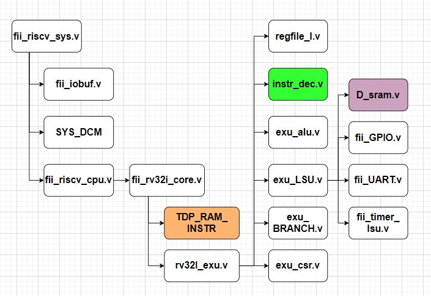

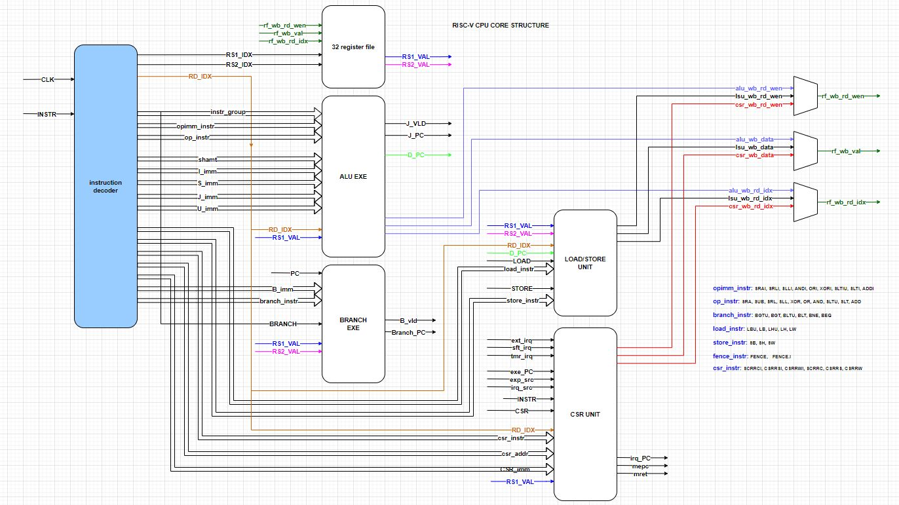

在vivado 工程文件中：

instr_dec 模块 输入为汇编语言的机器码， 输出为：

RS1_IDX: 通用寄存器rs1 索引

RS2_IDX: 通用寄存器rs2 索引

RD_IDX:  通用寄存器RD 索引

instr_group: 包括：OP_IMM, OP, LUI, AUIPC, JAL, JALR, BRANCH, LOAD, STORE, CSR, 等等

opimm_instr: 包括：SRAI, SRLI, SLLI, ANDI, ORI, XORI, SLTIU, SLTI, ADDI

op_instr: 包括：SRA, SUB, SRL, SLL, XOR, OR, AND, SLTU, SLT, ADD

branch_instr: 包括：BGTU, BGT, BLTU, BLT, BNE, BEQ

shamt: 数据位移宽度 I_imm: I-type 立即数

S_imm: S-type 立即数

J_imm: J-type 立即数

U_imm: U-type 立即数

B_imm: B-type 立即数

load_instr: 包括：LBU, LB, LHU, LH, LW

store_instr: 包括：SB, SH, SW

csr_instr: 包括：CSRRCI, CSRRSI, CSRRWI, CSRRC, CSRRS, CSRRW

csr_addr: 选择4096 个csr 寄存器中的一个 CSR_imm: csr 立即数  

### decoder 模块代码

```verilog
module instr_dec
(
input sys_clk,                  // 系统时钟
input [ 31: 0 ] i_instr,        // 从ITCM 中读取的汇编语言机器码

output RV32I,                   // 译码输出的RV32I 格式. 目前，我们不支持RV32C, RV64等

output [ 4: 0 ] o_rs1_idx,      // 汇编指令中rs1 所指定的32个通用寄存器中的一个
output [ 4: 0 ] o_rs2_idx,      // 汇编指令中rs2 所指定的32个通用寄存器中的一个
output [ 4: 0 ] o_rd_idx,       // 汇编指令中rd 所指定的32个通用寄存器中的一个

output [ 15: 0 ] o_instr_group, // 指令组，将LOAD,STORE,CSR,BRANCH,OP,OP_imm 等等 指令分组

output [ 8: 0 ] o_opimm_instr,  // opimm 指令中的每一条指令，包括：SRAI, SRLI, SLLI, ANDI, ORI, XORI, SLTIU, SLTI, ADDI
output [ 9: 0 ] o_op_instr,     // op 指令中的每一条指令，包括：SRA, SUB, SRL, SLL, XOR, OR, AND, SLTU, SLT, ADD
output [ 5: 0 ] o_branch_instr, // branch 指令中的每一条指令，包括：BGTU, BGT, BLTU, BLT, BNE, BEQ
output [ 4: 0 ] o_load_instr,   // load 指令中的每一条指令，包括：LBU, LB, LHU, LH, LW
output [ 2: 0 ] o_store_instr,  // store 指令中的每一条指令，包括：SB, SH, SW
output [ 1: 0 ] o_fence_instr,  // fence 指令中的每一条指令，包括：fence， fence.i

output [ 5: 0 ] o_csr_instr,    // CSR 指令中的每一条指令，包括：SCRRCI, CSRRSI, CSRRWI, SCRRC, CSRRS, CSRRW
output [11: 0 ] o_csr_addr,     // 选择4095 个csr 寄存器中的一个 CSR_imm: csr 立即数

output [ 4: 0 ] o_shamt,        // 数据位移宽度 I_imm: I-type 立即数
output [ 31: 0 ] o_I_imm,       // I-type immediate
output [ 31: 0 ] o_S_imm,       // R-type immediate
output [ 31: 0 ] o_B_imm,       // S-type immediate
output [ 31: 0 ] o_J_imm,       // J-type immediate
output [ 31: 0 ] o_U_imm,       // U-type immediate
output [ 31: 0 ] o_csr_imm,     // CSR 立即数
//output [31:0] o_pc
output o_mret,                  // 中断返回
output o_ecall,                 // 通过引发环境调用异常来请求执行环境
output o_ebreak,                // 调试中断断点
output o_dret,                  // 调试中断 返回
output o_wfi                    // 等待中断

);

//===============================================================================
// riscv instruction basic decode OP DECODE 
wire [ 6: 0 ] opcode = i_instr[ 6: 0 ];
wire [ 2: 0 ] funct3 = i_instr[ 14: 12 ];
wire [ 6: 0 ] funct7 = i_instr[ 31: 25 ];

assign RV32I = ( opcode[ 1: 0 ] == 2'b11 ) && ( opcode[ 4: 2 ] != 3'b111 );

//register index decode
assign o_rd_idx = i_instr[ 11: 7 ];
assign o_rs1_idx = i_instr[ 19: 15 ];
assign o_rs2_idx = i_instr[ 24: 20 ];
//===============================================================================
// decode opcode [6:0]
wire LUI    = ( opcode[ 6: 0 ] == 7'b011_0111 ); // TYPE U lui
wire AUIPC  = ( opcode[ 6: 0 ] == 7'b001_0111 ); // TYPE U auipc

wire JAL    = ( opcode[ 6: 0 ] == 7'b110_1111 ); // TYPE J jal
wire JALR   = ( opcode[ 6: 0 ] == 7'b110_0111 ); // TYPE I jalr

wire BRANCH = ( opcode[ 6: 0 ] == 7'b110_0011 ); // TYPE B

wire LOAD   = ( opcode[ 6: 0 ] == 7'b000_0011 ); // TYPE I load
wire STORE  = ( opcode[ 6: 0 ] == 7'b010_0011 ); // YTPE S store

wire OP_IMM = ( opcode[ 6: 0 ] == 7'b001_0011 ); // TYPE I operator
wire OP     = ( opcode[ 6: 0 ] == 7'b011_0011 ); // TYPE R operator

wire FENCE  = ( opcode[ 6: 0 ] == 7'b000_1111 ); // TYPE I fence
wire CSR    = ( opcode[ 6: 0 ] == 7'b111_0011 ); // TYPE I csr


assign o_instr_group = { FENCE, CSR, STORE, LOAD, BRANCH, JALR, JAL, AUIPC, LUI, OP, OP_IMM };

//===============================================================================
// funct3 decode
wire funct3_0 = ( funct3 == 3'b000 );
wire funct3_1 = ( funct3 == 3'b001 );
wire funct3_2 = ( funct3 == 3'b010 );
wire funct3_3 = ( funct3 == 3'b011 );
wire funct3_4 = ( funct3 == 3'b100 );
wire funct3_5 = ( funct3 == 3'b101 );
wire funct3_6 = ( funct3 == 3'b110 );
wire funct3_7 = ( funct3 == 3'b111 );
//===============================================================================
//funct7 decode
wire funct7_0 = ( funct7 == 7'b0 );
wire funct7_20 = ( funct7 == 7'b010_0000 );
//===============================================================================
//imm & shamt decode

assign o_I_imm = { { 20{ i_instr[ 31 ] } } , i_instr[ 31: 20 ] }; //addi/slti/sltiu/andi/ori/xori, lw/lh/lhu/lb/lbu, JALR, SLLI/SRLi/SRAI

assign o_S_imm = { { 20{ i_instr[ 31 ] } }, i_instr[ 31: 25 ], i_instr[ 11: 7 ] }; //s-type instruction, provide imm or store instruction

assign o_B_imm = { { 19{ i_instr[ 31 ] } }, i_instr[ 31 ], i_instr[ 7 ], i_instr[ 30: 25 ], i_instr[ 11: 8 ], 1'b0 };

assign o_U_imm = { i_instr[ 31: 12 ], 12'b0 };

assign o_J_imm = { { 11{ i_instr[ 31 ] } }, i_instr[ 31 ], i_instr[ 19: 12 ], i_instr[ 20 ], i_instr[ 30: 21 ], 1'b0 }; //for JAL,

assign o_shamt = i_instr[ 24: 20 ];

assign o_csr_imm = {27'b0,i_instr[19:15]};

//===============================================================================
// instruction decode for I-type operator 7'b001_0011
wire rv32i_addi  = OP_IMM & funct3_0;
wire rv32i_slti  = OP_IMM & funct3_2;
wire rv32i_sltiu = OP_IMM & funct3_3;
wire rv32i_xori  = OP_IMM & funct3_4;
wire rv32i_ori   = OP_IMM & funct3_6;
wire rv32i_andi  = OP_IMM & funct3_7;

wire rv32i_slli = OP_IMM & funct3_1 ;
wire rv32i_srli = OP_IMM & funct3_5 & funct7_0;
wire rv32i_srai = OP_IMM & funct3_5 & funct7_20;

assign o_opimm_instr = { rv32i_srai, rv32i_srli, rv32i_slli,
rv32i_andi, rv32i_ori, rv32i_xori,
rv32i_sltiu, rv32i_slti, rv32i_addi };

//===============================================================================
//instruction decode for R-type

wire rv32i_add  = OP & funct3_0 & funct7_0;
wire rv32i_sub  = OP & funct3_0 & funct7_20;

wire rv32i_sll  = OP & funct3_1 & funct7_0;

wire rv32i_slt  = OP & funct3_2 & funct7_0;
wire rv32i_sltu = OP & funct3_3 & funct7_0;
wire rv32i_xor  = OP & funct3_4 & funct7_0;

wire rv32i_srl  = OP & funct3_5 & funct7_0;
wire rv32i_sra  = OP & funct3_5 & funct7_20;

wire rv32i_or   = OP & funct3_6 & funct7_0;
wire rv32i_and  = OP & funct3_7 & funct7_0;

assign o_op_instr = { rv32i_sra, rv32i_sub, rv32i_srl,
rv32i_sll, rv32i_xor, rv32i_or,
rv32i_and, rv32i_sltu, rv32i_slt,
rv32i_add };
//===============================================================================
//instruction for conditional branch
wire rv32i_beq  = BRANCH & funct3_0;
wire rv32i_bne  = BRANCH & funct3_1;
wire rv32i_blt  = BRANCH & funct3_4;
wire rv32i_bltu = BRANCH & funct3_6;
wire rv32i_bgt  = BRANCH & funct3_5;
wire rv32i_bgtu = BRANCH & funct3_7;

assign o_branch_instr = { rv32i_bgtu, rv32i_bgt, rv32i_bltu,
rv32i_blt, rv32i_bne, rv32i_beq };

//===============================================================================
// memory operation load/store
wire rv32i_lw  = LOAD & funct3_2;
wire rv32i_lh  = LOAD & funct3_1;
wire rv32i_lhu = LOAD & funct3_5;
wire rv32i_lb  = LOAD & funct3_0;
wire rv32i_lbu = LOAD & funct3_4;

wire rv32i_sw = STORE & funct3_2;
wire rv32i_sh = STORE & funct3_1;
wire rv32i_sb = STORE & funct3_0;


assign o_load_instr  = { rv32i_lbu, rv32i_lb, rv32i_lhu, rv32i_lh, rv32i_lw };
assign o_store_instr = { rv32i_sb, rv32i_sh, rv32i_sw };

//===============================================================================
//instruction for fence
wire rv32i_fence   = FENCE & funct3_0;
wire rv32i_fence_i = FENCE & funct3_1;

assign o_fence_instr = {rv32i_fence_i, rv32i_fence };

//===============================================================================
//instruction for csr

wire rv32i_csrrw  = CSR & funct3_1;
wire rv32i_csrrs  = CSR & funct3_2;
wire rv32i_csrrc  = CSR & funct3_3;
wire rv32i_csrrwi = CSR & funct3_5;
wire rv32i_csrrsi = CSR & funct3_6;
wire rv32i_csrrci = CSR & funct3_7;

assign o_csr_instr = { rv32i_csrrci, rv32i_csrrsi, rv32i_csrrwi, 
rv32i_csrrc, rv32i_csrrs, rv32i_csrrw};


assign o_csr_addr = i_instr[ 31: 20 ];
//===============================================================================
// System Instructions
assign o_ecall  = CSR & funct3_0 & (i_instr[31:20] == 12'b0000_0000_0000);
assign o_ebreak = CSR & funct3_0 & (i_instr[31:20] == 12'b0000_0000_0001);
assign o_mret   = CSR & funct3_0 & (i_instr[31:20] == 12'b0011_0000_0010);
assign o_dret   = CSR & funct3_0 & (i_instr[31:20] == 12'b0111_1011_0010);
assign o_wfi    = CSR & funct3_0 & (i_instr[31:20] == 12'b0001_0000_0101);


endmodule
```

1）查找汇编指令机器码最低7位，得到opcode：

```verilog
wire [ 6: 0 ] opcode = i_instr[ 6: 0 ]; 
assign RV32I = ( opcode[ 1: 0 ] == 2'b11 ) && ( opcode[ 4: 2 ] != 3'b111 );
```

如果opcode 最低2位为 11， 并且最低5位 不能是 111111 ， 那么当前指令为32位长度的指令。

```verilog
wire LUI           = ( opcode[ 6: 0 ] == 7’b011_0111 );   // TYPE U lui
wire AUIPC     = ( opcode[ 6: 0 ] == 7’b001_0111 );   // TYPE U auipc

wire JAL           = ( opcode[ 6: 0 ] == 7’b110_1111 );   // TYPE J jal
wire JALR        = ( opcode[ 6: 0 ] == 7’b110_0111 );   // TYPE I jalr

wire BRANCH = ( opcode[ 6: 0 ] == 7’b110_0011 );  // TYPE B

wire LOAD       = ( opcode[ 6: 0 ] == 7’b000_0011 );  // TYPE I load
wire STORE    = ( opcode[ 6: 0 ] == 7’b010_0011 );   // YTPE S store

wire OP_IMM = ( opcode[ 6: 0 ] == 7’b001_0011 );  // TYPE I operator
wire OP             = ( opcode[ 6: 0 ] == 7’b011_0011 );   // TYPE R operator

wire FENCE     = ( opcode[ 6: 0 ] == 7’b000_1111 );  // TYPE I fence
wire CSR           = ( opcode[ 6: 0 ] == 7’b111_0011 );   // TYPE I csr
```

如果是RV32I 指令， 先译码出是哪一类指令。

2）将funct3，funct7 译码出来， funct3 主要用来指定当前类中具体哪一条汇编指令； funct7 是当funct3 不够用时的一种补充，比如：某一类指令中有9条指令，但funct3 最多只能指定8条指令。  

```verilog
wire [ 2: 0 ] funct3 = i_instr[ 14: 12 ]; 
wire [ 6: 0 ] funct7 = i_instr[ 31: 25 ]; 

assign o_rd_idx = i_instr[ 11: 7 ]; 
assign o_rs1_idx = i_instr[ 19: 15 ]; 
assign o_rs2_idx = i_instr[ 24: 20 ];
```

3） 拼接 不同指令中的立即数， 根据汇编指令， cpu 这里做的是相对应的解码

```verilog
assign o_I_imm = { { 20{ i_instr[ 31 ] } } , i_instr[ 31: 20 ] }; //addi/slti/sltiu/andi/ori/xori, lw/lh/lhu/lb/lbu, JALR, SLLI/SRLi/SRAI

assign o_S_imm = { { 20{ i_instr[ 31 ] } }, i_instr[ 31: 25 ], i_instr[ 11: 7 ] }; //s-type instruction, provide imm or store instruction

assign o_B_imm = { { 19{ i_instr[ 31 ] } }, i_instr[ 31 ], i_instr[ 7 ], i_instr[ 30: 25 ], i_instr[ 11: 8 ], 1’b0 };

assign o_U_imm = { i_instr[ 31: 12 ], 12’b0 };

assign o_J_imm = { { 11{ i_instr[ 31 ] } }, i_instr[ 31 ], i_instr[ 19: 12 ], i_instr[ 20 ], i_instr[ 30: 21 ], 1’b0 }; //for JAL,

assign o_shamt = i_instr[ 24: 20 ];

assign o_csr_imm = {27’b0,i_instr[19:15]};
```

4）确定最终指令

根据opcode 译码出来的大类， funct3，funct7 译码出来的具体指令， 最终确定当前的机器码是指令集当中的哪一条指令。

