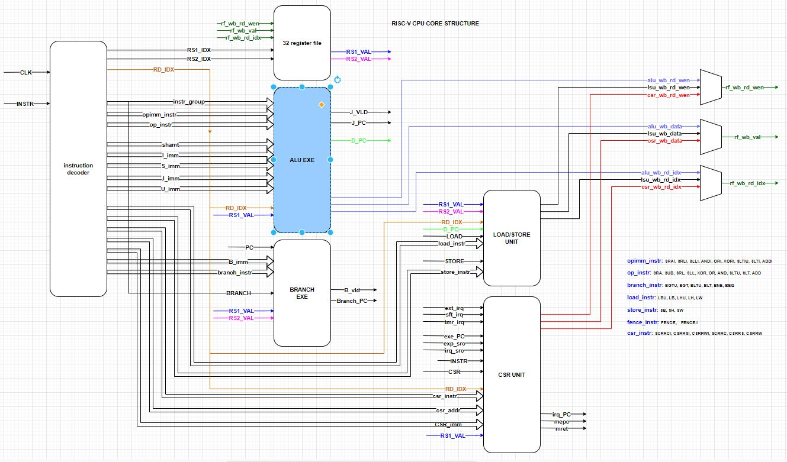
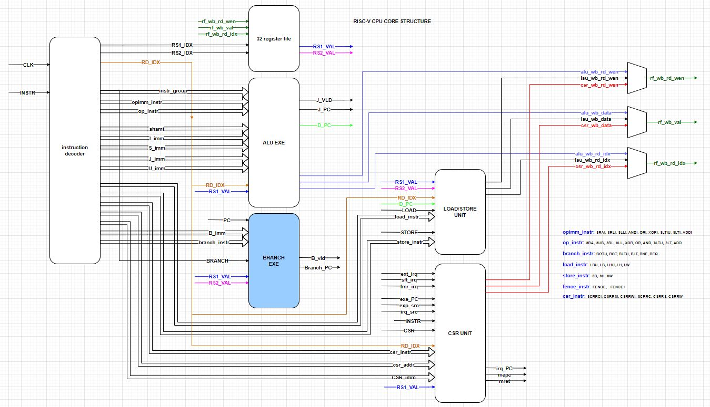

# ALU 模块和 branch 模块

来源：https://www.icfedu.cn/?s=RISC-V+ALU%E6%A8%A1

## 一、ALU模块

**RISC-V 的ALU 模块用来处理指令执行部分**。这个模块将之前ITCM读取的指令，译码模块分离出来的相关信息进行处理。处理过程包括对**32个通用寄存器的赋值，对memory的访存，对pc 指针的更改**等等。

**RISC-V cpu 架构：**



### ALU 模块代码

```verilog
module exu_alu (
input sys_clk,                // 系统时钟
input rst_n,


input [ 4: 0 ] i_rd_idx,      // 汇编指令中rd 所指定的32个通用寄存器中的一个
input [ 31: 0 ] i_rs1_val,    // 汇编指令中rs1 指定的寄存器 值

input [ 31: 0 ] i_PC,         // 当前正在执行的这条指令的PC

input i_OP_IMM,               // op_imm 指令组
input i_LOAD,                 // load 指令组
input [ 8: 0 ] i_opimm_instr, // op_imm 指令组 成员：SRAI, SRLI, SLLI, ANDI, ORI, XORI, SLTIU, SLTI, ADDI
input [ 31: 0 ] i_I_imm,      // I-type 立即数

input i_OP, // op 指令组
input [ 9: 0 ] i_op_instr,    // op 指令组 成员：SRA, SUB, SRL, SLL, XOR, OR, AND, SLTU, SLT, ADD
input [ 31: 0 ] i_rs2_val,    // 汇编指令中rs2 指定的寄存器 值

input i_LUI,                  // LUI 指令
input i_AUIPC,                // AUIPC 指令
input [ 31: 0 ] i_U_imm,      // U-type 立即数

input i_JAL,                  // JAL 指令
input i_JALR,                 // JALR 指令
input [ 31: 0 ] i_J_imm,      // J-type 立即数

input i_STORE,                // STORE 指令
input [ 31: 0 ] i_S_imm,      // s-type 立即数
//===============================================================================
output o_J_vld,               // 跳转有效
output [ 31: 0 ] o_J_PC,      // 跳转到新的PC
//output addition result to LOAD/STORE unit 
output [ 31: 0 ] o_D_PC,      // 跳转 memroy 访存 的 PC

output o_rd_wen,              // 写回 enable
output [ 4: 0 ] o_wb_rd_idx,  // 写回 rd 寄存器
output reg [ 31: 0 ] o_wb_data// 写回 数据值

);

//===============================================================================
//reg [31:0] wb_data_opimm;
//reg [31:0] wb_data_op;
//reg [ 31: 0 ] wb_data_LUI;
//reg [ 31: 0 ] wb_data_AUIPC;

wire [ 31: 0 ] opd1 = ( i_AUIPC | i_JAL ) ? i_PC : i_rs1_val;

wire [ 31: 0 ] opd2 = ( { 32{ i_OP_IMM | i_JALR | i_LOAD} } & i_I_imm ) |
( { 32{ i_OP } } & i_rs2_val ) |
( { 32{ i_JAL } } & i_J_imm ) |
( { 32{ i_AUIPC } } & i_U_imm ) |
( { 32{ i_STORE } } & i_S_imm ) ; //the second operand;

//                         rv32i_slti        rv32i_slt
wire [ 33: 0 ] ext_opd1 = ({i_opimm_instr[1],i_op_instr[1]} != 0) ? {opd1[31],opd1[31],opd1} : {2'b00, opd1};
wire [ 33: 0 ] ext_opd2 = ({i_opimm_instr[1],i_op_instr[1]} != 0) ? {opd2[31],opd2[31],opd2} : {2'b00, opd2};

wire [ 33: 0 ] comp_opd2 = ~ext_opd2 + 32'b1; //2's complement

//                              sub             sltiu, slti       sltu, slt
wire [ 33: 0 ] comp_ext_opd2 = ({i_op_instr[8], i_opimm_instr[2:1],i_op_instr[2:1]} != 0) ? comp_opd2 : ext_opd2;

wire [ 33: 0 ] add_res = ext_opd1 + comp_ext_opd2;

wire [ 31: 0 ] xor_res = i_rs1_val ^ opd2;
wire [ 31: 0 ] or_res = i_rs1_val | opd2;
wire [ 31: 0 ] and_res = i_rs1_val & opd2;
wire [ 31: 0 ] sll_res = i_rs1_val << opd2[ 4: 0 ];
wire [ 31: 0 ] srl_res = i_rs1_val >> opd2[ 4: 0 ];
//===============================================================================
// shift right arithmetic immediate x[rd] = ( x[rs1] >>s shamt)
wire [ 31: 0 ] eff_mask = ( ~( 32'b0 ) ) >> opd2[ 4: 0 ];
wire [ 31: 0 ] sra_res = ( srl_res & eff_mask ) | ( { 32{ i_rs1_val[ 31 ] } } & ( ~eff_mask ) );

//wire [ 31: 0 ] sra_res = i_rs1_val >>> opd2[ 4: 0 ];

//===============================================================================
always@( * )
begin
    o_wb_data <= 32'b0;
/*
assign o_opimm_instr = { rv32i_srai, rv32i_srli, rv32i_slli,
rv32i_andi, rv32i_ori, rv32i_xori,
rv32i_sltiu, rv32i_slti, rv32i_addi };
*/
    if ( i_OP_IMM )
    case ( i_opimm_instr ) //one hot decoder and execute
    9'h001: //rv32i_addi
        o_wb_data <= add_res[31:0];
    9'h002: //rv32i_slti
        o_wb_data <= add_res[ 33 ] ? 32'b1 : 32'b0;
    9'h004: //rv32i_sltiu
        o_wb_data <= add_res[ 33 ] ? 32'b1 : 32'b0;
    9'h008: //xori
        o_wb_data <= xor_res;
    9'h010: //rv32i_ori
        o_wb_data <= or_res;
    9'h020: //rv32i_andi
        o_wb_data <= and_res;
    9'h040: //rv32i_slli
        o_wb_data <= sll_res;
    9'h080: //rv32i_srli
        o_wb_data <= srl_res;
    9'h100: //rv32i_srai
        o_wb_data <= sra_res;
    default: ;
    endcase

/*
assign o_op_instr = { rv32i_sra, rv32i_sub, rv32i_srl,
rv32i_sll, rv32i_xor, rv32i_or,
rv32i_and, rv32i_sltu, rv32i_slt,
rv32i_add };
*/ 
    if ( i_OP )
    case ( i_op_instr ) //one hot decoder and execute
    10'h001: //rv32i_add
        o_wb_data <= add_res[31:0];
    10'h002: //rv32i_slt
        o_wb_data <= add_res[ 33 ] ? 32'b1 : 32'b0;
    10'h004: //rv32i_sltu
        o_wb_data <= add_res[ 33 ] ? 32'b1 : 32'b0;
    10'h008: //rv32i_and
        o_wb_data <= and_res;
    10'h010: //rv32i_or
        o_wb_data <= or_res;
    10'h020: //rv32i_xor
        o_wb_data <= xor_res;
    10'h040: //rv32i_sll
        o_wb_data <= sll_res;
    10'h080: //rv32i_srl
        o_wb_data <= srl_res;
    10'h100: //rv32i_sub
        o_wb_data <= add_res[31:0];
    10'h200: //rv32i_sra
        o_wb_data <= sra_res;
    default: ;
endcase

    if ( i_LUI )
         o_wb_data <= i_U_imm;

    if ( i_AUIPC )
         o_wb_data <= add_res[31:0];


    if ( i_JAL | i_JALR )
         o_wb_data <= i_PC + 4;

end
//===============================================================================

// wire rv32i_sub =o_op_instr[8];
// wire rv32i_sra =o_op_instr[9];

assign o_wb_rd_idx = i_rd_idx;
assign o_rd_wen = i_OP_IMM | i_OP | i_LUI | i_AUIPC | i_JAL | i_JALR;

assign o_D_PC = add_res[31:0];
assign o_J_PC = add_res[31:0];

assign o_J_vld = i_JAL | i_JALR;
//===============================================================================

endmodule
```

端口描述：

```verilog
input sys_clk,                   // 系统时钟
input rst_n,


input [ 4: 0 ] i_rd_idx,         // 汇编指令中rd 所指定的32个通用寄存器中的一个
input [ 31: 0 ] i_rs1_val,       // 汇编指令中rs1 指定的寄存器 值

input [ 31: 0 ] i_PC,            // 当前正在执行的这条指令的PC

input i_OP_IMM,                  // op_imm 指令组
input i_LOAD,                    // load 指令组
input [ 8: 0 ] i_opimm_instr,    // op_imm 指令组 成员：SRAI, SRLI, SLLI, ANDI, ORI, XORI, SLTIU, SLTI, ADDI
input [ 31: 0 ] i_I_imm,         // I-type 立即数

input i_OP, // op 指令组
input [ 9: 0 ] i_op_instr,       // op 指令组 成员：SRA, SUB, SRL, SLL, XOR, OR, AND, SLTU, SLT, ADD
input [ 31: 0 ] i_rs2_val,       // 汇编指令中rs2 指定的寄存器 值

input i_LUI,                     // LUI 指令
input i_AUIPC,                   // AUIPC 指令
input [ 31: 0 ] i_U_imm,         // U-type 立即数

input i_JAL,                     // JAL 指令
input i_JALR,                    // JALR 指令
input [ 31: 0 ] i_J_imm,         // J-type 立即数

input i_STORE,                   // STORE 指令
input [ 31: 0 ] i_S_imm,         // s-type 立即数
//===============================================================================
output o_J_vld,                  // 跳转有效
output [ 31: 0 ] o_J_PC,         // 跳转到新的PC
//output addition result to LOAD/STORE unit 
output [ 31: 0 ] o_D_PC,         // 跳转 memroy 访存 的 PC

output o_rd_wen,                 // 写回 enable
output [ 4: 0 ] o_wb_rd_idx,     // 写回 rd 寄存器
output reg [ 31: 0 ] o_wb_data   // 写回 数据值
```

### 指令的操作

**所有RISC-V 指令的操作（执行），都是小于等于两个操作数的**。 （大于两个操作数的指令，一直在riscv 标准中进行讨论，目前没有实施。）

**举例**：

nop 指令, `addi x0, x0, 0` 两个操作数

load 指令, `lw rd, offset(rs1)` 两个操作数

jal 指令, `jal rd, offset x[rd] = pc + 4; pc = pc + sext(offset)`, 只有一个操作数，

addi 指令, `addi rd, rs1, imm x[rd] = x[rs1] + imm` 只有两个操作数。

所以在ALU 操作中：最多只有两个操作数。

```verilog
wire [ 31: 0 ] opd1 = ( i_AUIPC | i_JAL ) ? i_PC : i_rs1_val;

wire [ 31: 0 ] opd2 = ( { 32{ i_OP_IMM | i_JALR | i_LOAD} } & i_I_imm ) |
                   ( { 32{ i_OP } } & i_rs2_val ) |
                   ( { 32{ i_JAL } } & i_J_imm ) |
                   ( { 32{ i_AUIPC } } & i_U_imm ) |
                   ( { 32{ i_STORE } } & i_S_imm ) ; //the second operand;
```

在opd1 （操作数1） 中 ， 整理一下RISC-V 指令集，我们会发现 只有 在 （AUIPC , JAL) 时， 会使用PC， 其他情况（其他指令） 只能是rs1 的值。

在opd2 （操作数2）中 :

当指令为 OP_IMM,指令组， JALR, LOAD 指令组时， 会使用 I_imm; 

当指令为 OP指令组，会使用 rs2_val; 

当指令为 JAL指令，  会使用 J_imm; 

当指令为 AUIPC指令，会使用 U_imm; 

当指令为 STORE指令组，会使用 S_imm; 

这些指令在某个具体时钟下，只会有一种指令被译码，不会出现多个指令同时有效的情况。

**整理操作数 1，2：**

```verilog
// rv32i_slti               rv32i_slt
wire [ 33: 0 ] ext_opd1 = ({i_opimm_instr[1],i_op_instr[1]} != 0) ? {opd1[31],opd1[31],opd1} : {2’b00, opd1};
wire [ 33: 0 ] ext_opd2 = ({i_opimm_instr[1],i_op_instr[1]} != 0) ? {opd2[31],opd2[31],opd2} : {2’b00, opd2};
```

将操作数扩展为34位，即32位的操作数 + 进位位 + 符号位。slti, slt 需要进行符号扩展， 其他指令 都认为是正数。

**负数操作：**

```verilog
wire [ 33: 0 ] comp_opd2 = ~ext_opd2 + 32’b1; //2’s complement
```

将操作数2 变为负数, 相当于 comp_opd2 = –ext_opd2;

```verilog
// rv32i_sub            rv32i_sltiu, rv32i_slti      rv32i_sltu, rv32i_slt
wire [ 33: 0 ] comp_ext_opd2 = ({i_op_instr[8],     i_opimm_instr[2:1],        i_op_instr[2:1]} != 0) ? comp_opd2 : ext_opd2;
```

如果当前指令是 sub, sltiu, slti, sltu, slt 时 ，需要 操作数 变为负数， 其他指令不需要。

**加法操作：**

```verilog
wire [ 33: 0 ] add_res = ext_opd1 + comp_ext_opd2;    
```

**异或操作：**

```verilog
wire [ 31: 0 ] xor_res = i_rs1_val ^ opd2;
```

**或操作：**

```verilog
wire [ 31: 0 ] or_res = i_rs1_val | opd2;
```

**与操作：**

```verilog
wire [ 31: 0 ] and_res = i_rs1_val & opd2;
```

**逻辑左移操作：**

```verilog
wire [ 31: 0 ] sll_res = i_rs1_val << opd2[ 4: 0 ];
```

**逻辑右移操作：**

```verilog
wire [ 31: 0 ] srl_res = i_rs1_val >> opd2[ 4: 0 ];
```

**算数右移操作：**

```verilog
wire [ 31: 0 ] eff_mask = ( ~( 32’b0 ) ) >> opd2[ 4: 0 ];
wire [ 31: 0 ] sra_res = ( srl_res & eff_mask ) | ( { 32{ i_rs1_val[ 31 ] } } & ( ~eff_mask ) );
```

相当于 sra_res = i_rs1_val >>> opd2[4:0];


```verilog
assign o_rd_wen = i_OP_IMM | i_OP | i_LUI | i_AUIPC | i_JAL | i_JALR;
```

这些指令需要写回32个通用寄存器。

 

```verilog
assign o_J_vld = i_JAL | i_JALR;
```

当为 JAL ， JALR 指令时， J_vld 需要enable

## 二、branch模块

RISC-V 的**BRANCH 模块用来处理指令条件跳转部分**。这个模块将之前ITCM读取的指令，译码模块分离出来的条件跳转信息进行处理。在处理过程中，包括**读取32个通用寄存器的值，对pc 指针的更改**等等。

**RISC-V cpu 架构：**



这个模块集中处理：

**BEQ**:  if (rs1 == rs2) pc += sext(offset)

**BGE**:  if (rs1 ≥s rs2) pc += sext(offset)

**BGEU**: if (rs1 ≥u rs2) pc += sext(offset)

**BLT**:   if (rs1 <s rs2) pc += sext(offset)

**BLTU**: if (rs1 <u rs2) pc += sext(offset)

**BNE**:  if (rs1 ≠ rs2) pc += sext(offset)

汇编语言中的编译器在这6条指令的基础上，又增加了相关的 伪指令， 方便用户编写汇编语言。 最后形成的机器码依然只有这6条指令。

相关的文章可以参考：[RISC-V 伪指令查找表](https://www.icfedu.cn/archives/13981)

### branch 模块代码

```verilog
module exu_BRANCH
(
    input sys_clk,                 // 系统时钟
    input rst_n,

    input i_EXE_vld,               // 执行enable
    input i_BRANCH,                // 译码模块提供的 branch 指令组
    input [ 5: 0 ] i_branch_instr, // 具体branch 指令，包括{rv32i_bgeu,rv32i_bge,rv32i_bltu,rv32i_blt,rv32i_bne,rv32i_beq};

    input [ 31: 0 ] i_rs1_val,     // rs1 通用寄存器
    input [ 31: 0 ] i_rs2_val,     // rs2 通用寄存器

    input [ 31: 0 ] i_PC,          // 当前指令pc
    input [ 31: 0 ] i_B_imm,       // b-type 立即数

    output reg o_B_vld,            // 跳转 pc 有效 branch valid
    output [ 31: 0 ] o_PC          // 准备跳转的pc 值

) ;

wire [ 31: 0 ] op1 = i_rs1_val;
wire [ 31: 0 ] op2 = i_rs2_val;

wire [ 31: 0 ] op_xor = op1 ^ op2;
wire bit_or = |op_xor;

//                         bge               blt
wire [ 33: 0 ] ext_op1 = ({i_branch_instr[4],i_branch_instr[2]} != 0 ) ? {op1[31],op1[31],op1} : {1'b0,1'b0,op1};
//                         bge               blt
wire [ 33: 0 ] ext_op2 = ({i_branch_instr[4],i_branch_instr[2]} != 0 ) ? {op2[31],op2[31],op2} : {1'b0,1'b0,op2};
wire [ 33: 0 ] comp_ext_op2 = ~ext_op2 + 1;

wire [ 33: 0 ] op_sub = ext_op1 + comp_ext_op2; //ext_op1 - ext_op2;

assign o_PC = i_PC + i_B_imm;

//assign o_branch_instr = { rv32i_bgtu, rv32i_bgt, rv32i_bltu, rv32i_blt, rv32i_bne, rv32i_beq };
always @( * )
begin
    o_B_vld <= 1'b0;

    if ( i_EXE_vld & i_BRANCH )
    begin
        case ( i_branch_instr )
        6'b00_0001:
        begin //eq
            if ( !bit_or )
                o_B_vld <= 1'b1;
        end
        6'b00_0010:
        begin //bne
            if ( bit_or )
                o_B_vld <= 1'b1;
        end
        6'b00_0100:
        begin //blt
            if ( op_sub[ 33 ] )
                o_B_vld <= 1'b1;
        end
        6'b00_1000:
        begin //bltu
            if ( op_sub[ 33 ] )
                o_B_vld <= 1'b1;
        end
        6'b01_0000:
        begin //bge
            if ( !op_sub[ 33 ] )
                o_B_vld <= 1'b1;
        end
        6'b10_0000:
        begin //bgeu
            if ( !op_sub[ 33 ] )
                o_B_vld <= 1'b1;
        end
        default: ;
        endcase
    end
end

endmodule
```

模块端口：

```verilog
input sys_clk,                             // 系统时钟
input rst_n,

input i_EXE_vld,                      // 执行enable
input i_BRANCH,                     // 译码模块提供的 branch 指令组
input [ 5: 0 ] i_branch_instr, // 具体branch 指令，包括{rv32i_bgeu,rv32i_bge,rv32i_bltu,rv32i_blt,rv32i_bne,rv32i_beq};

input [ 31: 0 ] i_rs1_val,          // rs1 通用寄存器
input [ 31: 0 ] i_rs2_val,          // rs2 通用寄存器

input [ 31: 0 ] i_PC,                   // 当前指令pc
input [ 31: 0 ] i_B_imm,          // b-type 立即数

output reg o_B_vld,                  // 跳转 pc 有效 branch valid
output [ 31: 0 ] o_PC                 // 准备跳转的pc 值
```

### 指令操作

**操作数1，2 扩展：**

```verilog
// bge                             blt
wire [ 33: 0 ] ext_op1 = ({i_branch_instr[4],i_branch_instr[2]} != 0 ) ? {op1[31],op1[31],op1} : {1’b0,1’b0,op1};
// bge                             blt
wire [ 33: 0 ] ext_op2 = ({i_branch_instr[4],i_branch_instr[2]} != 0 ) ? {op2[31],op2[31],op2} : {1’b0,1’b0,op2};
```

bge， blt 指令需要进行符号扩展， 其他指令不需要。

**负数操作：**

```verilog
wire [ 33: 0 ] comp_ext_op2 = ~ext_op2 + 1;
```

相当于 comp_ext_op2 = -ext_op2;

**减法操作：**

```verilog
wire [ 33: 0 ] op_sub = ext_op1 + comp_ext_op2; //ext_op1 – ext_op2;
```

**异或， 或 操作：**

```verilog
wire [ 31: 0 ] op_xor = op1 ^ op2;
wire bit_or = |op_xor;
```

这两个操作 最终可实现 op1 == op2 ;  op1 != op2 的操作。 当bit_or == 1’b1 时 op1 不等于 op2； 当 bit_or == 1’b0 时 op1 等于 op2

**准备跳转的新pc 值：**

```verilog
assign o_PC = i_PC + i_B_imm;
```

需要配合o_B_vld 信号， 如果 o_B_vld == 1， o_PC 是有效的跳转pc ； 如果 o_B_vld == 0， o_PC  cpu 将不需要关心这个值；