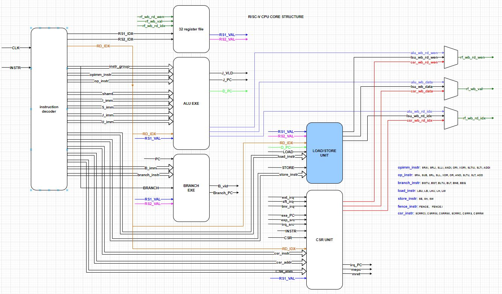
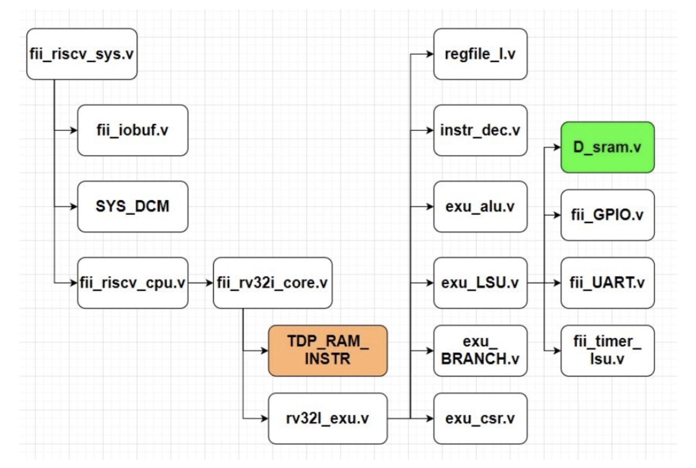
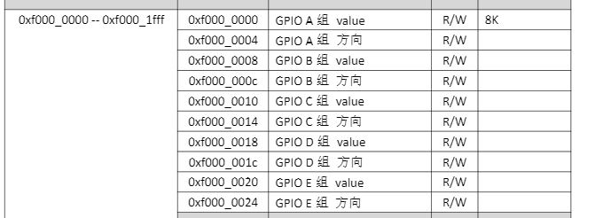
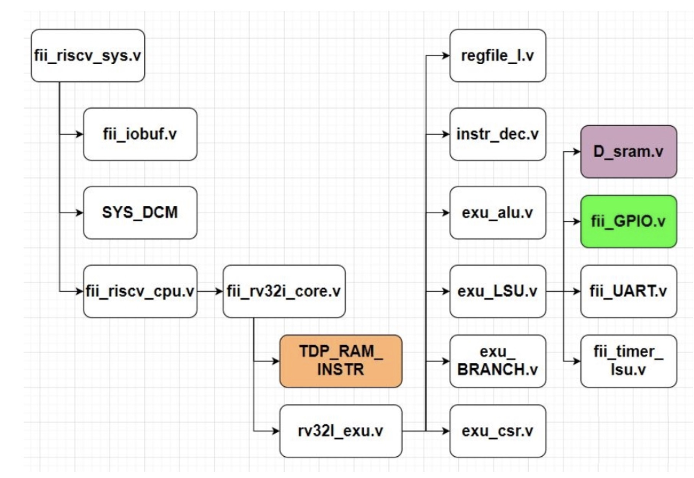
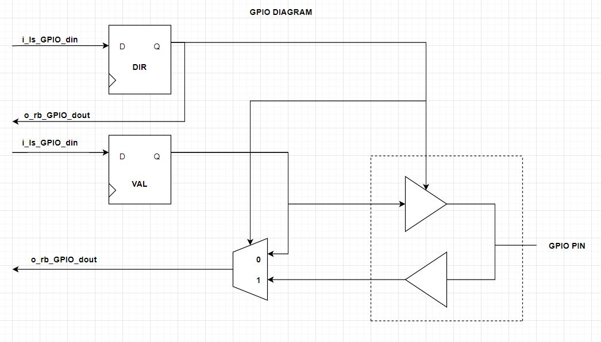

# LSU & SRAM & GPIO模块

来源：https://www.icfedu.cn/?s=RISC-V+LSU%EF%BC%8CSRAM

RISC-V LSU , SRAM, GPIO 模块，是**利用RISC-V 指令集中的LOAD, STORE 相关的指令集，对memory， 或者外设peripheral 的访存**。

## 一、exu_lsu模块

RISC-V 的LOAD, STORE 是由一组指令集组成，包括

LOAD: LBU, LB, LHU, LH, LW;

STORE: SB, SH, SW

两组指令集。

load，store 指令集可以让risc-v cpu 访存 memory， uart， pwm 等等，很多cpu 外部的存储模块。 这个部分也是一个接口，当前的RISC-V 版本为2.01，在后续的RISC-V fpga 版本中， 会对这个模块进行改造：包括 增加系统总线， 让所有外设都连接到cpu 的内部总线上， 方便各个外设模块的开发。**LSU 模块将形成数据总线地址， 写信号， 读信号， 写数据， 读数据等**。

RISC-V cpu LSU 架构：




### LSU 相关代码

```verilog
module exu_LSU
#(
    parameter [ 31: 0 ] TMR_BASEADDR  = 32'h0200_0000,
    parameter [ 31: 0 ] PLIC_BASEADDR = 32'h0c00_0000,
    parameter [ 31: 0 ] CPU_BASEADDR  = 32'h8000_0000,
    parameter [ 31: 0 ] MEM_BASEADDR  = 32'h9000_0000,
    parameter [ 31: 0 ] GPIO_BASEADDR = 32'hf000_0000,
    parameter [ 31: 0 ] UART_BASEADDR = 32'he000_0000,

    parameter MEM_D_DEEP = 1024, //memory data depth
    parameter MEM_D_W    = 32,   //memory data width
    parameter MEM_MSK_W  = 4,    //memory data mask width
    parameter MEM_ADDR_W = 32    //memory address width
)
(
input sys_clk,                 // 系统时钟
//==============================================================================
input i_EXE_vld,               // 执行指令enable
// load & store address PC
input [ 31: 0 ] i_D_PC,        // load， store 指向的数据总线 指针

input i_LOAD,                  // load 指令集
input [ 4: 0 ] i_load_instr,   // load 指令集包括：{rv32i_lbu,rv32i_lb,rv32i_lhu,rv32i_lh,rv32i_lw};

input i_STORE,                 // store 指令集
input [ 2: 0 ] i_store_instr,  // store 指令集包括：{rv32i_sb,rv32i_sh,rv32i_sw};
input [ 4: 0 ] i_rd_idx,       // 译码模块 译码出来的rd 通用寄存器id 
input [ 31: 0 ] i_rs2_val,     // rs2 通用寄存器值
//==============================================================================
input [ 31: 0 ] i_GPIO_dina,   // gpio 模块a组 cpu写入数据
output [ 31: 0 ] o_GPIO_douta, // gpio 模块a组 cpu读出数据
output [ 31: 0 ] o_GPIO_ta,    // gpio 模块a组 方向控制

input [ 31: 0 ] i_GPIO_dinb,   // gpio 模块b组 cpu写入数据
output [ 31: 0 ] o_GPIO_doutb, // gpio 模块b组 cpu读出数据
output [ 31: 0 ] o_GPIO_tb,    // gpio 模块b组 方向控制

input [ 31: 0 ] i_GPIO_dinc,   // gpio 模块c组 cpu写入数据
output [ 31: 0 ] o_GPIO_doutc, // gpio 模块c组 cpu读出数据
output [ 31: 0 ] o_GPIO_tc,    // gpio 模块c组 方向控制

input [ 31: 0 ] i_GPIO_dind,   // gpio 模块d组 cpu写入数据
output [ 31: 0 ] o_GPIO_doutd, // gpio 模块d组 cpu读出数据
output [ 31: 0 ] o_GPIO_td,    // gpio 模块d组 方向控制

//==============================================================================
output txd_start,              // 通知uart 外设模块 写 byte enable
output [ 7: 0 ] txd_data,      // 发送到uart 外设模块 写数据
input txd_done,                // uart 外设模块 返回的 uart 发送数据完成
//==============================================================================
output [ 31: 0 ] o_sft_int_v,  // 软件中断控制寄存器
output [ 31: 0 ] o_timer_l,    // timer 设置寄存器 低32位 
output [ 31: 0 ] o_timer_h,    // timer 设置寄存器 高32位

input [ 31: 0 ] i_timer_l,     // 读取当前timer 计数器 低32位 
input [ 31: 0 ] i_timer_h,     // 读取当前timer 计数器 高32位

output [ 31: 0 ] o_tcmp_l,     // timer 比较 寄存器 低32位
output [ 31: 0 ] o_tcmp_h,     // timer 比较 寄存器 高32位

output [ 1: 0 ] o_timer_valid, // timer 有效标志

output [ 31: 0 ] o_tm_ctrl,    // timer 控制寄存器
//==============================================================================
output o_CPU_cs,               // 普林斯顿架构中 ，选择的数据在 ITCM空间 标识
output [ 31: 0 ] o_CPU_PC,     // 普林斯顿架构中 ，选择的数据在 ITCM空间 地址
input [ 31: 0 ] i_CPU_load_data,// 普林斯顿架构中 ，从ITCM空间读取的数据

output o_ls_need,              // load或者store 指令 标识
output o_ls_rdy,               // load 或者 stroe 有效

output o_rd_wen,               // 写回 通用寄存器 enable
output [ 4: 0 ] o_wb_rd_idx,   // 写回 通用寄存器 id 
output reg[ 31: 0 ] o_wb_data, // 写回 通用寄存器 值

input i_cpu_reset,             // cpu 内核 reset
input rst_n
);

wire [31: 0] cpu_data_in = i_rs2_val << {i_D_PC[1:0],3'b000};
//==============================================================================
// Memory section
wire mem_cs = ( i_D_PC[ 31: 16 ] == MEM_BASEADDR[ 31: 16 ] );
reg mem_we;
reg [ 3: 0 ] mem_wem;        // memory mask
wire [ 31: 0 ] mem_dout;     // memory dout
wire [ 31: 0 ] mem_addr_out; // not at all
//wire mem_init_rdy;
//==============================================================================
// GPIO section
wire [ 31: 0 ] rb_GPIO_d;
wire GPIO_cs = ( i_D_PC[ 31: 16 ] == GPIO_BASEADDR[ 31: 16 ] ) ? 1'b1 : 1'b0;

wire GPIO_we;
wire [ 3: 0 ] GPIO_wem; // gpio mask
//==============================================================================
wire UART_cs = ( i_D_PC[ 31: 16 ] == UART_BASEADDR[ 31: 16 ] ) ? 1'b1 : 1'b0;
wire [ 31: 0 ] o_UART_dout;
//==============================================================================
wire PLIC_cs = ( i_D_PC[ 31: 16 ] == PLIC_BASEADDR[ 31: 16 ] ) ? 1'b1 : 1'b0;
wire [ 31: 0 ] o_PLIC_dout;
//==============================================================================

wire t_sft_cs   = ( i_D_PC[ 31: 16 ] == TMR_BASEADDR[ 31: 16 ] ) ? 1'b1 : 1'b0;
wire sft_cs     = t_sft_cs & ( ( ~i_D_PC[ 12 ] ) & ( i_D_PC[ 5: 2 ] == 0 ) );
wire tm_ctrl_cs = t_sft_cs & ( ( ~i_D_PC[ 12 ] ) & ( i_D_PC[ 5: 2 ] == 1 ) );
wire t_cs0      = t_sft_cs & ( ( ~i_D_PC[ 12 ] ) & ( i_D_PC[ 5: 2 ] == 2 ) );
wire t_cs1      = t_sft_cs & ( ( ~i_D_PC[ 12 ] ) & ( i_D_PC[ 5: 2 ] == 3 ) );
wire tcmp_cs0   = t_sft_cs & ( ( ~i_D_PC[ 12 ] ) & ( i_D_PC[ 5: 2 ] == 4 ) );
wire tcmp_cs1   = t_sft_cs & ( ( ~i_D_PC[ 12 ] ) & ( i_D_PC[ 5: 2 ] == 5 ) );

wire fpga_ver_cs  = t_sft_cs & ( i_D_PC[ 12 ] & ( i_D_PC[ 5: 2 ] == 0 ) );
wire fpga_test_cs = t_sft_cs & ( i_D_PC[ 12 ] & ( i_D_PC[ 5: 2 ] == 1 ) );

wire [31:0] fpga_ver = 32'h0000_0201;
reg [31:0] fpga_test = 32'h0000_0000;


always @ (posedge sys_clk) 
if ( fpga_test_cs )
begin
    if (mem_wem[0])
        fpga_test[ 7: 0] <= cpu_data_in[ 7: 0] ;
    if (mem_wem[1])
        fpga_test[15: 8] <= cpu_data_in[15: 8] ;
    if (mem_wem[2])
        fpga_test[23:16] <= cpu_data_in[23:16] ;
    if (mem_wem[3])
        fpga_test[31:24] <= cpu_data_in[31:24] ;
end
//==============================================================================
//assign o_CPU_cs = ( i_D_PC[ 31: 16 ] == CPU_BASEADDR[ 31: 16 ] ) ? i_LOAD & i_EXE_vld : 1'b0;
reg CPU_cs = 0;
always @ (*)
if(i_EXE_vld)
    CPU_cs = ( i_D_PC[ 31: 16 ] == CPU_BASEADDR[ 31: 16 ] ) ? i_LOAD : 1'b0;

assign o_CPU_cs = CPU_cs;
//assign o_CPU_cs = ( i_D_PC[ 31: 16 ] == CPU_BASEADDR[ 31: 16 ] ) ? i_LOAD : 1'b0;
assign o_CPU_PC = { i_D_PC[ 31: 2 ], 2'b00 };


// lock current data address
reg [ 1: 0 ] data_sft_r = 0;
always @ (posedge sys_clk)
if(o_CPU_cs & i_EXE_vld)
    data_sft_r <= i_D_PC[1:0];

wire [ 4: 0 ] data_sft = {data_sft_r[ 1: 0 ], 3'b000};

//wire [ 4: 0 ] data_sft = {i_D_PC[ 1: 0 ], 3'b000};
wire [ 31: 0 ] o_CPU_dout = i_CPU_load_data >> data_sft;

//==============================================================================
wire [ 31: 0 ] ls_rb_d_t_sft = sft_cs         ? o_sft_int_v :
                               ( tm_ctrl_cs   ? o_tm_ctrl :
                               ( t_cs0        ? i_timer_l :
                               ( t_cs1        ? i_timer_h :
                               ( fpga_ver_cs  ? fpga_ver :
                               ( fpga_test_cs ? (fpga_test>>{i_D_PC[1:0],3'b000}) :
                               ( tcmp_cs0     ? o_tcmp_l :
                               ( tcmp_cs1     ? o_tcmp_h : o_CPU_dout ) ) ) ) )));

wire [ 31: 0 ] ls_rb_d = mem_cs ? mem_dout : ( GPIO_cs ? rb_GPIO_d : ( UART_cs ? o_UART_dout : ls_rb_d_t_sft ) );

//wire [ 31: 0 ] ls_rb_d = mem_cs ? mem_dout : ( GPIO_cs ? rb_GPIO_d : ( UART_cs ? o_UART_dout : o_CPU_dout ) );
always@( * )
begin
    mem_we <= 1'b0;
    mem_wem <= 4'b0;
    o_wb_data <= 32'b0;

    if ( i_LOAD )
    begin //&mem_init_rdy
        case ( i_load_instr ) // i_load_instr ={rv32i_lbu, rv32i_lb, rv32i_lhu, rv32i_lh, rv32i_lw};
        5'b00001:
        begin //rv32i_lw
            o_wb_data <= ls_rb_d;
        end
        5'b00010:
        begin //rv32i_lh
            o_wb_data <= { { 16{ ls_rb_d[ 15 ] } }, ls_rb_d[ 15: 0 ] };
        end
        5'b00100:
        begin //rv32i_lhu
            o_wb_data <= { { 16{ 1'b0 } }, ls_rb_d[ 15: 0 ] };
        end
        5'b01000:
        begin //rv32i_lb
            o_wb_data <= { { 24{ ls_rb_d[ 7 ] } }, ls_rb_d[ 7: 0 ] };
        end
        5'b10000:
        begin //rv32i_lbu
            o_wb_data <= { { 24{ 1'b0 } }, ls_rb_d[ 7: 0 ] };
        end
        default: ;
        endcase
    end

    if ( i_STORE )
    begin //&mem_init_rdy
        mem_we <= 1'b1;

        case ( i_store_instr ) //i_store_instr ={rv32i_sb, rv32i_sh, rv32i_sw};
        3'b001:
        begin //rv32i_sw
            mem_wem <= 4'b1111; 
        end
        3'b010:
        begin //rv32i_sh
            mem_wem <= 4'b0011 << {i_D_PC[1],1'b0}; 
        end
        3'b100:
        begin //rv32i_sb
            mem_wem <= 4'b0001 << i_D_PC[1:0]; 
        end
        default:
            mem_wem <= 4'b0;

        endcase
    end
end

//==============================================================================
D_sram
#(
    .MEM_D_DEEP ( MEM_D_DEEP ),
    .MEM_D_W    ( MEM_D_W ),
    .MEM_MSK_W  ( MEM_MSK_W ),
    .MEM_ADDR_W ( MEM_ADDR_W )
)
D_sram_inst
(
    .clk   ( sys_clk ),
    .rst_n ( rst_n ),

    .din   ( cpu_data_in ),
    .addr  ( i_D_PC ),
    .dout  ( mem_dout ),

    .cs    ( mem_cs ),
    .we    ( mem_we ),
    .wem   ( mem_wem ),

//.mem_init_rdy (mem_init_rdy),
    .o_D_PC ( mem_addr_out ) //not at all
);

//==============================================================================
assign GPIO_we = mem_we;
assign GPIO_wem = mem_wem;

fii_GPIO
#(
    .GPIO_DEEP   ( 8 ), // register number
    .GPIO_W      ( MEM_D_W ),
    .GPIO_MSK_W  ( MEM_MSK_W ),
    .GPIO_ADDR_W ( MEM_ADDR_W )
) fii_GPIO_inst
(
    .clk          ( sys_clk ),
    .rst_n        ( rst_n ),

    .i_ls_GPIO_din  ( cpu_data_in ),
    .o_rb_GPIO_dout ( rb_GPIO_d ),

    .i_addr       ( i_D_PC ),
    .i_cs         ( GPIO_cs ),
    .i_we         ( GPIO_we ),
    .i_wem        ( GPIO_wem ),

    .i_GPIO_dina  ( i_GPIO_dina ),
    .o_GPIO_douta ( o_GPIO_douta ),
    .o_GPIO_ta    ( o_GPIO_ta ),

    .i_GPIO_dinb  ( i_GPIO_dinb ),
    .o_GPIO_doutb ( o_GPIO_doutb ),
    .o_GPIO_tb    ( o_GPIO_tb ),

    .i_GPIO_dinc  ( i_GPIO_dinc ),
    .o_GPIO_doutc ( o_GPIO_doutc ),
    .o_GPIO_tc    ( o_GPIO_tc ),

    .i_GPIO_dind  ( i_GPIO_dind ),
    .o_GPIO_doutd ( o_GPIO_doutd ),
    .o_GPIO_td    ( o_GPIO_td )
);
//===============================================================================
wire UART_we = mem_we;
wire UART_wem = mem_wem;

fii_UART fii_UART_inst
(
    .clk         ( sys_clk ),

    .i_PERI_din  ( cpu_data_in ),
    .o_PERI_dout ( o_UART_dout ),

    .i_addr      ( i_D_PC ),
    .i_cs        ( UART_cs ),
    .i_we        ( UART_we ),
    .i_wem       ( UART_wem ),

    .txd_start   ( txd_start ),
    .txd_data    ( txd_data ),
    .txd_done    ( txd_done ),

    .rst_n       ( rst_n )
);


//===============================================================================

wire tmr_sft_we = mem_we;

fii_timer_lsu fii_timer_lsu_inst
(
    .clk             ( sys_clk ),

    .i_sft_timer_din ( cpu_data_in ),
    .i_tmr_sft_we    ( tmr_sft_we ),

    .i_tm_ctrl_cs    ( tm_ctrl_cs ),
    .o_tm_ctrl       ( o_tm_ctrl ),

    .i_sft_cs        ( sft_cs ),
    .o_sft_int_v     ( o_sft_int_v ),

    .i_tcs0          ( t_cs0 ),
    .o_timer_l       ( o_timer_l ),

    .i_tcs1          ( t_cs1 ),
    .o_timer_h       ( o_timer_h ),

    .i_tcmp_cs0      ( tcmp_cs0 ),
    .o_tcmp_l        ( o_tcmp_l ),

    .i_tcmp_cs1      ( tcmp_cs1 ),
    .o_tcmp_h        ( o_tcmp_h ),

    .o_timer_valid   ( o_timer_valid ),

    .rst_n           ( rst_n & (!i_cpu_reset))
);


//===============================


assign o_rd_wen  = i_LOAD; //o_wb_need
assign o_ls_need = i_LOAD | i_STORE;
assign o_ls_rdy  = 1;

assign o_wb_rd_idx = i_rd_idx;
//===============================================================================

endmodule
```

### 代码分析

**端口描述：**

```verilog
input i_EXE_vld,          // 执行指令enable
// load & store address PC
input [ 31: 0 ] i_D_PC,     // load， store 指向的数据总线 指针

input i_LOAD,            // load 指令集
input [ 4: 0 ] i_load_instr,  // load 指令集包括：{rv32i_lbu, rv32i_lb, rv32i_lhu, rv32i_lh, rv32i_lw};

input i_STORE,           // store 指令集
input [ 2: 0 ] i_store_instr, // store 指令集包括：{rv32i_sb, rv32i_sh, rv32i_sw};
input [ 4: 0 ] i_rd_idx,     // 译码模块 译码出来的rd 通用寄存器id
input [ 31: 0 ] i_rs2_val,    // rs2 通用寄存器值
```

以上这些信号和 cpu 内核相关， 都是从译码模块 和 执行模块 过来的。

**gpio 组 端口：**

```verilog
input [ 31: 0 ] i_GPIO_dina,        // gpio 模块a组 cpu写入数据
output [ 31: 0 ] o_GPIO_douta,  // gpio 模块a组 cpu读出数据
output [ 31: 0 ] o_GPIO_ta,         // gpio 模块a组 方向控制

input [ 31: 0 ] i_GPIO_dinb,       // gpio 模块b组 cpu写入数据
output [ 31: 0 ] o_GPIO_doutb, // gpio 模块b组 cpu读出数据
output [ 31: 0 ] o_GPIO_tb,        // gpio 模块b组 方向控制

input [ 31: 0 ] i_GPIO_dinc,        // gpio 模块c组 cpu写入数据
output [ 31: 0 ] o_GPIO_doutc,  // gpio 模块c组 cpu读出数据
output [ 31: 0 ] o_GPIO_tc,         // gpio 模块c组 方向控制

input [ 31: 0 ] i_GPIO_dind,        // gpio 模块d组 cpu写入数据
output [ 31: 0 ] o_GPIO_doutd,  // gpio 模块d组 cpu读出数据
output [ 31: 0 ] o_GPIO_td,         // gpio 模块d组 方向控制
```

在当前LSU模块接口中， 我们设计了gpio 的外设， 定义了4个组 gpio a，b， c， d 。 其中每一个组内包括32个gpio pin 。 所有gpio pin 都是 inout ，这些信号在整个工程的顶层模块有相关的定义来配合 gpio 组端口。

整个RISC-V 工程的**顶层模块**示例：

```verilog
fii_iobuf #( .IO_WIDTH( 32 ) )
fii_iobuf_insta
(
    .i_dio_t  ( gpio_ta ),  // 对应当前模块的 o_GPIO_ta
    .i_dio    ( gpio_oa ),  // 对应当前模块的 o_GPIO_douta
    .o_dio    ( gpio_ia ),  // 对应当前模块的 o_GPIO_dina
    .io_dio_p ( gpio_a )    // 对应fpga 真正的PIN
);
```

**uart 模块端口：**

```verilog
output txd_start,          // 通知uart 外设模块 写 byte enable
output [ 7: 0 ] txd_data,  // 发送到uart 外设模块 写数据
input txd_done,            // uart 外设模块 返回的 uart 发送数据完成
```

在当前LSU模块接口中，我们定义了uart 模块。 这些接口 一端 和 cpu load，store信号 接口， 另外一端 txd_start, txd_data, txd_done 将连接到真正的uart 通讯模块。

**timer 接口：**

```verilog
output [ 31: 0 ] o_sft_int_v,   // 软件中断控制寄存器
output [ 31: 0 ] o_timer_l,     // timer 设置寄存器 低32位
output [ 31: 0 ] o_timer_h,     // timer 设置寄存器 高32位

input [ 31: 0 ] i_timer_l,      // 读取当前timer 计数器 低32位
input [ 31: 0 ] i_timer_h,      // 读取当前timer 计数器 高32位

output [ 31: 0 ] o_tcmp_l,      // timer 比较 寄存器 低32位
output [ 31: 0 ] o_tcmp_h,      // timer 比较 寄存器 高32位

output [ 1: 0 ] o_timer_valid,  // timer 有效标志

output [ 31: 0 ] o_tm_ctrl,     // timer 控制寄存器
```

在当前的LSU 模块接口中， 我们定义了timer 模块。

**ITCM 模块的接口：**

```verilog
output o_CPU_cs,                 // 普林斯顿架构中 ，选择的数据在 ITCM空间 标识
output [ 31: 0 ] o_CPU_PC,       // 普林斯顿架构中 ，选择的数据在 ITCM空间 地址
input [ 31: 0 ] i_CPU_load_data, // 普林斯顿架构中 ，从ITCM空间读取的数据
```

这几个信号用于读取相关的数据， 在我们使用汇编指令时，有时 load 的数据 正好在ITCM 区域， 这时， 指令pc 就需要跳转到itcm 数据端， 将数据读出（不认为读出数据时指令机器码），读出之后， 在将pc 还原会当中正在执行代码的pc 值。

**外部接口信号：**

```verilog
output o_ls_need,  // load或者store 指令 标识，为其他模块做指示。
output o_ls_rdy,   // load 或者 stroe 有效 ，这个信号一直为一。
```

**通用寄存器写回 端口:**

```verilog
output o_rd_wen,                // 写回 通用寄存器 enable
output [ 4: 0 ] o_wb_rd_idx,    // 写回 通用寄存器 id
output reg[ 31: 0 ] o_wb_data,  // 写回 通用寄存器 值
```

**代码分析：**

wire [31: 0] cpu_data_in = i_rs2_val << {i_D_PC[1:0],3’b000};

在store 相关的指令包括 SB, SH, SW ,其中：

SB 的地址 （i_D_PC) 可以时 0 – 4G 的任何地址。 注意：这个地址是哈佛架构中的数据地址，（没有像指令地址那样： RV32 必须是 4bytes 对齐的， RV32C 中 可以有2bytes 对齐的），它可以是任何地址 ，例如： 0x9000_00000, 0x9000_00001, 0x9000_00002, 0x9000_00003。没有对齐一说。sb 指令可以访问任何一个地址。 所以 我们会分析i_D_PC[1:0], 它有4种选择：

2’b00:  表示当前地址正好是4bytes 对齐的（地址可以被4 整除）， 正好对应的数据为 i_rs2_val[7:0] ， 左移 0 位

2’b01: 表示当前地址被4 整除后 余数 1， 将数据为 i_rs2_val[7:0] ， 左移 8 位

2’b10: 表示当前地址被4 整除后 余数 2， 将数据为 i_rs2_val[7:0] ， 左移 16 位

2b’11: 表示当前地址被4 整除后 余数 3， 将数据为 i_rs2_val[7:0] ， 左移 24 位

SH 的地址和上面的情况类似， 只是只有 2’00, 2’b10 这2种情况而已。

SW 的地址和上面的情况类似， 只是只有 2’00, 这1种情况而已。

**memory 段:**

```verilog
wire mem_cs = ( i_D_PC[ 31: 16 ] == MEM_BASEADDR[ 31: 16 ] );  //片选信号， 对应的正好是DTCM 地址空间。
reg mem_we; // store 指令组中，任何一个有效(sb,sh,sw) , 当前这个信号有效
reg [ 3: 0 ] mem_wem; // 写屏蔽， 4bit， 任何一个bit 位 1， 相应的数据被写入到DTCM。举例： mem_wem = 4’b0100, 那么 cpu_data_in[23:16] 被写入到DTCM
wire [ 31: 0 ] mem_dout; // 从dtcm 中读取数据
wire [ 31: 0 ] mem_addr_out; // 目前没有使用。
```

**gpio 段：**

```verilog
wire [ 31: 0 ] rb_GPIO_d; // 从gpio 寄存器中读出的数据
wire GPIO_cs = ( i_D_PC[ 31: 16 ] == GPIO_BASEADDR[ 31: 16 ] ) ? 1’b1 : 1’b0; // gpio 寄存器 片选

wire GPIO_we; // gpio 寄存器 写信号 和 mem_we 一样使用。
wire [ 3: 0 ] GPIO_wem; // gpio 寄存器 写屏蔽 ，和 mem_wem 使用一样
```

**uart 段：**

```verilog
wire UART_cs = ( i_D_PC[ 31: 16 ] == UART_BASEADDR[ 31: 16 ] ) ? 1’b1 : 1’b0;  // uart 寄存器组 片选
wire [ 31: 0 ] o_UART_dout;  // uart 寄存器 中读出的数据

wire PLIC_cs = ( i_D_PC[ 31: 16 ] == PLIC_BASEADDR[ 31: 16 ] ) ? 1’b1 : 1’b0;  // 目前没有使用
wire [ 31: 0 ] o_PLIC_dout;   // 目前没有使用
```

**timer 寄存器 片选：**

```verilog
wire t_sft_cs   = ( i_D_PC[ 31: 16 ] == TMR_BASEADDR[ 31: 16 ] ) ? 1'b1 : 1'b0;  // timer 寄存器组段 片选
wire sft_cs     = t_sft_cs & ( ( ~i_D_PC[ 12 ] ) & ( i_D_PC[ 5: 2 ] == 0 ) );    // 软件中断 选择
wire tm_ctrl_cs = t_sft_cs & ( ( ~i_D_PC[ 12 ] ) & ( i_D_PC[ 5: 2 ] == 1 ) );    // timer 控制寄存器 选择
wire t_cs0      = t_sft_cs & ( ( ~i_D_PC[ 12 ] ) & ( i_D_PC[ 5: 2 ] == 2 ) );    // timer 寄存器 低32位选择
wire t_cs1      = t_sft_cs & ( ( ~i_D_PC[ 12 ] ) & ( i_D_PC[ 5: 2 ] == 3 ) );    // timer 寄存器 高32位选择
wire tcmp_cs0   = t_sft_cs & ( ( ~i_D_PC[ 12 ] ) & ( i_D_PC[ 5: 2 ] == 4 ) );    // timer比较寄存器低32位 选择
wire tcmp_cs1   = t_sft_cs & ( ( ~i_D_PC[ 12 ] ) & ( i_D_PC[ 5: 2 ] == 5 ) );    // timer比较寄存器高32位 选择
```

**版本和测试寄存器片选：**

```verilog
wire fpga_ver_cs  = t_sft_cs & ( i_D_PC[ 12 ] & ( i_D_PC[ 5: 2 ] == 0 ) );
wire fpga_test_cs = t_sft_cs & ( i_D_PC[ 12 ] & ( i_D_PC[ 5: 2 ] == 1 ) );
```

**测试寄存器写：**

```verilog
always @ (posedge sys_clk)
if ( fpga_test_cs )
begin
    if (mem_wem[0])
        fpga_test[ 7: 0] <= cpu_data_in[ 7: 0] ;
    if (mem_wem[1])
        fpga_test[15: 8] <= cpu_data_in[15: 8] ;
    if (mem_wem[2])
        fpga_test[23:16] <= cpu_data_in[23:16] ;
    if (mem_wem[3])
        fpga_test[31:24] <= cpu_data_in[31:24] ;
end
```

**load ITCM 中的数据：**

普林斯顿架构中会使用, 通知 itcm ，当前需要从itcm 区域中读取一个数据（不是指令）

```verilog
reg CPU_cs = 0;
always @ (*)
if(i_EXE_vld)
    CPU_cs = ( i_D_PC[ 31: 16 ] == CPU_BASEADDR[ 31: 16 ] ) ? i_LOAD : 1'b0;

assign o_CPU_cs = CPU_cs;
assign o_CPU_PC = { i_D_PC[ 31: 2 ], 2'b00 };

reg [ 1: 0 ] data_sft_r = 0;
always @ (posedge sys_clk)
if(o_CPU_cs & i_EXE_vld)
    data_sft_r <= i_D_PC[1:0];

wire [ 4: 0 ] data_sft = {data_sft_r[ 1: 0 ], 3'b000};

wire [ 31: 0 ] o_CPU_dout = i_CPU_load_data >> data_sft;  // 从itcm 中读取的数据 来对用LB, LH, LW 等等。
```

整个模块的 load 指令集 读出的数据选择， 根据不同的片选信号， 从不同的模块中，将相应的数据送给cpu

```verilog
wire [ 31: 0 ] ls_rb_d_t_sft = sft_cs       ? o_sft_int_v :
                             ( tm_ctrl_cs   ? o_tm_ctrl :
                             ( t_cs0        ? i_timer_l :
                             ( t_cs1        ? i_timer_h :
                             ( fpga_ver_cs  ? fpga_ver :
                             ( fpga_test_cs ? (fpga_test>>{i_D_PC[1:0],3'b000}) :
                             ( tcmp_cs0     ? o_tcmp_l :
                             ( tcmp_cs1     ? o_tcmp_h : o_CPU_dout ) ) ) ) )));
wire [ 31: 0 ] ls_rb_d = mem_cs ? mem_dout : ( GPIO_cs ? rb_GPIO_d : ( UART_cs ? o_UART_dout : ls_rb_d_t_sft ) );
```

**LOAD, STORE 指令集组 读写操作：**

```verilog
always@( * )
begin
    mem_we <= 1'b0;
    mem_wem <= 4'b0;
    o_wb_data <= 32'b0;

    if ( i_LOAD )
    begin //&mem_init_rdy
        case ( i_load_instr ) // i_load_instr ={rv32i_lbu, rv32i_lb, rv32i_lhu, rv32i_lh, rv32i_lw};
        5'b00001:
        begin //rv32i_lw
            o_wb_data <= ls_rb_d;
        end
        5'b00010:
        begin //rv32i_lh
            o_wb_data <= { { 16{ ls_rb_d[ 15 ] } }, ls_rb_d[ 15: 0 ] };
        end
        5'b00100:
        begin //rv32i_lhu
            o_wb_data <= { { 16{ 1'b0 } }, ls_rb_d[ 15: 0 ] };
        end
        5'b01000:
        begin //rv32i_lb
            o_wb_data <= { { 24{ ls_rb_d[ 7 ] } }, ls_rb_d[ 7: 0 ] };
        end
        5'b10000:
        begin //rv32i_lbu
            o_wb_data <= { { 24{ 1'b0 } }, ls_rb_d[ 7: 0 ] };
        end
        default: ;
        endcase
    end

    if ( i_STORE )
    begin //&mem_init_rdy
        mem_we <= 1'b1;

        case ( i_store_instr ) //i_store_instr ={rv32i_sb, rv32i_sh, rv32i_sw};
        3'b001:
        begin //rv32i_sw
            mem_wem <= 4'b1111;
        end
        3'b010:
        begin //rv32i_sh
            mem_wem <= 4'b0011 << {i_D_PC[1],1'b0};
        end
        3'b100:
        begin //rv32i_sb
            mem_wem <= 4'b0001 << i_D_PC[1:0];
        end
        default:
            mem_wem <= 4'b0;

        endcase
    end
end

```

根据LOAD, STORE 指令集组， 将相关的数据写入，或者读出。

## 二、D_sram模块

RISC-V CPU中 LOAD, STORE 指令集中对SRAM， 和 GPIO 模块的控制，SRAM ,GPIO 等，都可以看做cpu 的外部存储。在哈佛架构中， 使用数据总线，访存这些外部模块

**在 RISC-V v2.01 版本中， SRAM, GPIO 等模块在 lsu 模块 当中**， lsu 模块作为和cpu 内核连接的接口， 在之后的版本中会做相应的修改， 包括增加总线。 包括总线扩展。 同时将其他外设从当前模块中移出，以便增加更多的外设。目前sram 在地址空间的位置是 0x9000_0000 起始的 256M 空间。SRAM 和 DTCM 是一致的。目前版本中， DTCM 就是由SRAM 这个模块组成的。



### SRAM 代码

```verilog
module D_sram
#( 
    parameter MEM_D_DEEP = 1024, //memory data depth
    parameter MEM_D_W = 32,      //memory data width
    parameter MEM_MSK_W = 4,     //memory data mask width
    parameter MEM_ADDR_W = 32    //memory address width
)
(
    input clk,                            // 系统时钟 

    input [ MEM_D_W - 1 : 0 ] din,        // 数据写入
    input [ MEM_ADDR_W - 1 : 0 ] addr,    // 数据总线地址
    output [ MEM_ADDR_W - 1 : 0 ] o_D_PC, // 没有使用

    input cs,                             // 模块片选
    input we,                             // 写信号 
    input [ MEM_MSK_W - 1: 0 ] wem,       // 写屏蔽位 
//    output reg mem_init_rdy, 
    output [ MEM_D_W - 1: 0 ] dout,       // 数据读

    input rst_n
);

//===============================================================================
reg [ MEM_D_W - 1: 0 ] mem_r[ 0: MEM_D_DEEP - 1 ];
//===============================================================================
wire ren = cs & ( ~we );
wire [ MEM_MSK_W - 1: 0 ] wen = ( { MEM_MSK_W{ cs & we } } & wem );

reg [ MEM_ADDR_W - 1: 0 ] addr_r = 0;
always @( posedge clk )
addr_r <= addr;

wire [ MEM_ADDR_W - 1: 0 ] addr_mem = {addr[31:2]};

// integer mem_init_addr;
//===============================================================================
genvar wi;
generate
for ( wi = 0; wi < MEM_MSK_W; wi = wi + 1 )
begin: mem_write
    always @( posedge clk )
    begin
        if ( wen[ wi ] )
        begin
            mem_r[ addr_mem ][ 8 * wi + 7: 8 * wi ] <= din[ 8 * wi + 7: 8 * wi ];
        end
    end
end
endgenerate
//===============================================================================
wire [ MEM_D_W - 1: 0 ] dout_pre;
wire [ MEM_D_W - 1: 0 ] dout_w;
//assign dout_pre = mem_r[ addr_r ];
assign dout_pre = mem_r[ addr_mem ];

genvar ri;
generate
    for ( ri = 0; ri < MEM_D_W; ri = ri + 1 )
    begin: mem_read
`ifdef SIM//{
        assign dout_w[ ri ] = ( dout_pre[ ri ] === 1'bx ) ? 1'b0 : dout_pre[ ri ];
`else //}{
        assign dout_w[ ri ] = dout_pre[ ri ];
`endif//}
    end
endgenerate
//===============================================================================
//wire [4:0] data_sft = addr[1:0] * 8;
wire [4:0] data_sft = {addr[1:0], 3'b000};
assign dout = dout_w >> data_sft;

assign o_D_PC = addr_r;
//===============================================================================

endmodule
```

### 代码分析

**端口介绍：**

```verilog
input clk,                         // 系统时钟 

input [ MEM_D_W - 1 : 0 ] din,     // 数据写入
input [ MEM_ADDR_W - 1 : 0 ] addr, // 数据总线地址

input cs,                          // 模块片选
input we,                          // 写信号 
input [ MEM_MSK_W - 1: 0 ] wem,    // 写屏蔽位 

output [ MEM_D_W - 1: 0 ] dout,    // 数据读
```

**存储寄存器：**

```verilog
reg [ MEM_D_W – 1: 0 ] mem_r[ 0: MEM_D_DEEP – 1 ];
```

**读信号， 写信号：**

```verilog
wire ren = cs & ( ~we );
wire [ MEM_MSK_W – 1: 0 ] wen = ( { MEM_MSK_W{ cs & we } } & wem );
```

**SRAM 地址：** 

由于当前设备位32bit的设备， 所以输入地址只需要[31:2] ,作为访存的单元。

```verilog
wire [ MEM_ADDR_W – 1: 0 ] addr_mem = {addr[31:2]};
```

**写数据到存储单元：**

```verilog
genvar wi;
generate
for ( wi = 0; wi < MEM_MSK_W; wi = wi + 1 )
begin: mem_write
    always @( posedge clk )
    begin
        if ( wen[ wi ] )
        begin
            mem_r[ addr_mem ][ 8 * wi + 7: 8 * wi ] <= din[ 8 * wi + 7: 8 * wi ];
        end
    end
end
endgenerate
```

**读数据单元：**

```verilog
wire [ MEM_D_W - 1: 0 ] dout_pre;
wire [ MEM_D_W - 1: 0 ] dout_w;
//assign dout_pre = mem_r[ addr_r ];
assign dout_pre = mem_r[ addr_mem ];

genvar ri;
generate
for ( ri = 0; ri < MEM_D_W; ri = ri + 1 )
begin: mem_read
`ifdef SIM//{
    assign dout_w[ ri ] = ( dout_pre[ ri ] === 1'bx ) ? 1'b0 : dout_pre[ ri ];
`else //}{
    assign dout_w[ ri ] = dout_pre[ ri ];
`endif//}
end
endgenerate
```

**load 指令相关操作：** LB, LH, LW

```verilog
wire [4:0] data_sft = {addr[1:0], 3'b000};
assign dout = dout_w >> data_sft;
```

整个SRAM 模块 目前是由d触发器组成， 之后也可以被替换位block memory （IP), 但要注意， block memory 通常需要延迟一个时钟周期，所以在整个cpu 设计中， 一定要注意，需要在状态机，或者流水线中增加一个时钟，作为访存。当然也有其他的方法可以使用。

## 三、fii_GPIO模块

RISC-V CPU中 LOAD, STORE 指令集中对SRAM， 和 GPIO 模块的控制，SRAM ,GPIO 等，都可以看做cpu 的外部存储。在哈佛架构中， 使用数据总线，访存这些外部模块

GPIO 的地址空间：



gpio 寄存器地址空间是从0xf000_0000 开始的8k 地址空间。



### gpio 模块代码

```verilog
module fii_GPIO 
#(
    parameter GPIO_DEEP   = 8,  //memory data width
    parameter GPIO_W      = 32, //memory data width
    parameter GPIO_MSK_W  = 4,  //memory data mask width
    parameter GPIO_ADDR_W = 32  //memory address width
)
(
    input clk,                                // 系统时钟
    input rst_n,

    input [ GPIO_W - 1 : 0 ] i_ls_GPIO_din,   // cpu 写数据
    output [ GPIO_W - 1 : 0 ] o_rb_GPIO_dout, // cpu 读数据

    input [ GPIO_ADDR_W - 1 : 0 ] i_addr,     // 数据总线地址
    input i_cs,                               // gpio 模块 片选
    input i_we,                               // 写信号
    input [ GPIO_MSK_W - 1: 0 ] i_wem,        // 写屏蔽信号
// t = 0, output; t = 1, input
    input [ 31: 0 ] i_GPIO_dina,              // gpio 模块a组 cpu写入数据
    output [ 31: 0 ] o_GPIO_douta,            // gpio 模块a组 cpu读出数据
    output [ 31: 0 ] o_GPIO_ta,               // gpio 模块a组 方向控制

    input [ 31: 0 ] i_GPIO_dinb,              // gpio 模块b组 cpu写入数据
    output [ 31: 0 ] o_GPIO_doutb,            // gpio 模块b组 cpu读出数据
    output [ 31: 0 ] o_GPIO_tb,               // gpio 模块b组 方向控制

    input [ 31: 0 ] i_GPIO_dinc,              // gpio 模块c组 cpu写入数据
    output [ 31: 0 ] o_GPIO_doutc,            // gpio 模块c组 cpu读出数据
    output [ 31: 0 ] o_GPIO_tc,               // gpio 模块c组 方向控制

    input [ 31: 0 ] i_GPIO_dind,              // gpio 模块d组 cpu写入数据
    output [ 31: 0 ] o_GPIO_doutd,            // gpio 模块d组 cpu读出数据
    output [ 31: 0 ] o_GPIO_td                // gpio 模块d组 方向控制
);
//===============================================================================
reg [ GPIO_W - 1: 0 ] GPIO_r [ 0: GPIO_DEEP - 1 ];
wire [ GPIO_MSK_W - 1: 0 ] wen;
wire ren;
wire [ 2: 0 ] w_addr = i_addr[ 4: 2 ];

//===============================================================================
assign ren = i_cs & ( ~i_we );
assign wen = ( { GPIO_MSK_W{ i_cs & i_we } } & i_wem );

reg [ GPIO_ADDR_W - 1: 0 ] addr_r = 0;
always@( posedge clk )
if ( ren )
    addr_r <= i_addr;

//===============================================================================
reg [7:0] i = 0;
initial
begin
    for ( i = 0; i < GPIO_DEEP; i = i + 1 )
    begin:IO_GPIO_INIT
        GPIO_r [ i ] <= ~0;
    end
end

genvar wi;
generate
    for ( wi = 0; wi < GPIO_MSK_W; wi = wi + 1 )
    begin:IO_write
        always @( posedge clk )
        begin
           if ( wen[ wi ] )
           begin
               GPIO_r[ w_addr ][ 8 * wi + 7: 8 * wi ] <= i_ls_GPIO_din[ 8 * wi + 7: 8 * wi ];
           end
        end
    end
endgenerate
//===============================================================================
wire [ GPIO_W - 1: 0 ] dout_pre;
wire [ GPIO_W - 1: 0 ] t_pre;
wire [ GPIO_W - 1: 0 ] reg_dout;
wire [ GPIO_W - 1: 0 ] in_dout[ 0: GPIO_DEEP / 2 - 1 ];

assign in_dout[ 0 ] = i_GPIO_dina;
assign in_dout[ 1 ] = i_GPIO_dinb;
assign in_dout[ 2 ] = i_GPIO_dinc;
assign in_dout[ 3 ] = i_GPIO_dind;

//wire [ 31: 0 ] in_dout_tmp = in_dout[ i_addr[ GPIO_DEEP / 2 - 1: 1 ] ];
wire [ 31: 0 ] in_dout_tmp = in_dout[ w_addr[ 2: 1 ]];


//assign t_pre = GPIO_r[ { addr_r[ GPIO_ADDR_W - 1: 1 ], 1'b1 } ];
//assign dout_pre = GPIO_r[ { addr_r[ GPIO_ADDR_W - 1: 1 ], 1'b0 } ];
assign t_pre = GPIO_r[ { w_addr[ 2: 1 ], 1'b1 } ];
assign dout_pre = GPIO_r[ { w_addr[ 2: 1 ], 1'b0 } ];

//===============================================================================
genvar rbi;
generate
    for ( rbi = 0; rbi < GPIO_W; rbi = rbi + 1 )
    begin:GPIO_readb
    // input reg output reg
        assign o_rb_GPIO_dout[ rbi ] = t_pre[ rbi ] ? in_dout_tmp[ rbi ] : dout_pre[ rbi ];
    end
endgenerate
//===============================================================================
assign o_GPIO_douta = GPIO_r[ 0 ];
assign o_GPIO_ta    = GPIO_r[ 1 ];

assign o_GPIO_doutb = GPIO_r[ 2 ];
assign o_GPIO_tb    = GPIO_r[ 3 ];

assign o_GPIO_doutc = GPIO_r[ 4 ];
assign o_GPIO_tc    = GPIO_r[ 5 ];

assign o_GPIO_doutd = GPIO_r[ 6 ];
assign o_GPIO_td    = GPIO_r[ 7 ];
//===============================================================================

endmodule
```

### 代码分析

**端口介绍：**

```verilog
input [ GPIO_W - 1 : 0 ] i_ls_GPIO_din,   // cpu 写数据
output [ GPIO_W - 1 : 0 ] o_rb_GPIO_dout, // cpu 读数据

input [ GPIO_ADDR_W - 1 : 0 ] i_addr,     // 数据总线地址
input i_cs, // gpio 模块 片选
input i_we, // 写信号
input [ GPIO_MSK_W - 1: 0 ] i_wem,        // 写屏蔽信号

input [ 31: 0 ] i_GPIO_dina,              // gpio 模块a组 cpu写入数据
output [ 31: 0 ] o_GPIO_douta,            // gpio 模块a组 cpu读出数据
output [ 31: 0 ] o_GPIO_ta,               // gpio 模块a组 方向控制

input [ 31: 0 ] i_GPIO_dinb,              // gpio 模块b组 cpu写入数据
output [ 31: 0 ] o_GPIO_doutb,            // gpio 模块b组 cpu读出数据
output [ 31: 0 ] o_GPIO_tb,               // gpio 模块b组 方向控制

input [ 31: 0 ] i_GPIO_dinc,              // gpio 模块c组 cpu写入数据
output [ 31: 0 ] o_GPIO_doutc,            // gpio 模块c组 cpu读出数据
output [ 31: 0 ] o_GPIO_tc,               // gpio 模块c组 方向控制

input [ 31: 0 ] i_GPIO_dind,              // gpio 模块d组 cpu写入数据
output [ 31: 0 ] o_GPIO_doutd,            // gpio 模块d组 cpu读出数据
output [ 31: 0 ] o_GPIO_td                // gpio 模块d组 方向控制
```

**定义gpio 寄存器组：**

```verilog
reg [ GPIO_W - 1: 0 ] GPIO_r [ 0: GPIO_DEEP - 1 ];
```

**定义读，写，地址信号：**

```verilog
wire [ GPIO_MSK_W – 1: 0 ] wen;
wire ren;
wire [ 2: 0 ] w_addr = i_addr[ 4: 2 ];
assign ren = i_cs & ( ~i_we );
assign wen = ( { GPIO_MSK_W{ i_cs & i_we } } & i_wem );
```

**gpio 模块寄存器组，写逻辑：**

```verilog
genvar wi;
generate
    for ( wi = 0; wi < GPIO_MSK_W; wi = wi + 1 )
    begin:IO_write
        always @( posedge clk )
        begin
            if ( wen[ wi ] )
            begin
                GPIO_r[ w_addr ][ 8 * wi + 7: 8 * wi ] <= i_ls_GPIO_din[ 8 * wi + 7: 8 * wi ];
            end
        end
    end
endgenerate
```

**读取gpio组中的方向寄存器， 数据寄存器：**

```verilog
wire [ GPIO_W - 1: 0 ] dout_pre;
wire [ GPIO_W - 1: 0 ] t_pre;
wire [ GPIO_W - 1: 0 ] reg_dout;
wire [ GPIO_W - 1: 0 ] in_dout[ 0: GPIO_DEEP / 2 - 1 ];

assign in_dout[ 0 ] = i_GPIO_dina;
assign in_dout[ 1 ] = i_GPIO_dinb;
assign in_dout[ 2 ] = i_GPIO_dinc;
assign in_dout[ 3 ] = i_GPIO_dind;

wire [ 31: 0 ] in_dout_tmp = in_dout[ w_addr[ 2: 1 ]];


assign t_pre = GPIO_r[ { w_addr[ 2: 1 ], 1'b1 } ];     // 当前地址选中的GPIO ,A,B,C,D 组中 方向寄存器
assign dout_pre = GPIO_r[ { w_addr[ 2: 1 ], 1'b0 } ];  // 读取当前地址选中的GPIO ,A,B,C,D 组中gpio 值寄存器

```

**cpu 写gpio 寄存器组**：

```verilog
genvar wi;
generate
    for ( wi = 0; wi < GPIO_MSK_W; wi = wi + 1 )
    begin:IO_write
        always @( posedge clk )
        begin
            if ( wen[ wi ] )
            begin
                GPIO_r[ w_addr ][ 8 * wi + 7: 8 * wi ] <= i_ls_GPIO_din[ 8 * wi + 7: 8 * wi ];
            end
        end
    end
endgenerate
```

**cpu 读取gpio 寄存器组中的内容：**

```verilog
genvar rbi;
generate
    for ( rbi = 0; rbi < GPIO_W; rbi = rbi + 1 )
    begin:GPIO_readb
    //                                                input reg            output reg
        assign o_rb_GPIO_dout[ rbi ] = t_pre[ rbi ] ? in_dout_tmp[ rbi ] : dout_pre[ rbi ];
    end
endgenerate
```

当t_pre == 1 时， 读取 input fpga pin 的数值；当t_pre == 0 时， 读取 当前gpio数值寄存器中的值；



**将gpio 寄存器组的相关内容输出到顶层文件的原语中：**

```verilog
assign o_GPIO_douta = GPIO_r[ 0 ];
assign o_GPIO_ta    = GPIO_r[ 1 ];

assign o_GPIO_doutb = GPIO_r[ 2 ];
assign o_GPIO_tb    = GPIO_r[ 3 ];

assign o_GPIO_doutc = GPIO_r[ 4 ];
assign o_GPIO_tc    = GPIO_r[ 5 ];

assign o_GPIO_doutd = GPIO_r[ 6 ];
assign o_GPIO_td    = GPIO_r[ 7 ];
```

