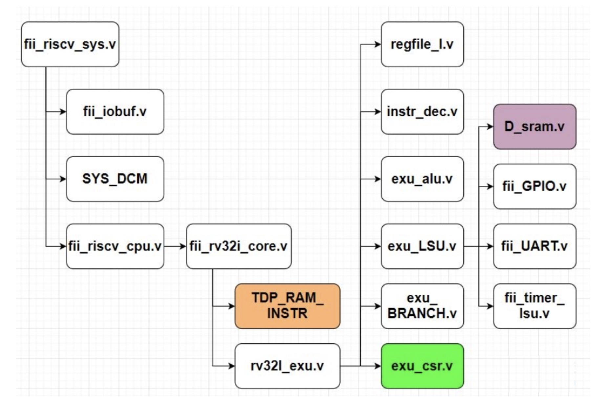
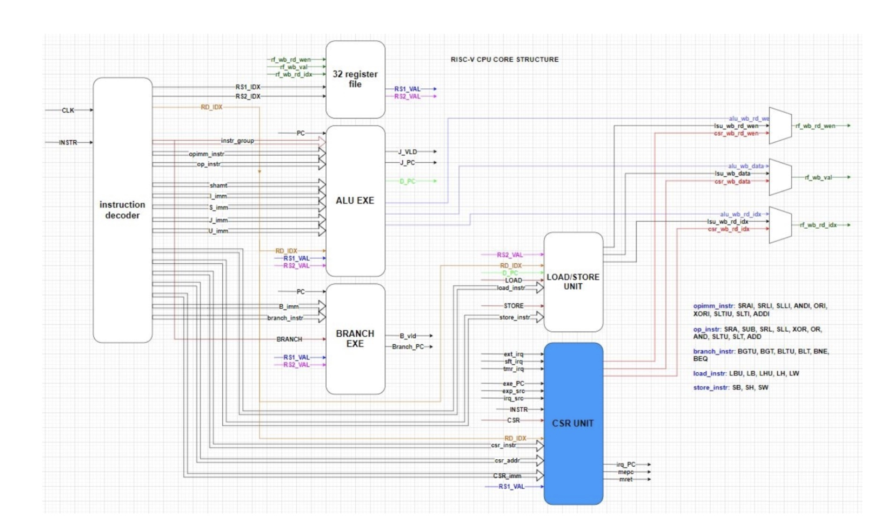
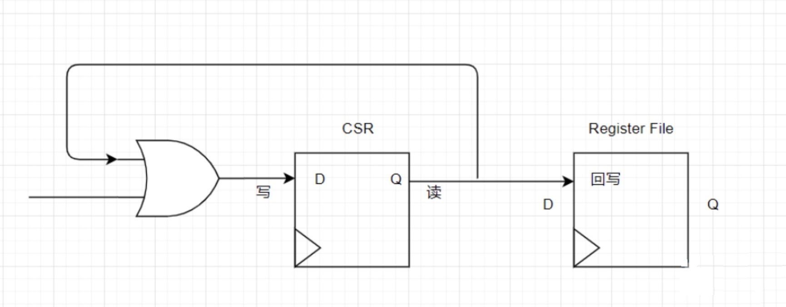
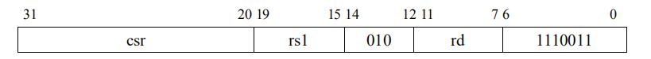

# CSR读写控制

来源：https://www.icfedu.cn/?s=RISC-V+CSR%E8%AF%BB%E5%86%99%E6%8E%A7%E5%88%B6

## 一、exu_csr模块

本文使用的代码是基于FII RISC-V V2.01(没有JTAG和总线)。有关CSR六条指令的复习见文章[RISC-V CSR寄存器（1）CSR简介和CSR指令](https://www.icfedu.cn/archives/6238)，本文将从exu_csr模块开始介绍RISC-V CPU中如何控制CSR的读写。





### 1、输入/输出

下面是比较重要的输入输出信号，相应的解释标在了代码段中。

```verilog
	input  sys_clk,              //系统时钟
    input  i_SYSTEM,             //CSR指令的opcode
    
    input  [ 31: 0 ] i_rs1_val,  //rs1的值
    input  [ 4: 0 ]  i_rd_idx,   //rd的索引
    input  [ 5: 0 ]  i_csr_instr,//csr的指令(6条之一)

    input  [ 11: 0 ] i_csr_addr, //索引CSR寄存器的12位地址
    input  [ 31: 0 ] i_csr_imm,  //零扩展后的立即数

    input  i_ext_irq,            //外部中断请求
    input  i_sft_irq,            //软件中断请求
    input  i_tmr_irq,            //计时器中断请求
    
    input  i_irq_src,            //中断源
    input  i_exp_src,            //异常源
    input  [ 31: 0 ] i_exe_pc,   //执行的程序计数器
    input  [ 31: 0 ] i_ir,       //指令寄存器

    output [ 31: 0 ]   o_irq_pc, //中断入口地址
    output [ 31: 0 ]   o_mepc,   //中断返回后需要执行的PC
    
    input  i_mret_ena,           //中断返回使能
    
//------------------------------省略与调试相关的信号-----------------------------------

    input  i_EXE_vld,            //执行有效


    output [ 31: 0 ] o_wr_csr_nxt,//写入CSR寄存器的值


    output o_rd_wen,             //CSR寄存器读使能，用于回写
    output [ 4: 0 ] o_wb_rd_idx, //回写索引
    output [ 31: 0 ] o_wb_data,  //回写数据

    output o_meie,               //外部中断使能
    output o_msie,               //软件中断使能
    output o_mtie,               //计时器中断使能
    output o_glb_irq,            //全局中断使能

    input  rst_n                 //复位
```

可以看出，以上主要可以分为中断相关信号和CSR指令执行相关信号。和exu_alu模块类似，csr指令的执行也需要寄存器相关的索引和值。中断相关的信号主要有高层模块输入的中断/异常请求信号，和底部模块输出的中断使能，PC信号。

### 2、执行

代码主体部分是CSR的6条指令，代码的解释如下：

```verilog
//--------------------省略部分信号的声明和赋值-------------------------
// CSR指令按照如下排列
// i_csr_instr = {rv32i_csrrci, rv32i_csrrsi, rv32i_csrrwi,
//                rv32i_csrrc,  rv32i_csrrs,  rv32i_csrrw};

// 写入寄存器的值
always @ ( * )
begin
    reg_csr_val <= 32'b0;//初始化
    
    if ( i_SYSTEM & csr_wen )
    begin
       
        case ( i_csr_instr )
            6'h01:            //rv32i_csrrw
            begin
                reg_csr_val <= i_rs1_val;              
            end
            6'h02:            //rv32i_csrrs
            begin
                reg_csr_val <= i_rs1_val | w_csr_val;  
            end
            6'h04:            //rv32i_csrrc
            begin
                reg_csr_val <= ( ~i_rs1_val ) & w_csr_val; 
            end
            6'h08:            //rv32i_csrrwi
            begin
                reg_csr_val <= i_csr_imm; 
            end
            6'h10:            //rv32i_csrrsi
            begin
                reg_csr_val <= i_csr_imm | w_csr_val;  
            end
            6'h20:            //rv32i_csrrci
            begin
                reg_csr_val <= ( ~i_csr_imm ) & w_csr_val; 
            end
            default: ;
        endcase
    end

end


//CSR[11:10]/机器码的bit 30-31如果不为2‘b11，即为可读可写的属性
wire csr_wen  = i_EXE_vld & i_SYSTEM & (i_csr_addr[11:10] != 2'b11);
wire csr_rden = i_EXE_vld & i_SYSTEM;
```

以上的代码用case选择，将CSR的指令进行区分以及写寄存器的实现。用以下代码举例

```verilog
6’h02:

begin
	reg_csr_val <= i_rs1_val | w_csr_val; //rv32i_csrrs
end
```

i_csr_instr的bit 2对应的CSR指令是CSRRS rd，csr，rs1。t = CSRs[csr]; CSRs[csr] = t | x[rs1]; x[rd] = t

该指令是把CSR寄存器中的值读出并赋值到rd寄存器中，且将CSR寄存器中的值和寄存器rs1中的值按位或(bitwise OR)的结果写入CSR寄存器。



其指令的机器码如图1所示。这里的实现CSR置位的功能是*reg_csr_val <= i_rs1_val | w_csr_val;* 

另外一部分CSR读寄存器的功能会在csr_reg模块里实现，之后讲到该模块时再进行解释。



所有的CSR指令都是每次只能对一个CSR寄存器操作，其机器码如图1所示。可以看到CSR指令类似于I-type指令。虽然也有12位的立即数域，但是实际上**机器码的bit 20-31是用来 索引相应CSR寄存器的地址**。所以理论上，一共可以实现2^12 = 4096位CSR寄存器。

**按照惯例，CSR地址的高位(CSR[11:8]/机器码的bit 28-31)用于根据权限级别对CSR的读写可访问性进行编码。**

```verilog
//CSR寄存器bit 10-11如果不为2‘b11即为可读可写的属性 
wire csr_wen = i_EXE_vld & i_SYSTEM & (i_csr_addr[11:10] != 2'b11); 
wire csr_rden = i_EXE_vld & i_SYSTEM;
```

- **前两位(CSR[11:10]/机器码的bit 30-31)指示该CSR寄存器是可读可写(00，01或10)还是只读(11)。**

- **接下来两位(CSR[9:8]/机器码的bit 28-29)编码表明可以访问该CSR寄存器的最低特权级别 [2]。**

这里，通过wire csr_wen和wire csr_rden 信号的实现，对相应的CSR寄存器进行可读可写属性的区分。

### 3、csr_reg实例

exu_csr模块下由csr_reg模块的例化，很多exu_csr的输出信号由csr_reg模块传递上来，同样，一些exu_csr的输入信号，也继续往下传递到了csr_reg模块。详细代码见下图：

```verilog
csr_reg csr_reg_U
(
    .sys_clk        ( sys_clk ),//系统时钟
 
    .i_mret_ena     ( i_mret_ena ),//中断返回使能
 
    .i_EXE_vld      ( i_EXE_vld ),//执行有效
//中断请求和中断源
    .i_ext_irq      ( i_ext_irq ),
    .i_sft_irq      ( i_sft_irq ),
    .i_tmr_irq      ( i_tmr_irq ),
    .i_irq_src      ( i_irq_src & o_glb_irq),
  
//异常源，异常PC和异常指令  
    .i_exp_src      ( i_exp_src ),
    .i_exe_pc       ( i_exe_pc ),
    .i_ir           ( i_ir ),
//中断PC和中断入口地址
    .o_irq_pc       ( o_irq_pc ),
    .o_mepc         ( o_mepc ),
     
//------------------------------省略与调试相关的信号-----------------------------------
 
//CSR指令相关信号    
    .i_csr_rden     ( csr_rden ),
    .i_csr_addr     ( i_csr_addr ),
    .i_csr_val      ( reg_csr_val ),
    .i_csr_wen      ( csr_wen ),
    .o_csr_val      ( w_csr_val ),
 
//由mie，mstatus寄存器输出的中断使能信号
    .o_meie         ( o_meie ),
    .o_msie         ( o_msie ),
    .o_mtie         ( o_mtie ),
    .o_glb_irq      ( o_glb_irq ),
 
    .rst_n          ( rst_n )//复位
);

```

## 二、csr_reg模块

本文使用的代码是基于FII RISC-V V2.01(没有JTAG和总线)。csr_reg的上层模块见[RISC-V CSR读写控制（1）exu_csr模块](https://www.icfedu.cn/archives/7006)，这里将主要介绍csr_reg模块，继续CSR读写控制的学习。

### 1、输入输出

```verilog
    input sys_clk,             //系统时钟


//---------------这里同样省略调试有关信号--------------
  
    input i_EXE_vld,           //执行有效

    input i_ext_irq,           //外部中断请求
    input i_sft_irq,           //软件中断请求
    input i_tmr_irq,           //计时器中断请求

    input i_irq_src,           //中断源
    input i_exp_src,           //异常源
    input [ 31: 0 ] i_exe_pc,  //执行的程序计数器
    input [ 31: 0 ] i_ir,      //指令寄存器

    output [ 31: 0 ] o_mepc,   //中断返回后需要执行的PC
    output [ 31: 0 ] o_irq_pc, //中断入口地址

    input i_csr_rden,          //CSR寄存器可读
    input [ 11: 0 ] i_csr_addr,//csr的指令(6条之一)
    input [ 31: 0 ] i_csr_val, //CSR指令写到CSR寄存器的值
    input i_csr_wen,           //CSR寄存器可写
    output [ 31: 0 ] o_csr_val,//CSR寄存器读出来的值

    output o_meie,             //外部中断使能
    output o_msie,             //软件中断使能
    output o_mtie,             //计时器中断使能
    output o_glb_irq,          //全局中断使能

    input rst_n                //复位

```

### 2、执行

代码主体中除了一些信号的声明和传递，还有对CSR寄存器的读，代码如下：

```verilog
assign o_csr_val = csr_reh_sel;  //CSR寄存器读出来的值

always@( * )   //CSR 读取

case ( i_csr_addr & { 12{ i_csr_rden } } )
    12'h300: csr_reh_sel = w_mstatus;
    12'h301: csr_reh_sel = w_misa;
    12'h304: csr_reh_sel = w_mie;
    12'h305: csr_reh_sel = w_mtvec;
    12'h306: csr_reh_sel = w_mcounteren;
    12'hf11: csr_reh_sel = w_mvendorid;
    12'hf12: csr_reh_sel = w_marchid;
    12'hf13: csr_reh_sel = w_mimpid;
    12'hf14: csr_reh_sel = w_mhartid;
    12'h340: csr_reh_sel = w_mscratch;
    12'h341: csr_reh_sel = o_mepc;
    12'h342: csr_reh_sel = w_mcause;
    12'h343: csr_reh_sel = w_mtval;
    12'h344: csr_reh_sel = w_mip;
    12'hb00: csr_reh_sel = w_mcycle_l;
    12'hb80: csr_reh_sel = w_mcycle_h;
    12'hb02: csr_reh_sel = w_minstret_l;
    12'hb82: csr_reh_sel = w_minstret_h;
    12'h7b0: csr_reh_sel = i_dcsr;
    12'h7b1: csr_reh_sel = i_dpc;
    12'h7b2: csr_reh_sel = i_dscratch;
    default: csr_reh_sel = 32'b0;
endcase
```

可以看到，通过对CSR地址的索引和CSR可读属性的判断，在不同的case下，将不同CSR寄存器的值读出来。

注意：这里的case选择，虽然列出了21条，但是在每一次的CSR指令读取中，只会有一个确切的CSR寄存器被读取，也就是说，一条CSR指令只会根据需要的地址**每次只执行一条**case。

> case ( i_csr_addr & { 12{ i_csr_rden } } )

这个写法中 *{ 12{ i_csr_rden } }*的*i_csr_rden*原本是1bit的信号，这里把它扩展成12位，是为了便于和CSR地址运算。例如：

- 如果该CSR寄存器可读，*i_csr_rden*为1，*{ 12{ i_csr_rden } }*即为12‘b1111_1111_1111，与 *i_csr_addr*相与得到的值，是 *i_csr_addr*本身，开始case选择；
- 如果该CSR寄存器不可读，*i_csr_rden*为0，*{ 12{ i_csr_rden } }*即为12‘b00000_0000_0000，与*i_csr_addr*相与得到的值为0，任何case都不满足，跳到default语句，也就是，将CSR寄存器读出的值赋0。

```verilog
assign o_glb_irq = w_mstatus[3];  //全局中断使能

wire [ 31: 0 ] vect_pc = {w_mtvec[ 31: 2 ], 2'b00} + {w_mcause[ 3: 0 ], 2'b00};  // Mode1，向量地址 = base + 4 X cause

assign o_irq_pc = ( w_mtvec[ 1: 0 ] == 0 ) ? {w_mtvec[ 31: 2 ], 2'b00}://选择中断入口地址
                  ( w_mtvec[ 1 :0 ] == 1 ) ? vect_pc : o_irq_pc;

wire status_ena = w_mstatus[3] & ( o_meie | o_mtie | o_msie ) & i_irq_src;//发生中断
```

上面的代码是关于输出全局中断使能*o_glb_irq*，传递*ststus_ena*中断发生信号给mstatus寄存器，用于MPIE和MIE位的判断。

*o_irq_pc*是中断的入口地址，由*w_mtvec*的bit 0-1决定输出的Mode

- Mode为1时，中断入口地址是向量地址，由base基地址 + 4 X cause(由mcause寄存器决定)组成
- Mode为0时，中断入口直接被赋值成base基地址
- 如果Mode等于2或者3，保留值，目前没有定义

**注意：mtvec寄存器中 bit 2-31中只有30位的base基地址，因为默认中断跳转的地址都是4字节对齐 [1]。**所以真正的中断入口地址，还需要左移2位，也就是上面代码中的*{w_mtvec[ 31: 2 ], 2’b00}*。

### 3、CSR寄存器实例

csr_reg模块下的实例由所有实现的CSR寄存器构成，有以下寄存器模块：

- csr_mtvec
- csr_mstatus
- csr_mtval
- csr_mepc
- csr_mcause
- csr_mie
- csr_mip
- csr_misa
- csr_mcounteren
- csr_mid：包括mvendorid，marchid，mimpid和mhartid
- csr_scratch：mscratch寄存器
- csr_mcycle：包括低位和高位的32位寄存器，共组成64位
- csr_minstret：包括低位和高位的32位寄存器，共组成64位
- dug_csr：包括一些和调试有关的信号

## 三、CSR寄存器实现

### 1、寄存器模块

要介绍的寄存器模块主要包括以下(其中的有些CSR寄存器没有完全实现)：

- csr_mtvec
- csr_mstatus
- csr_mtval
- csr_mepc
- csr_mcause
- csr_mie
- csr_mip
- csr_misa
- csr_mcounteren
- csr_mid：包括mvendorid，marchid，mimpid和mhartid
- csr_scratch：mscratch寄存器
- csr_mcycle：包括低位和高位的32位寄存器，共组成64位
- csr_minstret：包括低位和高位的32位寄存器，共组成64位

#### csr_mtvec

mtvec是一个可读可写寄存器。虽然mtvec有两种模式，但这里只实现了MODE 0， 也就是说，所有的中断入口地址都是基地址。实现mtvec的寄存器的部分重要代码如下：

```verilog
input [ 11: 0 ] i_csr_addr, //索引寄存器的地址
input [ 31: 0 ] i_csr_val,  //CSR指令写到寄存器上的值
input i_csr_wen,            //csr可写的属性

output [ 31: 0 ] o_mtvec,   //输出mtvec


wire wbck_csr_wen = i_csr_wen; //确定该寄存器可写
wire sel_mtvec = ( i_csr_addr == 12'h305 );     //通过地址索引确认寄存器

wire wr_mtvec = sel_mtvec & i_csr_wen;          //确认该寄存器既可写，又的确是mtvec
wire mtvec_ena = ( wr_mtvec & wbck_csr_wen );   //确认mtvec寄存器可写
wire [ 31: 0 ] mtvec_r;
wire [ 31: 0 ] mtvec_nxt = { i_csr_val[ 31: 2 ] , 2'b00 }; //中断入口地址都是基地址， MODE == 2'b00

fii_dfflr #( 32 ) mtvec_dfflr ( mtvec_ena, mtvec_nxt, mtvec_r, sys_clk, rst_n ); //锁存

assign o_mtvec = mtvec_r; //输出
```

#### csr_msatus

mstatus是一个可读可写寄存器。**mstatus控制全局中断的使能**。实现msatus的寄存器的部分重要代码如下(与上文重复的代码省略)：

```verilog
input i_mret_ena,        //中断返回
input i_status_ena,      //由全局中断&中断使能(包括计时器/外部/软件)&中断源组成

output [31:0] o_mstatus, //输出mstatus


wire sel_mstatus = (i_csr_addr == 12'h300);   //通过地址索引确认寄存器

wire wr_mstatus = sel_mstatus & wbck_csr_wen; //确认该寄存器既可写，又的确是mstatus
wire status_mpie_r;
wire status_mie_r;
// 在以下情况更新MPIE位
wire status_mpie_ena = 
                      // CSR指令写入
                      wr_mstatus |
                      // 中断返回
                      i_mret_ena |
                      // 中断到来
                      i_status_ena;

wire status_mpie_nxt = 
                      //中断来时，MPIE位更新为MIE位
                      i_status_ena ? status_mie_r :
                      // 中断返回时，MPIE设置成1
                      i_mret_ena ? 1'b1 :
                      // CSR指令写入
                      wr_mstatus ? i_csr_val[7] : // MPIE是mstatus寄存器的bit 7
                      status_mpie_r; // 如果以上条件都不满足，MPIE不变

fii_dfflr #(1) status_mpie_dfflr (status_mpie_ena, status_mpie_nxt, status_mpie_r, sys_clk, rst_n);//锁存

// MIE的实现与MPIE类似
wire status_mie_ena = status_mpie_ena; 
wire status_mie_nxt = 
                     // 中断来临时，MIE将值给MPIE，然后自己清零
                     i_status_ena ? 1'b0 :
                     // 中断返回时，MIE得到存储在MPIE中的值
                     i_mret_ena ? status_mpie_r :
                     // CSR指令写入
                     wr_mstatus ? i_csr_val[3] : // MIE是mstatus寄存器的bit 3
                     status_mie_r; // 如果以上条件都不满足，MIE不变

fii_dfflr #(1) status_mie_dfflr (status_mie_ena, status_mie_nxt, status_mie_r, sys_clk, rst_n);//锁存


//分别对mstatus的每一bit分开赋值
wire [31:0] status_tmp;
assign status_tmp[31]    = status_sd_r; // SD
assign status_tmp[30:23] = 8'b0; // 保留
assign status_tmp[22:17] = 6'b0; // TSR--MPRV
assign status_tmp[16:15] = status_xs_r; // XS
assign status_tmp[14:13] = status_fs_r; // FS
assign status_tmp[12:11] = 2'b11; // MPP 
assign status_tmp[10:9]  = 2'b0; // 保留
assign status_tmp[8]     = 1'b0; // SPP
assign status_tmp[7]     = status_mpie_r; // MPIE
assign status_tmp[6]     = 1'b0; // 保留
assign status_tmp[5]     = 1'b0; // SPIE 
assign status_tmp[4]     = 1'b0; // UPIE 
assign status_tmp[3]     = status_mie_r; // MIE
assign status_tmp[2]     = 1'b0; // 保留
assign status_tmp[1]     = 1'b0; // SIE 
assign status_tmp[0]     = 1'b0; // UIE


assign o_mstatus = status_tmp;//输出

```

#### csr_mtval

mtval也是可读可写的寄存器，**用来存储引发异常的原因**，比如非法指令，异常有关的信息等用来帮助软件处理，这里没有完全实现，只有基本的读写。在之前的定义中，是mbadaddr。相关的代码如下(与上文重复的代码省略)：

```verilog
input i_irq_src,          //中断源
input i_exp_src,          //异常源
input [ 31: 0 ] i_exe_pc, //当前的PC
input [ 31: 0 ] i_ir,     //当前的指令

output [ 31: 0 ] o_mtval, //输出mtval


wire sel_mtval = ( i_csr_addr == 12'h343 ); //通过地址索引确认寄存器
wire mtval_ena;
wire [ 31: 0 ] mtval_r;
wire [ 31: 0 ] mtval_nxt;
assign mtval_nxt = trap_mtval_ena ? i_trap_mtval_val : i_csr_val;//如果是中断/异常，存储相关的信息，不然由CSR指令写入
fii_dfflr #( 32 ) mtval_dfflr ( mtval_ena, mtval_nxt, mtval_r, sys_clk, rst_n );//锁存

assign o_mtval = mtval_r;//输出

endmodule
```

####  csr_mepc

mepc寄存器中存储在中断或异常发生时的**准备执行指令**的PC值，将在异常子程序中作为返回地址，是一个可读可写的寄存器。实现mepc寄存器的部分重要代码如下(与前面模块中重复的代码省略)：

```verilog
input i_irq_src,//中断源
input i_exp_src,//异常源
input [ 31: 0 ] i_exe_pc,//当前的PC

output [ 31: 0 ] o_mepc,//输出mepc


wire [ 31: 0 ] i_mepc;
wire [ 31: 0 ] mepc_r;


wire mepc_valid = (i_irq_src | i_exp_src) ? 1'b1 : 1'b0;//中断或者异常到来
assign i_mepc = mepc_valid ? i_exe_pc : mepc_r;//如果有中断/异常到来，把PC设置成当前PC，否则用之前存储的mepc


wire sel_mepc = ( i_csr_addr == 12'h341 );//通过地址索引确认寄存器
wire wr_mepc = sel_mepc & i_csr_wen;// mepc寄存器可写
wire mepc_ena = wr_mepc | mepc_valid;//使能由CSR指令写入或者中断/异常置起来

wire [ 31: 0 ] mepc_nxt;
assign mepc_nxt[ 31: 1 ] = mepc_valid ? i_mepc[ 31 : 1 ] : i_csr_val[ 31 : 1 ];//如果有中断，写入中断的返回地址，不然由CSR指令写入
assign mepc_nxt[ 0 ] = 1'b0; // mepc的地址至少要以2字节对齐，不然可能会生成地址错位异常

fii_dfflr #( 32 ) epc_dfflr ( mepc_ena, mepc_nxt, mepc_r, sys_clk, rst_n );//锁存
assign o_mepc = mepc_r;//输出

```

#### csr_mcause

mcause是一个可读可写的寄存器，记录最近一次进入异常或者中断时间的原因，以记录号(异常代码)的方式服务于中断或异常子程序。其具体值的定义可参见[RISC-V CSR寄存器（2）CSR寄存器](https://www.icfedu.cn/archives/6318)中的图8。

mcause也会与mtvec配合使用，如果mtvec的MODE为1， 那么中断的入口地址就会变成BASE + 4 X cause，这里的cause就是中断的异常代码(**异常发生时，中断入口地址依然是基地址**)。实现mcause寄存器的部分重要代码如下(与前面模块中重复的代码省略)：

```verilog
input i_irq_src,//中断源
input i_mie,//中断全局使能

input i_meie,//机器模式下外部中断使能
input i_mtie,//机器模式下计时器中断使能
input i_msie,//机器模式下软件中断使能

input i_sft_irq,//软件中断请求
input i_tmr_irq,//计时器中断请求
input i_ext_irq,//外部中断请求

input i_EXE_vld,//是否为执行阶段

input i_exp_src,//异常源
//下面是一些异常，目前没有实现，在外层csr_reg模块中硬连线到0。
input i_iam_exp,
input i_iaf_exp,
input i_illi_exp,
input i_bp_exp,
input i_mti_exp,
input i_lam_exp,
input i_laf_exp,
input i_saam_exp,
input i_saaf_exp,

output [ 31: 0 ] o_mcause,//输出mcause


wire m_is = i_mie & i_msie & i_sft_irq;//软件中断
wire m_it = i_mie & i_mtie & i_tmr_irq;//计时器中断
wire m_ie = i_mie & i_meie & i_ext_irq;//外部中断

//=============================异常和中断==================================================
wire [31:0] exp_mcause;
//发生异常时，mcause最高位是0
assign exp_mcause[31:5] = 27'b0;
//根据异常的种类，置相应的位
assign exp_mcause[4:0] = 
                         i_iam_exp  ? 5'd0 //Instruction address misaligned
                       : i_iaf_exp  ? 5'd1 //Instruction access fault
                       : i_illi_exp ? 5'd2 //Illegal instruction
                       : i_bp_exp   ? 5'd3 //Breakpoint
                       : i_lam_exp  ? 5'd4 //load address misalign
                       : i_laf_exp  ? 5'd5 //load access fault
                       : i_saam_exp ? 5'd6 //Store/AMO address misalign
                       : i_saaf_exp ? 5'd7 //Store/AMO access fault
                       : 5'h1F; //Otherwise a reserved value


wire [31:0] irq_mcause;
//发生中断时，mcause最高位是1
assign irq_mcause[31] = 1'b1;
assign irq_mcause[30:4] = 27'b0;
//根据中断的种类，置相应的位
assign irq_mcause[3:0] = m_is ? 4'd3 : // 3 Machine software interrupt
                         m_it ? 4'd7 : // 7 Machine timer interrupt
                         m_ie ? 4'd11 : // 11 Machine external interrupt
                         4'b0;

wire [31:0] mcause_val = i_irq_src ? irq_mcause : exp_mcause;//判断中断还是异常
//===============================================================================
wire mcause_valid = (i_irq_src | i_exp_src) ? 1'b1 : 1'b0;//中断/异常是否发生

wire sel_mcause = (i_csr_addr == 12'h342);//通过地址索引确认寄存器

wire [31:0] mcause_r;
wire [31:0] mcause_nxt = mcause_valid ? mcause_val : i_csr_val;//如果中断/异常发生， mcause被赋值成中断/异常的原因，否则被CSR指令写入

fii_dfflr #(32) mcause_dfflr (mcause_ena, mcause_nxt, mcause_r, sys_clk, rst_n);//锁存

assign o_mcause = mcause_r;//输出

```

#### csr_mie

mie寄存器是可读可写的，用于进一步对不同中断的分别使能控制，注意将其与mstatus的位MIE分开。实现mie寄存器的部分重要代码如下(与前面模块中重复的代码省略)：

```verilog
output [ 31: 0 ] o_mie,//输出mie
output o_meie,//输出机器模式下外部中断使能
output o_msie,//输出机器模式下软件中断使能
output o_mtie,//输出机器模式下计时器中断使能


wire sel_mie = ( i_csr_addr == 12'h304 );//通过地址索引确认寄存器

wire [ 31: 0 ] mie_r;
wire [ 31: 0 ] mie_nxt;

assign mie_nxt[ 31: 12 ] = 20'b0;//将其他的位硬连线到0
assign mie_nxt[ 11 ]     = i_csr_val[ 11 ]; //o_meie
assign mie_nxt[ 10: 8 ]  = 3'b0;
assign mie_nxt[ 7 ]      = i_csr_val[ 7 ]; //o_mtie
assign mie_nxt[ 6: 4 ]   = 3'b0;
assign mie_nxt[ 3 ]      = i_csr_val[ 3 ]; //o_msie
assign mie_nxt[ 2: 0 ]   = 3'b0;

fii_dfflr #( 32 ) mie_dfflr ( mie_ena, mie_nxt, mie_r, sys_clk, rst_n );//锁存


assign o_mie = mie_r;//输出

//单独将重要的中断使能位输出
assign o_meie = o_mie[ 11 ];
assign o_mtie = o_mie[ 7 ];
assign o_msie = o_mie[ 3 ];

```

#### csr_mip

mip是中断悬挂寄存器，当中断请求到来时，mip相应的位就会被置高。

mip寄存器虽然定义上是可读可写的，但在这里使用的MEIP，MSIP和MTIP都是只读的。实现mip寄存器的部分重要代码如下(与前面模块中重复的代码省略)：

```verilog
input i_sft_irq,//软件中断请求
input i_tmr_irq,//计时器中断请求
input i_ext_irq,//外部中断请求


output [ 31: 0 ] o_mip,//输出mip


wire sel_mip = ( i_csr_addr == 12'h344 );//通过地址索引确认寄存器


wire meip_r;
wire msip_r;
wire mtip_r;

//只要有中断请求，相应的中断悬挂位就会置起来
assign meip_r = i_ext_irq;
assign msip_r = i_sft_irq;
assign mtip_r = i_tmr_irq;

//将mip中的位分别赋值。
wire [ 31: 0 ] ip_r;
assign ip_r[ 31: 12 ] = 20'b0;
assign ip_r[ 11 ]     = meip_r;
assign ip_r[ 10: 8 ]  = 3'b0;
assign ip_r[ 7 ]      = mtip_r;
assign ip_r[ 6: 4 ]   = 3'b0;
assign ip_r[ 3 ]      = msip_r;
assign ip_r[ 2: 0 ]   = 3'b0;

assign o_mip = ip_r;//输出
```

#### csr_misa

misa寄存器可读可写，存储RISC-V CPU的信息，比如架构和支持的基本/压缩指令集。实现misa寄存器的部分重要代码如下(与上文重复的代码省略)：

```verilog
output [31:0] o_misa//输出misa寄存器


assign o_misa = {
2'b1 // 最高两位为2b'01表示为32位架构
,4'b0 // WIRI
,1'b0 // 25 Z Reserved
,1'b0 // 24 Y Reserved
,1'b0 // 23 X Non-standard extensions present
,1'b0 // 22 W Reserved
,1'b0 // 21 V Tentatively reserved for Vector extension 20 U User mode implemented
,1'b0 // 20 U User mode implemented
,1'b0 // 19 T Tentatively reserved for Transactional Memory extension
,1'b0 // 18 S Supervisor mode implemented
,1'b0 // 17 R Reserved
,1'b0 // 16 Q Quad-precision floating-point extension
,1'b0 // 15 P Tentatively reserved for Packed-SIMD extension
,1'b0 // 14 O Reserved
,1'b0 // 13 N User-level interrupts supported
,1'b0 // 12 M Integer Multiply/Divide extension
,1'b0 // 11 L Tentatively reserved for Decimal Floating-Point extension
,1'b0 // 10 K Reserved
,1'b0 // 9 J Reserved
,1'b1 // <= 8 I RV32I/64I/128I base ISA//目前实现的基本指令集是RV32I，32位整型的指令集
,1'b0 // 7 H Hypervisor mode implemented
,1'b0 // 6 G Additional standard extensions present
,1'b0 // 5 F Single-precision floating-point extension
,1'b0 // 4 E RV32E base ISA 
,1'b0 // 3 D Double-precision floating-point extension
,1'b0 // 2 C Compressed extension
,1'b0 // 1 B Tentatively reserved for Bit operations extension
,1'b0 // 0 A Atomic extension
};

```

#### csr_mcounteren

mcounteren寄存器是可读可写的，每一位分别对应一组计数器，无论CSR指令写入什么值，相应的计数器不受影响。mcounteren控制的是下一个特权级别是否能读出相应的计数器，如果相应的位为0，则尝试读出计数器会引起非法指令异常。如下图所示。

因为这里只实现了机器模式，所以没有用mcounteren。这里只实现了mcounteren的读写。实现mcounteren寄存器的部分重要代码如下(与上文重复的代码省略)：

```verilog
output [ 31: 0 ] o_mcounteren,//输出mcounteren


wire mcounteren_ena = (i_csr_wen & (i_csr_addr == 12'h306));//通过地址索引确认寄存器
wire [31:0] mcounteren_r;
wire [31:0] mcounteren_nxt = i_csr_val;

fii_dfflr #(32) mtvec_dfflr (mcounteren_ena, mcounteren_nxt, mcounteren_r, sys_clk, rst_n);//锁存

assign o_mcounteren = mcounteren_r;//输出

```

#### csr_mid

csr_mid模块中组合了很多和ID相关的寄存器，有mvendorid，marchid，mimpid和mhartid。这四个寄存器都是只读的。寄存器的具体含义参考[RISC-V CSR寄存器（2）CSR寄存器](https://www.icfedu.cn/archives/6318)中的**1.7-1.10**。寄存器实现的部分重要代码如下(与上文重复的代码省略)：

```verilog
output [31:0] o_mvendorid, //输出mvendorid
output [31:0] o_marchid,   //输出marchid
output [31:0] o_mimpid,    //输出mimpid
output [31:0] o_mhartid    //输出mhartid

//以下的三个ID没有完全实现
assign o_mvendorid = 32'b0;
assign o_marchid   = 32'b0;
assign o_mimpid    = 32'b0;
assign o_mhartid   = 32'b0;//hart ID为0表示CPU是单核
```

#### csr_scratch

mscratch寄存器是机器模式下可读可写，没有指定的用法。实现mscratch寄存器的部分重要代码如下(与上文重复的代码省略)：

````verilog
output [ 31: 0 ] o_mscratch, //输出mscratch

wire mscratch_ena = (i_csr_wen & (i_csr_addr == 12'h340)); //通过地址索引确认寄存器
wire [31:0] mscratch_r;
wire [31:0] mscratch_nxt = i_csr_val;

fii_dfflr #(32) mtvec_dfflr (mscratch_ena, mscratch_nxt, mscratch_r, sys_clk, rst_n);//锁存

assign o_mscratch = mscratch_r;//输出
````

#### csr_mcycle

csr_mcylce模块包括mcycle和mcycleh两个寄存器，用于计数过了多少个时钟周期。两个32位计数器组成一个64位的计数器。实现计数器的部分重要代码如下(与上文重复的代码省略)：

```verilog
//调试相关信号
input i_dbg_mode,
input i_dbg_stpcyl,


output reg [ 31: 0 ] o_mcycle_l,//输出mcycle寄存器，低32位
output reg [ 31: 0 ] o_mcycle_h,//输出mcycleh寄存器，高32位


wire dbg_stop = i_dbg_mode & i_dbg_stpcyl;//调试开始

always@( posedge sys_clk or negedge rst_n )
if ( !rst_n )//如果没有复位
begin
    o_mcycle_l <= 32'b0;
    o_mcycle_h <= 32'b0;
end
else if ( i_csr_wen )//CSR寄存器可写
begin
    case ( i_csr_addr )//CSR指令写入，根据地址索引到低位/高位寄存器
    12'hb00: o_mcycle_l <= i_csr_val;
    12'hb80: o_mcycle_h <= i_csr_val;
    default: ;
    endcase
end
else
begin
    if ( !dbg_stop )//如果不处于调试
    begin
        if ( o_mcycle_l == 32'hffff_ffff )//如果低32位寄存器已满
        begin
            o_mcycle_h <= o_mcycle_h + 1;//高位进位
            o_mcycle_l <= 0;
        end
        else
            o_mcycle_l <= o_mcycle_l + 1;//低32位的寄存器加1
    end
end

```

#### csr_minstret

csr_minstret模块与上面的csr_mcycle模块类似，包括minstret和minstreth两个32位寄存器，用来组成一个64位寄存器。minstret和minstreth主要用来计数已经执行过的指令。实现寄存器的部分重要代码如下(与上文重复的代码省略)：

```verilog
input i_EXE_vld,//判断是否处在执行阶段

//调试相关信号
input i_dbg_mode,
input i_dbg_stpcyl,


output reg [ 31: 0 ] o_minstret_l,//输出mintret寄存器，低32位
output reg [ 31: 0 ] o_minstret_h,//输出minstreth寄存器，高32位


wire dbg_stop = i_dbg_mode & i_dbg_stpcyl;//调试开始
always@( posedge sys_clk or negedge rst_n )
if ( !rst_n )//如果没有复位
begin
    o_minstret_l <= 32'b0;
    o_minstret_h <= 32'b0;
end
else if ( i_csr_wen )//CSR寄存器可写
begin
    case ( i_csr_addr )//CSR指令写入，根据地址索引到低位/高位寄存器
    12'hb02: o_minstret_l <= i_csr_val;
    12'hb82: o_minstret_h <= i_csr_val;
    default: ;
    endcase
end
else if ( ( i_EXE_vld ) && ( dbg_stop == 1'b0 ) )//如果不处于调试，且在执行阶段
begin
    if ( o_minstret_l == 32'hffff_ffff )//如果低32位寄存器已满
    begin
        o_minstret_l <= 0;
        o_minstret_h <= o_minstret_h + 1;//高位进位
    end
    else
        o_minstret_l <= o_minstret_l + 1;//低32位的寄存器加1
end

```

