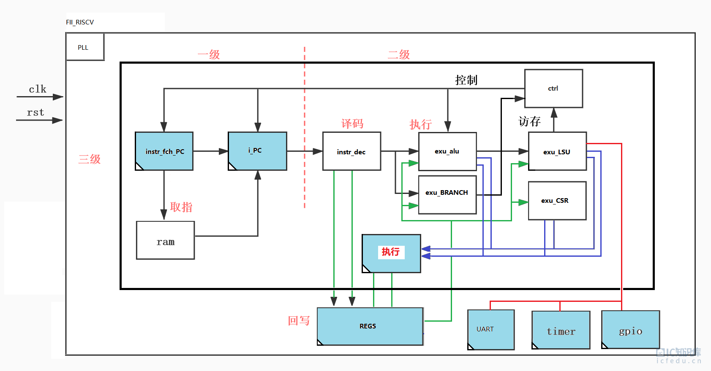
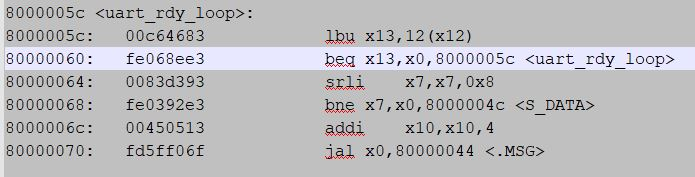
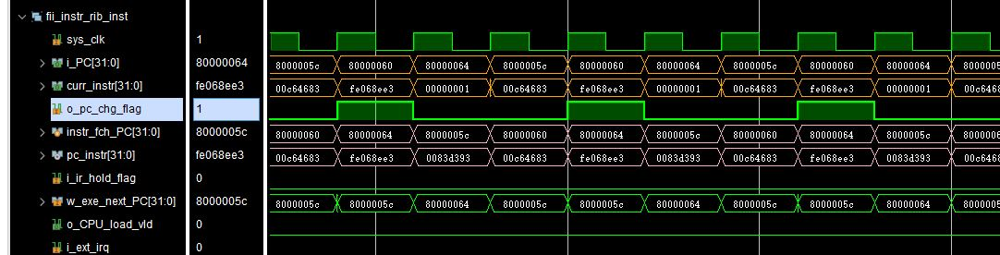

# EXU模块和CPU运行

## 一、rv32i_core模块

**当完成整个RISC-V 内核模块后， 需要ITCM 模块 读取软件编写代码的机器码， 按照取指， 译码，执行，访存，写回等逻辑来执行当前的机器码**， 这5个部分并不是每次都会发送，有时也会提前返回，比如 addi， 没有访存外部存储器。当前版本是RISC-V V2.01版， **使用的是状态机逻辑**， 在后续的版本中， 我们会修改为流水线方式。

### 相关代码

```verilog
module fii_rv32i_core 
# (
    parameter [31:0] TMR_BASEADDR  = 32'h0200_0000,
    parameter [31:0] PLIC_BASEADDR = 32'h0c00_0000,
    parameter [31:0] CPU_BASEADDR  = 32'h8000_0000,
    parameter [31:0] MEM_BASEADDR  = 32'h9000_0000,
    parameter [31:0] UART_BASEADDR = 32'he000_0000,
    parameter [31:0] GPIO_BASEADDR = 32'hf000_0000
)
(
    input sys_clk,

//====================================
    input  [ 31: 0 ] i_GPIO_dina,
    output [ 31: 0 ] o_GPIO_douta,
    output [ 31: 0 ] o_GPIO_ta,

    input  [ 31: 0 ] i_GPIO_dinb,
    output [ 31: 0 ] o_GPIO_doutb,
    output [ 31: 0 ] o_GPIO_tb,

    input  [ 31: 0 ] i_GPIO_dinc,
    output [ 31: 0 ] o_GPIO_doutc,
    output [ 31: 0 ] o_GPIO_tc,

    input  [ 31: 0 ] i_GPIO_dind,
    output [ 31: 0 ] o_GPIO_doutd,
    output [ 31: 0 ] o_GPIO_td,

    output txd_start,
    output [7:0] txd_data,
    input  txd_done,

//====================================
    output [31:0] o_sft_int_v,
    output [31:0] o_timer_l,
    output [31:0] o_timer_h,

    input  [31:0] i_timer_l,
    input  [31:0] i_timer_h, 

    output [31:0] o_tcmp_l,
    output [31:0] o_tcmp_h,

    output [1:0] o_timer_valid,
    output [31:0] o_tm_ctrl,


    input  [31:0] code_addr,
    input  [31:0] code_din,
    input  code_wea,
//====================================
    input  i_ext_irq,
    input  i_sft_irq,
    input  i_tmr_irq,

    output o_meie,
    output o_msie,
    output o_mtie,
    output o_glb_irq,
//====================================
    input  i_cpu_reset,
    input  rst_n
);

//===============================================================================
localparam [ 2: 0 ] IDLE = 8'd0,
                   I_FCH = 8'd1,
                   I_EXE = 8'd2,
                    I_LS = 8'd3,
                    I_WB = 8'd4,
                   I_RO1 = 8'd5,
                   I_RO2 = 8'd6,
                   I_RO3 = 8'd7;
wire ls_need;

// load program data
(* mark_debug = "yes" *)wire o_CPU_cs;
wire [ 31: 0 ] o_CPU_PC;
//===============================================================================
(* mark_debug = "yes" *) reg [ 2: 0 ] instr_st = 0;
reg [ 2: 0 ] instr_st_nxt = 0;
always@( posedge sys_clk )
if (( rst_n == 1'b0 ) | i_cpu_reset ) instr_st <= IDLE;
else instr_st <= instr_st_nxt;

always @ ( * )
begin
    case ( instr_st )
    IDLE: // 0
    begin
        if(!i_cpu_reset)
            instr_st_nxt = I_FCH;
        else
            instr_st_nxt = IDLE;
    end
    I_FCH: // 1
    begin
        if(i_cpu_reset) instr_st_nxt = IDLE;
        else instr_st_nxt = I_EXE;
    end
    I_EXE: // 2
    begin
        if ( ls_need & o_CPU_cs)
            instr_st_nxt = I_RO1;
        else 
            instr_st_nxt = I_WB;
    end
    I_WB: // 4
    begin
        instr_st_nxt = I_FCH;
    end
    I_RO1: // 5
    begin
        instr_st_nxt = I_RO2;
    end
    I_RO2: // 6
    begin
        instr_st_nxt = I_FCH;
    end
    I_RO3: // 7
    begin
        instr_st_nxt = I_FCH;
    end
    default : instr_st_nxt = IDLE;
    endcase
end
//===============================================================================
(* mark_debug = "yes" *)reg irq_tch_r = 0;
always @ (posedge sys_clk or negedge rst_n)
if(~rst_n) irq_tch_r <= 0;
else if(instr_st == I_FCH) irq_tch_r <= (i_ext_irq | i_sft_irq | i_tmr_irq);


(* mark_debug = "yes" *)wire w_irq_src = o_CPU_cs ? 1'b0 : irq_tch_r;
(* mark_debug = "yes" *)wire jump_irq_pc = w_irq_src & o_glb_irq;
wire w_exp_src = 0;
wire irq_exp = w_irq_src | w_exp_src ;

wire mret;
wire [31:0] mepc;
wire [31:0] w_irq_pc;
(* mark_debug = "yes" *) reg [ 31: 0 ] i_fch_PC = 0;
reg [ 31: 0 ] res_PC = 0;
wire [31:0] w_exe_PC;

always @( posedge sys_clk or negedge rst_n )
if ( !rst_n ) i_fch_PC <= CPU_BASEADDR;
else 
begin
    if ( instr_st == IDLE ) //0
        i_fch_PC <= CPU_BASEADDR;
    else if ( instr_st == I_EXE ) //2
    begin
        if( mret )
            i_fch_PC <= mepc;
        else if (jump_irq_pc)
            i_fch_PC <= w_irq_pc;
        else if( o_CPU_cs )
        begin
            i_fch_PC <= o_CPU_PC;
            res_PC <= w_exe_PC;
        end
        else i_fch_PC <= w_exe_PC;
    end
    else if ( instr_st == I_RO1 )
    begin
        i_fch_PC <= res_PC;
    end
end

//===============================================================================
(* mark_debug = "yes" *) reg EXE_vld = 0;
always @( posedge sys_clk or negedge rst_n )
if ( !rst_n ) EXE_vld <= 0;
else
begin
    if ( instr_st == I_FCH ) //1
        EXE_vld <= 1'b1;
    else
        EXE_vld <= 1'b0;
end


wire [ 31: 0 ] instr;

(* mark_debug = "yes" *)reg [ 31: 0 ] exe_instr = 0;
always @( posedge sys_clk or negedge rst_n )
if ( !rst_n ) exe_instr <= 0;
else if ( instr_st == I_FCH )
    exe_instr <= instr;

(* mark_debug = "true" *)reg i_CPU_load_vld = 0;
(* mark_debug = "true" *)reg [ 31: 0 ] i_CPU_load_data = 0;
always @( posedge sys_clk or negedge rst_n )
if ( !rst_n ) 
begin
    i_CPU_load_data <= 0;
    i_CPU_load_vld <= 0;
end
else if ( instr_st == I_RO2 )
begin
    i_CPU_load_data <= instr;
    i_CPU_load_vld <= 1'b1;
end
else i_CPU_load_vld <= 1'b0;

//===============================================================================

(* mark_debug = "yes" *) wire [ 31: 0 ] instr_PC = i_fch_PC;

rv32I_exu #
(
    .TMR_BASEADDR  ( TMR_BASEADDR ),
    .PLIC_BASEADDR ( PLIC_BASEADDR ),
    .CPU_BASEADDR  ( CPU_BASEADDR ),
    .MEM_BASEADDR  ( MEM_BASEADDR ),
    .UART_BASEADDR ( UART_BASEADDR ),
    .GPIO_BASEADDR ( GPIO_BASEADDR )
)
rv32I_exu_inst
(
    .sys_clk       ( sys_clk ),

    .i_ir          ( exe_instr ), // The instruction register
    .i_PC          ( instr_PC ), // The PC register along with
    .i_EXE_vld     ( EXE_vld ),

    .i_CPU_load_vld  ( i_CPU_load_vld),
    .i_CPU_load_data ( i_CPU_load_data ),

    .o_ls_need     ( ls_need ),

    .o_exe_PC      ( w_exe_PC ),

// load program data
    .o_CPU_cs      ( o_CPU_cs ),
    .o_CPU_PC      ( o_CPU_PC ),

    .i_ext_irq     ( i_ext_irq ),
    .i_sft_irq     ( i_sft_irq ),
    .i_tmr_irq     ( i_tmr_irq ),

    .o_meie        ( o_meie ),
    .o_msie        ( o_msie ),
    .o_mtie        ( o_mtie ),
    .o_glb_irq     ( o_glb_irq ),

    .i_irq_src     ( w_irq_src ),
    .i_exp_src     ( w_exp_src ),

    .o_mret        ( mret ),
    .o_irq_pc      ( w_irq_pc ),
    .o_mepc        ( mepc ),

//===============================================================================
    .i_GPIO_dina   ( i_GPIO_dina ),
    .o_GPIO_douta  ( o_GPIO_douta ),
    .o_GPIO_ta     ( o_GPIO_ta ),

    .i_GPIO_dinb   ( i_GPIO_dinb ),
    .o_GPIO_doutb  ( o_GPIO_doutb ),
    .o_GPIO_tb     ( o_GPIO_tb ),

    .i_GPIO_dinc   ( i_GPIO_dinc ),
    .o_GPIO_doutc  ( o_GPIO_doutc ),
    .o_GPIO_tc     ( o_GPIO_tc ),

    .i_GPIO_dind   ( i_GPIO_dind ),
    .o_GPIO_doutd  ( o_GPIO_doutd ),
    .o_GPIO_td     ( o_GPIO_td ),

    .txd_start     ( txd_start ),
    .txd_data      ( txd_data ),
    .txd_done      ( txd_done ),

    .o_sft_int_v   ( o_sft_int_v ),
    .i_timer_l     ( i_timer_l ),
    .i_timer_h     ( i_timer_h ),

    .o_timer_l     ( o_timer_l ),
    .o_timer_h     ( o_timer_h ),

    .o_tcmp_l      ( o_tcmp_l ),
    .o_tcmp_h      ( o_tcmp_h ),

    .o_timer_valid ( o_timer_valid ),
    .o_tm_ctrl     ( o_tm_ctrl),

    .i_cpu_reset   ( i_cpu_reset),
    .rst_n         ( rst_n )
);
//===============================================================================
wire instr_ena = ( instr_PC[ 31: 16 ] == CPU_BASEADDR[31:16] ) ? 1'b1 : 1'b0;

TDP_RAM_INSTR program_inst
(
    .clka  ( sys_clk ),
    .ena   ( 1'b1 ),
    .wea   ( code_wea ),
    .addra ( code_addr[31:2] ),
    .dina  ( code_din ),
    .douta ( ),

    .clkb  ( sys_clk ),
    .enb   ( instr_ena ),
    .web   ( 1'b0 ),
    .addrb ( instr_PC[ 31: 2 ] ), //8K 32bits, 32K byte
    .dinb  ( 32'b0 ),
    .doutb ( instr )
);
//===============================================================================


endmodule
```

### 模块介绍

执行状态机， 使用两段式状态机。 

在取指状态下锁存 各种中断状态，包括外部中断，软件中断，timer 中断。

如果上一条指令为普林斯顿架构，需要让这条指令执行完毕， 同时在CSR 寄存器中设置的全局中断enable （o_glb_irq) ， 这时产生的jump_irq_pc 有效。

在普林斯顿架构下，将load 指令读到的数据 送给 lsu 模块 。

nstr_ena 选择的时ITCM 地址空间。

这个双端口为ITCM ：

- 端口A ：用户可以通过uart 口，将软件的汇编机器码下载到 ITCM; 
- 端口B： instr_ena 是选中itcm, instr_PC[31：2] 是当前指令PC。instr 读取ITCM 的指令（如果是普林斯顿架构，也可以读取到的是数据）。

## 二、CPU运行过程（基于流水线）

当完成整个RISC-V 内核模块后， 需要ITCM 模块 读取软件编写的代码的机器码， 按照取指， 译码，执行，访存，写回等逻辑来执行当前的机器码， 这5个部分并不是每次都会发送，有时也会提前返回，比如 addi， 没有访存外部存储器。在版本是RISC-V V3.00版和之后的版本中， 使用的是流水线方式来处理cpu 指令。我们采用的是3级流水线方式。 



图中蓝色方块都是D触发器锁存。 代表流水线的级别。

**第一级流水线：**

由于我们使用dual port memory 作为ITCM (指令存储器），所以每次给出地址之后， 需要等待一个时钟周期， 然后才能得到相应的指令数据。所以取指的过程需要2个时钟周期。 但这个部分依然属于第一级流水线范畴（取指）。如果使用reg 堆积出来一个ram， 将会节省一个时钟周期， 缺点是占用大量的fpga 系统资源。

**第二级流水线：**

处理整个的译码，执行阶段。包括decoder （译码）， ALU（执行），branch （分支指令执行），CSR （寄存器相关的执行）

**第三级流水线：**

写回 32个通用寄存器（regfile）。如果是LOAD/STORE 相关的指令，处理外设相关的操作。这个部分会被连接到总线上，包括gpio ，timer， Uart, 以及之后risc-v cpu 扩展所需要的外设。

cpu 取指模块流水线：

```verilog
`timescale 1ns / 1ps 

module fii_instr_rib 
# (
    parameter [31:0] DBG_BASEADDR  = 32'h0000_0800,
    parameter [31:0] TMR_BASEADDR  = 32'h0200_0000,
    parameter [31:0] PLIC_BASEADDR = 32'h0c00_0000,
    parameter [31:0] CPU_BASEADDR  = 32'h8000_0000,
    parameter [31:0] MEM_BASEADDR  = 32'h9000_0000,
    parameter [31:0] UART_BASEADDR = 32'he000_0000,
    parameter [31:0] PWM_BASEADDR  = 32'hf000_2000,
    parameter [31:0] GPIO_BASEADDR = 32'hf000_0000
)
(
    input  sys_clk,

    output reg [31:0] o_curr_pc,
    output [31:0]   o_curr_instr,

//===============================================================================
    input           i_pc_chg_flag,
    input           i_ir_hold_flag,
    input  [31:0]   i_exe_next_PC,

    output          o_CPU_load_vld,
//===============================================================================

    input  i_ext_irq,
    input  i_sft_irq,
    input  i_tmr_irq,

    input  o_glb_irq,                 // mstatus[3]; enable all Machine Mode interrupt

    input  [31:0] i_dbg_entry_adr,    // jtag debug entry address
    input  i_dbg_entry_set,           // jtag debug entry address enable ( one clock )

    input  [31:0] i_dpc_r,
    input  [31:0] i_dbg_instr,
    input  dret,

    input  [31:0]  i_mepc,
    input  [31:0]  i_vect_pc,                    // mtvec regitesr content
    output o_irq_src,
    output o_exp_src,
    input  mret,
    input  dbg_start,

//===============================================================================
    input  itcm_wea,
    input  [31:0] itcm_addra,
    input  [31:0] itcm_dina,    

//===============================================================================
    input  [31:0] i_rib_saddr,
    input  [31:0] i_rib_sdin,
    output [31:0] o_rib_sdout,
    input  i_rib_svalid,
    output [1:0] o_rib_sready,
    input  [3:0]  i_rib_swe,
    input  i_rib_srd,
    input  i_rib_sop,
//===============================================================================
    // master bus signal
    input  i_rib_mvalid,
    input  [1:0] i_rib_mready,
//===============================================================================

    input  i_cpu_reset,    
    input  rst_n
);

//===============================================================================
// cpu master bus operation

// long instruction : dec_instr should be set as 'INST_NOP, during long instruction.
reg  rib_delay_op = 0;
always @ ( posedge sys_clk or negedge rst_n)
if(!rst_n) rib_delay_op <= 0;
//else if ( o_rib_mvalid & ~i_rib_mready[0] ) rib_delay_op <= 1;
else if ( i_rib_mvalid ^ i_rib_mready[0] ) rib_delay_op <= 1;
else rib_delay_op <= 0;


wire  bus_hsk_ok = i_rib_mvalid & i_rib_mready[0];

// long period load & store operation; normal operation long_ir_flag is 0
  wire  long_ir_flag = ( i_rib_mvalid & (~i_rib_mready[0]) ) | rib_delay_op;

// long period instruction pos edge; normal operation long_ir_cs is 0 
  wire  long_ir_cs = ( i_rib_mvalid & (~i_rib_mready[0]) ) & i_rib_sop;

//===============================================================================
  wire o_CPU_load_cs = ( i_rib_saddr[ 31: 16 ] == CPU_BASEADDR[ 31: 16 ] ) ? i_rib_sop : 1'b0;
/*
ls_r is used for 0x8000_0000 DATA load instruction, becasue 0x8000_0000 is dual
port ram , it will be delay 2 clock (output data form dual port ram), the ls_r[1]
is signal that o_cpu_load_cs delay 2 clock
*/


reg [1:0] ls_r = 0;
always @( posedge sys_clk or negedge rst_n)
if(!rst_n) ls_r <= 0;
else
    ls_r <= {ls_r[0], o_CPU_load_cs};


assign o_CPU_load_vld = ls_r[1];
assign o_rib_sready = {1'b0, ls_r[1]};
//===============================================================================
wire [31:0] pc_instr;

wire [31:0]   i_CPU_load_data = pc_instr;

wire [ 4: 0 ] data_sft = {i_rib_saddr[ 1: 0 ], 3'b000};  //i_D_PC[ 1: 0 ] * 8;  
wire [ 31: 0 ] o_CPU_dout = i_CPU_load_data >> data_sft;

assign o_rib_sdout = o_CPU_dout;

//===============================================================================
reg [ 31: 0 ] instr_fch_PC = 0;
//===============================================================================

/*
next_addr is relevent o_cpu_load_cs, for example : current program pc is 0x8000_0004,
(load instruction ,data at 0x8000_01000), next_addr will be next program pc
0x8000_0004 + 4, after load instruction finish. 
*/

reg [31:0] next_addr = 0;
always @( posedge sys_clk )
if(!rst_n | i_cpu_reset) next_addr <= CPU_BASEADDR;
else if(i_rib_sop) next_addr <= instr_fch_PC;
//===============================================================================
assign o_exp_src = 0;
wire nop_flag; 
// don't generate interrupt when cpu load & flush instruction
assign o_irq_src = (long_ir_flag | nop_flag) ? 1'b0 : (i_ext_irq | i_sft_irq | i_tmr_irq);

wire irq_exp_flag = (o_irq_src & o_glb_irq) | o_exp_src ;  // edge o_irq_src high, then o_glb_irq low
//===============================================================================
reg  [31:0] jump_addr = 0;
always @( * )
begin
    if(i_dbg_entry_set)
        jump_addr = i_dbg_entry_adr;
    else if(dret)
        jump_addr = i_dpc_r;
    else if (long_ir_cs) // long address & (addr == 0x8000_xxxx)
        jump_addr = {i_rib_saddr[31:2], 2'b00};
    else if( irq_exp_flag ) 
        jump_addr = i_vect_pc;    // mtvec regitesr content
    else if( mret )
        jump_addr = i_mepc;       // The PC before enter interrupt
    else if( i_ir_hold_flag )
        jump_addr = o_curr_pc;    // long term instruction ,pc hold at current position
    else jump_addr = i_exe_next_PC;
end

wire w_jump_flag = i_dbg_entry_set | dret | irq_exp_flag | i_pc_chg_flag | mret | long_ir_cs | i_ir_hold_flag;
//===============================================================================
//stage  1
always @( posedge sys_clk )
if (( !rst_n ) | i_cpu_reset ) instr_fch_PC <= CPU_BASEADDR;
else 
begin
    if (w_jump_flag)
        instr_fch_PC <= jump_addr;
    else if( ~bus_hsk_ok & rib_delay_op ) // long period load & store 
        instr_fch_PC <= next_addr;
    else
        instr_fch_PC <= instr_fch_PC + 4;
end


//===============================================================================
//stage  2
always @( posedge sys_clk or negedge rst_n )
if ( !rst_n ) o_curr_pc <= CPU_BASEADDR;
else  o_curr_pc <= i_ir_hold_flag ? o_curr_pc : (bus_hsk_ok & rib_delay_op) ? next_addr : instr_fch_PC;
//else  o_curr_pc <= instr_fch_PC;

//===============================================================================
/*
 next clock should be output a inst_nop , because dual port ram , address jump, 
 the pipeline address (current address + 4) will be ignore, 
*/

reg waiting_r = 0;
always @ (posedge sys_clk or negedge rst_n)
if(!rst_n) waiting_r <= 0;
else  waiting_r <= w_jump_flag;

//===============================================================================
// w_dbg_pc  point to 0x8000_xxxxx address , we need get data from dual port ram ,
// so, w_dbg_pc need 2 clock to get the data(0x8000_xxxx)

wire [31:0] w_dbg_pc = instr_fch_PC;

localparam [ 31: 0 ] DBG_RAM_ADDR    = 32'h0000_0400;

// 0x400 - 0x800


wire dbg_addr_sel = (w_dbg_pc[31:12] ==  DBG_BASEADDR[31:12]) & (w_dbg_pc[11:10] !=  2'b00) ? 1'b1 : 1'b0;
reg dbg_addr_cs = 0;

always @ (posedge sys_clk or negedge rst_n)
if(!rst_n) dbg_addr_cs <= 0;
else    dbg_addr_cs <= dbg_addr_sel;

//===============================================================================
wire [31:0] instr_data_sel = dbg_addr_cs ? i_dbg_instr : pc_instr ;
assign o_curr_instr = (waiting_r) ? `INST_NOP : instr_data_sel;


assign nop_flag = (o_curr_instr == `INST_NOP) ? 1'b1 : 1'b0;
//===============================================================================
wire instr_ena = ( instr_fch_PC[ 31: 16 ] == CPU_BASEADDR[31:16] ) ? 1'b1 : 1'b0;

TDP_RAM_INSTR  program_inst
(
    .clka   ( sys_clk ),
    .ena    ( 1'b1 ),
    .wea    ( itcm_wea ),
    .addra  ( itcm_addra[31:2] ),
    .dina   ( itcm_dina ),
    .douta  ( ),

    .clkb   ( sys_clk ),
    .enb    ( instr_ena ),
    .web    ( 1'b0 ),
    .addrb  ( instr_fch_PC[ 31: 2 ] ), //8K 32bits, 32K byte
    .dinb   ( 32'b0 ),
    .doutb  ( pc_instr )
);

//===============================================================================


endmodule
```

### 代码分析

**端口说明：**

```verilog
input sys_clk,                              // 系统时钟

output reg [31:0] o_curr_pc,             // 输出 当前的PC 值
output       [31:0] o_curr_instr,          // 输出 当前的 指令值

//=======================================================================
input i_pc_chg_flag,               // 译码，执行模块通知 pc 值需要更改，不再是正常的 + 4
input i_ir_hold_flag,                // 处理乘除法指令
input [31:0] i_exe_next_PC, // 译码，执行模块通知 下一个pc 值 

output o_CPU_load_vld,        // 普林斯顿架构 itcm 提供的数据有效
//=======================================================================

input i_ext_irq,                        // 外部中断
input i_sft_irq,                         // 软件中断
input i_tmr_irq,                       // timer中断 

input o_glb_irq,                       // CSR 全局中断位，mstatus[3]; enable all Machine Mode interrupt

input [31:0] i_dbg_entry_adr, // jtag 调试入口地址，jtag debug entry address
input i_dbg_entry_set,           // jtag 调试入口 enable， jtag debug entry address enable ( one clock )

input [31:0] w_dpc_r,             // jtag 调试 pc
input [31:0] w_dbg_instr,      // jtag 调试 指令 
input dret,                                  // jtag 调试中断 返回

input [31:0] i_mepc,                // 中断时，存储的当前pc 值
input [31:0] i_vect_pc,           // 中断时， 跳入中断的pc 值，mtvec regitesr content
output o_irq_src,                   // 通知 CSR 模块 中断信号线
output o_exp_src,                  // 通知 CSR 模块 异常信号线
input mret,                                // 中断返回 信号
input dbg_start,                       // 进入jtag 调试 信号

//=======================================================================
input itcm_wea,                      // ITCM 更新 写 enable 
input [31:0] itcm_addra,      // ITCM 更新 地址
input [31:0] itcm_dina,        // ITCM 更新 数据

//=======================================================================

// riscv 内部总线 slave 总线
input [31:0] i_rib_saddr,    // riscv 内部总线 地址
input [31:0] i_rib_sdin,      // riscv 内部总线 写数据
output [31:0] o_rib_sdout,// riscv 内部总线 读数据
input i_rib_svalid,               // riscv 内部总线 指令有效
output [1:0] o_rib_sready, // riscv 内部总线 ，外设读取的数据有效
input [3:0] i_rib_swe,        // riscv 内部总线 写 enable
input i_rib_srd,                    // riscv 内部总线 读 信号
input i_rib_sop,                  // riscv 内部总线 指令操作 enable
//=======================================================================
// riscv 内部总线 master 总线，master bus signal
input i_rib_mvalid,           // riscv 内部总线指令有效
input [1:0] i_rib_mready,// riscv 内部总线，外部读取的数据有效
//=======================================================================
```

**长周期指令操作：**

在长周期的操作时，需要插入空指令，保持流水线连续。

```verilog
// cpu master bus operation

// long instruction : dec_instr should be set as ‘INST_NOP, during long instruction.
reg rib_delay_op = 0;
always @ ( posedge sys_clk or negedge rst_n)
if(!rst_n) rib_delay_op <= 0;
else if ( i_rib_mvalid ^ i_rib_mready[0] ) rib_delay_op <= 1;
else rib_delay_op <= 0;


wire bus_hsk_ok = i_rib_mvalid & i_rib_mready[0];

// long period load & store operation; normal operation long_ir_flag is 0
wire long_ir_flag = ( i_rib_mvalid & (~i_rib_mready[0]) ) | rib_delay_op;

// long period instruction pos edge; normal operation long_ir_cs is 0
wire long_ir_cs = ( i_rib_mvalid & (~i_rib_mready[0]) ) & i_rib_sop;
```

长周期指令，包括普林斯顿结构数据读取， jtag 相关指令。


**普林斯顿架构下， 读取的数据延迟：**

```verilog
reg [1:0] ls_r = 0;
always @( posedge sys_clk or negedge rst_n)
if(!rst_n) ls_r <= 0;
else
ls_r <= {ls_r[0], o_CPU_load_cs};


assign o_CPU_load_vld = ls_r[1];
assign o_rib_sready = {1’b0, ls_r[1]};
```

由于使用的时双端口 memory， 需要延迟一个时钟周期，配合总线一起使用。

**lb,lw,lh等load 指令的相关处理：**

```verilog
wire [ 4: 0 ] data_sft = {i_rib_saddr[ 1: 0 ], 3’b000}; //i_D_PC[ 1: 0 ] * 8;
wire [ 31: 0 ] o_CPU_dout = i_CPU_load_data >> data_sft;

assign o_rib_sdout = o_CPU_dout;
```

**普林斯顿架构下，保存当前pc操作：**

```verilog
reg [31:0] next_addr = 0;
always @( posedge sys_clk )
if(!rst_n | i_cpu_reset) next_addr <= CPU_BASEADDR;
else if(i_rib_sop) next_addr <= instr_fch_PC;
```

**中断源处理：**

```verilog
assign o_exp_src = 0;
wire nop_flag;
// don’t generate interrupt when cpu load & flush instruction
assign o_irq_src = (long_ir_flag | nop_flag) ? 1’b0 : (i_ext_irq | i_sft_irq | i_tmr_irq);

wire irq_exp_flag = (o_irq_src & o_glb_irq) | o_exp_src ; // edge w_irq_src high, then o_glb_irq low
```

长周期指令， 空指令等需要等待， 其他情况时，触发中断。

**各种情况下的的pc 跳转：**

```verilog
reg [31:0] jump_addr = 0;
always @( * )
begin
    if(i_dbg_entry_set)
        jump_addr = i_dbg_entry_adr;
    else if(dret)
        jump_addr = i_dpc_r;
    else if (long_ir_cs)               // long address & (addr == 0x8000_xxxx)
        jump_addr = {i_rib_saddr[31:2], 2’b00};
    else if( irq_exp_flag )
        jump_addr = i_vect_pc; // mtvec regitesr content
    else if( mret )
        jump_addr = i_mepc;      // The PC before enter interrupt
    else if( i_ir_hold_flag )
        jump_addr = o_curr_pc; // long term instruction ,pc hold at current position
    else jump_addr = i_exe_next_PC;
end
```

**准备跳转的pc：**

```verilog
wire w_jump_flag = i_dbg_entry_set | dret | irq_exp_flag | i_pc_chg_flag | mret | long_ir_cs | i_ir_hold_flag;

always @( posedge sys_clk )
if (( !rst_n ) | i_cpu_reset ) instr_fch_PC <= CPU_BASEADDR;
else
begin
     if (w_jump_flag)
         instr_fch_PC <= jump_addr;
     else if( ~bus_hsk_ok & rib_delay_op ) // long period load & store
         instr_fch_PC <= next_addr;
     else
         instr_fch_PC <= instr_fch_PC + 4;
end
```

**实际要跳转的pc：**

```verilog
always @( posedge sys_clk or negedge rst_n )
if ( !rst_n ) o_curr_pc <= CPU_BASEADDR;
else o_curr_pc <= i_ir_hold_flag ? o_curr_pc : (bus_hsk_ok & rib_delay_op) ? next_addr : instr_fch_PC;
```

**空指令enable 信号：**

当发生跳转时（不是正常的pc + 4），需要插入空指令，保持流水线连续， 

```verilog
reg waiting_r = 0;
always @ (posedge sys_clk or negedge rst_n)
if(!rst_n) waiting_r <= 0;
else waiting_r <= w_jump_flag;

assign o_curr_instr = (waiting_r) ? `INST_NOP : instr_data_sel;
```





流水线操作要比状态机操作复杂一些， 尤其时增加了jtag 的调式功能之后。这个部分可以参考以上的代码， 同时仿真整个risc-v 的工程，帮助了解流水线操作的相关cpu 运作。
