# RISC-V 总线和流水线

来源：https://www.icfedu.cn/?s=RISC-V+%E6%80%BB%E7%BA%BF%E5%92%8C%E6%B5%81%E6%B0%B4

## 一、总线简介

### 1、总线

在计算机体系结构中，总线（最初来自拉丁词omnibus）是一种通信系统，可在计算机内部组件之间或计算机之间传输数据。早期的总线主要是连接内存和外设的线束。

早在1981年，IBM公司就开发了ISA总线。ISA全称为Industry Standard Architecture，为8比特或是16比特宽的并行总线，速度最高可达16 MB/s。乍一面世，ISA总线就被广泛使用，直到1993年满足更高传输速度的Intel公司发明的总线，PCI面世。

PCI（Peripheral Component Interconnect）总线的最高传输速度为533 MB/s，总线位宽也被扩展到32比特/64比特，更适合当时处理器的爆炸式发展速度。并且PCI总线支持即插即用，和ISA总线添加新设备时需要复杂的配置参数（IRQ线，I/O地址和DMA等）相比，PCI总线使用起来更方便。

PCI总线之后AGP（Accelerated Graphics Port）总线作为满足3D显卡的后继也逐渐崭露头角。而在之后的发展时期，PCI又通过后继者PCI-X和PCI-express，进一步提高速度和扩展了性能。当今，PCI-express是最广泛用来连接显卡，硬盘驱动等的总线。除此之外，还有许多现代总线在不同的应用场合发挥着必不可少的重要作用。

总线的发展可以大致分为3代：

1. 初代总线都有一个致命的缺点：总线上的所有设备必须以相同的时钟主频运行，因此快速的CPU可能因为需要迁就慢速的外设而降低速度通信。
2. 发展的总线可以将CPU和内存之间的通信，外设之间的通信分开控制（总线控制器是南桥芯片的前身）。这就可以使得CPU在不影响总线的情况下提高速度。
3. 之后的总线允许以支持内存和视频卡所需的非常高的速度运行，同时在与较慢的外设通信时还支持较低的速度。进一步将慢速和快速的设备切割开来。CPU和内存之间的控制是北桥芯片的前身。CPU和北桥之间连接的总线被称为前端总线（Front Side Bus，FSB）。

现代总线根据计算机传输的信息类型，可划分为数据总线，地址总线和控制总线，分别用于传输数据，地址和控制信号。

总线分类有很多种：

- 从计算机的角度来看，根据总线的主要角色，内部或外部连接设备可以分为**内部总线**和**外部总线**。 SPI和I2C是内部总线，而Firewire（IEEE 1394）和GPIB（IEEE-488）是外部总线。
- 分类也可以基于数据传输形式，总线可以是串行或并行的。**并行总线**在多条线上并行承载数据字，而**串行总线**以位串行形式传输数据。例如，PCIE和USB是串行总线，而ISA和Wishbone是并行的。
- 通过总线是否有单独时钟线可以分为**同步总线**和**异步总线**。同步总线一般有单独的时钟线，异步总线的时钟信号由数据信号的边沿提取。比如SPI和I2C就是同步总线，UART和CAN为异步总线。

使用总线可以标准化输入和输出的数据格式，使CPU与外围设备，外围设备和外围设备之间的数据通信不依赖于其自身的数据格式。 由于外围设备的种类繁多，因此外围设备的数据格式必须采用相同的标准。 只要计算机使用USB协议并与相应的软件配合使用，当计算机访问打印机，麦克风，键盘等多个外围设备时，外围设备就可以工作，而无需设计各种与计算机连接的接口。 这样，消除了不同设计接口连接的复杂性，并且计算机和外围设备的设计得以分离和简化。

### 2、不同通信接口举例

RAM，FIFO，FLASH等都是FPGA的内部逻辑，但是它们具有不同的模块和通信接口。 以下是RAM和FIFO的接口模块。

RAM模块

```verilog
//单端口RAM，也可以设置为双端口RAM
TSP_RAM     your_instance_name 
(
  .clka   (clka),       // 输入 clka
  .wea    (wea),        // 输入 [0 : 0] wea
  .addra  (addra),      // 输入 [11 : 0] addra
                        // 第二次实例化RAM的时候，可能就需要不同长度的地址
  .dina   (dina),       // 输入 [31 : 0] dina
  .douta  (douta),      // 输出 [31 : 0] douta
);
```

FIFO 模块

```verilog
fifo_generator     your_instance_name (
  .clk    (clk),      // 输入 clk
  .srst   (srst),     // 输入 srst, reset

  .din    (din),      // 输入 [7 : 0] din
  .wr_en  (wr_en),    // 输入 wr_en

  .rd_en  (rd_en),    // 输入 rd_en
  .dout   (dout),     // 输出 [7 : 0] dout

                      // FIFO 满/空
  .full   (full),     // 输出 FIFO满
  .empty  (empty)     // 输出 FIFO空
);
```

CPU需要同时连接RAM和FIFO，但显然它们具有不同的数据长度和不同的地址格式。 如果CPU不需要为每个外围设备设计特定的接口，则可以节省大量时间来设计CPU本身。 RISC-V CPU加载和存储的模块示例：

```verilog
i_D_PC,          // 外围设备地址 (比如 FIFO, RAM)
i_LOAD,          // 加载指令

i_load_instr,    // {rv32i_lbu,rv32i_lb,rv32i_lhu,rv32i_lh,rv32i_lw};

o_rd_wen,        // 读写使能
i_rd_idx,        // 寄存器索引，用于回写
o_wb_data,       // 回写数据

i_STORE,         // 储存指令
i_store_instr,   // {rv32i_sb,rv32i_sh,rv32i_sw};

i_rs2_val,       // 实际储存在外围设备的值
```

可以看出，CPU接口与外围设备也有所不同。 同时，外围设备始终在发展。 如果没有总线，即使CPU在最初设计时也考虑了所有外围设备，随着外围设备的扩展，最终还是会产生问题。

### 3、使用总线的优点

假设CPU和外围设备之间没有总线，那么一些问题需要解决：

- 将CPU译码出来的指令信息转换为RAM接口所需的信号。同时也将CPU译码出来的指令信息转换为FIFO接口所需的信号。
- 时钟不匹配。 外围设备可能是超低速设备，也可能是可以在多个时钟周期内获取数据的设备（例如DDR需要数十个时钟才能读取或写入一次数据）。
- RISC-V CPU设计者必须逐个处理不同的外围设备。这样，CPU core设计者和外围IP设计者必须协同合作。很多项目是由多个开发者或多个公司完成，这增加了很多沟通成本。

解决方法就是使用总线，优点如下：

- 使用相同的标准，无需关心外围设备接口。
- 无需担心CPU与外围设备之间的时钟不匹配，即使外围设备是多时钟周期的低速设备。
- CPU设计者专注于CPU core的设计。 外围设备开发者关注外围设备的相关开发。 每个人都遵守总线规范，即可轻松实现互连。
- 总线可以扩展和互连。 例如，可以将FII RISC-V总线扩展为AHB，而不会破坏当前的总线结构，并且可以直接使用以前由AHB连接的IP内核。
- 这对外围设备的裁剪也非常有帮助。不需要更改CPU，只需更新地址，即可定制芯片。

## 二、FII RISC-V CPU总线设计

### 1、学习总线设计

学习设计总线是本文的学习目的，在学习时遵循从简单到复杂的设计。本文将分析目前已有的总线来说明为什么需要设计特有的FII RISC-V BUS。首先，设计这个总线的目的是在CPU内部传输数据。

#### 复杂但功能强大的AXI总线

AXI（Advanced eXtensible Interface）总线是ARM公司的AMBA（Advanced Microcontroller Bus Architecture）部分协议。其特点是总线接口多，协议全面，操作复杂，且可以实现灵活控制。

上述的AXI总线的优点另一方面来看也是缺点。针对一个专为嵌入式 IoT设计的CPU而言，无论是使用还是调试时，AXI过于庞大和复杂。完全支持像AXI4这样的总线会消耗太多资源，耗电。

#### 简单易控制的SPI总线

SPI总线是由1979年Motorola公司发明的同步串行总线，常用于SD（secure digital） card和LCD（liquid crystal display）显示屏通信中。SPI总线的硬件实现也很简单，通讯线比较少，一般只有4条，但不使用SPI作为总线的原因是，在CPU内部，数据传输一般都是并行的，而SPI是串行总线，如果使用SPI总线作为RISC-V内部总线，需要多次串并，并串的转换。

---

通过上述的两个具有代表性的总线可以看出，现有的总线要么复杂难以控制，要么过于简单，不适用于CPU内部传输。因此，在综合考虑了性能，功耗，资源的平衡后，我们选择实现一个小而精的总线。

### 2、FII RISC-V 总线设计

以下代码模块显示了FII RISC-V总线设计。 具体细节在代码模块中详细注释说明。

//RISCV 总线设计：RIB (riscv internal bus) 总线定义

**32bit： rib_addr,   // 地址总线**

 

**32bit： rib_dout,   // 数据总线**

**32bit： rib_din,    // 数据总线**

 

**1bit: rib_valid,     // 控制总线**

**2bit： rib_ready,   // 控制总线**

**32bit： rib_we,    // 控制总线**

**1bit： rib_rd,      // 控制总线**

**1bit： rib_op,      // 控制总线**

```verilog
//RISCV master 总线设计 （cpu 等）：verilog代码
output [31:0]   o_rib_maddr,    // master 发送， 32位 地址
output [31:0]   o_rib_mdout,    // master 发送， 32位 数据   （ 写操作 ）
input  [31:0]   i_rib_mdin,     // master 接收， 32位 数据   （ 读操作 ）
output          o_rib_mvalid,   // master 发出， 用于表示 有 操作（读/写）发生
input  [1:0]    i_rib_mready,   // master 接收， bit[1]= 总线错误， bit[0] 外设准备好
output [3:0]    o_rib_mwe,      // master 发送，写操作信号，每一位表示一个 （单沿）
output          o_rib_mrd,      // master 发送，读操作信号，（单沿）
output          o_rib_mop,      // master 发送，表示每次操作（单沿）

//RISCV slave 总线设计 （外设 等）：verilog 代码
input  [31:0]   i_rib_saddr,    // slave 接收， 32位 地址
input  [31:0]   i_rib_sdin,     // slave 接收， 32位 数据   （ 写操作 ）
output [31:0]   o_rib_sdout,    // slave 发出， 32位 数据   （ 读操作 ）
input           i_rib_svalid,   // slave 接收， 用于表示 有 操作（读/写）发生
output [1:0]    o_rib_sready,   // slave 发出， bit[1]= 总线错误， bit[0] 外设准备好
input  [3:0]    i_rib_swe,      // slave 接收，写操作信号，每一位表示一个 （单沿）
input           i_rib_srd,      // slave 接收，读操作信号，（单沿）
input           i_rib_sop,      // slave 接收，表示每次操作（单沿）
```

### 3、读写操作分析

接下来，对单独的读写操作进行分析，最简单的单时钟周期总线读操作时序图如图1所示。注意：

- mvalid，mready[0]同时产生
- 读信号，地址，读数据和mop操作信号都是单周期

在图中，灰色波形表示无效区域。 蓝色波形表示输出（相对于CPU），绿色波形表示输入（相对于CPU）。

单时钟周期读操作时序图:

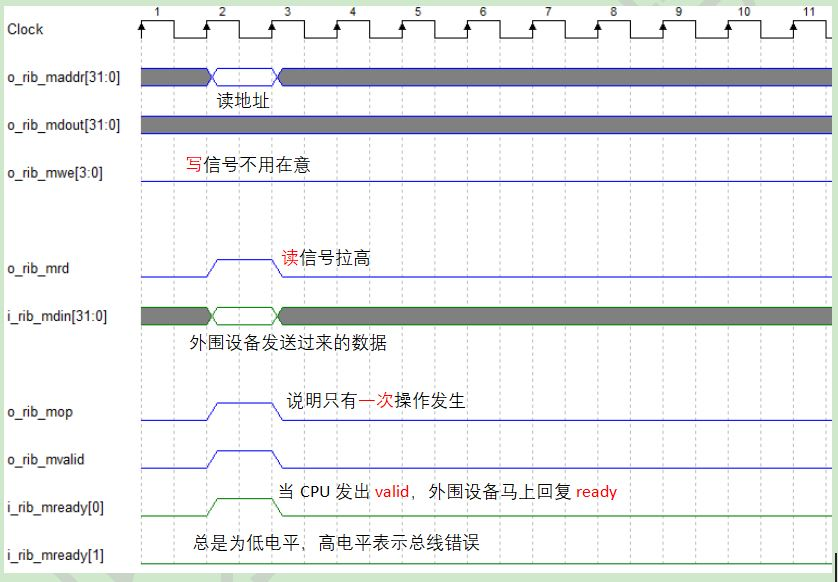

数值示例如下：对于地址32’h9000_00xx，读取数据（mdin）32’h1234_5678。

```verilog
mrd  = 1,        32'hxxxx_xx78，maddr = 32'h9000_0000，  lb(u)
mrd  = 1,        32'hxxxx_56xx，maddr = 32'h9000_0001，  lb(u)
mrd  = 1,        32'hxx34_xxxx，maddr = 32'h9000_0002，  lb(u)
mrd  = 1,        32'h12xx_xxxx，maddr = 32'h9000_0003，  lb(u)

mrd  = 1,        32'hxxxx_5678， maddr = 32'h9000_0000， lh(u)
mrd  = 1,        32'h1234_xxxx， maddr = 32'h9000_0002， lh(u)

mrd  = 1,        32'h1234_5678，maddr = 32'h9000_0000，  lw
```

单时钟周期总线写操作时序图如图2所示。注意，与单时钟周期总线读操作类似：

- mvalid，mready[0]同时产生
- 写信号，地址，写数据和mop操作信号均为单个时钟周期操作

单时钟周期写操作时序图

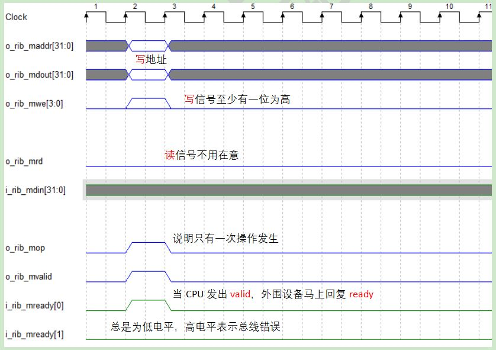

与读取数据示例类似，写入数据示例如下：对于地址32’h9000_00xx，写数据（mdout）32’h1234_5678。

```verilog
mwe = 4'b0001,        32'hxxxx_xx78，maddr= 32'h9000_0000， sb
mwe = 4'b0010,        32'hxxxx_56xx，maddr= 32'h9000_0001， sb
mwe = 4'b0100,        32'hxx34_xxxx，maddr= 32'h9000_0002， sb
mwe = 4'b1000,        32'h12xx_xxxx，maddr= 32'h9000_0003， sb

mwe = 4'b0011,        32'hxxxx_5678，maddr= 32'h9000_0000， sh
mwe = 4'b1100,        32'h1234_xxxx，maddr= 32'h9000_0002， sh

mwe = 4'b1111,        32'h1234_5678，maddr= 32'h9000_0000， sw
```

单时钟周期总线连续读操作，其时序图如图3所示。与单时钟周期读取操作相同：

- mvalid，mready[0]同时产生
- 读信号，地址，读数据，mop操作信号均为单时钟周期操作信号

单时钟周期连续读操作时序图:

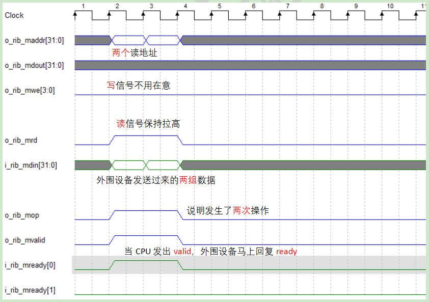

单时钟周期总线连续写操作，其时序图如图4所示：

- mvalid，mready[0]同时产生
- 写信号，地址，写数据，mop操作信号均为单时钟周期操作信号

单时钟周期连续写操作时序图:

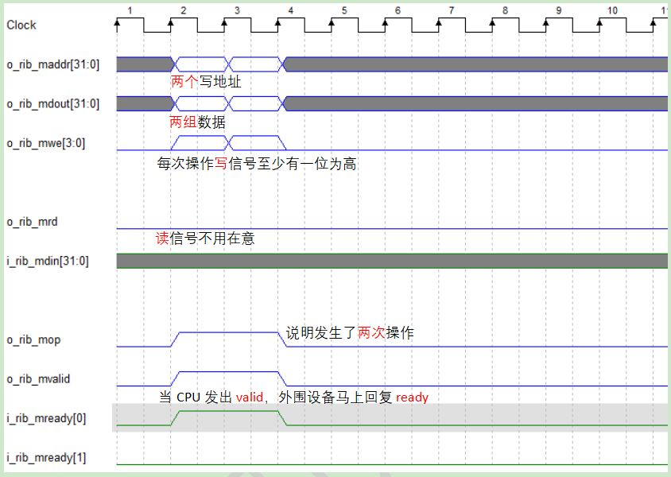

多个时钟周期总线读操作的时序图如图5所示。多个周期意味着***\*ready\****无法立即响应***\*valid\****，即外围设备的速度很慢。

- 如果mvaild为高，则仅在准备好读数据后，将mready [0]拉高
- 读信号，地址是多个时钟周期操作信号，读数据，mop操作信号均为单时钟周期操作信号

多个时钟周期读操作时序图:


多个时钟周期总线写操作的时序图如图6所示。

- 如果mvaild为高，则仅在准备好写数据后，将mready [0]拉高
- 写信号，地址和写数据是多个时钟周期操作信号，mop操作信号为单时钟周期

多个时钟周期写操作时序图

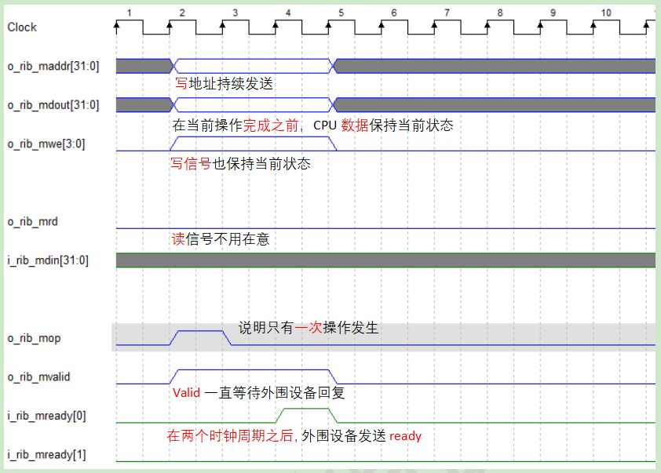

多个时钟周期总线连续读操作的时序图如图7所示。

- 如果mvaild为高，则仅在准备好读数据后，将mready [0]拉高
- 读信号，地址是多个时钟周期操作信号，读数据，mop操作信号均为单时钟周期操作信号

多个时钟周期连续读操作时序图

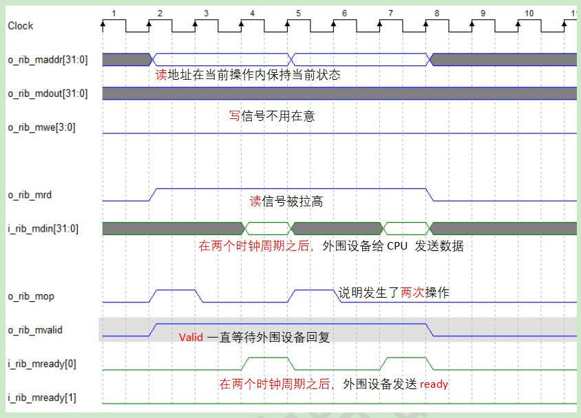

多个时钟周期总线连续写操作的时序图如图8所示。

- 如果mvaild为高，则仅在准备好写数据后，将mready [0]拉高
- 写信号，地址和写数据是多个时钟周期操作信号，mop操作信号为单时钟周期

多个时钟周期连续写操作时序图

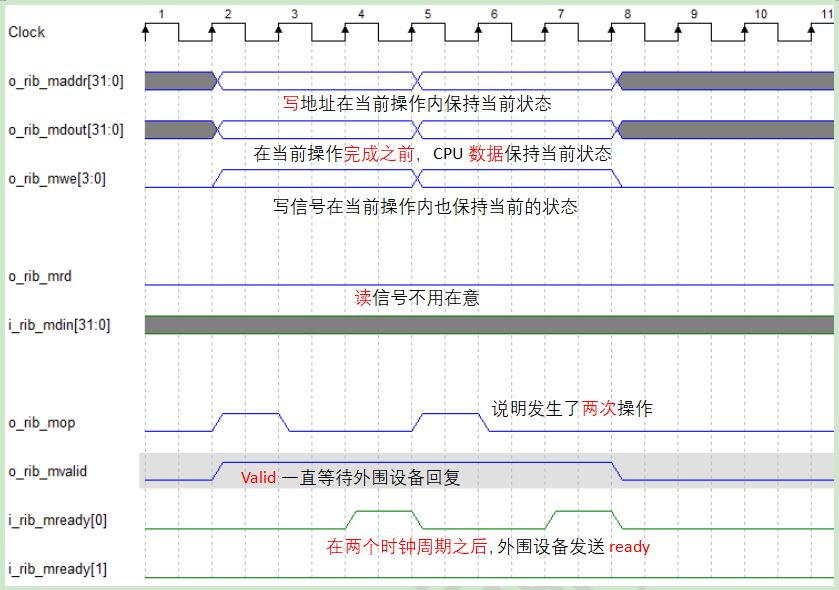

### 4、代码

相应的代码模块如下所示，具体细节在代码模块中详细注释说明。

```verilog
localparam DEV_NUM = 10;


wire [DEV_NUM - 1:0] s_cs;//外围设备片选 

assign s_cs[0] = ( i_rib_maddr[31:12] == DBG_BASEADDR[31:12] )  ? 1'b1 : 1'b0;//jtag调试
assign s_cs[1] = ( i_rib_maddr[31:16] == PLIC_BASEADDR[31:16] ) ? 1'b1 : 1'b0;//外部中断
assign s_cs[2] = ( i_rib_maddr[31:16] == CPU_BASEADDR[31:16] )  ? 1'b1 : 1'b0;//CPU
assign s_cs[3] = ( i_rib_maddr[31:16] == MEM_BASEADDR[31:16] )  ? 1'b1 : 1'b0;//内存
assign s_cs[4] = ( i_rib_maddr[31:16] == TMR_BASEADDR[31:16] )  ? 1'b1 : 1'b0;//计时器中断
assign s_cs[5] = ( i_rib_maddr[31:16] == GPIO_BASEADDR[31:16] ) ? 1'b1 : 1'b0;//GPIO
assign s_cs[6] = ( i_rib_maddr[31:16] == UART_BASEADDR[31:16] ) ? 1'b1 : 1'b0;//UART

//有一些未使用的选项，之后可以进行扩展

assign s_cs[7] = 1'b0;
assign s_cs[8] = 1'b0;
assign s_cs[9] = 1'b0;

//===============================================================================

always @ ( * )
if(!rst_n)
begin

    o_rib_saddr  = 0;
    o_rib_sdin   = 0;
    o_rib_svalid = 0;
    o_rib_swe    = 0;
    o_rib_srd    = 0;
    o_rib_sop    = 0;

end
else
begin

    //主机发送的信息，每个外围设备都可以接收（广播）
    o_rib_saddr  = i_rib_maddr;
    o_rib_sdin   = i_rib_mdout;
    o_rib_svalid = i_rib_mvalid;
    o_rib_swe    = i_rib_mwe;
    o_rib_srd    = i_rib_mrd;
    o_rib_sop    = i_rib_mop;

end

//===============================================================================

wire bus_err_ack = (i_rib_maddr == i_PC) ? 1'b1 : 1'b0;

always @ ( * )
begin

    //外围设备不能同时发送信息
    //如果当前片选被拉高，则相应的外设将返回数据和ready
    //与主机信息传输一起组成一个总线分配器/多路复用器

    case (s_cs)
    10'b00_0000_0001:   // DBG_BASEADDR
    begin

        o_rib_mdin      = i0_rib_sdout;
        o_rib_mready    = i0_rib_sready; 

    end

    10'b00_0000_0010:   // PLIC_BASEADDR
    begin

        o_rib_mdin      = i1_rib_sdout;
        o_rib_mready    = i1_rib_sready; 

    end

    10'b00_0000_0100:   // CPU_BASEADDR
    begin

        o_rib_mdin      = i2_rib_sdout;
        o_rib_mready    = i2_rib_sready; 

    end

    10'b00_0000_1000:   // MEM_BASEADDR
    begin

        o_rib_mdin      = i3_rib_sdout;
        o_rib_mready    = i3_rib_sready; 

    end

    10'b00_0001_0000:   // TMR_BASEADDR
    begin

        o_rib_mdin      = i4_rib_sdout;
        o_rib_mready    = i4_rib_sready; 

    end

    10'b00_0010_0000:   // GPIO_BASEADDR
    begin

        o_rib_mdin      = i5_rib_sdout;
        o_rib_mready    = i5_rib_sready; 

    end

    10'b00_0100_0000:   // UART_BASEADDR
    begin

        o_rib_mdin      = i6_rib_sdout;
        o_rib_mready    = i6_rib_sready; 

    end

    10'b00_1000_0000:
    begin

        o_rib_mdin      = i7_rib_sdout;
        o_rib_mready    = i7_rib_sready; 

    end

    10'b01_0000_0000:
    begin

        o_rib_mdin      = i8_rib_sdout;
        o_rib_mready    = i8_rib_sready; 

    end

    10'b10_0000_0000:
    begin

        o_rib_mdin      = i9_rib_sdout;
        o_rib_mready    = i9_rib_sready; 

    end

    default:
    begin

        o_rib_mdin      = 0;
        o_rib_mready    = {1'b1, bus_err_ack};

    end

    endcase

end
```

## 三、流水线介绍

### 1、状态机

在介绍流水线之前，先简介一下状态机(Finite-State Machine，FSM)。状态机CPU具有一组状态，以及一个将输入符号和当前状态映射到下一个状态的转换函数。 每次CPU仅执行一种状态，然后循环重复。

FII RISC-V有状态机版本(v2.01，v2.02)，相对于5级经典状态(取指，译码，执行，访存，回写)的CPU而言，FII CPU只有三级状态，将其中的四级状态两两合并，最后的三级状态分别是取指，译码和执行，访存和回写。状态相关代码模块如下所示(更多的细节可以点击[这里](https://www.icfedu.cn/archives/7923))。

```verilog
`DBG_INFO reg [ 2: 0 ] instr_st = 0;

reg [ 2: 0 ] instr_st_nxt = 0;


always@( posedge sys_clk )
if (( rst_n == 1'b0 ) | i_cpu_reset )     instr_st <= IDLE;
else    instr_st <= instr_st_nxt;

always @ ( * )
begin
    case ( instr_st )
    //IDLE是FPGA板处于上电复位时的状态
    //正常的执行状态是fetch，execution，和write back.
    //每个时钟周期仅执行一个状态，一个完整的循环至少需要3个时钟周期
    //如果有长周期指令，执行时间会更长
    IDLE:   // 0
    begin
    
        if(!i_cpu_reset)
            instr_st_nxt = I_FCH;
        else
            instr_st_nxt = IDLE;
            
    end
    I_FCH:   // 1，取指
    begin
    
        if(i_cpu_reset) instr_st_nxt = IDLE;
        else instr_st_nxt = I_EXE;
        
    end
    I_EXE:   // 2 译码和执行
    begin
    
        if ( i_ls_need )
        begin
        
            if ( ls_rib_ok )
                instr_st_nxt = I_WB;
            else
                instr_st_nxt = I_EXE;
                
        end
        else 
            instr_st_nxt = I_WB;
            
    end
    I_WB:   // 3 访存和回写
    begin
    
        instr_st_nxt = I_FCH;
        
    end
    default : instr_st_nxt = IDLE;
    endcase
end
```

### 2、流水线指令执行示例

这里有一个汇编示例文件，如图1所示。

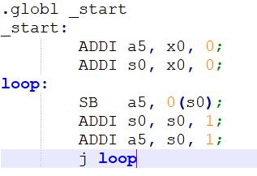

图2 状态机在时钟周期下的相应状态

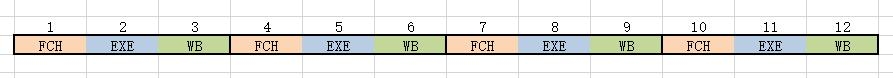

图2中的数字表示时钟周期，不同的指令状态用不同的颜色绘制。 它显示了对于状态机CPU：

- 时钟周期1：FCH，取指令，***\*ADDI\****
- 时钟周期2：EXE，执行***\*ADDI\****
- 时钟周期3：WB，将X0 + 0的结果写入a5
- 时钟周期4：FCH，取指令，***\*ADDI\****
- 时钟周期5：EXE，执行***\*ADDI\****
- 时钟周期6：WB，将X0 + 0的结果写入s0
- …

对于相同的汇编示例代码，流水线执行的方式有所不同，3级流水线的示例参见图3。

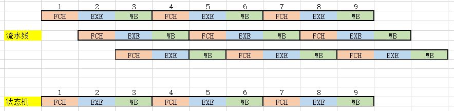

对于流水线：

- 时钟周期1：FCH，取指令，***\*ADDI\****
- 时钟周期2：EXE ＆ FCH，执行***\*ADDI\****& 获取指令***\*ADDI\****
- 时钟周期3： WB ＆ EXE ＆ FCH，将X0 + 0的结果写入a5 & 执行***\*ADDI\**** &获取指令***\*SB\****
- 时钟周期4：FCH ＆ WB ＆ EXE，获取指令***\*ADDI\****& 将X0 +0的结果写入s0 & 执行***\*SB\****
- …

 

尽管对于每条指令(如2个ADDI和SB)，它们仍需要3个时钟周期才能完成，但是在同一时钟周期下，3条指令将被同时执行。除了时钟周期1和2，流水线没有被完全填充，因此执行效率不高，其他时钟周期都同时执行3个指令。对于从时钟周期1到时钟周期12的相同时间段，状态机执行4条指令，而流水线至少执行10条指令。当时钟速度相同时，流水线CPU的效率绝对高于状态机CPU。

计算机体系结构中的流水线也被称为**数据流水线**。它将一个重复的流程分解为几个子流程，每个子流程与其他子流程并行运行。由于此工作方法与工厂中的生产流水线非常相似，因此称为流水线技术，即同时执行多个子流程。

经典的5级流水线包括:

- 取指令(fetch instruction)
- 指令解码器(instruction decoder）
- 执行(execution）
- 存储器访问(memory access)
- 回写(writeback)。

FII RISC-V将指令解码和执行，存储器访问和回写结合在一起，形成3级流水线：

- 取指令(FCH)
- 执行(EXE)
- 回写(WB)。

### 3、流水线分类

图4显示了3级流水线。根据执行顺序，可以将流水线分为**顺序流水线**和**乱序流水线**。如果流水线具有反馈，则将其定义为**非线性流水线**。与之相反，如果流水线中的数据从第一级流到最后一级，则它是**线性流水线**。流水线有不同的阶段，多至31个阶段(hyper pipelined technology，超级流水线技术)。开发和使用不同的流水线CPU是因为在相同的生产过程和相同的时钟下，流水线CPU指令执行的效率和主频得到了极大的提高。


### 4、流水线冲突

流水线CPU也为高性能付出了代价，例如，它的逻辑一般比状态机逻辑更复杂。 此外，流水线CPU主要会产生三种冲突：**数据冲突**，**结构冲突**和**控制冲突**。

- **数据冲突**

当流水线不同阶段的指令表现出数据依赖性时，就会发生数据危险。 例如，在图5中，指令2依赖于于指令1，s0既是指令1的结果，也是指令2中的加数。当指令1将结果回写到寄存器时，指令2使用了未更新的错误s0值执行。解决方案是bypass该值，这意味着直接在回写之前，将指令1结果中的s0值传递给指令2。

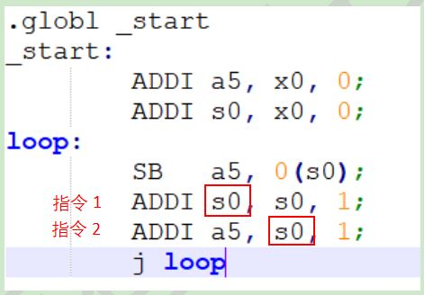

- **结构冲突**

当流水线中的两个或更多指令需要相同资源时，就会发生结构冲突。 例如，当从存储块中提取指令时，与此同时，另一条指令正在写回到存储块中。 解决方案是在后面的指令前添加流水线气泡（nop，无操作），或增加可用硬件资源。


- **控制冲突**

当流水线对分支预测做出错误决定时会发生控制冲突，因此必须丢弃已引入流水线的指令。 例如，在图7中，当执行j loop时，紧随其后的指令已被取出。 但是，PC(Program Counter，程序计数器)将跳至loop标签处，而不是指向已获取的指令。 在这种情况下，流水线将以nop(无操作)的形式执行已经获取的指令。

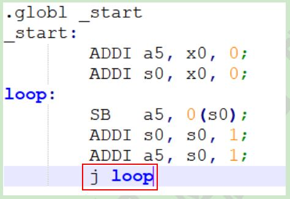

## 四、流水线CPU设计

本文在之前介绍流水线(详细的流水线CPU设计点击[这里](https://www.icfedu.cn/archives/9211))的基础上，讨论如何解决流水线产生的冲突，以及结合具体实例说明CPU的流水线设计。FII RISC-V是3级流水线CPU。 这三个阶段为：

- FCH

取指， 从ITCM中拿到和当前PC匹配的指令

- EXE

执行，执行当前的指令（包括指令译码，指令执行）

- WB

仅当需要修改31个register（硬连接为0的寄存器x0不计算在内）或者读写外围设备的时候，需要执行这个操作。如果不需要，可以跳过，这样就节省一个时钟周期。如果外围设备需要很长时间才能得到数据，需要将流水线暂停（地址不变，发送`INST_NOP指令）

根据回写阶段的反馈，可以看出它是非线性流水线。

### 1、解决流水线数据冲突

如上所述，处理流水线数据冲突，特别是在“写之后读”的情况下。 如图1所示，当前一个回写寄存器（Rd）与下一个指令提取的寄存器（R1, R2)相同时，该值将被直接bypass。

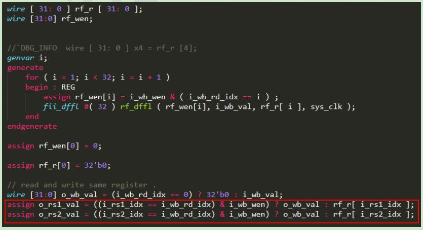

### 2、PC跳转

在stage 1中，根据具体条件判断将下一条指令地址分配给***\*instr_fch_pc\****。 通常，PC + 4是下一条指令地址。 当存在与跳转相关的指令或长周期加载和存储时，将为PC分配一个不同的值以获取正确的下一条指令地址，如图2所示。在stage 2中，将***\*instr_fch_pc\****赋值到***\*i_PC\****。

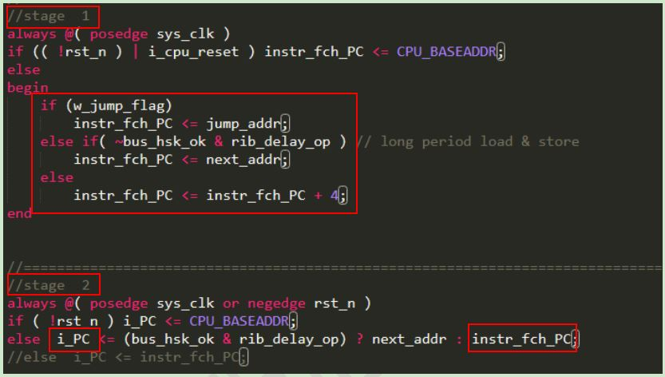

图3列出了跳转情况的代码，并根据跳转类型为***\*jump_addr\****分配不同的地址。 表1列出了相关跳转的标志及解释。

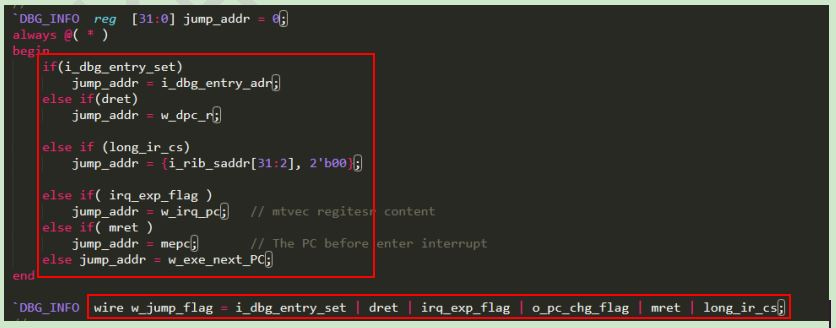

| 标志                      | 描述         | 标志                   | 描述         |
| ------------------------- | ------------ | ---------------------- | ------------ |
| ***\*I_dbg_entry_set\**** | Jtag调试模式 | ***\*dret\****         | 退出调试模式 |
| ***\*Long_ir_cs\****      | 长周期指令   | ***\*Irq_exp_flag\**** | 进入中断     |
| ***\*mret\****            | 退出中断     | ***\*default\****      | 跳转指令     |

图4显示了将跳转标志赋值给***\*waiting_r\****。 只要有任何跳转发生，***\*waiting_r\****就会拉高。 在图5中，如果***\*waiting_r\****为高，则将`INST_NOP（no operation，无操作）赋值给***\*curr_instr\****。 当发生跳转指令时，已经进入流水线之后的指令将被替换为nop。 INST_NOP（0x0000_0001）被解码为nop，它不会对内存或地址上产生任何操作。

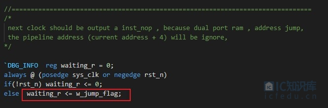

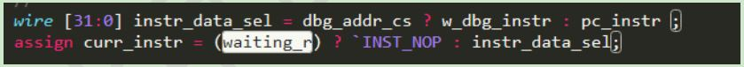

### 3、数码管显示实例及仿真

图6显示了一个反汇编示例，该示例在数码管中显示字符“ F”。 显然，在标签<START>之前，流水线按顺序提取，执行和回写每条指令。 但是，在8000_003c地址中存在分支条件指令。 如果条件被满足，PC将跳至8000_0038，而不是8000_0040。 当流水线已经提取了8000_0040地址的指令时，应特别注意其执行结果。

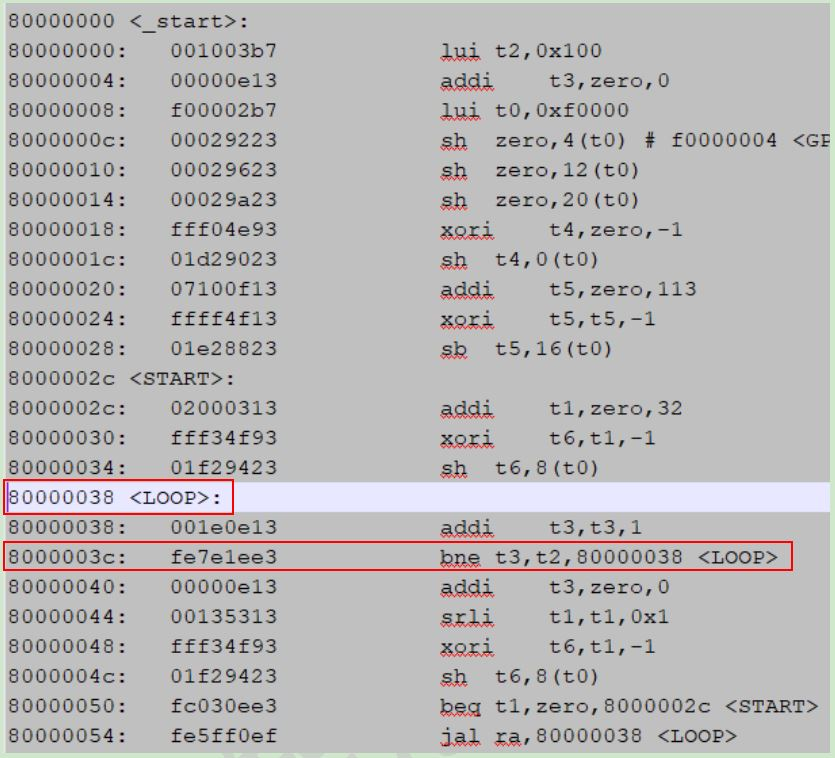

仿真结果如图7所示。可以看出，当***\*curr_instr\****为0x0000_0001时，即为***\*curr_instr\****被赋值为了nop时，***\*i_PC\****会从0x8000_0040变为0x8000_0038，并且会带有延迟。 如前所述，跳转标志将使***\*curr_instr\****从任何指令更改为ʻINST_NOP（0x0000_0001）。

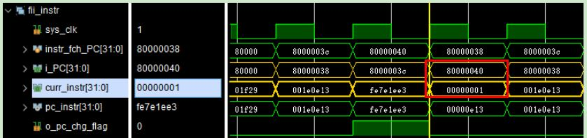

### 4、UART串口输出实例及仿真

图8显示了另一个UART示例。 它从UART输出“This is a call function program（这是一个调用函数程序）”。图9显示了存储在rodata段中的打印输出信息。当流水线执行0x8000_0044指令时，0x8000_0048地址中的指令已经被提取了。但是，根据0x8000_0044指令，PC应指向0x8000_0078以加载打印数据。这时，PC将放弃0x8000_0048地址的指令，并保留地址直到加载0x8000_0078 rodata，PC才会返回指向0x8000_0048的地址。图10显示了UART示例的仿真结果。可以看出，在放弃0x8000_0048地址的指令后，已将***\*curr_instr\****赋值为INST_NOP（0x0000_0001）。

UART示例

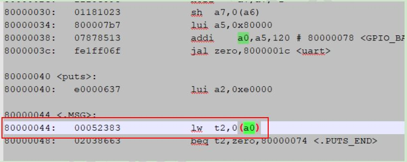

输出打印信息

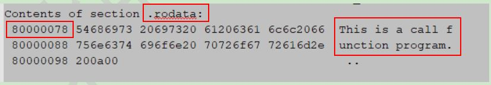

仿真结果


### 5、长周期访存指令处理

在将实际地址分配给PC之前，将***\*instr_fch_PC\****（PC + 4）赋值给***\*next_addr\****，因为在执行加载/存储之后，正常的PC + 4地址将是下一个执行的PC，如图11所示。 图12与图2相同，但此处高亮显示了***\*rib_delay_op\****。 这是一个决策判断，如果当前指令是长周期加载和存储，则将***\*next_addr\****赋值给***\*instr_fch_PC\****，在执行长周期加载和存储的时候，将***\*next_addr\****分配给***\*i_PC\****。

将instr_fch_PC赋值给next_addr

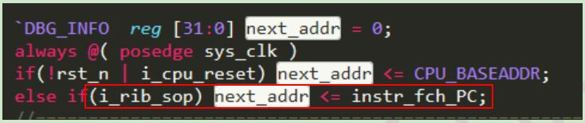

长周期加载&存储

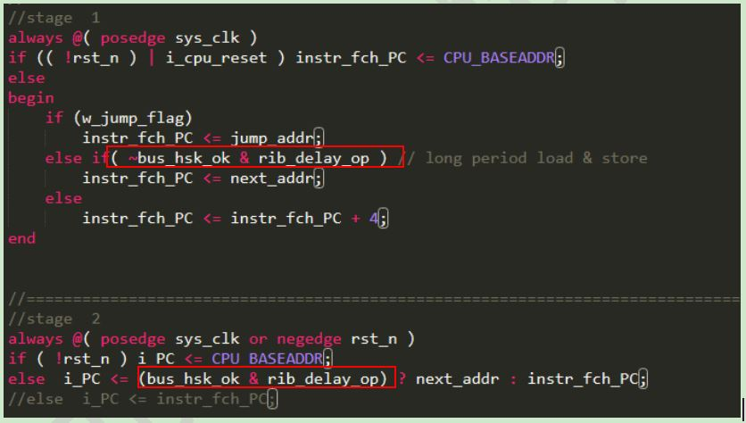