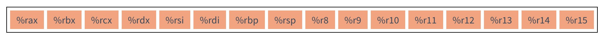
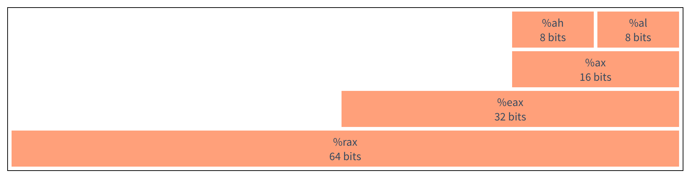
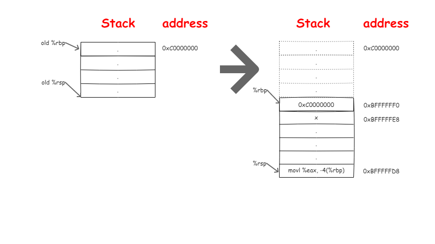
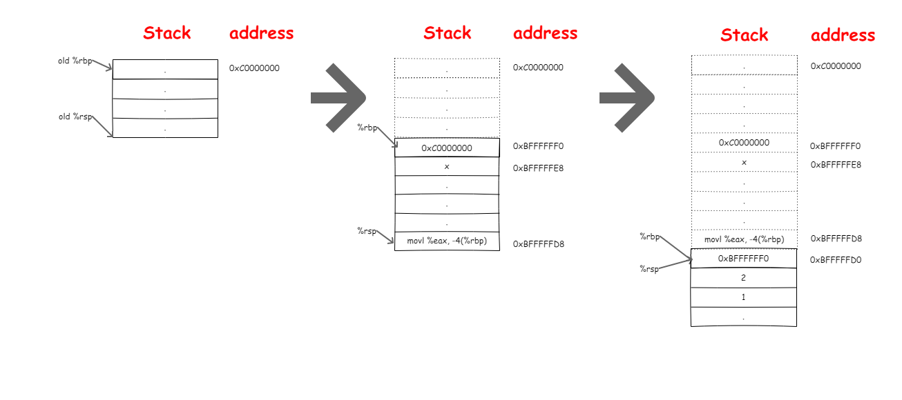

# X86-64 汇编

[x86-64汇编入门](https://nifengz.com/introduction_x64_assembly/)

[深入浅出GNU X86-64 汇编](https://www.cnblogs.com/lsgxeva/p/11176000.html)

## 前言

去年在看协程相关内容的时候，通读了腾讯的[libco](https://github.com/Tencent/libco)。其中切换协程的一小段代码是用汇编实现的，当时没有去搞明白这一块。最近趁着项目空闲查阅了x64汇编的相关资料，这篇博客打算总结一下，方便以后查阅。

本篇主要翻译自 [Introduction to X86-64 Assembly for Compiler Writers ](https://www3.nd.edu/~dthain/courses/cse40243/fall2015/intel-intro.html)由于是入门教程，原文中函数调用部分的描述和实际所出入, 我补上了相关的内容。废话不多说，下面走你～～

## 概要

这是一篇简明的X86-64汇编语言介绍，虽然不是完整详尽的描述，但足够帮助你读懂官方文档。

X86-64指令集的详细文档[Intel-64 and IA-32 Architectures Software Developer Manuals ](https://software.intel.com/en-us/articles/intel-sdm)。读完这篇如果你还需要继续深入的话，可以阅读手册的以下部分：

- Volume 1: Sections 2.1, 3.4, and 3.7
- Volume 2: Read instructions as needed.

## 开源汇编工具

以下例子。我们将会使用GNU GCC的编译器和汇编器，了解汇编语言最快的方式就是查看编译器输出的汇编代码。为了产生汇编代码，使用gcc 的-S 参数,这样编译器会产生汇编代码。在Unix-like系统中，汇编代码的文件后缀名是.s，下面我们从hello world程序开始，有一个test.c 如下：

```c
#include <stdio.h>

int main( int argc, char *argv[] )
{
    printf("hello %s\n","world");
    return 0;
}
```

使用 gcc -S hello.c 会产生汇编文件hello.s,他长这样：

```assembly
    .file   "test.c"
    .section    .rodata
.LC0:
    .string "world"
.LC1:
    .string "hello %s\n"
    .text
    .globl  main
    .type   main, @function
main:
.LFB0:
    .cfi_startproc
    pushq   %rbp
    .cfi_def_cfa_offset 16
    .cfi_offset 6, -16
    movq    %rsp, %rbp
    .cfi_def_cfa_register 6
    subq    $16, %rsp
    movl    %edi, -4(%rbp)
    movq    %rsi, -16(%rbp)
    movl    $.LC0, %esi
    movl    $.LC1, %edi
    movl    $0, %eax
    call    printf
    movl    $0, %eax
    leave
    .cfi_def_cfa 7, 8
    ret
    .cfi_endproc
.LFE0:
    .size   main, .-main
    .ident  "GCC: (Ubuntu 5.4.0-6ubuntu1~16.04.9) 5.4.0 20160609"
    .section    .note.GNU-stack,"",@progbits
```

汇编代码分为三种元素：

- **指示**  以"."开头，指示对汇编器，链接器或调试器有用的结构信息，但是它们本身并不是汇编指令。例如，.file记录了源文件的名称，.data表示程序的数据部分的开始，.text表示实际程序代码的开始，.string表示数据部分内的字符串常量，.globl main表示标签main是一个可以被其他代码模块访问的全局符号。.cfi开头的一系列指示全称是Call Frame Infromation，就是他的名字那样，记录一些程序调用堆栈的信息，用于程序调试打印堆栈信息。详细说明见 [CFI-directives](https://sourceware.org/binutils/docs-2.24/as/CFI-directives.html)
- **标签**  以":"结尾用来标记它后面的一段内容（就像变量名一样）。例如，.LC0表示紧接着的字符串被调用时应该使用LC0作为它名字。main：表示指令pushq％rbp是主函数的第一条指令。按照惯例，以''.''开头的标签是编译器生成的临时局部标签，而其他标签是用户可见函数和全局变量。
- **指令**  就是实际的汇编代码啦。我们直接可以根据代码的缩进，从格式上将指令和标签区分开来。

上面我们使用gcc -S 产生汇编代码的过程其实已经完成了预处理和编译的过程，下面我们使用 gcc -o完成汇编和链接的过程产生可执行程序：

```bash
$ gcc test.s -o hello
$ ./hello
hello world
```

将汇编代码汇编成目标代码(Assembling)也很有趣，然后可以使用nm来显示代码中的符号：

```bash
$ gcc test.s -c -o hello.o
$ nm hello.o
0000000000000000 T main
                 U printf
```

这里显示链接器可用的信息，main位于.text(T)的位置0处。并且printf未定义(U)：在产生的hello.o 对象中并没有定义printf这个函数。链接的时候，连接器会帮我们找标准库中的printf。你可能也看到了，没有出现像LC0，LFB0等这类的标签，正如我前面说的那样：因为它们是编译器生成的局部标签，没有被声明为.globl。

现在你已经知道使用什么工具了，让我们开始详细了解汇编指令，GO。

## 补充知识：AT&T语法和Intel语法

GUN GCC使用传统的AT＆T语法，它在Unix-like操作系统上使用，而不是dos和windows系统上通常使用的Intel语法。下面我们看一个最常见的AT＆T语法的指令：

```assembly
movl %esp, %ebp
```

movl是一个最常见的汇编指令的名称，百分号表示esp和ebp是寄存器，在AT＆T语法中，有两个参数的时候，始终先给出源(source)，然后再给出目标(destination)。 在其他地方（例如英特尔手册），您将看到英特尔语法，区别之处是Intel语法省去了百分号并颠倒了参数的顺序。例如，这是intel语法中的相同指令：

```assembly
MOVQ EBP, ESP
```

在阅读手册和网页时，通过看有没有"%"就知道是用的哪种汇编格式了。

## 寄存器和数据类型

X86-64有16个通用(几乎都是通用的)64位整数寄存器：



为什么说几乎都是通用寄存器？因为早期处理器的不同寄存器的用途不同，并不是所有的指令都可以应用于每个寄存器。（现在基本上都是通用寄存器了）随着设计的发展，增加了新的指令和寻址模式，使各种寄存器几乎相等。除了几条特殊的指令，比如与字符串处理有关的指令，需要使用％rsi和％rdi，另外，还有两个寄存器保留用作堆栈指针（％rsp）和基址指针（％rbp）。最后的八个被编号的寄存器没有特别的限制。除此之外还有一个特殊的寄存器%rip(instruction pointer)，一般情况下你不需要关注这个寄存器,但是这个寄存器很重要，你需要知道他的功能，后面在说函数调用时会提及。

多年来X86架构已经从8位扩展到了32位，因此每个寄存器都有一些内部结构如下图：



为了简单起见，下面的讲述会把注意力集中在64位寄存器上。不过你要知道，大多数生产编译器使用混合模式：32位寄存器通常用于整数算术，因为大多数程序不需要整数值超过2 ^ 32（例如在我的ubuntu 64bit使用gcc 64位的编译器， sizeof(int)的值为4）。64位寄存器通常用于保存存储器地址（指针），从而可以寻址最多16EB（exa-bytes）的虚拟内存。

## 寻址模式

什么是寻址模式？就是数据在内存寄和寄存器之间进行移动时，取得数据地址的不同表达方式。最常用的寻址的汇编指令是mov。x86-64使用的是复杂指令集(cisc)，因此mov有许多不同的变体，可以在不同单元之间移动不同类型的据。mov与大多数指令一样，具有单字母后缀，用于确定要移动的数据量。下表用于描述各种大小的数据值：

| 前缀 | 全称     | Size              |
| ---- | -------- | ----------------- |
| B    | BYTE     | 1 byte (8 bits)   |
| W    | WORD     | 2 bytes (16 bits) |
| L    | LONG     | 4 bytes (32 bits) |
| Q    | QUADWORD | 8 bytes (64 bits) |

So，MOVB移动一个字节，MOVW移动一个字，MOVL移动一个长整形，MOVQ移动8字节。一般来说，MOV指令移动数据的大小必须与后缀匹配。虽然可以忽略后缀，汇编器将尝试根据参数选择合适的MOV指令。但是，不推荐这样做，因为它可能会造成预料之外的结果。

对于AT&T语法使用MOV寻址时需要两个参数，第一个参数是源地址，第二个参数是目标地址。原地址的表达方式不一样那么寻址的方式也就不一样。比如，

- 访问全局变量使用一个简单变量的名称比如x，我们称之为**全局符号寻址**。
- printf一个整数常量，由美元符号+数值表示(例如$ 56)，我们称之为**直接寻址**。
- 访问寄存器的值直接使用寄存器的名字如%rbx，我们称之为**寄存器寻址**。
- 如果寄存器中存放的是一个地址，访问这个地址中的数据时需要在寄存器外面加上括号如(%rbx)，我们称之为**间接寻址**。
- 如果寄存器中存放的是一个数组的地址，我们需要访问数组中的元素时可能需要操作这个地址进行偏移，如8(％rcx）是指％rcx中存放的的地址加8字节存储单元的值，我们称之为**相对基址寻址**（此模式对于操作堆栈，局部变量和函数参数非常重要）。

在相对基址寻址上有各种复杂的变化，例如-16（％rbx，％rcx，8）是指地址-16 +％rbx +％rcx * 8处的值。此模式对于访问排列在数组中的特殊大小的元素非常有用。

以下是使用各种寻址模式将64位值加载到％rax的示例：

| 寻址模式                                          | 示例                        |
| ------------------------------------------------- | --------------------------- |
| 全局符号寻址(Global Symbol)                       | MOVQ x, %rax                |
| 直接寻址(Immediate)                               | MOVQ $56, %rax              |
| 寄存器寻址(Register)                              | MOVQ %rbx, %rax             |
| 间接寻址(Indirect)                                | MOVQ (%rsp), %rax           |
| 相对基址寻址(Base-Relative)                       | MOVQ -8(%rbp), %rax         |
| 相对基址偏移缩放寻址(Offset-Scaled-Base-Relative) | MOVQ -16(%rbx,%rcx,8), %rax |

通常，可以使用相同的寻址模式将数据存储到寄存器和内存。但是，并不是所有模式都支持。比如不能对MOV的两个参数都使用base-relative mode。像MOVQ -8（％rbx），-8（％rbx）这样是不行的。要准确查看支持哪些寻址模式组合，您必须阅读相关指令的手册。

## 基础运算指令

编译器需要四个基本的算术指令： ADD, SUB, IMUL, 和IDIV(加减乘除)。add和sub有两个操作数：一个来源值和一个被操作数。例如，这条指令：

```assembly
ADDQ %rbx, %rax
```

将％rbx添加到％rax，并将结果放在％rax中，覆盖之前可能存在的内容。这就要求你在使用寄存器时要小心。 例如，假设你想计算 c = b *（b + a），其中a和b是全局整数。要做到这一点，你必须小心，在执行加法时不要覆盖b的值。这里有一个实现：

```assembly
MOVQ  a, %rax
MOVQ  b, %rbx
ADDQ  %rbx, %rax
IMULQ %rbx
MOVQ  %rax, c
```

IMUL指令有点不太一样：它将其参数乘以％rax的内容，然后将结果的低64位放入％rax，将高64位放入％rdx。（将两个64位数字相乘会产生一个128位数字。）

IDIV指令和乘法指令差不多：它以一个128位整数值开始，其低64位位于％rax，高位64位位于％rdx中，并将其除以参数。（CDQO指令用于将％rax符号扩展为％rdx，以便正确处理负值。）商被放在％rax中，余数放在％rdx中。例如，除以5：

```assembly
MOVQ a,  %rax    # set the low 64 bits of the dividend
CDQO             # sign-extend %rax into %rdx
IDIVQ $5         # divide %rdx:%rax by 5, leaving result in %eax
```

（大多数语言中的求模指令只是利用％rdx中剩余的余数。）

指令INC和DEC分别递增和递减寄存器。例如，语句a = ++ b可以翻译为：

```assembly
MOVQ b, %rax
INCQ %rax
MOVQ %rax, a
```

布尔操作的工作方式非常类似：AND，OR，和XOR指令需要两个参数，而NOT指令只需要一个参数。

像MOV指令一样，各种算术指令可以在各种寻址模式下工作。但是，您可能会发现使用MOV将值载入和载出寄存器是最方便的，然后仅使用寄存器来执行算术运算。

## 补充知识：浮点数

虽然我们不会详细介绍浮点操作，但您至少应该知道它们是由一组不同的指令和一组不同的寄存器处理完成的。 在较老的机器中，浮点指令由一个称为8087 fpu的可选（外部）芯片处理，因此这些功能经常被描述为x87操作，尽管现在这些功能已经集成到了cpu中。

x87 fpu包含八个80位寄存器（r0-r7）排列在一个堆栈中。要执行浮点运算，代码必须将数据推送到fpu堆栈，发出隐式操作堆栈顶部的指令，然后将这些值写回到内存中。在内存中，双精度数字存储占用64位。

这种架构的一个奇怪之处在于内部表示（80位）比内存中的表示（64位）具有更高的精度。因此，浮点计算值可能会发生变化，具体取决于值在寄存器和内存之间移动的精确顺序！

浮点数相关内容的推荐读物：

- Chapter 8-1 of the Intel manual.
- David Goldberg, [What Every Computer Scientist Should Know About Floating Point Arithmetic](https://dl.acm.org/citation.cfm?id=103163), ACM Computing Surveys, volume 23, issue 1, March 1991.
- A more informal guide: [What Every Programmer Should Know about Floating Point](http://floating-point-gui.de/)

## 比较和跳转指令

使用JMP指令，我们可以创建一个简单的无限循环，使用％eax寄存器从零开始计数：

```assembly
    MOVQ $0, %rax
loop:
    INCQ %rax
    JMP loop
```

为了定义更有用的程序结构，如终止循环和if-then等语句，我们必须有一个可以改变程序流程的机制。在大多数汇编语言中，这些处理由两种不同的指令处理：比较和跳转。

所有的比较都是通过CMP指令完成的。CMP比较两个不同的寄存器，然后在内部EFLAGS寄存器中设置几个位，记录这些值是相同，更大还是更小。你不需要直接看EFLAGS寄存器的值。而是根据结果的不同来做适当的跳转：

| 指令 | 意义               |
| ---- | ------------------ |
| JE   | 如果大于则跳转     |
| JNE  | 如果不等于则跳转   |
| JL   | 如果小于则跳转     |
| JLE  | 如果小于等于则跳转 |
| JG   | 如果大于则跳转     |
| JGE  | 如果大于等于则跳转 |

举个例子，这里是一个循环来使％rax从0到5：

```assembly
        MOVQ $0, %rax
loop:
        INCQ %rax
        CMPQ $5, %rax
        JLE  loop
```

再举个例子，一个条件赋值：如果全局变量x>=0，那么全局变量y=10，否则 y=20：

```assembly
        MOVQ x, %rax
        CMPQ $0, %rax
        JLE  twenty
ten:
        MOVQ $10, %rbx
        JMP  done
twenty:
        MOVQ $20, %rbx
        JMP  done
done:
        MOVQ %ebx, y
```

跳转的参数是目标标签。这些标签在一个汇编文件中必须是唯一且私密的，除了包含在.globl内的标签 ，其他标签不能在文件外部看到，也就是不能在文件外调用。用c语言来说，一个普通的汇编标签是static的，而.globl标签是extern。

## 栈

栈是一种辅助数据结构，主要用于记录程序的函数调用历史记录以及不适合寄存器的局部变量。

栈从高地址向低地址增长。`％rsp` 寄存器被称为“栈指针”并跟踪堆栈中最底层(也就是最新的)的数据。因此，要将 `％rax` 压入堆栈，我们必须从 `％rsp` 中减去8（ `％rax` 的大小，以字节为单位），然后写入 `％rsp` 指向的位置：

- 减8，是因为栈从高地址向低地址增长，栈指针先向下移动8个字节，空出8个字节空间
- `％rax` 中的数据再从栈指针 `％rsp` 的最新位置从下往上填入8个字节的数据

```assembly
SUBQ $8, %rsp
MOVQ %rax, (%rsp)
```

从栈中弹出一个值与上面的操作相反：

```assembly
MOVQ (%rsp), %rax
ADDQ $8, %rsp
```

从栈中丢弃最新的值，只需移动堆栈指针即可：

```assembly
ADDQ $8, %rsp
```

当然，压栈(入栈)或出栈是经常使用到的操作，所以都有简化的单条指令，其行为与上面的完全一样：

```assembly
PUSHQ %rax
POPQ  %rax
```

## 函数调用

所有c标准库中可用的函数也可以在汇编语言程序中使用。以一种称为“调用约定”的标准方式调用，以便用多种语言编写的代码都可以链接在一起。

在x86 32位机器中。调用约定只是将每个参数入栈，然后调用该函数。被调用函数在栈中查找参数，完成它的工作之后，将结果存储到单个寄存器中。然后调用者弹出栈中的参数。

Linux上x86-64使用的调用约定有所不同，称之为[System V ABI](https://software.intel.com/sites/default/files/article/402129/mpx-linux64-abi.pdf)。完整的约定相当复杂，但以下是对我们来说足够简单的解释：

- 整数参数（包括指针）按顺序放在寄存器％rdi，％rsi，％rdx，％rcx，％r8和％r9中。
- 浮点参数按顺序放置在寄存器％xmm0-％xmm7中。
- 超过可用寄存器的参数被压入栈。
- 如果函数使用可变数量的参数（如printf），那么必须将％eax寄存器设置为浮点参数的数量。
- 被调用的函数可以使用任何寄存器，但如果它们发生了变化，则必须恢复寄存器％rbx，％rbp，％rsp和％r12-％r15的值。
- 函数的返回值存储在％eax中。

下面的表格总结了你需要了解的内容：

| 寄存器 | 用途         | 是否需要保存 |
| ------ | ------------ | ------------ |
| %rax   | 保存返回结果 | 无需保存     |
| %rbx   | -            | 被调用者保存 |
| %rcx   | 参数4        | 无需保存     |
| %rdx   | 参数3        | 无需保存     |
| %rsi   | 参数2        | 无需保存     |
| %rdi   | 参数1        | 无需保存     |
| %rbp   | 栈基址指针   | 被调用者保存 |
| %rsp   | 栈指针       | 被调用者保存 |
| %r8    | 参数5        | 无需保存     |
| %r9    | 参数6        | 无需保存     |
| %r10   | -            | 调用者保存   |
| %r11   | -            | 调用者保存   |
| %r12   | -            | 被调用者保存 |
| %r13   | -            | 被调用者保存 |
| %r14   | -            | 被调用者保存 |
| %r15   | -            | 被调用者保存 |

每个函数都需要使用一系列寄存器来执行计算。然而，当一个函数被另一个函数调用时会发生什么？我们不希望调用者当前使用的任何寄存器被调用的函数破坏。

为了防止这种情况发生，**每个函数必须保存并恢复它使用的所有寄存器，方法是先将它们入栈，然后在返回之前将它们从堆栈弹出**。

在函数调用的过程中:

- 栈基址指针 `%rbp` 始终指向当前函数调用开始时栈的位置（栈顶）
- 栈指针 `%rsp` 始终指向栈中最新的元素对应的位置（栈底）
- `%rbp` 和 `%rsp` 之间的元素被我们成为"栈帧"，也叫"活动记录"。

**函数的调用过程其实就是栈帧被创建，扩张然后被销毁的过程**。

在说明函数调用流程前，我们不得不提到 `%rip(instruction pointer)` 指令指针寄存器。

- `%rip` 中存放的是CPU需要执行的下一条指令的地址。

每当执行完一条指令之后，这个寄存器会自动增加(可以这样理解)以便指向新的指令的地址。有了这些基础，接下来我们以一段完整的程序代码来解释函数的调用流程，有下面一段c代码：

```c
#include <stdio.h>

int sum(int a, int b) {
    return (a+b);
}

int main() {
    int x = sum(1, 2);
    printf("result is:%d\n", x);
    return 0;
}
```

编译为汇编代码之后，为了方便读代码，我们去除一些不需要的指示段之后得到如下代码：

```assembly
    .file   "main.c"
    .text
    .globl  sum
    .type   sum, @function
sum:
.LFB0:
    pushq   %rbp
    movq    %rsp, %rbp
    movl    %edi, -4(%rbp)
    movl    %esi, -8(%rbp)
    movl    -4(%rbp), %edx
    movl    -8(%rbp), %eax
    addl    %edx, %eax
    popq    %rbp
    ret
.LFE0:
    .size   sum, .-sum
    .section    .rodata
.LC0:
    .string "result is:%d\n"
    .text
    .globl  main
    .type   main, @function
main:
.LFB1:
    pushq   %rbp
    movq    %rsp, %rbp
    subq    $16, %rsp
    movl    $2, %esi
    movl    $1, %edi
    call    sum
    movl    %eax, -4(%rbp)
    movl    -4(%rbp), %eax
    movl    %eax, %esi
    movl    $.LC0, %edi
    movl    $0, %eax
    call    printf
    movl    $0, %eax
    leave
    ret
.LFE1:
    .size   main, .-main
    .ident  "GCC: (Ubuntu 5.4.0-6ubuntu1~16.04.9) 5.4.0 20160609"
    .section    .note.GNU-stack,"",@progbits
```

我们知道linux系统中main函数是由glibc中的 [exec()簇](http://man7.org/linux/man-pages/man3/exec.3.html) 函数调用的，比如我们从shell环境中启动程序最终就是由 execvp()调用而来。我们这里不展开说明，你只需要知道main函数其实也是被调用的函数。我们从main函数的第一条指令开始：

```assembly
main:
.LFB1:
    pushq   %rbp       # 保存旧的栈基址指针
    movq    %rsp, %rbp # 让 %rbp 指向新栈帧的起始位置,%rsp 的值付给 %rbp
```

0. 初始时候，`%rbp` 保存了上一个父栈的栈基址指针，`%rsp` 保存了当前栈的起始地址（也相当于上个栈的栈底）

1. 首先，将当前的栈基址指针 `%rbp` 入栈，函数调用结束后我们就可以从栈中取得函数调用前 `%rbp` 指向的位置，进而恢复栈到之前的样子。然后当前栈的栈基指针 `%rbp` 指向新栈帧的起始位置

2. 然后使当前栈指针 `%rsp` 指向新的位置：在栈上申请16字节的空间以便存放后面的临时变量 `x`

```assembly
subq    $16, %rsp
```

3. 然后根据System V ABI的调用约定将传递给sum函数的参数放入 `%esi` 和 `%edi` 中(因为是int类型占用4个字节，所以只需要用寄存器的低4字节即可)。这里你可能会发现编译器没有将需要调用者保存的 `%r10` 和 `%r11` 入栈，因为编译器知道在main函数中不会使用到 `%r10` 和 `%r11` 寄存器所以无需保存。

```assembly
movl    $2, %esi
movl    $1, %edi
```

4. 然后发出调用指令：

```assembly
call    sum
```

需要注意以上的CALL指令等同于：

```assembly
PUSHQ %rip
JMP sum
```

我们**把 `%rip` 当前的内容放入栈中，以便函数sum调用结束我们可以知道接下来该执行哪条指令**，我们假设栈从 `0xC0000000` 处开始向低处延伸。到这个阶段栈的变化过程如下所示：



现在程序跳转到sum处执行计算：

```assembly
pushq   %rbp
movq    %rsp, %rbp
movl    %edi, -4(%rbp)
movl    %esi, -8(%rbp)
movl    -4(%rbp), %edx
movl    -8(%rbp), %eax
addl    %edx, %eax
```

和main函数被调用一样，sum函数被调用时，首先也是保存 `%rbp`，然后更新栈指针%rsp，将两个参数拷贝到栈中进行使用。

在这里你可能看到了和main 函数不一样的地方，局部变量保存在栈中并没有像main函数中那样引起 `%rsp` 的移动(对比main函数中的SUBQ 16)。是因为**编译器知道sum中不会再调用其它函数，也就不用保存数据到栈中了，直接使用栈空间即可**。所以就无需位移 `%rsp`。计算完成后结果保存在 `%eax` 中，现在我们更新一下栈的变化：



然后返回到main函数时执行了如下操作：

```assembly
popq    %rbp
ret
```

先恢复调用前的栈基址指针 `%rbp`，然后此时栈顶的元素就是函数调用之后需要执行的下一条指令的地址，RET指令等价于：

```assembly
popq    %rip
```

这样就可以跳转到函数结束后的下一条指令 `movl %eax, -4(%rbp)` 处继续执行,至此我们看一下完整调用过程中栈的变化：


好了，有了这些基础，我相信你已经可以看懂大部分汇编代码了。

