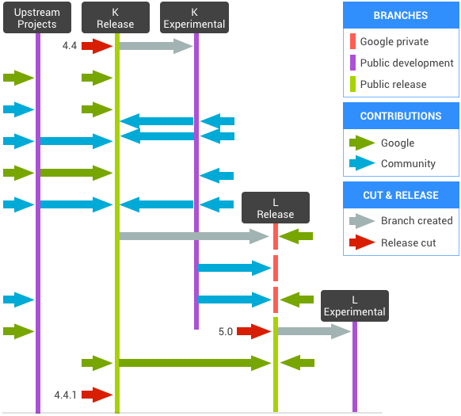

# Android

## 一、[Android 堆栈](https://source.android.com/setup/intro)

Android 是一个针对多种不同设备类型打造的开放源代码软件堆栈。Android 的主要目的是为运营商、OEM 和开发者打造一个开放的软件平台，使他们能够将创新理念变为现实，并推出能够卓有成效地改善用户移动体验的真实产品。

Android 平台的设计可确保不存在一个集中瓶颈，即没有任何行业参与者可一手限制或控制其他参与者的创新。这样，我们不但可以打造功能完善的高品质消费类产品，而且可以完全开放源代码，供第三方自由定制和移植。

## 二、[Android 软件管理](https://source.android.com/setup/start/codelines)

Android 开源项目 (AOSP) 维护着一个全面的软件堆栈，原始设备制造商 (OEM) 和其他设备实现者可移植并在自己的硬件上运行该堆栈。为了保持 Android 项目的质量，Google 分派了全职工程师、产品经理、界面设计师、质量保证测试人员以及将新型设备推向市场所需的所有其他角色来负责相关工作。

相应地，我们还维护着多个代码流水线，以便明确区分当前稳定版 Android 与不稳定的实验性版本。我们将 Android 代码流水线的开放源代码管理和维护工作纳入到了更大的产品开发周期中。

### 1、AOSP 代码管理

下图描述了 AOSP 代码管理和版本背后的概念。

1. 在任何特定时刻，Android 平台都有一个当前最新版本。该版本通常作为树中的一个分支。
2. 设备制造商和贡献者会以当前最新版本为基础来修复错误、发布新设备、试验新功能等。
3. 与此同时，Google 会根据产品的需求和目标，在内部开发下一版 Android 平台和框架。我们会与设备合作伙伴就旗舰设备展开合作来开发下一个 Android 版本，该旗舰设备的规格旨在推动 Android 朝着我们认为它应该选择的方向发展。
4. 当第 n+1 版准备就绪时，它就会发布到公开源代码树，成为新的最新版本。

### 2、术语和注意事项

- 一个版本对应一个正式版 Android 平台（如 Android 1.5 或 Android 8.1）。平台的版本对应于 `AndroidManifest.xml` 文件的 `SdkVersion` 字段中的版本，并且在源代码树中的 `frameworks/base/api` 内定义。
- 上游项目是指 Android 堆栈从中提取代码的开源项目。除了 Linux 内核和 WebKit 等项目以外，我们会继续引入一些半自主性 Android 项目（如 ART、Android SDK 工具、Bionic）作为上游项目进行开发。一般情况下，这些项目完全是在公开树中开发的。对于某些上游项目，开发者直接为上游项目做出贡献。有关详情，请参阅[上游项目](https://source.android.com/setup/contribute/submit-patches.html#upstream-projects)。在这两种情况下，快照会定期纳入版本中。
- 在任何时候，版本代码流水线（可能由 Git 中的多个分支组成）都被视为给定 Android 平台版本的唯一规范源代码。OEM 和开发设备的其他组织应该仅从版本分支中提取源代码。
- 建立实验性代码流水线是为了收集社区贡献的更改，从而在保持稳定性的基础上反复进行改进。
- 被认定为稳定的更改最终会提取到版本分支中。这仅适用于错误修复、应用改进和不影响平台 API 的其他更改。
- 在必要时，更改将从上游项目（包括 Android 上游项目）提取到版本分支中。
- 第 n+1 版（即框架和平台 API 的下一个重大版本）由 Google 在内部开发而成。有关详情，请参阅[不公开代码流水线](https://source.android.com/setup/start/codelines#private-codelines)。
- 在必要时，更改将从上游、版本和实验性分支提取到 Google 的不公开分支。
- 在下一版本的平台 API 实现稳定并经过全面测试后，Google 会定型下一个平台版本的发布版本（特别是新的 `SdkVersion`）。这个版本将对应于作为公开版本分支的内部代码流水线和新的当前平台代码流水线。
- 当某个新的平台版本定型时，Google 会同时创建相应的实验性代码流水线。

## 三、[常见问题解答](https://source.android.com/setup/start/faqs)

### 什么是 Android 开源项目？

Android 开源项目 (AOSP) 与铸就 Android 的人员、流程和源代码有关。

人员负责监督项目并开发源代码。流程是指我们为了管理软件的开发而使用的工具和程序。最终得到是可让您用于手机和其他设备的源代码。

### 我们为什么开放了 Android 源代码？

根据我们自己在开发移动应用方面的经验，Google 启动了 Android 项目。我们希望确保始终有开放的平台可供运营商、原始设备制造商 (OEM) 和开发者使用，以便他们将创新的想法变为现实。另外，我们也希望避免出现任何集中瓶颈，这样的话，就没有任何行业参与者可以一手限制或控制任何其他参与者开展创新。AOSP 有一个最重要的目标，那就是确保尽可能广泛地以兼容的方式实现 Android 开放源代码软件，使每个人都能从中受益。

### Android 是哪种开源项目？

Google 负责监督 Android 开源平台核心部分的开发工作，并致力于打造卓越的开发者和用户社区。在大多数情况下，Android 源代码都是根据宽松的 Apache License 2.0（而非 [Copyleft 许可](http://www.gnu.org/licenses/copyleft.en.html)）授权用户使用。我们之所以选择 Apache 2.0 许可，是因为相信它有助于推动 Android 软件的广泛应用。有关详情，请参阅[许可](https://source.android.com/setup/start/licenses)。

### 为什么由 Google 主管 Android 项目？

开发软件平台是一项非常复杂的工作。开放性对于平台发展的长远成功至关重要，因为开放性会吸引开发者投入其中，并确保公平的竞争环境。不过，平台本身也必须是对用户极具吸引力的产品。

Google 调配了必需的专业工程资源，以确保 Android 是具备充分竞争力的软件平台。Google 将 Android 项目视为一个全方位的产品开发运营项目，并致力于达成必要的业务交易，以确保运行 Android 的卓越设备能够成功走向市场。

通过确保 Android 在用户那里获得成功，我们可以确保 Android 作为平台和开源项目的活力。毕竟，谁不希望 Android 源代码成为一款成功的产品呢？

Google 的目标是确保围绕 Android 打造一个成功的生态系统。我们开放了 Android 源代码，以便任何人都可以修改和分发软件以满足自己的需求。

### Google 在 Android 产品开发方面的总体策略是什么？

我们致力于向竞争激烈的市场推出卓越的设备。有鉴于此，我们会将开发的创新技术和增强功能纳入到下一版本的核心平台中。

在实践中，这意味着 Android 工程团队只侧重于少数“旗舰”设备，并负责开发下一版 Android 软件来为这些产品的发布提供支持。这些旗舰设备可以消化很多产品风险，并为广泛的 OEM 社区开辟新的道路，让他们接下来能够推出更多充分利用新功能的设备。通过这种方式，我们可以确保 Android 平台能够根据现实设备的需求不断发展完善。

### Android 软件是如何开发的？

Android 的每个平台版本（例如 1.5 或 8.1）在开放源代码树中都有对应的分支。最新的分支会被视为“当前稳定”分支版本。这个分支是制造商移植到其设备的分支。该分支会始终保持适合发布的状态。

同时，每个版本还有一个“当前实验性”分支，开发者可以在其中开发实验性贡献内容，例如大规模的下一代功能。在适当情况下，实验性分支中的错误更正内容和其他贡献内容可以纳入到“当前稳定”分支中。

最后，Google 会在开发旗舰设备的同时致力于开发下一版 Android 平台。在适当情况下，该分支将纳入实验性分支和稳定分支中的更改。

如需详细了解代码流水线、分支和版本，请参阅 [AOSP 代码管理](https://source.android.com/setup/start/codelines)。

### 为什么 Android 的部分代码是私下开发的？

将一款设备推向市场通常需要超过一年的时间。设备制造商无疑希望尽可能搭载最新的 Android 软件。与此同时，开发者也不希望在编写应用时还要不断追用该平台的新版本。制造商和开发者都会面临及时推出自家产品与追用最新版本难以两全的状况。

为了解决这个问题，下一版 Android 的部分内容（包括核心平台 API）会在私有分支中进行开发。这些 API 将纳入到下一版 Android 中。我们的目标是，在我们开发下一版平台的同时，让其他人将注意力放在当前稳定版 Android 源代码上。这样一来，开发者和原始设备制造商 (OEM) 便可以使用单个版本，而无需为了跟上 Android 开发步伐而追用尚不完善的未来版本。Android 系统中与应用兼容性无关的其他部分是在开放环境中开发的。我们打算逐渐将其中更多的部分转移到开放的开发环境中。

### 何时发布源代码？

我们会在源代码准备就绪时发布。发布源代码是一个相当复杂的过程。Android 的某些部分是在开放环境中开发的，因此相应的源代码始终可用。还有一些部分最初是在私有树中开发的，并且相应的源代码会在下一个平台版本准备就绪时发布。

对于某些版本，核心平台 API 会提前足够长的时间准备就绪。这种情况下，我们就可以在设备发布之前推出源代码，以便提前了解反馈情况。对于另外一些版本，我们无法做到这一点。在任何情况下，只要我们认为相应版本属于稳定版本且开发流程允许，我们就会发布平台源代码。

### 发布新版 Android 的源代码涉及哪些流程？

发布新版 Android 平台的源代码是一个非常重要的过程。首先，该软件要移植到设备的系统映像中，并通过各种形式的认证，包括手机销售区域的政府监管机构认证。另外，该代码还需要通过运营商测试。这是发布过程的一个重要阶段，因为这项测试有助于检测到软件错误。

在发布事宜得到监管机构和运营商的批准后，制造商将开始大批量生产设备，并且我们将着手发布源代码。

在制造商大批量生产设备的同时，Google 团队将开始为发布开放源代码做一些准备工作。这些准备工作包括进行最终的 API 更改、更新文档（例如，反映在合格性测试期间进行的任何修改）、为新版本准备 SDK，以及发布平台兼容性信息。

我们的法律团队会进行最终的法定签核，以同意将代码发布到开放源代码中。正如开放源代码贡献者需要签署《贡献者许可协议》来证明其拥有所贡献内容的知识产权一样，Google 也必须证明开放源代码没有知识产权方面的纠纷才能进行贡献。

从制造商开始大批量生产设备算起，软件发布过程通常需要大约一个月的时间。这样一来，源代码的发布时间与设备到达用户手中的时间通常差不多。

### AOSP 与 Android 兼容性计划有何关联？

Android 开源项目旨在维护 Android 软件以及开发新版本。由于它的源代码是开放的，因此该软件可用于任何用途，包括以相同的源代码为基础开发与其他设备不兼容的设备。

Android 兼容性计划旨在为 Android 制定与开发者编写的第三方应用兼容的基准实现方式。与 Android 兼容的设备有资格参与 Android 生态系统，其中包括 Google Play；不符合兼容性要求的设备会被排除在该生态系统之外。

也就是说，Android 兼容性计划说明了我们要如何区分“与 Android 兼容的设备”和“只运行 Android 源代码衍生品的设备”。我们欢迎开发者以各种方式使用 Android 源代码，但只有已根据该计划的说明确定为与 Android 兼容的设备才可以参与 Android 生态系统。

### 如何为 Android 做贡献？

您可以报告错误、编写适用于 Android 平台的应用，或者为 Android 开源项目贡献源代码。

关于我们会接受哪些类型的代码贡献内容，我们制定了一些限制条件。例如，有人可能想要贡献备选应用 API（例如完全基于 C++ 的环境）。我们会拒绝这种贡献内容，因为 Android 鼓励开发在 ART 运行时中运行的应用。同样，我们也不会接受与我们的许可目标不符的贡献内容（例如 GPL 或 LGPL 库）。

如果您有意贡献源代码，我们建议您在开始任何相关工作前先通过 [Android 社区](https://source.android.com/setup/community.html)页面中列出的方式与我们联系。有关详情，请参阅[做出贡献](https://source.android.com/setup/contribute/index.html)。

### 如何成为 Android 代码提交者？

Android 开源项目其实并没有“提交者”这一概念。所有贡献内容（包括由 Google 员工创作的内容）都是通过一个名为“Gerrit”的基于网页的系统（该系统是 Android 工程流程的一部分）提交的。该系统与 Git 源代码管理系统协同工作，以便明晰地管理源代码贡献内容。

提交后，相应更改需要获得指定审批者的批准。审批者通常是 Google 员工，但这些审批者也负责审批所有提交内容（不论其来源为何）。

有关详情，请参阅[提交补丁程序](https://source.android.com/setup/contribute/submit-patches.html)。