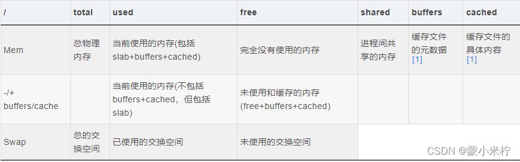
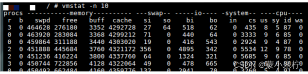

# 【性能】【内存】Android内存分析命令

来源：https://blog.csdn.net/weixin_41572402/article/details/125565274

参考链接：[性能优化工具（十）- Android内存分析命令 - 简书](https://www.jianshu.com/p/9edfe9d5eb34) 

[Android内存分析命令_慢慢的燃烧的博客-CSDN博客](https://blog.csdn.net/u010164190/article/details/72875653)

[dumpsys meminfo 的原理和应用_内核工匠的博客-CSDN博客_dumpsys meminfo源码](https://blog.csdn.net/feelabclihu/article/details/105534175)

 Buffer cached详解 ： [linux下的缓存机制buffer、cache、swap - 运维总结 ["Cannot allocate memory"问题\] - 散尽浮华 - 博客园](https://www.cnblogs.com/kevingrace/p/5991604.html) 

## 一、概述

### 1、 内存指标概念

| Item | 全称                  | 含义     | 等价                         |
| ---- | --------------------- | -------- | ---------------------------- |
| USS  | Unique Set Size       | 物理内存 | 进程独占的内存               |
| PSS  | Proportional Set Size | 物理内存 | PSS= USS+ 按比例包含共享库   |
| RSS  | Resident Set Size     | 物理内存 | RSS= USS+ 包含共享库         |
| VSS  | Virtual Set Size      | 虚拟内存 | VSS= RSS+ 未分配实际物理内存 |

故内存的大小关系：VSS >= RSS >= PSS >= USS

### 2、内存分析命令

常用的内存调优分析命令：

1. `dumpsys meminfo` 适用场景： 查看进程的oom adj，或者dalvik/native等区域内存情况，或者某个进程或apk的内存情况，功能非常强大；
2. `cat /proc/meminfo` 适用场景： 查看系统的详尽内存信息，包含内核情况；
3. `procrank` 适用场景： 查看进程的VSS/RSS/PSS/USS各个内存指标；
4. `free` 适用场景： 只查看系统的可用内存以及swap分区的情况；
5. `showmap` 适用场景： 查看进程的虚拟地址空间的内存分配情况；
6. `vmstat` 适用场景： 周期性地打印出进程运行队列、系统切换、CPU时间占比等情况；

## 二、 命令说明

### 1、dumpsys meminfo

#### 1.1 dumpsys meminfo命令的输出结果分以下4部分：

| 序列 | 划分类型 | 排序 | 解释                                                         |                                                              |
| ---- | -------- | ---- | ------------------------------------------------------------ | ------------------------------------------------------------ |
| 1    | process  | PSS  | 以进程的PSS从大到小依次排序显示，每行显示一个进程；          |                                                              |
| 2    | OOM adj  | PSS  | Native/System/Persistent/Foreground/Visible/Perceptible/A Services/Home/B Services/Cached，分别显示每类的进程情况 | 以进程的OOM ADJ值(/proc/pid/oom_score_adj)。对于Cached的进程，其ADJ很小(<900)，这部分进程的内存占用计算到了Free RAM中，即系统认为这部分进程是可以回收的。 |
| 3    | category | PSS  | 以Dalvik/Native/.art mmap/.dex map等划分的各类进程的总PSS情况 | 以内存占用的类型分类来统计进程的PSS.                         |
| 4    | total    | -    | 总内存、剩余内存、可用内存、其他内存                         |                                                              |

命令内容：太长了省略....

重点关注 整体情况：

**Total RAM**: 内存总数，与proc/meminfo中memTotal一致；

**Free RAM**: (cached pss + cached kernel +free) 手机剩余内存一般看它；

- cached pss ： dumpsys meminfo中cacheAPP pss总和；

- cache kernel ：meminfo中Cached+Buffers+SReclaimable - Mapped;
- free：proc/meminfo中的MemFree

**ION**:  430,596K ( 23,384K mapped + 133,332K unmapped + 273,880K pools) .....

**Used RAM**: (used pss + kernel)

- Used pss：native process PSS+dumpsys meminfo app除cached部分的pss总和;
- Kernel：指kernel占用，即proc/meminfo的shmem+sunreclaim+pagetables+kernelstack+vmallocused;

**Lost RAM**: MemTotal-(totalpss-totalswappss)-memfree-cached- usedRAM中kernel部分 - zramTotal;

- **ZRAM**:15,996K physical used for  58,120K in swap (8,388,604K total swap)：zram swap转换情况

  - 15,996K physical used --- zram total
  - 58,120K in swap --- proc/meminfo中 swapTotal - swapFree
  - 8,388,604K total swap --- proc/meminfo中 swapTotal

- **Tuning**:  256  (large 512), oom 525000 kB, restore limit 175000 kB (high-end-gfx) ：

  - 256 --- dalvik.vm.heapgrowthlimit
  - large 512 --- dalvik.vm.heapsize

  - oom 525000 kB ---ProcessList中mOomMinfree数组最后一个元素取值
  - restore limit 175000 kB --- 
  - high-end-gfx --- [ro.config.hw_low_ram]: [false] 

#### 1.2 另外，可只输出某个pid或package的进程信息：

dumpsys meminfo <pid> // 输出指定pid的某一进程，是显示指定pid进程的PSS内存占用详细信息；

dumpsys meminfo --package <packagename> // 输出指定包名的进程，可能包含多个进程；

原理以及解释参考：[dumpsys meminfo 的原理和应用_内核工匠的博客-CSDN博客_dumpsys meminfo源码](https://blog.csdn.net/feelabclihu/article/details/105534175) 

/proc/pid/smaps展示的所有VMA的详细信息是 dumpsys meminfo pid 显示的基础。

## 2、cat /proc/meminfo详解

**MemTotal**:         877368 kB  ：所有可用RAM大小（即物理内存减去一些硬件预留位和内核的二进制代码大小）,系统从加电开始到引导完成，BIOS等要保留一些内存，内核要保留一些内存，最后剩下可供系统支配的内存就是MemTotal。这个值在系统运行期间一般是固定不变的。

**MemFree**:           22516 kB  ：被系统留着未使用的内存,MemFree是说的系统层面;

**MemAvailable**:     470244 kB  ：应用程序可用内存数。系统中有些内存虽然已被使用但是可以回收的，比如cache/buffer、slab都有一部分可以回收，所以MemFree不能代表全部可用的内存，这部分可回收的内存加上MemFree才是系统可用的内存，即：MemAvailable≈MemFree+Buffers+Cached，它是内核使用特定的算法计算出来的，是一个估计,MemAvailable是说的应用程序层面

**Buffers**:            1772 kB  ：Buffers 是对原始磁盘块的临时存储，也就是用来缓存磁盘的数据（优化block IO），通常不会特别大（20MB 左右）。这样，内核就可以把分散的写集中起来，统一优化磁盘的写入，比如可以把多次小的写合并成单次大的写等等。**Buffer：缓冲区，一个用于存储速度不同步的设备或优先级不同的设备之间传输数据的区域**。通过buffer可以减少进程间通信需要等待的时间，当存储速度快的设备与存储速度慢的设备进行通信时，存储慢的数据先把数据存放到buffer，达到一定程度存储快的设备再读取buffer的数据，在此期间存储快的设备CPU可以干其他的事情。Buffer：一般是用在写入磁盘的，例如：某个进程要求多个字段被读入，当所有要求的字段被读入之前已经读入的字段会先放到buffer中。Buffer是根据磁盘的读写设计的，把分散的写操作集中进行，减少磁盘碎片和硬盘的反复寻道，从而提高系统性能。linux有一个守护进程定期清空缓冲内容（即写入磁盘），也可以通过sync命令手动清空缓冲。

比如说吐鲁番的葡萄熟了，要用大卡车装葡萄运出去卖果园的姑娘采摘葡萄，当然不是前手把葡萄摘下来,后手就放到卡车上，而是需要一个中间过程"箩筐"：摘葡萄→放到箩筐里→把箩筐里的葡萄倒入卡车。也就是说，虽然最终目的是"把葡萄倒入卡车"，但中间必须要经过"箩筐"的转手，这里的箩筐就是Buffer。是"暂时存放物品的空间"。

**Cached**:           459224 kB  ：Cached 是从磁盘读取文件的页缓存，也就是用来缓存从文件读取的数据。这样，下次访问这些文件数据时，就可以直接从cache中快速获取，而不需要再次访问缓慢的磁盘。 **Cache：缓冲区，高速缓存，是位于CPU与主内存间的一种容量较小但速度很高的存储器**。由于CPU的速度远高于主内存，CPU直接从内存中存取数据要等待一定时间周期，Cache中保存着CPU刚用过或循环使用的一部分数据，当CPU再次使用该部分数据时可从Cache中直接调用,这样就减少了CPU的等待时间,提高了系统的效率。Cache又分为一级Cache(L1 Cache)和二级Cache(L2 Cache)，L1 Cache集成在CPU内部，L2 Cache早期一般是焊在主板上,现在也都集成在CPU内部，常见的容量有256KB或512KB L2 Cache。它是根据程序的局部性原理而设计的，就是cpu执行的指令和访问的数据往往在集中的某一块，所以把这块内容放入cache后，cpu就不用在访问内存了，这就提高了访问速度。当然若cache中没有cpu所需要的内容，还是要访问内存的。从内存读取与磁盘读取角度考虑，cache可以理解为操作系统为了更高的读取效率，更多的使用内存来缓存可能被再次访问的数据。Cache并不是缓存文件的，而是缓存块的(块是I/O读写最小的单元)；Cache一般会用在I/O请求上，如果多个进程要访问某个文件，可以把此文件读入Cache中，这样下一个进程获取CPU控制权并访问此文件直接从Cache读取，提高系统性能。

Buffers & Cached两者都是RAM中的数据，简单来说，buffer是即将要被写入磁盘的，而cache是被从磁盘中读出来的。

**SwapCached**:           16 kB  ：被高速缓冲存储器（cache memory）用的交换空间的大小，已经被交换出来的内存，但仍然被存放在swapfile中。用来在需要的时候很快的被替换而不需要再次打开I/O端口

**Active**:           333148 kB  ：在活跃使用中的缓冲或高速缓冲存储器页面文件的大小，除非非常必要否则不会被移作他用. (Active(anon) + Active(file))

**Inactive**:         330384 kB  ：在不经常使用中的缓冲或高速缓冲存储器页面文件的大小，可能被用于其他途径. (Inactive(anon) + Inactive(file))

**Active**(anon):     104368 kB  ：活跃的与文件无关的内存（比如进程的堆栈，用malloc申请的内存）(anonymous pages),anonymous pages在发生换页时，是对交换区进行读/写操作

**Inactive**(anon):   104508 kB  ：非活跃的与文件无关的内存（比如进程的堆栈，用malloc申请的内存）

**Active**(file):     228780 kB  ：活跃的与文件关联的内存（比如程序文件、数据文件所对应的内存页）(file-backed pages) File-backed pages在发生换页(page-in或page-out)时，是从它对应的文件读入或写出

**Inactive**(file):  225876 kB  ：非活跃的与文件关联的内存（比如程序文件、数据文件所对应的内存页）

**Unevictable**:     6708 kB  ：

**Mlocked**:       1428 kB  ：

**SwapTotal**:        614396 kB  ：交换空间的总大小

**SwapFree**:         611044 kB  ：未被使用交换空间的大小

**Dirty**:                40 kB  ：等待被写回到磁盘的内存大小

**Writeback**:             0 kB  ：正在被写回到磁盘的内存大小

**AnonPages**:        209224 kB  ：未映射页的内存大小

**Mapped**:           280668 kB  ：设备和文件等映射的大小

**Shmem**:              1084 kB  ：进程间共同使用的共享内存

**Slab**:              59840 kB  ：内核数据结构缓存的大小，可以减少申请和释放内存带来的消耗

**SReclaimable**:      34196 kB  ：可收回Slab的大小

**SUnreclaim**:        25644 kB  ：不可收回Slab的大小（SUnreclaim+SReclaimable＝Slab）

**KernelStack**:        7504 kB  ：常驻内存,每一个用户线程都会分配一个kernel stack(内核栈)（每个用户线程都会分配一个Kernel Stack，系统调用syscall、trap、exception后进入内核态执行代码时候使用）

**PageTables**:        15508 kB  ：管理内存分页页面的索引表的大小

**NFS_Unstable**:          0 kB  ：不稳定页表的大小

**Bounce**:                0 kB  ：

**WritebackTmp**:          0 kB  ：

**CommitLimit**:     1053080 kB  ：根据超额分配比率（'vm.overcommit_ratio'），这是当前在系统上分配可用的内存总量，这个限制只是在模式2('vm.overcommit_memory')时启用。CommitLimit用以下公式计算：CommitLimit =（'vm.overcommit_ratio'*物理内存）+交换例如，在具有1G物理RAM和7G swap的系统上，当`vm.overcommit_ratio` = 30时 CommitLimit =7.3G

**Committed_AS**:   16368536 kB  ：目前在系统上分配的内存量。是所有进程申请的内存的总和，即时所有申请的内存没有被完全使用，例如一个进程申请了1G内存，仅仅使用了300M，但是这1G内存的申请已经被 "committed"给了VM虚拟机，进程可以在任何时间使用。如果限制在模式2('vm.overcommit_memory')时启用，分配超出CommitLimit内存将不被允许

**VmallocTotal**:     245760 kB  ：可以vmalloc虚拟内存大小

**VmallocUsed**:           0 kB  ：vmalloc已使用的虚拟内存大小

**VmallocChunk**:          0 kB  ：最大的连续未被使用的vmalloc区域

## 3、procrank

功能： 获取所有进程的内存使用的排行榜，排行是以Pss的大小而排序。procrank命令比dumpsys meminfo命令，能输出更详细的VSS/RSS/PSS/USS内存指标。

最后一行输出下面6个指标：

free

buffers

cached

shmem

slab

## 4、free

主功能：查看可用内存，缺省单位KB。该命令比较简单、轻量，专注于查看剩余内存情况。数据来源于/proc/meminfo。

注：free命令默认单位为kb , -m 单位为Mb;

## 5、showmap

主功能：用于查看虚拟地址区域的内存情况

用法： showmap -a [pid]

该命令的输出每一行代表一个虚拟地址区域(vm area)

1. start addr和end addr:分别代表进程空间的起止虚拟地址；
2. virtual size/ RSS /PSS这些前面介绍过；
3. shared clean：代表多个进程的虚拟地址可指向这块物理空间，即有多少个进程共享这个库；
4. shared: 共享数据
5. private: 该进程私有数据
6. clean: 干净数据，是指该内存数据与disk数据一致，当内存紧张时，可直接释放内存，不需要回写到disk
7. dirty: 脏数据，与disk数据不一致，需要先回写到disk，才能被释放。

功能与**cat /proc/[pid]/maps**基本一致。maps 文件可以查看某个进程的代码段、栈区、堆区、动态库、内核区对应的虚拟地址;

## 6、Vmstat

主功能：不仅可以查看内存情况，还可以查看进程运行队列、系统切换、CPU时间占比等情况，另外该指令还是周期性地动态输出。

参数列总共15个参数，分为4大类：

**memory**： 

1. **swpd**: 切换到内存交换区的内存数量(k表示)。如果swpd的值不为0，或者比较大，比如超过了100m，只要si、so的值长期为0，系统性能还是正常
2. **free**：空闲物理内存总量；当前的空闲页面列表中内存数量(k表示)
3. **buffer**：用于buffer 的内存总量；作为buffer cache的内存数量，一般对块设备的读写才需要缓冲。
4. **cache**：用于cache 的内存总量；作为page cache的内存数量，一般作为文件系统的cache，如果cache较大，说明用到cache的文件较多，如果此时IO中bi比较小，说明文件系统效率比较好。

**swap**:

1. **si**：从磁盘交换进内存的数据速率(kb/s)，以内存为参考点
2. **so**：从内存交换至磁盘的数据速率(kb/s)，以内存为参考点

**io**：

1. **bi**:从块设备读入数据到系统的速率(kb/s)，以内存为参考点
2. **bo**:保存数据至块设备的速率，以内存为参考点

**system**： 

1. **in**:interrupts 中断速率，包括时钟
2. **cs**:context switch 进程切换速率,上下文切换

**cpu**：

1. **us**:Time spent running non-kernel code
2. **sy**:Time spent running kernel code
3. **id**:Time spent idle. Linux 2.5.41 前, 包括IO-wait time.
4. **wa**:Time spent waiting for IO. 2.5.41 前，包括in idle.

## 7、cat proc/vmstat

nr_free_pages 467897    系统剩余free内存量

nr_zone_inactive_anon 123109  系统中不活跃匿名页量，只有一个zone，这里zone可代表系统

nr_zone_active_anon 269363  系统中活跃的匿名页量

nr_zone_inactive_file 275027  系统中不活跃的匿名文件页量

nr_zone_active_file 356114    系统中活跃的匿名文件页量

nr_zone_unevictable 3549  

nr_zone_write_pending 6

nr_mlock 1010

nr_page_table_pages 22101

nr_kernel_stack 68976

nr_shadow_call_stack_bytes 17661952

nr_bounce 0

nr_zspages 21506

nr_free_cma 0

nr_inactive_anon 123109

nr_active_anon 269363

nr_inactive_file 275027

nr_active_file 356114

nr_unevictable 3549

nr_slab_reclaimable 33639

nr_slab_unreclaimable 78100

nr_isolated_anon 0

nr_isolated_file 0

workingset_nodes 28317

workingset_refault 1339835

workingset_activate 486323

workingset_restore 188696

workingset_nodereclaim 0

nr_anon_pages 380069

nr_mapped 226218

nr_file_pages 658188

nr_dirty 6

nr_writeback 0

nr_writeback_temp 0

nr_shmem 12173

nr_shmem_hugepages 0

nr_shmem_pmdmapped 0

nr_file_hugepages 0

nr_file_pmdmapped 0

nr_anon_transparent_hugepages 0

nr_unstable 0

nr_vmscan_write 253963

nr_vmscan_immediate_reclaim 82

nr_dirtied 6010922

nr_written 5830560

nr_kernel_misc_reclaimable 127553

nr_unreclaimable_pages 56856

nr_dirty_threshold 217434

nr_dirty_background_threshold 54159

pgpgin 11253268    从启动到现在读入的内存页数

pgpgout 22574664    从启动到现在换出的内存页数

pgpgoutclean 542620

**pswpin 128351      从启动到现在读入的交换分区页数**

**pswpout 253938    从启动到现在换出的交换分区页数**

pgalloc_normal 70249621

pgalloc_movable 0

allocstall_normal 1

**allocstall_movable 45    从启动到现在 请求直接回收的页面数，即 direct reclaim；**

pgskip_normal 0

pgskip_movable 0

pgfree 71459653

pgactivate 3598661

pgdeactivate 1996831

pglazyfree 939

pgfault 5242534

pgmajfault 162738

pglazyfreed 0

pgrefill 2116323

pgsteal_kswapd 4730933

pgsteal_direct 0

pgscan_kswapd 5057566    从启动到现在kswapd后台进程扫描页面数

pgscan_direct 0

pgscan_direct_throttle 0

pginodesteal 0    从启动到现在通过释放i节点回收的页面数

slabs_scanned 4482973

kswapd_inodesteal 418283    从启动到现在由kswapd通过释放i节点回收的页面数

kswapd_low_wmark_hit_quickly 2130

kswapd_high_wmark_hit_quickly 33

**pageoutrun 3369        从启动到现在通过kswapd调用来回收的页面数**

pgrotated 7758    从启动到现在轮换的页面数

drop_pagecache 0

drop_slab 0

oom_kill 0

pgmigrate_success 728348

pgmigrate_fail 12832

compact_migrate_scanned 1348452

compact_free_scanned 12108360

compact_isolated 1491737

compact_stall 3

compact_fail 1

compact_success 2

compact_daemon_wake 2752

compact_daemon_migrate_scanned 1347159

compact_daemon_free_scanned 12100034

unevictable_pgs_culled 5237

unevictable_pgs_scanned 0

unevictable_pgs_rescued 1688

unevictable_pgs_mlocked 2901

unevictable_pgs_munlocked 1692

unevictable_pgs_cleared 199

unevictable_pgs_stranded 199

thp_fault_alloc 0

thp_fault_fallback 0

thp_collapse_alloc 0

thp_collapse_alloc_failed 0

thp_file_alloc 0

thp_file_mapped 0

thp_split_page 0

thp_split_page_failed 0

thp_deferred_split_page 0

thp_split_pmd 0

thp_zero_page_alloc 0

thp_zero_page_alloc_failed 0

thp_swpout 0

thp_swpout_fallback 0

swap_ra 0

swap_ra_hit 69

speculative_pgfault_anon 45412044

speculative_pgfault_file 8497650

