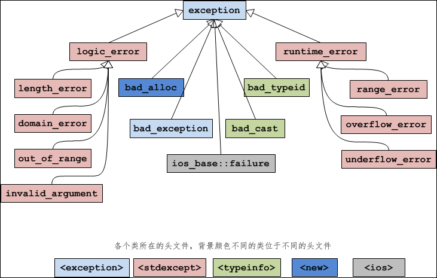

# 异常处理

## 一、捕获异常

借助 C++ 异常机制来捕获异常，避免程序崩溃。捕获异常的语法为：

```c++
try{
    // 可能抛出异常的语句
}catch(exceptionType variable){
    // 处理异常的语句
}
```

catch 关键字后面的`exceptionType variable`指明了当前 catch 可以处理的异常类型，以及具体的出错信息。

```c++
#include <exception>
#include <iostream>
#include <string>
using namespace std;

int main() {
    string str = "hahahahahah";

    try {
        char ch1 = str[100];
        cout << ch1 << endl;
    } catch (exception e) {
        cout << "[1]out of bound!" << endl;
    }
    try {
        char ch2 = str.at(100);
        cout << ch2 << endl;
    } catch (exception &e) {  // exception类位于<exception>头文件中
        cout << "[2]out of bound!" << endl;
    }
    return 0;
}

// \x00
// [2]out of bound!
```

### 发生异常的位置

`throw`关键字用来抛出一个异常，这个异常会被 try 检测到，进而被 catch 捕获

```c++
#include <exception>
#include <iostream>
#include <string>
using namespace std;

int main() {
    try {
        throw "Unknown Exception";  //抛出异常
        cout << "This statement will not be executed." << endl;
    } catch (const char*& e) {
        cout << e << endl;
    }
    return 0;
}
// Unknown Exception
```

## 二、异常类型以及多级catch匹配

`exceptionType`是异常类型，它指明了当前的 catch 可以处理什么类型的异常；`variable`是一个变量，用来接收异常信息。当程序抛出异常时，会创建一份数据，这份数据包含了错误信息，程序员可以根据这些信息来判断到底出了什么问题，接下来怎么处理。

异常既然是一份数据，那么就应该有数据类型。C++ 规定，异常类型可以是 int、char、float、bool 等基本类型，也可以是指针、数组、字符串、结构体、类等聚合类型。C++ 语言本身以及标准库中的函数抛出的异常，都是 exception 类或其子类的异常。也就是说，抛出异常时，会创建一个 exception 类或其子类的对象。

`exceptionType variable`和函数的形参非常类似，当异常发生后，会将异常数据传递给 variable 这个变量，这和函数传参的过程类似。当然，只有跟 exceptionType 类型匹配的异常数据才会被传递给 variable，否则 catch 不会接收这份异常数据，也不会执行 catch 块中的语句。换句话说，catch 不会处理当前的异常。

另外需要注意的是，如果不希望 catch 处理异常数据，也可以将 variable 省略掉

### 多级 catch

```c++
try{
    //可能抛出异常的语句
}catch (exception_type_1 e){
    //处理异常的语句
}catch (exception_type_2 e){
    //处理异常的语句
}
//其他的catch
catch (exception_type_n e){
    //处理异常的语句
}
```

当异常发生时，程序会按照**从上到下的顺序**，将异常类型和 catch 所能接收的类型逐个匹配。一旦找到类型匹配的 catch 就停止检索，并将异常交给当前的 catch 处理（其他的 catch 不会被执行）。如果最终也没有找到匹配的 catch，就只能交给系统处理，终止程序的运行。

```c++
#include <iostream>
#include <string>
using namespace std;

class Base {};
class Derived : public Base {};

int main() {
    try {
        throw Derived();  //抛出自己的异常类型，实际上是创建一个Derived类型的匿名对象
        cout << "This statement will not be executed." << endl;
    } catch (int) {
        cout << "Exception type: int" << endl;
    } catch (char *) {
        cout << "Exception type: cahr *" << endl;
    } catch (Base) {  //匹配成功（向上转型）
        cout << "Exception type: Base" << endl;
    } catch (Derived) {
        cout << "Exception type: Derived" << endl;
    }
    return 0;
}

// Exception type: Base
```

我们期望的是，异常被`catch(Derived)`捕获，但是从输出结果可以看出，异常提前被`catch(Base)`捕获了，这说明 catch 在匹配异常类型时发生了[向上转型（Upcasting）](http://c.biancheng.net/view/2284.html)

### catch 在匹配过程中的类型转换

C/C++ 中存在多种多样的类型转换，以普通函数（非模板函数）为例，发生函数调用时，如果实参和形参的类型不是严格匹配，那么会将实参的类型进行适当的转换，以适应形参的类型，这些转换包括：

- 算数转换：例如 int 转换为 float，char 转换为 int，double 转换为 int 等。
- 向上转型：也就是派生类向基类的转换
- const 转换：也即将非 const 类型转换为 const 类型，例如将 char * 转换为 const char *。
- 数组或函数指针转换：如果函数形参不是引用类型，那么数组名会转换为数组指针，函数名也会转换为函数指针。
- 用户自定的类型转换。

catch 在匹配异常类型的过程中，也会进行类型转换，但是这种转换受到了更多的限制，仅能进行「向上转型」、「const 转换」和「数组或函数指针转换」，其他的都不能应用于 catch。

## 三、throw（抛出异常）

异常处理的流程，具体为：

```c++
抛出（Throw）--> 检测（Try） --> 捕获（Catch）
```

异常必须显式地抛出，才能被检测和捕获到；如果没有显式的抛出，即使有异常也检测不到。

在 C++ 中，我们使用 throw 关键字来显式地抛出异常，它的用法为：

```c++
throw exceptionData;
```

exceptionData 是“异常数据”的意思，它可以包含任意的信息，完全有程序员决定。exceptionData 可以是 int、float、bool 等基本类型，也可以是指针、数组、字符串、结构体、类等聚合类型，请看下面的例子：

```c++
char str[] = "hahahahah";
char *pstr = str;
class Base{};
Base obj;
throw 100;  //int 类型
throw str;  //数组类型
throw pstr;  //指针类型
throw obj;  //对象类型
```

## 四、exception类

语言本身或者标准库抛出的异常都是 exception 的子类，称为标准异常。你可以通过下面的语句来捕获所有的标准异常：

```c++
try {
    //可能抛出异常的语句
} catch (exception &e) {
    //处理异常的语句
}
```

> 之所以使用引用，是为了提高效率。如果不使用引用，就要经历一次对象拷贝（要调用拷贝构造函数）的过程

exception 类位于 `<exception>` 头文件中，它被声明为：

```c++
class exception{
public:
    exception () throw();  //构造函数
    exception (const exception&) throw();  //拷贝构造函数
    exception& operator= (const exception&) throw();  //运算符重载
    virtual ~exception() throw();  //虚析构函数
    virtual const char* what() const throw();  //虚函数
}
```

这里需要说明的是 what() 函数。what() 函数返回一个能识别异常的字符串，正如它的名字“what”一样，可以粗略地告诉你这是什么异常。不过C++标准并没有规定这个字符串的格式，各个编译器的实现也不同，所以 what() 的返回值仅供参考。

下图展示了 exception 类的继承层次：



先来看一下 exception 类的直接派生类：

| 异常名称          | 说  明                                                       |
| ----------------- | ------------------------------------------------------------ |
| logic_error       | 逻辑错误。                                                   |
| runtime_error     | 运行时错误。                                                 |
| bad_alloc         | 使用 new 或 new[ ] 分配内存失败时抛出的异常。                |
| bad_typeid        | 使用 typeid 操作一个 NULL [指针](http://c.biancheng.net/c/80/)，而且该指针是带有虚函数的类，这时抛出 bad_typeid 异常。 |
| bad_cast          | 使用 dynamic_cast 转换失败时抛出的异常。                     |
| ios_base::failure | io 过程中出现的异常。                                        |
| bad_exception     | 这是个特殊的异常，如果函数的异常列表里声明了 bad_exception 异常，当函数内部抛出了异常列表中没有的异常时，如果调用的 unexpected() 函数中抛出了异常，不论什么类型，都会被替换为 bad_exception 类型。 |

logic_error 的派生类： 

| 异常名称         | 说  明                                                       |
| ---------------- | ------------------------------------------------------------ |
| length_error     | 试图生成一个超出该类型最大长度的对象时抛出该异常，例如 vector 的 resize 操作。 |
| domain_error     | 参数的值域错误，主要用在数学函数中，例如使用一个负值调用只能操作非负数的函数。 |
| out_of_range     | 超出有效范围。                                               |
| invalid_argument | 参数不合适。在标准库中，当利用string对象构造 bitset 时，而 string 中的字符不是 0 或1 的时候，抛出该异常。 |

runtime_error 的派生类： 

| 异常名称        | 说  明                           |
| --------------- | -------------------------------- |
| range_error     | 计算结果超出了有意义的值域范围。 |
| overflow_error  | 算术计算上溢。                   |
| underflow_error | 算术计算下溢。                   |
